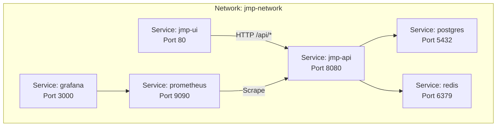
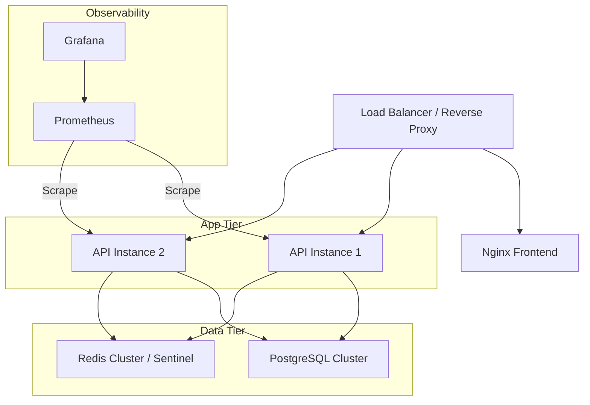
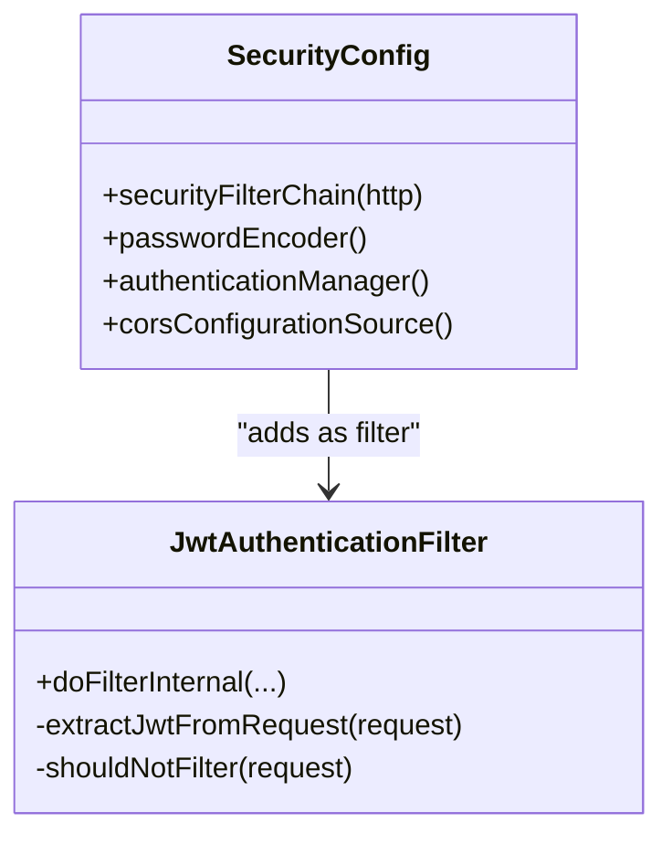
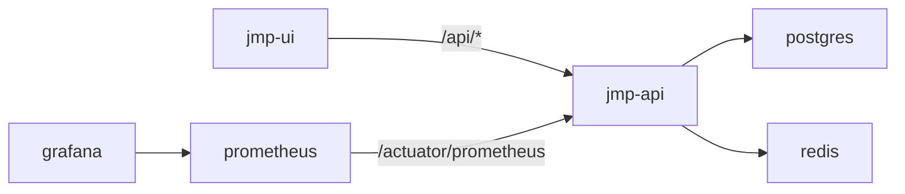
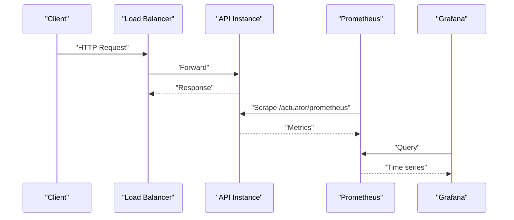

# Production Deployment

<cite>
**Referenced Files in This Document**
- [docker-compose.yml](file://docker-compose.yml)
- [Dockerfile](file://Dockerfile)
- [application.yml](file://jmp-web/src/main/resources/application.yml)
- [prometheus.yml](file://monitoring/prometheus.yml)
- [datasources.yml](file://monitoring/grafana/datasources/datasources.yml)
- [SecurityConfig.java](file://jmp-infrastructure/src/main/java/com/jmp/infrastructure/security/SecurityConfig.java)
- [JwtAuthenticationFilter.java](file://jmp-infrastructure/src/main/java/com/jmp/infrastructure/security/JwtAuthenticationFilter.java)
- [S3StorageService.java](file://jmp-infrastructure/src/main/java/com/jmp/infrastructure/storage/S3StorageService.java)
- [StorageService.java](file://jmp-application/src/main/java/com/jmp/application/service/StorageService.java)
- [V1__init_schema.sql](file://jmp-web/src/main/resources/db/migration/V1__init_schema.sql)
- [V2__seed_data.sql](file://jmp-web/src/main/resources/db/migration/V2__seed_data.sql)
- [nginx.conf](file://jmp-ui/nginx.conf)
- [jmp-ui Dockerfile](file://jmp-ui/Dockerfile)
</cite>

## Table of Contents
1. [Introduction](#introduction)
2. [Project Structure](#project-structure)
3. [Core Components](#core-components)
4. [Architecture Overview](#architecture-overview)
5. [Detailed Component Analysis](#detailed-component-analysis)
6. [Dependency Analysis](#dependency-analysis)
7. [Performance Considerations](#performance-considerations)
8. [Security Hardening and Network Segmentation](#security-hardening-and-network-segmentation)
9. [Capacity Planning and Scaling](#capacity-planning-and-scaling)
10. [Backup and Disaster Recovery](#backup-and-disaster-recovery)
11. [Monitoring and Alerting](#monitoring-and-alerting)
12. [Troubleshooting Guide](#troubleshooting-guide)
13. [Conclusion](#conclusion)

## Introduction
This document provides enterprise-grade production deployment guidance for the Jitsi Management Platform (JMP). It covers high availability, load balancing, failover, database and cache clustering, distributed caching strategies, security hardening, capacity planning, performance tuning, backup and disaster recovery, monitoring and alerting, and operational excellence. The content is grounded in the repository’s configuration and code artifacts to ensure practical applicability.

## Project Structure
The platform consists of:
- Backend API service (Spring Boot) with embedded actuator metrics
- PostgreSQL database with Flyway migrations
- Redis cache
- Prometheus and Grafana for observability
- React frontend served via Nginx
- Docker Compose orchestration for local development and minimal production setups

**Diagram sources**
- [docker-compose.yml:6-129](file://docker-compose.yml#L6-L129)
- [prometheus.yml:18-22](file://monitoring/prometheus.yml#L18-L22)
- [datasources.yml:4-11](file://monitoring/grafana/datasources/datasources.yml#L4-L11)
- [nginx.conf:24-35](file://jmp-ui/nginx.conf#L24-L35)

**Section sources**
- [docker-compose.yml:1-129](file://docker-compose.yml#L1-L129)
- [Dockerfile:1-54](file://Dockerfile#L1-L54)
- [application.yml:1-128](file://jmp-web/src/main/resources/application.yml#L1-L128)

## Core Components
- Backend API: Java 21 runtime, Spring Boot, HikariCP, Hibernate, Flyway, Actuator/Prometheus metrics, JWT-based stateless authentication, CORS configuration.
- Database: PostgreSQL 16 with UUID extension, schema and seed migrations.
- Cache: Redis 7 for session-like caching and rate limiting.
- Observability: Prometheus scraping /actuator/prometheus, Grafana configured as Prometheus datasource.
- Frontend: React built with Vite, served by Nginx with proxy to backend and asset caching.

**Section sources**
- [application.yml:12-128](file://jmp-web/src/main/resources/application.yml#L12-L128)
- [V1__init_schema.sql:1-172](file://jmp-web/src/main/resources/db/migration/V1__init_schema.sql#L1-L172)
- [V2__seed_data.sql:1-131](file://jmp-web/src/main/resources/db/migration/V2__seed_data.sql#L1-L131)
- [prometheus.yml:1-23](file://monitoring/prometheus.yml#L1-L23)
- [datasources.yml:1-11](file://monitoring/grafana/datasources/datasources.yml#L1-L11)
- [nginx.conf:1-37](file://jmp-ui/nginx.conf#L1-L37)

## Architecture Overview
The system is composed of stateless API tier, shared state via PostgreSQL and Redis, and a frontend gateway. Health checks and readiness probes are defined at container level and via Spring Actuator.

[No sources needed since this diagram shows conceptual architecture, not a direct code mapping]

## Detailed Component Analysis

### Database Layer (PostgreSQL)
- Schema and indexes are defined in the initial migration, including tenants, users, roles, permissions, conferences, and participants.
- Seed data initializes default tenant, system permissions, roles, and admin users.
- Flyway is enabled with schema management and baseline-on-migrate.

Operational implications:
- Use managed PostgreSQL (e.g., RDS/Azure DB) with automated backups, read replicas, and point-in-time recovery.
- Apply schema changes via Flyway-managed migrations in CI/CD.
- Monitor slow queries and index usage; maintain statistics regularly.

**Section sources**
- [V1__init_schema.sql:1-172](file://jmp-web/src/main/resources/db/migration/V1__init_schema.sql#L1-L172)
- [V2__seed_data.sql:1-131](file://jmp-web/src/main/resources/db/migration/V2__seed_data.sql#L1-L131)
- [application.yml:39-44](file://jmp-web/src/main/resources/application.yml#L39-L44)

### Cache Layer (Redis)
- Redis is configured for connection pooling and timeouts; the backend reads host/port from environment.
- For production, deploy Redis in cluster mode or Sentinel for HA and automatic failover.

Operational implications:
- Use Redis Sentinel or Redis Cluster behind a virtual IP or DNS alias.
- Tune pool sizes and timeouts per workload; monitor memory and eviction policies.
- Separate namespaces for sessions, rate limits, and short-lived caches.

**Section sources**
- [application.yml:46-56](file://jmp-web/src/main/resources/application.yml#L46-L56)
- [docker-compose.yml:27-42](file://docker-compose.yml#L27-L42)

### API Service (Spring Boot)
- Stateless JWT authentication with BCrypt encoder and CORS configuration.
- Actuator exposes health, info, metrics, and Prometheus endpoint.
- Compression enabled; Jackson settings tuned; logging supports structured JSON.

Operational implications:
- Run multiple instances behind a load balancer for HA.
- Use secrets management for JWT secrets and database credentials.
- Harden JVM flags and container runtime for security and stability.

**Diagram sources**
- [SecurityConfig.java:42-88](file://jmp-infrastructure/src/main/java/com/jmp/infrastructure/security/SecurityConfig.java#L42-L88)
- [JwtAuthenticationFilter.java:39-95](file://jmp-infrastructure/src/main/java/com/jmp/infrastructure/security/JwtAuthenticationFilter.java#L39-L95)

**Section sources**
- [SecurityConfig.java:1-90](file://jmp-infrastructure/src/main/java/com/jmp/infrastructure/security/SecurityConfig.java#L1-L90)
- [JwtAuthenticationFilter.java:1-122](file://jmp-infrastructure/src/main/java/com/jmp/infrastructure/security/JwtAuthenticationFilter.java#L1-L122)
- [application.yml:71-128](file://jmp-web/src/main/resources/application.yml#L71-L128)
- [Dockerfile:47-50](file://Dockerfile#L47-L50)

### Frontend Gateway (Nginx)
- Serves static assets with long-lived caching and gzip.
- Proxies API requests to backend with proper headers and WebSocket upgrade support.

Operational implications:
- Place behind CDN and WAF for DDoS protection and TLS termination.
- Use sticky sessions only if required; otherwise rely on stateless API.

**Section sources**
- [nginx.conf:1-37](file://jmp-ui/nginx.conf#L1-L37)
- [jmp-ui Dockerfile:1-33](file://jmp-ui/Dockerfile#L1-L33)

### Storage Integration (S3-Compatible)
- Presigned URLs for uploads/downloads; optional MinIO endpoint override.
- Placeholder for archival and restoration workflows.

Operational implications:
- Use S3 Lifecycle Policies for tiering; configure cross-region replication for DR.
- Enforce IAM least privilege and HTTPS-only access.

**Section sources**
- [S3StorageService.java:1-129](file://jmp-infrastructure/src/main/java/com/jmp/infrastructure/storage/S3StorageService.java#L1-L129)
- [StorageService.java:1-56](file://jmp-application/src/main/java/com/jmp/application/service/StorageService.java#L1-L56)

## Dependency Analysis
Runtime dependencies and relationships:
- API depends on PostgreSQL and Redis; readiness requires both healthy.
- Prometheus scrapes API metrics endpoint; Grafana consumes Prometheus.
- Frontend proxies API traffic to backend.

**Diagram sources**
- [docker-compose.yml:6-129](file://docker-compose.yml#L6-L129)
- [prometheus.yml:18-22](file://monitoring/prometheus.yml#L18-L22)
- [datasources.yml:4-11](file://monitoring/grafana/datasources/datasources.yml#L4-L11)
- [nginx.conf:24-35](file://jmp-ui/nginx.conf#L24-L35)

**Section sources**
- [docker-compose.yml:6-129](file://docker-compose.yml#L6-L129)
- [prometheus.yml:1-23](file://monitoring/prometheus.yml#L1-L23)
- [datasources.yml:1-11](file://monitoring/grafana/datasources/datasources.yml#L1-L11)
- [nginx.conf:1-37](file://jmp-ui/nginx.conf#L1-L37)

## Performance Considerations
- Database
  - Connection pool sizing: tune maximum-pool-size/min-idle/connection-timeout per concurrency.
  - Index coverage: leverage existing indexes on tenants/users/conferences/participants.
  - Batch writes: keep Hibernate batch settings enabled.
- Cache
  - Pool sizing aligned with expected QPS; monitor hit ratio and latency.
  - Use appropriate TTLs; avoid hot keys by sharding.
- API
  - Compression enabled; ensure adequate CPU for JWT signing/verification.
  - Tune JVM heap and GC for steady latency under load.
- Frontend
  - Asset caching and gzip reduce backend load; CDN further reduces origin traffic.

[No sources needed since this section provides general guidance]

## Security Hardening and Network Segmentation
- Authentication and Authorization
  - JWT access/refresh secrets are configurable; ensure strong entropy and rotation.
  - Stateless session policy reduces cache pressure; enforce token expiration.
  - CORS allows specific origins; restrict in production as needed.
- Secrets Management
  - Store DB credentials, Redis password, JWT secrets, and S3 credentials in a vault.
- Transport and Network
  - Terminate TLS at Nginx; enforce HTTPS redirects.
  - Segment networks: API/DB/Cache on separate subnets; restrict egress.
- Container Hardening
  - Run as non-root; minimize base image surface; scan images regularly.
  - Limit capabilities and mount only necessary volumes.

**Section sources**
- [application.yml:71-79](file://jmp-web/src/main/resources/application.yml#L71-L79)
- [SecurityConfig.java:42-88](file://jmp-infrastructure/src/main/java/com/jmp/infrastructure/security/SecurityConfig.java#L42-L88)
- [Dockerfile:34-45](file://Dockerfile#L34-L45)

## Capacity Planning and Scaling
- Horizontal Scaling
  - Run multiple API instances behind a load balancer; ensure stateless design.
  - Use sticky sessions only if required; otherwise rely on centralized cache/session store.
- Database
  - Use read replicas for reporting; primary for writes.
  - Scale storage IOPS and throughput; monitor replication lag.
- Cache
  - Redis Cluster or Sentinel for HA; shard by tenant or feature area.
- Frontend
  - Scale Nginx instances behind a global load balancer; leverage CDN.
- Metrics-Driven Planning
  - Track CPU, memory, DB connections, cache hit ratio, error rates, and latency.

**Section sources**
- [docker-compose.yml:44-72](file://docker-compose.yml#L44-L72)
- [application.yml:17-22](file://jmp-web/src/main/resources/application.yml#L17-L22)

## Backup and Disaster Recovery
- Database
  - Automated logical backups with point-in-time recovery; retain multiple retention windows.
  - Cross-region replication for DR; test restore procedures quarterly.
- Cache
  - Snapshot or dump-based backups; validate restore timelines.
- Application Artifacts
  - Immutable container images; store in secure registry with vulnerability scanning.
- Storage
  - S3 lifecycle policies for tiering; cross-region replication for durability.
- Business Continuity
  - Define RTO/RPO targets; document runbooks for failover and rollback.

**Section sources**
- [V1__init_schema.sql:1-172](file://jmp-web/src/main/resources/db/migration/V1__init_schema.sql#L1-L172)
- [S3StorageService.java:108-122](file://jmp-infrastructure/src/main/java/com/jmp/infrastructure/storage/S3StorageService.java#L108-L122)

## Monitoring and Alerting
- Metrics
  - Prometheus scrapes /actuator/prometheus from API instances.
  - Grafana connects to Prometheus as datasource.
- Logs
  - Structured JSON logging enabled; ship to centralized logging (e.g., ELK/OTel Collector).
- Alerts
  - Thresholds for error rate, p95 latency, DB connections, cache hit ratio, and health probe failures.
  - Integrations with PagerDuty/Teams for on-call rotations.

**Diagram sources**
- [prometheus.yml:18-22](file://monitoring/prometheus.yml#L18-L22)
- [datasources.yml:4-11](file://monitoring/grafana/datasources/datasources.yml#L4-L11)
- [application.yml:93-112](file://jmp-web/src/main/resources/application.yml#L93-L112)

**Section sources**
- [prometheus.yml:1-23](file://monitoring/prometheus.yml#L1-L23)
- [datasources.yml:1-11](file://monitoring/grafana/datasources/datasources.yml#L1-L11)
- [application.yml:93-112](file://jmp-web/src/main/resources/application.yml#L93-L112)

## Troubleshooting Guide
- Health and Readiness
  - Verify container health checks and API actuator health endpoint.
- Database Connectivity
  - Confirm JDBC URL, credentials, and network reachability; inspect pool exhaustion.
- Cache Availability
  - Validate Redis connectivity and credentials; monitor eviction and memory.
- JWT and Authentication
  - Check token expiration and issuer; review filter logs for parsing errors.
- Frontend Proxy
  - Inspect Nginx proxy headers and WebSocket upgrade; confirm backend reachability.
- Observability
  - Ensure Prometheus scrape targets and Grafana datasource are reachable.

**Section sources**
- [docker-compose.yml:19-71](file://docker-compose.yml#L19-L71)
- [application.yml:12-56](file://jmp-web/src/main/resources/application.yml#L12-L56)
- [nginx.conf:24-35](file://jmp-ui/nginx.conf#L24-L35)

## Conclusion
This guide outlines a production-ready blueprint for JMP, emphasizing high availability, robust observability, hardened security, and scalable operations. Adopt managed services for database and cache, implement CI/CD with secrets management, and continuously refine capacity plans and DR procedures based on telemetry and business needs.