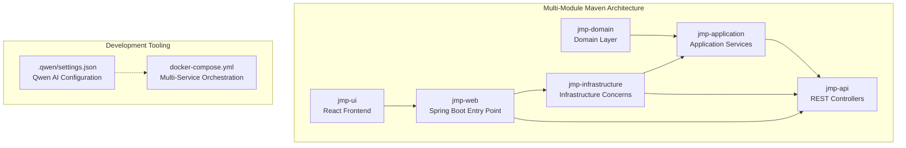
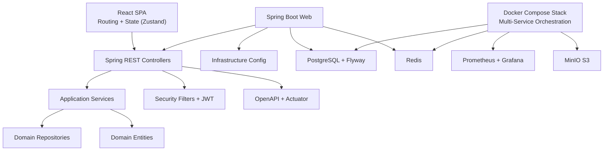
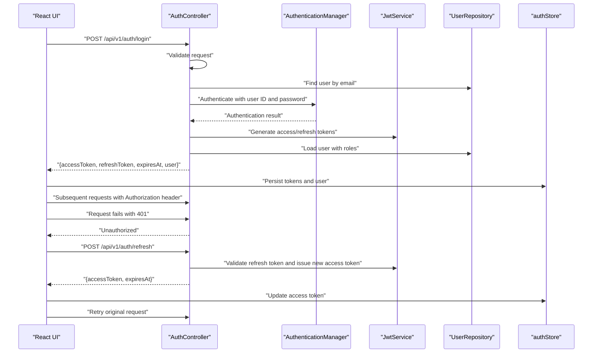
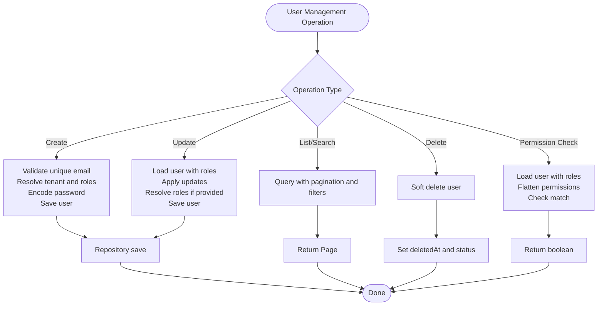
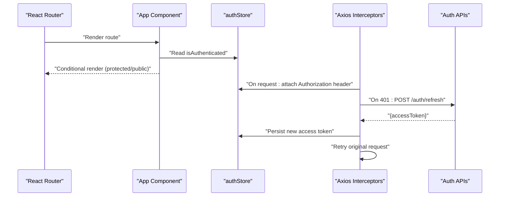
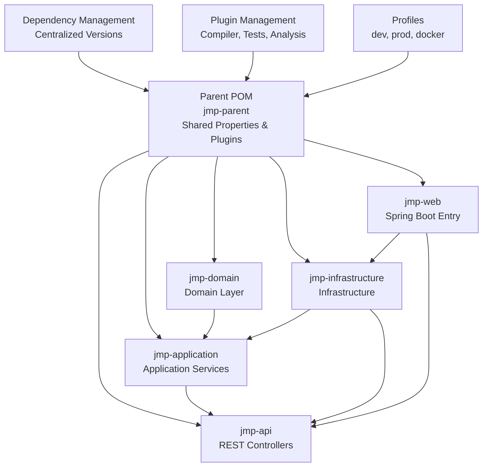

# Development Guidelines

<cite>
**Referenced Files in This Document**
- [pom.xml](file://pom.xml)
- [AuthController.java](file://jmp-api/src/main/java/com/jmp/api/controller/AuthController.java)
- [UserService.java](file://jmp-application/src/main/java/com/jmp/application/service/UserService.java)
- [User.java](file://jmp-domain/src/main/java/com/jmp/domain/entity/User.java)
- [SecurityConfig.java](file://jmp-infrastructure/src/main/java/com/jmp/infrastructure/security/SecurityConfig.java)
- [application.yml](file://jmp-web/src/main/resources/application.yml)
- [docker-compose.yml](file://docker-compose.yml)
- [App.tsx](file://jmp-ui/src/App.tsx)
- [authStore.ts](file://jmp-ui/src/store/authStore.ts)
- [api.ts](file://jmp-ui/src/services/api.ts)
- [package.json](file://jmp-ui/package.json)
- [tsconfig.json](file://jmp-ui/tsconfig.json)
- [eslint.config.js](file://jmp-ui/eslint.config.js)
- [vite.config.ts](file://jmp-ui/vite.config.ts)
- [JmpApplication.java](file://jmp-web/src/main/java/com/jmp/web/JmpApplication.java)
- [settings.json](file://.qwen/settings.json)
</cite>

## Update Summary
**Changes Made**
- Updated Maven multi-module architecture guidance to reflect the established modular structure
- Added Qwen AI settings configuration documentation for development tooling
- Enhanced development environment setup with comprehensive multi-service orchestration
- Updated dependency management and build configuration documentation
- Expanded troubleshooting guide with multi-module build and deployment considerations

## Table of Contents
1. [Introduction](#introduction)
2. [Project Structure](#project-structure)
3. [Core Components](#core-components)
4. [Architecture Overview](#architecture-overview)
5. [Detailed Component Analysis](#detailed-component-analysis)
6. [Dependency Analysis](#dependency-analysis)
7. [Performance Considerations](#performance-considerations)
8. [Troubleshooting Guide](#troubleshooting-guide)
9. [Conclusion](#conclusion)
10. [Appendices](#appendices)

## Introduction
This document provides comprehensive development guidelines for the Jitsi Management Platform (JMP). It covers coding standards for Java and TypeScript/JavaScript, Maven build and dependency management, React development practices, Git workflow, code review and quality processes, development environment setup, debugging approaches, contribution workflows, and security/performance best practices. The platform now features a mature multi-module Maven architecture with dedicated modules for domain logic, application services, infrastructure concerns, API controllers, and web configuration, along with comprehensive development tooling including Qwen AI integration.

## Project Structure
JMP follows a sophisticated multi-module Maven layout with clear separation of concerns across five distinct modules:
- Domain: Entities, value objects, repositories, and domain events
- Application: Use cases, services, DTOs, and mapping logic
- Infrastructure: Security, persistence, messaging, caching, and web configuration
- API: REST controllers and webhooks
- Web: Spring Boot entrypoint and runtime configuration
- UI: React application with Vite toolchain

**Diagram sources**
- [pom.xml:40-46](file://pom.xml#L40-L46)
- [docker-compose.yml:4-129](file://docker-compose.yml#L4-L129)
- [settings.json:1-9](file://.qwen/settings.json#L1-L9)

**Section sources**
- [pom.xml:40-46](file://pom.xml#L40-L46)
- [docker-compose.yml:4-129](file://docker-compose.yml#L4-L129)
- [settings.json:1-9](file://.qwen/settings.json#L1-L9)

## Core Components
- Java coding standards
  - Naming conventions: PascalCase for classes/interfaces, camelCase for methods and fields, UPPER_SNAKE_CASE for constants; package names are lower-case.
  - Annotations: Prefer Lombok annotations (@RequiredArgsConstructor, @Slf4j) for boilerplate reduction; use Jakarta EE validation annotations for DTOs; annotate controllers with Swagger @Tag/@Operation.
  - Logging: Use SLF4J via @Slf4j; include contextual information (e.g., user IDs) in logs; avoid logging sensitive data.
  - Exceptions: Throw domain-appropriate exceptions; controllers should expose meaningful messages; avoid generic catch-all blocks.
  - Transactions: Use @Transactional on service boundaries; keep read-only operations annotated accordingly.
  - DTOs and Mappers: Use MapStruct with Spring component model; enforce unmapped target policy errors to prevent silent data loss.
  - Validation: Use Bean Validation constraints on DTOs; validate early in the API boundary.
  - Security: Stateless JWT-based authentication; BCrypt encoder with configured cost; CORS configured per environment.
  - Configuration: Externalize secrets and environment-specific settings; use Spring profiles; enable Flyway migrations; configure Actuator and OpenAPI.

- TypeScript/JavaScript coding standards
  - Naming conventions: PascalCase for components, camelCase for hooks/functions, UPPER_SNAKE_CASE for constants; keep files modular under src/components, src/pages, src/services, src/store, src/types.
  - React: Functional components with hooks; strict typing with TypeScript; centralized API client with interceptors for auth and token refresh.
  - State management: Zustand for lightweight local state; persisted store for auth tokens and user profile.
  - Tooling: ESLint flat config with TypeScript and React hooks recommended rules; Vite for fast dev/build; Material UI for components.

- Qwen AI Development Tooling
  - Configuration: Qwen AI settings allow Docker Compose commands for streamlined development workflows.
  - Permissions: Explicitly configured Bash permissions for docker-compose operations.
  - Integration: Seamless integration with development environment for automated tasks.

**Section sources**
- [AuthController.java:26-35](file://jmp-api/src/main/java/com/jmp/api/controller/AuthController.java#L26-L35)
- [UserService.java:24-32](file://jmp-application/src/main/java/com/jmp/application/service/UserService.java#L24-L32)
- [User.java:18-28](file://jmp-domain/src/main/java/com/jmp/domain/entity/User.java#L18-L28)
- [SecurityConfig.java:24-31](file://jmp-infrastructure/src/main/java/com/jmp/infrastructure/security/SecurityConfig.java#L24-L31)
- [application.yml:12-128](file://jmp-web/src/main/resources/application.yml#L12-L128)
- [App.tsx:10-34](file://jmp-ui/src/App.tsx#L10-L34)
- [authStore.ts:13-47](file://jmp-ui/src/store/authStore.ts#L13-L47)
- [api.ts:13-58](file://jmp-ui/src/services/api.ts#L13-L58)
- [package.json:6-11](file://jmp-ui/package.json#L6-L11)
- [eslint.config.js:8-23](file://jmp-ui/eslint.config.js#L8-L23)
- [vite.config.ts:1-8](file://jmp-ui/vite.config.ts#L1-L8)
- [settings.json:1-9](file://.qwen/settings.json#L1-L9)

## Architecture Overview
JMP employs a layered architecture with a robust multi-module Maven structure:
- Presentation: React SPA (jmp-ui) with routing and state management
- API: REST controllers (jmp-api) exposing domain features
- Application: Services orchestrating use cases and DTO mapping
- Domain: Entities and repositories encapsulating business logic
- Infrastructure: Security, persistence, caching, messaging, and web configuration

**Diagram sources**
- [App.tsx:10-34](file://jmp-ui/src/App.tsx#L10-L34)
- [AuthController.java:30-35](file://jmp-api/src/main/java/com/jmp/api/controller/AuthController.java#L30-L35)
- [UserService.java:28-32](file://jmp-application/src/main/java/com/jmp/application/service/UserService.java#L28-L32)
- [User.java:23-28](file://jmp-domain/src/main/java/com/jmp/domain/entity/User.java#L23-L28)
- [SecurityConfig.java:42-61](file://jmp-infrastructure/src/main/java/com/jmp/infrastructure/security/SecurityConfig.java#L42-L61)
- [application.yml:12-128](file://jmp-web/src/main/resources/application.yml#L12-L128)
- [docker-compose.yml:4-129](file://docker-compose.yml#L4-L129)

## Detailed Component Analysis

### Authentication Flow (Java + React)
This sequence illustrates login, token issuance, and automatic refresh on the frontend.

**Diagram sources**
- [AuthController.java:42-100](file://jmp-api/src/main/java/com/jmp/api/controller/AuthController.java#L42-L100)
- [UserService.java:150-156](file://jmp-application/src/main/java/com/jmp/application/service/UserService.java#L150-L156)
- [SecurityConfig.java:69-75](file://jmp-infrastructure/src/main/java/com/jmp/infrastructure/security/SecurityConfig.java#L69-L75)
- [authStore.ts:23-46](file://jmp-ui/src/store/authStore.ts#L23-L46)
- [api.ts:25-58](file://jmp-ui/src/services/api.ts#L25-L58)

**Section sources**
- [AuthController.java:42-100](file://jmp-api/src/main/java/com/jmp/api/controller/AuthController.java#L42-L100)
- [UserService.java:150-156](file://jmp-application/src/main/java/com/jmp/application/service/UserService.java#L150-L156)
- [SecurityConfig.java:69-75](file://jmp-infrastructure/src/main/java/com/jmp/infrastructure/security/SecurityConfig.java#L69-L75)
- [authStore.ts:23-46](file://jmp-ui/src/store/authStore.ts#L23-L46)
- [api.ts:25-58](file://jmp-ui/src/services/api.ts#L25-L58)

### User Management Service (Complexity and Patterns)
The service demonstrates transactional boundaries, role resolution, and paginated queries.

**Diagram sources**
- [UserService.java:44-190](file://jmp-application/src/main/java/com/jmp/application/service/UserService.java#L44-L190)

**Section sources**
- [UserService.java:44-190](file://jmp-application/src/main/java/com/jmp/application/service/UserService.java#L44-L190)

### React Component and State Management
The UI uses a central router and a persisted Zustand store for authentication state. Axios interceptors handle token injection and refresh.

**Diagram sources**
- [App.tsx:10-31](file://jmp-ui/src/App.tsx#L10-L31)
- [authStore.ts:23-46](file://jmp-ui/src/store/authStore.ts#L23-L46)
- [api.ts:13-58](file://jmp-ui/src/services/api.ts#L13-L58)

**Section sources**
- [App.tsx:10-31](file://jmp-ui/src/App.tsx#L10-L31)
- [authStore.ts:23-46](file://jmp-ui/src/store/authStore.ts#L23-L46)
- [api.ts:13-58](file://jmp-ui/src/services/api.ts#L13-L58)

## Dependency Analysis
The multi-module Maven structure provides clear dependency relationships and centralized management:

- Parent POM coordinates define the build structure with shared versions and plugin management
- Module dependencies follow the layered architecture pattern with proper import/export boundaries
- Dependency management centralizes versions for Spring Boot, Hibernate, Flyway, MapStruct, JWT, resilience, and testing libraries
- Plugins include compiler, Surefire/Failsafe, JaCoCo, SpotBugs, and Checkstyle with comprehensive coverage
- Profiles activate dev/prod defaults with environment-specific configurations

**Diagram sources**
- [pom.xml:40-46](file://pom.xml#L40-L46)
- [pom.xml:79-167](file://pom.xml#L79-L167)
- [pom.xml:201-312](file://pom.xml#L201-L312)

**Section sources**
- [pom.xml:40-46](file://pom.xml#L40-L46)
- [pom.xml:79-167](file://pom.xml#L79-L167)
- [pom.xml:201-312](file://pom.xml#L201-L312)

## Performance Considerations
- Backend
  - Use pagination for listing/searching; ensure proper indexing on tenant-scoped queries.
  - Leverage batch settings and ordered inserts/updates to reduce round trips.
  - Enable compression and tune HikariCP pool sizes for database connections.
  - Use Redis for rate limiting and caching hot data; configure timeouts appropriately.
  - Monitor with Micrometer and Prometheus; expose only necessary Actuator endpoints.
- Frontend
  - Lazy-load heavy routes and components; minimize re-renders with memoization.
  - Debounce search inputs; avoid unnecessary polling.
  - Persist auth state to localStorage/sessionStorage via Zustand persistence.
- Multi-Module Build Performance
  - Leverage Maven's parallel build capabilities across modules.
  - Use Spring Boot layers plugin for optimized container builds.
  - Implement selective module compilation during development.

## Troubleshooting Guide
- Build failures
  - Verify Java version matches project properties (Java 21); ensure Maven wrapper is available.
  - Run tests with Surefire/Failsafe; check JaCoCo coverage thresholds.
  - Static analysis: SpotBugs and Checkstyle reports indicate violations.
  - Multi-module builds: Use `mvn clean install -pl <module> -am` for targeted builds.
- Runtime issues
  - Check application.yml for datasource, Redis, and JWT secrets; confirm Flyway migrations applied.
  - Inspect logs with structured JSON format; filter by trace IDs for correlation.
  - Confirm CORS origins and session policy in SecurityConfig.
  - Docker Compose: Verify all services are healthy and network connectivity.
- Frontend
  - Ensure VITE_API_URL points to the backend; verify interceptors attach Authorization headers.
  - On 401, confirm refresh endpoint availability and token persistence.
- Qwen AI Integration
  - Verify Qwen settings permissions for Docker operations.
  - Check Bash command permissions in settings.json.
  - Ensure development tooling compatibility with local environment.

**Section sources**
- [pom.xml:48-77](file://pom.xml#L48-L77)
- [pom.xml:267-312](file://pom.xml#L267-L312)
- [application.yml:12-128](file://jmp-web/src/main/resources/application.yml#L12-L128)
- [SecurityConfig.java:42-89](file://jmp-infrastructure/src/main/java/com/jmp/infrastructure/security/SecurityConfig.java#L42-L89)
- [api.ts:13-58](file://jmp-ui/src/services/api.ts#L13-L58)
- [settings.json:1-9](file://.qwen/settings.json#L1-L9)

## Conclusion
These guidelines establish a comprehensive foundation for developing the Jitsi Management Platform with its mature multi-module Maven architecture. By adhering to the outlined standards, leveraging the established modular structure, integrating Qwen AI development tools, and following React best practices, contributors can deliver secure, performant, and maintainable features while preserving clean separation of concerns across layers. The combination of robust backend architecture, modern frontend development, and comprehensive development tooling creates an efficient development environment for the platform's complex requirements.

## Appendices

### A. Maven Build and Dependency Management
- Build lifecycle
  - Compile, test, verify, package; Surefire/Failsafe for unit/integration tests; JaCoCo for coverage checks.
  - Multi-module builds support parallel execution and selective compilation.
- Dependency management
  - Centralized versions for Spring Boot, Hibernate, Flyway, MapStruct, JWT, resilience, and testing.
  - Module-specific dependencies ensure proper layering and separation of concerns.
- Plugins
  - Compiler with annotation processors (Lombok, MapStruct); SpotBugs and Checkstyle for static analysis.
  - Spring Boot Maven Plugin with layer optimization for container deployments.

**Section sources**
- [pom.xml:79-167](file://pom.xml#L79-L167)
- [pom.xml:201-312](file://pom.xml#L201-L312)

### B. React Development Practices
- Toolchain
  - Vite for dev server and builds; ESLint flat config with TypeScript and React hooks recommended rules.
  - Material UI components with Emotion for styling; React Router for navigation.
- Component structure
  - Pages under src/pages, shared components under src/components, services under src/services, state under src/store, types under src/types.
- State management
  - Zustand for small-scale state; persist auth-related state to localStorage.
- API client
  - Axios instance with request/response interceptors for auth and token refresh.

**Section sources**
- [package.json:6-11](file://jmp-ui/package.json#L6-L11)
- [tsconfig.json:1-8](file://jmp-ui/tsconfig.json#L1-L8)
- [eslint.config.js:8-23](file://jmp-ui/eslint.config.js#L8-L23)
- [vite.config.ts:1-8](file://jmp-ui/vite.config.ts#L1-L8)
- [App.tsx:10-31](file://jmp-ui/src/App.tsx#L10-L31)
- [authStore.ts:23-46](file://jmp-ui/src/store/authStore.ts#L23-L46)
- [api.ts:13-58](file://jmp-ui/src/services/api.ts#L13-L58)

### C. Environment Setup and Debugging
- Local compose stack
  - PostgreSQL, Redis, JMP backend, JMP frontend, Prometheus, Grafana, MinIO, and Jitsi services with health checks.
  - Comprehensive monitoring stack with metrics and dashboards.
- Secrets and configuration
  - Externalize secrets via environment variables; configure JWT secrets and database credentials.
  - Profile-based configuration with dev/prod environments.
- Debugging tips
  - Enable debug logging for specific packages; use structured logs for observability; verify CORS and session policy.
  - Multi-module debugging with proper module isolation.

**Section sources**
- [docker-compose.yml:4-129](file://docker-compose.yml#L4-L129)
- [application.yml:12-128](file://jmp-web/src/main/resources/application.yml#L12-L128)

### D. Git Workflow, Branching, and Pull Requests
- Branching strategy
  - Feature branches from develop; release branches from develop; hotfixes from main.
  - Multi-module projects require coordinated versioning across modules.
- Commit hygiene
  - Clear, imperative commit messages; group related changes; reference issues.
  - Consider module boundaries when committing changes.
- Pull requests
  - Target develop for features; include tests and documentation; request reviews from maintainers.
  - Multi-module PRs should consider inter-module dependencies.
- Code review checklist
  - Correctness, readability, performance, security, tests, and adherence to standards.
  - Verify module dependencies and architectural consistency.

### E. Testing Requirements and Quality Assurance
- Backend
  - Unit tests with Spring Boot and AssertJ; integration tests with Testcontainers where applicable.
  - Coverage thresholds enforced via JaCoCo; static analysis via SpotBugs and Checkstyle.
  - Multi-module test isolation and coordination.
- Frontend
  - Component and integration tests with React Testing Library; linting via ESLint.
- QA
  - Automated checks in CI; manual smoke tests for critical flows; monitor metrics and logs.
  - End-to-end testing with Docker Compose orchestrated services.

**Section sources**
- [pom.xml:169-199](file://pom.xml#L169-L199)
- [pom.xml:247-264](file://pom.xml#L247-L264)
- [eslint.config.js:8-23](file://jmp-ui/eslint.config.js#L8-L23)

### F. Security Best Practices
- Authentication and authorization
  - JWT-based stateless auth; BCrypt with configured cost; CORS restricted to trusted origins.
  - Multi-module security configuration with proper layer isolation.
- Secrets management
  - Never commit secrets; use environment variables and secret managers.
  - Qwen AI settings should not contain sensitive information.
- Input validation and sanitization
  - Validate and sanitize inputs; enforce constraints at API boundary and domain layer.
- Network and transport
  - Enforce HTTPS in production; restrict exposed endpoints; enable compression.
  - Container security with proper resource limits and network policies.

**Section sources**
- [SecurityConfig.java:42-89](file://jmp-infrastructure/src/main/java/com/jmp/infrastructure/security/SecurityConfig.java#L42-L89)
- [application.yml:72-79](file://jmp-web/src/main/resources/application.yml#L72-L79)
- [settings.json:1-9](file://.qwen/settings.json#L1-L9)

### G. Qwen AI Development Tooling
- Configuration
  - Qwen AI settings.json defines permissions for Docker operations.
  - Explicit Bash permissions allow docker-compose commands for development workflows.
- Integration
  - Seamless integration with development environment for automated tasks.
  - Permissions-based access control prevents unauthorized operations.
- Best Practices
  - Regularly review and update Qwen settings for security.
  - Use Qwen for code generation and development assistance within project scope.

**Section sources**
- [settings.json:1-9](file://.qwen/settings.json#L1-L9)