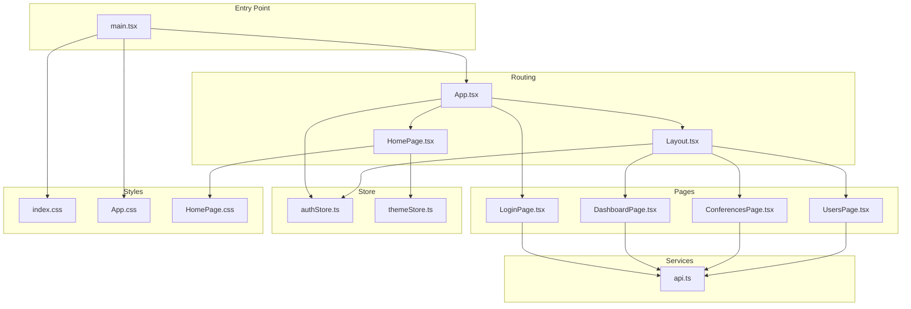
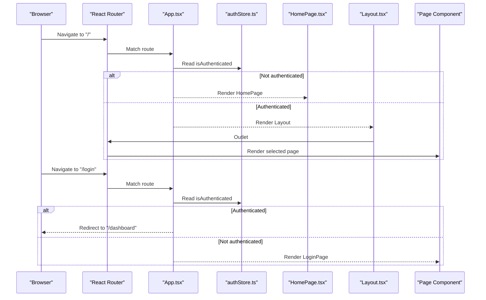
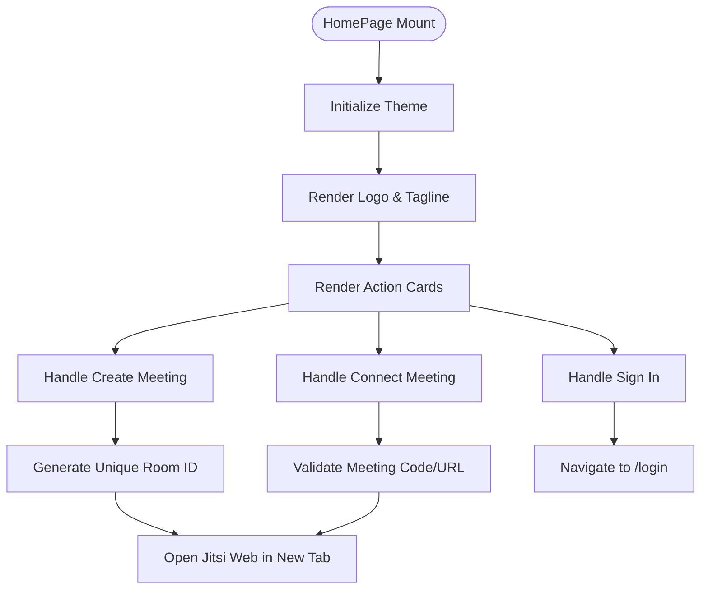
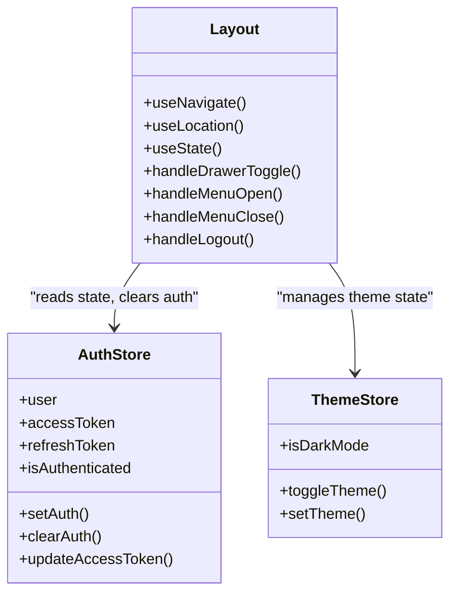
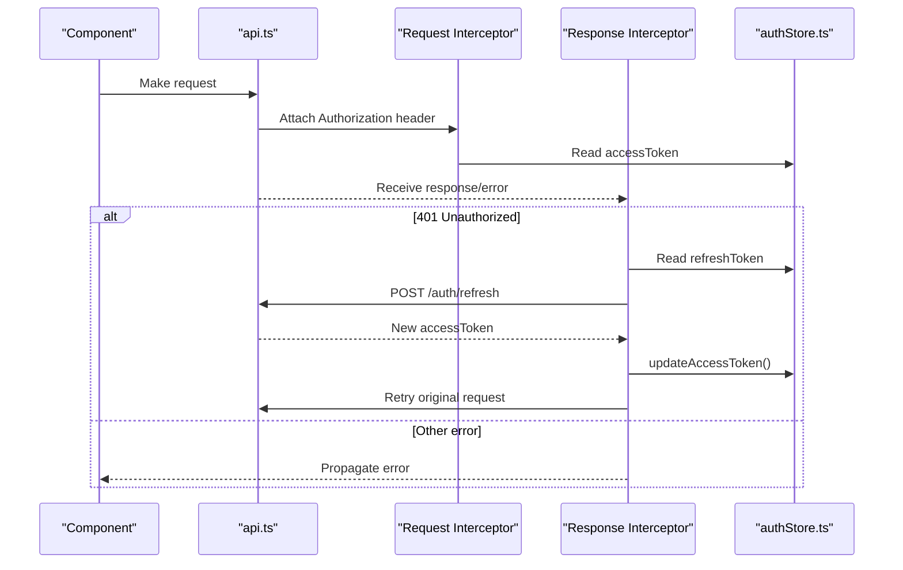
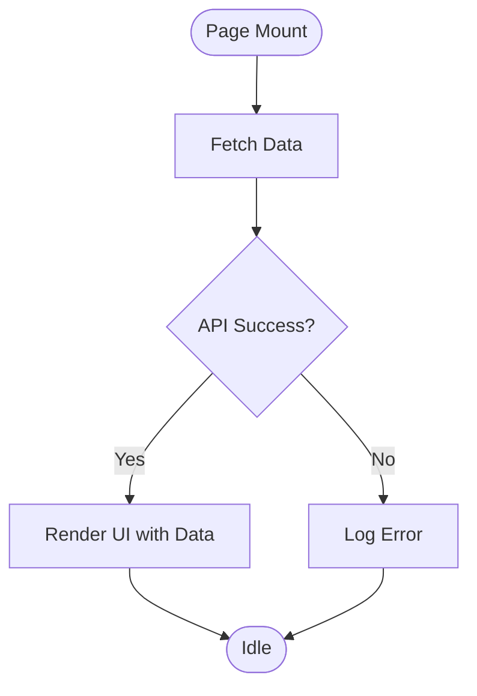
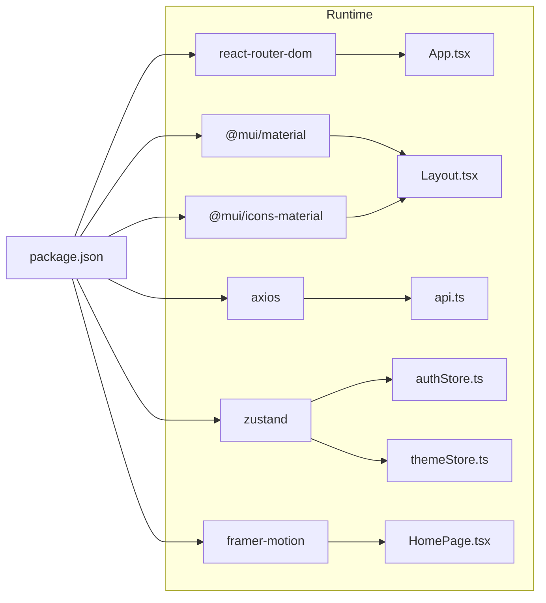

# Application Structure

<cite>
**Referenced Files in This Document**
- [main.tsx](file://jmp-ui/src/main.tsx)
- [App.tsx](file://jmp-ui/src/App.tsx)
- [Layout.tsx](file://jmp-ui/src/components/Layout.tsx)
- [HomePage.tsx](file://jmp-ui/src/pages/HomePage.tsx)
- [HomePage.css](file://jmp-ui/src/pages/HomePage.css)
- [themeStore.ts](file://jmp-ui/src/store/themeStore.ts)
- [authStore.ts](file://jmp-ui/src/store/authStore.ts)
- [api.ts](file://jmp-ui/src/services/api.ts)
- [LoginPage.tsx](file://jmp-ui/src/pages/LoginPage.tsx)
- [DashboardPage.tsx](file://jmp-ui/src/pages/DashboardPage.tsx)
- [ConferencesPage.tsx](file://jmp-ui/src/pages/ConferencesPage.tsx)
- [UsersPage.tsx](file://jmp-ui/src/pages/UsersPage.tsx)
- [index.css](file://jmp-ui/src/index.css)
- [App.css](file://jmp-ui/src/App.css)
- [package.json](file://jmp-ui/package.json)
- [vite.config.ts](file://jmp-ui/vite.config.ts)
- [tsconfig.json](file://jmp-ui/tsconfig.json)
- [tsconfig.app.json](file://jmp-ui/tsconfig.app.json)
</cite>

## Update Summary
**Changes Made**
- Updated routing configuration to reflect HomePage as root route for unauthenticated users
- Added HomePage component documentation with landing page functionality
- Updated authentication flow documentation to show new routing pattern
- Enhanced layout system documentation to include HomePage styling and animations
- Added theme store integration documentation for HomePage component

## Table of Contents
1. [Introduction](#introduction)
2. [Project Structure](#project-structure)
3. [Core Components](#core-components)
4. [Architecture Overview](#architecture-overview)
5. [Detailed Component Analysis](#detailed-component-analysis)
6. [Dependency Analysis](#dependency-analysis)
7. [Performance Considerations](#performance-considerations)
8. [Troubleshooting Guide](#troubleshooting-guide)
9. [Conclusion](#conclusion)
10. [Appendices](#appendices)

## Introduction
This document describes the React application structure and routing configuration for the Jitsi Management Platform (JMP) frontend. The application now features a modern landing page experience with HomePage serving as the root route for unauthenticated users, while authenticated users access the protected dashboard system. It explains the main App component setup, route definitions, authentication guards, Material-UI layout system, responsive design patterns, component hierarchy, navigation structure, and page organization. It also documents the main entry point, CSS imports, and global styling approach, and provides guidelines for adding new pages, modifying navigation, and maintaining consistent layout patterns.

## Project Structure
The React application resides under jmp-ui/src and is bootstrapped with Vite. The structure follows a feature-based organization with a new HomePage component as the root route:
- Entry point initializes theming, CSS baseline, routing, and renders the root App.
- App defines root HomePage route for unauthenticated users and protected routes for authenticated users.
- Layout provides a responsive Material-UI app bar and drawer with nested routing via Outlet.
- HomePage serves as the landing page with animated cards and instant meeting capabilities.
- Pages implement domain-specific views (Dashboard, Conferences, Users).
- Services encapsulate API interactions and authentication flows.
- Store manages authentication state with persistence and theme preferences.
- Global styles define CSS custom properties and responsive breakpoints.



**Diagram sources**
- [main.tsx:1-31](file://jmp-ui/src/main.tsx#L1-L31)
- [App.tsx:1-41](file://jmp-ui/src/App.tsx#L1-L41)
- [HomePage.tsx:1-277](file://jmp-ui/src/pages/HomePage.tsx#L1-L277)
- [HomePage.css:1-635](file://jmp-ui/src/pages/HomePage.css#L1-L635)
- [Layout.tsx:1-513](file://jmp-ui/src/components/Layout.tsx#L1-L513)
- [LoginPage.tsx:1-493](file://jmp-ui/src/pages/LoginPage.tsx#L1-L493)
- [DashboardPage.tsx:1-142](file://jmp-ui/src/pages/DashboardPage.tsx#L1-L142)
- [ConferencesPage.tsx:1-299](file://jmp-ui/src/pages/ConferencesPage.tsx#L1-L299)
- [UsersPage.tsx:1-249](file://jmp-ui/src/pages/UsersPage.tsx#L1-L249)
- [api.ts:1-191](file://jmp-ui/src/services/api.ts#L1-L191)
- [authStore.ts:1-47](file://jmp-ui/src/store/authStore.ts#L1-L47)
- [themeStore.ts:1-22](file://jmp-ui/src/store/themeStore.ts#L1-L22)
- [index.css:1-112](file://jmp-ui/src/index.css#L1-L112)
- [App.css:1-185](file://jmp-ui/src/App.css#L1-L185)

**Section sources**
- [main.tsx:1-31](file://jmp-ui/src/main.tsx#L1-L31)
- [App.tsx:1-41](file://jmp-ui/src/App.tsx#L1-L41)
- [Layout.tsx:1-513](file://jmp-ui/src/components/Layout.tsx#L1-L513)
- [HomePage.tsx:1-277](file://jmp-ui/src/pages/HomePage.tsx#L1-L277)
- [index.css:1-112](file://jmp-ui/src/index.css#L1-L112)
- [App.css:1-185](file://jmp-ui/src/App.css#L1-L185)

## Core Components
- Entry point and theming: Initializes ThemeProvider, CssBaseline, and BrowserRouter, then renders App.
- App routing: Defines HomePage as root route for unauthenticated users and protected routes for authenticated users.
- HomePage: Modern landing page with animated cards, instant meeting creation, and sign-in options.
- Layout: Provides responsive app bar, permanent/slide drawer, user menu, and outlet for nested pages.
- Authentication store: Zustand store with persisted auth state and helpers.
- API service: Axios instance with request/response interceptors for token injection and refresh.
- Pages: Login, Dashboard, Conferences, and Users with Material-UI components and data fetching.

Key responsibilities:
- Routing and guards: Redirect unauthenticated users to HomePage; redirect authenticated users to dashboard.
- HomePage functionality: Instant meeting creation, meeting joining, and theme switching.
- Layout and navigation: Centralized menu items and drawer behavior; user profile menu with logout.
- Styling: CSS custom properties for themes and responsive breakpoints; Material-UI theming.

**Section sources**
- [main.tsx:9-30](file://jmp-ui/src/main.tsx#L9-L30)
- [App.tsx:11-41](file://jmp-ui/src/App.tsx#L11-L41)
- [HomePage.tsx:54-277](file://jmp-ui/src/pages/HomePage.tsx#L54-L277)
- [Layout.tsx:48-513](file://jmp-ui/src/components/Layout.tsx#L48-L513)
- [authStore.ts:23-46](file://jmp-ui/src/store/authStore.ts#L23-L46)
- [api.ts:61-113](file://jmp-ui/src/services/api.ts#L61-L113)

## Architecture Overview
The application uses React Router v6 for client-side routing, Material-UI for UI primitives, Zustand for state management, and Axios for HTTP requests. The routing model enforces authentication via guard logic in App, with HomePage serving as the root route for unauthenticated users. The API service centralizes token handling and retries.

```mermaid
graph TB
subgraph "Client"
R["React Router"]
MUI["Material-UI"]
ZS["Zustand"]
AX["Axios"]
FR["Framer Motion"]
END
subgraph "App Shell"
EP["Entry Point<br/>main.tsx"]
APP["App<br/>App.tsx"]
HP["HomePage<br/>HomePage.tsx"]
LYT["Layout<br/>Layout.tsx"]
END
subgraph "Domain"
DASH["DashboardPage.tsx"]
CONF["ConferencesPage.tsx"]
USERS["UsersPage.tsx"]
LOGIN["LoginPage.tsx"]
END
subgraph "Services"
AUTH["authApi<br/>api.ts"]
CONFAPI["conferenceApi<br/>api.ts"]
USERAPI["userApi<br/>api.ts"]
END
EP --> APP
APP --> HP
APP --> R
APP --> LYT
HP --> FR
LYT --> DASH
LYT --> CONF
LYT --> USERS
LOGIN --> AUTH
DASH --> CONFAPI
CONF --> CONFAPI
USERS --> USERAPI
APP --> ZS
LYT --> ZS
AUTH --> AX
CONFAPI --> AX
USERAPI --> AX
EP --> MUI
```

**Diagram sources**
- [main.tsx:1-31](file://jmp-ui/src/main.tsx#L1-L31)
- [App.tsx:1-41](file://jmp-ui/src/App.tsx#L1-L41)
- [HomePage.tsx:1-277](file://jmp-ui/src/pages/HomePage.tsx#L1-L277)
- [Layout.tsx:1-513](file://jmp-ui/src/components/Layout.tsx#L1-L513)
- [LoginPage.tsx:1-493](file://jmp-ui/src/pages/LoginPage.tsx#L1-L493)
- [DashboardPage.tsx:1-142](file://jmp-ui/src/pages/DashboardPage.tsx#L1-L142)
- [ConferencesPage.tsx:1-299](file://jmp-ui/src/pages/ConferencesPage.tsx#L1-L299)
- [UsersPage.tsx:1-249](file://jmp-ui/src/pages/UsersPage.tsx#L1-L249)
- [api.ts:1-191](file://jmp-ui/src/services/api.ts#L1-L191)
- [authStore.ts:1-47](file://jmp-ui/src/store/authStore.ts#L1-L47)

## Detailed Component Analysis

### Routing and Authentication Guards
The routing configuration enforces authentication with HomePage as the root route:
- HomePage route: Accessible to everyone, serves as landing page with instant meeting capabilities.
- Login route: Accessible only when not authenticated; otherwise redirected to dashboard.
- Protected route: Dashboard path renders Layout only when authenticated; otherwise redirected to login.
- Nested routes: Dashboard, Conferences, and Users are rendered inside Layout via Outlet.



**Diagram sources**
- [App.tsx:16-34](file://jmp-ui/src/App.tsx#L16-L34)
- [authStore.ts:23-35](file://jmp-ui/src/store/authStore.ts#L23-L35)

**Section sources**
- [App.tsx:11-41](file://jmp-ui/src/App.tsx#L11-L41)

### HomePage Component and Landing Experience
The HomePage component provides a modern landing page experience:
- Animated entrance with staggered animations using Framer Motion.
- Three interactive action cards: Create instant meeting, Connect to meeting, and Sign In.
- Theme toggle with smooth transitions between light and dark modes.
- Responsive design with mobile-first approach and adaptive layouts.
- Instant meeting creation with unique room ID generation.
- Meeting joining via code or URL with validation.



**Diagram sources**
- [HomePage.tsx:54-277](file://jmp-ui/src/pages/HomePage.tsx#L54-L277)
- [HomePage.css:15-635](file://jmp-ui/src/pages/HomePage.css#L15-L635)

**Section sources**
- [HomePage.tsx:54-277](file://jmp-ui/src/pages/HomePage.tsx#L54-L277)
- [HomePage.css:15-635](file://jmp-ui/src/pages/HomePage.css#L15-L635)

### Layout System and Navigation
The Layout component provides:
- Responsive app bar with title and user menu.
- Temporary drawer on small screens and permanent drawer on larger screens.
- Menu items mapped to nested routes.
- User avatar menu with logout action that clears auth and navigates to login.



**Diagram sources**
- [Layout.tsx:48-513](file://jmp-ui/src/components/Layout.tsx#L48-L513)
- [authStore.ts:13-46](file://jmp-ui/src/store/authStore.ts#L13-L46)
- [themeStore.ts:4-22](file://jmp-ui/src/store/themeStore.ts#L4-L22)

**Section sources**
- [Layout.tsx:48-513](file://jmp-ui/src/components/Layout.tsx#L48-L513)

### API Layer and Token Management
The API service:
- Creates an Axios instance with base URL from environment.
- Injects Authorization header using access token from store.
- Handles 401 responses by refreshing tokens via refresh endpoint and retrying the original request.
- Exposes typed APIs for auth, users, and conferences.



**Diagram sources**
- [api.ts:68-113](file://jmp-ui/src/services/api.ts#L68-L113)
- [authStore.ts:32-34](file://jmp-ui/src/store/authStore.ts#L32-L34)

**Section sources**
- [api.ts:61-113](file://jmp-ui/src/services/api.ts#L61-L113)

### Page Components
- HomePage: Modern landing page with animated cards, instant meeting creation, and theme switching.
- LoginPage: Form-based login, sets auth state, and navigates to dashboard on success.
- DashboardPage: Fetches and displays conference statistics using concurrent API calls.
- ConferencesPage: CRUD operations for conferences with search, dialogs, and status controls.
- UsersPage: CRUD operations for users with search and role chips.



**Diagram sources**
- [DashboardPage.tsx:32-61](file://jmp-ui/src/pages/DashboardPage.tsx#L32-L61)
- [ConferencesPage.tsx:62-75](file://jmp-ui/src/pages/ConferencesPage.tsx#L62-L75)
- [UsersPage.tsx:52-65](file://jmp-ui/src/pages/UsersPage.tsx#L52-L65)

**Section sources**
- [HomePage.tsx:54-277](file://jmp-ui/src/pages/HomePage.tsx#L54-L277)
- [LoginPage.tsx:41-76](file://jmp-ui/src/pages/LoginPage.tsx#L41-L76)
- [DashboardPage.tsx:24-61](file://jmp-ui/src/pages/DashboardPage.tsx#L24-L61)
- [ConferencesPage.tsx:46-146](file://jmp-ui/src/pages/ConferencesPage.tsx#L46-L146)
- [UsersPage.tsx:38-128](file://jmp-ui/src/pages/UsersPage.tsx#L38-L128)

## Dependency Analysis
External dependencies relevant to structure and routing:
- react-router-dom: Routing and navigation.
- @mui/material and @mui/icons-material: UI components and icons.
- axios: HTTP client with interceptors.
- zustand: Lightweight state management with persistence.
- framer-motion: Animation library for HomePage component.



**Diagram sources**
- [package.json:12-22](file://jmp-ui/package.json#L12-L22)
- [App.tsx:1-9](file://jmp-ui/src/App.tsx#L1-L9)
- [Layout.tsx:18-33](file://jmp-ui/src/components/Layout.tsx#L18-L33)
- [api.ts:1-2](file://jmp-ui/src/services/api.ts#L1-L2)
- [authStore.ts:1-2](file://jmp-ui/src/store/authStore.ts#L1-L2)
- [themeStore.ts:1-2](file://jmp-ui/src/store/themeStore.ts#L1-L2)
- [HomePage.tsx:2-5](file://jmp-ui/src/pages/HomePage.tsx#L2-L5)

**Section sources**
- [package.json:12-22](file://jmp-ui/package.json#L12-L22)

## Performance Considerations
- Concurrent data fetching: Dashboard uses Promise.all to reduce load time.
- Minimal re-renders: Zustand store updates only when state changes.
- Conditional rendering: Login and protected routes prevent unnecessary component mounts.
- CSS custom properties: Centralized theming reduces style recalculation overhead.
- Responsive breakpoints: Media queries adjust typography and layout for smaller screens.
- Animation optimization: HomePage uses efficient Framer Motion animations with proper cleanup.

## Troubleshooting Guide
Common issues and resolutions:
- Authentication loops:
  - Ensure environment variable VITE_API_URL is set correctly so API calls succeed.
  - Verify that refresh token exists when handling 401 responses.
- Navigation issues:
  - Confirm menu items match route paths defined in App.
  - Ensure Layout outlet renders nested routes properly.
- Styling inconsistencies:
  - Check CSS custom properties in index.css and media queries.
  - Validate Material-UI theme palette and variants.
- HomePage not loading:
  - Verify HomePage component imports and CSS file are properly linked.
  - Check theme store initialization and dark mode functionality.
- Animation issues:
  - Ensure Framer Motion is properly installed and configured.
  - Verify animation variants are correctly defined and used.

**Section sources**
- [api.ts:68-113](file://jmp-ui/src/services/api.ts#L68-L113)
- [App.tsx:16-34](file://jmp-ui/src/App.tsx#L16-L34)
- [Layout.tsx:48-513](file://jmp-ui/src/components/Layout.tsx#L48-L513)
- [HomePage.tsx:54-277](file://jmp-ui/src/pages/HomePage.tsx#L54-L277)
- [index.css:1-112](file://jmp-ui/src/index.css#L1-L112)

## Conclusion
The application employs a clean, layered structure with explicit routing guards, a modern HomePage landing experience, and a reusable Material-UI layout. The design supports responsive behavior, consistent theming, robust authentication flows, and straightforward extension for new pages and navigation items. The HomePage component enhances user experience with instant meeting capabilities and smooth animations.

## Appendices

### Adding a New Page
Steps:
- Create a new page component under src/pages.
- Define a route in App.tsx under the Layout route group for authenticated users.
- Add a menu item in Layout.tsx menuItems array.
- Import and render the page component inside Layout via Outlet.
- Implement API interactions using api.ts modules.

Guidelines:
- Keep pages self-contained with local state and minimal props.
- Use Material-UI components consistently for alignment with existing design.
- Respect authentication guards by placing new routes under the Layout wrapper.
- Consider HomePage as inspiration for consistent styling and animations.

**Section sources**
- [App.tsx:26-34](file://jmp-ui/src/App.tsx#L26-L34)
- [Layout.tsx:37-41](file://jmp-ui/src/components/Layout.tsx#L37-L41)

### Modifying Navigation
Steps:
- Update menuItems in Layout.tsx to reflect new routes.
- Ensure route paths match App.tsx nested routes.
- Test mobile and desktop drawer behavior.

**Section sources**
- [Layout.tsx:37-41](file://jmp-ui/src/components/Layout.tsx#L37-L41)
- [App.tsx:30-34](file://jmp-ui/src/App.tsx#L30-L34)

### Maintaining Consistent Layout Patterns
- Use the Layout component for all authenticated pages.
- Leverage Material-UI's responsive breakpoints and sx props for consistent spacing.
- Centralize theme tokens via CSS custom properties in index.css.
- Keep API calls centralized in api.ts to maintain uniform auth and error handling.
- Follow HomePage styling patterns for consistent animations and theming.

**Section sources**
- [Layout.tsx:268-513](file://jmp-ui/src/components/Layout.tsx#L268-L513)
- [HomePage.tsx:54-277](file://jmp-ui/src/pages/HomePage.tsx#L54-L277)
- [index.css:1-112](file://jmp-ui/src/index.css#L1-L112)
- [api.ts:61-113](file://jmp-ui/src/services/api.ts#L61-L113)

### HomePage Customization Guidelines
Steps:
- Modify HomePage.tsx to add new action cards or functionality.
- Update HomePage.css for new styling requirements.
- Integrate with themeStore.ts for consistent dark/light mode support.
- Ensure responsive design compatibility across all screen sizes.

**Section sources**
- [HomePage.tsx:54-277](file://jmp-ui/src/pages/HomePage.tsx#L54-L277)
- [HomePage.css:15-635](file://jmp-ui/src/pages/HomePage.css#L15-L635)
- [themeStore.ts:4-22](file://jmp-ui/src/store/themeStore.ts#L4-L22)