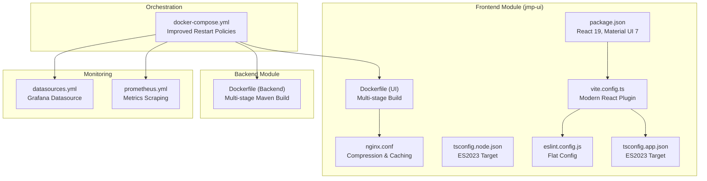
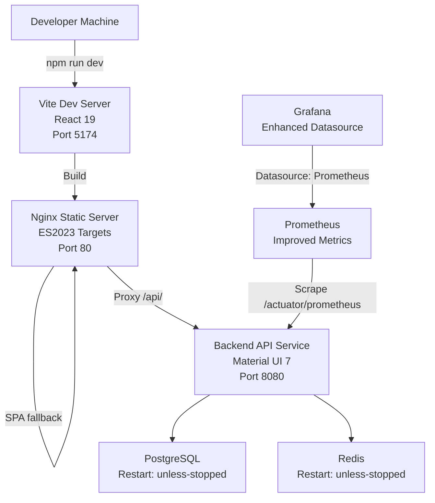
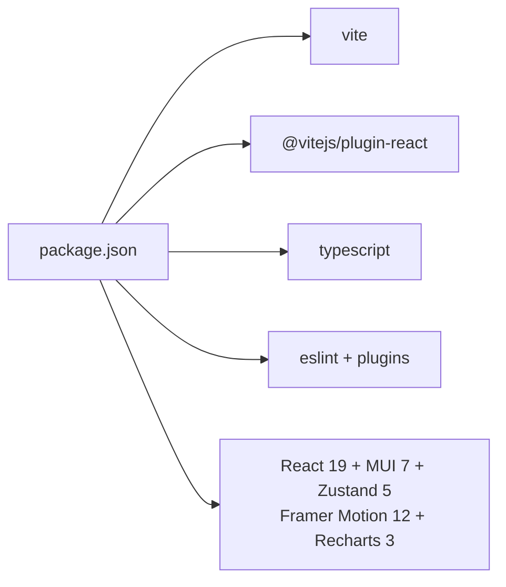

# Build and Deployment

<cite>
**Referenced Files in This Document**
- [package.json](file://jmp-ui/package.json)
- [vite.config.ts](file://jmp-ui/vite.config.ts)
- [tsconfig.json](file://jmp-ui/tsconfig.json)
- [tsconfig.app.json](file://jmp-ui/tsconfig.app.json)
- [tsconfig.node.json](file://jmp-ui/tsconfig.node.json)
- [eslint.config.js](file://jmp-ui/eslint.config.js)
- [Dockerfile (UI)](file://jmp-ui/Dockerfile)
- [nginx.conf](file://jmp-ui/nginx.conf)
- [docker-compose.yml](file://docker-compose.yml)
- [Dockerfile (Backend)](file://Dockerfile)
- [prometheus.yml](file://monitoring/prometheus.yml)
- [datasources.yml](file://monitoring/grafana/datasources/datasources.yml)
</cite>

## Update Summary
**Changes Made**
- Updated frontend dependencies section to reflect React 19, Material UI 7, Zustand, Framer Motion, and Recharts
- Enhanced Docker Compose configuration documentation with improved restart policies and port mappings
- Updated architecture diagrams to show modernized build processes
- Added new sections for modern dependency management and deployment strategies

## Table of Contents
1. [Introduction](#introduction)
2. [Project Structure](#project-structure)
3. [Core Components](#core-components)
4. [Architecture Overview](#architecture-overview)
5. [Detailed Component Analysis](#detailed-component-analysis)
6. [Dependency Analysis](#dependency-analysis)
7. [Performance Considerations](#performance-considerations)
8. [Troubleshooting Guide](#troubleshooting-guide)
9. [Conclusion](#conclusion)
10. [Appendices](#appendices)

## Introduction
This document explains the frontend build configuration and deployment process for the React-based UI module (jmp-ui). It covers Vite configuration, TypeScript setup, linting, Docker containerization, nginx static serving, and production deployment strategies. The platform has been modernized with React 19, Material UI 7, Zustand for state management, Framer Motion for animations, and Recharts for data visualization. It also documents environment variables, build optimization settings, performance tuning, deployment guidelines across environments, CI/CD integration patterns, troubleshooting, and local development best practices.

## Project Structure
The frontend build and deployment artifacts are centered in the jmp-ui module. Key files include:
- Build and dev scripts, dependencies, and plugin configuration
- Vite configuration for React 19 with modern plugin stack
- TypeScript configurations for app and node contexts with ES2023 targets
- ESLint flat config for linting with TypeScript and React Refresh
- Dockerfile for multi-stage build and nginx serving
- Nginx configuration for static assets, caching, compression, SPA routing, and API proxying
- docker-compose orchestration for frontend, backend, databases, and monitoring

**Diagram sources**
- [package.json:12-26](file://jmp-ui/package.json#L12-L26)
- [vite.config.ts:1-8](file://jmp-ui/vite.config.ts#L1-L8)
- [tsconfig.app.json:4-6](file://jmp-ui/tsconfig.app.json#L4-L6)
- [tsconfig.node.json:4-6](file://jmp-ui/tsconfig.node.json#L4-L6)
- [eslint.config.js:1-24](file://jmp-ui/eslint.config.js#L1-L24)
- [Dockerfile (UI):1-33](file://jmp-ui/Dockerfile#L1-L33)
- [nginx.conf:1-37](file://jmp-ui/nginx.conf#L1-L37)
- [docker-compose.yml:11, 32, 51, 92:11-11](file://docker-compose.yml#L11-L11)
- [Dockerfile (Backend):1-54](file://Dockerfile#L1-L54)
- [prometheus.yml:18-22](file://monitoring/prometheus.yml#L18-L22)
- [datasources.yml:4-10](file://monitoring/grafana/datasources/datasources.yml#L4-L10)

**Section sources**
- [package.json:1-42](file://jmp-ui/package.json#L1-L42)
- [vite.config.ts:1-8](file://jmp-ui/vite.config.ts#L1-L8)
- [tsconfig.json:1-8](file://jmp-ui/tsconfig.json#L1-L8)
- [tsconfig.app.json:1-26](file://jmp-ui/tsconfig.app.json#L1-L26)
- [tsconfig.node.json:1-25](file://jmp-ui/tsconfig.node.json#L1-L25)
- [eslint.config.js:1-24](file://jmp-ui/eslint.config.js#L1-L24)
- [Dockerfile (UI):1-33](file://jmp-ui/Dockerfile#L1-L33)
- [nginx.conf:1-37](file://jmp-ui/nginx.conf#L1-L37)
- [docker-compose.yml:1-353](file://docker-compose.yml#L1-L353)
- [Dockerfile (Backend):1-54](file://Dockerfile#L1-L54)
- [prometheus.yml:1-23](file://monitoring/prometheus.yml#L1-L23)
- [datasources.yml:1-11](file://monitoring/grafana/datasources/datasources.yml#L1-L11)

## Core Components
- **Vite Build and Dev Server**: Single-plugin React setup with React 19 support and modern plugin stack.
- **TypeScript**: ES2023-targeted configurations for app and node contexts with bundler-mode resolution.
- **Linting**: ESLint flat config with recommended rulesets for TypeScript, React hooks, and React Refresh.
- **Docker (UI)**: Multi-stage build producing optimized static assets served by nginx with improved restart policies.
- **Nginx**: Compression, long-lived caching for static assets, SPA routing fallback, and API proxy to backend.
- **Orchestration**: docker-compose defines services with enhanced restart policies, environment variables, port mappings, and network connectivity.

**Section sources**
- [vite.config.ts:1-8](file://jmp-ui/vite.config.ts#L1-L8)
- [tsconfig.app.json:4-6](file://jmp-ui/tsconfig.app.json#L4-L6)
- [tsconfig.node.json:4-6](file://jmp-ui/tsconfig.node.json#L4-L6)
- [eslint.config.js:1-24](file://jmp-ui/eslint.config.js#L1-L24)
- [Dockerfile (UI):1-33](file://jmp-ui/Dockerfile#L1-L33)
- [nginx.conf:1-37](file://jmp-ui/nginx.conf#L1-L37)
- [docker-compose.yml:11, 32, 51, 92:11-11](file://docker-compose.yml#L11-L11)

## Architecture Overview
The frontend build pipeline produces static assets packaged inside an nginx container with enhanced restart policies. The UI service proxies API traffic to the backend service. Monitoring services collect metrics from the backend with improved configuration.

**Diagram sources**
- [docker-compose.yml:11, 32, 51, 92:11-11](file://docker-compose.yml#L11-L11)
- [nginx.conf:24-35](file://jmp-ui/nginx.conf#L24-L35)
- [prometheus.yml:18-22](file://monitoring/prometheus.yml#L18-L22)
- [datasources.yml:4-10](file://monitoring/grafana/datasources/datasources.yml#L4-L10)

## Detailed Component Analysis

### Vite Configuration and Build Pipeline
- **Plugin Stack**: React plugin integrated via Vite with React 19 support.
- **Build Script**: TypeScript project references compiled first, followed by Vite build for optimized production assets.
- **Dev Script**: Starts Vite dev server with default behavior.
- **Preview Script**: Serves the built assets locally for preview.

**Updated** Enhanced with React 19 support and modern plugin configuration.

Optimization and asset handling:
- Vite's default bundler handles code splitting and asset optimization.
- Assets under public are copied as-is; dynamic imports and module resolution are handled by Vite.
- Environment variables prefixed with VITE_ are embedded at build time; others are ignored.

Development server:
- Default host/port behavior is used; port mapping is configured in docker-compose.

**Section sources**
- [package.json:6-11](file://jmp-ui/package.json#L6-L11)
- [vite.config.ts:1-8](file://jmp-ui/vite.config.ts#L1-L8)

### TypeScript Configuration
- **Root tsconfig**: Aggregates app and node configs.
- **App config**: Targets ES2023, uses bundler module resolution, JSX transform, and strictness flags suitable for Vite.
- **Node config**: Targets ES2023 for tooling and Vite config types.

**Updated** Migrated to ES2023 targets for modern JavaScript features and improved performance.

Recommendations:
- Keep target aligned with deployed browsers.
- Preserve bundler mode for Vite compatibility.

**Section sources**
- [tsconfig.json:1-8](file://jmp-ui/tsconfig.json#L1-L8)
- [tsconfig.app.json:4-6](file://jmp-ui/tsconfig.app.json#L4-L6)
- [tsconfig.node.json:4-6](file://jmp-ui/tsconfig.node.json#L4-L6)

### Linting Setup
- **ESLint Flat Config**: Enables recommended rules for TypeScript, React hooks, and React Refresh.
- **Ignores**: Dist folder automatically ignored.

**Updated** Enhanced with modern ESLint flat configuration and improved plugin support.

Best practices:
- Run lint checks in CI and pre-commit hooks.
- Keep rules consistent across contributors.

**Section sources**
- [eslint.config.js:1-24](file://jmp-ui/eslint.config.js#L1-L24)

### Docker Build and Nginx Serving
**Updated** Enhanced with improved restart policies and modernized build process.

Multi-stage build:
- **Stage 1**: Node 20 Alpine base image installs dependencies and builds the app using npm scripts.
- **Stage 2**: Alpine nginx image copies built assets and nginx.conf, exposes port 80, and starts nginx.

Nginx configuration highlights:
- Gzip compression enabled for common text and JS/CSS MIME types.
- Long-term caching for static assets with immutable cache-control.
- SPA routing fallback to index.html for client-side routes.
- API proxy to backend service at jmp-api:8080 with proper headers and WebSocket upgrade support.

Environment variables:
- VITE_API_URL is set in docker-compose for the UI service to point to the backend API.

**Enhanced** Port mappings now use 5174:80 for development and 8081:8080 for backend.

**Updated** Restart policies improved with "unless-stopped" for database services.

Port mappings:
- UI service publishes port 80 mapped to 5174 on host for local dev; in production, expose port 80 externally.
- Backend service uses 8081:8080 mapping for development.

**Section sources**
- [Dockerfile (UI):1-33](file://jmp-ui/Dockerfile#L1-L33)
- [nginx.conf:1-37](file://jmp-ui/nginx.conf#L1-L37)
- [docker-compose.yml:94-96](file://docker-compose.yml#L94-L96)

### Backend Containerization and Orchestration
- **Backend Dockerfile**: Uses multi-stage Maven build with offline dependency download and minimal JRE runtime.
- **docker-compose**: Orchestrates backend, database, cache, monitoring, and frontend services with health checks and network isolation.

**Updated** Enhanced restart policies with "unless-stopped" for improved reliability.

Environment variables:
- Database connection, Redis URL, JWT secrets, and Spring profile are defined for the backend service.

**Section sources**
- [Dockerfile (Backend):1-54](file://Dockerfile#L1-L54)
- [docker-compose.yml:44-72](file://docker-compose.yml#L44-L72)

### Monitoring Integration
- **Prometheus**: Scrapes backend metrics endpoint at /actuator/prometheus with 5-second intervals.
- **Grafana**: Provisioned with a Prometheus datasource and default admin credentials.

**Updated** Enhanced monitoring configuration with improved scraping intervals.

**Section sources**
- [prometheus.yml:18-22](file://monitoring/prometheus.yml#L18-L22)
- [datasources.yml:4-10](file://monitoring/grafana/datasources/datasources.yml#L4-L10)

## Dependency Analysis
**Updated** Modernized frontend dependencies with React 19, Material UI 7, and enhanced ecosystem.

Frontend build-time dependencies include Vite, React plugin, TypeScript, and ESLint ecosystem. Runtime dependencies include React 19, Material UI 7, Axios, React Router 7, Zustand 5, Framer Motion 12, Recharts 3, and Lucide React icons. The UI service depends on the backend API service for data and authentication flows.

**Enhanced** New dependencies: Framer Motion for animations, Recharts for data visualization, and Lucide React for modern icons.

**Diagram sources**
- [package.json:12-26](file://jmp-ui/package.json#L12-L26)

**Section sources**
- [package.json:12-26](file://jmp-ui/package.json#L12-L26)

## Performance Considerations
- **Asset caching**: Nginx sets long cache TTLs and immutable flags for static assets to reduce bandwidth and improve load times.
- **Compression**: Gzip reduces payload sizes for text-based assets.
- **SPA routing**: Fallback to index.html ensures deep links work without server-side route handling.
- **Build optimization**: Vite's default bundler performs code splitting and tree-shaking; keep dependencies lean and avoid unnecessary polyfills.
- **Environment variables**: Use VITE_ prefix for variables consumed at build time; avoid leaking secrets.
- **Browser compatibility**: Align TS target with supported browsers; test across devices and versions.
- **Enhanced** Modern JavaScript features: ES2023 target provides better performance and modern syntax support.

## Troubleshooting Guide
Common issues and resolutions:
- **API requests fail in dev or production**:
  - Verify VITE_API_URL points to the correct backend origin.
  - Confirm nginx proxy_pass matches backend service name and path.
- **404 on client-side routes**:
  - Ensure nginx location / fallback to index.html is present.
- **Assets not cached or stale**:
  - Check cache-control headers and expiration directives for static asset locations.
- **Health checks failing**:
  - Review backend health endpoint and compose healthcheck configuration.
- **CORS or WebSocket upgrade failures**:
  - Validate proxy headers and upgrade settings in nginx.
- **Enhanced** **Database connectivity issues**:
  - Verify PostgreSQL service health and port mapping (5432:5432).
  - Check restart policies for database services.
- **Enhanced** **Frontend not loading**:
  - Verify React 19 compatibility and proper Vite configuration.
  - Check Material UI 7 component imports and styling.

**Section sources**
- [docker-compose.yml:18-19, 94-96:18-19](file://docker-compose.yml#L18-L19)
- [nginx.conf:19-22](file://jmp-ui/nginx.conf#L19-L22)
- [nginx.conf:24-35](file://jmp-ui/nginx.conf#L24-L35)

## Conclusion
The frontend build and deployment pipeline leverages Vite for fast development and optimized production builds, TypeScript with ES2023 targets for type safety, and a multi-stage Docker build with nginx for efficient static serving. The platform has been modernized with React 19, Material UI 7, Zustand, Framer Motion, and Recharts for enhanced user experience. docker-compose orchestrates the UI, backend, databases, cache, and monitoring with improved restart policies. Following the outlined environment variables, performance tuning tips, and troubleshooting steps ensures reliable local and production deployments.

## Appendices

### Build Scripts and Commands
- **Development**: Start Vite dev server with React 19 support.
- **Build**: Compile TypeScript project references, then run Vite build.
- **Lint**: Run ESLint across the project with flat configuration.
- **Preview**: Serve built assets locally for verification.

**Section sources**
- [package.json:6-11](file://jmp-ui/package.json#L6-L11)

### Environment Variables Reference
- **Frontend**:
  - VITE_API_URL: Base URL for API requests from the UI.
- **Backend**:
  - SPRING_PROFILES_ACTIVE: Active Spring profile (e.g., docker,dev).
  - DB_URL, DB_USER, DB_PASS: Database connection settings.
  - REDIS_URL: Redis connection URL.
  - JWT_ACCESS_SECRET, JWT_REFRESH_SECRET: Secrets for JWT signing.
  - Enhanced** S3 storage configuration for recording management.

**Section sources**
- [docker-compose.yml:94](file://docker-compose.yml#L94)
- [docker-compose.yml:52-67](file://docker-compose.yml#L52-L67)

### CI/CD Integration Patterns
- **Build stage**: Install dependencies, compile TS with ES2023 target, run Vite build.
- **Test stage**: Run linters with ESLint flat config and unit tests.
- **Package stage**: Produce Docker images for UI and backend with multi-stage builds.
- **Deploy stage**: Push images to registry and deploy via docker-compose with enhanced restart policies.

### Local Development Best Practices
- Use npm run dev for iterative development with React 19.
- Keep VITE_API_URL aligned with backend service name and port mapping.
- Leverage ESLint flat config for consistent code quality.
- Validate SPA routing and API proxy behavior locally before committing.
- **Enhanced** Test modern dependencies (React 19, Material UI 7, Zustand) for compatibility.
- **Enhanced** Monitor database connectivity with improved restart policies.

**Section sources**
- [package.json:6-11](file://jmp-ui/package.json#L6-L11)
- [docker-compose.yml:94](file://docker-compose.yml#L94)
- [eslint.config.js:1-24](file://jmp-ui/eslint.config.js#L1-L24)