# Frontend Application

<cite>
**Referenced Files in This Document**
- [package.json](file://jmp-ui/package.json)
- [vite.config.ts](file://jmp-ui/vite.config.ts)
- [App.tsx](file://jmp-ui/src/App.tsx)
- [main.tsx](file://jmp-ui/src/main.tsx)
- [Layout.tsx](file://jmp-ui/src/components/Layout.tsx)
- [authStore.ts](file://jmp-ui/src/store/authStore.ts)
- [themeStore.ts](file://jmp-ui/src/store/themeStore.ts)
- [api.ts](file://jmp-ui/src/services/api.ts)
- [LoginPage.tsx](file://jmp-ui/src/pages/LoginPage.tsx)
- [HomePage.tsx](file://jmp-ui/src/pages/HomePage.tsx)
- [HomePage.css](file://jmp-ui/src/pages/HomePage.css)
- [DashboardPage.tsx](file://jmp-ui/src/pages/DashboardPage.tsx)
- [ConferencesPage.tsx](file://jmp-ui/src/pages/ConferencesPage.tsx)
- [UsersPage.tsx](file://jmp-ui/src/pages/UsersPage.tsx)
- [index.css](file://jmp-ui/src/index.css)
- [tsconfig.json](file://jmp-ui/tsconfig.json)
- [eslint.config.js](file://jmp-ui/eslint.config.js)
- [Dockerfile](file://jmp-ui/Dockerfile)
- [nginx.conf](file://jmp-ui/nginx.conf)
</cite>

## Update Summary
**Changes Made**
- Added new HomePage component with glassmorphism design system and animations
- Implemented comprehensive design system with corporate blue-gray color palette
- Enhanced LoginPage with Material-UI integration, form validation, and accessibility features
- Updated routing structure to prioritize HomePage as main landing page
- Added theme store for persistent theme management
- Integrated Framer Motion for smooth animations and transitions

## Table of Contents
1. [Introduction](#introduction)
2. [Project Structure](#project-structure)
3. [Core Components](#core-components)
4. [Architecture Overview](#architecture-overview)
5. [Detailed Component Analysis](#detailed-component-analysis)
6. [Design System](#design-system)
7. [Dependency Analysis](#dependency-analysis)
8. [Performance Considerations](#performance-considerations)
9. [Troubleshooting Guide](#troubleshooting-guide)
10. [Conclusion](#conclusion)
11. [Appendices](#appendices)

## Introduction
This document describes the React-based frontend application for the Jitsi Management Platform (JMP). It covers the component hierarchy, routing configuration, state management with Zustand stores, Material-UI integration, responsive design patterns, and user interface components. The application features a modern glassmorphism design system with corporate blue-gray aesthetics, smooth animations powered by Framer Motion, and comprehensive theme management. It documents the application pages (homepage, dashboard, conference management, user administration, and login), authentication state management, API integration patterns, and the deployment pipeline. Guidance is included for component development, styling approaches, accessibility compliance, performance optimization, and browser compatibility.

## Project Structure
The frontend is a Vite-powered React application written in TypeScript. It uses Material-UI for UI components, Axios for HTTP requests, React Router for navigation, and Zustand for state management. The application features a comprehensive design system with CSS custom properties, glassmorphism effects, and smooth animations. The application is containerized with a multi-stage Docker build and served via nginx.

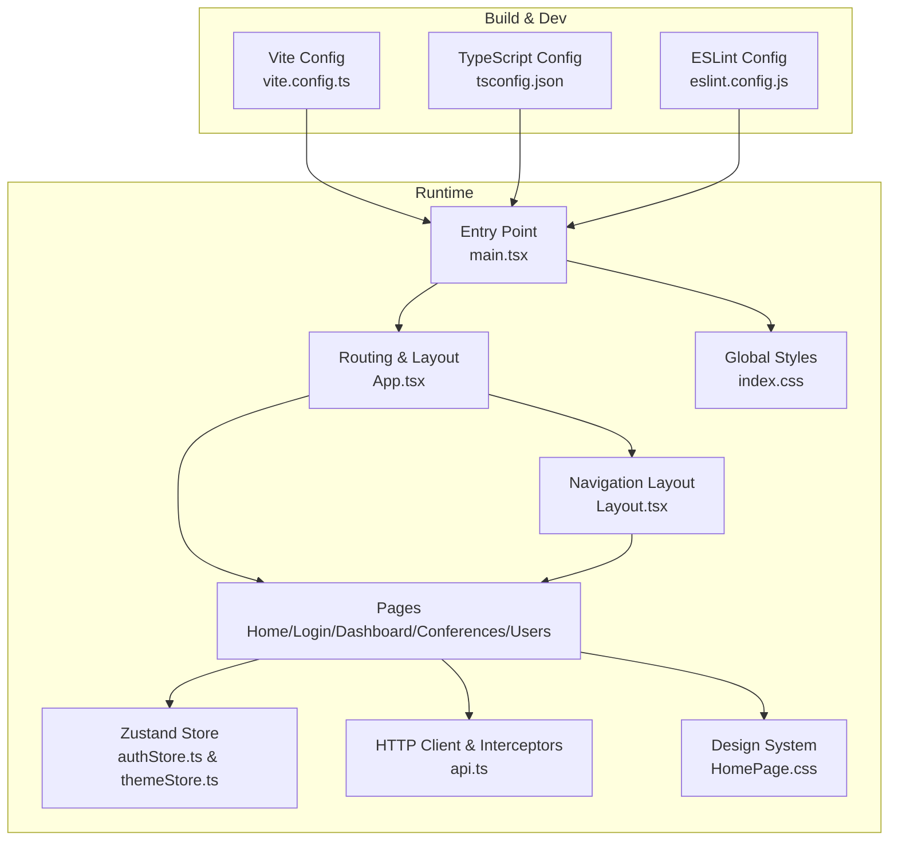

**Diagram sources**
- [vite.config.ts:1-8](file://jmp-ui/vite.config.ts#L1-L8)
- [tsconfig.json:1-8](file://jmp-ui/tsconfig.json#L1-L8)
- [eslint.config.js:1-24](file://jmp-ui/eslint.config.js#L1-L24)
- [main.tsx:1-31](file://jmp-ui/src/main.tsx#L1-L31)
- [App.tsx:1-41](file://jmp-ui/src/App.tsx#L1-L41)
- [Layout.tsx:1-167](file://jmp-ui/src/components/Layout.tsx#L1-L167)
- [HomePage.tsx:1-277](file://jmp-ui/src/pages/HomePage.tsx#L1-L277)
- [HomePage.css:1-635](file://jmp-ui/src/pages/HomePage.css#L1-L635)
- [LoginPage.tsx:1-493](file://jmp-ui/src/pages/LoginPage.tsx#L1-L493)
- [DashboardPage.tsx:1-142](file://jmp-ui/src/pages/DashboardPage.tsx#L1-L142)
- [ConferencesPage.tsx:1-299](file://jmp-ui/src/pages/ConferencesPage.tsx#L1-L299)
- [UsersPage.tsx:1-249](file://jmp-ui/src/pages/UsersPage.tsx#L1-L249)
- [authStore.ts:1-47](file://jmp-ui/src/store/authStore.ts#L1-L47)
- [themeStore.ts:1-22](file://jmp-ui/src/store/themeStore.ts#L1-L22)
- [api.ts:1-93](file://jmp-ui/src/services/api.ts#L1-L93)
- [index.css:1-402](file://jmp-ui/src/index.css#L1-L402)

**Section sources**
- [package.json:1-42](file://jmp-ui/package.json#L1-L42)
- [vite.config.ts:1-8](file://jmp-ui/vite.config.ts#L1-L8)
- [tsconfig.json:1-8](file://jmp-ui/tsconfig.json#L1-L8)
- [eslint.config.js:1-24](file://jmp-ui/eslint.config.js#L1-L24)
- [main.tsx:1-31](file://jmp-ui/src/main.tsx#L1-L31)
- [App.tsx:1-41](file://jmp-ui/src/App.tsx#L1-L41)
- [Layout.tsx:1-167](file://jmp-ui/src/components/Layout.tsx#L1-L167)
- [authStore.ts:1-47](file://jmp-ui/src/store/authStore.ts#L1-L47)
- [themeStore.ts:1-22](file://jmp-ui/src/store/themeStore.ts#L1-L22)
- [api.ts:1-93](file://jmp-ui/src/services/api.ts#L1-L93)
- [index.css:1-402](file://jmp-ui/src/index.css#L1-L402)

## Core Components
- **Routing and Navigation**
  - Central route configuration with public HomePage and protected routes.
  - HomePage accessible without authentication, serving as main landing page.
  - Login route with redirect when authenticated.
  - Nested routes for dashboard, conferences, and users under the authenticated layout.

- **Authentication State Management (Zustand)**
  - Stores user profile, tokens, and authentication status.
  - Persists state to local storage with selective serialization.
  - Provides actions to set/clear auth and update access tokens.

- **Theme Management (Zustand)**
  - Comprehensive theme store with dark/light mode support.
  - Persists theme preference to local storage.
  - Integrates with CSS custom properties for seamless theme switching.
  - Automatic system preference detection.

- **HTTP Client and Interceptors (Axios)**
  - Base URL configured via environment variable.
  - Automatic Authorization header injection.
  - Token refresh flow on 401 responses using refresh token.

- **Material-UI Integration**
  - Theme provider with light palette and CssBaseline.
  - Responsive drawer and app bar with mobile/touch support.
  - Consistent use of MUI components across pages.
  - Enhanced LoginPage with Material-UI form components.

**Section sources**
- [App.tsx:1-41](file://jmp-ui/src/App.tsx#L1-L41)
- [authStore.ts:1-47](file://jmp-ui/src/store/authStore.ts#L1-L47)
- [themeStore.ts:1-22](file://jmp-ui/src/store/themeStore.ts#L1-L22)
- [api.ts:1-93](file://jmp-ui/src/services/api.ts#L1-L93)
- [main.tsx:9-29](file://jmp-ui/src/main.tsx#L9-L29)
- [Layout.tsx:36-166](file://jmp-ui/src/components/Layout.tsx#L36-L166)

## Architecture Overview
The application follows a layered architecture with enhanced design system integration:
- **Presentation Layer**: React components with Material-UI and glassmorphism design.
- **State Layer**: Zustand stores for authentication and theme management.
- **Services Layer**: Axios-based API module with interceptors.
- **Routing Layer**: React Router with public/private route protection.
- **Infrastructure**: Vite build, Docker image, nginx reverse proxy.
- **Design Layer**: Comprehensive CSS custom property system with animations.

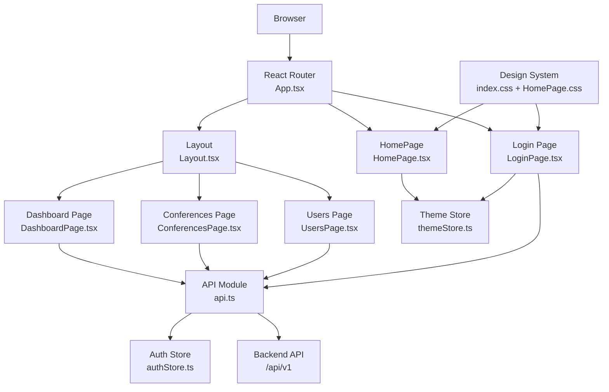

**Diagram sources**
- [App.tsx:1-41](file://jmp-ui/src/App.tsx#L1-L41)
- [HomePage.tsx:1-277](file://jmp-ui/src/pages/HomePage.tsx#L1-L277)
- [Layout.tsx:36-166](file://jmp-ui/src/components/Layout.tsx#L36-L166)
- [DashboardPage.tsx:1-142](file://jmp-ui/src/pages/DashboardPage.tsx#L1-L142)
- [ConferencesPage.tsx:1-299](file://jmp-ui/src/pages/ConferencesPage.tsx#L1-L299)
- [UsersPage.tsx:1-249](file://jmp-ui/src/pages/UsersPage.tsx#L1-L249)
- [LoginPage.tsx:1-493](file://jmp-ui/src/pages/LoginPage.tsx#L1-L493)
- [authStore.ts:1-47](file://jmp-ui/src/store/authStore.ts#L1-L47)
- [themeStore.ts:1-22](file://jmp-ui/src/store/themeStore.ts#L1-L22)
- [api.ts:1-93](file://jmp-ui/src/services/api.ts#L1-L93)
- [index.css:1-402](file://jmp-ui/src/index.css#L1-L402)
- [HomePage.css:1-635](file://jmp-ui/src/pages/HomePage.css#L1-L635)

## Detailed Component Analysis

### Routing and Protected Layout
- **Updated** HomePage is now the main route accessible without authentication.
- Login route redirects authenticated users to dashboard.
- Authenticated area wraps nested routes and renders the shared layout.
- Layout manages sidebar navigation and logout functionality.

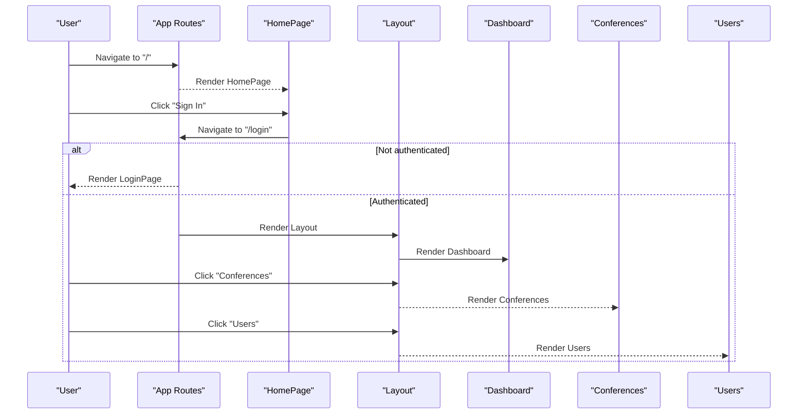

**Diagram sources**
- [App.tsx:17-35](file://jmp-ui/src/App.tsx#L17-L35)
- [HomePage.tsx:111-113](file://jmp-ui/src/pages/HomePage.tsx#L111-L113)
- [Layout.tsx:36-166](file://jmp-ui/src/components/Layout.tsx#L36-L166)

**Section sources**
- [App.tsx:1-41](file://jmp-ui/src/App.tsx#L1-L41)
- [HomePage.tsx:1-277](file://jmp-ui/src/pages/HomePage.tsx#L1-L277)
- [Layout.tsx:36-166](file://jmp-ui/src/components/Layout.tsx#L36-L166)

### Authentication Flow (Login)
- **Enhanced** LoginPage now features Material-UI integration with form validation.
- Login form posts credentials to the backend with improved error handling.
- On success, sets user, access, and refresh tokens in the store.
- Redirects to the dashboard with smooth transitions.

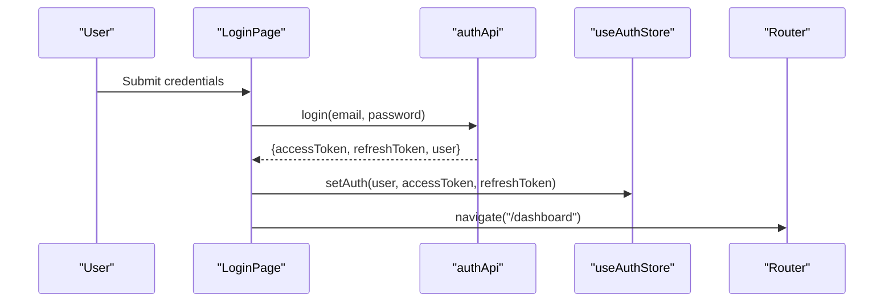

**Diagram sources**
- [LoginPage.tsx:60-76](file://jmp-ui/src/pages/LoginPage.tsx#L60-L76)
- [api.ts:61-66](file://jmp-ui/src/services/api.ts#L61-L66)
- [authStore.ts:23-35](file://jmp-ui/src/store/authStore.ts#L23-L35)

**Section sources**
- [LoginPage.tsx:1-493](file://jmp-ui/src/pages/LoginPage.tsx#L1-L493)
- [api.ts:61-66](file://jmp-ui/src/services/api.ts#L61-L66)
- [authStore.ts:1-47](file://jmp-ui/src/store/authStore.ts#L1-L47)

### HomePage Component
- **New** Comprehensive landing page replacing the previous login-focused design.
- Features glassmorphism design with animated background elements.
- Three action cards: Create Instant Meeting, Connect to Meeting, and Sign In.
- Built-in theme toggle with smooth transitions.
- Responsive design with mobile-first approach.
- Framer Motion animations for enhanced user experience.

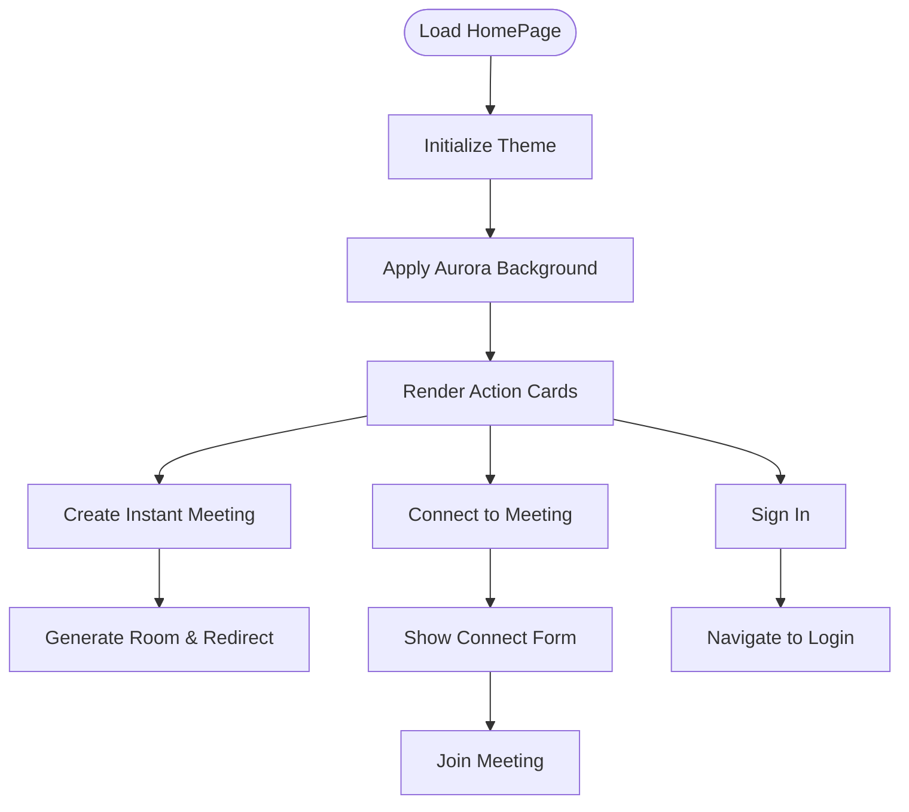

**Diagram sources**
- [HomePage.tsx:54-122](file://jmp-ui/src/pages/HomePage.tsx#L54-L122)

**Section sources**
- [HomePage.tsx:1-277](file://jmp-ui/src/pages/HomePage.tsx#L1-L277)
- [HomePage.css:1-635](file://jmp-ui/src/pages/HomePage.css#L1-L635)

### Dashboard Page
- Fetches active and upcoming conferences concurrently.
- Computes total participants from active conferences.
- Renders summary cards and a welcome message.

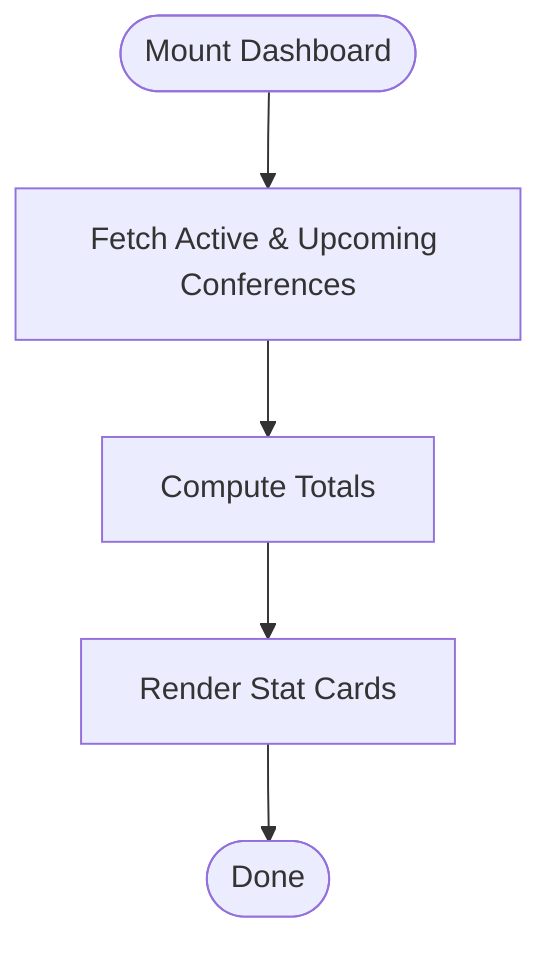

**Diagram sources**
- [DashboardPage.tsx:32-61](file://jmp-ui/src/pages/DashboardPage.tsx#L32-L61)

**Section sources**
- [DashboardPage.tsx:1-142](file://jmp-ui/src/pages/DashboardPage.tsx#L1-L142)
- [api.ts:78-92](file://jmp-ui/src/services/api.ts#L78-L92)

### Conferences Management
- Lists conferences with status, participants, and scheduling.
- Supports create/edit dialogs with toggles for recording and streaming.
- Actions to start/end conferences and delete entries.
- Search filtering via query parameters.

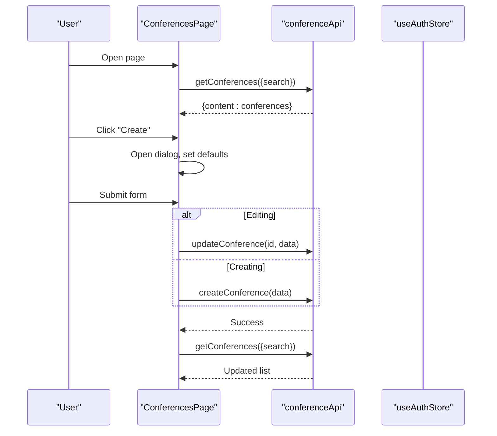

**Diagram sources**
- [ConferencesPage.tsx:46-128](file://jmp-ui/src/pages/ConferencesPage.tsx#L46-L128)
- [api.ts:78-92](file://jmp-ui/src/services/api.ts#L78-L92)

**Section sources**
- [ConferencesPage.tsx:1-299](file://jmp-ui/src/pages/ConferencesPage.tsx#L1-L299)
- [api.ts:78-92](file://jmp-ui/src/services/api.ts#L78-L92)

### Users Administration
- Lists users with roles and status chips.
- Supports create/edit dialogs with role selection.
- Password field optional on edit.
- Search filtering via query parameters.

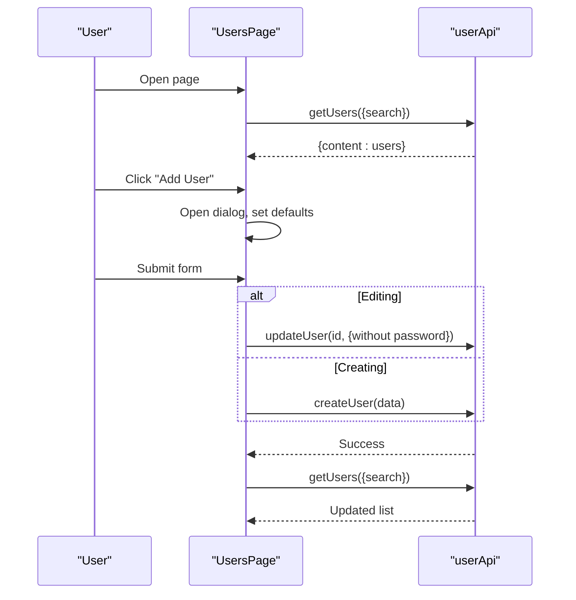

**Diagram sources**
- [UsersPage.tsx:38-115](file://jmp-ui/src/pages/UsersPage.tsx#L38-L115)
- [api.ts:68-76](file://jmp-ui/src/services/api.ts#L68-L76)

**Section sources**
- [UsersPage.tsx:1-249](file://jmp-ui/src/pages/UsersPage.tsx#L1-L249)
- [api.ts:68-76](file://jmp-ui/src/services/api.ts#L68-L76)

### Material-UI and Responsive Design
- **Enhanced** LoginPage now uses Material-UI components with form validation.
- Theme provider with light palette and CssBaseline.
- Drawer and AppBar with responsive breakpoints.
- Mobile-friendly temporary drawer and permanent desktop drawer.
- Typography scales and responsive units.

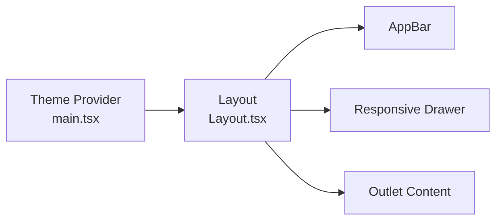

**Diagram sources**
- [main.tsx:9-29](file://jmp-ui/src/main.tsx#L9-L29)
- [Layout.tsx:83-165](file://jmp-ui/src/components/Layout.tsx#L83-L165)

**Section sources**
- [main.tsx:9-29](file://jmp-ui/src/main.tsx#L9-L29)
- [Layout.tsx:1-167](file://jmp-ui/src/components/Layout.tsx#L1-L167)
- [index.css:1-402](file://jmp-ui/src/index.css#L1-L402)

### API Integration Patterns
- Centralized base client with request/response interceptors.
- Automatic Authorization header injection.
- Token refresh on 401 with retry of original request.
- Dedicated API namespaces for auth, users, and conferences.

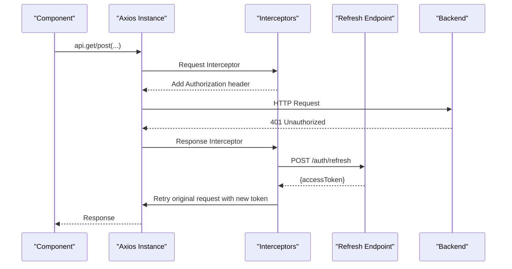

**Diagram sources**
- [api.ts:13-58](file://jmp-ui/src/services/api.ts#L13-L58)

**Section sources**
- [api.ts:1-93](file://jmp-ui/src/services/api.ts#L1-L93)

### State Management with Zustand
- **Enhanced** Two separate stores: authStore for authentication and themeStore for UI preferences.
- Store defines user, tokens, and authentication state.
- Persist middleware serializes selected fields to localStorage.
- Actions to set/clear auth and update access tokens.
- Theme store manages dark/light mode with system preference detection.

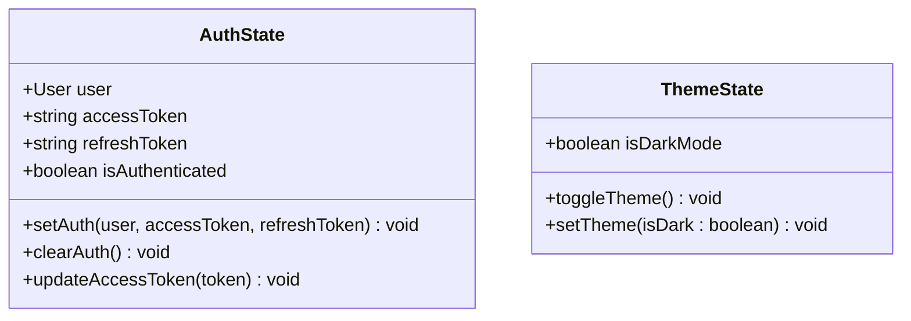

**Diagram sources**
- [authStore.ts:13-21](file://jmp-ui/src/store/authStore.ts#L13-L21)
- [themeStore.ts:4-8](file://jmp-ui/src/store/themeStore.ts#L4-L8)

**Section sources**
- [authStore.ts:1-47](file://jmp-ui/src/store/authStore.ts#L1-L47)
- [themeStore.ts:1-22](file://jmp-ui/src/store/themeStore.ts#L1-L22)

## Design System
The application features a comprehensive corporate design system with the following characteristics:

### Color Palette
- **Primary Blue-Gray**: Corporate blue (#3b82f6) with gradient variations
- **Accent Colors**: Blue (#3b82b6), Green (#22c55e), Cyan (#06b6d4), Purple (#8b5cf6)
- **Sidebar Colors**: Steel blue (#607d8b) with dark variants (#546e7a)
- **Glassmorphism**: Semi-transparent backgrounds with blur effects

### Typography System
- **Sans-serif**: Inter font family for modern readability
- **Headings**: Bold weights (600-800) with corporate spacing
- **Monospace**: JetBrains Mono for technical content
- **Responsive sizing**: Font scaling based on viewport

### Spacing & Dimensions
- **Space Scale**: 0.25rem increments up to 4rem
- **Border Radius**: 0.375rem to 1.5rem for various UI elements
- **Shadow System**: Multiple elevation levels (sm/md/lg/xl)
- **Transition Timing**: Cubic-bezier curves for smooth animations

### Theme Implementation
- **CSS Custom Properties**: Centralized color and dimension management
- **Dark Mode**: Automatic system preference detection
- **Smooth Transitions**: Consistent animation timing across all components
- **Accessibility**: High contrast ratios and reduced motion support

**Section sources**
- [index.css:1-402](file://jmp-ui/src/index.css#L1-L402)
- [HomePage.css:1-635](file://jmp-ui/src/pages/HomePage.css#L1-L635)
- [themeStore.ts:1-22](file://jmp-ui/src/store/themeStore.ts#L1-L22)

## Dependency Analysis
- **Runtime dependencies** include React, React DOM, React Router, Material-UI, Emotion, Axios, Zustand, Framer Motion, and Lucide React.
- **Build and dev dependencies** include Vite, React plugin, TypeScript, ESLint, and related TypeScript ESLint plugins.
- **Enhanced** Framer Motion for animations and Lucide React for icons.
- **New** Zustand persist middleware for state persistence.

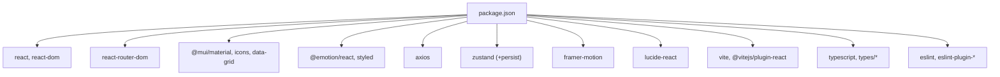

**Diagram sources**
- [package.json:12-42](file://jmp-ui/package.json#L12-L42)

**Section sources**
- [package.json:1-42](file://jmp-ui/package.json#L1-L42)

## Performance Considerations
- **Enhanced** HomePage with lazy loading and optimized animations.
- Concurrent data fetching on dashboard to reduce load time.
- Local storage persistence for authentication and theme preferences reduces re-login frequency.
- Axios interceptors avoid redundant token checks per request.
- Material-UI components are tree-shaken via scoped imports.
- Vite's fast refresh and optimized bundling improve development and production builds.
- **New** CSS custom properties for efficient theme switching without repaints.
- **Enhanced** Framer Motion animations with hardware acceleration.
- nginx caching for static assets and gzip compression reduce payload sizes.
- Client-side routing handled by nginx with fallback to index.html.

## Troubleshooting Guide
- **Enhanced** HomePage not displaying correctly
  - Verify CSS custom properties are loaded in index.css.
  - Check theme store initialization and localStorage persistence.
  - Ensure Framer Motion is properly imported and configured.
- Authentication loops or immediate redirects
  - Verify environment variable for base API URL and ensure it matches backend endpoint.
  - Confirm that refresh token exists in store when 401 occurs.
- **Enhanced** LoginPage form validation issues
  - Check Material-UI TextField components and input adornments.
  - Verify form submission handlers and error state management.
  - Ensure proper focus management and accessibility attributes.
- 401 errors after token expiration
  - Ensure refresh endpoint is reachable and returns a new access token.
  - Check that the retry mechanism is not stuck in a loop due to missing refresh token.
- UI not rendering or blank screen
  - Confirm theme provider and CssBaseline are initialized in the entry point.
  - Verify Material-UI components are imported correctly.
  - Check for CSS custom property conflicts in HomePage styles.
- Styling inconsistencies
  - Check global CSS media queries and ensure responsive breakpoints align with Material-UI.
  - Validate that Material-UI theme variables match CSS custom properties.
  - Verify theme store state synchronization with CSS classes.

**Section sources**
- [api.ts:4-11](file://jmp-ui/src/services/api.ts#L4-L11)
- [api.ts:25-58](file://jmp-ui/src/services/api.ts#L25-L58)
- [main.tsx:21-29](file://jmp-ui/src/main.tsx#L21-L29)
- [index.css:1-402](file://jmp-ui/src/index.css#L1-L402)
- [HomePage.css:1-635](file://jmp-ui/src/pages/HomePage.css#L1-L635)
- [LoginPage.tsx:1-493](file://jmp-ui/src/pages/LoginPage.tsx#L1-L493)

## Conclusion
The frontend application is a modern, responsive React application using Material-UI and TypeScript, with robust routing, centralized state management via Zustand stores, and a comprehensive design system featuring glassmorphism aesthetics and smooth animations. The application now features a sophisticated HomePage component with enhanced user experience, improved LoginPage with Material-UI integration, and persistent theme management. The build and deployment pipeline leverages Vite and nginx for efficient delivery. The documented pages and components provide a clear foundation for extending functionality while maintaining consistency in design and behavior.

## Appendices

### Build Configuration and Scripts
- Development: starts Vite dev server.
- Build: compiles TypeScript and runs Vite build to produce dist assets.
- Preview: serves the production build locally.
- Lint: runs ESLint across TypeScript/TSX files.

**Section sources**
- [package.json:6-11](file://jmp-ui/package.json#L6-L11)

### Deployment Pipeline
- Multi-stage Docker build:
  - Node stage installs dependencies and builds the app.
  - Nginx stage serves the built assets with gzip and caching.
- Nginx configuration:
  - Proxies /api/ requests to the backend service.
  - Handles SPA routing via index.html fallback.
  - Sets cache headers for static assets.

**Section sources**
- [Dockerfile:1-33](file://jmp-ui/Dockerfile#L1-L33)
- [nginx.conf:1-37](file://jmp-ui/nginx.conf#L1-L37)

### Development Workflow
- Use Vite's fast refresh during development.
- Follow ESLint rules for hooks and React refresh.
- Keep TypeScript strictness enabled via tsconfig references.
- **New** Utilize CSS custom properties for consistent theming across components.

**Section sources**
- [vite.config.ts:1-8](file://jmp-ui/vite.config.ts#L1-L8)
- [eslint.config.js:1-24](file://jmp-ui/eslint.config.js#L1-L24)
- [tsconfig.json:1-8](file://jmp-ui/tsconfig.json#L1-L8)

### Accessibility Compliance Guidelines
- **Enhanced** HomePage with proper ARIA labels and keyboard navigation.
- **Enhanced** LoginPage with form validation and error announcements.
- Prefer semantic HTML and Material-UI components for built-in ARIA attributes.
- Ensure sufficient color contrast for text and interactive elements.
- Provide focus management for modals and dialogs.
- Use descriptive labels and icons with appropriate alt text.
- Test keyboard navigation and screen reader compatibility.
- Support reduced motion preferences and high contrast modes.

**Section sources**
- [HomePage.tsx:129-141](file://jmp-ui/src/pages/HomePage.tsx#L129-L141)
- [LoginPage.tsx:136-163](file://jmp-ui/src/pages/LoginPage.tsx#L136-L163)

### Browser Compatibility
- Modern browsers with ES2020+ support.
- Material-UI components require up-to-date browser engines.
- CSS custom properties are supported in modern browsers; consider fallbacks if legacy IE support is required.
- **New** Framer Motion requires modern browser animation support.
- **New** Glassmorphism effects may require vendor prefixes in older browsers.

**Section sources**
- [index.css:1-402](file://jmp-ui/src/index.css#L1-L402)
- [HomePage.css:1-635](file://jmp-ui/src/pages/HomePage.css#L1-L635)