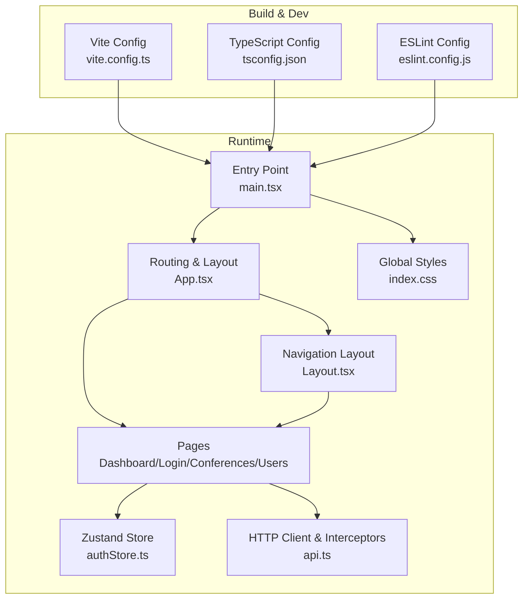
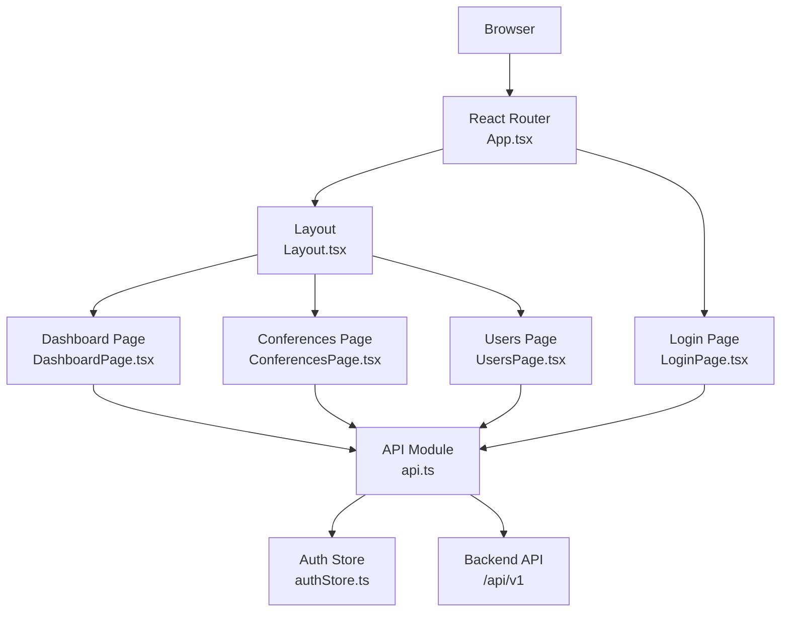
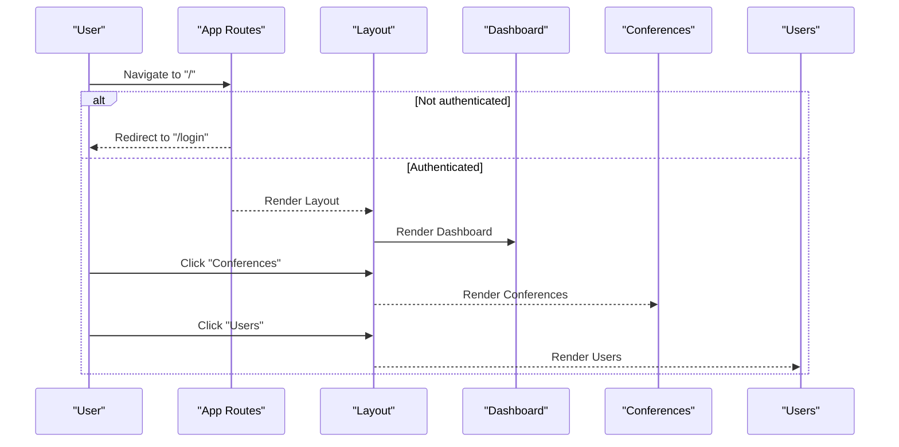
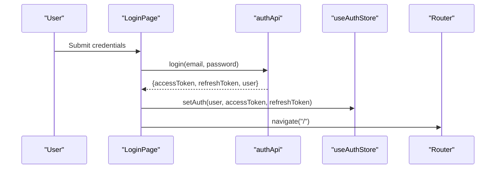
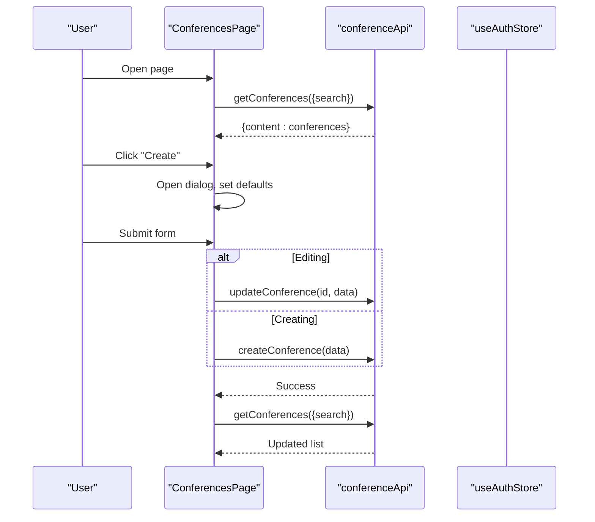
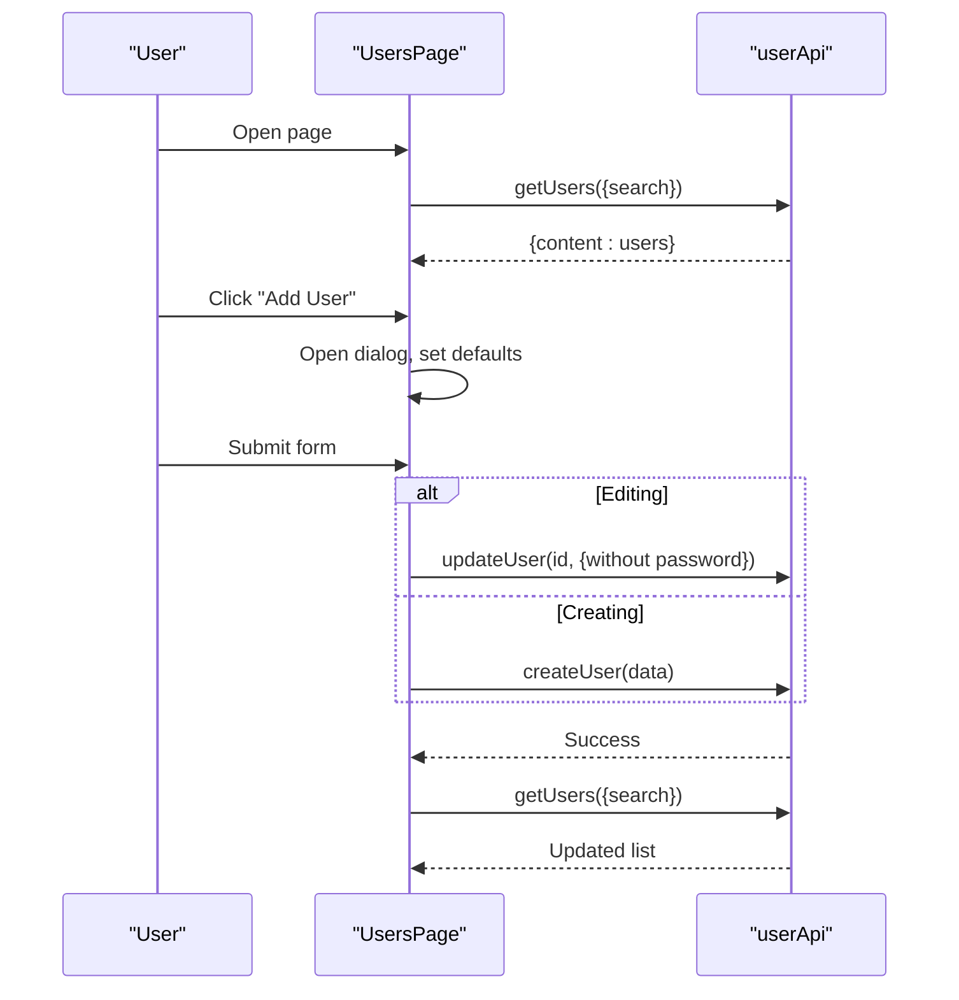
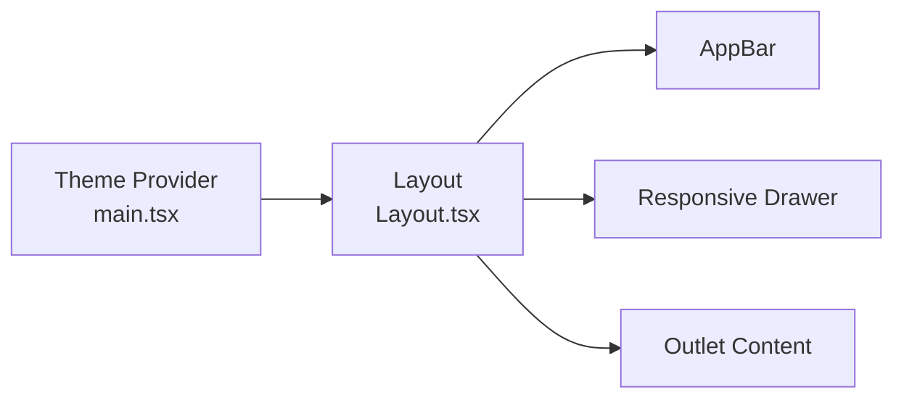
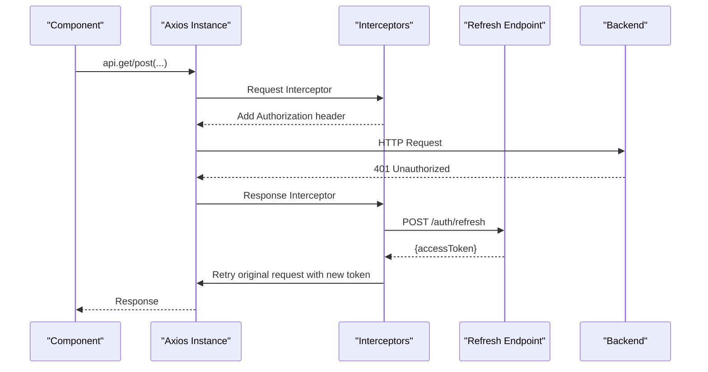
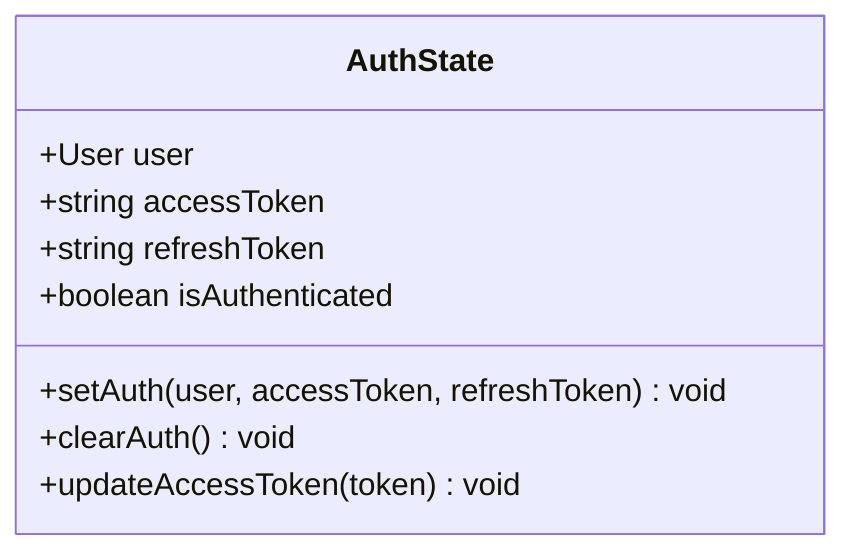
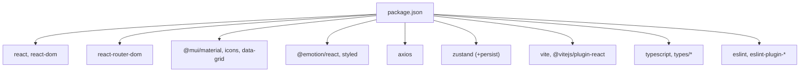

# Frontend Application

<cite>
**Referenced Files in This Document**
- [package.json](file://jmp-ui/package.json)
- [vite.config.ts](file://jmp-ui/vite.config.ts)
- [App.tsx](file://jmp-ui/src/App.tsx)
- [main.tsx](file://jmp-ui/src/main.tsx)
- [Layout.tsx](file://jmp-ui/src/components/Layout.tsx)
- [authStore.ts](file://jmp-ui/src/store/authStore.ts)
- [api.ts](file://jmp-ui/src/services/api.ts)
- [LoginPage.tsx](file://jmp-ui/src/pages/LoginPage.tsx)
- [DashboardPage.tsx](file://jmp-ui/src/pages/DashboardPage.tsx)
- [ConferencesPage.tsx](file://jmp-ui/src/pages/ConferencesPage.tsx)
- [UsersPage.tsx](file://jmp-ui/src/pages/UsersPage.tsx)
- [index.css](file://jmp-ui/src/index.css)
- [tsconfig.json](file://jmp-ui/tsconfig.json)
- [eslint.config.js](file://jmp-ui/eslint.config.js)
- [Dockerfile](file://jmp-ui/Dockerfile)
- [nginx.conf](file://jmp-ui/nginx.conf)
</cite>

## Table of Contents
1. [Introduction](#introduction)
2. [Project Structure](#project-structure)
3. [Core Components](#core-components)
4. [Architecture Overview](#architecture-overview)
5. [Detailed Component Analysis](#detailed-component-analysis)
6. [Dependency Analysis](#dependency-analysis)
7. [Performance Considerations](#performance-considerations)
8. [Troubleshooting Guide](#troubleshooting-guide)
9. [Conclusion](#conclusion)
10. [Appendices](#appendices)

## Introduction
This document describes the React-based frontend application for the Jitsi Management Platform (JMP). It covers the component hierarchy, routing configuration, state management with Zustand stores, Material-UI integration, responsive design patterns, and user interface components. It documents the application pages (dashboard, conference management, user administration, and login), authentication state management, API integration patterns, and the deployment pipeline. Guidance is included for component development, styling approaches, accessibility compliance, performance optimization, and browser compatibility.

## Project Structure
The frontend is a Vite-powered React application written in TypeScript. It uses Material-UI for UI components, Axios for HTTP requests, React Router for navigation, and Zustand for state management. The application is containerized with a multi-stage Docker build and served via nginx.

**Diagram sources**
- [vite.config.ts:1-8](file://jmp-ui/vite.config.ts#L1-L8)
- [tsconfig.json:1-8](file://jmp-ui/tsconfig.json#L1-L8)
- [eslint.config.js:1-24](file://jmp-ui/eslint.config.js#L1-L24)
- [main.tsx:1-31](file://jmp-ui/src/main.tsx#L1-L31)
- [App.tsx:1-34](file://jmp-ui/src/App.tsx#L1-L34)
- [Layout.tsx:1-167](file://jmp-ui/src/components/Layout.tsx#L1-L167)
- [DashboardPage.tsx:1-142](file://jmp-ui/src/pages/DashboardPage.tsx#L1-L142)
- [LoginPage.tsx:1-124](file://jmp-ui/src/pages/LoginPage.tsx#L1-L124)
- [ConferencesPage.tsx:1-299](file://jmp-ui/src/pages/ConferencesPage.tsx#L1-L299)
- [UsersPage.tsx:1-249](file://jmp-ui/src/pages/UsersPage.tsx#L1-L249)
- [authStore.ts:1-47](file://jmp-ui/src/store/authStore.ts#L1-L47)
- [api.ts:1-93](file://jmp-ui/src/services/api.ts#L1-L93)
- [index.css:1-112](file://jmp-ui/src/index.css#L1-L112)

**Section sources**
- [package.json:1-39](file://jmp-ui/package.json#L1-L39)
- [vite.config.ts:1-8](file://jmp-ui/vite.config.ts#L1-L8)
- [tsconfig.json:1-8](file://jmp-ui/tsconfig.json#L1-L8)
- [eslint.config.js:1-24](file://jmp-ui/eslint.config.js#L1-L24)
- [main.tsx:1-31](file://jmp-ui/src/main.tsx#L1-L31)
- [App.tsx:1-34](file://jmp-ui/src/App.tsx#L1-L34)
- [Layout.tsx:1-167](file://jmp-ui/src/components/Layout.tsx#L1-L167)
- [authStore.ts:1-47](file://jmp-ui/src/store/authStore.ts#L1-L47)
- [api.ts:1-93](file://jmp-ui/src/services/api.ts#L1-L93)
- [index.css:1-112](file://jmp-ui/src/index.css#L1-L112)

## Core Components
- Routing and Navigation
  - Central route configuration with protected routes and nested layout.
  - Login route with redirect when authenticated.
  - Nested routes for dashboard, conferences, and users under the authenticated layout.

- Authentication State Management (Zustand)
  - Stores user profile, tokens, and authentication status.
  - Persists state to local storage with selective serialization.
  - Provides actions to set/clear auth and update access tokens.

- HTTP Client and Interceptors (Axios)
  - Base URL configured via environment variable.
  - Automatic Authorization header injection.
  - Token refresh flow on 401 responses using refresh token.

- Material-UI Integration
  - Theme provider with light palette and CssBaseline.
  - Responsive drawer and app bar with mobile/touch support.
  - Consistent use of MUI components across pages.

**Section sources**
- [App.tsx:1-34](file://jmp-ui/src/App.tsx#L1-L34)
- [authStore.ts:1-47](file://jmp-ui/src/store/authStore.ts#L1-L47)
- [api.ts:1-93](file://jmp-ui/src/services/api.ts#L1-L93)
- [main.tsx:9-29](file://jmp-ui/src/main.tsx#L9-L29)
- [Layout.tsx:36-166](file://jmp-ui/src/components/Layout.tsx#L36-L166)

## Architecture Overview
The application follows a layered architecture:
- Presentation Layer: React components and Material-UI.
- State Layer: Zustand stores for authentication.
- Services Layer: Axios-based API module with interceptors.
- Routing Layer: React Router with protected routes.
- Infrastructure: Vite build, Docker image, nginx reverse proxy.

**Diagram sources**
- [App.tsx:1-34](file://jmp-ui/src/App.tsx#L1-L34)
- [Layout.tsx:36-166](file://jmp-ui/src/components/Layout.tsx#L36-L166)
- [DashboardPage.tsx:1-142](file://jmp-ui/src/pages/DashboardPage.tsx#L1-L142)
- [ConferencesPage.tsx:1-299](file://jmp-ui/src/pages/ConferencesPage.tsx#L1-L299)
- [UsersPage.tsx:1-249](file://jmp-ui/src/pages/UsersPage.tsx#L1-L249)
- [LoginPage.tsx:1-124](file://jmp-ui/src/pages/LoginPage.tsx#L1-L124)
- [authStore.ts:1-47](file://jmp-ui/src/store/authStore.ts#L1-L47)
- [api.ts:1-93](file://jmp-ui/src/services/api.ts#L1-L93)

## Detailed Component Analysis

### Routing and Protected Layout
- Root routes define login and authenticated area.
- Authenticated area wraps nested routes and renders the shared layout.
- Layout manages sidebar navigation and logout.

**Diagram sources**
- [App.tsx:10-31](file://jmp-ui/src/App.tsx#L10-L31)
- [Layout.tsx:36-166](file://jmp-ui/src/components/Layout.tsx#L36-L166)

**Section sources**
- [App.tsx:1-34](file://jmp-ui/src/App.tsx#L1-L34)
- [Layout.tsx:36-166](file://jmp-ui/src/components/Layout.tsx#L36-L166)

### Authentication Flow (Login)
- Login form posts credentials to the backend.
- On success, sets user, access, and refresh tokens in the store.
- Redirects to the dashboard.

**Diagram sources**
- [LoginPage.tsx:16-40](file://jmp-ui/src/pages/LoginPage.tsx#L16-L40)
- [api.ts:61-66](file://jmp-ui/src/services/api.ts#L61-L66)
- [authStore.ts:23-35](file://jmp-ui/src/store/authStore.ts#L23-L35)

**Section sources**
- [LoginPage.tsx:1-124](file://jmp-ui/src/pages/LoginPage.tsx#L1-L124)
- [api.ts:61-66](file://jmp-ui/src/services/api.ts#L61-L66)
- [authStore.ts:1-47](file://jmp-ui/src/store/authStore.ts#L1-L47)

### Dashboard Page
- Fetches active and upcoming conferences concurrently.
- Computes total participants from active conferences.
- Renders summary cards and a welcome message.

**Diagram sources**
- [DashboardPage.tsx:32-61](file://jmp-ui/src/pages/DashboardPage.tsx#L32-L61)

**Section sources**
- [DashboardPage.tsx:1-142](file://jmp-ui/src/pages/DashboardPage.tsx#L1-L142)
- [api.ts:78-92](file://jmp-ui/src/services/api.ts#L78-L92)

### Conferences Management
- Lists conferences with status, participants, and scheduling.
- Supports create/edit dialogs with toggles for recording and streaming.
- Actions to start/end conferences and delete entries.
- Search filtering via query parameters.

**Diagram sources**
- [ConferencesPage.tsx:46-128](file://jmp-ui/src/pages/ConferencesPage.tsx#L46-L128)
- [api.ts:78-92](file://jmp-ui/src/services/api.ts#L78-L92)

**Section sources**
- [ConferencesPage.tsx:1-299](file://jmp-ui/src/pages/ConferencesPage.tsx#L1-L299)
- [api.ts:78-92](file://jmp-ui/src/services/api.ts#L78-L92)

### Users Administration
- Lists users with roles and status chips.
- Supports create/edit dialogs with role selection.
- Password field optional on edit.
- Search filtering via query parameters.

**Diagram sources**
- [UsersPage.tsx:38-115](file://jmp-ui/src/pages/UsersPage.tsx#L38-L115)
- [api.ts:68-76](file://jmp-ui/src/services/api.ts#L68-L76)

**Section sources**
- [UsersPage.tsx:1-249](file://jmp-ui/src/pages/UsersPage.tsx#L1-L249)
- [api.ts:68-76](file://jmp-ui/src/services/api.ts#L68-L76)

### Material-UI and Responsive Design
- Theme provider with light palette and CssBaseline.
- Drawer and AppBar with responsive breakpoints.
- Mobile-friendly temporary drawer and permanent desktop drawer.
- Typography scales and responsive units.

**Diagram sources**
- [main.tsx:9-29](file://jmp-ui/src/main.tsx#L9-L29)
- [Layout.tsx:83-165](file://jmp-ui/src/components/Layout.tsx#L83-L165)

**Section sources**
- [main.tsx:9-29](file://jmp-ui/src/main.tsx#L9-L29)
- [Layout.tsx:1-167](file://jmp-ui/src/components/Layout.tsx#L1-L167)
- [index.css:1-112](file://jmp-ui/src/index.css#L1-L112)

### API Integration Patterns
- Centralized base client with request/response interceptors.
- Automatic Authorization header injection.
- Token refresh on 401 with retry of original request.
- Dedicated API namespaces for auth, users, and conferences.

**Diagram sources**
- [api.ts:13-58](file://jmp-ui/src/services/api.ts#L13-L58)

**Section sources**
- [api.ts:1-93](file://jmp-ui/src/services/api.ts#L1-L93)

### State Management with Zustand
- Store defines user, tokens, and authentication state.
- Persist middleware serializes selected fields to localStorage.
- Actions to set/clear auth and update access tokens.

**Diagram sources**
- [authStore.ts:13-21](file://jmp-ui/src/store/authStore.ts#L13-L21)

**Section sources**
- [authStore.ts:1-47](file://jmp-ui/src/store/authStore.ts#L1-L47)

## Dependency Analysis
- Runtime dependencies include React, React DOM, React Router, Material-UI, Emotion, Axios, and Zustand.
- Build and dev dependencies include Vite, React plugin, TypeScript, ESLint, and related TypeScript ESLint plugins.
- The application exposes a development script, a production build script, and a preview script.

**Diagram sources**
- [package.json:12-37](file://jmp-ui/package.json#L12-L37)

**Section sources**
- [package.json:1-39](file://jmp-ui/package.json#L1-L39)

## Performance Considerations
- Concurrent data fetching on dashboard to reduce load time.
- Local storage persistence for authentication reduces re-login frequency.
- Axios interceptors avoid redundant token checks per request.
- Material-UI components are tree-shaken via scoped imports.
- Vite’s fast refresh and optimized bundling improve development and production builds.
- nginx caching for static assets and gzip compression reduce payload sizes.
- Client-side routing handled by nginx with fallback to index.html.

[No sources needed since this section provides general guidance]

## Troubleshooting Guide
- Authentication loops or immediate redirects
  - Verify environment variable for base API URL and ensure it matches backend endpoint.
  - Confirm that refresh token exists in store when 401 occurs.
- 401 errors after token expiration
  - Ensure refresh endpoint is reachable and returns a new access token.
  - Check that the retry mechanism is not stuck in a loop due to missing refresh token.
- UI not rendering or blank screen
  - Confirm theme provider and CssBaseline are initialized in the entry point.
  - Verify Material-UI components are imported correctly.
- Styling inconsistencies
  - Check global CSS media queries and ensure responsive breakpoints align with Material-UI.
  - Validate that Material-UI theme variables match CSS custom properties.

**Section sources**
- [api.ts:4-11](file://jmp-ui/src/services/api.ts#L4-L11)
- [api.ts:25-58](file://jmp-ui/src/services/api.ts#L25-L58)
- [main.tsx:21-29](file://jmp-ui/src/main.tsx#L21-L29)
- [index.css:1-112](file://jmp-ui/src/index.css#L1-L112)

## Conclusion
The frontend application is a modern, responsive React application using Material-UI and TypeScript, with robust routing, centralized state management via Zustand, and a well-structured HTTP client with automatic token refresh. The build and deployment pipeline leverages Vite and nginx for efficient delivery. The documented pages and components provide a clear foundation for extending functionality while maintaining consistency in design and behavior.

[No sources needed since this section summarizes without analyzing specific files]

## Appendices

### Build Configuration and Scripts
- Development: starts Vite dev server.
- Build: compiles TypeScript and runs Vite build to produce dist assets.
- Preview: serves the production build locally.
- Lint: runs ESLint across TypeScript/TSX files.

**Section sources**
- [package.json:6-11](file://jmp-ui/package.json#L6-L11)

### Deployment Pipeline
- Multi-stage Docker build:
  - Node stage installs dependencies and builds the app.
  - Nginx stage serves the built assets with gzip and caching.
- Nginx configuration:
  - Proxies /api/ requests to the backend service.
  - Handles SPA routing via index.html fallback.
  - Sets cache headers for static assets.

**Section sources**
- [Dockerfile:1-33](file://jmp-ui/Dockerfile#L1-L33)
- [nginx.conf:1-37](file://jmp-ui/nginx.conf#L1-L37)

### Development Workflow
- Use Vite’s fast refresh during development.
- Follow ESLint rules for hooks and React refresh.
- Keep TypeScript strictness enabled via tsconfig references.

**Section sources**
- [vite.config.ts:1-8](file://jmp-ui/vite.config.ts#L1-L8)
- [eslint.config.js:1-24](file://jmp-ui/eslint.config.js#L1-L24)
- [tsconfig.json:1-8](file://jmp-ui/tsconfig.json#L1-L8)

### Accessibility Compliance Guidelines
- Prefer semantic HTML and Material-UI components for built-in ARIA attributes.
- Ensure sufficient color contrast for text and interactive elements.
- Provide focus management for modals and dialogs.
- Use descriptive labels and icons with appropriate alt text.
- Test keyboard navigation and screen reader compatibility.

[No sources needed since this section provides general guidance]

### Browser Compatibility
- Modern browsers with ES2020+ support.
- Material-UI components require up-to-date browser engines.
- CSS custom properties are supported in modern browsers; consider fallbacks if legacy IE support is required.

[No sources needed since this section provides general guidance]