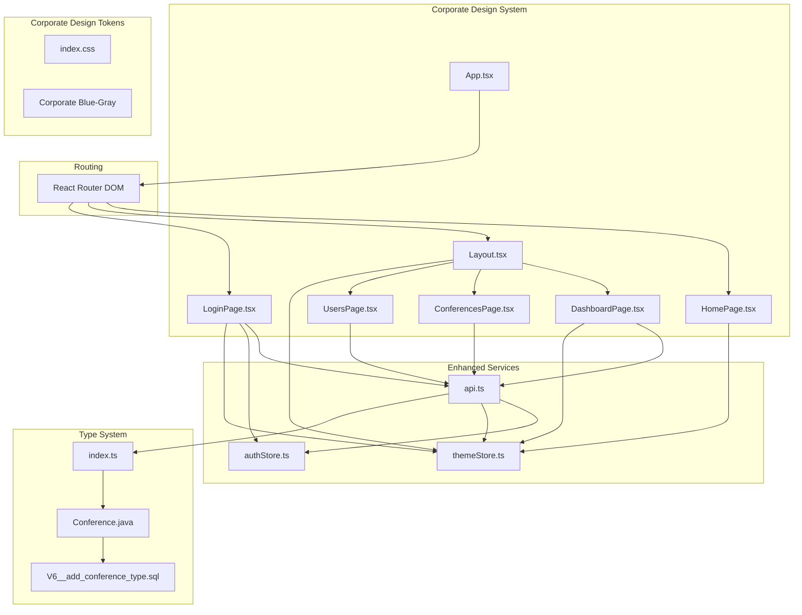
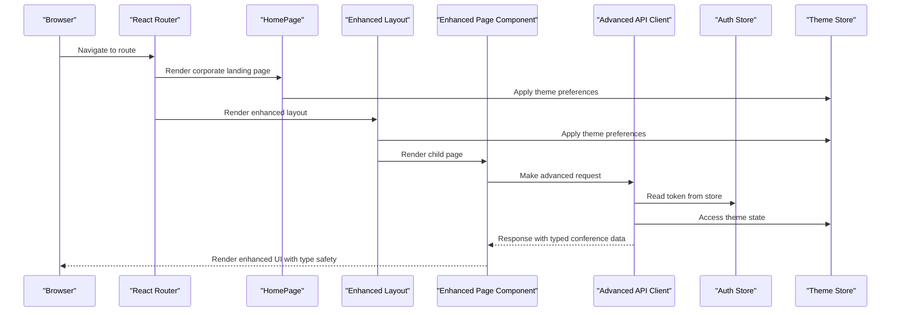
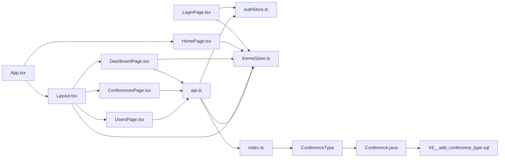

# Pages and Components

<cite>
**Referenced Files in This Document**
- [App.tsx](file://jmp-ui/src/App.tsx)
- [main.tsx](file://jmp-ui/src/main.tsx)
- [Layout.tsx](file://jmp-ui/src/components/Layout.tsx)
- [DashboardPage.tsx](file://jmp-ui/src/pages/DashboardPage.tsx)
- [ConferencesPage.tsx](file://jmp-ui/src/pages/ConferencesPage.tsx)
- [UsersPage.tsx](file://jmp-ui/src/pages/UsersPage.tsx)
- [LoginPage.tsx](file://jmp-ui/src/pages/LoginPage.tsx)
- [HomePage.tsx](file://jmp-ui/src/pages/HomePage.tsx)
- [HomePage.css](file://jmp-ui/src/pages/HomePage.css)
- [api.ts](file://jmp-ui/src/services/api.ts)
- [authStore.ts](file://jmp-ui/src/store/authStore.ts)
- [themeStore.ts](file://jmp-ui/src/store/themeStore.ts)
- [index.ts](file://jmp-ui/src/types/index.ts)
- [index.css](file://jmp-ui/src/index.css)
- [package.json](file://jmp-ui/package.json)
- [index.html](file://jmp-ui/index.html)
- [V6__add_conference_type.sql](file://jmp-web/src/main/resources/db/migration/V6__add_conference_type.sql)
- [Conference.java](file://jmp-domain/src/main/java/com/jmp/domain/entity/Conference.java)
</cite>

## Update Summary
**Changes Made**
- **HomePage component added** as new landing page replacing previous design system
- **Corporate blue-gray aesthetic** replaces glassmorphism/aurora theme
- **Modern elevation shadows** replace glassmorphism effects
- **Solid color backgrounds** replace transparent glass effects
- **Enhanced ConferencesPage** with new SCHEDULED/PERMANENT conference type support
- **Integrated TypeScript type system** with strong typing for ConferenceType and ConferenceFormData
- **Comprehensive conference type validation** and conditional field handling
- **Updated database schema** with new type column and indexing
- **Enhanced conference cards** with type-specific styling and badges
- **Improved conference creation/editing dialogs** with type selection and validation

## Table of Contents
1. [Introduction](#introduction)
2. [Project Structure](#project-structure)
3. [Core Components](#core-components)
4. [Architecture Overview](#architecture-overview)
5. [Detailed Component Analysis](#detailed-component-analysis)
6. [Enhanced Conference Type System](#enhanced-conference-type-system)
7. [Advanced Analytics Features](#advanced-analytics-features)
8. [Corporate Blue-Gray Design System](#corporate-blue-gray-design-system)
9. [Dependency Analysis](#dependency-analysis)
10. [Performance Considerations](#performance-considerations)
11. [Troubleshooting Guide](#troubleshooting-guide)
12. [Conclusion](#conclusion)
13. [Appendices](#appendices)

## Introduction
This document provides comprehensive documentation for the enhanced application pages and reusable components in the jmp-ui frontend. The application has undergone a major transformation, introducing a new HomePage component as the primary landing page and transitioning from a glassmorphism/aurora design system to a modern corporate blue-gray aesthetic with solid color backgrounds and contemporary elevation shadows. The enhanced pages now feature sophisticated dashboard analytics with charting, improved conference management with advanced filtering, modernized user administration with avatar systems, and a sophisticated layout with dark/light mode switching.

## Project Structure
The frontend is a modern React application built with Vite and TypeScript, featuring a comprehensive corporate blue-gray design system with advanced state management. The application is organized into:
- **HomePage**: New landing page with corporate aesthetic and instant meeting functionality
- **Pages**: Enhanced DashboardPage with analytics, ConferencesPage with advanced filtering, UsersPage with avatar system, LoginPage with theme toggle
- **Components**: Layout with corporate blue-gray design and theme switching
- **Services**: Advanced API client with analytics endpoints and interceptors
- **Store**: Zustand-based authentication and theme state management with persistence
- **Design System**: Corporate blue-gray color palette with modern elevation shadows
- **Types**: Strongly typed TypeScript interfaces for conference management

**Diagram sources**
- [App.tsx:10-31](file://jmp-ui/src/App.tsx#L10-L31)
- [HomePage.tsx:54-277](file://jmp-ui/src/pages/HomePage.tsx#L54-L277)
- [Layout.tsx:48-520](file://jmp-ui/src/components/Layout.tsx#L48-L520)
- [DashboardPage.tsx:160-599](file://jmp-ui/src/pages/DashboardPage.tsx#L160-L599)
- [ConferencesPage.tsx:106-1054](file://jmp-ui/src/pages/ConferencesPage.tsx#L106-L1054)
- [UsersPage.tsx:118-710](file://jmp-ui/src/pages/UsersPage.tsx#L118-L710)
- [LoginPage.tsx:41-457](file://jmp-ui/src/pages/LoginPage.tsx#L41-L457)
- [api.ts:60-191](file://jmp-ui/src/services/api.ts#L60-L191)
- [authStore.ts:23-46](file://jmp-ui/src/store/authStore.ts#L23-L46)
- [themeStore.ts:10-22](file://jmp-ui/src/store/themeStore.ts#L10-L22)
- [index.ts:1-43](file://jmp-ui/src/types/index.ts#L1-L43)
- [Conference.java:240-243](file://jmp-domain/src/main/java/com/jmp/domain/entity/Conference.java#L240-L243)
- [V6__add_conference_type.sql:1-15](file://jmp-web/src/main/resources/db/migration/V6__add_conference_type.sql#L1-L15)

**Section sources**
- [App.tsx:10-31](file://jmp-ui/src/App.tsx#L10-L31)
- [main.tsx:9-31](file://jmp-ui/src/main.tsx#L9-L31)
- [index.html:1-14](file://jmp-ui/index.html#L1-L14)

## Core Components
This section outlines the enhanced core components and their advanced responsibilities:
- **HomePage**: New corporate landing page featuring instant meeting creation, meeting joining functionality, and theme toggle integration
- **Enhanced Layout**: Provides corporate blue-gray navigation with modern elevation shadows and theme switching
- **Advanced DashboardPage**: Features comprehensive analytics with Recharts integration, system health monitoring, and interactive dashboard metrics
- **Enhanced ConferencesPage**: Implements advanced filtering, real-time participant tracking, conference cards with status indicators, enhanced CRUD operations, and comprehensive conference type management
- **Modern UsersPage**: Includes avatar system with gradient backgrounds, role-based styling, user status management, and improved user interface
- **Enhanced LoginPage**: Features theme toggle integration, corporate design aesthetic, demo credentials, and improved authentication experience
- **Advanced API Service**: Extends beyond basic HTTP client to include comprehensive analytics endpoints and enhanced error handling
- **Dual Store System**: Combines Zustand stores for authentication and theme management with persistent state across sessions
- **Strong Type System**: Comprehensive TypeScript interfaces for conference management with compile-time type safety

**Section sources**
- [HomePage.tsx:54-277](file://jmp-ui/src/pages/HomePage.tsx#L54-L277)
- [Layout.tsx:48-520](file://jmp-ui/src/components/Layout.tsx#L48-L520)
- [DashboardPage.tsx:160-599](file://jmp-ui/src/pages/DashboardPage.tsx#L160-L599)
- [ConferencesPage.tsx:106-1054](file://jmp-ui/src/pages/ConferencesPage.tsx#L106-L1054)
- [UsersPage.tsx:118-710](file://jmp-ui/src/pages/UsersPage.tsx#L118-L710)
- [LoginPage.tsx:41-457](file://jmp-ui/src/pages/LoginPage.tsx#L41-L457)
- [api.ts:60-191](file://jmp-ui/src/services/api.ts#L60-L191)
- [authStore.ts:23-46](file://jmp-ui/src/store/authStore.ts#L23-L46)
- [themeStore.ts:10-22](file://jmp-ui/src/store/themeStore.ts#L10-L22)
- [index.ts:1-43](file://jmp-ui/src/types/index.ts#L1-L43)

## Architecture Overview
The application follows an enhanced layered architecture with modern design patterns:
- **Presentation Layer**: Enhanced React components with corporate blue-gray design and animation libraries
- **Service Layer**: Advanced Axios-based API client with comprehensive analytics endpoints and interceptors
- **State Management**: Dual Zustand stores for authentication and theme management with persistence
- **Design System**: Corporate blue-gray color palette with modern elevation shadows and solid backgrounds
- **Type System**: Comprehensive TypeScript interfaces ensuring compile-time type safety
- **Routing**: React Router DOM with protected routes and enhanced layout outlet

**Diagram sources**
- [App.tsx:15-27](file://jmp-ui/src/App.tsx#L15-L27)
- [HomePage.tsx:58-65](file://jmp-ui/src/pages/HomePage.tsx#L58-L65)
- [Layout.tsx:57-64](file://jmp-ui/src/components/Layout.tsx#L57-L64)
- [DashboardPage.tsx:210-229](file://jmp-ui/src/pages/DashboardPage.tsx#L210-L229)
- [api.ts:68-112](file://jmp-ui/src/services/api.ts#L68-L112)
- [authStore.ts:30-35](file://jmp-ui/src/store/authStore.ts#L30-L35)
- [themeStore.ts:13-15](file://jmp-ui/src/store/themeStore.ts#L13-L15)

## Detailed Component Analysis

### HomePage Component
**New Section** Corporate landing page featuring instant meeting creation and modern design aesthetics.

Purpose:
- Serves as the primary entry point with corporate blue-gray design
- Provides instant meeting creation without authentication requirements
- Enables meeting joining via code or link with enhanced user experience
- Integrates theme toggle functionality with persistent preferences

Key behaviors:
- Corporate logo with gradient blue aesthetic and modern typography
- Three-action card grid: Create Instant Meeting, Connect to Meeting, Sign In
- Expandable connect form with animated transitions and validation
- Theme toggle with smooth rotation animations
- Decorative floating blobs with corporate color scheme
- Responsive design with mobile-first approach

State and props:
- Local state: isConnectExpanded (boolean), meetingCode (string)
- Enhanced theme integration with Zustand store
- Corporate design system integration with CSS custom properties

Event handlers:
- generateRoomAndRedirect: Creates unique room ID and opens Jitsi Web
- joinMeeting: Handles meeting joining via code or URL
- handleJoinSubmit: Processes form submission for meeting connections
- Theme toggle with animation effects

Material-UI integration:
- Enhanced with Framer Motion for animations and transitions
- Corporate design system with modern elevation shadows
- Responsive grid layout with corporate color palette

**Section sources**
- [HomePage.tsx:54-277](file://jmp-ui/src/pages/HomePage.tsx#L54-L277)
- [HomePage.css:15-635](file://jmp-ui/src/pages/HomePage.css#L15-L635)

### Enhanced ConferencesPage
**Updated** Major enhancements include comprehensive conference type management, improved form handling, and TypeScript integration.

Purpose:
- Manages conference listings with advanced search and filtering capabilities
- Displays conference cards with status indicators, participant counts, and type-specific styling
- Supports create, edit, delete operations with enhanced modal dialogs and type validation
- Implements real-time participant tracking and status management
- Provides comprehensive conference type management with SCHEDULED and PERMANENT options

Key behaviors:
- Advanced conference cards with type-based styling and gradient accents
- Real-time participant count display with current/max participants
- Type-specific feature badges for recording, live streaming, and screen sharing
- Enhanced search functionality with debounced input handling
- Status-based action buttons (Start/End) with conditional rendering
- Comprehensive form validation with type-specific requirements
- Type selector with ToggleButtonGroup for intuitive conference type selection

State and props:
- Local state: conferences array, loading states, search filters, dialog management, form data with ConferenceFormData type
- Enhanced status configuration with color-coded chips and icons
- Strongly typed form state with ConferenceType union type
- Type-specific validation rules and conditional field handling

Event handlers:
- handleCreate, handleEdit, handleDelete for CRUD operations
- handleStart, handleEnd for conference lifecycle management
- Enhanced form handling with type-specific validation and payload construction
- Type change handler with conditional field updates

Material-UI integration:
- Advanced grid layout with responsive design, enhanced chip components, and comprehensive form controls
- ToggleButtonGroup for type selection with corporate design aesthetic
- Conditional form fields based on selected conference type

**Section sources**
- [ConferencesPage.tsx:106-1054](file://jmp-ui/src/pages/ConferencesPage.tsx#L106-L1054)
- [index.ts:29-42](file://jmp-ui/src/types/index.ts#L29-L42)

### Enhanced Conference Type System
**New Section** Comprehensive conference type management system with TypeScript integration and database support.

The application now features a robust conference type system supporting both SCHEDULED and PERMANENT conference types:

#### Conference Type Definitions
- **SCHEDULED**: Fixed-time conferences with start/end dates and times
- **PERMANENT**: Always-available rooms with no scheduled times
- **Type Safety**: Strongly typed using TypeScript union type `ConferenceType`
- **Default Value**: Database defaults to SCHEDULED for backward compatibility

#### Frontend Implementation
- **Type Selector**: ToggleButtonGroup with calendar and door icons
- **Conditional Validation**: Different validation rules for each type
- **Payload Construction**: Automatic field handling based on conference type
- **UI Styling**: Distinct color schemes and badges for each type

#### Backend Integration
- **Database Schema**: New `type` column with ENUM-like behavior
- **Indexing**: Optimized queries with type-based indexes
- **Migration Support**: Non-breaking schema evolution
- **Status Management**: Separate ConferenceStatus enum for lifecycle management

**Section sources**
- [ConferencesPage.tsx:100-124](file://jmp-ui/src/pages/ConferencesPage.tsx#L100-L124)
- [ConferencesPage.tsx:802-845](file://jmp-ui/src/pages/ConferencesPage.tsx#L802-L845)
- [ConferencesPage.tsx:239-282](file://jmp-ui/src/pages/ConferencesPage.tsx#L239-L282)
- [index.ts:1](file://jmp-ui/src/types/index.ts#L1)
- [Conference.java:240-243](file://jmp-domain/src/main/java/com/jmp/domain/entity/Conference.java#L240-L243)
- [V6__add_conference_type.sql:4-11](file://jmp-web/src/main/resources/db/migration/V6__add_conference_type.sql#L4-L11)

### Enhanced DashboardPage
**Updated** Major enhancements include advanced analytics, charting capabilities, and system health monitoring.

Purpose:
- Fetches comprehensive dashboard statistics including active conferences, upcoming conferences, participant metrics, and recording analytics
- Integrates Recharts for interactive area charts displaying weekly usage trends
- Displays system health metrics for administrators with real-time CPU and memory monitoring
- Implements corporate blue-gray design with modern elevation shadows

Key behaviors:
- Concurrent API calls for active/upcoming conferences and analytics data
- Advanced chart rendering with Recharts including gradient fills and tooltips
- System health monitoring with progress bars and real-time metrics
- Responsive grid layout with animated card transitions using Framer Motion
- Conditional rendering for admin-only system health metrics

State and props:
- Local state: stats (activeConferences, upcomingConferences, totalParticipants, totalRecordings), loading states, dashboardMetrics, systemHealth
- Custom components: BentoCard for grid layout, StatCard for metric display

Event handlers:
- None (no interactive actions on the page itself)

Material-UI integration:
- Enhanced with Recharts for data visualization, Framer Motion for animations, and corporate blue-gray design system

**Section sources**
- [DashboardPage.tsx:160-599](file://jmp-ui/src/pages/DashboardPage.tsx#L160-L599)

### Modern UsersPage
**Updated** Complete redesign with avatar system, role-based styling, and improved user management.

Purpose:
- Manages user listings with advanced search and filtering
- Implements avatar system with gradient backgrounds and initials
- Displays user roles with color-coded chips and status indicators
- Supports create, edit, and delete operations with enhanced modal dialogs

Key behaviors:
- Avatar system with gradient backgrounds based on user ID
- Role-based color coding with distinct accent colors for different roles
- Status-based chips with appropriate icons and styling
- Enhanced user cards with join date display and action buttons
- Improved form handling with conditional password fields

State and props:
- Local state: users array, loading states, search filters, dialog management, form data
- Enhanced status configuration with comprehensive status management
- Avatar generation system with gradient backgrounds

Event handlers:
- handleCreate, handleEdit, handleDelete for user management
- Enhanced form handling with role assignment and conditional fields

Material-UI integration:
- Advanced grid layout with responsive design, avatar components, and comprehensive chip styling

**Section sources**
- [UsersPage.tsx:118-710](file://jmp-ui/src/pages/UsersPage.tsx#L118-L710)

### Enhanced LoginPage
**Updated** Major enhancements include corporate design integration, demo credentials, and improved user experience.

Purpose:
- Authenticates users with enhanced form validation and error handling
- Integrates theme toggle functionality with persistent preferences
- Provides corporate design aesthetic with modern elevation shadows
- Implements improved user experience with password visibility toggle

Key behaviors:
- Theme toggle integration with automatic class application to document
- Corporate design system integration with blue-gray color palette
- Demo credentials display for testing purposes
- Enhanced form validation with proper error handling
- Password visibility toggle for improved accessibility

State and props:
- Local state: email, password, showPassword, error, loading
- Enhanced theme integration with Zustand store

Event handlers:
- handleSubmit with comprehensive error handling
- Theme toggle with animation effects

Material-UI integration:
- Enhanced corporate design card with modern elevation shadows and solid backgrounds
- Animated elements with Framer Motion integration

**Section sources**
- [LoginPage.tsx:41-457](file://jmp-ui/src/pages/LoginPage.tsx#L41-L457)

### Enhanced Layout Component
**Updated** Complete redesign with corporate blue-gray aesthetic, modern elevation shadows, and enhanced navigation.

Purpose:
- Provides enhanced application shell with corporate blue-gray design and modern elevation shadows
- Manages theme switching with persistent preferences across sessions
- Implements responsive navigation with mobile/desktop variants
- Features enhanced user menu with avatar and logout functionality

Key behaviors:
- Corporate blue-gray design with modern elevation shadows and solid backgrounds
- Dynamic theme class application to document element
- Enhanced navigation with status indicators and gradient accents
- Responsive drawer behavior with mobile and desktop variants
- Theme toggle with smooth rotation effects

State and props:
- Local state: mobileOpen, anchorEl, enhanced with theme state management
- Enhanced theme integration with Zustand store

Event handlers:
- handleDrawerToggle for mobile navigation
- handleMenuOpen/handleMenuClose for user menu
- handleLogout with enhanced navigation
- Enhanced theme toggle with animation effects

Material-UI integration:
- Advanced drawer components with corporate design aesthetic
- Enhanced AppBar with modern elevation shadows and solid backgrounds
- Comprehensive tooltip and menu system with corporate design

**Section sources**
- [Layout.tsx:48-520](file://jmp-ui/src/components/Layout.tsx#L48-L520)

### Enhanced API Service and Dual Store System
**Updated** Advanced API client with comprehensive analytics endpoints and dual store management.

Purpose:
- Centralizes HTTP communication with advanced interceptors and analytics endpoints
- Manages dual state management with authentication and theme persistence
- Provides comprehensive analytics API endpoints for dashboard metrics
- Implements advanced error handling and token refresh mechanisms
- Supports strongly typed conference management operations

Key behaviors:
- Request interceptor with enhanced authorization header management
- Response interceptor with comprehensive token refresh and error handling
- Analytics API endpoints for dashboard metrics, usage reports, and system health
- Enhanced user and conference management endpoints with TypeScript support
- Comprehensive TypeScript interfaces for all API responses and requests

State and props:
- Enhanced auth store with partial serialization for selective persistence
- New theme store with automatic preference detection and persistence
- Comprehensive API endpoint definitions with strong TypeScript typing

Event handlers:
- None (store actions exposed via hooks)
- Enhanced API interceptors with comprehensive error handling

**Section sources**
- [api.ts:60-191](file://jmp-ui/src/services/api.ts#L60-L191)
- [authStore.ts:23-46](file://jmp-ui/src/store/authStore.ts#L23-L46)
- [themeStore.ts:10-22](file://jmp-ui/src/store/themeStore.ts#L10-L22)

## Enhanced Conference Type System
**New Section** Comprehensive conference type management system with TypeScript integration and database support.

### Conference Type Architecture
The application now supports two distinct conference types with comprehensive type safety:

#### ConferenceType Union Type
- **SCHEDULED**: Fixed-time conferences requiring start/end datetime validation
- **PERMANENT**: Always-available rooms with no scheduled time constraints
- **Type Safety**: Compile-time enforcement preventing invalid type assignments
- **Default Behavior**: Maintains backward compatibility with SCHEDULED as default

#### Frontend Type Management
- **Type Selector Interface**: ToggleButtonGroup with intuitive calendar/door icons
- **Conditional Field Handling**: Dynamic form fields based on selected type
- **Validation Logic**: Type-specific validation rules and error messages
- **UI Styling**: Distinct color schemes and badges for each conference type

#### Backend Type Integration
- **Database Schema**: New `type` column with ENUM-like behavior
- **Migration Strategy**: Non-breaking schema evolution with default values
- **Query Optimization**: Type-based indexing for improved performance
- **Status Separation**: Independent ConferenceStatus enum for lifecycle management

### Type-Specific Features
- **SCHEDULED Conferences**: Require datetime validation, scheduled start/end times
- **PERMANENT Conferences**: Always available, no time constraints, special "Always Available" indicator
- **Feature Differences**: Different UI representations and validation requirements
- **Backend Mapping**: Proper serialization/deserialization of type values

**Section sources**
- [ConferencesPage.tsx:100-124](file://jmp-ui/src/pages/ConferencesPage.tsx#L100-L124)
- [ConferencesPage.tsx:802-845](file://jmp-ui/src/pages/ConferencesPage.tsx#L802-L845)
- [ConferencesPage.tsx:239-282](file://jmp-ui/src/pages/ConferencesPage.tsx#L239-L282)
- [index.ts:1](file://jmp-ui/src/types/index.ts#L1)
- [Conference.java:240-243](file://jmp-domain/src/main/java/com/jmp/domain/entity/Conference.java#L240-L243)
- [V6__add_conference_type.sql:4-11](file://jmp-web/src/main/resources/db/migration/V6__add_conference_type.sql#L4-L11)

## Advanced Analytics Features
**New Section** Comprehensive analytics capabilities with real-time data visualization and system monitoring.

### Dashboard Analytics
- **Real-time Metrics**: Active conferences, upcoming conferences, participant counts, and recording statistics
- **Interactive Charts**: Recharts integration for weekly usage trends with gradient fills and tooltips
- **System Health Monitoring**: CPU usage, memory usage, connection counts, and response time metrics
- **Conditional Rendering**: Admin-only system health display with role-based access control

### Analytics API Endpoints
- **Dashboard Metrics**: Comprehensive conference and participant analytics
- **Usage Reports**: Historical data with customizable date ranges
- **Participant Analytics**: Unique participants, average participation, and trend analysis
- **Recording Analytics**: Storage usage, duration statistics, and type distribution
- **System Health**: Real-time infrastructure monitoring and performance metrics

### Visualization Features
- **Area Charts**: Interactive charts with gradient fills and responsive containers
- **Progress Indicators**: Color-coded progress bars with threshold-based coloring
- **Animated Loading**: Smooth loading states with rotating animations
- **Responsive Design**: Charts adapt to different screen sizes and orientations

**Section sources**
- [DashboardPage.tsx:210-229](file://jmp-ui/src/pages/DashboardPage.tsx#L210-L229)
- [api.ts:180-191](file://jmp-ui/src/services/api.ts#L180-L191)

## Corporate Blue-Gray Design System
**New Section** Comprehensive corporate blue-gray design system with modern elevation shadows and solid color backgrounds.

### Corporate Blue-Gray Color Palette
- **Primary Blue**: `#1976d2` (primary color) with light/dark variants
- **Accent Blues**: Corporate blue (`#3b82f6`), cyan (`#06b6d4`), and steel blue (`#607d8b`)
- **Sidebar Colors**: Steel blue backgrounds (`#607d8b`) with white text contrast
- **Text Colors**: Dark gray (`#374151`) for primary text, medium gray (`#6b7280`) for muted text
- **Background Gradients**: Corporate gradients from light blue to gray backgrounds

### Modern Elevation System
- **Shadow Tokens**: `--shadow-sm`, `--shadow-md`, `--shadow-lg`, `--shadow-xl` with corporate blue accents
- **Solid Backgrounds**: Replace transparent glass with solid corporate blue-gray backgrounds
- **Elevation Layers**: Progressive shadow layers for depth perception
- **Border Radius**: Consistent radius tokens from `--radius-sm` to `--radius-full`

### Design Token System
- **Typography Scale**: Inter font family with responsive sizing
- **Spacing System**: Consistent spacing from `--space-1` to `--space-16`
- **Border Radius**: Multiple radius values for different UI elements
- **Transition Timing**: Smooth cubic-bezier timing functions for animations

### Component Styling Patterns
- **Corporate Cards**: Solid blue-gray backgrounds with corporate blue accents
- **Gradient Text**: Corporate blue gradients for headings and emphasis
- **Status Chips**: Color-coded chips with appropriate corporate color schemes
- **Avatar System**: Corporate blue gradient backgrounds with initials display

**Section sources**
- [index.css:1-402](file://jmp-ui/src/index.css#L1-L402)
- [DashboardPage.tsx:74-106](file://jmp-ui/src/pages/DashboardPage.tsx#L74-L106)
- [ConferencesPage.tsx:303-347](file://jmp-ui/src/pages/ConferencesPage.tsx#L303-L347)
- [UsersPage.tsx:308-349](file://jmp-ui/src/pages/UsersPage.tsx#L308-L349)

## Dependency Analysis
This section maps the enhanced dependencies between components and services.

**Diagram sources**
- [App.tsx:10-31](file://jmp-ui/src/App.tsx#L10-L31)
- [HomePage.tsx:56-57](file://jmp-ui/src/pages/HomePage.tsx#L56-L57)
- [Layout.tsx:52-53](file://jmp-ui/src/components/Layout.tsx#L52-L53)
- [DashboardPage.tsx:34-35](file://jmp-ui/src/pages/DashboardPage.tsx#L34-L35)
- [ConferencesPage.tsx:35](file://jmp-ui/src/pages/ConferencesPage.tsx#L35)
- [UsersPage.tsx:32](file://jmp-ui/src/pages/UsersPage.tsx#L32)
- [api.ts:2](file://jmp-ui/src/services/api.ts#L2)
- [authStore.ts:1](file://jmp-ui/src/store/authStore.ts#L1)
- [themeStore.ts:1](file://jmp-ui/src/store/themeStore.ts#L1)
- [index.ts:1](file://jmp-ui/src/types/index.ts#L1)
- [Conference.java:240-243](file://jmp-domain/src/main/java/com/jmp/domain/entity/Conference.java#L240-L243)
- [V6__add_conference_type.sql:4-11](file://jmp-web/src/main/resources/db/migration/V6__add_conference_type.sql#L4-L11)

**Section sources**
- [App.tsx:10-31](file://jmp-ui/src/App.tsx#L10-L31)
- [api.ts:60-191](file://jmp-ui/src/services/api.ts#L60-L191)
- [authStore.ts:23-46](file://jmp-ui/src/store/authStore.ts#L23-L46)
- [themeStore.ts:10-22](file://jmp-ui/src/store/themeStore.ts#L10-L22)
- [index.ts:1-43](file://jmp-ui/src/types/index.ts#L1-L43)

## Performance Considerations
Enhanced performance optimizations for the modernized application:

- **Enhanced Debouncing**: Advanced debouncing for search inputs in ConferencesPage and UsersPage
- **Virtualized Lists**: Consider implementing virtualized lists for large conference and user datasets
- **Smart Caching**: Implement caching strategies for frequently accessed analytics data
- **Lazy Loading**: Enhanced lazy loading for non-critical resources and animations
- **Optimized Re-renders**: Memoized derived data and shallow comparisons for improved performance
- **Corporate Design Performance**: Solid backgrounds eliminate expensive blur effects, improving rendering performance
- **Bundle Optimization**: Tree-shaking for unused components and libraries
- **TypeScript Compilation**: Compile-time type checking reduces runtime errors and improves performance
- **Conditional Rendering**: Type-specific rendering optimizations for conference cards and forms

## Troubleshooting Guide
Enhanced troubleshooting for the modernized application:

### Theme and Design Issues
- **Theme Persistence**: Verify localStorage keys 'jmp-theme-storage' exist and contain valid data
- **Corporate Design**: Check browser dev tools for proper CSS variable resolution in corporate blue-gray palette
- **Animation Performance**: Monitor GPU usage for decorative animations and consider reducing complexity on low-end devices

### Analytics and Data Issues
- **Chart Rendering**: Verify Recharts dependencies and ensure proper data structure for chart components
- **API Endpoints**: Test analytics endpoints separately as they may require admin privileges
- **Data Formatting**: Ensure proper date formatting for weekly usage charts and system health metrics

### Enhanced Authentication Issues
- **Token Refresh**: Verify refresh token availability and proper handling of 401 responses
- **Store Persistence**: Check both 'jmp-auth-storage' and 'jmp-theme-storage' for proper data persistence
- **Session Management**: Monitor authentication state across page reloads and browser tabs

### Conference Type Issues
- **Type Validation**: Verify ConferenceType union type is properly enforced in form submissions
- **Database Migration**: Ensure V6__add_conference_type.sql migration has been applied successfully
- **Type Display**: Check that conference cards properly render type-specific styling and badges
- **Form Handling**: Verify conditional form fields appear/disappear based on selected conference type

### Component-Specific Issues
- **Corporate Design**: Verify proper corporate blue-gray color application and elevation shadows
- **Responsive Layouts**: Test mobile/desktop variants thoroughly across different screen sizes
- **Animation Performance**: Monitor frame rates for corporate design animations and consider performance optimizations
- **TypeScript Errors**: Check for compile-time type errors in conference-related components

**Section sources**
- [api.ts:79-112](file://jmp-ui/src/services/api.ts#L79-L112)
- [authStore.ts:30-35](file://jmp-ui/src/store/authStore.ts#L30-L35)
- [themeStore.ts:13-15](file://jmp-ui/src/store/themeStore.ts#L13-L15)
- [ConferencesPage.tsx:239-282](file://jmp-ui/src/pages/ConferencesPage.tsx#L239-L282)
- [V6__add_conference_type.sql:4-11](file://jmp-web/src/main/resources/db/migration/V6__add_conference_type.sql#L4-L11)
- [LoginPage.tsx:71-76](file://jmp-ui/src/pages/LoginPage.tsx#L71-L76)

## Conclusion
The enhanced application provides a modern, sophisticated React frontend with corporate blue-gray design aesthetics, comprehensive analytics capabilities, and advanced theme management. The addition of the new HomePage component as the primary landing page, combined with the transition from glassmorphism/aurora to corporate blue-gray design, creates a cohesive and professional user experience. The upgraded pages feature real-time data visualization, enhanced user experiences, and responsive design patterns with modern elevation shadows and solid color backgrounds. The dual store system ensures persistent state management, while the comprehensive theme system delivers seamless light/dark mode switching. The integration of modern design principles with functional requirements creates a robust foundation for continued development and feature expansion.

The addition of comprehensive conference type management with TypeScript integration represents a significant architectural improvement, providing compile-time type safety and enhanced developer experience. The database migration strategy ensures backward compatibility while enabling future feature development.

## Appendices
- **Corporate Theming**: Comprehensive CSS custom properties system with corporate blue-gray palette and modern elevation shadows
- **Advanced Routing**: Protected routes with enhanced layout outlet and responsive navigation
- **Comprehensive API**: Extended API endpoints for analytics, user management, and conference operations
- **Modern Build Tools**: Vite configuration with TypeScript, ESLint, and modern development workflow
- **Type Safety**: Comprehensive TypeScript interfaces ensuring compile-time type checking and enhanced developer experience
- **Database Evolution**: Non-breaking schema migrations supporting future feature development

**Section sources**
- [main.tsx:9-31](file://jmp-ui/src/main.tsx#L9-L31)
- [App.tsx:15-27](file://jmp-ui/src/App.tsx#L15-L27)
- [api.ts:60-191](file://jmp-ui/src/services/api.ts#L60-L191)
- [package.json:12-42](file://jmp-ui/package.json#L12-L42)
- [index.html:1-14](file://jmp-ui/index.html#L1-L14)
- [index.ts:1-43](file://jmp-ui/src/types/index.ts#L1-L43)
- [Conference.java:240-243](file://jmp-domain/src/main/java/com/jmp/domain/entity/Conference.java#L240-L243)
- [V6__add_conference_type.sql:4-11](file://jmp-web/src/main/resources/db/migration/V6__add_conference_type.sql#L4-L11)