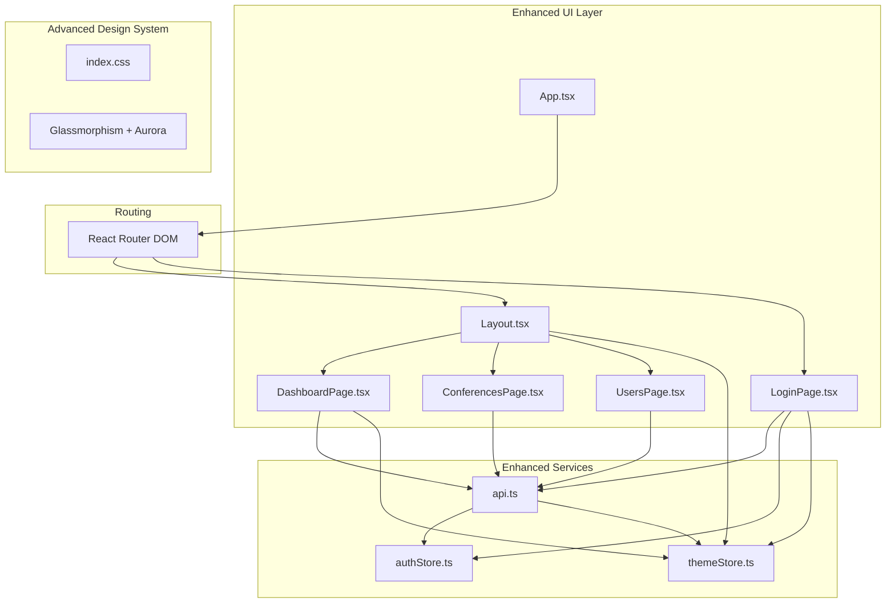
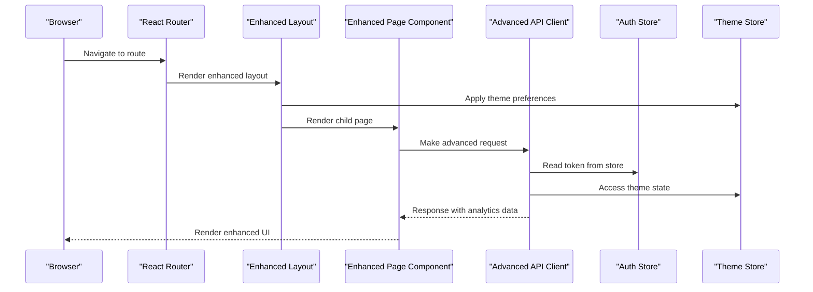
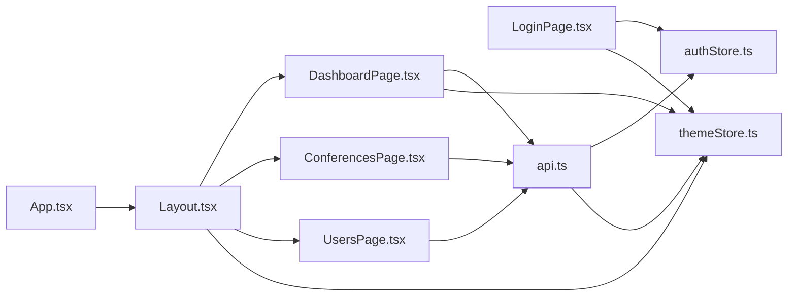

# Pages and Components

<cite>
**Referenced Files in This Document**
- [App.tsx](file://jmp-ui/src/App.tsx)
- [main.tsx](file://jmp-ui/src/main.tsx)
- [Layout.tsx](file://jmp-ui/src/components/Layout.tsx)
- [DashboardPage.tsx](file://jmp-ui/src/pages/DashboardPage.tsx)
- [ConferencesPage.tsx](file://jmp-ui/src/pages/ConferencesPage.tsx)
- [UsersPage.tsx](file://jmp-ui/src/pages/UsersPage.tsx)
- [LoginPage.tsx](file://jmp-ui/src/pages/LoginPage.tsx)
- [api.ts](file://jmp-ui/src/services/api.ts)
- [authStore.ts](file://jmp-ui/src/store/authStore.ts)
- [themeStore.ts](file://jmp-ui/src/store/themeStore.ts)
- [index.css](file://jmp-ui/src/index.css)
- [package.json](file://jmp-ui/package.json)
- [index.html](file://jmp-ui/index.html)
</cite>

## Update Summary
**Changes Made**
- Enhanced DashboardPage with advanced analytics cards, charting capabilities using Recharts, and system health monitoring
- Modernized Layout component with glassmorphism design, dark/light theme switching, and enhanced navigation
- Improved ConferencesPage with advanced filtering, real-time participant tracking, and enhanced conference cards
- Upgraded UsersPage with avatar system, role-based styling, and improved user management interface
- Added comprehensive theme management system with Zustand store and persistent theme preferences
- Implemented modern glassmorphism design system with Aurora background animations
- Enhanced LoginPage with theme toggle, animated backgrounds, and improved user experience

## Table of Contents
1. [Introduction](#introduction)
2. [Project Structure](#project-structure)
3. [Core Components](#core-components)
4. [Architecture Overview](#architecture-overview)
5. [Detailed Component Analysis](#detailed-component-analysis)
6. [Enhanced Theme System](#enhanced-theme-system)
7. [Advanced Analytics Features](#advanced-analytics-features)
8. [Modern UI Design System](#modern-ui-design-system)
9. [Dependency Analysis](#dependency-analysis)
10. [Performance Considerations](#performance-considerations)
11. [Troubleshooting Guide](#troubleshooting-guide)
12. [Conclusion](#conclusion)
13. [Appendices](#appendices)

## Introduction
This document provides comprehensive documentation for the enhanced application pages and reusable components in the jmp-ui frontend. The application has undergone major enhancements including a modern glassmorphism design system, advanced analytics capabilities, real-time participant tracking, and comprehensive theme management. The enhanced pages now feature sophisticated dashboard analytics with charting, improved conference management with advanced filtering, modernized user administration with avatar systems, and a sophisticated layout with dark/light mode switching.

## Project Structure
The frontend is a modern React application built with Vite and TypeScript, featuring a comprehensive glassmorphism design system and advanced state management. The application is organized into:
- Pages: Enhanced DashboardPage with analytics, ConferencesPage with advanced filtering, UsersPage with avatar system, LoginPage with theme toggle
- Components: Layout with glassmorphism design and theme switching
- Services: Advanced API client with analytics endpoints and interceptors
- Store: Zustand-based authentication and theme state management with persistence
- Design System: Comprehensive CSS custom properties and Aurora animations

**Diagram sources**
- [App.tsx:10-31](file://jmp-ui/src/App.tsx#L10-L31)
- [Layout.tsx:48-520](file://jmp-ui/src/components/Layout.tsx#L48-L520)
- [DashboardPage.tsx:160-599](file://jmp-ui/src/pages/DashboardPage.tsx#L160-L599)
- [ConferencesPage.tsx:106-768](file://jmp-ui/src/pages/ConferencesPage.tsx#L106-L768)
- [UsersPage.tsx:118-710](file://jmp-ui/src/pages/UsersPage.tsx#L118-L710)
- [LoginPage.tsx:41-457](file://jmp-ui/src/pages/LoginPage.tsx#L41-L457)
- [api.ts:60-159](file://jmp-ui/src/services/api.ts#L60-L159)
- [authStore.ts:23-46](file://jmp-ui/src/store/authStore.ts#L23-L46)
- [themeStore.ts:10-22](file://jmp-ui/src/store/themeStore.ts#L10-L22)

**Section sources**
- [App.tsx:10-31](file://jmp-ui/src/App.tsx#L10-L31)
- [main.tsx:9-31](file://jmp-ui/src/main.tsx#L9-L31)
- [index.html:1-14](file://jmp-ui/index.html#L1-L14)

## Core Components
This section outlines the enhanced core components and their advanced responsibilities:
- **Enhanced Layout**: Provides glassmorphism navigation with Aurora backgrounds, theme switching, and responsive design with mobile/desktop variants
- **Advanced DashboardPage**: Features comprehensive analytics with Recharts integration, system health monitoring, and interactive dashboard metrics
- **Enhanced ConferencesPage**: Implements advanced filtering, real-time participant tracking, conference cards with status indicators, and enhanced CRUD operations
- **Modern UsersPage**: Includes avatar system with gradient backgrounds, role-based styling, user status management, and improved user interface
- **Enhanced LoginPage**: Features theme toggle integration, animated backgrounds, demo credentials, and improved authentication experience
- **Advanced API Service**: Extends beyond basic HTTP client to include comprehensive analytics endpoints and enhanced error handling
- **Dual Store System**: Combines Zustand stores for authentication and theme management with persistent state across sessions

**Section sources**
- [Layout.tsx:48-520](file://jmp-ui/src/components/Layout.tsx#L48-L520)
- [DashboardPage.tsx:160-599](file://jmp-ui/src/pages/DashboardPage.tsx#L160-L599)
- [ConferencesPage.tsx:106-768](file://jmp-ui/src/pages/ConferencesPage.tsx#L106-L768)
- [UsersPage.tsx:118-710](file://jmp-ui/src/pages/UsersPage.tsx#L118-L710)
- [LoginPage.tsx:41-457](file://jmp-ui/src/pages/LoginPage.tsx#L41-L457)
- [api.ts:60-159](file://jmp-ui/src/services/api.ts#L60-L159)
- [authStore.ts:23-46](file://jmp-ui/src/store/authStore.ts#L23-L46)
- [themeStore.ts:10-22](file://jmp-ui/src/store/themeStore.ts#L10-L22)

## Architecture Overview
The application follows an enhanced layered architecture with modern design patterns:
- **Presentation Layer**: Enhanced React components with glassmorphism design and animation libraries
- **Service Layer**: Advanced Axios-based API client with comprehensive analytics endpoints and interceptors
- **State Management**: Dual Zustand stores for authentication and theme management with persistence
- **Design System**: CSS custom properties with light/dark mode support and Aurora animations
- **Routing**: React Router DOM with protected routes and enhanced layout outlet

**Diagram sources**
- [App.tsx:15-27](file://jmp-ui/src/App.tsx#L15-L27)
- [Layout.tsx:57-64](file://jmp-ui/src/components/Layout.tsx#L57-L64)
- [DashboardPage.tsx:210-229](file://jmp-ui/src/pages/DashboardPage.tsx#L210-L229)
- [api.ts:68-112](file://jmp-ui/src/services/api.ts#L68-L112)
- [authStore.ts:30-35](file://jmp-ui/src/store/authStore.ts#L30-L35)
- [themeStore.ts:13-15](file://jmp-ui/src/store/themeStore.ts#L13-L15)

## Detailed Component Analysis

### Enhanced DashboardPage
**Updated** Major enhancements include advanced analytics, charting capabilities, and system health monitoring.

Purpose:
- Fetches comprehensive dashboard statistics including active conferences, upcoming conferences, participant metrics, and recording analytics
- Integrates Recharts for interactive area charts displaying weekly usage trends
- Displays system health metrics for administrators with real-time CPU and memory monitoring
- Implements glassmorphism design with animated bento cards and gradient backgrounds

Key behaviors:
- Concurrent API calls for active/upcoming conferences and analytics data
- Advanced chart rendering with Recharts including gradient fills and tooltips
- System health monitoring with progress bars and real-time metrics
- Responsive grid layout with animated card transitions using Framer Motion
- Conditional rendering for admin-only system health metrics

State and props:
- Local state: stats (activeConferences, upcomingConferences, totalParticipants, totalRecordings), loading states, dashboardMetrics, systemHealth
- Custom components: BentoCard for grid layout, StatCard for metric display

Event handlers:
- None (no interactive actions on the page itself)

Material-UI integration:
- Enhanced with Recharts for data visualization, Framer Motion for animations, and comprehensive glassmorphism styling

**Section sources**
- [DashboardPage.tsx:160-599](file://jmp-ui/src/pages/DashboardPage.tsx#L160-L599)

### Enhanced ConferencesPage
**Updated** Significant improvements include advanced filtering, real-time participant tracking, and enhanced conference cards.

Purpose:
- Manages conference listings with advanced search and filtering capabilities
- Displays conference cards with status indicators, participant counts, and feature badges
- Supports create, edit, delete operations with enhanced modal dialogs
- Implements real-time participant tracking and status management

Key behaviors:
- Advanced conference cards with status-based styling and gradient accents
- Real-time participant count display with current/max participants
- Feature badges for recording, live streaming, and screen sharing
- Enhanced search functionality with debounced input handling
- Status-based action buttons (Start/End) with conditional rendering

State and props:
- Local state: conferences array, loading states, search filters, dialog management, form data
- Enhanced status configuration with color-coded chips and icons

Event handlers:
- handleCreate, handleEdit, handleDelete for CRUD operations
- handleStart, handleEnd for conference lifecycle management
- Enhanced form handling with additional conference settings

Material-UI integration:
- Advanced grid layout with responsive design, enhanced chip components, and comprehensive form controls

**Section sources**
- [ConferencesPage.tsx:106-768](file://jmp-ui/src/pages/ConferencesPage.tsx#L106-L768)

### Modern UsersPage
**Updated** Complete redesign with avatar system, role-based styling, and improved user management.

Purpose:
- Manages user listings with advanced search and filtering
- Implements avatar system with gradient backgrounds and initials
- Displays user roles with color-coded chips and status indicators
- Supports create, edit, and delete operations with enhanced modal dialogs

Key behaviors:
- Avatar system with gradient backgrounds based on user ID
- Role-based color coding with distinct accent colors for different roles
- Status-based chips with appropriate icons and styling
- Enhanced user cards with join date display and action buttons
- Improved form handling with conditional password fields

State and props:
- Local state: users array, loading states, search filters, dialog management, form data
- Enhanced status configuration with comprehensive status management
- Avatar generation system with gradient backgrounds

Event handlers:
- handleCreate, handleEdit, handleDelete for user management
- Enhanced form handling with role assignment and conditional fields

Material-UI integration:
- Advanced grid layout with responsive design, avatar components, and comprehensive chip styling

**Section sources**
- [UsersPage.tsx:118-710](file://jmp-ui/src/pages/UsersPage.tsx#L118-L710)

### Enhanced LoginPage
**Updated** Major enhancements include theme integration, animated backgrounds, and improved user experience.

Purpose:
- Authenticates users with enhanced form validation and error handling
- Integrates theme toggle functionality with persistent preferences
- Provides animated background effects and demo credentials
- Implements improved user experience with password visibility toggle

Key behaviors:
- Theme toggle integration with automatic class application to document
- Animated background effects with Aurora animations
- Demo credentials display for testing purposes
- Enhanced form validation with proper error handling
- Password visibility toggle for improved accessibility

State and props:
- Local state: email, password, showPassword, error, loading
- Enhanced theme integration with Zustand store

Event handlers:
- handleSubmit with comprehensive error handling
- Theme toggle with animation effects

Material-UI integration:
- Enhanced glassmorphism card design with gradient backgrounds and blur effects
- Animated elements with Framer Motion integration

**Section sources**
- [LoginPage.tsx:41-457](file://jmp-ui/src/pages/LoginPage.tsx#L41-L457)

### Enhanced Layout Component
**Updated** Complete redesign with glassmorphism design, dark/light theme switching, and enhanced navigation.

Purpose:
- Provides enhanced application shell with glassmorphism design and Aurora backgrounds
- Manages theme switching with persistent preferences across sessions
- Implements responsive navigation with mobile/desktop variants
- Features enhanced user menu with avatar and logout functionality

Key behaviors:
- Glassmorphism design with backdrop blur and transparent backgrounds
- Dynamic theme class application to document element
- Enhanced navigation with status indicators and gradient accents
- Responsive drawer behavior with mobile and desktop variants
- Theme toggle with animated rotation effects

State and props:
- Local state: mobileOpen, anchorEl, enhanced with theme state management
- Enhanced theme integration with Zustand store

Event handlers:
- handleDrawerToggle for mobile navigation
- handleMenuOpen/handleMenuClose for user menu
- handleLogout with enhanced navigation
- Enhanced theme toggle with animation effects

Material-UI integration:
- Advanced drawer components with glassmorphism styling
- Enhanced AppBar with blur effects and gradient backgrounds
- Comprehensive tooltip and menu system with glassmorphism design

**Section sources**
- [Layout.tsx:48-520](file://jmp-ui/src/components/Layout.tsx#L48-L520)

### Enhanced API Service and Dual Store System
**Updated** Advanced API client with comprehensive analytics endpoints and dual store management.

Purpose:
- Centralizes HTTP communication with advanced interceptors and analytics endpoints
- Manages dual state management with authentication and theme persistence
- Provides comprehensive analytics API endpoints for dashboard metrics
- Implements advanced error handling and token refresh mechanisms

Key behaviors:
- Request interceptor with enhanced authorization header management
- Response interceptor with comprehensive token refresh and error handling
- Analytics API endpoints for dashboard metrics, usage reports, and system health
- Enhanced user and conference management endpoints
- Comprehensive TypeScript interfaces for all API responses

State and props:
- Enhanced auth store with partial serialization for selective persistence
- New theme store with automatic preference detection and persistence
- Comprehensive API endpoint definitions with TypeScript support

Event handlers:
- None (store actions exposed via hooks)
- Enhanced API interceptors with comprehensive error handling

**Section sources**
- [api.ts:60-159](file://jmp-ui/src/services/api.ts#L60-L159)
- [authStore.ts:23-46](file://jmp-ui/src/store/authStore.ts#L23-L46)
- [themeStore.ts:10-22](file://jmp-ui/src/store/themeStore.ts#L10-L22)

## Enhanced Theme System
**New Section** Comprehensive theme management system with dark/light mode switching and persistent preferences.

The application features a sophisticated theme management system built on Zustand with persistent storage:

### Theme Store Implementation
- **Automatic Preference Detection**: Detects user's preferred color scheme using `prefers-color-scheme` media query
- **Persistent Storage**: Uses Zustand middleware for localStorage persistence across browser sessions
- **Dynamic Class Application**: Automatically applies 'dark' class to document element for seamless theme switching
- **Animation Integration**: Theme toggle includes smooth rotation animations for enhanced user experience

### Design System Architecture
- **CSS Custom Properties**: Comprehensive design tokens with light/dark mode variants
- **Glassmorphism Effects**: Backdrop blur, transparency, and modern elevation shadows
- **Aurora Animations**: Subtle background animations with gradient effects
- **Responsive Typography**: Flexible font sizing with breakpoint adjustments

### Theme Features
- **Light Mode**: Traditional light theme with soft gradients and subtle shadows
- **Dark Mode**: Deep space theme with enhanced contrast and glow effects
- **Smooth Transitions**: CSS transitions for all property changes with custom timing functions
- **Accent Color System**: Consistent color palette with primary, secondary, and accent colors

**Section sources**
- [themeStore.ts:10-22](file://jmp-ui/src/store/themeStore.ts#L10-L22)
- [index.css:1-345](file://jmp-ui/src/index.css#L1-L345)
- [Layout.tsx:57-64](file://jmp-ui/src/components/Layout.tsx#L57-L64)
- [LoginPage.tsx:51-58](file://jmp-ui/src/pages/LoginPage.tsx#L51-L58)

## Advanced Analytics Features
**New Section** Comprehensive analytics capabilities with real-time data visualization and system monitoring.

### Dashboard Analytics
- **Real-time Metrics**: Active conferences, upcoming conferences, participant counts, and recording statistics
- **Interactive Charts**: Recharts integration for weekly usage trends with gradient fills and tooltips
- **System Health Monitoring**: CPU usage, memory usage, connection counts, and response time metrics
- **Conditional Rendering**: Admin-only system health display with role-based access control

### Analytics API Endpoints
- **Dashboard Metrics**: Comprehensive conference and participant analytics
- **Usage Reports**: Historical data with customizable date ranges
- **Participant Analytics**: Unique participants, average participation, and trend analysis
- **Recording Analytics**: Storage usage, duration statistics, and type distribution
- **System Health**: Real-time infrastructure monitoring and performance metrics

### Visualization Features
- **Area Charts**: Interactive charts with gradient fills and responsive containers
- **Progress Indicators**: Color-coded progress bars with threshold-based coloring
- **Animated Loading**: Smooth loading states with rotating animations
- **Responsive Design**: Charts adapt to different screen sizes and orientations

**Section sources**
- [DashboardPage.tsx:210-229](file://jmp-ui/src/pages/DashboardPage.tsx#L210-L229)
- [api.ts:148-159](file://jmp-ui/src/services/api.ts#L148-L159)

## Modern UI Design System
**New Section** Comprehensive glassmorphism design system with Aurora animations and modern aesthetics.

### Glassmorphism Design
- **Backdrop Effects**: Full backdrop blur with `backdrop-filter: blur(20px)` for all glass cards
- **Transparent Backgrounds**: `rgba()` values for subtle transparency effects
- **Elevation System**: Progressive shadow layers with `var(--shadow-lg)` and `var(--shadow-xl)`
- **Border Effects**: Soft borders with `var(--glass-border)` for depth perception

### Aurora Animation System
- **Background Animations**: Subtle radial gradient movements with `@keyframes aurora-flow`
- **Decorative Elements**: Floating gradient orbs with blur effects and pulsing animations
- **Glow Effects**: Multi-layered glow effects with `box-shadow` for depth
- **Smooth Transitions**: All property changes with custom easing functions

### Design Token System
- **Color Palette**: Primary, secondary, and accent colors with light/dark mode variants
- **Typography Scale**: Responsive font sizing with breakpoint adjustments
- **Spacing System**: Consistent spacing scale from `var(--space-1)` to `var(--space-16)`
- **Border Radius**: Multiple radius values from `var(--radius-sm)` to `var(--radius-full)`
- **Transition Timing**: Custom cubic-bezier functions for smooth animations

### Component Styling Patterns
- **Glass Cards**: Consistent glass card styling with `glass-card` utility class
- **Gradient Text**: Modern gradient text effects with `gradient-text` class
- **Status Chips**: Color-coded chips with appropriate icons and styling
- **Avatar System**: Gradient avatar backgrounds with initials display

**Section sources**
- [index.css:1-345](file://jmp-ui/src/index.css#L1-L345)
- [DashboardPage.tsx:74-106](file://jmp-ui/src/pages/DashboardPage.tsx#L74-L106)
- [ConferencesPage.tsx:303-347](file://jmp-ui/src/pages/ConferencesPage.tsx#L303-L347)
- [UsersPage.tsx:308-349](file://jmp-ui/src/pages/UsersPage.tsx#L308-L349)

## Dependency Analysis
This section maps the enhanced dependencies between components and services.

**Diagram sources**
- [App.tsx:10-31](file://jmp-ui/src/App.tsx#L10-L31)
- [Layout.tsx:52-53](file://jmp-ui/src/components/Layout.tsx#L52-L53)
- [DashboardPage.tsx:34-35](file://jmp-ui/src/pages/DashboardPage.tsx#L34-L35)
- [ConferencesPage.tsx:35](file://jmp-ui/src/pages/ConferencesPage.tsx#L35)
- [UsersPage.tsx:32](file://jmp-ui/src/pages/UsersPage.tsx#L32)
- [api.ts:2](file://jmp-ui/src/services/api.ts#L2)
- [authStore.ts:1](file://jmp-ui/src/store/authStore.ts#L1)
- [themeStore.ts:1](file://jmp-ui/src/store/themeStore.ts#L1)

**Section sources**
- [App.tsx:10-31](file://jmp-ui/src/App.tsx#L10-L31)
- [api.ts:60-159](file://jmp-ui/src/services/api.ts#L60-L159)
- [authStore.ts:23-46](file://jmp-ui/src/store/authStore.ts#L23-L46)
- [themeStore.ts:10-22](file://jmp-ui/src/store/themeStore.ts#L10-L22)

## Performance Considerations
Enhanced performance optimizations for the modernized application:

- **Enhanced Debouncing**: Advanced debouncing for search inputs in ConferencesPage and UsersPage
- **Virtualized Lists**: Consider implementing virtualized lists for large conference and user datasets
- **Smart Caching**: Implement caching strategies for frequently accessed analytics data
- **Lazy Loading**: Enhanced lazy loading for non-critical resources and animations
- **Optimized Re-renders**: Memoized derived data and shallow comparisons for improved performance
- **Efficient Animations**: Hardware-accelerated CSS animations with proper performance optimization
- **Bundle Optimization**: Tree-shaking for unused components and libraries
- **Critical CSS**: Extracted critical CSS for faster initial page loads

## Troubleshooting Guide
Enhanced troubleshooting for the modernized application:

### Theme and Design Issues
- **Theme Persistence**: Verify localStorage keys 'jmp-theme-storage' exist and contain valid data
- **CSS Variables**: Check browser dev tools for proper CSS variable resolution in both light/dark modes
- **Animation Performance**: Monitor GPU usage for Aurora animations and consider reducing complexity on low-end devices

### Analytics and Data Issues
- **Chart Rendering**: Verify Recharts dependencies and ensure proper data structure for chart components
- **API Endpoints**: Test analytics endpoints separately as they may require admin privileges
- **Data Formatting**: Ensure proper date formatting for weekly usage charts and system health metrics

### Enhanced Authentication Issues
- **Token Refresh**: Verify refresh token availability and proper handling of 401 responses
- **Store Persistence**: Check both 'jmp-auth-storage' and 'jmp-theme-storage' for proper data persistence
- **Session Management**: Monitor authentication state across page reloads and browser tabs

### Component-Specific Issues
- **Glassmorphism Effects**: Verify backdrop-filter support in target browsers
- **Responsive Layouts**: Test mobile/desktop variants thoroughly across different screen sizes
- **Animation Performance**: Monitor frame rates for complex animations and consider performance optimizations

**Section sources**
- [api.ts:79-112](file://jmp-ui/src/services/api.ts#L79-L112)
- [authStore.ts:30-35](file://jmp-ui/src/store/authStore.ts#L30-L35)
- [themeStore.ts:13-15](file://jmp-ui/src/store/themeStore.ts#L13-L15)
- [LoginPage.tsx:71-76](file://jmp-ui/src/pages/LoginPage.tsx#L71-L76)

## Conclusion
The enhanced application provides a modern, sophisticated React frontend with glassmorphism design, comprehensive analytics capabilities, and advanced theme management. The upgraded pages feature real-time data visualization, enhanced user experiences, and responsive design patterns. The dual store system ensures persistent state management, while the comprehensive theme system delivers seamless light/dark mode switching. The integration of modern design principles with functional requirements creates a robust foundation for continued development and feature expansion.

## Appendices
- **Enhanced Theming**: Comprehensive CSS custom properties system with light/dark mode variants and smooth transitions
- **Advanced Routing**: Protected routes with enhanced layout outlet and responsive navigation
- **Comprehensive API**: Extended API endpoints for analytics, user management, and conference operations
- **Modern Build Tools**: Vite configuration with TypeScript, ESLint, and modern development workflow

**Section sources**
- [main.tsx:9-31](file://jmp-ui/src/main.tsx#L9-L31)
- [App.tsx:15-27](file://jmp-ui/src/App.tsx#L15-L27)
- [api.ts:60-159](file://jmp-ui/src/services/api.ts#L60-L159)
- [package.json:12-42](file://jmp-ui/package.json#L12-L42)
- [index.html:1-14](file://jmp-ui/index.html#L1-L14)