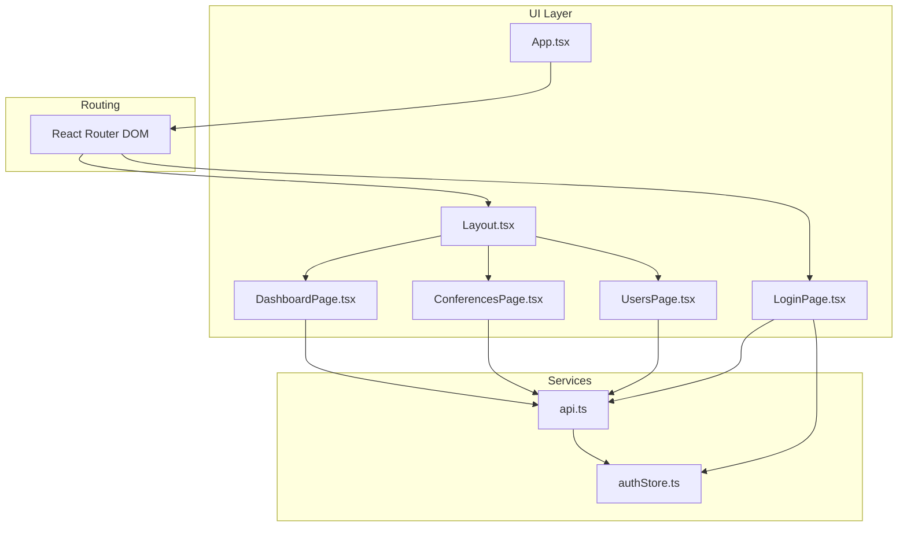
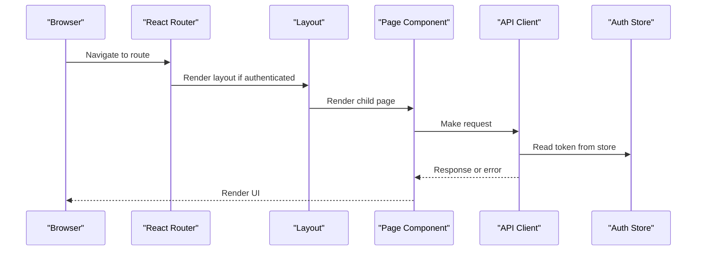
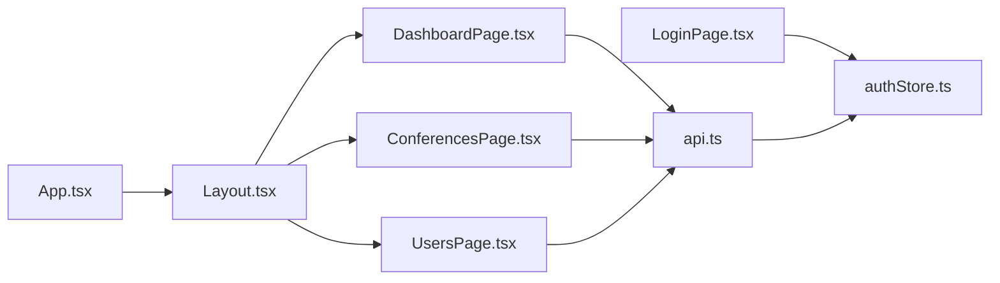

# Pages and Components

<cite>
**Referenced Files in This Document**
- [App.tsx](file://jmp-ui/src/App.tsx)
- [main.tsx](file://jmp-ui/src/main.tsx)
- [Layout.tsx](file://jmp-ui/src/components/Layout.tsx)
- [DashboardPage.tsx](file://jmp-ui/src/pages/DashboardPage.tsx)
- [ConferencesPage.tsx](file://jmp-ui/src/pages/ConferencesPage.tsx)
- [UsersPage.tsx](file://jmp-ui/src/pages/UsersPage.tsx)
- [LoginPage.tsx](file://jmp-ui/src/pages/LoginPage.tsx)
- [api.ts](file://jmp-ui/src/services/api.ts)
- [authStore.ts](file://jmp-ui/src/store/authStore.ts)
- [package.json](file://jmp-ui/package.json)
- [index.html](file://jmp-ui/index.html)
</cite>

## Table of Contents
1. [Introduction](#introduction)
2. [Project Structure](#project-structure)
3. [Core Components](#core-components)
4. [Architecture Overview](#architecture-overview)
5. [Detailed Component Analysis](#detailed-component-analysis)
6. [Dependency Analysis](#dependency-analysis)
7. [Performance Considerations](#performance-considerations)
8. [Troubleshooting Guide](#troubleshooting-guide)
9. [Conclusion](#conclusion)
10. [Appendices](#appendices)

## Introduction
This document provides comprehensive documentation for the application pages and reusable components in the jmp-ui frontend. It covers the DashboardPage implementation with analytics widgets and metrics, the ConferencesPage for conference management and participant tracking, the UsersPage for user administration and role management, the LoginPage component with authentication forms and validation, and the Layout component structure including header navigation, sidebar, and user menu. It also documents component props, state management, event handlers, and Material-UI integration patterns, along with usage examples, customization options, and best practices.

## Project Structure
The frontend is a React application built with Vite and TypeScript, styled with Material-UI. The application is organized into:
- Pages: DashboardPage, ConferencesPage, UsersPage, LoginPage
- Components: Layout (navigation and shell)
- Services: API client with interceptors for auth and token refresh
- Store: Zustand-based authentication state with persistence
- Routing: React Router DOM with protected routes and layout outlet

**Diagram sources**
- [App.tsx:10-31](file://jmp-ui/src/App.tsx#L10-L31)
- [Layout.tsx:36-166](file://jmp-ui/src/components/Layout.tsx#L36-L166)
- [DashboardPage.tsx:24-141](file://jmp-ui/src/pages/DashboardPage.tsx#L24-L141)
- [ConferencesPage.tsx:46-298](file://jmp-ui/src/pages/ConferencesPage.tsx#L46-L298)
- [UsersPage.tsx:38-248](file://jmp-ui/src/pages/UsersPage.tsx#L38-L248)
- [LoginPage.tsx:16-123](file://jmp-ui/src/pages/LoginPage.tsx#L16-L123)
- [api.ts:60-92](file://jmp-ui/src/services/api.ts#L60-L92)
- [authStore.ts:23-46](file://jmp-ui/src/store/authStore.ts#L23-L46)

**Section sources**
- [App.tsx:10-31](file://jmp-ui/src/App.tsx#L10-L31)
- [main.tsx:9-29](file://jmp-ui/src/main.tsx#L9-L29)
- [index.html:1-14](file://jmp-ui/index.html#L1-L14)

## Core Components
This section outlines the core components and their responsibilities:
- Layout: Provides responsive navigation, header toolbar, and main content area with an outlet for routed pages.
- DashboardPage: Renders dashboard statistics cards and welcome content.
- ConferencesPage: Manages conference listing, search, CRUD operations, and status controls.
- UsersPage: Manages user listing, search, CRUD operations, and role chips.
- LoginPage: Handles authentication form submission, validation feedback, and navigation.
- API Service: Centralized HTTP client with request/response interceptors for auth tokens and refresh logic.
- Auth Store: Persistent Zustand store for user session and tokens.

Key integration points:
- Protected routing ensures only authenticated users can access Layout and its children.
- API interceptors automatically attach Authorization headers and refresh tokens on 401 responses.
- Material-UI components are used consistently for UI primitives and layouts.

**Section sources**
- [Layout.tsx:36-166](file://jmp-ui/src/components/Layout.tsx#L36-L166)
- [DashboardPage.tsx:24-141](file://jmp-ui/src/pages/DashboardPage.tsx#L24-L141)
- [ConferencesPage.tsx:46-298](file://jmp-ui/src/pages/ConferencesPage.tsx#L46-L298)
- [UsersPage.tsx:38-248](file://jmp-ui/src/pages/UsersPage.tsx#L38-L248)
- [LoginPage.tsx:16-123](file://jmp-ui/src/pages/LoginPage.tsx#L16-L123)
- [api.ts:6-58](file://jmp-ui/src/services/api.ts#L6-L58)
- [authStore.ts:23-46](file://jmp-ui/src/store/authStore.ts#L23-L46)

## Architecture Overview
The application follows a layered architecture:
- Presentation Layer: React components (pages and layout)
- Service Layer: Axios-based API client with interceptors
- State Management: Zustand store for authentication state
- Routing: React Router DOM with protected routes

**Diagram sources**
- [App.tsx:15-27](file://jmp-ui/src/App.tsx#L15-L27)
- [Layout.tsx:36-166](file://jmp-ui/src/components/Layout.tsx#L36-L166)
- [DashboardPage.tsx:32-61](file://jmp-ui/src/pages/DashboardPage.tsx#L32-L61)
- [api.ts:14-23](file://jmp-ui/src/services/api.ts#L14-L23)
- [authStore.ts:30-34](file://jmp-ui/src/store/authStore.ts#L30-L34)

## Detailed Component Analysis

### DashboardPage
Purpose:
- Fetches and displays dashboard statistics including active conferences, upcoming conferences, and total participants.
- Uses Material-UI components for layout, cards, and typography.

Key behaviors:
- Loads statistics on mount using concurrent API calls for active and upcoming conferences.
- Computes total participants by summing current participants across active conferences.
- Displays loading indicator while fetching data.
- Renders three statistic cards with icons and color accents.

State and props:
- Local state: stats (activeConferences, upcomingConferences, totalParticipants), loading flag.
- No incoming props.

Event handlers:
- None (no interactive actions on the page itself).

Material-UI integration:
- Uses Box, Grid, Paper, Typography, Card, CardContent, and CircularProgress.
- Icons from @mui/icons-material for visual indicators.

Customization options:
- Modify statCards array to add/remove metrics.
- Adjust colors and icons via MUI sx props.
- Replace CircularProgress with skeleton loaders for improved UX.

Best practices:
- Keep fetch logic in useEffect and avoid unnecessary re-renders.
- Use MUI sx props for responsive spacing and theming.
- Consider adding error boundaries or toast notifications for failed fetches.

**Section sources**
- [DashboardPage.tsx:18-22](file://jmp-ui/src/pages/DashboardPage.tsx#L18-L22)
- [DashboardPage.tsx:24-61](file://jmp-ui/src/pages/DashboardPage.tsx#L24-L61)
- [DashboardPage.tsx:63-82](file://jmp-ui/src/pages/DashboardPage.tsx#L63-L82)
- [DashboardPage.tsx:84-141](file://jmp-ui/src/pages/DashboardPage.tsx#L84-L141)

### ConferencesPage
Purpose:
- Lists conferences with search, status chips, participant counts, and scheduled times.
- Supports create, edit, delete, start, and end actions via a modal dialog.

Key behaviors:
- Fetches conferences with optional search term.
- Provides a dialog for creating/editing conferences with toggles for recording and live streaming.
- Supports starting and ending conferences when statuses permit.
- Uses Material-UI Table, Chip, TextField, Dialog, and Switch components.

State and props:
- Local state: conferences (array), search (string), openDialog (boolean), editingConference (Conference|null), formData (partial Conference).
- No incoming props.

Event handlers:
- handleCreate: initializes empty form for creation.
- handleEdit: sets editing mode with prefilled form data.
- handleDelete: confirms deletion and calls API.
- handleSubmit: creates or updates conference based on editing state.
- handleStart/handleEnd: triggers lifecycle actions.

Material-UI integration:
- Uses Table, TableBody, TableCell, TableContainer, TableHead, TableRow, Chip, TextField, Dialog, DialogTitle, DialogContent, DialogActions, FormControlLabel, Switch, IconButton, Button, and Paper.

Customization options:
- Extend formData to include additional conference settings.
- Add pagination by passing page/size params to API.
- Integrate with DataGrid for advanced filtering/sorting.

Best practices:
- Validate form inputs before submission.
- Debounce search input to reduce API calls.
- Use status-based conditional rendering for action buttons.

**Section sources**
- [ConferencesPage.tsx:32-44](file://jmp-ui/src/pages/ConferencesPage.tsx#L32-L44)
- [ConferencesPage.tsx:46-75](file://jmp-ui/src/pages/ConferencesPage.tsx#L46-L75)
- [ConferencesPage.tsx:77-146](file://jmp-ui/src/pages/ConferencesPage.tsx#L77-L146)
- [ConferencesPage.tsx:148-159](file://jmp-ui/src/pages/ConferencesPage.tsx#L148-L159)
- [ConferencesPage.tsx:241-295](file://jmp-ui/src/pages/ConferencesPage.tsx#L241-L295)

### UsersPage
Purpose:
- Lists users with search, status chips, and role chips.
- Supports create, edit, and delete operations via a modal dialog.

Key behaviors:
- Fetches users with optional search term.
- Provides a dialog for creating/editing users with email, name, and password (creation only).
- Displays roles as chips and maps status to colored chips.
- Uses Material-UI Table, Chip, TextField, Dialog, and IconButton components.

State and props:
- Local state: users (array), search (string), openDialog (boolean), editingUser (User|null), formData (partial User).
- No incoming props.

Event handlers:
- handleCreate: initializes default role and empty form for creation.
- handleEdit: sets editing mode with prefilled form data.
- handleDelete: confirms deletion and calls API.
- handleSubmit: creates or updates user based on editing state.

Material-UI integration:
- Uses Table, TableBody, TableCell, TableContainer, TableHead, TableRow, Chip, TextField, Dialog, DialogTitle, DialogActions, IconButton, and Button.

Customization options:
- Extend formData to include role assignment logic.
- Add tenant association fields if needed.
- Integrate with DataGrid for advanced filtering/sorting.

Best practices:
- Require strong passwords during creation.
- Validate email uniqueness and format.
- Hide sensitive fields (password) in edit mode.

**Section sources**
- [UsersPage.tsx:28-36](file://jmp-ui/src/pages/UsersPage.tsx#L28-L36)
- [UsersPage.tsx:38-65](file://jmp-ui/src/pages/UsersPage.tsx#L38-L65)
- [UsersPage.tsx:67-100](file://jmp-ui/src/pages/UsersPage.tsx#L67-L100)
- [UsersPage.tsx:117-128](file://jmp-ui/src/pages/UsersPage.tsx#L117-L128)
- [UsersPage.tsx:200-245](file://jmp-ui/src/pages/UsersPage.tsx#L200-L245)

### LoginPage
Purpose:
- Authenticates users via email/password and stores tokens in the auth store.
- Provides error feedback and loading state during submission.

Key behaviors:
- Submits credentials to the backend and extracts access/refresh tokens and user profile.
- Stores authentication state via the auth store and navigates to the dashboard.
- Displays validation errors and disables the submit button during loading.

State and props:
- Local state: email, password, error, loading.
- No incoming props.

Event handlers:
- handleSubmit: prevents default, clears previous errors, sets loading, calls auth API, updates store, navigates on success.

Material-UI integration:
- Uses Box, Paper, TextField, Button, Typography, Alert, and CircularProgress.
- Icon from @mui/icons-material for branding.

Customization options:
- Add multi-factor authentication support.
- Implement social login via SSO endpoints.
- Add remember-me functionality by adjusting token persistence.

Best practices:
- Clear error messages on input changes.
- Disable submit button during network requests.
- Redirect authenticated users away from login route.

**Section sources**
- [LoginPage.tsx:16-40](file://jmp-ui/src/pages/LoginPage.tsx#L16-L40)
- [LoginPage.tsx:77-107](file://jmp-ui/src/pages/LoginPage.tsx#L77-L107)
- [LoginPage.tsx:110-119](file://jmp-ui/src/pages/LoginPage.tsx#L110-L119)

### Layout Component
Purpose:
- Provides the application shell with responsive navigation, header toolbar, and main content area.
- Manages mobile/desktop drawer behavior and user menu.

Key behaviors:
- Renders a permanent drawer on desktop and temporary drawer on mobile.
- Highlights the active menu item based on current location.
- Displays user avatar and logout menu.
- Navigates to pages and clears auth state on logout.

State and props:
- Local state: mobileOpen (boolean), anchorEl (HTMLElement|null).
- No incoming props.

Event handlers:
- handleDrawerToggle: toggles mobile drawer.
- handleMenuOpen/handleMenuClose: manages user menu visibility.
- handleLogout: clears auth and navigates to login.

Material-UI integration:
- Uses Drawer, AppBar, Toolbar, List, ListItem, ListItemButton, ListItemIcon, ListItemText, Typography, IconButton, Avatar, Menu, MenuItem.

Customization options:
- Add additional menu items dynamically based on user roles.
- Integrate breadcrumbs or page-specific actions in the toolbar.
- Add dark/light theme toggle in the header.

Best practices:
- Keep drawer width consistent across breakpoints.
- Use MUI’s responsive display utilities for drawer variants.
- Persist user menu state using local storage if needed.

**Section sources**
- [Layout.tsx:36-58](file://jmp-ui/src/components/Layout.tsx#L36-L58)
- [Layout.tsx:60-81](file://jmp-ui/src/components/Layout.tsx#L60-L81)
- [Layout.tsx:83-166](file://jmp-ui/src/components/Layout.tsx#L83-L166)

### API Service and Auth Store
Purpose:
- Centralizes HTTP communication with request/response interceptors.
- Manages authentication state with persistent storage.

Key behaviors:
- Request interceptor attaches Authorization header with Bearer token.
- Response interceptor handles 401 errors by refreshing tokens and retrying requests.
- Exposes typed APIs for auth, users, and conferences.

State and props:
- Auth store state: user, accessToken, refreshToken, isAuthenticated.
- No incoming props.

Event handlers:
- None (store actions are exposed via hooks).

Material-UI integration:
- Not applicable (service layer).

Customization options:
- Add retry logic for transient failures.
- Integrate with WebSocket connections using token headers.
- Add logging for failed requests.

Best practices:
- Keep base URL configurable via environment variables.
- Sanitize sensitive data in logs.
- Use typed DTOs for API payloads.

**Section sources**
- [api.ts:6-58](file://jmp-ui/src/services/api.ts#L6-L58)
- [api.ts:60-92](file://jmp-ui/src/services/api.ts#L60-L92)
- [authStore.ts:23-46](file://jmp-ui/src/store/authStore.ts#L23-L46)

## Dependency Analysis
This section maps the dependencies between components and services.

**Diagram sources**
- [App.tsx:10-31](file://jmp-ui/src/App.tsx#L10-L31)
- [Layout.tsx:36-166](file://jmp-ui/src/components/Layout.tsx#L36-L166)
- [DashboardPage.tsx:16](file://jmp-ui/src/pages/DashboardPage.tsx#L16)
- [ConferencesPage.tsx:30](file://jmp-ui/src/pages/ConferencesPage.tsx#L30)
- [UsersPage.tsx:26](file://jmp-ui/src/pages/UsersPage.tsx#L26)
- [api.ts:2](file://jmp-ui/src/services/api.ts#L2)
- [authStore.ts:1](file://jmp-ui/src/store/authStore.ts#L1)

**Section sources**
- [App.tsx:10-31](file://jmp-ui/src/App.tsx#L10-L31)
- [api.ts:6-58](file://jmp-ui/src/services/api.ts#L6-L58)
- [authStore.ts:23-46](file://jmp-ui/src/store/authStore.ts#L23-L46)

## Performance Considerations
- Debounce search inputs in ConferencesPage and UsersPage to reduce API calls.
- Use virtualized lists or pagination for large datasets.
- Cache frequently accessed data (e.g., conference stats) to minimize redundant requests.
- Optimize images and assets; consider lazy loading for non-critical resources.
- Minimize re-renders by memoizing derived data and using shallow comparisons.
- Use MUI’s sx props efficiently to avoid excessive inline styles.

## Troubleshooting Guide
Common issues and resolutions:
- Authentication failures:
  - Verify credentials and ensure the backend is reachable.
  - Check that the auth store persists tokens and that interceptors attach Authorization headers.
- 401 Unauthorized responses:
  - Confirm token refresh endpoint availability and that refresh tokens are stored.
  - Inspect response interceptor logic for proper retry and error handling.
- Network errors:
  - Wrap API calls in try/catch blocks and display user-friendly messages.
  - Consider adding exponential backoff for retries.
- UI rendering issues:
  - Ensure Material-UI components are imported correctly and theme is applied.
  - Verify that responsive drawer variants are configured for desktop/mobile.

**Section sources**
- [api.ts:25-57](file://jmp-ui/src/services/api.ts#L25-L57)
- [authStore.ts:30-34](file://jmp-ui/src/store/authStore.ts#L30-L34)
- [LoginPage.tsx:35-39](file://jmp-ui/src/pages/LoginPage.tsx#L35-L39)

## Conclusion
The application provides a well-structured React frontend with Material-UI components, centralized API services, and persistent authentication state. The pages are designed around CRUD operations and real-time-like status updates, while the Layout component offers responsive navigation and user management. Following the best practices outlined here will help maintain scalability, reliability, and a consistent user experience.

## Appendices
- Theming: The application uses a light theme with primary and secondary palette values defined in main.tsx.
- Routing: Protected routes ensure that unauthenticated users are redirected to the login page.
- Environment configuration: The API base URL is configurable via environment variables.

**Section sources**
- [main.tsx:9-19](file://jmp-ui/src/main.tsx#L9-L19)
- [App.tsx:15-27](file://jmp-ui/src/App.tsx#L15-L27)
- [api.ts:4](file://jmp-ui/src/services/api.ts#L4)
- [package.json:12-38](file://jmp-ui/package.json#L12-L38)
- [index.html:1-14](file://jmp-ui/index.html#L1-L14)