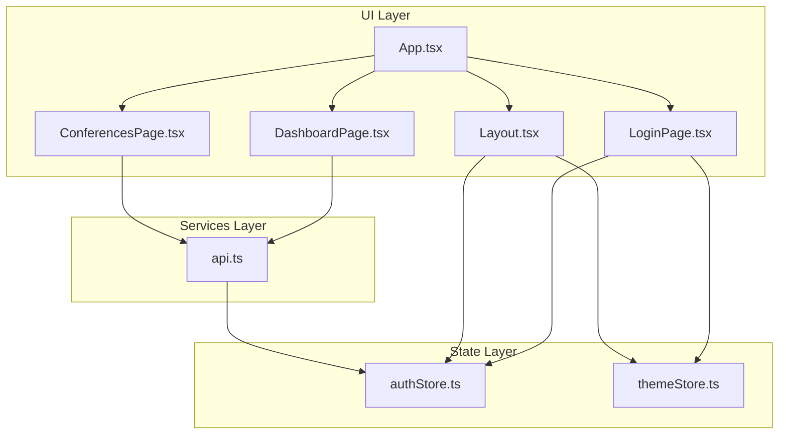
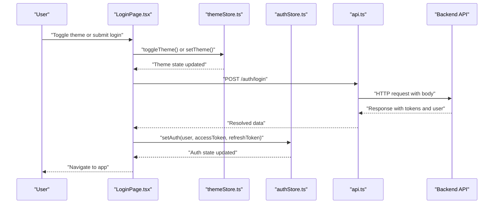
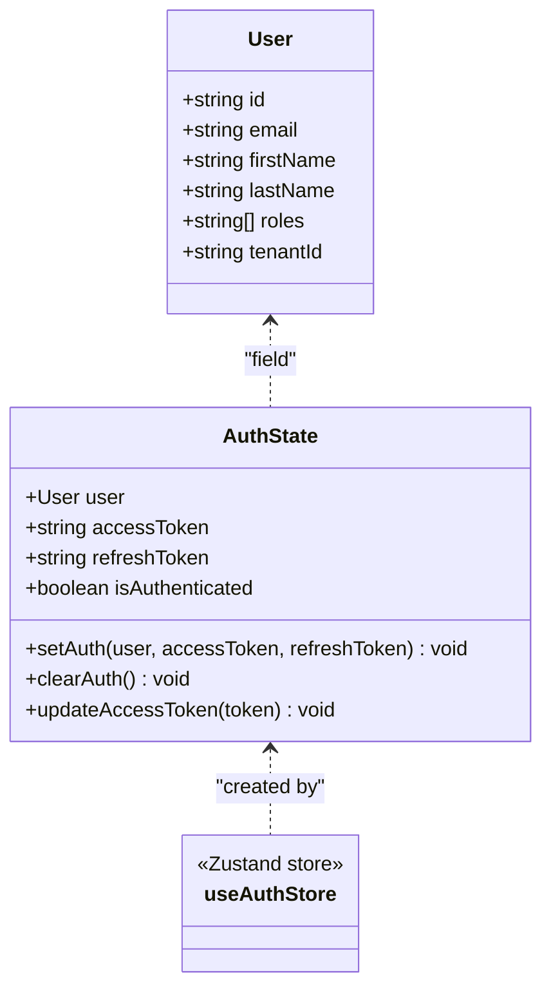
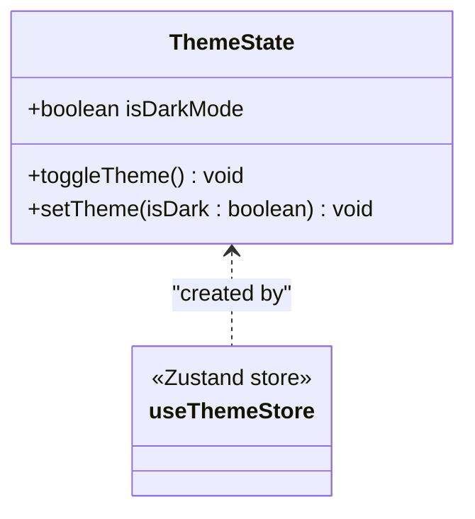
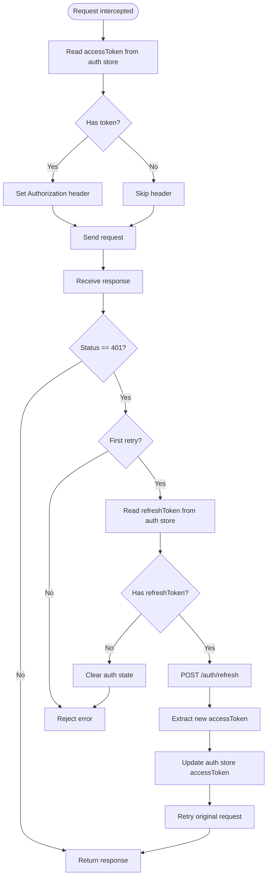
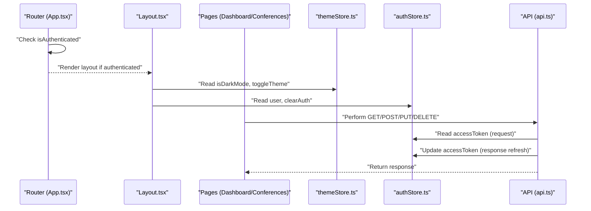
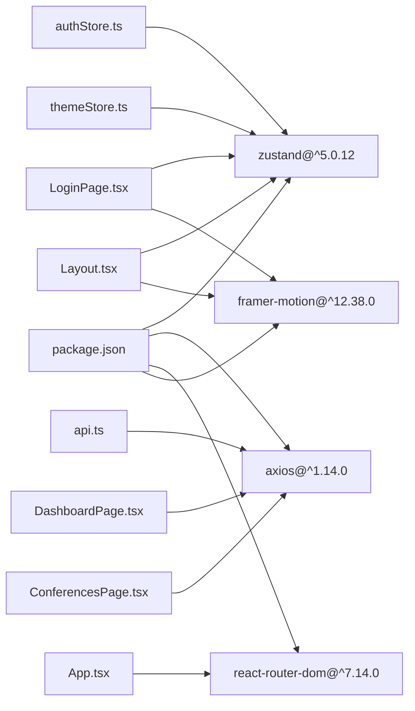

# State Management

<cite>
**Referenced Files in This Document**
- [themeStore.ts](file://jmp-ui/src/store/themeStore.ts)
- [authStore.ts](file://jmp-ui/src/store/authStore.ts)
- [api.ts](file://jmp-ui/src/services/api.ts)
- [App.tsx](file://jmp-ui/src/App.tsx)
- [LoginPage.tsx](file://jmp-ui/src/pages/LoginPage.tsx)
- [Layout.tsx](file://jmp-ui/src/components/Layout.tsx)
- [DashboardPage.tsx](file://jmp-ui/src/pages/DashboardPage.tsx)
- [ConferencesPage.tsx](file://jmp-ui/src/pages/ConferencesPage.tsx)
- [package.json](file://jmp-ui/package.json)
</cite>

## Update Summary
**Changes Made**
- Added comprehensive documentation for the new theme store implementation
- Enhanced authentication store documentation with improved token management details
- Updated state management patterns to reflect modern Zustand middleware usage
- Added integration examples for theme store in UI components
- Updated architecture diagrams to show dual-store state management system

## Table of Contents
1. [Introduction](#introduction)
2. [Project Structure](#project-structure)
3. [Core Components](#core-components)
4. [Architecture Overview](#architecture-overview)
5. [Detailed Component Analysis](#detailed-component-analysis)
6. [Dependency Analysis](#dependency-analysis)
7. [Performance Considerations](#performance-considerations)
8. [Troubleshooting Guide](#troubleshooting-guide)
9. [Conclusion](#conclusion)
10. [Appendices](#appendices)

## Introduction
This document explains the state management system built with Zustand in the frontend application. The system now features a dual-store architecture with both authentication and theme state management. It focuses on the authentication store for user authentication state, token management, and session handling, as well as the new theme store for persistent dark/light mode switching. The guide covers API service integration patterns, HTTP client configuration, request/response handling, state update mechanisms, subscription patterns, component integration, authentication flow management, token refresh strategies, error state handling, store structure, actions, selectors, and middleware usage. Finally, it provides guidelines for adding new stores, managing side effects, maintaining state consistency, performance considerations, persistence, and debugging techniques.

## Project Structure
The state management and authentication system resides in the UI module under jmp-ui. The key elements are:
- Dual Zustand stores: authentication state and theme state
- An Axios-based HTTP client with interceptors for token injection and refresh
- UI pages and components that integrate with both stores and API services

**Diagram sources**
- [App.tsx:1-34](file://jmp-ui/src/App.tsx#L1-L34)
- [LoginPage.tsx:1-457](file://jmp-ui/src/pages/LoginPage.tsx#L1-L457)
- [Layout.tsx:1-520](file://jmp-ui/src/components/Layout.tsx#L1-L520)
- [DashboardPage.tsx:1-599](file://jmp-ui/src/pages/DashboardPage.tsx#L1-L599)
- [ConferencesPage.tsx:1-768](file://jmp-ui/src/pages/ConferencesPage.tsx#L1-L768)
- [authStore.ts:1-47](file://jmp-ui/src/store/authStore.ts#L1-L47)
- [themeStore.ts:1-22](file://jmp-ui/src/store/themeStore.ts#L1-L22)
- [api.ts:1-159](file://jmp-ui/src/services/api.ts#L1-L159)

**Section sources**
- [authStore.ts:1-47](file://jmp-ui/src/store/authStore.ts#L1-L47)
- [themeStore.ts:1-22](file://jmp-ui/src/store/themeStore.ts#L1-L22)
- [api.ts:1-159](file://jmp-ui/src/services/api.ts#L1-L159)
- [App.tsx:1-34](file://jmp-ui/src/App.tsx#L1-L34)
- [package.json:1-42](file://jmp-ui/package.json#L1-L42)

## Core Components
- **Authentication Store (Zustand)**:
  - Holds user profile, access token, refresh token, and authentication status
  - Provides actions to set, update, and clear authentication state
  - Persists selected fields to local storage via middleware
- **Theme Store (Zustand)**:
  - Manages dark/light mode preference with automatic system detection
  - Provides actions to toggle theme and set theme programmatically
  - Persists theme preference to local storage for seamless user experience
- **API Service (Axios)**:
  - Centralized HTTP client with base URL from environment
  - Request interceptor injects Authorization header using access token
  - Response interceptor handles automatic token refresh on 401 errors
  - Exposes typed API modules for auth, user, conference, and analytics operations

Key store actions and state shapes:
- **Authentication State**: user, accessToken, refreshToken, isAuthenticated
- **Theme State**: isDarkMode, toggleTheme, setTheme
- **Actions**: setAuth, clearAuth, updateAccessToken (auth store); toggleTheme, setTheme (theme store)
- **Persistence**: selective partialization of state fields for both stores

Integration points:
- LoginPage triggers login, sets auth state, and manages theme toggle
- App routes guard based on isAuthenticated
- Layout displays user info, manages theme, and logs out via clearAuth
- API service relies on auth store state for token injection and refresh
- Theme store integrates with document class for CSS variable updates

**Section sources**
- [authStore.ts:13-47](file://jmp-ui/src/store/authStore.ts#L13-L47)
- [themeStore.ts:4-22](file://jmp-ui/src/store/themeStore.ts#L4-L22)
- [api.ts:60-159](file://jmp-ui/src/services/api.ts#L60-L159)
- [LoginPage.tsx:41-76](file://jmp-ui/src/pages/LoginPage.tsx#L41-L76)
- [App.tsx:10-31](file://jmp-ui/src/App.tsx#L10-L31)
- [Layout.tsx:48-81](file://jmp-ui/src/components/Layout.tsx#L48-L81)

## Architecture Overview
The dual-store authentication and theme management system integrates the store and service layer as follows:

**Diagram sources**
- [LoginPage.tsx:44-76](file://jmp-ui/src/pages/LoginPage.tsx#L44-L76)
- [themeStore.ts:10-21](file://jmp-ui/src/store/themeStore.ts#L10-L21)
- [authStore.ts:23-46](file://jmp-ui/src/store/authStore.ts#L23-L46)
- [api.ts:115-120](file://jmp-ui/src/services/api.ts#L115-L120)

## Detailed Component Analysis

### Authentication Store (Zustand)
The authentication store defines the authentication domain model and state transitions:
- **Data model**: User interface with id, email, firstName, lastName, roles, tenantId
- **State**: user, accessToken, refreshToken, isAuthenticated
- **Actions**:
  - setAuth: initializes user, tokens, and sets authenticated flag
  - clearAuth: resets user and tokens, clears authenticated flag
  - updateAccessToken: updates access token for subsequent requests
- **Middleware**:
  - persist: stores state under 'jmp-auth-storage' key and partially serializes fields

**Diagram sources**
- [authStore.ts:4-21](file://jmp-ui/src/store/authStore.ts#L4-L21)
- [authStore.ts:23-46](file://jmp-ui/src/store/authStore.ts#L23-L46)

**Section sources**
- [authStore.ts:13-47](file://jmp-ui/src/store/authStore.ts#L13-L47)

### Theme Store (Zustand) - **NEW**
The theme store manages user interface appearance preferences:
- **State**: isDarkMode (boolean)
- **Actions**:
  - toggleTheme: switches between dark and light modes
  - setTheme: sets theme programmatically
- **Middleware**:
  - persist: stores theme preference under 'jmp-theme-storage' key
- **Initialization**: Automatically detects system preference using prefers-color-scheme media query

**Diagram sources**
- [themeStore.ts:4-8](file://jmp-ui/src/store/themeStore.ts#L4-L8)
- [themeStore.ts:10-21](file://jmp-ui/src/store/themeStore.ts#L10-L21)

**Section sources**
- [themeStore.ts:1-22](file://jmp-ui/src/store/themeStore.ts#L1-L22)

### API Service Integration (Axios Interceptors)
The HTTP client centralizes configuration and behavior:
- Base URL from environment variable
- Request interceptor:
  - Reads accessToken from auth store state
  - Adds Authorization header if present
- Response interceptor:
  - On 401 Unauthorized and first retry:
    - Reads refreshToken from auth store state
    - Calls refresh endpoint
    - Updates access token in auth store
    - Retries original request with new token
  - On failure or missing refresh token:
    - Clears auth state and rejects error

**Diagram sources**
- [api.ts:68-112](file://jmp-ui/src/services/api.ts#L68-L112)
- [authStore.ts:30-35](file://jmp-ui/src/store/authStore.ts#L30-L35)

**Section sources**
- [api.ts:60-159](file://jmp-ui/src/services/api.ts#L60-L159)

### Component Integration Patterns
- **App routing guards**:
  - Uses isAuthenticated to redirect unauthenticated users to login
  - Renders layout only when authenticated
- **LoginPage**:
  - Submits credentials to authApi.login
  - On success, calls setAuth and navigates to home
  - Integrates theme store for user preference management
- **Layout**:
  - Displays user profile and logout action
  - Calls clearAuth and redirects to login on logout
  - Integrates theme store for theme management
- **Dashboard and Conferences pages**:
  - Use conferenceApi and other API modules
  - Trigger network requests; interceptors automatically handle token refresh
- **Theme Integration**:
  - Both LoginPage and Layout apply theme changes to document class
  - Theme toggle buttons provide user control over appearance

**Diagram sources**
- [App.tsx:10-31](file://jmp-ui/src/App.tsx#L10-L31)
- [Layout.tsx:52-81](file://jmp-ui/src/components/Layout.tsx#L52-L81)
- [LoginPage.tsx:44-76](file://jmp-ui/src/pages/LoginPage.tsx#L44-L76)
- [DashboardPage.tsx:33-34](file://jmp-ui/src/pages/DashboardPage.tsx#L33-L34)
- [ConferencesPage.tsx:35](file://jmp-ui/src/pages/ConferencesPage.tsx#L35)
- [api.ts:68-112](file://jmp-ui/src/services/api.ts#L68-L112)
- [authStore.ts:30-35](file://jmp-ui/src/store/authStore.ts#L30-L35)

**Section sources**
- [App.tsx:10-31](file://jmp-ui/src/App.tsx#L10-L31)
- [LoginPage.tsx:41-76](file://jmp-ui/src/pages/LoginPage.tsx#L41-L76)
- [Layout.tsx:48-81](file://jmp-ui/src/components/Layout.tsx#L48-L81)
- [DashboardPage.tsx:160-208](file://jmp-ui/src/pages/DashboardPage.tsx#L160-L208)
- [ConferencesPage.tsx:122-135](file://jmp-ui/src/pages/ConferencesPage.tsx#L122-L135)

### Token Refresh Strategy
- **Automatic refresh on 401**:
  - First unauthorized response triggers refresh
  - Original request is retried after updating the access token
- **Safety checks**:
  - Prevents infinite retry loops using a retry flag
  - Clears auth state if refresh token is missing or refresh fails
- **Seamless integration**:
  - UI components do not need to manually refresh tokens

**Section sources**
- [api.ts:79-112](file://jmp-ui/src/services/api.ts#L79-L112)
- [authStore.ts:32-34](file://jmp-ui/src/store/authStore.ts#L32-L34)

### Error State Handling
- **Login failures**:
  - LoginPage displays a user-friendly error message
- **Network errors**:
  - Pages catch and log errors; consider surfacing user-facing messages
- **Unauthorized**:
  - Response interceptor clears auth state and rejects the promise

**Section sources**
- [LoginPage.tsx:60-76](file://jmp-ui/src/pages/LoginPage.tsx#L60-L76)
- [ConferencesPage.tsx:122-135](file://jmp-ui/src/pages/ConferencesPage.tsx#L122-L135)
- [api.ts:79-112](file://jmp-ui/src/services/api.ts#L79-L112)

### State Update Mechanisms and Subscription Patterns
- **Zustand subscriptions**:
  - Components subscribe to store slices via hooks
  - Minimal re-renders when subscribed fields change
- **Actions**:
  - setAuth initializes state and marks authenticated
  - clearAuth resets state and marks unauthenticated
  - updateAccessToken updates the access token for future requests
  - toggleTheme switches between dark and light modes
  - setTheme allows programmatic theme setting
- **Persistence**:
  - Both stores use middleware to persist state to local storage
  - Improves UX by restoring session and theme preferences across browser sessions

**Section sources**
- [authStore.ts:23-47](file://jmp-ui/src/store/authStore.ts#L23-L47)
- [themeStore.ts:10-22](file://jmp-ui/src/store/themeStore.ts#L10-L22)
- [App.tsx:10-11](file://jmp-ui/src/App.tsx#L10-L11)
- [Layout.tsx:57-64](file://jmp-ui/src/components/Layout.tsx#L57-L64)

### Guidelines for Adding New Stores
- **Define a clear domain model**:
  - Declare interfaces for state and actions
  - Keep state flat and normalized where possible
- **Create the store with Zustand**:
  - Use create with typed state/actions
  - Add middleware (e.g., persist) with appropriate partialization
- **Exposure hooks for consumption**:
  - Export selectors and actions for components
- **Integrate with services**:
  - Use store actions to update state after API calls
  - Leverage interceptors for token refresh and retries
- **Maintain consistency**:
  - Centralize side effects in actions or service layers
  - Avoid direct mutations; always use set/update functions
- **Consider persistence**:
  - Use persist middleware for user preferences and settings
  - Implement partialization to optimize storage efficiency

### Managing Side Effects and State Consistency
- **Centralize API calls in service modules**
- **Use interceptors for cross-cutting concerns (auth headers, refresh)**
- **Keep UI components thin; delegate state updates to actions**
- **Use optimistic updates where appropriate and reconcile on error**
- **Implement proper cleanup for theme-related side effects**

## Dependency Analysis
External dependencies relevant to state management:
- **Zustand**: state management library (v5.0.12)
- **Axios**: HTTP client with interceptors
- **React Router DOM**: routing and navigation
- **Framer Motion**: animation library for theme transitions

**Diagram sources**
- [package.json:12-26](file://jmp-ui/package.json#L12-L26)
- [authStore.ts:1](file://jmp-ui/src/store/authStore.ts#L1)
- [themeStore.ts:1](file://jmp-ui/src/store/themeStore.ts#L1)
- [api.ts:1](file://jmp-ui/src/services/api.ts#L1)
- [App.tsx:1](file://jmp-ui/src/App.tsx#L1)
- [LoginPage.tsx:3](file://jmp-ui/src/pages/LoginPage.tsx#L3)
- [Layout.tsx:2](file://jmp-ui/src/components/Layout.tsx#L2)

**Section sources**
- [package.json:12-26](file://jmp-ui/package.json#L12-L26)

## Performance Considerations
- **Minimize store size**:
  - Persist only essential fields to reduce serialization overhead
  - Use partialization to optimize storage efficiency
- **Selective subscriptions**:
  - Subscribe to small slices of state to avoid unnecessary re-renders
- **Efficient API calls**:
  - Batch requests where possible (as seen in dashboard fetching)
- **Avoid blocking UI**:
  - Use loading states and async handlers for long-running operations
- **Theme optimization**:
  - Use CSS variables for theme transitions
  - Apply theme changes efficiently to document class

## Troubleshooting Guide
Common issues and resolutions:
- **Stale or missing tokens**:
  - Verify that the request interceptor reads the access token from the auth store
  - Confirm that updateAccessToken is called after successful refresh
- **Infinite retry loops**:
  - Ensure the retry flag prevents repeated refresh attempts
- **Session not restored**:
  - Check the persisted storage key ('jmp-auth-storage') and partialization logic
- **Unauthorized errors**:
  - Confirm that clearAuth is invoked when refresh fails or refresh token is absent
- **Theme not persisting**:
  - Verify the theme store persistence key ('jmp-theme-storage')
  - Check that theme changes are properly applied to document class
- **Theme toggle not working**:
  - Ensure useEffect hook applies theme classes to document element
  - Verify that theme store actions are properly imported and used

**Section sources**
- [api.ts:68-112](file://jmp-ui/src/services/api.ts#L68-L112)
- [authStore.ts:23-47](file://jmp-ui/src/store/authStore.ts#L23-L47)
- [themeStore.ts:10-22](file://jmp-ui/src/store/themeStore.ts#L10-L22)
- [LoginPage.tsx:51-58](file://jmp-ui/src/pages/LoginPage.tsx#L51-L58)
- [Layout.tsx:57-64](file://jmp-ui/src/components/Layout.tsx#L57-L64)

## Conclusion
The dual-store Zustand-based state management system, combining authentication and theme stores with Axios interceptors, provides a robust foundation for state management and user experience in the UI. The system supports seamless token refresh, persistent sessions, theme preferences, and clean separation of concerns between UI components, state, and services. The modernized architecture with improved middleware usage and localStorage persistence ensures maintainable, performant, and consistent state handling as the application evolves.

## Appendices

### API Modules Overview
- **Auth API**:
  - login(email, password)
  - refresh(refreshToken)
- **User API**:
  - getCurrentUser()
  - getUsers(params?)
  - createUser(data)
  - updateUser(id, data)
  - deleteUser(id)
- **Conference API**:
  - getConferences(params?)
  - getActiveConferences()
  - getUpcomingConferences()
  - getConference(id)
  - createConference(data)
  - updateConference(id, data)
  - deleteConference(id)
  - startConference(id)
  - endConference(id)
  - generateToken(id, data)
- **Analytics API**:
  - getDashboardMetrics()
  - getUsageReport(startDate, endDate)
  - getParticipantAnalytics(startDate, endDate)
  - getRecordingAnalytics(startDate, endDate)
  - getSystemHealth()

**Section sources**
- [api.ts:114-159](file://jmp-ui/src/services/api.ts#L114-L159)

### Store Comparison Matrix

| Feature | Authentication Store | Theme Store |
|---------|---------------------|-------------|
| State Fields | user, accessToken, refreshToken, isAuthenticated | isDarkMode |
| Actions | setAuth, clearAuth, updateAccessToken | toggleTheme, setTheme |
| Persistence | Yes (jmp-auth-storage) | Yes (jmp-theme-storage) |
| Partialization | Custom partialization | Default (all fields) |
| Initialization | Empty state | System preference detection |
| Primary Use Case | User authentication | UI appearance |

**Section sources**
- [authStore.ts:23-46](file://jmp-ui/src/store/authStore.ts#L23-L46)
- [themeStore.ts:10-21](file://jmp-ui/src/store/themeStore.ts#L10-L21)