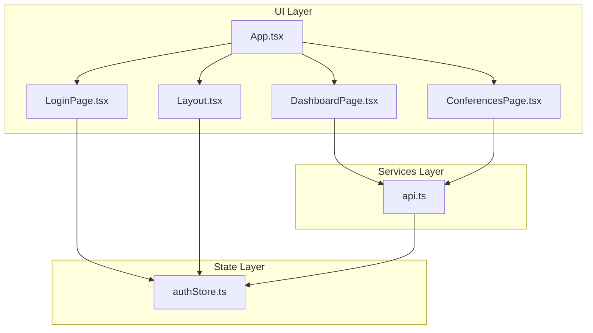
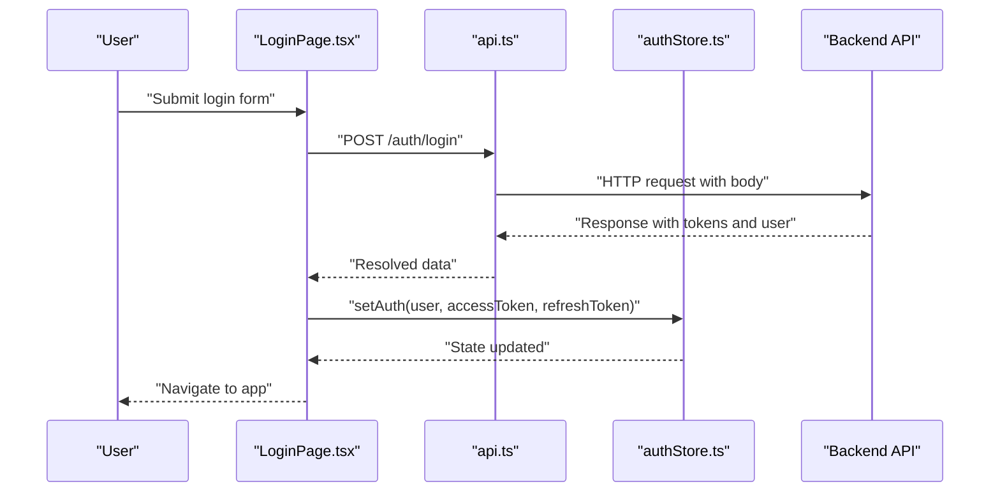
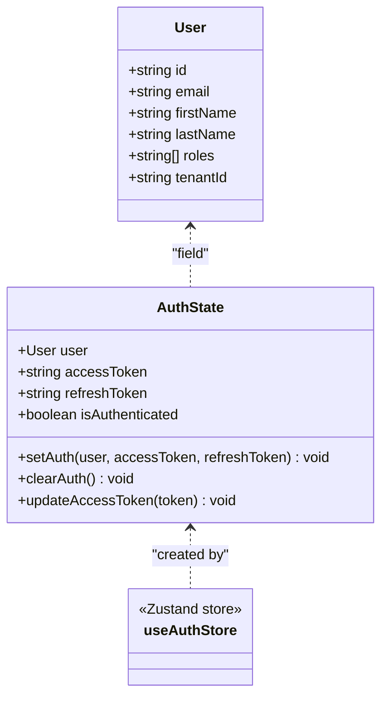
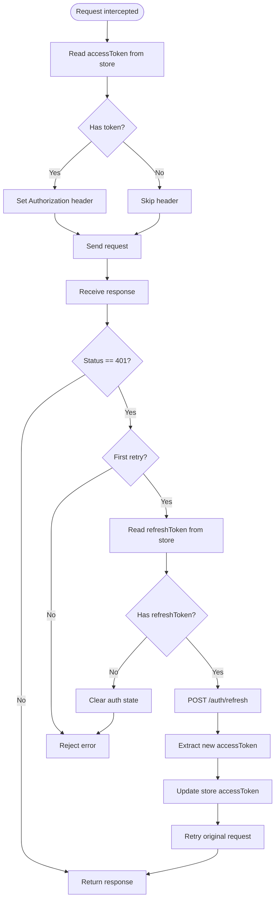
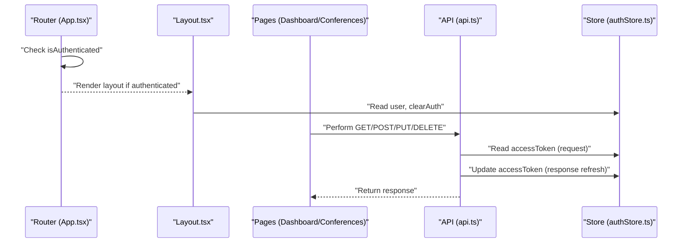
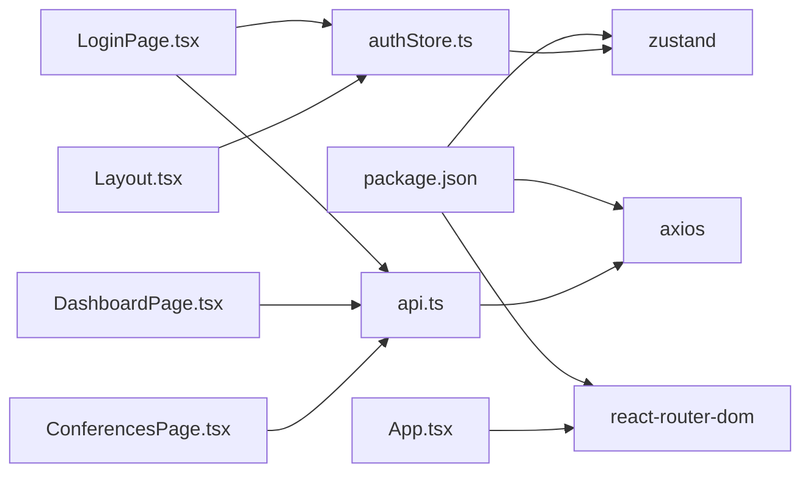

# State Management

<cite>
**Referenced Files in This Document**
- [authStore.ts](file://jmp-ui/src/store/authStore.ts)
- [api.ts](file://jmp-ui/src/services/api.ts)
- [App.tsx](file://jmp-ui/src/App.tsx)
- [LoginPage.tsx](file://jmp-ui/src/pages/LoginPage.tsx)
- [Layout.tsx](file://jmp-ui/src/components/Layout.tsx)
- [DashboardPage.tsx](file://jmp-ui/src/pages/DashboardPage.tsx)
- [ConferencesPage.tsx](file://jmp-ui/src/pages/ConferencesPage.tsx)
- [package.json](file://jmp-ui/package.json)
</cite>

## Table of Contents
1. [Introduction](#introduction)
2. [Project Structure](#project-structure)
3. [Core Components](#core-components)
4. [Architecture Overview](#architecture-overview)
5. [Detailed Component Analysis](#detailed-component-analysis)
6. [Dependency Analysis](#dependency-analysis)
7. [Performance Considerations](#performance-considerations)
8. [Troubleshooting Guide](#troubleshooting-guide)
9. [Conclusion](#conclusion)
10. [Appendices](#appendices)

## Introduction
This document explains the state management system built with Zustand in the frontend application. It focuses on the authentication store, including user authentication state, token management, and session handling. It also documents the API service integration patterns, HTTP client configuration, and request/response handling. The guide covers state update mechanisms, subscription patterns, component integration, authentication flow management, token refresh strategies, error state handling, store structure, actions, selectors, and middleware usage. Finally, it provides guidelines for adding new stores, managing side effects, maintaining state consistency, performance considerations, persistence, and debugging techniques.

## Project Structure
The state management and authentication system resides in the UI module under jmp-ui. The key elements are:
- A single Zustand store for authentication state
- An Axios-based HTTP client with interceptors for token injection and refresh
- UI pages and components that integrate with the store and API services

**Diagram sources**
- [App.tsx:1-34](file://jmp-ui/src/App.tsx#L1-L34)
- [LoginPage.tsx:1-124](file://jmp-ui/src/pages/LoginPage.tsx#L1-L124)
- [Layout.tsx:1-167](file://jmp-ui/src/components/Layout.tsx#L1-L167)
- [DashboardPage.tsx:1-142](file://jmp-ui/src/pages/DashboardPage.tsx#L1-L142)
- [ConferencesPage.tsx:1-299](file://jmp-ui/src/pages/ConferencesPage.tsx#L1-L299)
- [authStore.ts:1-47](file://jmp-ui/src/store/authStore.ts#L1-L47)
- [api.ts:1-93](file://jmp-ui/src/services/api.ts#L1-L93)

**Section sources**
- [authStore.ts:1-47](file://jmp-ui/src/store/authStore.ts#L1-L47)
- [api.ts:1-93](file://jmp-ui/src/services/api.ts#L1-L93)
- [App.tsx:1-34](file://jmp-ui/src/App.tsx#L1-L34)
- [package.json:1-39](file://jmp-ui/package.json#L1-L39)

## Core Components
- Authentication Store (Zustand):
  - Holds user profile, access token, refresh token, and authentication status
  - Provides actions to set, update, and clear authentication state
  - Persists selected fields to local storage via middleware
- API Service (Axios):
  - Centralized HTTP client with base URL from environment
  - Request interceptor injects Authorization header using access token
  - Response interceptor handles automatic token refresh on 401 errors
  - Exposes typed API modules for auth, user, and conference operations

Key store actions and state shape:
- State fields: user, accessToken, refreshToken, isAuthenticated
- Actions: setAuth, clearAuth, updateAccessToken
- Persistence: selective partialization of state fields

Integration points:
- LoginPage triggers login and sets auth state
- App routes guard based on isAuthenticated
- Layout displays user info and logs out via clearAuth
- API service relies on store state for token injection and refresh

**Section sources**
- [authStore.ts:13-47](file://jmp-ui/src/store/authStore.ts#L13-L47)
- [api.ts:6-58](file://jmp-ui/src/services/api.ts#L6-L58)
- [LoginPage.tsx:16-40](file://jmp-ui/src/pages/LoginPage.tsx#L16-L40)
- [App.tsx:10-31](file://jmp-ui/src/App.tsx#L10-L31)
- [Layout.tsx:36-58](file://jmp-ui/src/components/Layout.tsx#L36-L58)

## Architecture Overview
The authentication and API flow integrates the store and service layer as follows:

**Diagram sources**
- [LoginPage.tsx:24-40](file://jmp-ui/src/pages/LoginPage.tsx#L24-L40)
- [api.ts:61-66](file://jmp-ui/src/services/api.ts#L61-L66)
- [authStore.ts:23-35](file://jmp-ui/src/store/authStore.ts#L23-L35)

## Detailed Component Analysis

### Authentication Store (Zustand)
The store defines the authentication domain model and state transitions:
- Data model: User interface with id, email, firstName, lastName, roles, tenantId
- State: user, accessToken, refreshToken, isAuthenticated
- Actions:
  - setAuth: initializes user, tokens, and sets authenticated flag
  - clearAuth: resets user and tokens, clears authenticated flag
  - updateAccessToken: updates access token for subsequent requests
- Middleware:
  - persist: stores state under a specific key and partially serializes fields

**Diagram sources**
- [authStore.ts:4-21](file://jmp-ui/src/store/authStore.ts#L4-L21)
- [authStore.ts:23-46](file://jmp-ui/src/store/authStore.ts#L23-L46)

**Section sources**
- [authStore.ts:13-47](file://jmp-ui/src/store/authStore.ts#L13-L47)

### API Service Integration (Axios Interceptors)
The HTTP client centralizes configuration and behavior:
- Base URL from environment variable
- Request interceptor:
  - Reads accessToken from store state
  - Adds Authorization header if present
- Response interceptor:
  - On 401 Unauthorized and first retry:
    - Reads refreshToken from store state
    - Calls refresh endpoint
    - Updates access token in store
    - Retries original request with new token
  - On failure or missing refresh token:
    - Clears auth state and rejects error

**Diagram sources**
- [api.ts:13-58](file://jmp-ui/src/services/api.ts#L13-L58)
- [authStore.ts:23-35](file://jmp-ui/src/store/authStore.ts#L23-L35)

**Section sources**
- [api.ts:6-58](file://jmp-ui/src/services/api.ts#L6-L58)

### Component Integration Patterns
- App routing guards:
  - Uses isAuthenticated to redirect unauthenticated users to login
  - Renders layout only when authenticated
- LoginPage:
  - Submits credentials to authApi.login
  - On success, calls setAuth and navigates to home
- Layout:
  - Displays user profile and logout action
  - Calls clearAuth and redirects to login on logout
- Dashboard and Conferences pages:
  - Use conferenceApi and other API modules
  - Trigger network requests; interceptors automatically handle token refresh

**Diagram sources**
- [App.tsx:10-31](file://jmp-ui/src/App.tsx#L10-L31)
- [Layout.tsx:36-58](file://jmp-ui/src/components/Layout.tsx#L36-L58)
- [DashboardPage.tsx:32-61](file://jmp-ui/src/pages/DashboardPage.tsx#L32-L61)
- [ConferencesPage.tsx:62-75](file://jmp-ui/src/pages/ConferencesPage.tsx#L62-L75)
- [api.ts:13-58](file://jmp-ui/src/services/api.ts#L13-L58)
- [authStore.ts:23-35](file://jmp-ui/src/store/authStore.ts#L23-L35)

**Section sources**
- [App.tsx:10-31](file://jmp-ui/src/App.tsx#L10-L31)
- [LoginPage.tsx:24-40](file://jmp-ui/src/pages/LoginPage.tsx#L24-L40)
- [Layout.tsx:36-58](file://jmp-ui/src/components/Layout.tsx#L36-L58)
- [DashboardPage.tsx:32-61](file://jmp-ui/src/pages/DashboardPage.tsx#L32-L61)
- [ConferencesPage.tsx:62-75](file://jmp-ui/src/pages/ConferencesPage.tsx#L62-L75)

### Token Refresh Strategy
- Automatic refresh on 401:
  - First unauthorized response triggers refresh
  - Original request is retried after updating the access token
- Safety checks:
  - Prevents infinite retry loops using a retry flag
  - Clears auth state if refresh token is missing or refresh fails
- Seamless integration:
  - UI components do not need to manually refresh tokens

**Section sources**
- [api.ts:25-58](file://jmp-ui/src/services/api.ts#L25-L58)
- [authStore.ts:32-34](file://jmp-ui/src/store/authStore.ts#L32-L34)

### Error State Handling
- Login failures:
  - LoginPage displays a user-friendly error message
- Network errors:
  - Pages catch and log errors; consider surfacing user-facing messages
- Unauthorized:
  - Response interceptor clears auth state and rejects the promise

**Section sources**
- [LoginPage.tsx:24-40](file://jmp-ui/src/pages/LoginPage.tsx#L24-L40)
- [ConferencesPage.tsx:66-114](file://jmp-ui/src/pages/ConferencesPage.tsx#L66-L114)
- [api.ts:25-58](file://jmp-ui/src/services/api.ts#L25-L58)

### State Update Mechanisms and Subscription Patterns
- Zustand subscriptions:
  - Components subscribe to store slices via hooks
  - Minimal re-renders when subscribed fields change
- Actions:
  - setAuth initializes state and marks authenticated
  - clearAuth resets state and marks unauthenticated
  - updateAccessToken updates the access token for future requests
- Persistence:
  - Middleware persists selected fields to local storage
  - Improves UX by restoring session across browser sessions

**Section sources**
- [authStore.ts:23-47](file://jmp-ui/src/store/authStore.ts#L23-L47)
- [App.tsx:10-11](file://jmp-ui/src/App.tsx#L10-L11)
- [Layout.tsx:39](file://jmp-ui/src/components/Layout.tsx#L39)

### Guidelines for Adding New Stores
- Define a clear domain model:
  - Declare interfaces for state and actions
  - Keep state flat and normalized where possible
- Create the store with Zustand:
  - Use create with typed state/actions
  - Add middleware (e.g., persist) with appropriate partialization
- Expose hooks for consumption:
  - Export selectors and actions for components
- Integrate with services:
  - Use store actions to update state after API calls
  - Leverage interceptors for token refresh and retries
- Maintain consistency:
  - Centralize side effects in actions or service layers
  - Avoid direct mutations; always use set/update functions

[No sources needed since this section provides general guidance]

### Managing Side Effects and State Consistency
- Centralize API calls in service modules
- Use interceptors for cross-cutting concerns (auth headers, refresh)
- Keep UI components thin; delegate state updates to actions
- Use optimistic updates where appropriate and reconcile on error

[No sources needed since this section provides general guidance]

## Dependency Analysis
External dependencies relevant to state management:
- Zustand: state management library
- Axios: HTTP client with interceptors
- React Router DOM: routing and navigation

**Diagram sources**
- [package.json:12-22](file://jmp-ui/package.json#L12-L22)
- [authStore.ts:1-2](file://jmp-ui/src/store/authStore.ts#L1-L2)
- [api.ts:1](file://jmp-ui/src/services/api.ts#L1)
- [App.tsx:1-3](file://jmp-ui/src/App.tsx#L1-L3)
- [LoginPage.tsx:13-14](file://jmp-ui/src/pages/LoginPage.tsx#L13-L14)
- [Layout.tsx:26](file://jmp-ui/src/components/Layout.tsx#L26)
- [DashboardPage.tsx:16](file://jmp-ui/src/pages/DashboardPage.tsx#L16)
- [ConferencesPage.tsx:30](file://jmp-ui/src/pages/ConferencesPage.tsx#L30)

**Section sources**
- [package.json:12-22](file://jmp-ui/package.json#L12-L22)

## Performance Considerations
- Minimize store size:
  - Persist only essential fields to reduce serialization overhead
- Selective subscriptions:
  - Subscribe to small slices of state to avoid unnecessary re-renders
- Efficient API calls:
  - Batch requests where possible (as seen in dashboard fetching)
- Avoid blocking UI:
  - Use loading states and async handlers for long-running operations

[No sources needed since this section provides general guidance]

## Troubleshooting Guide
Common issues and resolutions:
- Stale or missing tokens:
  - Verify that the request interceptor reads the access token from the store
  - Confirm that updateAccessToken is called after successful refresh
- Infinite retry loops:
  - Ensure the retry flag prevents repeated refresh attempts
- Session not restored:
  - Check the persisted storage key and partialization logic
- Unauthorized errors:
  - Confirm that clearAuth is invoked when refresh fails or refresh token is absent

**Section sources**
- [api.ts:13-58](file://jmp-ui/src/services/api.ts#L13-L58)
- [authStore.ts:23-47](file://jmp-ui/src/store/authStore.ts#L23-L47)

## Conclusion
The Zustand-based authentication store, combined with Axios interceptors, provides a robust foundation for state management and authentication in the UI. The system supports seamless token refresh, persistent sessions, and clean separation of concerns between UI components, state, and services. Following the guidelines herein ensures maintainable, performant, and consistent state handling as the application evolves.

## Appendices

### API Modules Overview
- Auth API:
  - login(email, password)
  - refresh(refreshToken)
- User API:
  - getCurrentUser()
  - getUsers(params?)
  - createUser(data)
  - updateUser(id, data)
  - deleteUser(id)
- Conference API:
  - getConferences(params?)
  - getActiveConferences()
  - getUpcomingConferences()
  - getConference(id)
  - createConference(data)
  - updateConference(id, data)
  - deleteConference(id)
  - startConference(id)
  - endConference(id)
  - generateToken(id, data)

**Section sources**
- [api.ts:60-92](file://jmp-ui/src/services/api.ts#L60-L92)