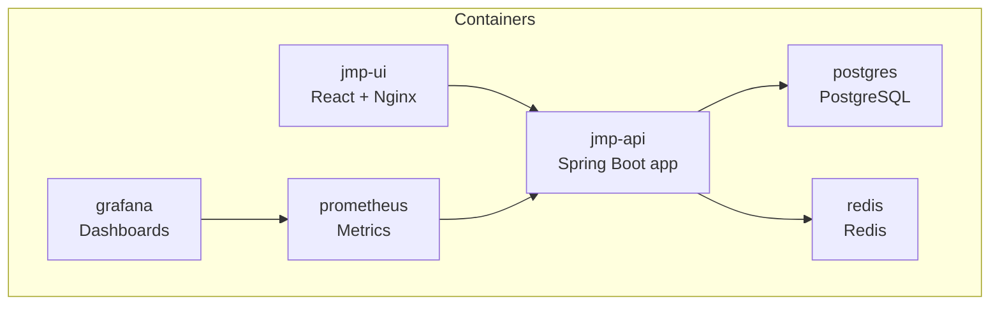
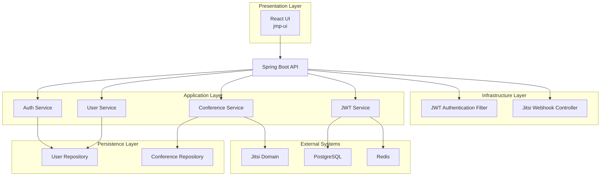

# Getting Started

<cite>
**Referenced Files in This Document**
- [docker-compose.yml](file://docker-compose.yml)
- [Dockerfile](file://Dockerfile)
- [pom.xml](file://pom.xml)
- [application.yml](file://jmp-web/src/main/resources/application.yml)
- [V1__init_schema.sql](file://jmp-web/src/main/resources/db/migration/V1__init_schema.sql)
- [V2__seed_data.sql](file://jmp-web/src/main/resources/db/migration/V2__seed_data.sql)
- [AuthController.java](file://jmp-api/src/main/java/com/jmp/api/controller/AuthController.java)
- [UserController.java](file://jmp-api/src/main/java/com/jmp/api/controller/UserController.java)
- [ConferenceController.java](file://jmp-api/src/main/java/com/jmp/api/controller/ConferenceController.java)
- [JwtService.java](file://jmp-application/src/main/java/com/jmp/application/service/JwtService.java)
- [JwtAuthenticationFilter.java](file://jmp-infrastructure/src/main/java/com/jmp/infrastructure/security/JwtAuthenticationFilter.java)
- [JitsiWebhookController.java](file://jmp-api/src/main/java/com/jmp/api/controller/JitsiWebhookController.java)
- [prometheus.yml](file://monitoring/prometheus.yml)
- [datasources.yml](file://monitoring/grafana/datasources/datasources.yml)
- [api.ts](file://jmp-ui/src/services/api.ts)
- [Dockerfile (UI)](file://jmp-ui/Dockerfile)
- [package.json (UI)](file://jmp-ui/package.json)
</cite>

## Table of Contents
1. [Introduction](#introduction)
2. [Project Structure](#project-structure)
3. [Prerequisites](#prerequisites)
4. [Installation](#installation)
5. [Initial Configuration](#initial-configuration)
6. [First Run Verification](#first-run-verification)
7. [Environment Variables](#environment-variables)
8. [Database Initialization](#database-initialization)
9. [Basic API Testing](#basic-api-testing)
10. [Quick Start Examples](#quick-start-examples)
11. [Architecture Overview](#architecture-overview)
12. [Troubleshooting Guide](#troubleshooting-guide)
13. [Conclusion](#conclusion)

## Introduction
This guide helps you install, configure, and verify the Jitsi Management Platform (JMP) quickly using Docker Compose. It covers prerequisites, step-by-step installation, environment configuration, database initialization, and first-run checks. You will also learn how to test the APIs for common tasks such as user registration, conference creation, and generating Jitsi tokens for meetings.

## Project Structure
The platform consists of:
- Backend API service (Spring Boot) exposing REST endpoints for authentication, users, conferences, and webhooks
- Frontend (React) served via Nginx in a container
- Supporting infrastructure: PostgreSQL (database), Redis (cache), Prometheus (metrics), and Grafana (dashboards)
- Monitoring stack integrated with the backend’s actuator endpoints

**Diagram sources**
- [docker-compose.yml:6-129](file://docker-compose.yml#L6-L129)
- [Dockerfile:1-54](file://Dockerfile#L1-L54)
- [Dockerfile (UI):1-33](file://jmp-ui/Dockerfile#L1-L33)

**Section sources**
- [docker-compose.yml:1-129](file://docker-compose.yml#L1-L129)
- [Dockerfile:1-54](file://Dockerfile#L1-L54)
- [Dockerfile (UI):1-33](file://jmp-ui/Dockerfile#L1-L33)

## Prerequisites
Ensure the following tools are installed on your host system:
- Java 21+ (required by the backend build and runtime)
- Docker and Docker Compose
- Node.js 20+ (for local UI development; optional if using the prebuilt UI container)

These versions are enforced by the project configuration:
- Java 21 is required for building and running the backend
- The Dockerfile builds with Eclipse Temurin 21 JDK and runs with JRE 21
- The UI Dockerfile uses Node.js 20 for building the React app

**Section sources**
- [pom.xml:48-52](file://pom.xml#L48-L52)
- [Dockerfile:5-6](file://Dockerfile#L5-L6)
- [Dockerfile (UI):5-5](file://jmp-ui/Dockerfile#L5-L5)
- [package.json (UI):1-39](file://jmp-ui/package.json#L1-L39)

## Installation
Follow these steps to deploy the platform using Docker Compose:

1. Clone or download the repository to your machine.
2. From the repository root, start all services:
   - Use the provided compose file to spin up containers for API, UI, database, cache, and monitoring.
3. Wait for all services to become healthy:
   - The API health endpoint is exposed at /actuator/health
   - The UI is served on port 5173 inside the container (mapped to port 80 in the container)
   - Database and cache are configured with health checks

Verification steps:
- Confirm container status: all services should be healthy
- Access the backend health: http://localhost:8080/actuator/health
- Access the frontend: http://localhost:5173
- Access monitoring dashboards:
  - Prometheus: http://localhost:9090
  - Grafana: http://localhost:3000 (default admin password configured in compose)

**Section sources**
- [docker-compose.yml:44-71](file://docker-compose.yml#L44-L71)
- [docker-compose.yml:74-86](file://docker-compose.yml#L74-L86)
- [docker-compose.yml:89-118](file://docker-compose.yml#L89-L118)

## Initial Configuration
The platform uses environment variables and configuration files to define runtime behavior. Key configuration areas:

- Backend configuration (application.yml):
  - Datasource URL, username, password, and HikariCP pool settings
  - Flyway migration configuration and schema
  - Redis connection settings
  - JWT secrets and expiration
  - Actuator and OpenAPI/Swagger UI paths
  - Server port and compression

- Compose environment overrides:
  - Database URL, credentials, and Redis URL
  - JWT access and refresh secrets
  - UI API base URL

Important defaults:
- Database: postgres:16-alpine, volume mounted for persistence
- Cache: redis:7-alpine, volume mounted for persistence
- Backend: exposes port 8080, health-checked via /actuator/health
- UI: served on port 80 inside container, mapped to 5173 on host

**Section sources**
- [application.yml:12-67](file://jmp-web/src/main/resources/application.yml#L12-L67)
- [application.yml:72-78](file://jmp-web/src/main/resources/application.yml#L72-L78)
- [application.yml:93-128](file://jmp-web/src/main/resources/application.yml#L93-L128)
- [docker-compose.yml:49-56](file://docker-compose.yml#L49-L56)
- [docker-compose.yml:79-80](file://docker-compose.yml#L79-L80)

## First Run Verification
After starting the services, verify the installation:

1. Backend health:
   - Endpoint: http://localhost:8080/actuator/health
   - Should return a health status after startup

2. Swagger/OpenAPI:
   - UI: http://localhost:8080/swagger-ui.html
   - API docs: http://localhost:8080/v3/api-docs

3. Frontend:
   - UI: http://localhost:5173
   - Should load without errors

4. Monitoring:
   - Prometheus: http://localhost:9090
   - Grafana: http://localhost:3000 (default admin password configured in compose)

5. Database and cache:
   - Postgres and Redis health checks are defined in compose

**Section sources**
- [docker-compose.yml:66-71](file://docker-compose.yml#L66-L71)
- [application.yml:114-128](file://jmp-web/src/main/resources/application.yml#L114-L128)
- [prometheus.yml:18-22](file://monitoring/prometheus.yml#L18-L22)
- [datasources.yml:4-10](file://monitoring/grafana/datasources/datasources.yml#L4-L10)

## Environment Variables
Configure the platform using the following environment variables. These are consumed by the backend and UI:

Backend (from application.yml and compose):
- SPRING_PROFILES_ACTIVE: dev or prod
- DB_URL: JDBC URL for PostgreSQL
- DB_USER: Database username
- DB_PASS: Database password
- REDIS_URL: Redis host
- JWT_ACCESS_SECRET: Base64-encoded secret for access tokens
- JWT_REFRESH_SECRET: Base64-encoded secret for refresh tokens
- SERVER_PORT: HTTP port for the backend (default 8080)
- VITE_API_URL: API base URL for the UI (default http://localhost:8080/api/v1)

Compose-specific:
- Services define defaults for DB_URL, DB_USER, DB_PASS, REDIS_URL, JWT secrets, and UI API URL

Recommendation:
- Override secrets and URLs in a secure environment or compose override file for production.

**Section sources**
- [application.yml:9-67](file://jmp-web/src/main/resources/application.yml#L9-L67)
- [application.yml:72-78](file://jmp-web/src/main/resources/application.yml#L72-L78)
- [docker-compose.yml:49-56](file://docker-compose.yml#L49-L56)
- [docker-compose.yml:79-80](file://docker-compose.yml#L79-L80)

## Database Initialization
The platform initializes the database schema and seeds default data automatically:

- Flyway migrations:
  - Enabled and configured to run from classpath:db/migration
  - Schema: jmp
  - Baseline on migrate is enabled

- Initial schema:
  - Creates schema jmp and UUID extension
  - Defines tables for tenants, users, roles, permissions, conferences, and participants
  - Adds indexes and comments for performance and clarity

- Seed data:
  - Inserts default tenant
  - Seeds system permissions and roles
  - Creates default admin and tenant admin users with predefined credentials

Migration files:
- V1__init_schema.sql: creates schema and tables
- V2__seed_data.sql: inserts default tenant, permissions, roles, and users

Verification:
- After first boot, the database should contain the initialized schema and seed data.

**Section sources**
- [application.yml:39-43](file://jmp-web/src/main/resources/application.yml#L39-L43)
- [V1__init_schema.sql:1-172](file://jmp-web/src/main/resources/db/migration/V1__init_schema.sql#L1-L172)
- [V2__seed_data.sql:1-131](file://jmp-web/src/main/resources/db/migration/V2__seed_data.sql#L1-L131)

## Basic API Testing
Use the following endpoints to test core functionality. Replace placeholders with actual values and use a client like curl or Postman.

Authentication:
- POST /api/v1/auth/login
  - Body: { "email": "<user-email>", "password": "<password>" }
  - On success: returns accessToken, refreshToken, expiresAt, and user profile

- POST /api/v1/auth/refresh
  - Body: { "refreshToken": "<your-refresh-token>" }
  - On success: returns a new accessToken and its expiration

Users:
- GET /api/v1/users/me
  - Returns current user profile

- POST /api/v1/users
  - Requires TENANT_ADMIN or SUPER_ADMIN
  - Body: user creation payload

Conferences:
- POST /api/v1/conferences
  - Creates a new conference for the authenticated tenant
  - Body: conference creation payload

- POST /api/v1/conferences/{id}/start
  - Starts an existing conference

- POST /api/v1/conferences/{id}/end
  - Ends an existing conference

- POST /api/v1/conferences/{id}/token
  - Generates a Jitsi JWT token for joining a conference
  - Body: { "displayName": "<display-name>", "isModerator": true/false }

Notes:
- Authorization header: Bearer <accessToken>
- The UI client (api.ts) demonstrates how to attach tokens and refresh on 401

**Section sources**
- [AuthController.java:42-100](file://jmp-api/src/main/java/com/jmp/api/controller/AuthController.java#L42-L100)
- [UserController.java:102-107](file://jmp-api/src/main/java/com/jmp/api/controller/UserController.java#L102-L107)
- [ConferenceController.java:49-138](file://jmp-api/src/main/java/com/jmp/api/controller/ConferenceController.java#L49-L138)
- [ConferenceController.java:140-173](file://jmp-api/src/main/java/com/jmp/api/controller/ConferenceController.java#L140-L173)
- [api.ts:60-92](file://jmp-ui/src/services/api.ts#L60-L92)

## Quick Start Examples
Below are practical scenarios you can test immediately after installation:

- User Registration (as a tenant admin):
  - Authenticate as TENANT_ADMIN or SUPER_ADMIN
  - Call POST /api/v1/users with a user creation payload
  - Verify the new user appears in GET /api/v1/users?page=0&size=10

- Conference Creation:
  - Authenticate as a moderator or higher role
  - Call POST /api/v1/conferences with a conference creation payload
  - Optionally start/end the conference using POST /api/v1/conferences/{id}/start and POST /api/v1/conferences/{id}/end

- Recording Management:
  - Recordings are modeled in the schema and managed via related endpoints
  - Use the recording-related endpoints to list, manage, and delete recordings as permitted by your role

- Generating a Jitsi Token:
  - Authenticate and call POST /api/v1/conferences/{id}/token
  - Use the returned token to join the meeting via the tenant’s Jitsi domain

Note: The UI integrates with these endpoints and handles token refresh automatically.

**Section sources**
- [UserController.java:43-55](file://jmp-api/src/main/java/com/jmp/api/controller/UserController.java#L43-L55)
- [ConferenceController.java:49-63](file://jmp-api/src/main/java/com/jmp/api/controller/ConferenceController.java#L49-L63)
- [ConferenceController.java:118-130](file://jmp-api/src/main/java/com/jmp/api/controller/ConferenceController.java#L118-L130)
- [ConferenceController.java:140-173](file://jmp-api/src/main/java/com/jmp/api/controller/ConferenceController.java#L140-L173)
- [api.ts:78-92](file://jmp-ui/src/services/api.ts#L78-L92)

## Architecture Overview
The platform follows a layered architecture with clear separation of concerns:

**Diagram sources**
- [JwtAuthenticationFilter.java:27-76](file://jmp-infrastructure/src/main/java/com/jmp/infrastructure/security/JwtAuthenticationFilter.java#L27-L76)
- [JwtService.java:25-43](file://jmp-application/src/main/java/com/jmp/application/service/JwtService.java#L25-L43)
- [AuthController.java:30-41](file://jmp-api/src/main/java/com/jmp/api/controller/AuthController.java#L30-L41)
- [UserController.java:33-42](file://jmp-api/src/main/java/com/jmp/api/controller/UserController.java#L33-L42)
- [ConferenceController.java:37-47](file://jmp-api/src/main/java/com/jmp/api/controller/ConferenceController.java#L37-L47)
- [JitsiWebhookController.java:24-31](file://jmp-api/src/main/java/com/jmp/api/controller/JitsiWebhookController.java#L24-L31)

## Troubleshooting Guide
Common setup issues and resolutions:

- Backend fails to start or health check fails:
  - Ensure PostgreSQL and Redis are healthy before starting the API
  - Check database credentials and connectivity
  - Review backend logs for Flyway migration errors or missing secrets

- UI cannot connect to API:
  - Confirm VITE_API_URL is set correctly in the UI container
  - Verify the API is reachable on port 8080

- Authentication failures:
  - Verify JWT secrets are properly set
  - Ensure the seeded users exist and passwords match expectations

- Database schema issues:
  - Confirm Flyway migrations ran successfully
  - Check schema jmp exists and tables are created

- Monitoring dashboards not loading:
  - Ensure Prometheus is scraping the API’s /actuator/prometheus endpoint
  - Confirm Grafana datasource points to Prometheus

**Section sources**
- [docker-compose.yml:59-63](file://docker-compose.yml#L59-L63)
- [docker-compose.yml:66-71](file://docker-compose.yml#L66-L71)
- [application.yml:39-43](file://jmp-web/src/main/resources/application.yml#L39-L43)
- [prometheus.yml:18-22](file://monitoring/prometheus.yml#L18-L22)
- [datasources.yml:4-10](file://monitoring/grafana/datasources/datasources.yml#L4-L10)

## Conclusion
You now have a fully functional Jitsi Management Platform deployment using Docker Compose. You can authenticate, manage users and conferences, generate Jitsi tokens, and monitor the system with Prometheus and Grafana. Use the provided API endpoints and the UI to explore capabilities further, and refer to the troubleshooting section for common issues.