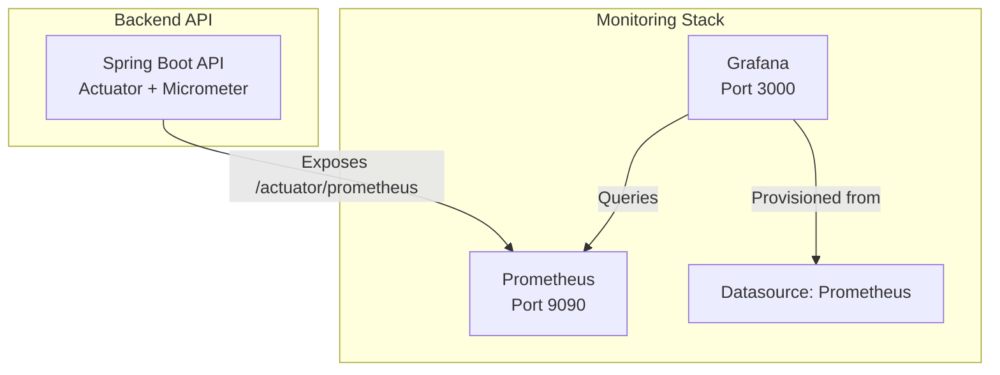
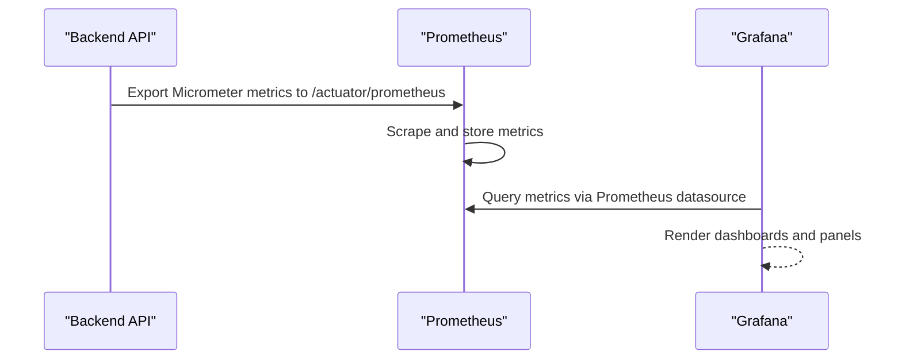
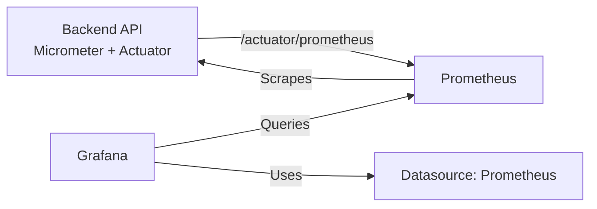

# Grafana Dashboards and Visualizations

<cite>
**Referenced Files in This Document**
- [docker-compose.yml](file://docker-compose.yml)
- [datasources.yml](file://monitoring/grafana/datasources/datasources.yml)
- [prometheus.yml](file://monitoring/prometheus.yml)
- [application.yml](file://jmp-web/src/main/resources/application.yml)
- [AnalyticsController.java](file://jmp-api/src/main/java/com/jmp/api/controller/AnalyticsController.java)
- [AnalyticsService.java](file://jmp-application/src/main/java/com/jmp/application/service/AnalyticsService.java)
- [DashboardPage.tsx](file://jmp-ui/src/pages/DashboardPage.tsx)
</cite>

## Table of Contents
1. [Introduction](#introduction)
2. [Project Structure](#project-structure)
3. [Core Components](#core-components)
4. [Architecture Overview](#architecture-overview)
5. [Detailed Component Analysis](#detailed-component-analysis)
6. [Dependency Analysis](#dependency-analysis)
7. [Performance Considerations](#performance-considerations)
8. [Troubleshooting Guide](#troubleshooting-guide)
9. [Conclusion](#conclusion)
10. [Appendices](#appendices)

## Introduction
This document explains how to set up Grafana dashboards and configure visualizations for the Jitsi Management Platform (JMP). It covers:
- Grafana datasource configuration for Prometheus
- How Prometheus scrapes metrics from the backend API
- Dashboard creation and panel configuration using Prometheus metrics
- Panels for system health, application performance, database metrics, and real-time conference statistics
- Alert visualization, trend analysis, and historical data exploration
- Examples of dashboard templating, variables, and cross-panel linking
- Sharing, permissions, and role-based customization

## Project Structure
The monitoring stack is orchestrated via Docker Compose and includes:
- Prometheus scraping the backend API’s Micrometer/Prometheus endpoint
- Grafana provisioned with a Prometheus datasource and empty dashboards directory
- The backend API exposing Micrometer metrics via Spring Boot Actuator

**Diagram sources**
- [docker-compose.yml:88-118](file://docker-compose.yml#L88-L118)
- [prometheus.yml:18-22](file://monitoring/prometheus.yml#L18-L22)
- [application.yml:92-112](file://jmp-web/src/main/resources/application.yml#L92-L112)
- [datasources.yml:1-11](file://monitoring/grafana/datasources/datasources.yml#L1-L11)

**Section sources**
- [docker-compose.yml:1-129](file://docker-compose.yml#L1-L129)
- [prometheus.yml:1-23](file://monitoring/prometheus.yml#L1-L23)
- [application.yml:92-112](file://jmp-web/src/main/resources/application.yml#L92-L112)
- [datasources.yml:1-11](file://monitoring/grafana/datasources/datasources.yml#L1-L11)

## Core Components
- Prometheus configuration defines the target job for the backend API and the metrics path.
- The backend API enables Micrometer and exposes a Prometheus-compatible metrics endpoint.
- Grafana is provisioned with a single Prometheus datasource and mounts an empty dashboards directory for provisioning.

Key configuration highlights:
- Prometheus scrape job for the backend API with a short interval for near-real-time metrics.
- Actuator Prometheus endpoint enabled and tagged with application metadata.
- Grafana datasource pointing to the local Prometheus service.

**Section sources**
- [prometheus.yml:18-22](file://monitoring/prometheus.yml#L18-L22)
- [application.yml:92-112](file://jmp-web/src/main/resources/application.yml#L92-L112)
- [datasources.yml:1-11](file://monitoring/grafana/datasources/datasources.yml#L1-L11)

## Architecture Overview
The monitoring pipeline integrates the backend API, Prometheus, and Grafana:

**Diagram sources**
- [prometheus.yml:18-22](file://monitoring/prometheus.yml#L18-L22)
- [application.yml:92-112](file://jmp-web/src/main/resources/application.yml#L92-L112)
- [datasources.yml:1-11](file://monitoring/grafana/datasources/datasources.yml#L1-L11)

## Detailed Component Analysis

### Grafana Datasource Configuration
- Datasource type: Prometheus
- Access mode: Proxy
- URL: Points to the Prometheus service inside the Docker network
- Default datasource: Enabled
- Editable: Disabled (managed by provisioning)

Operational notes:
- Mount provisioning files into Grafana so the datasource is automatically created.
- Restart Grafana after updating provisioning files.

**Section sources**
- [datasources.yml:1-11](file://monitoring/grafana/datasources/datasources.yml#L1-L11)
- [docker-compose.yml:103-118](file://docker-compose.yml#L103-L118)

### Prometheus Metrics Exposure and Scraping
- Backend API exposes Micrometer metrics via Spring Boot Actuator.
- Prometheus scrapes the API at a high frequency to support real-time dashboards.
- Application-level tags are applied to metrics for filtering.

Recommended Prometheus queries (examples):
- JVM heap usage: increase in heap metrics over time
- Request rate and latency: count and histogram quantiles of HTTP requests
- Database pool metrics: active/idle connections and pool utilization
- Cache metrics: hit ratio and eviction rates

**Section sources**
- [application.yml:92-112](file://jmp-web/src/main/resources/application.yml#L92-L112)
- [prometheus.yml:18-22](file://monitoring/prometheus.yml#L18-L22)

### Backend Analytics API (for non-Prometheus dashboards)
While Grafana primarily consumes Prometheus metrics, the backend also exposes analytics endpoints that return structured metrics for dashboards. These endpoints are role-restricted and can be used to power UI dashboards or external integrations.

Endpoints:
- GET /analytics/dashboard (tenant-scoped)
- GET /analytics/usage-report (date-range scoped)
- GET /analytics/system-health (super admin)

Permissions:
- Tenant admin, super admin, and auditor can access dashboard and usage reports
- System health requires super admin

These endpoints return typed analytics records suitable for visualization in custom dashboards.

**Section sources**
- [AnalyticsController.java:34-95](file://jmp-api/src/main/java/com/jmp/api/controller/AnalyticsController.java#L34-L95)
- [AnalyticsService.java:35-145](file://jmp-application/src/main/java/com/jmp/application/service/AnalyticsService.java#L35-L145)

### Real-Time Conference Statistics Panel
The frontend dashboard page aggregates live conference counts and participant totals from the backend. While this is rendered in the UI, Grafana can visualize similar metrics using Prometheus queries against the API’s metrics endpoint.

Frontend aggregation logic:
- Fetch active and upcoming conferences concurrently
- Sum current participants across active conferences
- Display as stat cards

Grafana equivalent:
- Use Prometheus queries to compute active conferences and participant counts
- Apply template variables for tenants or environments
- Link panels via dashboard variables for drill-down

**Section sources**
- [DashboardPage.tsx:24-142](file://jmp-ui/src/pages/DashboardPage.tsx#L24-L142)

### Panel Categories and Recommended Queries

#### System Health
Panels:
- CPU usage, memory usage, GC pauses
- Thread pools and thread contention
- JVM garbage collection metrics

Suggested Prometheus queries:
- CPU usage: rate(process_cpu_seconds_total[5m])
- Memory: jvm_memory_used_bytes
- GC: rate(jvm_gc_pause_seconds_count[5m])

#### Application Performance
Panels:
- HTTP request rate, latency (p50/p90/p99), error rate
- Database pool utilization and connection times
- Cache hit ratio and evictions

Suggested Prometheus queries:
- Requests per second: sum by (method, endpoint) (rate(http_server_requests_seconds_count[5m]))
- Latency: histogram_quantile(0.95, sum by(le, method, endpoint) (rate(http_server_requests_seconds_bucket[5m])))
- DB pool: hikaricp_connections_active, hikaricp_connections_idle

#### Database Metrics
Panels:
- PostgreSQL connection counts and replication lag
- Query durations and slow queries
- Table sizes and vacuum/analyze stats

Suggested Prometheus queries:
- Postgres exporter metrics (if integrated): pg_stat_activity_count, pg_stat_database_tup_updated
- Custom SQL metrics via micrometer (if instrumented)

Note: The current Prometheus configuration targets the backend API. To visualize PostgreSQL metrics, integrate a dedicated exporter and add a scrape job.

#### Real-Time Conference Statistics
Panels:
- Active conferences
- Current participants
- Upcoming conferences

Suggested Prometheus queries:
- Active conferences: increase(jmp_conferences_active_total[5m])
- Participants: sum by (room) (jmp_participants_current{room!=""})
- Upcoming conferences: increase(jmp_conferences_upcoming_total[5m])

Note: These metric names are illustrative. Instrument the backend with Micrometer counters/gauges to expose real-time conference metrics.

### Alert Visualization and Trend Analysis
- Alerts: Configure Prometheus alerts and render them in Grafana using alert panels or annotation overlays.
- Trend analysis: Use time-series panels with moving averages and quantiles.
- Historical exploration: Enable long retention periods in Prometheus and use Grafana’s time range controls.

### Templating, Variables, and Cross-Panel Linking
- Template variables: Use Grafana variables for tenant selection, environment, or service names.
- Variable queries: Derive values from Prometheus label values or dashboard annotations.
- Cross-panel links: Link panels by injecting variables into URLs or using template variables in panel queries.

### Sharing, Permissions, and Role-Based Customization
- Roles: Super admin, tenant admin, auditor
- Permissions: Analytics endpoints restrict access accordingly
- Dashboard sharing: Use Grafana folders and team-based permissions; apply variable visibility and edit restrictions

## Dependency Analysis
The monitoring stack depends on:
- Backend API enabling Micrometer and Actuator
- Prometheus configured to scrape the API
- Grafana configured with the Prometheus datasource

**Diagram sources**
- [application.yml:92-112](file://jmp-web/src/main/resources/application.yml#L92-L112)
- [prometheus.yml:18-22](file://monitoring/prometheus.yml#L18-L22)
- [datasources.yml:1-11](file://monitoring/grafana/datasources/datasources.yml#L1-L11)

**Section sources**
- [application.yml:92-112](file://jmp-web/src/main/resources/application.yml#L92-L112)
- [prometheus.yml:18-22](file://monitoring/prometheus.yml#L18-L22)
- [datasources.yml:1-11](file://monitoring/grafana/datasources/datasources.yml#L1-L11)

## Performance Considerations
- Scraping interval: Short intervals improve dashboard responsiveness but increase load. Tune based on cardinality and hardware.
- Query complexity: Prefer efficient PromQL with label-based filtering and reduce series cardinality.
- Retention: Balance historical data needs with disk usage.
- Dashboard updates: Use appropriate refresh intervals and disable auto-refresh for heavy dashboards.

## Troubleshooting Guide
Common issues and resolutions:
- Grafana cannot connect to Prometheus:
  - Verify datasource URL and network connectivity between containers.
  - Confirm Prometheus is healthy and reachable from Grafana.
- No metrics visible in Grafana:
  - Ensure Actuator Prometheus endpoint is enabled and accessible.
  - Confirm Prometheus scrape job targets the API and metrics path.
- Slow dashboard rendering:
  - Simplify queries and reduce label cardinality.
  - Increase scrape interval moderately if acceptable.
- Missing PostgreSQL metrics:
  - Integrate a PostgreSQL exporter and add a scrape job to Prometheus.

**Section sources**
- [docker-compose.yml:88-118](file://docker-compose.yml#L88-L118)
- [prometheus.yml:18-22](file://monitoring/prometheus.yml#L18-L22)
- [application.yml:92-112](file://jmp-web/src/main/resources/application.yml#L92-L112)

## Conclusion
With Prometheus scraping the backend API and Grafana consuming those metrics, you can build comprehensive dashboards covering system health, application performance, database metrics, and real-time conference statistics. Combine Prometheus metrics with role-based analytics endpoints and Grafana’s templating features to deliver secure, customizable, and insightful visualizations.

## Appendices

### Appendix A: Prometheus Job and Endpoint Reference
- Job name: jmp-api
- Metrics path: /actuator/prometheus
- Targets: jmp-api:8080
- Scrape interval: 5s

**Section sources**
- [prometheus.yml:18-22](file://monitoring/prometheus.yml#L18-L22)
- [application.yml:92-112](file://jmp-web/src/main/resources/application.yml#L92-L112)

### Appendix B: Grafana Datasource Provisioning
- Datasource name: Prometheus
- Type: prometheus
- Access: proxy
- URL: http://prometheus:9090
- Default: true
- Editable: false

**Section sources**
- [datasources.yml:1-11](file://monitoring/grafana/datasources/datasources.yml#L1-L11)
- [docker-compose.yml:103-118](file://docker-compose.yml#L103-L118)

### Appendix C: Backend Analytics Endpoints
- GET /analytics/dashboard
- GET /analytics/usage-report
- GET /analytics/system-health

Permissions:
- Dashboard and usage report: tenant admin, super admin, auditor
- System health: super admin

**Section sources**
- [AnalyticsController.java:34-95](file://jmp-api/src/main/java/com/jmp/api/controller/AnalyticsController.java#L34-L95)
- [AnalyticsService.java:35-145](file://jmp-application/src/main/java/com/jmp/application/service/AnalyticsService.java#L35-L145)