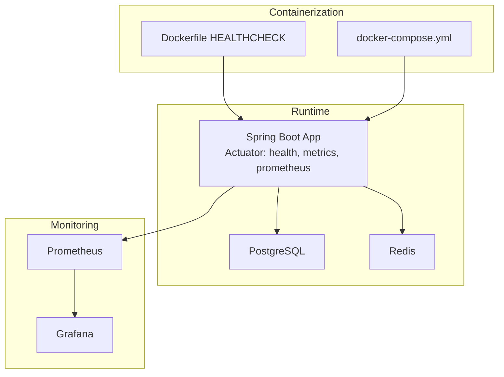
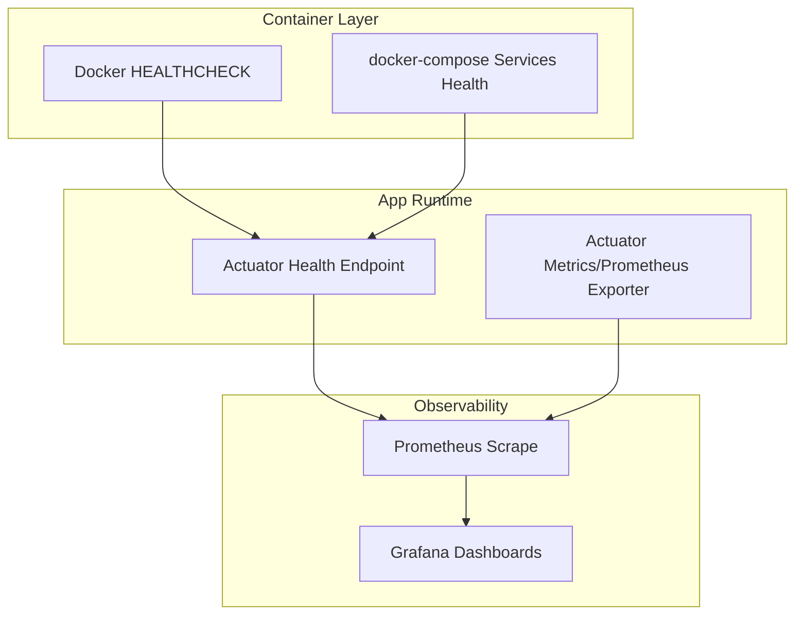
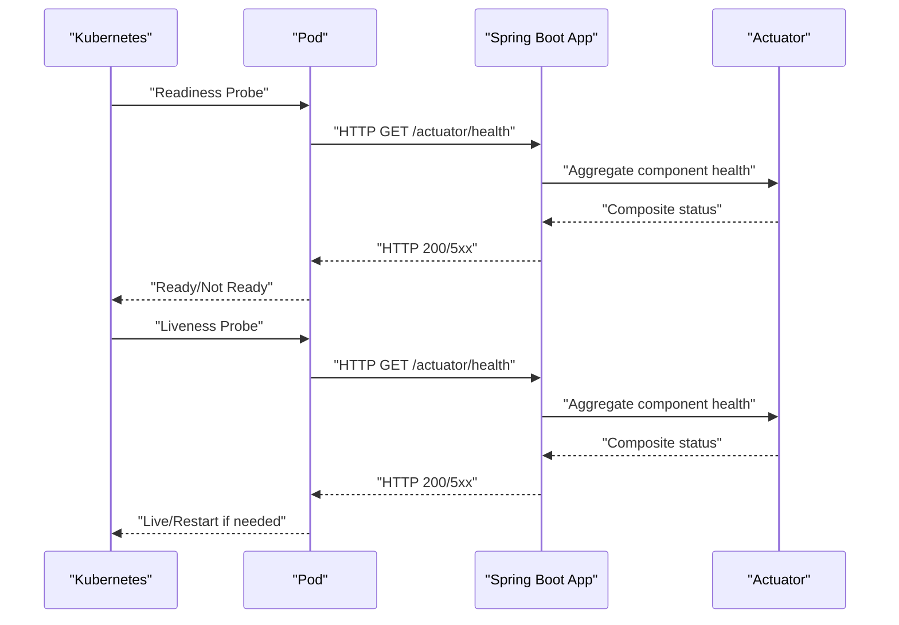
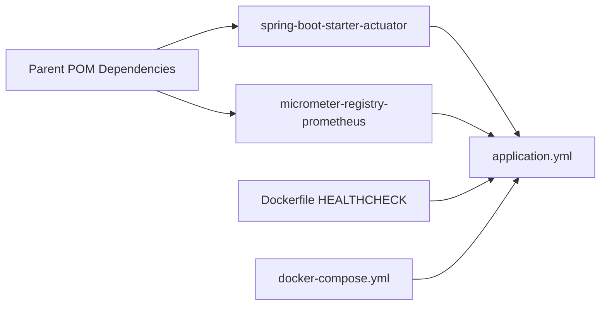

# Health Checks and Readiness Probes

<cite>
**Referenced Files in This Document**
- [pom.xml](file://pom.xml)
- [application.yml](file://jmp-web/src/main/resources/application.yml)
- [SecurityConfig.java](file://jmp-infrastructure/src/main/java/com/jmp/infrastructure/security/SecurityConfig.java)
- [JwtAuthenticationFilter.java](file://jmp-infrastructure/src/main/java/com/jmp/infrastructure/security/JwtAuthenticationFilter.java)
- [Dockerfile](file://Dockerfile)
- [docker-compose.yml](file://docker-compose.yml)
- [prometheus.yml](file://monitoring/prometheus.yml)
- [datasources.yml](file://monitoring/grafana/datasources/datasources.yml)
- [AnalyticsController.java](file://jmp-api/src/main/java/com/jmp/api/controller/AnalyticsController.java)
- [AnalyticsService.java](file://jmp-application/src/main/java/com/jmp/application/service/AnalyticsService.java)
</cite>

## Table of Contents
1. [Introduction](#introduction)
2. [Project Structure](#project-structure)
3. [Core Components](#core-components)
4. [Architecture Overview](#architecture-overview)
5. [Detailed Component Analysis](#detailed-component-analysis)
6. [Dependency Analysis](#dependency-analysis)
7. [Performance Considerations](#performance-considerations)
8. [Troubleshooting Guide](#troubleshooting-guide)
9. [Conclusion](#conclusion)
10. [Appendices](#appendices)

## Introduction
This document explains the health checks and readiness probes implementation across the platform. It covers Spring Boot Actuator health indicators, security posture for health endpoints, Docker and Docker Compose health checks, Kubernetes readiness/liveness configuration patterns, and monitoring integration via Prometheus and Grafana. It also outlines database connectivity checks, external service verification, and environment-specific configurations. Guidance is provided for composite health indicators, conditional checks, and best practices for frequency, timeouts, and performance impact minimization.

## Project Structure
The platform is a multi-module Spring Boot application exposing health and metrics via Actuator. Monitoring is integrated with Micrometer and Prometheus, and Grafana is provisioned for dashboards. Docker images define health checks against the Actuator health endpoint, while Docker Compose orchestrates dependent services with health checks.

**Diagram sources**
- [Dockerfile:47-49](file://Dockerfile#L47-L49)
- [docker-compose.yml:66-71](file://docker-compose.yml#L66-L71)
- [application.yml:92-112](file://jmp-web/src/main/resources/application.yml#L92-L112)
- [prometheus.yml:18-22](file://monitoring/prometheus.yml#L18-L22)
- [datasources.yml:4-9](file://monitoring/grafana/datasources/datasources.yml#L4-L9)

**Section sources**
- [pom.xml:123-132](file://pom.xml#L123-L132)
- [application.yml:92-112](file://jmp-web/src/main/resources/application.yml#L92-L112)
- [Dockerfile:47-49](file://Dockerfile#L47-L49)
- [docker-compose.yml:66-71](file://docker-compose.yml#L66-L71)
- [prometheus.yml:18-22](file://monitoring/prometheus.yml#L18-L22)
- [datasources.yml:4-9](file://monitoring/grafana/datasources/datasources.yml#L4-L9)

## Core Components
- Spring Boot Actuator health and metrics: Exposed under /actuator with configurable exposure and detail visibility.
- Security configuration: Actuator health endpoint is publicly accessible; other endpoints require authentication.
- Docker health check: Uses wget to probe /actuator/health.
- Docker Compose orchestration: Defines health checks for Postgres and Redis; waits for health before starting the API.
- Prometheus and Grafana: Prometheus scrapes Actuator metrics; Grafana consumes Prometheus as a data source.

Key implementation references:
- Actuator exposure and detail policy: [application.yml:92-112](file://jmp-web/src/main/resources/application.yml#L92-L112)
- Actuator dependency: [pom.xml:123-132](file://pom.xml#L123-L132)
- Actuator health public access: [SecurityConfig.java:53](file://jmp-infrastructure/src/main/java/com/jmp/infrastructure/security/SecurityConfig.java#L53)
- Docker health check: [Dockerfile:47-49](file://Dockerfile#L47-L49)
- Docker Compose health checks and dependencies: [docker-compose.yml:19-23](file://docker-compose.yml#L19-L23), [docker-compose.yml:35-39](file://docker-compose.yml#L35-L39), [docker-compose.yml:59-63](file://docker-compose.yml#L59-L63), [docker-compose.yml:66-71](file://docker-compose.yml#L66-L71)
- Prometheus scraping Actuator: [prometheus.yml:18-22](file://monitoring/prometheus.yml#L18-L22)
- Grafana Prometheus data source: [datasources.yml:4-9](file://monitoring/grafana/datasources/datasources.yml#L4-L9)

**Section sources**
- [application.yml:92-112](file://jmp-web/src/main/resources/application.yml#L92-L112)
- [pom.xml:123-132](file://pom.xml#L123-L132)
- [SecurityConfig.java:53](file://jmp-infrastructure/src/main/java/com/jmp/infrastructure/security/SecurityConfig.java#L53)
- [Dockerfile:47-49](file://Dockerfile#L47-L49)
- [docker-compose.yml:19-23](file://docker-compose.yml#L19-L23)
- [docker-compose.yml:35-39](file://docker-compose.yml#L35-L39)
- [docker-compose.yml:59-63](file://docker-compose.yml#L59-L63)
- [docker-compose.yml:66-71](file://docker-compose.yml#L66-L71)
- [prometheus.yml:18-22](file://monitoring/prometheus.yml#L18-L22)
- [datasources.yml:4-9](file://monitoring/grafana/datasources/datasources.yml#L4-L9)

## Architecture Overview
The health and monitoring architecture integrates runtime health probing, container-level health checks, and observability tooling.

**Diagram sources**
- [Dockerfile:47-49](file://Dockerfile#L47-L49)
- [docker-compose.yml:19-23](file://docker-compose.yml#L19-L23)
- [docker-compose.yml:35-39](file://docker-compose.yml#L35-L39)
- [docker-compose.yml:66-71](file://docker-compose.yml#L66-L71)
- [application.yml:92-112](file://jmp-web/src/main/resources/application.yml#L92-L112)
- [prometheus.yml:18-22](file://monitoring/prometheus.yml#L18-L22)
- [datasources.yml:4-9](file://monitoring/grafana/datasources/datasources.yml#L4-L9)

## Detailed Component Analysis

### Spring Boot Actuator Health Indicators
- Exposure: Health, info, metrics, and Prometheus endpoints are exposed under /actuator.
- Detail visibility: Details are shown when authorized.
- Probes: Readiness and liveness probes are enabled.

Operational implications:
- The health endpoint is publicly accessible, enabling container and platform health checks without authentication.
- Composite health status aggregates component health (database, Redis, and others as configured).

References:
- [application.yml:92-112](file://jmp-web/src/main/resources/application.yml#L92-L112)
- [SecurityConfig.java:53](file://jmp-infrastructure/src/main/java/com/jmp/infrastructure/security/SecurityConfig.java#L53)

**Section sources**
- [application.yml:92-112](file://jmp-web/src/main/resources/application.yml#L92-L112)
- [SecurityConfig.java:53](file://jmp-infrastructure/src/main/java/com/jmp/infrastructure/security/SecurityConfig.java#L53)

### Security of Health Check Endpoints
- Public access: The /actuator/health endpoint is permitted without authentication.
- Other endpoints require authentication via JWT.
- Health endpoint exclusion is handled in both security filter chain and JWT filter bypass logic.

References:
- [SecurityConfig.java:53](file://jmp-infrastructure/src/main/java/com/jmp/infrastructure/security/SecurityConfig.java#L53)
- [JwtAuthenticationFilter.java:87-94](file://jmp-infrastructure/src/main/java/com/jmp/infrastructure/security/JwtAuthenticationFilter.java#L87-L94)

**Section sources**
- [SecurityConfig.java:53](file://jmp-infrastructure/src/main/java/com/jmp/infrastructure/security/SecurityConfig.java#L53)
- [JwtAuthenticationFilter.java:87-94](file://jmp-infrastructure/src/main/java/com/jmp/infrastructure/security/JwtAuthenticationFilter.java#L87-L94)

### Container-Level Health Checks
- Dockerfile HEALTHCHECK probes /actuator/health via wget.
- docker-compose defines health checks for Postgres and Redis and sets dependencies so the API starts only after those are healthy.

References:
- [Dockerfile:47-49](file://Dockerfile#L47-L49)
- [docker-compose.yml:19-23](file://docker-compose.yml#L19-L23)
- [docker-compose.yml:35-39](file://docker-compose.yml#L35-L39)
- [docker-compose.yml:59-63](file://docker-compose.yml#L59-L63)
- [docker-compose.yml:66-71](file://docker-compose.yml#L66-L71)

**Section sources**
- [Dockerfile:47-49](file://Dockerfile#L47-L49)
- [docker-compose.yml:19-23](file://docker-compose.yml#L19-L23)
- [docker-compose.yml:35-39](file://docker-compose.yml#L35-L39)
- [docker-compose.yml:59-63](file://docker-compose.yml#L59-L63)
- [docker-compose.yml:66-71](file://docker-compose.yml#L66-L71)

### Monitoring Integration (Prometheus and Grafana)
- Prometheus scrapes Actuator metrics from the API service.
- Grafana is configured as a Prometheus data source and provisions dashboards.

References:
- [prometheus.yml:18-22](file://monitoring/prometheus.yml#L18-L22)
- [datasources.yml:4-9](file://monitoring/grafana/datasources/datasources.yml#L4-L9)

**Section sources**
- [prometheus.yml:18-22](file://monitoring/prometheus.yml#L18-L22)
- [datasources.yml:4-9](file://monitoring/grafana/datasources/datasources.yml#L4-L9)

### Database Connectivity Checks
- Application connects to PostgreSQL via JDBC/HikariCP with explicit timeouts and pooling parameters.
- Flyway migration is enabled and configured to run with specific schema location and baseline behavior.

References:
- [application.yml:12-23](file://jmp-web/src/main/resources/application.yml#L12-L23)
- [application.yml:39-44](file://jmp-web/src/main/resources/application.yml#L39-L44)

**Section sources**
- [application.yml:12-23](file://jmp-web/src/main/resources/application.yml#L12-L23)
- [application.yml:39-44](file://jmp-web/src/main/resources/application.yml#L39-L44)

### External Service Health Verification
- Redis connectivity is configured with timeouts and pooling.
- docker-compose health checks for Redis and Postgres ensure dependent services are ready before launching the API.

References:
- [application.yml:45-56](file://jmp-web/src/main/resources/application.yml#L45-L56)
- [docker-compose.yml:19-23](file://docker-compose.yml#L19-L23)
- [docker-compose.yml:35-39](file://docker-compose.yml#L35-L39)
- [docker-compose.yml:59-63](file://docker-compose.yml#L59-L63)

**Section sources**
- [application.yml:45-56](file://jmp-web/src/main/resources/application.yml#L45-L56)
- [docker-compose.yml:19-23](file://docker-compose.yml#L19-L23)
- [docker-compose.yml:35-39](file://docker-compose.yml#L35-L39)
- [docker-compose.yml:59-63](file://docker-compose.yml#L59-L63)

### Resource Availability Monitoring
- CPU/memory usage and response time are modeled in the analytics service’s SystemHealthMetrics structure.
- These metrics are intended to integrate with Actuator metrics in future implementations.

References:
- [AnalyticsService.java:228-233](file://jmp-application/src/main/java/com/jmp/application/service/AnalyticsService.java#L228-L233)
- [AnalyticsController.java:82-87](file://jmp-api/src/main/java/com/jmp/api/controller/AnalyticsController.java#L82-L87)

**Section sources**
- [AnalyticsService.java:228-233](file://jmp-application/src/main/java/com/jmp/application/service/AnalyticsService.java#L228-L233)
- [AnalyticsController.java:82-87](file://jmp-api/src/main/java/com/jmp/api/controller/AnalyticsController.java#L82-L87)

### Composite Health Indicators and Conditional Health Checks
- Composite health: Actuator aggregates component health (database, Redis, and others) into overall status.
- Conditional checks: The API can expose environment-specific health checks by adding custom health indicators or by toggling Actuator exposure per profile.

References:
- [application.yml:92-112](file://jmp-web/src/main/resources/application.yml#L92-L112)
- [pom.xml:123-132](file://pom.xml#L123-L132)

**Section sources**
- [application.yml:92-112](file://jmp-web/src/main/resources/application.yml#L92-L112)
- [pom.xml:123-132](file://pom.xml#L123-L132)

### Environment-Specific Configurations
- Profiles: dev and prod profiles are defined at the parent POM level.
- Actuator exposure and detail visibility are controlled via application.yml; environment variables can override datasource and Redis settings.

References:
- [pom.xml:314-330](file://pom.xml#L314-L330)
- [application.yml:92-112](file://jmp-web/src/main/resources/application.yml#L92-L112)
- [application.yml:12-16](file://jmp-web/src/main/resources/application.yml#L12-L16)
- [application.yml:45-50](file://jmp-web/src/main/resources/application.yml#L45-L50)

**Section sources**
- [pom.xml:314-330](file://pom.xml#L314-L330)
- [application.yml:92-112](file://jmp-web/src/main/resources/application.yml#L92-L112)
- [application.yml:12-16](file://jmp-web/src/main/resources/application.yml#L12-L16)
- [application.yml:45-50](file://jmp-web/src/main/resources/application.yml#L45-L50)

### Kubernetes Readiness and Liveness Probes (Configuration Patterns)
Note: The repository does not include Kubernetes manifests. The following describes recommended patterns aligned with the existing health and metrics configuration.

[No sources needed since this diagram shows conceptual workflow, not actual code structure]

## Dependency Analysis
The health and monitoring stack depends on Actuator, Micrometer Prometheus registry, and container orchestration.

**Diagram sources**
- [pom.xml:123-132](file://pom.xml#L123-L132)
- [application.yml:92-112](file://jmp-web/src/main/resources/application.yml#L92-L112)
- [Dockerfile:47-49](file://Dockerfile#L47-L49)
- [docker-compose.yml:66-71](file://docker-compose.yml#L66-L71)

**Section sources**
- [pom.xml:123-132](file://pom.xml#L123-L132)
- [application.yml:92-112](file://jmp-web/src/main/resources/application.yml#L92-L112)
- [Dockerfile:47-49](file://Dockerfile#L47-L49)
- [docker-compose.yml:66-71](file://docker-compose.yml#L66-L71)

## Performance Considerations
- Health endpoint overhead: Keep health checks lightweight; avoid heavy computations. Actuator probes are designed to be fast.
- Timeout and intervals: Align container health check intervals and timeouts with application readiness expectations. The current Docker HEALTHCHECK uses short timeouts suitable for local development.
- Metrics export: Prometheus scraping is configured with a short interval for the API target; ensure scrape intervals balance fidelity and load.
- Database and Redis tuning: Connection pool sizes and timeouts are set in application.yml; adjust based on workload and latency targets.

[No sources needed since this section provides general guidance]

## Troubleshooting Guide
Common issues and resolutions:
- Health endpoint unauthorized errors: The /actuator/health endpoint is publicly accessible by design; verify security configuration if access is blocked.
- Container fails health checks: Confirm the app is listening on the expected port and that the health endpoint responds. Review Docker HEALTHCHECK and docker-compose health checks.
- Missing metrics in Prometheus: Verify Prometheus scrape configuration and that the API exposes /actuator/prometheus.
- Grafana dashboards not loading metrics: Confirm Grafana Prometheus data source configuration and that Prometheus is reachable.

References:
- [SecurityConfig.java:53](file://jmp-infrastructure/src/main/java/com/jmp/infrastructure/security/SecurityConfig.java#L53)
- [Dockerfile:47-49](file://Dockerfile#L47-L49)
- [docker-compose.yml:66-71](file://docker-compose.yml#L66-L71)
- [prometheus.yml:18-22](file://monitoring/prometheus.yml#L18-L22)
- [datasources.yml:4-9](file://monitoring/grafana/datasources/datasources.yml#L4-L9)

**Section sources**
- [SecurityConfig.java:53](file://jmp-infrastructure/src/main/java/com/jmp/infrastructure/security/SecurityConfig.java#L53)
- [Dockerfile:47-49](file://Dockerfile#L47-L49)
- [docker-compose.yml:66-71](file://docker-compose.yml#L66-L71)
- [prometheus.yml:18-22](file://monitoring/prometheus.yml#L18-L22)
- [datasources.yml:4-9](file://monitoring/grafana/datasources/datasources.yml#L4-L9)

## Conclusion
The platform implements a robust health and monitoring foundation using Spring Boot Actuator, Micrometer, and container-level health checks. The health endpoint is publicly accessible to support container and platform orchestration, while other endpoints remain protected. Prometheus and Grafana provide observability, and docker-compose ensures dependent services are ready before launching the API. Extending the system with custom health indicators, environment-specific configurations, and Kubernetes-native probes follows the existing patterns established in the codebase.

[No sources needed since this section summarizes without analyzing specific files]

## Appendices

### Best Practices Checklist
- Keep health checks lightweight and fast.
- Tune container health check intervals and timeouts to match application startup and steady-state behavior.
- Use environment-specific profiles to control Actuator exposure and detail visibility.
- Monitor database and Redis connectivity with appropriate timeouts and pool sizing.
- Integrate system health metrics with Actuator metrics for comprehensive dashboards.

[No sources needed since this section provides general guidance]