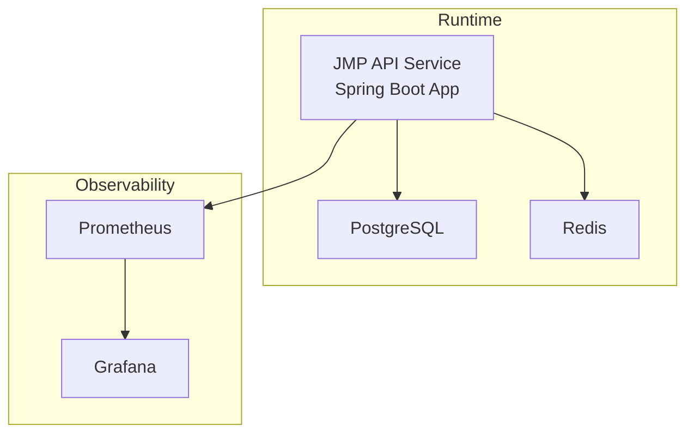
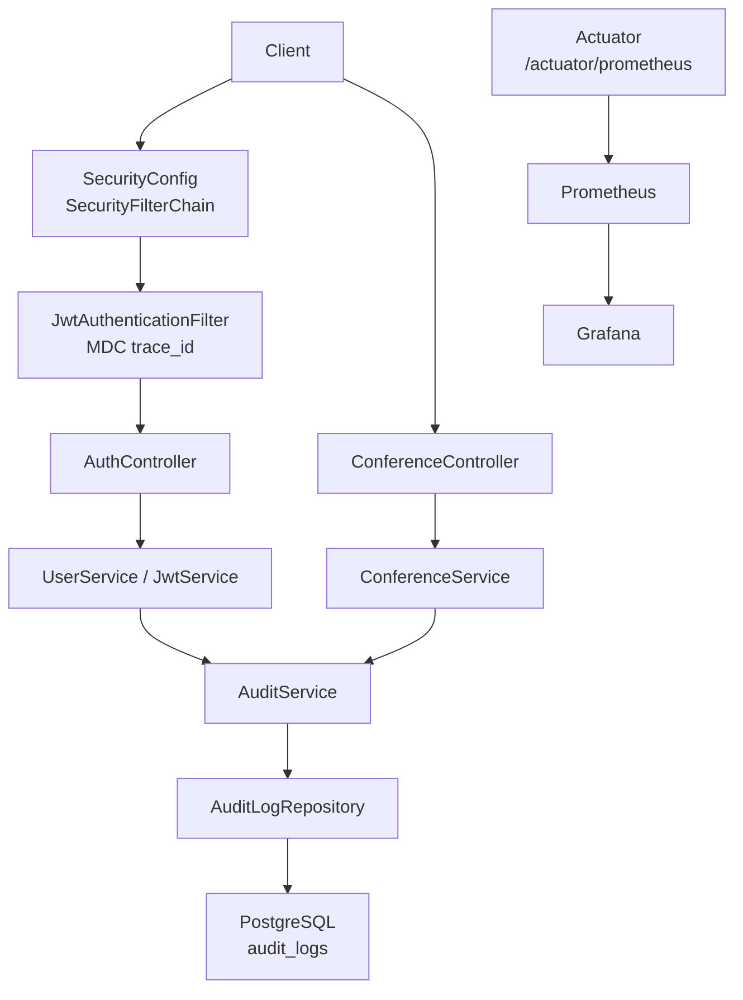
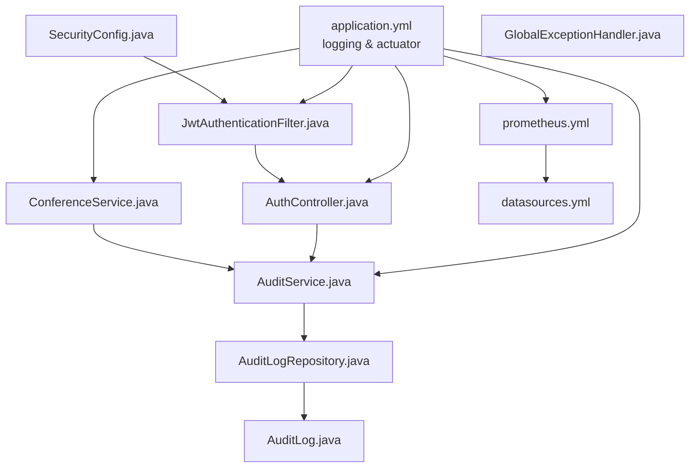
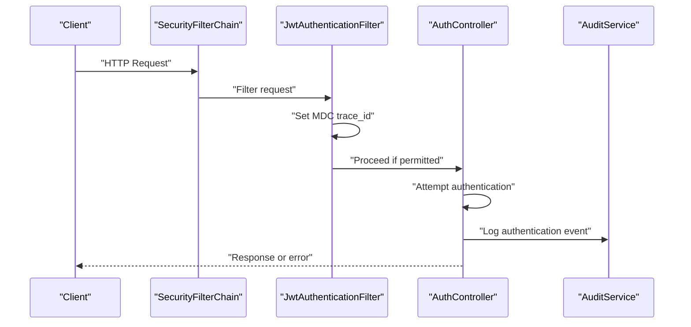
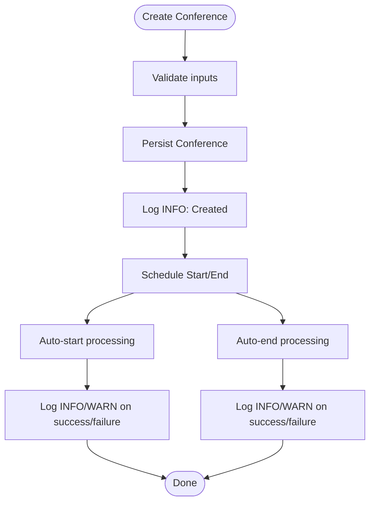

# Logging and Log Monitoring

<cite>
**Referenced Files in This Document**
- [application.yml](file://jmp-web/src/main/resources/application.yml)
- [docker-compose.yml](file://docker-compose.yml)
- [Dockerfile](file://Dockerfile)
- [prometheus.yml](file://monitoring/prometheus.yml)
- [datasources.yml](file://monitoring/grafana/datasources/datasources.yml)
- [SecurityConfig.java](file://jmp-infrastructure/src/main/java/com/jmp/infrastructure/security/SecurityConfig.java)
- [JwtAuthenticationFilter.java](file://jmp-infrastructure/src/main/java/com/jmp/infrastructure/security/JwtAuthenticationFilter.java)
- [GlobalExceptionHandler.java](file://jmp-api/src/main/java/com/jmp/api/advice/GlobalExceptionHandler.java)
- [AuthController.java](file://jmp-api/src/main/java/com/jmp/api/controller/AuthController.java)
- [ConferenceService.java](file://jmp-application/src/main/java/com/jmp/application/service/ConferenceService.java)
- [AuditService.java](file://jmp-application/src/main/java/com/jmp/application/service/AuditService.java)
- [AuditLog.java](file://jmp-domain/src/main/java/com/jmp/domain/entity/AuditLog.java)
- [AuditLogRepository.java](file://jmp-domain/src/main/java/com/jmp/domain/repository/AuditLogRepository.java)
</cite>

## Table of Contents
1. [Introduction](#introduction)
2. [Project Structure](#project-structure)
3. [Core Components](#core-components)
4. [Architecture Overview](#architecture-overview)
5. [Detailed Component Analysis](#detailed-component-analysis)
6. [Dependency Analysis](#dependency-analysis)
7. [Performance Considerations](#performance-considerations)
8. [Troubleshooting Guide](#troubleshooting-guide)
9. [Conclusion](#conclusion)
10. [Appendices](#appendices)

## Introduction
This document provides comprehensive guidance for logging and log monitoring in the Jitsi Management Platform (JMP). It covers Spring Boot logging configuration, structured logging, log levels, and practical strategies for log aggregation and analysis. It also documents application-specific logs for authentication, conference lifecycle, error tracking, and security audits, along with operational topics such as log rotation, retention, and alerting. Finally, it outlines distributed logging approaches, correlation IDs, and troubleshooting workflows grounded in the repository’s actual implementation.

## Project Structure
The logging and monitoring ecosystem spans configuration files, infrastructure components, and application services:
- Spring Boot configuration defines logging levels, console patterns, and structured logging format.
- Docker Compose orchestrates the backend service and external observability systems (Prometheus and Grafana).
- Application services emit logs for authentication, conferences, and audit events.
- Audit logs are persisted to a relational database for compliance and analysis.

**Diagram sources**
- [docker-compose.yml:44-71](file://docker-compose.yml#L44-L71)
- [prometheus.yml:18-22](file://monitoring/prometheus.yml#L18-L22)
- [datasources.yml:4-10](file://monitoring/grafana/datasources/datasources.yml#L4-L10)

**Section sources**
- [application.yml:80-91](file://jmp-web/src/main/resources/application.yml#L80-L91)
- [docker-compose.yml:44-118](file://docker-compose.yml#L44-L118)
- [Dockerfile:47-53](file://Dockerfile#L47-L53)

## Core Components
- Logging configuration: Console pattern and structured logging format are configured via Spring Boot YAML.
- Structured logging: JSON format is enabled for console output to support machine parsing.
- Log levels: Root and package-specific levels are set for development and production readiness.
- Observability: Prometheus scraping and Grafana provisioning are included for metrics-based monitoring.

Key configuration highlights:
- Console pattern includes timestamp, thread, MDC trace_id, level, logger, and message.
- Structured logging format set to JSON for console output.
- Actuator exposes Prometheus metrics at /actuator/prometheus.

**Section sources**
- [application.yml:80-91](file://jmp-web/src/main/resources/application.yml#L80-L91)
- [application.yml:92-111](file://jmp-web/src/main/resources/application.yml#L92-L111)
- [prometheus.yml:18-22](file://monitoring/prometheus.yml#L18-L22)
- [datasources.yml:4-10](file://monitoring/grafana/datasources/datasources.yml#L4-L10)

## Architecture Overview
The logging architecture integrates application logs, audit trail persistence, and metrics-driven monitoring.

**Diagram sources**
- [SecurityConfig.java:42-61](file://jmp-infrastructure/src/main/java/com/jmp/infrastructure/security/SecurityConfig.java#L42-L61)
- [JwtAuthenticationFilter.java:39-76](file://jmp-infrastructure/src/main/java/com/jmp/infrastructure/security/JwtAuthenticationFilter.java#L39-L76)
- [AuthController.java:42-81](file://jmp-api/src/main/java/com/jmp/api/controller/AuthController.java#L42-L81)
- [ConferenceService.java:40-65](file://jmp-application/src/main/java/com/jmp/application/service/ConferenceService.java#L40-L65)
- [AuditService.java:29-72](file://jmp-application/src/main/java/com/jmp/application/service/AuditService.java#L29-L72)
- [AuditLogRepository.java:18-24](file://jmp-domain/src/main/java/com/jmp/domain/repository/AuditLogRepository.java#L18-L24)
- [AuditLog.java:20-35](file://jmp-domain/src/main/java/com/jmp/domain/entity/AuditLog.java#L20-L35)
- [prometheus.yml:18-22](file://monitoring/prometheus.yml#L18-L22)
- [datasources.yml:4-10](file://monitoring/grafana/datasources/datasources.yml#L4-L10)

## Detailed Component Analysis

### Spring Boot Logging Configuration
- Console pattern: Includes timestamp, thread, MDC trace_id, level, logger, and message.
- Structured logging: Console format set to JSON for machine-readable logs.
- Log levels: Root set to INFO; com.jmp and Spring Security debug levels enabled for diagnostics.

Operational implications:
- Enable structured logs for centralized ingestion (e.g., ELK stack).
- Use MDC trace_id to correlate requests across services.
- Keep production log levels at INFO; enable debug selectively for targeted environments.

**Section sources**
- [application.yml:80-91](file://jmp-web/src/main/resources/application.yml#L80-L91)

### Security and Authentication Logging
- JwtAuthenticationFilter sets MDC fields (e.g., trace_id) and logs authentication outcomes.
- AuthController logs login attempts and successful authentications; warns on failures.
- GlobalExceptionHandler logs exceptions and returns standardized Problem Details responses.

Application-specific logs:
- Authentication events: Successful login, failed login attempts, token refresh.
- Authorization events: Access denied and bad credentials scenarios.
- Security events: General security-related activities captured via AuditService.

**Section sources**
- [JwtAuthenticationFilter.java:39-76](file://jmp-infrastructure/src/main/java/com/jmp/infrastructure/security/JwtAuthenticationFilter.java#L39-L76)
- [AuthController.java:42-81](file://jmp-api/src/main/java/com/jmp/api/controller/AuthController.java#L42-L81)
- [GlobalExceptionHandler.java:26-128](file://jmp-api/src/main/java/com/jmp/api/advice/GlobalExceptionHandler.java#L26-L128)
- [AuditService.java:77-93](file://jmp-application/src/main/java/com/jmp/application/service/AuditService.java#L77-L93)

### Conference Lifecycle Logging
- ConferenceService emits logs for create, update, start, end, and delete operations.
- Auto-start and auto-end operations include error logging for resilience.

Application-specific logs:
- Conference lifecycle: Creation, updates, scheduling, start/end transitions, deletion.
- System automation: Scheduled start/end processing with error handling.

**Section sources**
- [ConferenceService.java:40-65](file://jmp-application/src/main/java/com/jmp/application/service/ConferenceService.java#L40-L65)
- [ConferenceService.java:113-131](file://jmp-application/src/main/java/com/jmp/application/service/ConferenceService.java#L113-L131)
- [ConferenceService.java:136-152](file://jmp-application/src/main/java/com/jmp/application/service/ConferenceService.java#L136-L152)
- [ConferenceService.java:156-173](file://jmp-application/src/main/java/com/jmp/application/service/ConferenceService.java#L156-L173)
- [ConferenceService.java:178-189](file://jmp-application/src/main/java/com/jmp/application/service/ConferenceService.java#L178-L189)
- [ConferenceService.java:194-206](file://jmp-application/src/main/java/com/jmp/application/service/ConferenceService.java#L194-L206)
- [ConferenceService.java:212-222](file://jmp-application/src/main/java/com/jmp/application/service/ConferenceService.java#L212-L222)

### Audit Logging Model and Persistence
- AuditLog entity captures event type, action, entity context, user, tenant, IP, user agent, JSON metadata, severity, and timestamps.
- AuditService writes audit events asynchronously and persists them via AuditLogRepository.
- AuditLogRepository supports filtering, searching, and security event retrieval.

Application-specific logs:
- Authentication, user management, conference, recording, and security events are persisted for compliance and analysis.

**Section sources**
- [AuditLog.java:20-95](file://jmp-domain/src/main/java/com/jmp/domain/entity/AuditLog.java#L20-L95)
- [AuditLog.java:122-134](file://jmp-domain/src/main/java/com/jmp/domain/entity/AuditLog.java#L122-L134)
- [AuditService.java:29-72](file://jmp-application/src/main/java/com/jmp/application/service/AuditService.java#L29-L72)
- [AuditLogRepository.java:18-24](file://jmp-domain/src/main/java/com/jmp/domain/repository/AuditLogRepository.java#L18-L24)
- [AuditLogRepository.java:44-58](file://jmp-domain/src/main/java/com/jmp/domain/repository/AuditLogRepository.java#L44-L58)
- [AuditLogRepository.java:68-70](file://jmp-domain/src/main/java/com/jmp/domain/repository/AuditLogRepository.java#L68-L70)

### Exception Handling and Error Tracking
- GlobalExceptionHandler centralizes error handling and logs warnings for client errors and errors for server-side issues.
- Returns standardized Problem Details with error codes and timestamps for client diagnostics.

Application-specific logs:
- Validation errors, constraint violations, unauthorized access, and internal server errors are consistently logged and reported.

**Section sources**
- [GlobalExceptionHandler.java:26-128](file://jmp-api/src/main/java/com/jmp/api/advice/GlobalExceptionHandler.java#L26-L128)

### Metrics and Monitoring Integration
- Actuator exposes Prometheus metrics at /actuator/prometheus.
- Prometheus scrapes the API service; Grafana is provisioned as a Prometheus datasource.

Operational implications:
- Combine application logs with metrics for end-to-end observability.
- Use Grafana dashboards to visualize trends and anomalies.

**Section sources**
- [application.yml:92-111](file://jmp-web/src/main/resources/application.yml#L92-L111)
- [prometheus.yml:18-22](file://monitoring/prometheus.yml#L18-L22)
- [datasources.yml:4-10](file://monitoring/grafana/datasources/datasources.yml#L4-L10)

## Dependency Analysis
The logging and monitoring dependencies are primarily configuration-driven and service-oriented.

**Diagram sources**
- [application.yml:80-111](file://jmp-web/src/main/resources/application.yml#L80-L111)
- [SecurityConfig.java:42-61](file://jmp-infrastructure/src/main/java/com/jmp/infrastructure/security/SecurityConfig.java#L42-L61)
- [JwtAuthenticationFilter.java:39-76](file://jmp-infrastructure/src/main/java/com/jmp/infrastructure/security/JwtAuthenticationFilter.java#L39-L76)
- [AuthController.java:42-81](file://jmp-api/src/main/java/com/jmp/api/controller/AuthController.java#L42-L81)
- [GlobalExceptionHandler.java:26-128](file://jmp-api/src/main/java/com/jmp/api/advice/GlobalExceptionHandler.java#L26-L128)
- [ConferenceService.java:40-65](file://jmp-application/src/main/java/com/jmp/application/service/ConferenceService.java#L40-L65)
- [AuditService.java:29-72](file://jmp-application/src/main/java/com/jmp/application/service/AuditService.java#L29-L72)
- [AuditLog.java:20-95](file://jmp-domain/src/main/java/com/jmp/domain/entity/AuditLog.java#L20-L95)
- [AuditLogRepository.java:18-24](file://jmp-domain/src/main/java/com/jmp/domain/repository/AuditLogRepository.java#L18-L24)
- [prometheus.yml:18-22](file://monitoring/prometheus.yml#L18-L22)
- [datasources.yml:4-10](file://monitoring/grafana/datasources/datasources.yml#L4-L10)

**Section sources**
- [application.yml:80-111](file://jmp-web/src/main/resources/application.yml#L80-L111)
- [SecurityConfig.java:42-61](file://jmp-infrastructure/src/main/java/com/jmp/infrastructure/security/SecurityConfig.java#L42-L61)
- [JwtAuthenticationFilter.java:39-76](file://jmp-infrastructure/src/main/java/com/jmp/infrastructure/security/JwtAuthenticationFilter.java#L39-L76)
- [AuthController.java:42-81](file://jmp-api/src/main/java/com/jmp/api/controller/AuthController.java#L42-L81)
- [GlobalExceptionHandler.java:26-128](file://jmp-api/src/main/java/com/jmp/api/advice/GlobalExceptionHandler.java#L26-L128)
- [ConferenceService.java:40-65](file://jmp-application/src/main/java/com/jmp/application/service/ConferenceService.java#L40-L65)
- [AuditService.java:29-72](file://jmp-application/src/main/java/com/jmp/application/service/AuditService.java#L29-L72)
- [AuditLog.java:20-95](file://jmp-domain/src/main/java/com/jmp/domain/entity/AuditLog.java#L20-L95)
- [AuditLogRepository.java:18-24](file://jmp-domain/src/main/java/com/jmp/domain/repository/AuditLogRepository.java#L18-L24)
- [prometheus.yml:18-22](file://monitoring/prometheus.yml#L18-L22)
- [datasources.yml:4-10](file://monitoring/grafana/datasources/datasources.yml#L4-L10)

## Performance Considerations
- Asynchronous audit logging reduces transaction latency for high-throughput operations.
- Structured logs improve parsing performance and reduce CPU overhead in log processors.
- Keep log levels appropriate for environment to avoid excessive I/O and disk usage.
- Use metrics scraping intervals aligned with traffic patterns to balance fidelity and resource usage.

[No sources needed since this section provides general guidance]

## Troubleshooting Guide
Common troubleshooting workflows using logs and audit data:

- Authentication failures
  - Check AuthController login warnings and JwtAuthenticationFilter error logs.
  - Review AuditService security/authentication entries for detailed context.

- Conference lifecycle issues
  - Inspect ConferenceService logs for creation/update/start/end operations.
  - On auto-start/auto-end failures, review error logs emitted during scheduled processing.

- Error tracking
  - Use GlobalExceptionHandler logs for client errors, validation failures, and server errors.
  - Correlate HTTP request IDs with MDC trace_id for end-to-end tracing.

- Security audit trails
  - Query AuditLogRepository for security and authentication events within time windows.
  - Use event type filters to isolate incidents.

- Metrics-based diagnostics
  - Monitor Prometheus metrics exposed by Actuator for system health signals.
  - Visualize trends in Grafana dashboards.

**Section sources**
- [AuthController.java:42-81](file://jmp-api/src/main/java/com/jmp/api/controller/AuthController.java#L42-L81)
- [JwtAuthenticationFilter.java:39-76](file://jmp-infrastructure/src/main/java/com/jmp/infrastructure/security/JwtAuthenticationFilter.java#L39-L76)
- [ConferenceService.java:194-206](file://jmp-application/src/main/java/com/jmp/application/service/ConferenceService.java#L194-L206)
- [ConferenceService.java:212-222](file://jmp-application/src/main/java/com/jmp/application/service/ConferenceService.java#L212-L222)
- [GlobalExceptionHandler.java:26-128](file://jmp-api/src/main/java/com/jmp/api/advice/GlobalExceptionHandler.java#L26-L128)
- [AuditLogRepository.java:68-70](file://jmp-domain/src/main/java/com/jmp/domain/repository/AuditLogRepository.java#L68-L70)

## Conclusion
The Jitsi Management Platform implements robust logging and auditing through structured console output, asynchronous audit persistence, and integrated metrics monitoring. By leveraging MDC trace_id, standardized exception handling, and audit event types, teams can achieve effective log aggregation, correlation, and incident analysis. The provided configuration and repository-backed audit model form a solid foundation for centralized logging and compliance-ready security trails.

[No sources needed since this section summarizes without analyzing specific files]

## Appendices

### Log Aggregation Strategies and Centralized Logging
- Structured logs: Enable JSON console format for machine parsing.
- Log collectors: Use agents to ship logs to Elasticsearch, Logstash, and Kibana (ELK stack).
- Indexing: Define index templates for audit logs and application logs with appropriate field mappings.
- Parsing: Extract fields such as timestamp, trace_id, level, logger, message, and JSON metadata.

[No sources needed since this section provides general guidance]

### Log Rotation, Retention, and Storage Management
- Container logs: Configure Docker daemon log rotation policies.
- Filebeat/Fluent Bit: Ship rotated logs to centralized stores.
- Database retention: Implement periodic cleanup of old audit logs using repository methods.

[No sources needed since this section provides general guidance]

### Alerting Based on Log Content
- Pattern matching: Detect repeated authentication failures, authorization denials, and system errors.
- Thresholds: Alert on elevated error rates, failed conference starts, or unusual spikes in audit events.
- Integrations: Forward alerts to notification channels via monitoring stack integrations.

[No sources needed since this section provides general guidance]

### Distributed Logging and Correlation IDs
- Correlation ID: Use MDC trace_id propagated across services for end-to-end tracing.
- Tracing integration: Pair logs with distributed tracing systems for deeper visibility.

**Section sources**
- [application.yml:86-87](file://jmp-web/src/main/resources/application.yml#L86-L87)
- [JwtAuthenticationFilter.java:39-76](file://jmp-infrastructure/src/main/java/com/jmp/infrastructure/security/JwtAuthenticationFilter.java#L39-L76)

### Example Workflows: Authentication Incident

**Diagram sources**
- [SecurityConfig.java:42-61](file://jmp-infrastructure/src/main/java/com/jmp/infrastructure/security/SecurityConfig.java#L42-L61)
- [JwtAuthenticationFilter.java:39-76](file://jmp-infrastructure/src/main/java/com/jmp/infrastructure/security/JwtAuthenticationFilter.java#L39-L76)
- [AuthController.java:42-81](file://jmp-api/src/main/java/com/jmp/api/controller/AuthController.java#L42-L81)
- [AuditService.java:77-93](file://jmp-application/src/main/java/com/jmp/application/service/AuditService.java#L77-L93)

### Example Workflow: Conference Lifecycle

**Diagram sources**
- [ConferenceService.java:40-65](file://jmp-application/src/main/java/com/jmp/application/service/ConferenceService.java#L40-L65)
- [ConferenceService.java:194-206](file://jmp-application/src/main/java/com/jmp/application/service/ConferenceService.java#L194-L206)
- [ConferenceService.java:212-222](file://jmp-application/src/main/java/com/jmp/application/service/ConferenceService.java#L212-L222)