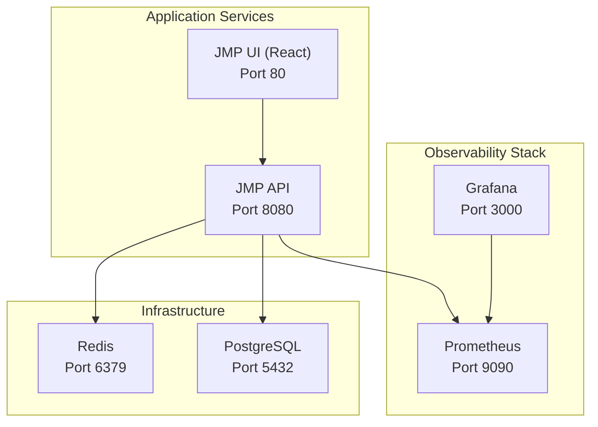
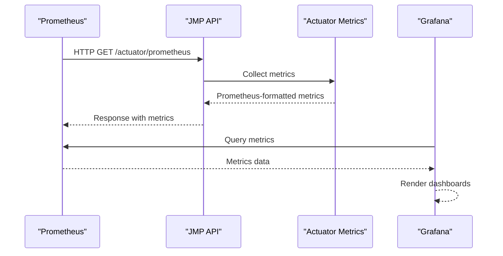
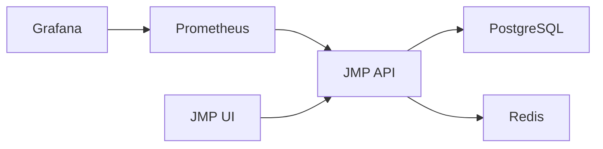

# Monitoring and Observability

<cite>
**Referenced Files in This Document**
- [docker-compose.yml](file://docker-compose.yml)
- [Dockerfile](file://Dockerfile)
- [application.yml](file://jmp-web/src/main/resources/application.yml)
- [prometheus.yml](file://monitoring/prometheus.yml)
- [datasources.yml](file://monitoring/grafana/datasources/datasources.yml)
- [AnalyticsController.java](file://jmp-api/src/main/java/com/jmp/api/controller/AnalyticsController.java)
- [AnalyticsService.java](file://jmp-application/src/main/java/com/jmp/application/service/AnalyticsService.java)
- [WebSocketConfig.java](file://jmp-infrastructure/src/main/java/com/jmp/infrastructure/websocket/WebSocketConfig.java)
- [RealtimeEventService.java](file://jmp-infrastructure/src/main/java/com/jmp/infrastructure/websocket/RealtimeEventService.java)
- [AuditLog.java](file://jmp-domain/src/main/java/com/jmp/domain/entity/AuditLog.java)
- [AuditService.java](file://jmp-application/src/main/java/com/jmp/application/service/AuditService.java)
- [pom.xml (jmp-web)](file://jmp-web/pom.xml)
- [pom.xml (jmp-api)](file://jmp-api/pom.xml)
</cite>

## Table of Contents
1. [Introduction](#introduction)
2. [Project Structure](#project-structure)
3. [Core Components](#core-components)
4. [Architecture Overview](#architecture-overview)
5. [Detailed Component Analysis](#detailed-component-analysis)
6. [Dependency Analysis](#dependency-analysis)
7. [Performance Considerations](#performance-considerations)
8. [Troubleshooting Guide](#troubleshooting-guide)
9. [Conclusion](#conclusion)
10. [Appendices](#appendices)

## Introduction
This document provides comprehensive monitoring and observability guidance for the Jitsi Management Platform (JMP). It covers Prometheus metrics configuration, custom metric collection, health check endpoints, Grafana dashboard setup, visualization and alerting configurations, application metrics (request latency, error rates, database performance, WebSocket connections), infrastructure monitoring for Docker containers, PostgreSQL, and Redis, logging strategies, log aggregation, troubleshooting approaches, distributed tracing, performance monitoring, capacity planning, alerting configurations, notification channels, incident response procedures, and environment-specific setup and scaling recommendations.

## Project Structure
The monitoring stack integrates Prometheus and Grafana orchestrated via Docker Compose, with the backend application exposing Spring Boot Actuator metrics. The frontend runs separately and communicates with the backend API. Infrastructure services include PostgreSQL and Redis, both with health checks configured.

**Diagram sources**
- [docker-compose.yml:1-129](file://docker-compose.yml#L1-L129)
- [prometheus.yml:1-23](file://monitoring/prometheus.yml#L1-L23)
- [datasources.yml:1-11](file://monitoring/grafana/datasources/datasources.yml#L1-L11)

**Section sources**
- [docker-compose.yml:1-129](file://docker-compose.yml#L1-L129)
- [prometheus.yml:1-23](file://monitoring/prometheus.yml#L1-L23)
- [datasources.yml:1-11](file://monitoring/grafana/datasources/datasources.yml#L1-L11)

## Core Components
- Prometheus scraping configuration targets the backend application’s Actuator metrics endpoint.
- Grafana is provisioned with a Prometheus data source pointing to the local Prometheus instance.
- The backend application exposes health, info, metrics, and Prometheus endpoints via Spring Boot Actuator.
- Docker Compose orchestrates services with health checks for readiness and liveness.
- Real-time event delivery uses WebSocket endpoints for live updates.

Key observability capabilities present in the codebase:
- Actuator metrics and health endpoints exposed by the backend.
- Prometheus metrics export enabled.
- Health checks defined at container and application levels.
- WebSocket configuration for real-time notifications.
- Audit logging model capturing processing time and success indicators.

**Section sources**
- [application.yml:92-112](file://jmp-web/src/main/resources/application.yml#L92-L112)
- [prometheus.yml:18-22](file://monitoring/prometheus.yml#L18-L22)
- [docker-compose.yml:66-71](file://docker-compose.yml#L66-L71)
- [Dockerfile:47-50](file://Dockerfile#L47-L50)
- [WebSocketConfig.java:23-50](file://jmp-infrastructure/src/main/java/com/jmp/infrastructure/websocket/WebSocketConfig.java#L23-L50)
- [AuditLog.java:90-96](file://jmp-domain/src/main/java/com/jmp/domain/entity/AuditLog.java#L90-L96)

## Architecture Overview
The monitoring architecture integrates the following flows:
- Prometheus scrapes the backend application’s Actuator Prometheus endpoint.
- Grafana queries Prometheus for visualizations and dashboards.
- Docker Compose manages service lifecycles and health checks.
- Backend application emits metrics and exposes health endpoints.
- Real-time WebSocket endpoints deliver live updates to clients.

**Diagram sources**
- [prometheus.yml:18-22](file://monitoring/prometheus.yml#L18-L22)
- [application.yml:92-112](file://jmp-web/src/main/resources/application.yml#L92-L112)

**Section sources**
- [prometheus.yml:1-23](file://monitoring/prometheus.yml#L1-L23)
- [application.yml:92-112](file://jmp-web/src/main/resources/application.yml#L92-L112)

## Detailed Component Analysis

### Prometheus Metrics Configuration
- Scrape interval and evaluation interval are set globally.
- Two jobs are defined: Prometheus server itself and the backend API.
- The API job targets the Actuator Prometheus endpoint with a short scrape interval for higher resolution metrics.

Recommendations:
- Add rule files for alerting and define alert thresholds.
- Configure retention and remote write for long-term storage if needed.
- Consider adding additional exporters for infrastructure metrics (e.g., node_exporter for host-level metrics).

**Section sources**
- [prometheus.yml:1-23](file://monitoring/prometheus.yml#L1-L23)

### Grafana Dashboard Setup
- Grafana is provisioned with a Prometheus data source named “Prometheus”.
- Dashboards are mounted from a provisioning directory; add JSON dashboards to visualize application metrics.

Recommendations:
- Provision dashboards for JVM metrics, HTTP request metrics, database performance, and WebSocket traffic.
- Use variable-driven panels for multi-tenant dashboards.
- Store dashboards in version control alongside the monitoring configuration.

**Section sources**
- [datasources.yml:1-11](file://monitoring/grafana/datasources/datasources.yml#L1-L11)
- [docker-compose.yml:103-118](file://docker-compose.yml#L103-L118)

### Health Check Endpoints
- Backend exposes Actuator health and readiness probes.
- Container health checks use HTTP GET against the health endpoint.
- Application-level health probes are enabled via Actuator configuration.

Recommendations:
- Define custom health indicators for database and Redis connectivity.
- Use readiness probes to gate traffic until dependent services are healthy.

**Section sources**
- [application.yml:92-112](file://jmp-web/src/main/resources/application.yml#L92-L112)
- [docker-compose.yml:66-71](file://docker-compose.yml#L66-L71)
- [Dockerfile:47-50](file://Dockerfile#L47-L50)

### Application Metrics: Request Latency and Error Rates
- Actuator Prometheus export is enabled; metrics include HTTP client/server requests, JVM memory, garbage collection, and thread pools.
- Use Grafana panels to visualize request rate, latency distributions (histograms/summaries), and error ratios per endpoint.

Recommendations:
- Add custom metrics for domain-specific operations (e.g., conference creation, recording processing).
- Instrument asynchronous tasks and scheduled jobs.
- Track p95/p99 latencies and error budgets.

**Section sources**
- [application.yml:92-112](file://jmp-web/src/main/resources/application.yml#L92-L112)
- [pom.xml (jmp-web):33-34](file://jmp-web/pom.xml#L33-L34)

### Database Performance Metrics
- PostgreSQL is managed as a Docker service with health checks.
- Application connects to PostgreSQL via HikariCP with tunable pool sizes and timeouts.
- Monitor database metrics via Grafana dashboards for connections, query durations, and queue lengths.

Recommendations:
- Add pg_stat_statements or similar extensions for SQL-level insights.
- Track slow queries and lock waits.
- Use Grafana dashboards for pool utilization and connection failures.

**Section sources**
- [docker-compose.yml:8-26](file://docker-compose.yml#L8-L26)
- [application.yml:12-22](file://jmp-web/src/main/resources/application.yml#L12-L22)

### Redis Cache Metrics
- Redis is managed as a Docker service with health checks.
- Application uses Lettuce client with configurable pool sizes and timeouts.
- Monitor cache hit ratio, evictions, and latency.

Recommendations:
- Expose Redis metrics via Redis INFO or exporter-based solutions.
- Track key expiration and memory fragmentation.

**Section sources**
- [docker-compose.yml:27-42](file://docker-compose.yml#L27-L42)
- [application.yml:46-56](file://jmp-web/src/main/resources/application.yml#L46-L56)

### WebSocket Connection Statistics
- WebSocket endpoints are registered for STOMP over SockJS and native WebSocket.
- Real-time event service supports tenant-scoped and user-scoped destinations.
- Track active sessions, message throughput, and error rates.

Recommendations:
- Export WebSocket metrics via Micrometer or custom counters.
- Visualize concurrent connections and message rates in Grafana.

**Section sources**
- [WebSocketConfig.java:23-50](file://jmp-infrastructure/src/main/java/com/jmp/infrastructure/websocket/WebSocketConfig.java#L23-L50)
- [RealtimeEventService.java:17-101](file://jmp-infrastructure/src/main/java/com/jmp/infrastructure/websocket/RealtimeEventService.java#L17-L101)

### Logging Strategies and Aggregation
- Structured logging is enabled in JSON format.
- Console logging includes trace identifiers for correlation.
- Logging levels are configured for the application and Spring Security.

Recommendations:
- Integrate with a centralized logging solution (e.g., ELK or Loki).
- Ship logs to a collector and index by trace_id for distributed tracing correlation.
- Set up log retention and archival policies.

**Section sources**
- [application.yml:80-91](file://jmp-web/src/main/resources/application.yml#L80-L91)

### Distributed Tracing
- Trace identifiers are included in log patterns.
- No explicit tracing instrumentation is present in the codebase.

Recommendations:
- Add OpenTelemetry or Micrometer Tracing to capture spans across services.
- Correlate logs with traces using trace_id.
- Visualize traces in Jaeger or Tempo.

**Section sources**
- [application.yml:86-88](file://jmp-web/src/main/resources/application.yml#L86-L88)

### Capacity Planning
- HikariCP pool sizing and timeouts are configured for database connections.
- Redis Lettuce pool sizing is configured for cache operations.
- Consider load testing to derive target concurrency and resource limits.

Recommendations:
- Baseline CPU, memory, and network usage under expected load.
- Scale horizontally by adding replicas and sharding tenants.
- Monitor saturation metrics (pool utilization, queue lengths).

**Section sources**
- [application.yml:17-22](file://jmp-web/src/main/resources/application.yml#L17-L22)
- [application.yml:52-56](file://jmp-web/src/main/resources/application.yml#L52-L56)

### Alerting Rules and Notification Channels
- Alerting configuration is currently empty; define rule files and alertmanagers.
- Notification channels can be integrated via Alertmanager and Grafana.

Recommendations:
- Define SLOs and error budgets.
- Alert on latency SLO breaches, error rate spikes, and saturation (CPU, memory, DB pool, Redis pool).
- Use Slack, PagerDuty, or email integrations via Alertmanager.

**Section sources**
- [prometheus.yml:8-11](file://monitoring/prometheus.yml#L8-L11)

### Analytics and System Health Metrics
- An AnalyticsController exposes a system health metrics endpoint.
- AnalyticsService defines data transfer objects for system health and other analytics.

Recommendations:
- Populate system health metrics with actual measurements from Actuator and infrastructure.
- Expose custom metrics for participant counts, conference durations, and storage usage.

**Section sources**
- [AnalyticsController.java:82-87](file://jmp-api/src/main/java/com/jmp/api/controller/AnalyticsController.java#L82-L87)
- [AnalyticsService.java:228-234](file://jmp-application/src/main/java/com/jmp/application/service/AnalyticsService.java#L228-L234)

### Audit Logging and Operational Insights
- AuditLog captures processing time and success flags for operational visibility.
- AuditService provides methods to log events across domains.

Recommendations:
- Enrich audit logs with tenant and user context.
- Use audit data to drive anomaly detection and compliance reporting.

**Section sources**
- [AuditLog.java:90-96](file://jmp-domain/src/main/java/com/jmp/domain/entity/AuditLog.java#L90-L96)
- [AuditService.java:116-176](file://jmp-application/src/main/java/com/jmp/application/service/AuditService.java#L116-L176)

## Dependency Analysis
The monitoring stack depends on:
- Prometheus for metrics collection and storage.
- Grafana for visualization and dashboard provisioning.
- Backend application for exporting metrics and health status.
- Infrastructure services for database and cache connectivity.

**Diagram sources**
- [docker-compose.yml:1-129](file://docker-compose.yml#L1-L129)
- [prometheus.yml:1-23](file://monitoring/prometheus.yml#L1-L23)
- [datasources.yml:1-11](file://monitoring/grafana/datasources/datasources.yml#L1-L11)

**Section sources**
- [docker-compose.yml:1-129](file://docker-compose.yml#L1-L129)
- [prometheus.yml:1-23](file://monitoring/prometheus.yml#L1-L23)
- [datasources.yml:1-11](file://monitoring/grafana/datasources/datasources.yml#L1-L11)

## Performance Considerations
- Adjust scrape intervals and global evaluation intervals to balance fidelity and resource usage.
- Tune HikariCP and Lettuce pools according to observed concurrency and latency.
- Use Grafana panels to monitor saturation and identify bottlenecks.
- Consider caching frequently accessed analytics data to reduce database load.

[No sources needed since this section provides general guidance]

## Troubleshooting Guide
Common issues and resolutions:
- Prometheus cannot scrape metrics:
  - Verify the Actuator Prometheus endpoint is exposed and reachable.
  - Confirm the API job target and metrics path in Prometheus configuration.
- Grafana cannot connect to Prometheus:
  - Ensure the data source URL points to the Prometheus service and port.
  - Confirm Grafana provisioning mounts are correct.
- Application health checks failing:
  - Check container health checks and application-level health probes.
  - Review startup logs and dependency readiness (PostgreSQL and Redis).
- WebSocket events not delivered:
  - Validate WebSocket endpoint registration and client connectivity.
  - Inspect real-time event service logs for exceptions.

**Section sources**
- [prometheus.yml:18-22](file://monitoring/prometheus.yml#L18-L22)
- [datasources.yml:8-9](file://monitoring/grafana/datasources/datasources.yml#L8-L9)
- [docker-compose.yml:66-71](file://docker-compose.yml#L66-L71)
- [Dockerfile:47-50](file://Dockerfile#L47-L50)
- [WebSocketConfig.java:42-50](file://jmp-infrastructure/src/main/java/com/jmp/infrastructure/websocket/WebSocketConfig.java#L42-L50)
- [RealtimeEventService.java:88-101](file://jmp-infrastructure/src/main/java/com/jmp/infrastructure/websocket/RealtimeEventService.java#L88-L101)

## Conclusion
The Jitsi Management Platform includes a solid foundation for observability with Actuator metrics, Prometheus scraping, Grafana dashboards, and health checks. To achieve comprehensive monitoring, augment the current setup with alerting rules, distributed tracing, detailed infrastructure metrics, and enriched analytics endpoints. Apply capacity planning and scaling strategies aligned with observed performance trends.

[No sources needed since this section summarizes without analyzing specific files]

## Appendices

### Environment Setup and Scaling
- Local development:
  - Use Docker Compose to spin up all services with health checks.
  - Access Grafana at Port 3000 and Prometheus at Port 9090.
- Staging/Production:
  - Deploy Prometheus and Grafana behind a reverse proxy with authentication.
  - Scale the backend API horizontally and add Redis for pub/sub in production.
  - Configure persistent storage for Prometheus and Grafana.

**Section sources**
- [docker-compose.yml:1-129](file://docker-compose.yml#L1-L129)
- [prometheus.yml:1-23](file://monitoring/prometheus.yml#L1-L23)
- [datasources.yml:1-11](file://monitoring/grafana/datasources/datasources.yml#L1-L11)

### Example Metrics to Track
- HTTP request rate, latency, and error ratios by endpoint and tenant.
- Database pool utilization and connection failures.
- Redis hit ratio and eviction rates.
- WebSocket session counts and message throughput.
- JVM GC pauses and heap usage.
- Audit event processing time and success rates.

[No sources needed since this section provides general guidance]