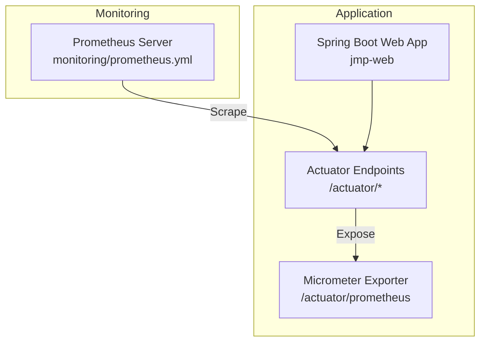
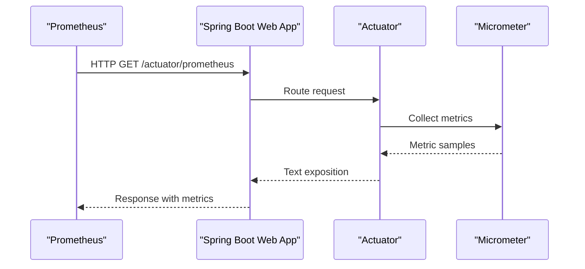
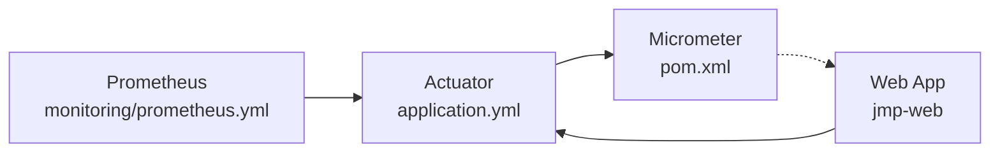

# Prometheus Metrics Configuration

<cite>
**Referenced Files in This Document**
- [prometheus.yml](file://monitoring/prometheus.yml)
- [application.yml](file://jmp-web/src/main/resources/application.yml)
- [pom.xml](file://jmp-web/pom.xml)
- [pom.xml](file://pom.xml)
- [WebSocketConfig.java](file://jmp-infrastructure/src/main/java/com/jmp/infrastructure/websocket/WebSocketConfig.java)
- [RealtimeEventService.java](file://jmp-infrastructure/src/main/java/com/jmp/infrastructure/websocket/RealtimeEventService.java)
- [JwtAuthenticationFilter.java](file://jmp-infrastructure/src/main/java/com/jmp/infrastructure/security/JwtAuthenticationFilter.java)
- [AnalyticsService.java](file://jmp-application/src/main/java/com/jmp/application/service/AnalyticsService.java)
</cite>

## Table of Contents
1. [Introduction](#introduction)
2. [Project Structure](#project-structure)
3. [Core Components](#core-components)
4. [Architecture Overview](#architecture-overview)
5. [Detailed Component Analysis](#detailed-component-analysis)
6. [Dependency Analysis](#dependency-analysis)
7. [Performance Considerations](#performance-considerations)
8. [Troubleshooting Guide](#troubleshooting-guide)
9. [Conclusion](#conclusion)

## Introduction
This document describes Prometheus metrics configuration for the Jitsi Management Platform (JMP). It explains the Prometheus configuration file structure, scrape jobs, and target endpoints. It also documents Spring Boot Actuator metrics exposure, Micrometer integration, and how to register custom metrics. Application-specific metrics covered include HTTP request metrics, database connection pool metrics, WebSocket connection statistics, and business metrics. Guidance is provided on metric naming conventions, labels, cardinality management, filtering, and production best practices for scraping intervals and timeouts.

## Project Structure
The monitoring stack consists of:
- A Prometheus configuration file defining global defaults and scrape jobs.
- A Spring Boot web application exposing Micrometer metrics via Spring Boot Actuator.
- Supporting infrastructure modules for WebSocket real-time events and JWT-based authentication.

**Diagram sources**
- [prometheus.yml:1-23](file://monitoring/prometheus.yml#L1-L23)
- [application.yml:92-112](file://jmp-web/src/main/resources/application.yml#L92-L112)
- [pom.xml:33-34](file://jmp-web/pom.xml#L33-L34)

**Section sources**
- [prometheus.yml:1-23](file://monitoring/prometheus.yml#L1-L23)
- [application.yml:92-112](file://jmp-web/src/main/resources/application.yml#L92-L112)
- [pom.xml:33-34](file://jmp-web/pom.xml#L33-L34)

## Core Components
- Prometheus configuration defines global scrape interval, evaluation interval, and a scrape job for the application’s Actuator Prometheus endpoint.
- Spring Boot Actuator exposes health, info, metrics, and Prometheus endpoints. Micrometer is enabled and tagged with application metadata.
- The application runs as a Spring Boot web app packaged as a JAR and launched via the Spring Boot Maven plugin.

Key configuration highlights:
- Prometheus scrape job “jmp-api” targets the Actuator Prometheus endpoint with a short scrape interval suitable for frequent metrics collection.
- Actuator exposes metrics and Prometheus exporter; application-level tags are applied globally.

**Section sources**
- [prometheus.yml:4-22](file://monitoring/prometheus.yml#L4-L22)
- [application.yml:92-112](file://jmp-web/src/main/resources/application.yml#L92-L112)
- [pom.xml:33-34](file://jmp-web/pom.xml#L33-L34)

## Architecture Overview
The metrics pipeline integrates Prometheus, Spring Boot Actuator, and Micrometer as follows:

**Diagram sources**
- [prometheus.yml:18-22](file://monitoring/prometheus.yml#L18-L22)
- [application.yml:92-112](file://jmp-web/src/main/resources/application.yml#L92-L112)

## Detailed Component Analysis

### Prometheus Configuration
- Global scrape and evaluation intervals are configured centrally.
- Two jobs are defined:
  - Prometheus server self-monitoring.
  - Application metrics scrape job targeting the Actuator Prometheus endpoint.

Operational notes:
- The application scrape job uses a short interval to capture rapid changes in HTTP metrics and JVM statistics.
- The metrics path is explicitly set to the Actuator Prometheus endpoint.

**Section sources**
- [prometheus.yml:4-22](file://monitoring/prometheus.yml#L4-L22)

### Spring Boot Actuator and Micrometer Integration
- Actuator endpoints are exposed under a base path and include Prometheus.
- Micrometer export to Prometheus is enabled and tagged with application metadata.
- The application name tag is applied globally to all exported metrics.

Implementation anchors:
- Actuator endpoint exposure and base path.
- Prometheus exporter enablement and global tags.

**Section sources**
- [application.yml:92-112](file://jmp-web/src/main/resources/application.yml#L92-L112)

### Micrometer Dependencies and Versioning
- Parent POM defines Micrometer version property for consistent dependency management across modules.
- The web module includes the Actuator starter, which pulls Micrometer automatically.

**Section sources**
- [pom.xml](file://pom.xml#L66)
- [pom.xml:33-34](file://jmp-web/pom.xml#L33-L34)

### HTTP Request Metrics
- Spring MVC auto-config captures HTTP client and server metrics when Actuator and Micrometer are present.
- Typical metrics include request count, request duration, and status code distributions.
- These are exported via the Prometheus endpoint and scraped by Prometheus.

Best practices:
- Keep label cardinality low (avoid per-request dynamic labels).
- Use consistent route and method labels for grouping.

[No sources needed since this section provides general guidance]

### Database Connection Pool Metrics
- HikariCP metrics are exposed by Micrometer when the application uses HikariCP.
- Relevant metrics include pool size, active connections, idle connections, and acquisition/wait times.
- Configure pool sizing and timeouts in application configuration to influence metrics.

Operational anchors:
- HikariCP pool settings in application configuration.

**Section sources**
- [application.yml:17-22](file://jmp-web/src/main/resources/application.yml#L17-L22)

### WebSocket Connection Statistics
- The WebSocket configuration enables STOMP over WebSocket and SockJS fallback.
- Real-time event delivery is handled by a service that sends messages to tenants and users.
- While WebSocket connection counts and traffic are not explicitly instrumented, they can be derived from Micrometer’s web socket metrics if enabled.

Operational anchors:
- WebSocket broker configuration and endpoint registration.
- Event dispatch service.

**Section sources**
- [WebSocketConfig.java:32-55](file://jmp-infrastructure/src/main/java/com/jmp/infrastructure/websocket/WebSocketConfig.java#L32-L55)
- [RealtimeEventService.java:25-39](file://jmp-infrastructure/src/main/java/com/jmp/infrastructure/websocket/RealtimeEventService.java#L25-L39)

### Business Metrics
- The analytics service computes dashboard and usage metrics for tenants.
- Current implementation returns placeholder values; these can be backed by repository queries and turned into Prometheus metrics using custom registries.

Recommendations:
- Expose counters and gauges for key business KPIs (e.g., active conferences, total participants, storage usage).
- Apply consistent labels (e.g., tenant_id) and avoid high-cardinality labels.

**Section sources**
- [AnalyticsService.java:35-65](file://jmp-application/src/main/java/com/jmp/application/service/AnalyticsService.java#L35-L65)
- [AnalyticsService.java:67-92](file://jmp-application/src/main/java/com/jmp/application/service/AnalyticsService.java#L67-L92)
- [AnalyticsService.java:94-131](file://jmp-application/src/main/java/com/jmp/application/service/AnalyticsService.java#L94-L131)

### Authentication and Authorization Impact on Metrics
- JWT authentication filter validates tokens and sets authentication context.
- Metrics collected by Actuator include HTTP request metrics that reflect authenticated and unauthorized requests.

Operational anchors:
- Authentication filter behavior and excluded paths.

**Section sources**
- [JwtAuthenticationFilter.java:39-94](file://jmp-infrastructure/src/main/java/com/jmp/infrastructure/security/JwtAuthenticationFilter.java#L39-L94)

### Custom Metric Registration and Filtering
- Use Micrometer’s MeterRegistry to register custom metrics (counters, timers, gauges).
- Apply global or specific filters to exclude noisy metrics (e.g., static asset requests).
- Tag metrics consistently with application metadata and tenant identifiers.

Guidance anchors:
- Actuator and Micrometer enablement.
- Global tags applied to metrics.

**Section sources**
- [application.yml:92-112](file://jmp-web/src/main/resources/application.yml#L92-L112)

## Dependency Analysis
The following diagram shows how Prometheus, Actuator, and Micrometer relate in the application:

**Diagram sources**
- [prometheus.yml:18-22](file://monitoring/prometheus.yml#L18-L22)
- [application.yml:92-112](file://jmp-web/src/main/resources/application.yml#L92-L112)
- [pom.xml:33-34](file://jmp-web/pom.xml#L33-L34)
- [pom.xml](file://pom.xml#L66)

**Section sources**
- [prometheus.yml:18-22](file://monitoring/prometheus.yml#L18-L22)
- [application.yml:92-112](file://jmp-web/src/main/resources/application.yml#L92-L112)
- [pom.xml:33-34](file://jmp-web/pom.xml#L33-L34)
- [pom.xml](file://pom.xml#L66)

## Performance Considerations
- Scrape interval tuning:
  - Short intervals (e.g., 5s) increase scrape load but improve resolution for HTTP and JVM metrics.
  - Evaluate whether such short intervals are necessary for all metrics; consider longer intervals for less volatile metrics.
- Timeout configuration:
  - Set scrape timeouts to accommodate longer-running requests without causing scrape failures.
- Cardinality management:
  - Avoid high-cardinality labels (e.g., per-user or per-session identifiers).
  - Prefer bucketed or aggregated labels (e.g., tenant_id).
- Filtering:
  - Exclude static assets and health endpoints from expensive aggregations when appropriate.
- Database pool sizing:
  - Align HikariCP pool settings with workload to prevent connection exhaustion and reduce pool-related metrics variance.

[No sources needed since this section provides general guidance]

## Troubleshooting Guide
Common issues and resolutions:
- Prometheus cannot reach the Actuator endpoint:
  - Verify the metrics path and target host/port in the scrape job.
  - Confirm Actuator exposure and base path configuration.
- No metrics exported:
  - Ensure Micrometer Prometheus exporter is enabled and Actuator endpoints are included.
  - Check application logs for startup errors related to Actuator or Micrometer.
- High cardinality warnings:
  - Review labels applied to metrics; remove or bucketize high-cardinality attributes.
- Authentication affecting metrics:
  - Confirm that excluded paths (e.g., health, Swagger) are not being scraped for metrics unnecessarily.

**Section sources**
- [prometheus.yml:18-22](file://monitoring/prometheus.yml#L18-L22)
- [application.yml:92-112](file://jmp-web/src/main/resources/application.yml#L92-L112)

## Conclusion
The Jitsi Management Platform integrates Prometheus monitoring through Spring Boot Actuator and Micrometer. The provided configuration exposes JVM and HTTP metrics and allows extending the system with custom business metrics. Production deployments should tune scrape intervals and timeouts, manage label cardinality, and apply targeted filtering to maintain efficient and scalable monitoring.