# Architecture Overview

<cite>
**Referenced Files in This Document**
- [pom.xml](file://pom.xml)
- [jmp-web/pom.xml](file://jmp-web/pom.xml)
- [jmp-api/pom.xml](file://jmp-api/pom.xml)
- [jmp-application/pom.xml](file://jmp-application/pom.xml)
- [jmp-domain/pom.xml](file://jmp-domain/pom.xml)
- [jmp-infrastructure/pom.xml](file://jmp-infrastructure/pom.xml)
- [JmpApplication.java](file://jmp-web/src/main/java/com/jmp/web/JmpApplication.java)
- [UserController.java](file://jmp-api/src/main/java/com/jmp/api/controller/UserController.java)
- [ConferenceService.java](file://jmp-application/src/main/java/com/jmp/application/service/ConferenceService.java)
- [Conference.java](file://jmp-domain/src/main/java/com/jmp/domain/entity/Conference.java)
- [ConferenceDto.java](file://jmp-application/src/main/java/com/jmp/application/dto/ConferenceDto.java)
- [JitsiWebhookController.java](file://jmp-api/src/main/java/com/jmp/api/controller/JitsiWebhookController.java)
- [UserService.java](file://jmp-application/src/main/java/com/jmp/application/service/UserService.java)
- [UserRepository.java](file://jmp-domain/src/main/java/com/jmp/domain/repository/UserRepository.java)
- [User.java](file://jmp-domain/src/main/java/com/jmp/domain/entity/User.java)
- [Tenant.java](file://jmp-domain/src/main/java/com/jmp/domain/entity/Tenant.java)
- [Role.java](file://jmp-domain/src/main/java/com/jmp/domain/entity/Role.java)
- [UserMapper.java](file://jmp-application/src/main/java/com/jmp/application/mapper/UserMapper.java)
- [UserDto.java](file://jmp-application/src/main/java/com/jmp/application/dto/UserDto.java)
- [SecurityConfig.java](file://jmp-infrastructure/src/main/java/com/jmp/infrastructure/security/SecurityConfig.java)
- [JwtAuthenticationFilter.java](file://jmp-infrastructure/src/main/java/com/jmp/infrastructure/security/JwtAuthenticationFilter.java)
- [WebSocketConfig.java](file://jmp-infrastructure/src/main/java/com/jmp/infrastructure/websocket/WebSocketConfig.java)
- [RealtimeEventService.java](file://jmp-infrastructure/src/main/java/com/jmp/infrastructure/websocket/RealtimeEventService.java)
- [WebSocketAuthInterceptor.java](file://jmp-infrastructure/src/main/java/com/jmp/infrastructure/websocket/WebSocketAuthInterceptor.java)
- [S3StorageService.java](file://jmp-infrastructure/src/main/java/com/jmp/infrastructure/storage/S3StorageService.java)
</cite>

## Update Summary
**Changes Made**
- Updated project structure documentation to reflect the new multi-module Maven architecture
- Added comprehensive Jitsi integration documentation including webhook processing and conference management
- Enhanced service layer documentation with detailed ConferenceService operations
- Updated architecture diagrams to show the complete four-layer Clean Architecture implementation
- Added Jitsi-specific components and their integration points

## Table of Contents
1. [Introduction](#introduction)
2. [Project Structure](#project-structure)
3. [Core Components](#core-components)
4. [Architecture Overview](#architecture-overview)
5. [Detailed Component Analysis](#detailed-component-analysis)
6. [Jitsi Integration Architecture](#jitsi-integration-architecture)
7. [Dependency Analysis](#dependency-analysis)
8. [Performance Considerations](#performance-considerations)
9. [Troubleshooting Guide](#troubleshooting-guide)
10. [Conclusion](#conclusion)

## Introduction
This document presents the architectural blueprint of the Jitsi Management Platform (JMP), a Spring Boot-based system implementing Clean Architecture with Hexagonal principles. The platform has evolved from a single Spring Boot application to a sophisticated multi-module Maven architecture designed specifically for managing Jitsi video conferencing infrastructure.

The platform is organized into four layers following Clean Architecture principles:
- jmp-domain: Core business logic and entities with comprehensive Jitsi conference management
- jmp-application: Use cases, services, DTOs, and mappers with specialized conference orchestration
- jmp-infrastructure: Cross-cutting concerns (security, persistence, messaging, storage, Jitsi integration)
- jmp-api: Presentation layer (controllers, OpenAPI, exception handling, Jitsi webhook endpoints)
- jmp-web: Spring Boot application entry point and module packaging

The architecture enforces dependency inversion so that outer layers depend on abstractions defined in inner layers. It supports multi-tenancy, role-based access control, real-time communication via WebSockets, secure integrations with external systems such as AWS S3-compatible storage, and seamless integration with Jitsi's webhook ecosystem.

## Project Structure
The project is a Maven multi-module setup with six modules, representing a complete transformation from the previous single-application approach to a modular, scalable architecture:

- jmp-domain: Entities, repositories, and domain events with comprehensive Jitsi conference modeling
- jmp-application: Services, DTOs, mappers, and validators with specialized conference management operations
- jmp-infrastructure: Security, persistence, messaging, storage, and Jitsi integration components
- jmp-api: REST controllers, OpenAPI configuration, global exception handling, and Jitsi webhook endpoints
- jmp-web: Spring Boot application entry point and module packaging
- jmp-ui: Frontend React application for administrative interface

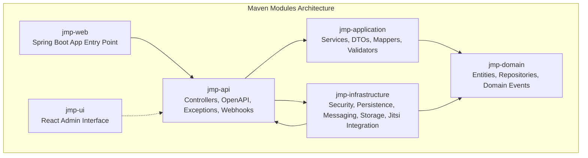

**Diagram sources**
- [pom.xml:40-46](file://pom.xml#L40-L46)
- [jmp-web/pom.xml:18-35](file://jmp-web/pom.xml#L18-L35)
- [jmp-api/pom.xml:17-29](file://jmp-api/pom.xml#L17-L29)
- [jmp-application/pom.xml:17-22](file://jmp-application/pom.xml#L17-L22)
- [jmp-infrastructure/pom.xml:17-28](file://jmp-infrastructure/pom.xml#L17-L28)

**Section sources**
- [pom.xml:40-46](file://pom.xml#L40-L46)
- [jmp-web/pom.xml:18-35](file://jmp-web/pom.xml#L18-L35)
- [jmp-api/pom.xml:17-29](file://jmp-api/pom.xml#L17-L29)
- [jmp-application/pom.xml:17-22](file://jmp-application/pom.xml#L17-L22)
- [jmp-infrastructure/pom.xml:17-28](file://jmp-infrastructure/pom.xml#L17-L28)

## Core Components
This section outlines the primary building blocks and their responsibilities across layers, with enhanced focus on Jitsi integration capabilities.

### Domain Layer (jmp-domain)
- **Entities**: Comprehensive Jitsi conference management with User, Tenant, Role, Permission, Conference, ConferenceParticipant, Recording, AuditLog, IdentityProvider
- **Repositories**: Typed repository interfaces for persistence operations with Jitsi-specific query methods
- **Responsibilities**: Define business rules, invariants, domain events, and Jitsi conference lifecycle management

### Application Layer (jmp-application)
- **Services**: Orchestrators of use cases including specialized ConferenceService for Jitsi conference lifecycle management
- **DTOs**: Transfer objects for API boundary with comprehensive Jitsi conference data structures
- **Mappers**: Structured mapping between entities and DTOs with Jitsi-specific transformations
- **Validators**: Input validation and cross-field constraints for conference management
- **Responsibilities**: Orchestrate domain logic, enforce application rules, coordinate infrastructure, manage Jitsi integrations

### Infrastructure Layer (jmp-infrastructure)
- **Security**: JWT filter chain, method security, password encoder, Jitsi webhook authentication
- **Persistence**: JPA/Hibernate configuration, Flyway migrations, Jitsi conference data persistence
- **Messaging**: WebSocket broker configuration and interceptors for real-time Jitsi event propagation
- **Storage**: S3-compatible storage abstraction and implementation for recording management
- **Jitsi Integration**: Webhook processing, conference synchronization, and external system coordination
- **Responsibilities**: Provide infrastructure capabilities behind abstractions, manage external integrations

### API Layer (jmp-api)
- **Controllers**: REST endpoints with Swagger/OpenAPI metadata, Jitsi webhook endpoints
- **Exception handling**: Global exception handler with Jitsi-specific error handling
- **Responsibilities**: Translate HTTP requests to application use cases, return standardized responses, process Jitsi webhooks

### Web Layer (jmp-web)
- **Application Entry Point**: Centralized Spring Boot application configuration
- **Module Packaging**: Coordinates all modules and provides deployment configuration

**Section sources**
- [Conference.java:23-217](file://jmp-domain/src/main/java/com/jmp/domain/entity/Conference.java#L23-L217)
- [ConferenceService.java:25-225](file://jmp-application/src/main/java/com/jmp/application/service/ConferenceService.java#L25-L225)
- [ConferenceDto.java:14-176](file://jmp-application/src/main/java/com/jmp/application/dto/ConferenceDto.java#L14-L176)
- [JitsiWebhookController.java:24-125](file://jmp-api/src/main/java/com/jmp/api/controller/JitsiWebhookController.java#L24-L125)
- [User.java:23-164](file://jmp-domain/src/main/java/com/jmp/domain/entity/User.java#L23-L164)
- [Tenant.java:24-174](file://jmp-domain/src/main/java/com/jmp/domain/entity/Tenant.java#L24-L174)
- [Role.java:22-131](file://jmp-domain/src/main/java/com/jmp/domain/entity/Role.java#L22-L131)
- [UserService.java:28-190](file://jmp-application/src/main/java/com/jmp/application/service/UserService.java#L28-L190)
- [UserDto.java:14-97](file://jmp-application/src/main/java/com/jmp/application/dto/UserDto.java#L14-L97)
- [UserMapper.java:18-76](file://jmp-application/src/main/java/com/jmp/application/mapper/UserMapper.java#L18-L76)
- [UserController.java:33-123](file://jmp-api/src/main/java/com/jmp/api/controller/UserController.java#L33-L123)
- [SecurityConfig.java:28-90](file://jmp-infrastructure/src/main/java/com/jmp/infrastructure/security/SecurityConfig.java#L28-L90)
- [WebSocketConfig.java:23-70](file://jmp-infrastructure/src/main/java/com/jmp/infrastructure/websocket/WebSocketConfig.java#L23-L70)
- [S3StorageService.java:24-129](file://jmp-infrastructure/src/main/java/com/jmp/infrastructure/storage/S3StorageService.java#L24-L129)

## Architecture Overview
The system follows Clean Architecture with dependency inversion and enhanced Jitsi integration:
- Outer layers (API, Infrastructure) depend on abstractions defined in inner layers (Application, Domain)
- Domain defines pure business logic and entities with comprehensive Jitsi conference management
- Application orchestrates use cases and DTOs with specialized conference services
- Infrastructure provides cross-cutting capabilities and external integrations including Jitsi webhook processing

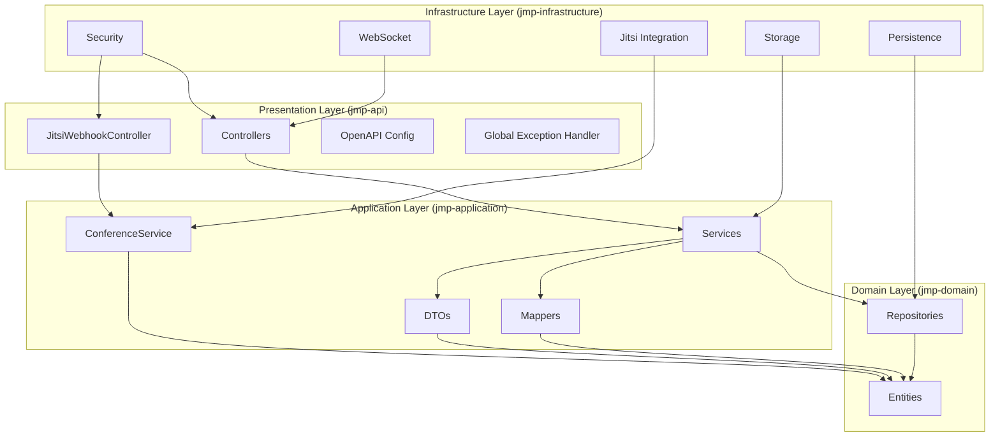

**Diagram sources**
- [JitsiWebhookController.java:24-125](file://jmp-api/src/main/java/com/jmp/api/controller/JitsiWebhookController.java#L24-L125)
- [ConferenceService.java:25-225](file://jmp-application/src/main/java/com/jmp/application/service/ConferenceService.java#L25-L225)
- [UserController.java:33-123](file://jmp-api/src/main/java/com/jmp/api/controller/UserController.java#L33-L123)
- [UserService.java:28-190](file://jmp-application/src/main/java/com/jmp/application/service/UserService.java#L28-L190)
- [UserDto.java:14-97](file://jmp-application/src/main/java/com/jmp/application/dto/UserDto.java#L14-L97)
- [UserMapper.java:18-76](file://jmp-application/src/main/java/com/jmp/application/mapper/UserMapper.java#L18-L76)
- [UserRepository.java:18-82](file://jmp-domain/src/main/java/com/jmp/domain/repository/UserRepository.java#L18-L82)
- [Conference.java:23-217](file://jmp-domain/src/main/java/com/jmp/domain/entity/Conference.java#L23-L217)
- [SecurityConfig.java:28-90](file://jmp-infrastructure/src/main/java/com/jmp/infrastructure/security/SecurityConfig.java#L28-L90)
- [WebSocketConfig.java:23-70](file://jmp-infrastructure/src/main/java/com/jmp/infrastructure/websocket/WebSocketConfig.java#L23-L70)
- [S3StorageService.java:24-129](file://jmp-infrastructure/src/main/java/com/jmp/infrastructure/storage/S3StorageService.java#L24-L129)

## Detailed Component Analysis

### Layer Responsibilities and Dependencies
- **jmp-domain**: Defines entities and repositories with comprehensive Jitsi conference management; no awareness of application or infrastructure concerns
- **jmp-application**: Uses domain entities and repositories, exposes services and DTOs to presentation, applies mapping and validation, orchestrates Jitsi conference lifecycle
- **jmp-infrastructure**: Implements security, persistence, messaging, storage, and Jitsi integration, provides adapters for external systems
- **jmp-api**: Exposes REST endpoints and Jitsi webhook endpoints, enforces authorization and delegates to application services
- **jmp-web**: Provides centralized application entry point and coordinates module dependencies

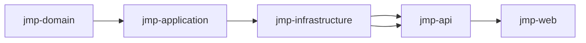

**Diagram sources**
- [pom.xml:40-46](file://pom.xml#L40-L46)
- [jmp-web/pom.xml:18-35](file://jmp-web/pom.xml#L18-L35)
- [jmp-api/pom.xml:17-29](file://jmp-api/pom.xml#L17-L29)
- [jmp-application/pom.xml:17-22](file://jmp-application/pom.xml#L17-L22)
- [jmp-infrastructure/pom.xml:17-28](file://jmp-infrastructure/pom.xml#L17-L28)

**Section sources**
- [pom.xml:40-46](file://pom.xml#L40-L46)
- [jmp-web/pom.xml:18-35](file://jmp-web/pom.xml#L18-L35)
- [jmp-api/pom.xml:17-29](file://jmp-api/pom.xml#L17-L29)
- [jmp-application/pom.xml:17-22](file://jmp-application/pom.xml#L17-L22)
- [jmp-infrastructure/pom.xml:17-28](file://jmp-infrastructure/pom.xml#L17-L28)

### User Management Workflow (Controller → Service → Repository)
This sequence illustrates the canonical request flow for user creation, highlighting dependency inversion and layered responsibilities.

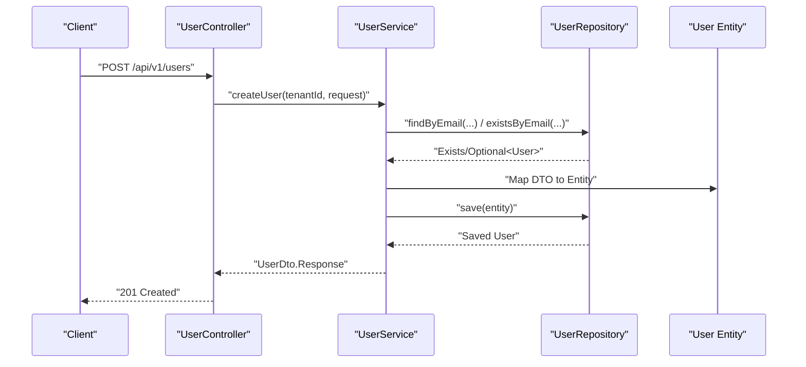

**Diagram sources**
- [UserController.java:46-55](file://jmp-api/src/main/java/com/jmp/api/controller/UserController.java#L46-L55)
- [UserService.java:44-70](file://jmp-application/src/main/java/com/jmp/application/service/UserService.java#L44-L70)
- [UserRepository.java:24-31](file://jmp-domain/src/main/java/com/jmp/domain/repository/UserRepository.java#L24-L31)
- [UserMapper.java:46-46](file://jmp-application/src/main/java/com/jmp/application/mapper/UserMapper.java#L46-L46)

**Section sources**
- [UserController.java:46-55](file://jmp-api/src/main/java/com/jmp/api/controller/UserController.java#L46-L55)
- [UserService.java:44-70](file://jmp-application/src/main/java/com/jmp/application/service/UserService.java#L44-L70)
- [UserRepository.java:24-31](file://jmp-domain/src/main/java/com/jmp/domain/repository/UserRepository.java#L24-L31)
- [UserMapper.java:46-46](file://jmp-application/src/main/java/com/jmp/application/mapper/UserMapper.java#L46-L46)

### Security Architecture (JWT and Method Security)
The security layer enforces stateless authentication, method-level authorization, and CORS configuration.

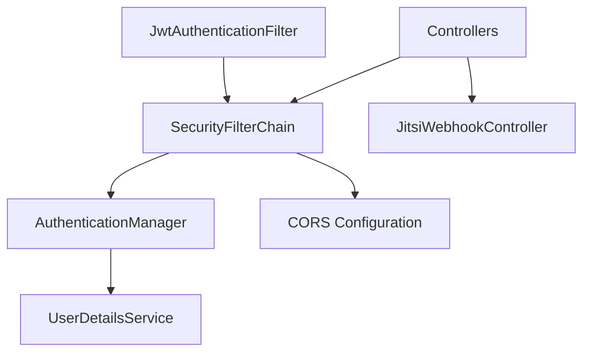

**Diagram sources**
- [SecurityConfig.java:42-61](file://jmp-infrastructure/src/main/java/com/jmp/infrastructure/security/SecurityConfig.java#L42-L61)
- [JwtAuthenticationFilter.java](file://jmp-infrastructure/src/main/java/com/jmp/infrastructure/security/JwtAuthenticationFilter.java)
- [UserController.java:44-58](file://jmp-api/src/main/java/com/jmp/api/controller/UserController.java#L44-L58)
- [JitsiWebhookController.java:34-52](file://jmp-api/src/main/java/com/jmp/api/controller/JitsiWebhookController.java#L34-L52)

**Section sources**
- [SecurityConfig.java:42-61](file://jmp-infrastructure/src/main/java/com/jmp/infrastructure/security/SecurityConfig.java#L42-L61)
- [UserController.java:44-58](file://jmp-api/src/main/java/com/jmp/api/controller/UserController.java#L44-L58)
- [JitsiWebhookController.java:34-52](file://jmp-api/src/main/java/com/jmp/api/controller/JitsiWebhookController.java#L34-L52)

### Real-Time Communication (WebSocket)
The messaging layer enables real-time events via STOMP over WebSocket/SockJS with authentication interception.

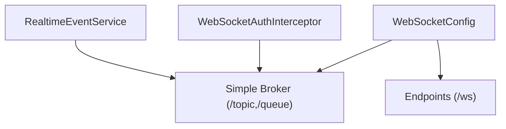

**Diagram sources**
- [WebSocketConfig.java:32-50](file://jmp-infrastructure/src/main/java/com/jmp/infrastructure/websocket/WebSocketConfig.java#L32-L50)
- [WebSocketAuthInterceptor.java](file://jmp-infrastructure/src/main/java/com/jmp/infrastructure/websocket/WebSocketAuthInterceptor.java)
- [RealtimeEventService.java](file://jmp-infrastructure/src/main/java/com/jmp/infrastructure/websocket/RealtimeEventService.java)

**Section sources**
- [WebSocketConfig.java:32-50](file://jmp-infrastructure/src/main/java/com/jmp/infrastructure/websocket/WebSocketConfig.java#L32-L50)
- [WebSocketAuthInterceptor.java](file://jmp-infrastructure/src/main/java/com/jmp/infrastructure/websocket/WebSocketAuthInterceptor.java)
- [RealtimeEventService.java](file://jmp-infrastructure/src/main/java/com/jmp/infrastructure/websocket/RealtimeEventService.java)

### External Integrations (S3-Compatible Storage)
The storage layer abstracts S3-compatible providers and exposes a unified interface for upload/download operations.

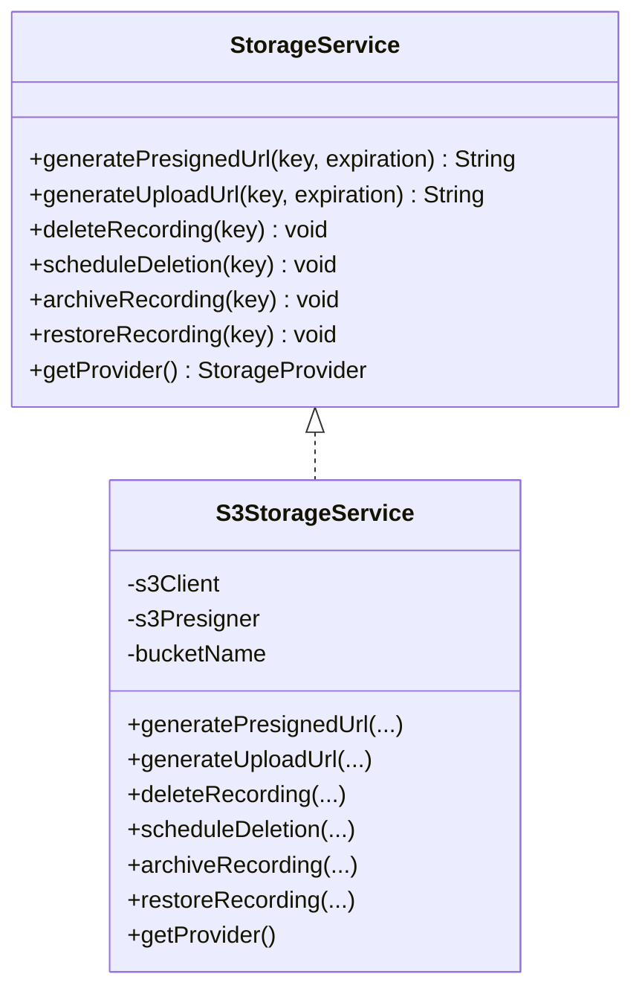

**Diagram sources**
- [S3StorageService.java:24-129](file://jmp-infrastructure/src/main/java/com/jmp/infrastructure/storage/S3StorageService.java#L24-L129)

**Section sources**
- [S3StorageService.java:24-129](file://jmp-infrastructure/src/main/java/com/jmp/infrastructure/storage/S3StorageService.java#L24-L129)

### Multi-Tenancy and RBAC Model
The domain model encapsulates tenant scoping and role-based permissions with comprehensive Jitsi conference management.

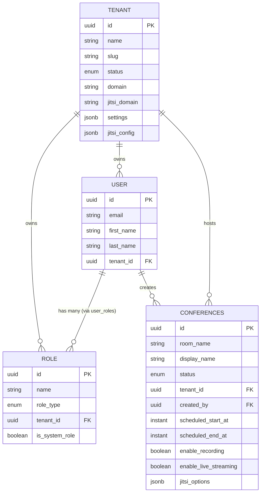

**Diagram sources**
- [Tenant.java:29-141](file://jmp-domain/src/main/java/com/jmp/domain/entity/Tenant.java#L29-L141)
- [Role.java:27-121](file://jmp-domain/src/main/java/com/jmp/domain/entity/Role.java#L27-L121)
- [User.java:28-96](file://jmp-domain/src/main/java/com/jmp/domain/entity/User.java#L28-L96)
- [Conference.java:30-135](file://jmp-domain/src/main/java/com/jmp/domain/entity/Conference.java#L30-L135)

**Section sources**
- [Tenant.java:29-141](file://jmp-domain/src/main/java/com/jmp/domain/entity/Tenant.java#L29-L141)
- [Role.java:27-121](file://jmp-domain/src/main/java/com/jmp/domain/entity/Role.java#L27-L121)
- [User.java:28-96](file://jmp-domain/src/main/java/com/jmp/domain/entity/User.java#L28-L96)
- [Conference.java:30-135](file://jmp-domain/src/main/java/com/jmp/domain/entity/Conference.java#L30-L135)

## Jitsi Integration Architecture
The platform provides comprehensive Jitsi integration through specialized services and webhook processing capabilities.

### Conference Lifecycle Management
The ConferenceService manages the complete Jitsi conference lifecycle with automated scheduling and status tracking.

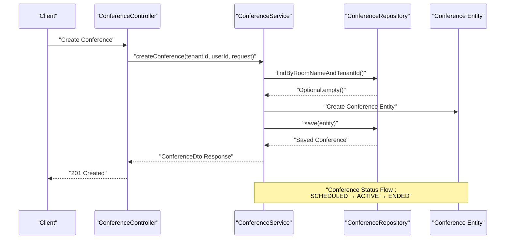

**Diagram sources**
- [ConferenceService.java:40-65](file://jmp-application/src/main/java/com/jmp/application/service/ConferenceService.java#L40-L65)
- [Conference.java:140-151](file://jmp-domain/src/main/java/com/jmp/domain/entity/Conference.java#L140-L151)

### Jitsi Webhook Processing
The platform processes Jitsi webhook events for real-time conference management and monitoring.

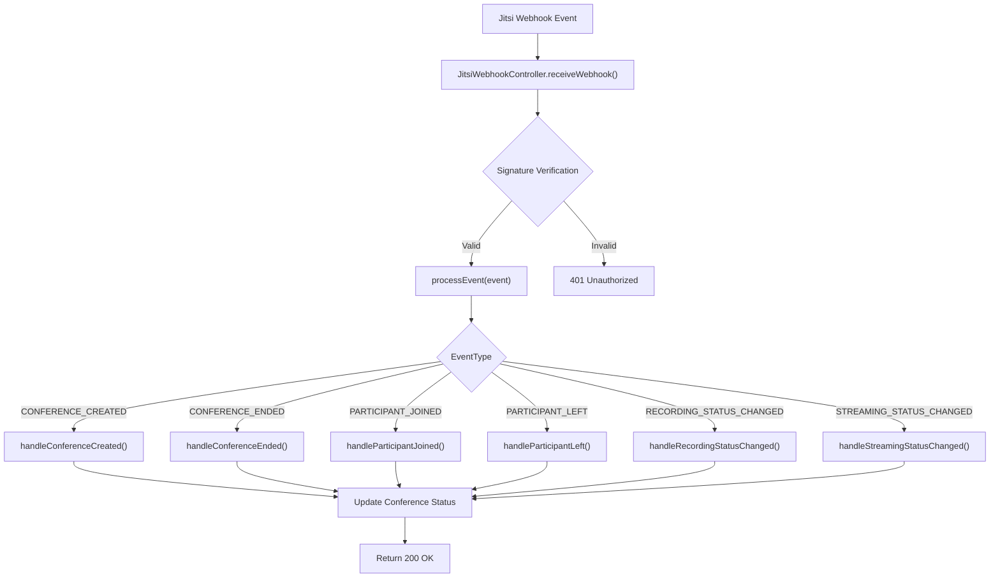

**Diagram sources**
- [JitsiWebhookController.java:34-102](file://jmp-api/src/main/java/com/jmp/api/controller/JitsiWebhookController.java#L34-L102)

### Jitsi Options Configuration
The platform supports comprehensive Jitsi configuration through JSON options stored in the database.

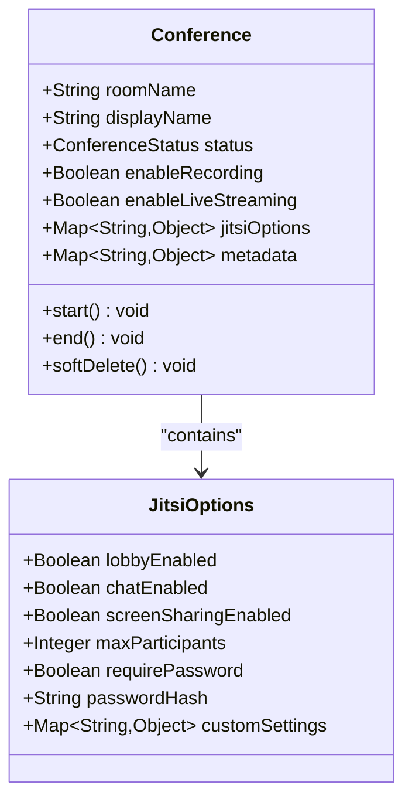

**Diagram sources**
- [Conference.java:115-121](file://jmp-domain/src/main/java/com/jmp/domain/entity/Conference.java#L115-L121)
- [ConferenceDto.java:57-58](file://jmp-application/src/main/java/com/jmp/application/dto/ConferenceDto.java#L57-L58)

**Section sources**
- [ConferenceService.java:25-225](file://jmp-application/src/main/java/com/jmp/application/service/ConferenceService.java#L25-L225)
- [Conference.java:23-217](file://jmp-domain/src/main/java/com/jmp/domain/entity/Conference.java#L23-L217)
- [ConferenceDto.java:14-176](file://jmp-application/src/main/java/com/jmp/application/dto/ConferenceDto.java#L14-L176)
- [JitsiWebhookController.java:24-125](file://jmp-api/src/main/java/com/jmp/api/controller/JitsiWebhookController.java#L24-L125)

## Dependency Analysis
This section maps module-level dependencies and highlights inversion of control with comprehensive Jitsi integration.

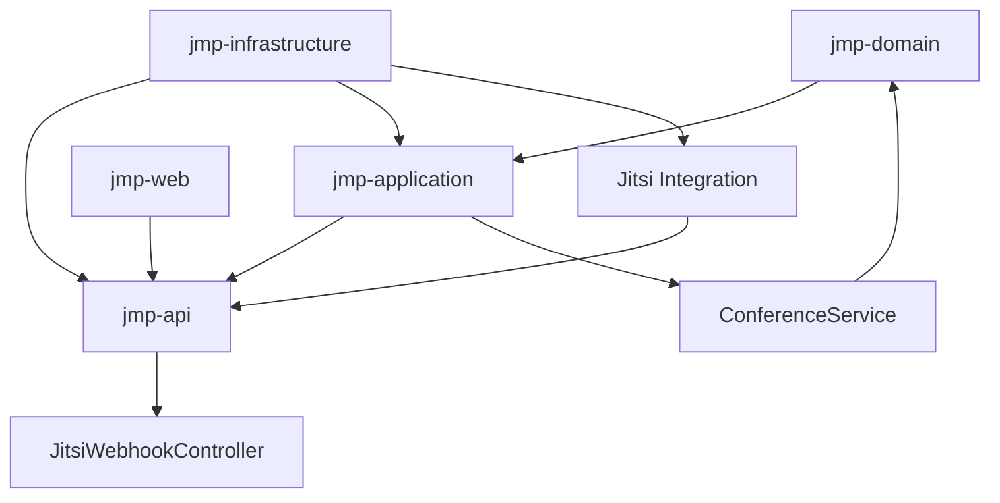

**Diagram sources**
- [pom.xml:40-46](file://pom.xml#L40-L46)
- [jmp-web/pom.xml:18-35](file://jmp-web/pom.xml#L18-L35)
- [jmp-api/pom.xml:17-29](file://jmp-api/pom.xml#L17-L29)
- [jmp-application/pom.xml:17-22](file://jmp-application/pom.xml#L17-L22)
- [jmp-infrastructure/pom.xml:17-28](file://jmp-infrastructure/pom.xml#L17-L28)

**Section sources**
- [pom.xml:40-46](file://pom.xml#L40-L46)
- [jmp-web/pom.xml:18-35](file://jmp-web/pom.xml#L18-L35)
- [jmp-api/pom.xml:17-29](file://jmp-api/pom.xml#L17-L29)
- [jmp-application/pom.xml:17-22](file://jmp-application/pom.xml#L17-L22)
- [jmp-infrastructure/pom.xml:17-28](file://jmp-infrastructure/pom.xml#L17-L28)

## Performance Considerations
- Layered design promotes testability and maintainability; keep DTOs and mappers lightweight
- Use repository queries with appropriate entity graphs to avoid N+1 selects
- Apply pagination for listing endpoints to bound memory footprint
- Leverage method-level caching and rate limiting where applicable
- Monitor database queries and tune indexes for tenant-scoped lookups
- **Jitsi Integration**: Implement webhook deduplication and batch processing for high-volume events
- **Conference Management**: Use scheduled tasks for automatic conference start/end processing
- **Storage Operations**: Implement connection pooling for S3-compatible storage operations

## Troubleshooting Guide
Common areas to inspect during troubleshooting:
- Authentication failures: Verify JWT filter chain and method security configuration
- Authorization errors: Confirm role names and tenant extraction from authentication details
- Persistence issues: Review repository queries and entity graph usage
- WebSocket connectivity: Validate endpoint registration and interceptor configuration
- Storage operations: Check S3 client configuration and pre-signed URL generation
- **Jitsi Webhooks**: Verify webhook signatures, validate event payloads, check webhook endpoint accessibility
- **Conference Management**: Monitor scheduled conference processing, validate Jitsi options configuration
- **Multi-Module Issues**: Ensure proper module dependencies and Maven compilation order

**Section sources**
- [SecurityConfig.java:42-61](file://jmp-infrastructure/src/main/java/com/jmp/infrastructure/security/SecurityConfig.java#L42-L61)
- [UserController.java:109-121](file://jmp-api/src/main/java/com/jmp/api/controller/UserController.java#L109-L121)
- [UserRepository.java:24-81](file://jmp-domain/src/main/java/com/jmp/domain/repository/UserRepository.java#L24-L81)
- [WebSocketConfig.java:42-50](file://jmp-infrastructure/src/main/java/com/jmp/infrastructure/websocket/WebSocketConfig.java#L42-L50)
- [S3StorageService.java:32-59](file://jmp-infrastructure/src/main/java/com/jmp/infrastructure/storage/S3StorageService.java#L32-L59)
- [JitsiWebhookController.java:104-109](file://jmp-api/src/main/java/com/jmp/api/controller/JitsiWebhookController.java#L104-L109)
- [ConferenceService.java:194-223](file://jmp-application/src/main/java/com/jmp/application/service/ConferenceService.java#L194-L223)

## Conclusion
The Jitsi Management Platform employs a robust Clean Architecture with clear separation of concerns and comprehensive Jitsi integration capabilities. The evolution from a single Spring Boot application to a multi-module Maven architecture provides scalability, maintainability, and specialized support for Jitsi video conferencing infrastructure.

The four-layer model, combined with Hexagonal principles and dependency inversion, yields a scalable, testable, and maintainable system. Security, real-time communication, external integrations, and Jitsi webhook processing are cleanly encapsulated in the infrastructure layer, while the domain and application layers remain focused on business logic and use cases.

The enhanced Jitsi integration provides comprehensive conference lifecycle management, real-time webhook processing, and flexible configuration options, making it a complete solution for enterprise-grade video conferencing management.