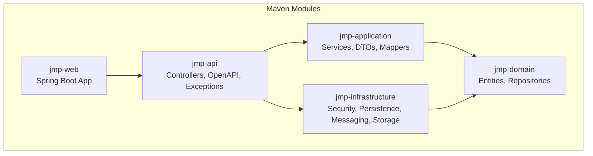
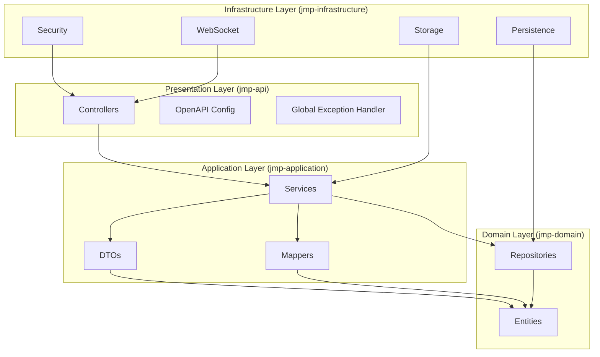
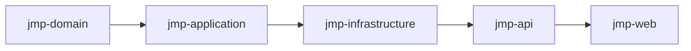
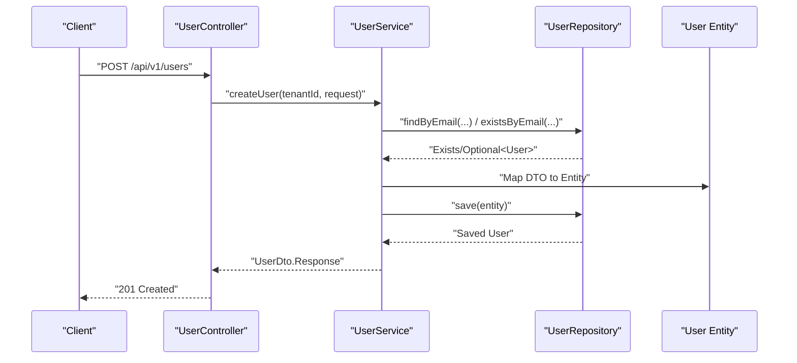
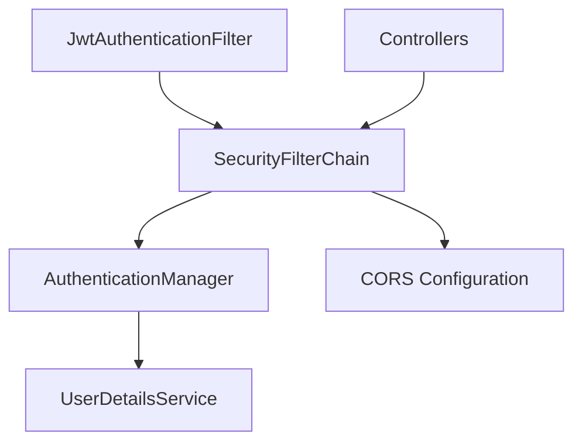
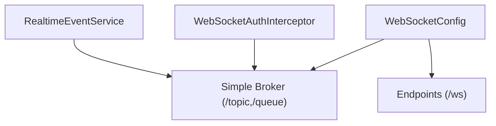
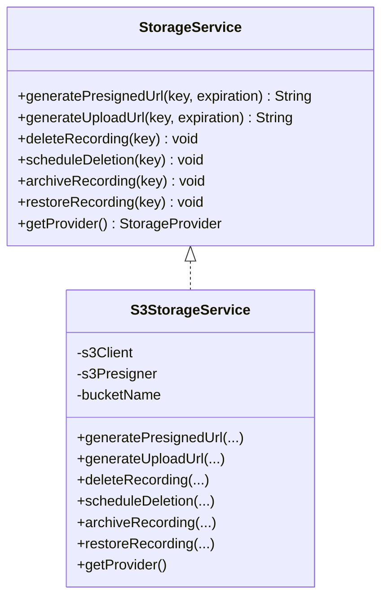
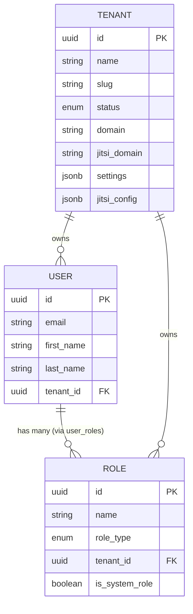
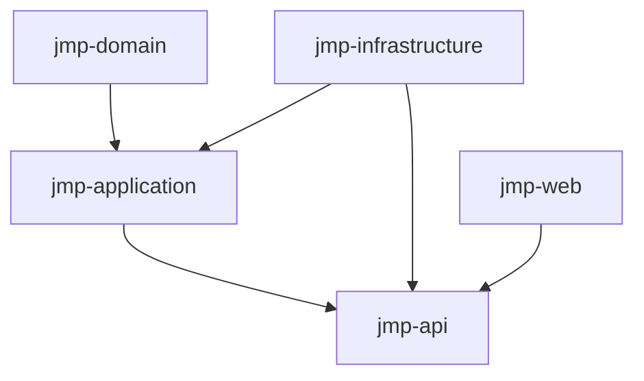

# Architecture Overview

<cite>
**Referenced Files in This Document**
- [pom.xml](file://pom.xml)
- [jmp-web/pom.xml](file://jmp-web/pom.xml)
- [jmp-api/pom.xml](file://jmp-api/pom.xml)
- [jmp-application/pom.xml](file://jmp-application/pom.xml)
- [jmp-domain/pom.xml](file://jmp-domain/pom.xml)
- [jmp-infrastructure/pom.xml](file://jmp-infrastructure/pom.xml)
- [JmpApplication.java](file://jmp-web/src/main/java/com/jmp/web/JmpApplication.java)
- [UserController.java](file://jmp-api/src/main/java/com/jmp/api/controller/UserController.java)
- [UserService.java](file://jmp-application/src/main/java/com/jmp/application/service/UserService.java)
- [UserRepository.java](file://jmp-domain/src/main/java/com/jmp/domain/repository/UserRepository.java)
- [User.java](file://jmp-domain/src/main/java/com/jmp/domain/entity/User.java)
- [Tenant.java](file://jmp-domain/src/main/java/com/jmp/domain/entity/Tenant.java)
- [Role.java](file://jmp-domain/src/main/java/com/jmp/domain/entity/Role.java)
- [UserMapper.java](file://jmp-application/src/main/java/com/jmp/application/mapper/UserMapper.java)
- [UserDto.java](file://jmp-application/src/main/java/com/jmp/application/dto/UserDto.java)
- [SecurityConfig.java](file://jmp-infrastructure/src/main/java/com/jmp/infrastructure/security/SecurityConfig.java)
- [JwtAuthenticationFilter.java](file://jmp-infrastructure/src/main/java/com/jmp/infrastructure/security/JwtAuthenticationFilter.java)
- [WebSocketConfig.java](file://jmp-infrastructure/src/main/java/com/jmp/infrastructure/websocket/WebSocketConfig.java)
- [RealtimeEventService.java](file://jmp-infrastructure/src/main/java/com/jmp/infrastructure/websocket/RealtimeEventService.java)
- [WebSocketAuthInterceptor.java](file://jmp-infrastructure/src/main/java/com/jmp/infrastructure/websocket/WebSocketAuthInterceptor.java)
- [S3StorageService.java](file://jmp-infrastructure/src/main/java/com/jmp/infrastructure/storage/S3StorageService.java)
</cite>

## Table of Contents
1. [Introduction](#introduction)
2. [Project Structure](#project-structure)
3. [Core Components](#core-components)
4. [Architecture Overview](#architecture-overview)
5. [Detailed Component Analysis](#detailed-component-analysis)
6. [Dependency Analysis](#dependency-analysis)
7. [Performance Considerations](#performance-considerations)
8. [Troubleshooting Guide](#troubleshooting-guide)
9. [Conclusion](#conclusion)

## Introduction
This document presents the architectural blueprint of the Jitsi Management Platform (JMP), a Spring Boot-based system implementing Clean Architecture with Hexagonal principles. The platform is organized into four layers:
- jmp-domain: Core business logic and entities
- jmp-application: Use cases, services, DTOs, and mappers
- jmp-infrastructure: Cross-cutting concerns (security, persistence, messaging, storage)
- jmp-api: Presentation layer (controllers, OpenAPI, exception handling)

The architecture enforces dependency inversion so that outer layers depend on abstractions defined in inner layers. It supports multi-tenancy, role-based access control, real-time communication via WebSockets, and secure integrations with external systems such as AWS S3-compatible storage.

## Project Structure
The project is a Maven multi-module setup with five modules:
- jmp-domain: Entities, repositories, and domain events
- jmp-application: Services, DTOs, mappers, and validators
- jmp-infrastructure: Security, persistence, messaging, storage, and monitoring
- jmp-api: REST controllers, OpenAPI configuration, and global exception handling
- jmp-web: Spring Boot application entry point and module packaging

**Diagram sources**
- [pom.xml:40-46](file://pom.xml#L40-L46)
- [jmp-web/pom.xml:18-35](file://jmp-web/pom.xml#L18-L35)
- [jmp-api/pom.xml:17-29](file://jmp-api/pom.xml#L17-L29)
- [jmp-application/pom.xml:17-22](file://jmp-application/pom.xml#L17-L22)
- [jmp-infrastructure/pom.xml:17-28](file://jmp-infrastructure/pom.xml#L17-L28)

**Section sources**
- [pom.xml:40-46](file://pom.xml#L40-L46)
- [jmp-web/pom.xml:18-35](file://jmp-web/pom.xml#L18-L35)
- [jmp-api/pom.xml:17-29](file://jmp-api/pom.xml#L17-L29)
- [jmp-application/pom.xml:17-22](file://jmp-application/pom.xml#L17-L22)
- [jmp-infrastructure/pom.xml:17-28](file://jmp-infrastructure/pom.xml#L17-L28)

## Core Components
This section outlines the primary building blocks and their responsibilities across layers.

- jmp-domain
  - Entities: User, Tenant, Role, Permission, Conference, Recording, AuditLog, IdentityProvider
  - Repositories: Typed repository interfaces for persistence operations
  - Responsibilities: Define business rules, invariants, and domain events

- jmp-application
  - Services: Orchestrators of use cases (e.g., UserService)
  - DTOs: Transfer objects for API boundary
  - Mappers: Structured mapping between entities and DTOs
  - Validators: Input validation and cross-field constraints
  - Responsibilities: Orchestrate domain logic, enforce application rules, coordinate infrastructure

- jmp-infrastructure
  - Security: JWT filter chain, method security, password encoder
  - Persistence: JPA/Hibernate configuration, Flyway migrations
  - Messaging: WebSocket broker configuration and interceptors
  - Storage: S3-compatible storage abstraction and implementation
  - Responsibilities: Provide infrastructure capabilities behind abstractions

- jmp-api
  - Controllers: REST endpoints with Swagger/OpenAPI metadata
  - Exception handling: Global exception handler
  - Responsibilities: Translate HTTP requests to application use cases and return standardized responses

**Section sources**
- [User.java:23-164](file://jmp-domain/src/main/java/com/jmp/domain/entity/User.java#L23-L164)
- [Tenant.java:24-174](file://jmp-domain/src/main/java/com/jmp/domain/entity/Tenant.java#L24-L174)
- [Role.java:22-131](file://jmp-domain/src/main/java/com/jmp/domain/entity/Role.java#L22-L131)
- [UserRepository.java:18-82](file://jmp-domain/src/main/java/com/jmp/domain/repository/UserRepository.java#L18-L82)
- [UserService.java:28-190](file://jmp-application/src/main/java/com/jmp/application/service/UserService.java#L28-L190)
- [UserDto.java:14-97](file://jmp-application/src/main/java/com/jmp/application/dto/UserDto.java#L14-L97)
- [UserMapper.java:18-76](file://jmp-application/src/main/java/com/jmp/application/mapper/UserMapper.java#L18-L76)
- [UserController.java:33-123](file://jmp-api/src/main/java/com/jmp/api/controller/UserController.java#L33-L123)
- [SecurityConfig.java:28-90](file://jmp-infrastructure/src/main/java/com/jmp/infrastructure/security/SecurityConfig.java#L28-L90)
- [WebSocketConfig.java:23-70](file://jmp-infrastructure/src/main/java/com/jmp/infrastructure/websocket/WebSocketConfig.java#L23-L70)
- [S3StorageService.java:24-129](file://jmp-infrastructure/src/main/java/com/jmp/infrastructure/storage/S3StorageService.java#L24-L129)

## Architecture Overview
The system follows Clean Architecture with dependency inversion:
- Outer layers (API, Infrastructure) depend on abstractions defined in inner layers (Application, Domain)
- Domain defines pure business logic and entities
- Application orchestrates use cases and DTOs
- Infrastructure provides cross-cutting capabilities and external integrations

**Diagram sources**
- [UserController.java:33-123](file://jmp-api/src/main/java/com/jmp/api/controller/UserController.java#L33-L123)
- [UserService.java:28-190](file://jmp-application/src/main/java/com/jmp/application/service/UserService.java#L28-L190)
- [UserDto.java:14-97](file://jmp-application/src/main/java/com/jmp/application/dto/UserDto.java#L14-L97)
- [UserMapper.java:18-76](file://jmp-application/src/main/java/com/jmp/application/mapper/UserMapper.java#L18-L76)
- [UserRepository.java:18-82](file://jmp-domain/src/main/java/com/jmp/domain/repository/UserRepository.java#L18-L82)
- [User.java:23-164](file://jmp-domain/src/main/java/com/jmp/domain/entity/User.java#L23-L164)
- [SecurityConfig.java:28-90](file://jmp-infrastructure/src/main/java/com/jmp/infrastructure/security/SecurityConfig.java#L28-L90)
- [WebSocketConfig.java:23-70](file://jmp-infrastructure/src/main/java/com/jmp/infrastructure/websocket/WebSocketConfig.java#L23-L70)
- [S3StorageService.java:24-129](file://jmp-infrastructure/src/main/java/com/jmp/infrastructure/storage/S3StorageService.java#L24-L129)

## Detailed Component Analysis

### Layer Responsibilities and Dependencies
- jmp-domain
  - Defines entities and repositories; no awareness of application or infrastructure concerns
  - Provides invariants (e.g., user status, tenant quotas)
- jmp-application
  - Uses domain entities and repositories
  - Exposes services and DTOs to presentation
  - Applies mapping and validation
- jmp-infrastructure
  - Implements security, persistence, messaging, and storage
  - Provides adapters for external systems
- jmp-api
  - Exposes REST endpoints
  - Enforces authorization and delegates to application services

**Diagram sources**
- [pom.xml:40-46](file://pom.xml#L40-L46)
- [jmp-web/pom.xml:18-35](file://jmp-web/pom.xml#L18-L35)
- [jmp-api/pom.xml:17-29](file://jmp-api/pom.xml#L17-L29)
- [jmp-application/pom.xml:17-22](file://jmp-application/pom.xml#L17-L22)
- [jmp-infrastructure/pom.xml:17-28](file://jmp-infrastructure/pom.xml#L17-L28)

**Section sources**
- [pom.xml:40-46](file://pom.xml#L40-L46)
- [jmp-web/pom.xml:18-35](file://jmp-web/pom.xml#L18-L35)
- [jmp-api/pom.xml:17-29](file://jmp-api/pom.xml#L17-L29)
- [jmp-application/pom.xml:17-22](file://jmp-application/pom.xml#L17-L22)
- [jmp-infrastructure/pom.xml:17-28](file://jmp-infrastructure/pom.xml#L17-L28)

### User Management Workflow (Controller → Service → Repository)
This sequence illustrates the canonical request flow for user creation, highlighting dependency inversion and layered responsibilities.

**Diagram sources**
- [UserController.java:46-55](file://jmp-api/src/main/java/com/jmp/api/controller/UserController.java#L46-L55)
- [UserService.java:44-70](file://jmp-application/src/main/java/com/jmp/application/service/UserService.java#L44-L70)
- [UserRepository.java:24-31](file://jmp-domain/src/main/java/com/jmp/domain/repository/UserRepository.java#L24-L31)
- [UserMapper.java:46-46](file://jmp-application/src/main/java/com/jmp/application/mapper/UserMapper.java#L46-L46)

**Section sources**
- [UserController.java:46-55](file://jmp-api/src/main/java/com/jmp/api/controller/UserController.java#L46-L55)
- [UserService.java:44-70](file://jmp-application/src/main/java/com/jmp/application/service/UserService.java#L44-L70)
- [UserRepository.java:24-31](file://jmp-domain/src/main/java/com/jmp/domain/repository/UserRepository.java#L24-L31)
- [UserMapper.java:46-46](file://jmp-application/src/main/java/com/jmp/application/mapper/UserMapper.java#L46-L46)

### Security Architecture (JWT and Method Security)
The security layer enforces stateless authentication, method-level authorization, and CORS configuration.

**Diagram sources**
- [SecurityConfig.java:42-61](file://jmp-infrastructure/src/main/java/com/jmp/infrastructure/security/SecurityConfig.java#L42-L61)
- [JwtAuthenticationFilter.java](file://jmp-infrastructure/src/main/java/com/jmp/infrastructure/security/JwtAuthenticationFilter.java)
- [UserController.java:44-58](file://jmp-api/src/main/java/com/jmp/api/controller/UserController.java#L44-L58)

**Section sources**
- [SecurityConfig.java:42-61](file://jmp-infrastructure/src/main/java/com/jmp/infrastructure/security/SecurityConfig.java#L42-L61)
- [UserController.java:44-58](file://jmp-api/src/main/java/com/jmp/api/controller/UserController.java#L44-L58)

### Real-Time Communication (WebSocket)
The messaging layer enables real-time events via STOMP over WebSocket/SockJS with authentication interception.

**Diagram sources**
- [WebSocketConfig.java:32-50](file://jmp-infrastructure/src/main/java/com/jmp/infrastructure/websocket/WebSocketConfig.java#L32-L50)
- [WebSocketAuthInterceptor.java](file://jmp-infrastructure/src/main/java/com/jmp/infrastructure/websocket/WebSocketAuthInterceptor.java)
- [RealtimeEventService.java](file://jmp-infrastructure/src/main/java/com/jmp/infrastructure/websocket/RealtimeEventService.java)

**Section sources**
- [WebSocketConfig.java:32-50](file://jmp-infrastructure/src/main/java/com/jmp/infrastructure/websocket/WebSocketConfig.java#L32-L50)
- [WebSocketAuthInterceptor.java](file://jmp-infrastructure/src/main/java/com/jmp/infrastructure/websocket/WebSocketAuthInterceptor.java)
- [RealtimeEventService.java](file://jmp-infrastructure/src/main/java/com/jmp/infrastructure/websocket/RealtimeEventService.java)

### External Integrations (S3-Compatible Storage)
The storage layer abstracts S3-compatible providers and exposes a unified interface for upload/download operations.

**Diagram sources**
- [S3StorageService.java:24-129](file://jmp-infrastructure/src/main/java/com/jmp/infrastructure/storage/S3StorageService.java#L24-L129)

**Section sources**
- [S3StorageService.java:24-129](file://jmp-infrastructure/src/main/java/com/jmp/infrastructure/storage/S3StorageService.java#L24-L129)

### Multi-Tenancy and RBAC Model
The domain model encapsulates tenant scoping and role-based permissions.

**Diagram sources**
- [Tenant.java:29-141](file://jmp-domain/src/main/java/com/jmp/domain/entity/Tenant.java#L29-L141)
- [Role.java:27-121](file://jmp-domain/src/main/java/com/jmp/domain/entity/Role.java#L27-L121)
- [User.java:28-96](file://jmp-domain/src/main/java/com/jmp/domain/entity/User.java#L28-L96)

**Section sources**
- [Tenant.java:29-141](file://jmp-domain/src/main/java/com/jmp/domain/entity/Tenant.java#L29-L141)
- [Role.java:27-121](file://jmp-domain/src/main/java/com/jmp/domain/entity/Role.java#L27-L121)
- [User.java:28-96](file://jmp-domain/src/main/java/com/jmp/domain/entity/User.java#L28-L96)

## Dependency Analysis
This section maps module-level dependencies and highlights inversion of control.

**Diagram sources**
- [pom.xml:40-46](file://pom.xml#L40-L46)
- [jmp-web/pom.xml:18-35](file://jmp-web/pom.xml#L18-L35)
- [jmp-api/pom.xml:17-29](file://jmp-api/pom.xml#L17-L29)
- [jmp-application/pom.xml:17-22](file://jmp-application/pom.xml#L17-L22)
- [jmp-infrastructure/pom.xml:17-28](file://jmp-infrastructure/pom.xml#L17-L28)

**Section sources**
- [pom.xml:40-46](file://pom.xml#L40-L46)
- [jmp-web/pom.xml:18-35](file://jmp-web/pom.xml#L18-L35)
- [jmp-api/pom.xml:17-29](file://jmp-api/pom.xml#L17-L29)
- [jmp-application/pom.xml:17-22](file://jmp-application/pom.xml#L17-L22)
- [jmp-infrastructure/pom.xml:17-28](file://jmp-infrastructure/pom.xml#L17-L28)

## Performance Considerations
- Layered design promotes testability and maintainability; keep DTOs and mappers lightweight
- Use repository queries with appropriate entity graphs to avoid N+1 selects
- Apply pagination for listing endpoints to bound memory footprint
- Leverage method-level caching and rate limiting where applicable
- Monitor database queries and tune indexes for tenant-scoped lookups

## Troubleshooting Guide
Common areas to inspect during troubleshooting:
- Authentication failures: Verify JWT filter chain and method security configuration
- Authorization errors: Confirm role names and tenant extraction from authentication details
- Persistence issues: Review repository queries and entity graph usage
- WebSocket connectivity: Validate endpoint registration and interceptor configuration
- Storage operations: Check S3 client configuration and pre-signed URL generation

**Section sources**
- [SecurityConfig.java:42-61](file://jmp-infrastructure/src/main/java/com/jmp/infrastructure/security/SecurityConfig.java#L42-L61)
- [UserController.java:109-121](file://jmp-api/src/main/java/com/jmp/api/controller/UserController.java#L109-L121)
- [UserRepository.java:24-81](file://jmp-domain/src/main/java/com/jmp/domain/repository/UserRepository.java#L24-L81)
- [WebSocketConfig.java:42-50](file://jmp-infrastructure/src/main/java/com/jmp/infrastructure/websocket/WebSocketConfig.java#L42-L50)
- [S3StorageService.java:32-59](file://jmp-infrastructure/src/main/java/com/jmp/infrastructure/storage/S3StorageService.java#L32-L59)

## Conclusion
The Jitsi Management Platform employs a robust Clean Architecture with clear separation of concerns. The four-layer model, combined with Hexagonal principles and dependency inversion, yields a scalable, testable, and maintainable system. Security, real-time communication, and external integrations are cleanly encapsulated in the infrastructure layer, while the domain and application layers remain focused on business logic and use cases.