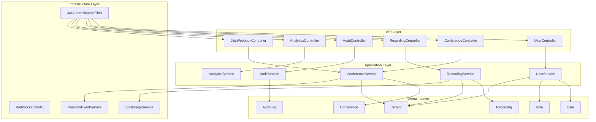
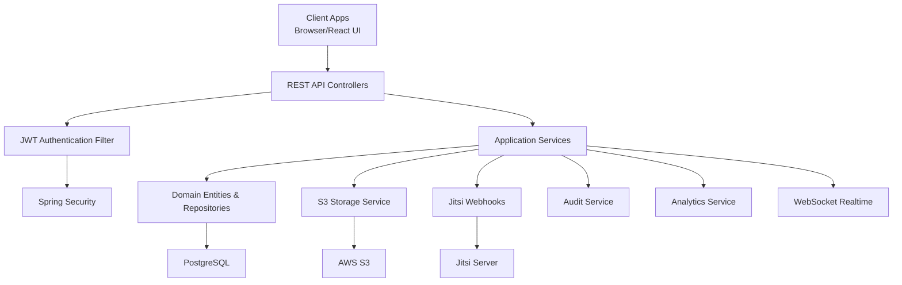
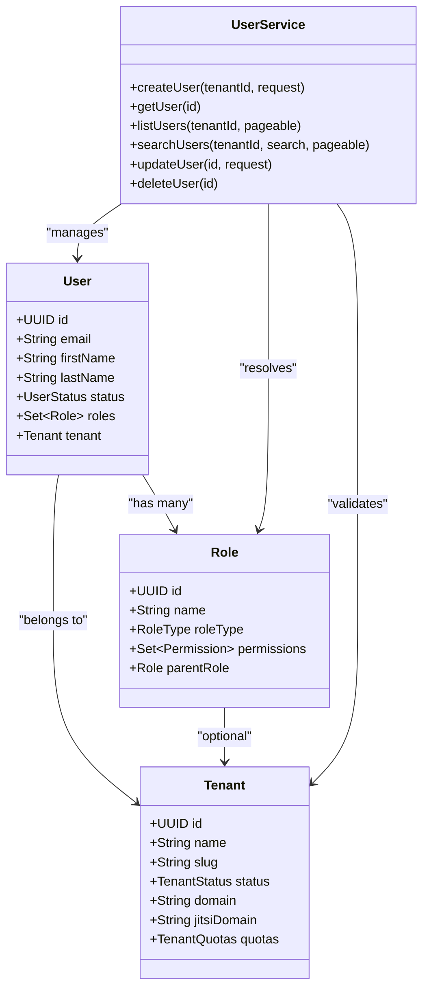
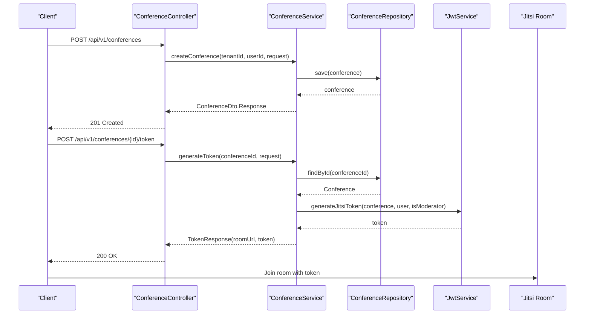
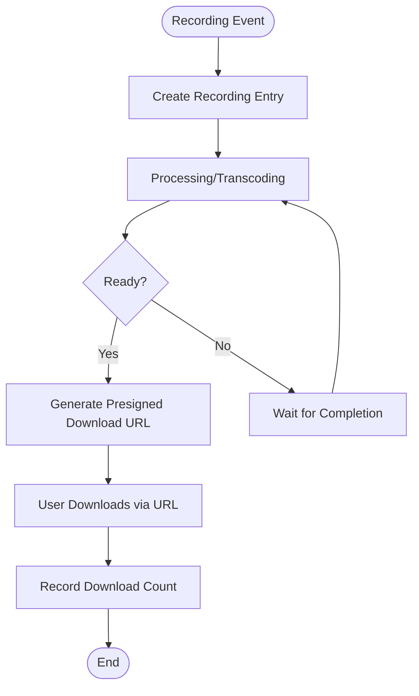
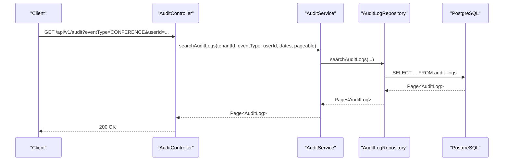
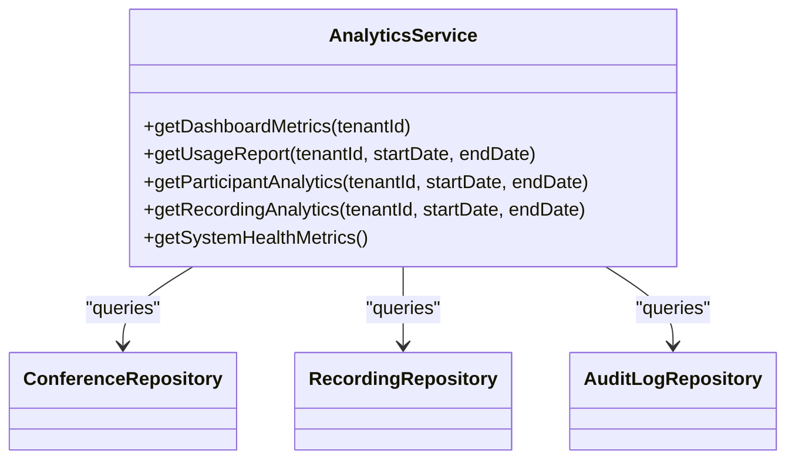
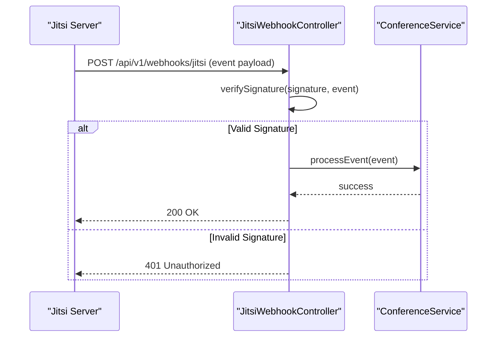
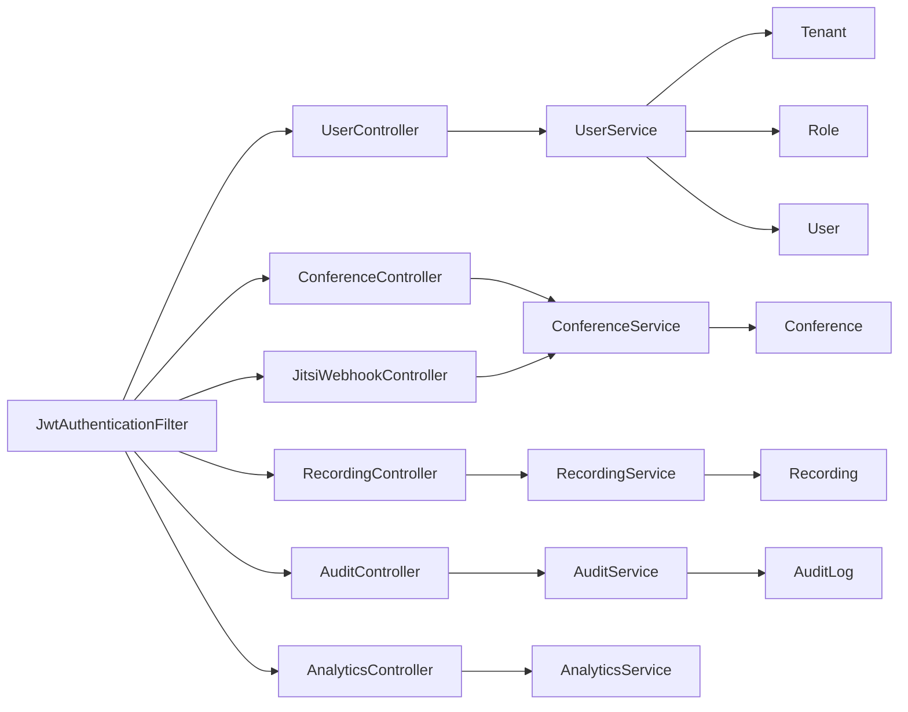

# Feature Highlights

<cite>
**Referenced Files in This Document**
- [UserController.java](file://jmp-api/src/main/java/com/jmp/api/controller/UserController.java)
- [ConferenceController.java](file://jmp-api/src/main/java/com/jmp/api/controller/ConferenceController.java)
- [RecordingController.java](file://jmp-api/src/main/java/com/jmp/api/controller/RecordingController.java)
- [AuditController.java](file://jmp-api/src/main/java/com/jmp/api/controller/AuditController.java)
- [AnalyticsController.java](file://jmp-api/src/main/java/com/jmp/api/controller/AnalyticsController.java)
- [JitsiWebhookController.java](file://jmp-api/src/main/java/com/jmp/api/controller/JitsiWebhookController.java)
- [Tenant.java](file://jmp-domain/src/main/java/com/jmp/domain/entity/Tenant.java)
- [Role.java](file://jmp-domain/src/main/java/com/jmp/domain/entity/Role.java)
- [User.java](file://jmp-domain/src/main/java/com/jmp/domain/entity/User.java)
- [Conference.java](file://jmp-domain/src/main/java/com/jmp/domain/entity/Conference.java)
- [Recording.java](file://jmp-domain/src/main/java/com/jmp/domain/entity/Recording.java)
- [AuditLog.java](file://jmp-domain/src/main/java/com/jmp/domain/entity/AuditLog.java)
- [UserService.java](file://jmp-application/src/main/java/com/jmp/application/service/UserService.java)
- [ConferenceService.java](file://jmp-application/src/main/java/com/jmp/application/service/ConferenceService.java)
- [RecordingService.java](file://jmp-application/src/main/java/com/jmp/application/service/RecordingService.java)
- [AuditService.java](file://jmp-application/src/main/java/com/jmp/application/service/AuditService.java)
- [AnalyticsService.java](file://jmp-application/src/main/java/com/jmp/application/service/AnalyticsService.java)
- [JwtAuthenticationFilter.java](file://jmp-infrastructure/src/main/java/com/jmp/infrastructure/security/JwtAuthenticationFilter.java)
- [WebSocketConfig.java](file://jmp-infrastructure/src/main/java/com/jmp/infrastructure/websocket/WebSocketConfig.java)
- [RealtimeEventService.java](file://jmp-infrastructure/src/main/java/com/jmp/infrastructure/websocket/RealtimeEventService.java)
- [S3StorageService.java](file://jmp-infrastructure/src/main/java/com/jmp/infrastructure/storage/S3StorageService.java)
- [OpenApiConfig.java](file://jmp-api/src/main/java/com/jmp/api/config/OpenApiConfig.java)
- [V1__init_schema.sql](file://jmp-web/src/main/resources/db/migration/V1__init_schema.sql)
- [V2__seed_data.sql](file://jmp-web/src/main/resources/db/migration/V2__seed_data.sql)
- [V3__create_recordings_table.sql](file://jmp-web/src/main/resources/db/migration/V3__create_recordings_table.sql)
- [V4__create_audit_logs_table.sql](file://jmp-web/src/main/resources/db/migration/V4__create_audit_logs_table.sql)
- [V5__create_identity_providers_table.sql](file://jmp-web/src/main/resources/db/migration/V5__create_identity_providers_table.sql)
- [docker-compose.yml](file://docker-compose.yml)
- [prometheus.yml](file://monitoring/prometheus.yml)
- [datasources.yml](file://monitoring/grafana/datasources/datasources.yml)
</cite>

## Table of Contents
1. [Introduction](#introduction)
2. [Project Structure](#project-structure)
3. [Core Components](#core-components)
4. [Architecture Overview](#architecture-overview)
5. [Detailed Feature Analysis](#detailed-feature-analysis)
6. [Dependency Analysis](#dependency-analysis)
7. [Performance Considerations](#performance-considerations)
8. [Troubleshooting Guide](#troubleshooting-guide)
9. [Conclusion](#conclusion)

## Introduction
This document presents the feature highlights of the Jitsi Management Platform (JMP), focusing on multi-tenant user management with role-based access control, conference lifecycle management with real-time participant tracking, recording capture and storage integration, comprehensive audit logging for compliance, analytics dashboard with real-time metrics, and Jitsi webhook integration for automated conference management. It explains each feature's business value, technical implementation approach, user interaction patterns, API endpoints, UI components, integration points, scalability considerations, performance characteristics, and extensibility opportunities.

## Project Structure
The platform follows a layered architecture:
- API Layer: REST controllers exposing feature endpoints with OpenAPI documentation
- Application Layer: Services implementing business logic and orchestrating domain operations
- Domain Layer: Entities and repositories modeling tenants, users, conferences, recordings, and audit logs
- Infrastructure Layer: Security filters, storage integrations, messaging, and websockets
- UI Layer: React-based frontend with TypeScript and Tailwind CSS
- Monitoring: Prometheus and Grafana for observability

**Diagram sources**
- [UserController.java:33-123](file://jmp-api/src/main/java/com/jmp/api/controller/UserController.java#L33-L123)
- [ConferenceController.java:37-189](file://jmp-api/src/main/java/com/jmp/api/controller/ConferenceController.java#L37-L189)
- [RecordingController.java:35-138](file://jmp-api/src/main/java/com/jmp/api/controller/RecordingController.java#L35-L138)
- [AuditController.java:30-82](file://jmp-api/src/main/java/com/jmp/api/controller/AuditController.java#L30-L82)
- [AnalyticsController.java:26-96](file://jmp-api/src/main/java/com/jmp/api/controller/AnalyticsController.java#L26-L96)
- [JitsiWebhookController.java:24-125](file://jmp-api/src/main/java/com/jmp/api/controller/JitsiWebhookController.java#L24-L125)
- [UserService.java:28-190](file://jmp-application/src/main/java/com/jmp/application/service/UserService.java#L28-L190)
- [ConferenceService.java:25-225](file://jmp-application/src/main/java/com/jmp/application/service/ConferenceService.java#L25-L225)
- [RecordingService.java:27-332](file://jmp-application/src/main/java/com/jmp/application/service/RecordingService.java#L27-L332)
- [AuditService.java:22-207](file://jmp-application/src/main/java/com/jmp/application/service/AuditService.java#L22-L207)
- [AnalyticsService.java:25-235](file://jmp-application/src/main/java/com/jmp/application/service/AnalyticsService.java#L25-L235)
- [JwtAuthenticationFilter.java](file://jmp-infrastructure/src/main/java/com/jmp/infrastructure/security/JwtAuthenticationFilter.java)
- [WebSocketConfig.java](file://jmp-infrastructure/src/main/java/com/jmp/infrastructure/websocket/WebSocketConfig.java)
- [RealtimeEventService.java](file://jmp-infrastructure/src/main/java/com/jmp/infrastructure/websocket/RealtimeEventService.java)
- [S3StorageService.java](file://jmp-infrastructure/src/main/java/com/jmp/infrastructure/storage/S3StorageService.java)

**Section sources**
- [OpenApiConfig.java](file://jmp-api/src/main/java/com/jmp/api/config/OpenApiConfig.java)

## Core Components
- Multi-tenant isolation via Tenant entity with quotas and per-tenant Jitsi domain
- Role-based access control (RBAC) with predefined roles and hierarchical permissions
- Conference lifecycle management with scheduling, start/end automation, and participant tracking
- Recording capture pipeline with storage integration and download URLs
- Comprehensive audit logging for compliance and security event tracking
- Analytics dashboard with usage reports and system health metrics
- Jitsi webhook integration for automated conference and recording lifecycle management

**Section sources**
- [Tenant.java:24-174](file://jmp-domain/src/main/java/com/jmp/domain/entity/Tenant.java#L24-L174)
- [Role.java:22-131](file://jmp-domain/src/main/java/com/jmp/domain/entity/Role.java#L22-L131)
- [User.java:23-164](file://jmp-domain/src/main/java/com/jmp/domain/entity/User.java#L23-L164)
- [Conference.java:25-217](file://jmp-domain/src/main/java/com/jmp/domain/entity/Conference.java#L25-L217)
- [Recording.java:24-203](file://jmp-domain/src/main/java/com/jmp/domain/entity/Recording.java#L24-L203)
- [AuditLog.java:20-136](file://jmp-domain/src/main/java/com/jmp/domain/entity/AuditLog.java#L20-L136)

## Architecture Overview
The system integrates REST APIs, domain-driven services, database persistence, and external systems (Jitsi, storage). Security is enforced via JWT-based authentication and authorization. Real-time capabilities are supported through websockets for participant tracking and live dashboards.

**Diagram sources**
- [JwtAuthenticationFilter.java](file://jmp-infrastructure/src/main/java/com/jmp/infrastructure/security/JwtAuthenticationFilter.java)
- [WebSocketConfig.java](file://jmp-infrastructure/src/main/java/com/jmp/infrastructure/websocket/WebSocketConfig.java)
- [RealtimeEventService.java](file://jmp-infrastructure/src/main/java/com/jmp/infrastructure/websocket/RealtimeEventService.java)
- [S3StorageService.java](file://jmp-infrastructure/src/main/java/com/jmp/infrastructure/storage/S3StorageService.java)
- [V1__init_schema.sql](file://jmp-web/src/main/resources/db/migration/V1__init_schema.sql)

## Detailed Feature Analysis

### Multi-Tenant User Management with Role-Based Access Control
- Business value: Enables secure, isolated environments per organization with granular permission control.
- Technical implementation:
  - Tenant entity defines quotas and Jitsi domain per tenant.
  - Role entity supports role hierarchy and tenant-scoped roles.
  - User entity links to Tenant and Roles with status management.
  - Controllers enforce @PreAuthorize rules based on roles.
  - JWT filter extracts tenant and user IDs for authorization.
- User interaction patterns:
  - Super Admin and Tenant Admin create/update users with role assignment.
  - Users can manage their own profiles; self-service updates allowed per authorization rules.
- API endpoints:
  - POST /api/v1/users (requires TENANT_ADMIN or SUPER_ADMIN)
  - GET /api/v1/users (paginated, optional search)
  - GET /api/v1/users/{id} (self or admin access)
  - PUT /api/v1/users/{id} (self or admin access)
  - DELETE /api/v1/users/{id} (admin only)
  - GET /api/v1/users/me (current user profile)
- Scalability/performance:
  - Indexes on tenantId, email, and role joins improve query performance.
  - Role loading uses eager fetch for permission evaluation.
- Extensibility:
  - Additional role types and permissions can be added via Role and Permission entities.
  - Identity provider integration can be extended through IdentityProviderRepository.

**Diagram sources**
- [Tenant.java:24-174](file://jmp-domain/src/main/java/com/jmp/domain/entity/Tenant.java#L24-L174)
- [Role.java:22-131](file://jmp-domain/src/main/java/com/jmp/domain/entity/Role.java#L22-L131)
- [User.java:23-164](file://jmp-domain/src/main/java/com/jmp/domain/entity/User.java#L23-L164)
- [UserService.java:28-190](file://jmp-application/src/main/java/com/jmp/application/service/UserService.java#L28-L190)

**Section sources**
- [UserController.java:33-123](file://jmp-api/src/main/java/com/jmp/api/controller/UserController.java#L33-L123)
- [UserService.java:28-190](file://jmp-application/src/main/java/com/jmp/application/service/UserService.java#L28-L190)
- [Role.java:22-131](file://jmp-domain/src/main/java/com/jmp/domain/entity/Role.java#L22-L131)
- [User.java:23-164](file://jmp-domain/src/main/java/com/jmp/domain/entity/User.java#L23-L164)
- [Tenant.java:24-174](file://jmp-domain/src/main/java/com/jmp/domain/entity/Tenant.java#L24-L174)

### Conference Lifecycle Management with Real-Time Participant Tracking
- Business value: Full lifecycle control over conferences with automation and visibility.
- Technical implementation:
  - Conference entity tracks status, scheduling, and participant set.
  - ConferenceService handles creation, updates, start/end transitions, and scheduled automation.
  - Token generation for Jitsi integration with moderator controls.
  - Real-time participant tracking via websockets (WebSocketConfig and RealtimeEventService).
- User interaction patterns:
  - Moderators schedule, start, and end conferences; participants join via generated tokens.
  - Active/upcoming lists help users discover sessions.
- API endpoints:
  - POST /api/v1/conferences (create)
  - GET /api/v1/conferences (list/search)
  - GET /api/v1/conferences/{id} (details)
  - GET /api/v1/conferences/active (active sessions)
  - GET /api/v1/conferences/upcoming (future sessions)
  - PUT /api/v1/conferences/{id} (update)
  - POST /api/v1/conferences/{id}/start (start)
  - POST /api/v1/conferences/{id}/end (end)
  - DELETE /api/v1/conferences/{id} (delete)
  - POST /api/v1/conferences/{id}/token (generate JWT and room URL)
- Scalability/performance:
  - Scheduled jobs process conference starts/ends; optimized queries for active/upcoming sessions.
  - Participant counts computed from in-memory sets; consider caching for high concurrency.
- Extensibility:
  - Add lobby, password, and feature toggles via Conference entity options.
  - Extend participant presence with detailed join/leave events.

**Diagram sources**
- [ConferenceController.java:49-173](file://jmp-api/src/main/java/com/jmp/api/controller/ConferenceController.java#L49-L173)
- [ConferenceService.java:40-173](file://jmp-application/src/main/java/com/jmp/application/service/ConferenceService.java#L40-L173)

**Section sources**
- [ConferenceController.java:37-189](file://jmp-api/src/main/java/com/jmp/api/controller/ConferenceController.java#L37-L189)
- [ConferenceService.java:25-225](file://jmp-application/src/main/java/com/jmp/application/service/ConferenceService.java#L25-L225)
- [Conference.java:25-217](file://jmp-domain/src/main/java/com/jmp/domain/entity/Conference.java#L25-L217)
- [WebSocketConfig.java](file://jmp-infrastructure/src/main/java/com/jmp/infrastructure/websocket/WebSocketConfig.java)
- [RealtimeEventService.java](file://jmp-infrastructure/src/main/java/com/jmp/infrastructure/websocket/RealtimeEventService.java)

### Recording Capture and Storage Integration
- Business value: Automated capture, processing, and secure distribution of conference recordings.
- Technical implementation:
  - RecordingService creates entries on recording start, marks ready on completion, generates presigned URLs, and archives/expired recordings.
  - StorageService (S3StorageService) manages upload keys, presigned URLs, and async deletions.
  - Recording entity captures metadata, duration, encryption, and retention policies.
- User interaction patterns:
  - Moderators enable recording during conference creation; users download post-session via secure URLs.
- API endpoints:
  - POST /api/v1/recordings (create recording entry)
  - GET /api/v1/recordings/{id} (get recording)
  - GET /api/v1/recordings (list/search)
  - GET /api/v1/recordings/conference/{conferenceId} (recordings for conference)
  - GET /api/v1/recordings/{id}/download?expirationMinutes=... (presigned URL)
  - PUT /api/v1/recordings/{id} (update metadata/retention)
  - DELETE /api/v1/recordings/{id} (soft delete with async storage cleanup)
  - GET /api/v1/recordings/stats/storage (storage statistics)
- Scalability/performance:
  - Presigned URLs bypass server bandwidth; async deletion prevents blocking operations.
  - Retention-based archiving reduces active storage costs.
- Extensibility:
  - Support additional recording types and transcriptions; integrate with transcoding pipelines.

**Diagram sources**
- [RecordingService.java:42-170](file://jmp-application/src/main/java/com/jmp/application/service/RecordingService.java#L42-L170)
- [Recording.java:24-203](file://jmp-domain/src/main/java/com/jmp/domain/entity/Recording.java#L24-L203)
- [S3StorageService.java](file://jmp-infrastructure/src/main/java/com/jmp/infrastructure/storage/S3StorageService.java)

**Section sources**
- [RecordingController.java:35-138](file://jmp-api/src/main/java/com/jmp/api/controller/RecordingController.java#L35-L138)
- [RecordingService.java:27-332](file://jmp-application/src/main/java/com/jmp/application/service/RecordingService.java#L27-L332)
- [Recording.java:24-203](file://jmp-domain/src/main/java/com/jmp/domain/entity/Recording.java#L24-L203)

### Comprehensive Audit Logging for Compliance
- Business value: Complete audit trail for regulatory compliance and security incident response.
- Technical implementation:
  - AuditService writes asynchronous audit logs with structured metadata and severity.
  - AuditLog entity stores event types, user context, IP, agent, and timestamps.
  - Controllers trigger audit events for key operations.
- User interaction patterns:
  - Auditors search logs by event type, user, date range; view security events.
- API endpoints:
  - GET /api/v1/audit (search audit logs)
  - GET /api/v1/audit/entity/{entityType}/{entityId} (entity-specific logs)
  - GET /api/v1/audit/security-events?hoursBack=24 (recent security events)
- Scalability/performance:
  - Async executor decouples audit writes from request threads.
  - Indexes on tenantId, eventType, and timestamps optimize searches.
- Extensibility:
  - Add custom event types and metadata fields as needed.

**Diagram sources**
- [AuditController.java:40-73](file://jmp-api/src/main/java/com/jmp/api/controller/AuditController.java#L40-L73)
- [AuditService.java:22-207](file://jmp-application/src/main/java/com/jmp/application/service/AuditService.java#L22-L207)
- [AuditLog.java:20-136](file://jmp-domain/src/main/java/com/jmp/domain/entity/AuditLog.java#L20-L136)

**Section sources**
- [AuditController.java:30-82](file://jmp-api/src/main/java/com/jmp/api/controller/AuditController.java#L30-L82)
- [AuditService.java:22-207](file://jmp-application/src/main/java/com/jmp/application/service/AuditService.java#L22-L207)
- [AuditLog.java:20-136](file://jmp-domain/src/main/java/com/jmp/domain/entity/AuditLog.java#L20-L136)

### Analytics Dashboard with Real-Time Metrics
- Business value: Data-driven insights into usage, storage, and system performance.
- Technical implementation:
  - AnalyticsService aggregates metrics from conferences, recordings, and audit logs.
  - Provides dashboard metrics, usage reports, participant analytics, and system health.
- User interaction patterns:
  - Administrators and auditors view dashboards and export usage reports.
- API endpoints:
  - GET /api/v1/analytics/dashboard (dashboard metrics)
  - GET /api/v1/analytics/usage-report?startDate=&endDate= (usage report)
  - GET /api/v1/analytics/participants?startDate=&endDate= (participant analytics)
  - GET /api/v1/analytics/recordings?startDate=&endDate= (recording analytics)
  - GET /api/v1/analytics/system-health (system health metrics)
- Scalability/performance:
  - Aggregations leverage database queries; consider materialized views for heavy reports.
  - Caching recent metrics improves dashboard responsiveness.
- Extensibility:
  - Add KPIs, trends, and custom metrics as business needs evolve.

**Diagram sources**
- [AnalyticsService.java:25-235](file://jmp-application/src/main/java/com/jmp/application/service/AnalyticsService.java#L25-L235)

**Section sources**
- [AnalyticsController.java:26-96](file://jmp-api/src/main/java/com/jmp/api/controller/AnalyticsController.java#L26-L96)
- [AnalyticsService.java:25-235](file://jmp-application/src/main/java/com/jmp/application/service/AnalyticsService.java#L25-L235)

### Jitsi Webhook Integration for Automated Conference Management
- Business value: Seamless automation of conference and recording lifecycle events.
- Technical implementation:
  - JitsiWebhookController receives events, verifies signatures, and routes to handlers.
  - Handlers update conference status, participant counts, and recording lifecycle.
  - Signature verification ensures authenticity (HMAC/SHA256).
- User interaction patterns:
  - No direct user action; backend automatically manages sessions and recordings.
- API endpoints:
  - POST /api/v1/webhooks/jitsi (webhook endpoint)
- Scalability/performance:
  - Signature verification adds minimal overhead; handlers are lightweight.
  - Consider idempotency keys for repeated deliveries.
- Extensibility:
  - Add new event types and integrate with external notification systems.

**Diagram sources**
- [JitsiWebhookController.java:33-109](file://jmp-api/src/main/java/com/jmp/api/controller/JitsiWebhookController.java#L33-L109)
- [ConferenceService.java:194-223](file://jmp-application/src/main/java/com/jmp/application/service/ConferenceService.java#L194-L223)

**Section sources**
- [JitsiWebhookController.java:24-125](file://jmp-api/src/main/java/com/jmp/api/controller/JitsiWebhookController.java#L24-L125)

## Dependency Analysis
- Controllers depend on services for business logic.
- Services depend on repositories and domain entities.
- Security filter enforces tenant/user extraction for authorization.
- Storage and websocket components integrate with services.

**Diagram sources**
- [UserController.java:33-123](file://jmp-api/src/main/java/com/jmp/api/controller/UserController.java#L33-L123)
- [ConferenceController.java:37-189](file://jmp-api/src/main/java/com/jmp/api/controller/ConferenceController.java#L37-L189)
- [RecordingController.java:35-138](file://jmp-api/src/main/java/com/jmp/api/controller/RecordingController.java#L35-L138)
- [AuditController.java:30-82](file://jmp-api/src/main/java/com/jmp/api/controller/AuditController.java#L30-L82)
- [AnalyticsController.java:26-96](file://jmp-api/src/main/java/com/jmp/api/controller/AnalyticsController.java#L26-L96)
- [JitsiWebhookController.java:24-125](file://jmp-api/src/main/java/com/jmp/api/controller/JitsiWebhookController.java#L24-L125)
- [UserService.java:28-190](file://jmp-application/src/main/java/com/jmp/application/service/UserService.java#L28-L190)
- [ConferenceService.java:25-225](file://jmp-application/src/main/java/com/jmp/application/service/ConferenceService.java#L25-L225)
- [RecordingService.java:27-332](file://jmp-application/src/main/java/com/jmp/application/service/RecordingService.java#L27-L332)
- [AuditService.java:22-207](file://jmp-application/src/main/java/com/jmp/application/service/AuditService.java#L22-L207)
- [AnalyticsService.java:25-235](file://jmp-application/src/main/java/com/jmp/application/service/AnalyticsService.java#L25-L235)
- [JwtAuthenticationFilter.java](file://jmp-infrastructure/src/main/java/com/jmp/infrastructure/security/JwtAuthenticationFilter.java)

**Section sources**
- [JwtAuthenticationFilter.java](file://jmp-infrastructure/src/main/java/com/jmp/infrastructure/security/JwtAuthenticationFilter.java)

## Performance Considerations
- Database optimization:
  - Proper indexing on tenantId, email, conference roomName, and audit log fields.
  - Pagination for large datasets in listing endpoints.
- Asynchronous processing:
  - Audit logging uses async executor to avoid blocking requests.
  - Scheduled jobs handle conference start/end automation and recording archival.
- Caching and CDN:
  - Consider caching frequently accessed dashboards and presigned URLs.
  - Use CDN for recording downloads to reduce origin load.
- Observability:
  - Prometheus metrics and Grafana dashboards for CPU, memory, and response times.
- Horizontal scaling:
  - Stateless API services scale horizontally behind load balancers.
  - Shared PostgreSQL and S3 for persistence and storage.

[No sources needed since this section provides general guidance]

## Troubleshooting Guide
- Authentication failures:
  - Verify JWT token validity and tenant/user claims extracted by JwtAuthenticationFilter.
- Authorization errors:
  - Ensure roles match @PreAuthorize conditions (e.g., TENANT_ADMIN, MODERATOR).
- Conference lifecycle issues:
  - Check status transitions (SCHEDULED → ACTIVE → ENDED) and scheduled job execution.
- Recording download failures:
  - Confirm recording status is READY, within retention, and presigned URL expiration.
- Audit log gaps:
  - Review async executor configuration and database connectivity.
- Webhook delivery problems:
  - Validate signature verification and event routing logic.

**Section sources**
- [JwtAuthenticationFilter.java](file://jmp-infrastructure/src/main/java/com/jmp/infrastructure/security/JwtAuthenticationFilter.java)
- [AuditService.java:32-72](file://jmp-application/src/main/java/com/jmp/application/service/AuditService.java#L32-L72)
- [ConferenceService.java:194-223](file://jmp-application/src/main/java/com/jmp/application/service/ConferenceService.java#L194-L223)
- [RecordingService.java:141-170](file://jmp-application/src/main/java/com/jmp/application/service/RecordingService.java#L141-L170)
- [JitsiWebhookController.java:104-109](file://jmp-api/src/main/java/com/jmp/api/controller/JitsiWebhookController.java#L104-L109)

## Conclusion
The Jitsi Management Platform delivers a robust, scalable solution for multi-tenant conference management with strong security, compliance, and observability. Its modular architecture enables easy extension and integration with external systems, while performance optimizations and monitoring support growing workloads.