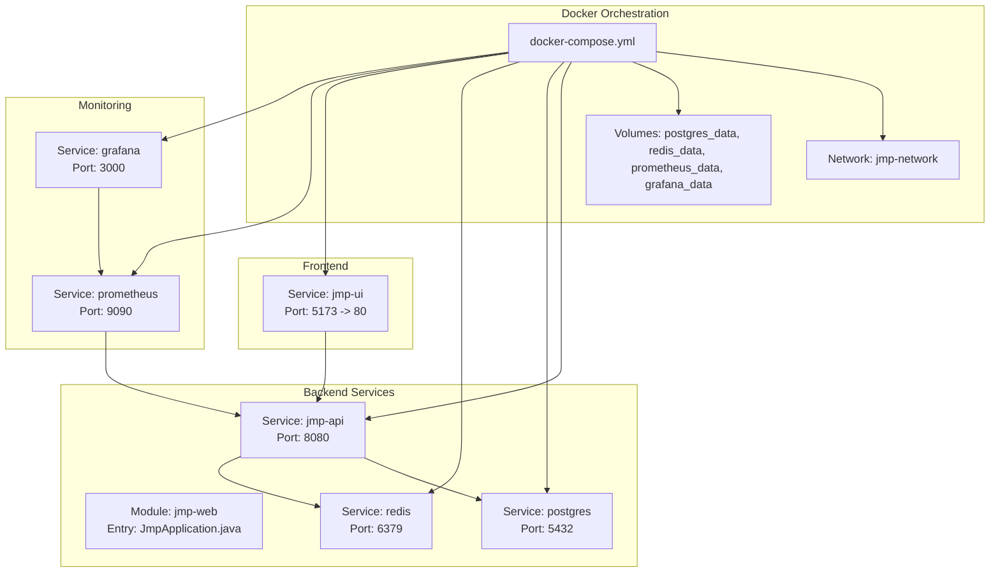
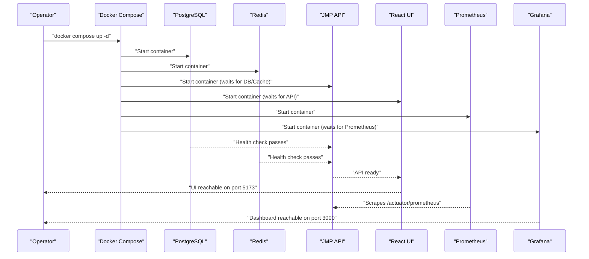

# Getting Started

<cite>
**Referenced Files in This Document**
- [docker-compose.yml](file://docker-compose.yml)
- [Dockerfile](file://Dockerfile)
- [pom.xml](file://pom.xml)
- [application.yml](file://jmp-web/src/main/resources/application.yml)
- [V1__init_schema.sql](file://jmp-web/src/main/resources/db/migration/V1__init_schema.sql)
- [V2__seed_data.sql](file://jmp-web/src/main/resources/db/migration/V2__seed_data.sql)
- [JmpApplication.java](file://jmp-web/src/main/java/com/jmp/web/JmpApplication.java)
- [prometheus.yml](file://monitoring/prometheus.yml)
- [jmp-ui Dockerfile](file://jmp-ui/Dockerfile)
- [api.ts](file://jmp-ui/src/services/api.ts)
- [LoginPage.tsx](file://jmp-ui/src/pages/LoginPage.tsx)
</cite>

## Table of Contents
1. [Introduction](#introduction)
2. [Project Structure](#project-structure)
3. [Prerequisites](#prerequisites)
4. [Installation Steps](#installation-steps)
5. [Environment Setup](#environment-setup)
6. [Initial Configuration](#initial-configuration)
7. [System Startup Process](#system-startup-process)
8. [Verification and Access](#verification-and-access)
9. [Common Setup Issues and Troubleshooting](#common-setup-issues-and-troubleshooting)
10. [Security Considerations](#security-considerations)
11. [Conclusion](#conclusion)

## Introduction
This guide helps you install and run the Jitsi Management Platform (JMP) locally using Docker and Docker Compose. It covers prerequisites, environment setup, configuration, startup, verification, and troubleshooting. The platform consists of:
- A Spring Boot backend exposing REST APIs and admin UI
- A PostgreSQL database with Flyway migrations
- A Redis cache
- A React-based admin frontend
- Monitoring with Prometheus and Grafana

## Project Structure
The repository is a multi-module Maven project with separate modules for domain, application, infrastructure, API, and web layers. Docker Compose orchestrates the backend, database, cache, frontend, and monitoring stack.

**Diagram sources**
- [docker-compose.yml:6-129](file://docker-compose.yml#L6-L129)
- [JmpApplication.java:11-26](file://jmp-web/src/main/java/com/jmp/web/JmpApplication.java#L11-L26)

**Section sources**
- [docker-compose.yml:1-129](file://docker-compose.yml#L1-L129)
- [pom.xml:40-46](file://pom.xml#L40-L46)

## Prerequisites
- Operating system: Linux/macOS/Windows with Docker Desktop or Docker Engine
- Docker Engine: Ensure Docker is installed and running
- Docker Compose: Ensure Docker Compose v2+ is installed
- Java: The backend runs on Java 21 (image includes JDK 21 for building, JRE 21 for runtime)
- Disk space: At least 2 GB free for containers and volumes

**Section sources**
- [Dockerfile:5-54](file://Dockerfile#L5-L54)
- [pom.xml:48-52](file://pom.xml#L48-L52)

## Installation Steps
1. Clone or download the repository to your machine.
2. Open a terminal in the repository root.
3. Build and start all services with Docker Compose:
   - Run: docker compose up -d
   - This builds the backend image (multi-stage), starts Postgres, Redis, the API, the React UI, Prometheus, and Grafana.
4. Wait for all services to become healthy:
   - Postgres and Redis health checks are embedded in their service definitions.
   - The API exposes an actuator health endpoint for readiness.
   - The UI becomes reachable after the API is ready.

Notes:
- The backend image is built from the root Dockerfile, which compiles the Spring Boot application using Maven and packages it into a JAR.
- The UI image is built from the jmp-ui Dockerfile and served via Nginx.

**Section sources**
- [docker-compose.yml:44-86](file://docker-compose.yml#L44-L86)
- [Dockerfile:4-54](file://Dockerfile#L4-L54)
- [jmp-ui Dockerfile:4-33](file://jmp-ui/Dockerfile#L4-L33)

## Environment Setup
Set up environment variables for local development or production-like environments. The following variables are used by the services:

- Database
  - DB_URL: JDBC URL for PostgreSQL (default included in compose)
  - DB_USER: Database user (default included in compose)
  - DB_PASS: Database password (default included in compose)

- Cache
  - REDIS_URL: Redis host (default included in compose)
  - REDIS_PASS: Redis password (optional)

- Application
  - SERVER_PORT: API server port (default 8080)
  - SPRING_PROFILES_ACTIVE: Active Spring profile (e.g., docker, dev, prod)
  - JWT_ACCESS_SECRET: Secret for signing access tokens
  - JWT_REFRESH_SECRET: Secret for signing refresh tokens

- Frontend
  - VITE_API_URL: Base URL for API requests from the UI (default included in compose)

- Monitoring
  - Prometheus and Grafana are configured via compose and mounted configs.

Example environment variables (values shown are defaults present in compose):
- SPRING_PROFILES_ACTIVE=docker
- DB_URL=jdbc:postgresql://postgres:5432/jmp
- DB_USER=jmp
- DB_PASS=jmp
- REDIS_URL=redis
- JWT_ACCESS_SECRET=...
- JWT_REFRESH_SECRET=...
- VITE_API_URL=http://localhost:8080/api/v1

To override these in your environment:
- Use a .env file in the repository root or export variables in your shell before running docker compose.
- Alternatively, modify the environment blocks in docker-compose.yml for local testing.

**Section sources**
- [docker-compose.yml:49-84](file://docker-compose.yml#L49-L84)
- [application.yml:12-78](file://jmp-web/src/main/resources/application.yml#L12-L78)
- [prometheus.yml:18-22](file://monitoring/prometheus.yml#L18-L22)

## Initial Configuration
The backend reads configuration from application.yml and supports Spring profiles. Key areas:

- Datasource and JPA/Hibernate
  - JDBC URL, username, password, and HikariCP settings are configurable.
  - Hibernate dialect is PostgreSQL-specific.
  - SQL logging is disabled by default; debug logging can be enabled via log level settings.

- Flyway Migrations
  - Enabled by default.
  - Migrates schema under the jmp schema and seeds initial data.

- Redis
  - Host/port/password/timing configurable.
  - Pool sizing is tuned for moderate concurrency.

- Actuator and Metrics
  - Health, info, metrics, and Prometheus endpoints exposed.
  - Prometheus scraping enabled.

- OpenAPI/Swagger
  - Swagger UI and OpenAPI docs are configured.

- Security (JWT)
  - Access and refresh token secrets are configurable.
  - Token expiration minutes/days are configurable.

These settings are loaded from environment variables and application.yml.

**Section sources**
- [application.yml:12-128](file://jmp-web/src/main/resources/application.yml#L12-L128)

## System Startup Process
The startup sequence orchestrated by Docker Compose is as follows:

Key behaviors:
- Postgres and Redis health checks ensure readiness before the API starts.
- The API exposes an actuator health endpoint for readiness.
- The UI depends on the API and serves on port 5173 mapped to 80 inside the container.
- Prometheus scrapes the API’s metrics endpoint.
- Grafana depends on Prometheus and is pre-configured with dashboards and datasources.

**Diagram sources**
- [docker-compose.yml:19-71](file://docker-compose.yml#L19-L71)
- [prometheus.yml:18-22](file://monitoring/prometheus.yml#L18-L22)

**Section sources**
- [docker-compose.yml:6-129](file://docker-compose.yml#L6-L129)
- [prometheus.yml:1-23](file://monitoring/prometheus.yml#L1-L23)

## Verification and Access
After startup, verify the system:

- Backend API
  - Health: curl http://localhost:8080/actuator/health
  - OpenAPI/Swagger: http://localhost:8080/swagger-ui.html
  - Metrics: http://localhost:8080/actuator/prometheus

- Database
  - Connect to Postgres on localhost:5432 with user jmp and database jmp.
  - Confirm schema jmp exists and seed data is present.

- Cache
  - Redis CLI ping: docker compose exec redis redis-cli ping

- Frontend
  - UI: http://localhost:5173
  - Default credentials:
    - Super Admin: admin@jmp.local / admin123
    - Tenant Admin: tenant@jmp.local / tenant123

- Monitoring
  - Prometheus: http://localhost:9090
  - Grafana: http://localhost:3000 (default admin password configured in compose)

Basic usage:
- Log in via the UI using the default credentials.
- Navigate to Users and Conferences to explore the admin interface.
- Use the API endpoints documented in Swagger UI.

**Section sources**
- [application.yml:93-128](file://jmp-web/src/main/resources/application.yml#L93-L128)
- [V2__seed_data.sql:97-131](file://jmp-web/src/main/resources/db/migration/V2__seed_data.sql#L97-L131)
- [LoginPage.tsx:110-119](file://jmp-ui/src/pages/LoginPage.tsx#L110-L119)
- [prometheus.yml:18-22](file://monitoring/prometheus.yml#L18-L22)

## Common Setup Issues and Troubleshooting
- Network connectivity
  - Symptom: UI cannot reach the API or API returns connection refused.
  - Resolution: Ensure the compose network jmp-network is created and all services are on the same network. Verify port mappings and that no firewall blocks localhost:8080 or localhost:5173.

- Database connection problems
  - Symptom: API fails to start or throws database connection errors.
  - Resolution:
    - Confirm Postgres is healthy (compose healthcheck).
    - Verify DB_URL, DB_USER, DB_PASS match compose environment.
    - Check that the jmp schema exists and migrations ran (Flyway baseline-on-migrate is enabled).
    - Review API logs for SQL exceptions.

- Service startup failures
  - Symptom: API container exits quickly or remains unhealthy.
  - Resolution:
    - Inspect API logs for startup errors.
    - Ensure Redis is healthy before API starts (depends_on with health conditions).
    - Increase healthcheck timeouts if running on constrained hardware.

- Port conflicts
  - Symptom: Ports 5432, 6379, 8080, 5173, 9090, 3000 are already in use.
  - Resolution: Stop conflicting services or change port mappings in docker-compose.yml.

- JWT secrets and auth issues
  - Symptom: Login succeeds but subsequent requests fail with 401.
  - Resolution: Ensure JWT_ACCESS_SECRET and JWT_REFRESH_SECRET are consistent across restarts. Avoid rotating secrets mid-operation.

- CORS and proxying
  - Symptom: UI cannot call API in development mode.
  - Resolution: The UI expects VITE_API_URL to point to the API. Confirm the environment variable is set in the UI service.

**Section sources**
- [docker-compose.yml:19-71](file://docker-compose.yml#L19-L71)
- [application.yml:12-78](file://jmp-web/src/main/resources/application.yml#L12-L78)
- [V1__init_schema.sql:4-172](file://jmp-web/src/main/resources/db/migration/V1__init_schema.sql#L4-L172)
- [V2__seed_data.sql:1-131](file://jmp-web/src/main/resources/db/migration/V2__seed_data.sql#L1-L131)
- [api.ts:4-11](file://jmp-ui/src/services/api.ts#L4-L11)

## Security Considerations
Production hardening recommendations:
- Rotate JWT secrets regularly and store them securely (e.g., environment vaults).
- Use HTTPS/TLS termination in front of the API/UI.
- Restrict Prometheus/Grafana exposure; use reverse proxies with authentication.
- Harden Postgres with non-default passwords, disable unused extensions, and restrict network access.
- Enforce Spring Security rules and rate limiting where applicable.
- Keep images updated and scan for vulnerabilities.
- Use non-root users in containers (already applied in the runtime stage).

Operational notes:
- The current compose configuration uses default secrets for demo purposes. Replace them before deploying to production.
- The UI’s default credentials are intended for initial setup; change them immediately after first login.

**Section sources**
- [application.yml:72-78](file://jmp-web/src/main/resources/application.yml#L72-L78)
- [docker-compose.yml](file://docker-compose.yml#L11-L14, L55-L56, L107-L108)

## Conclusion
You now have a fully functional local deployment of the Jitsi Management Platform. The backend, database, cache, UI, and monitoring stack are orchestrated via Docker Compose. Use the verification steps to confirm everything is working, then explore the admin interface and APIs. For production, apply the security recommendations and tune environment variables accordingly.