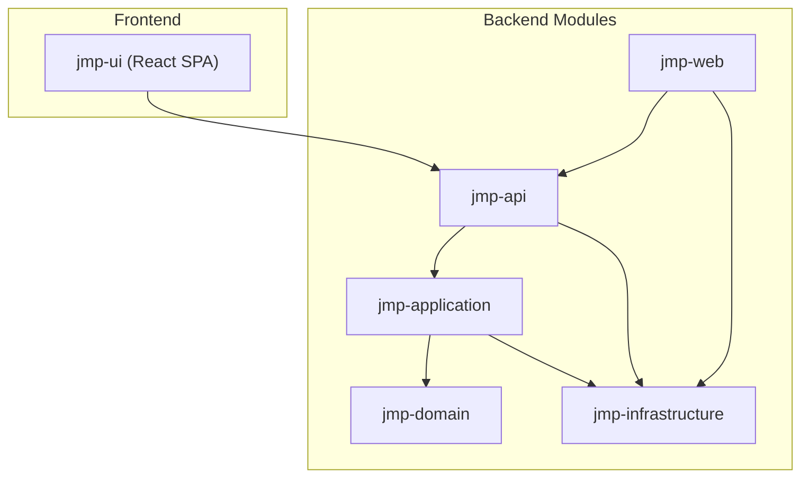
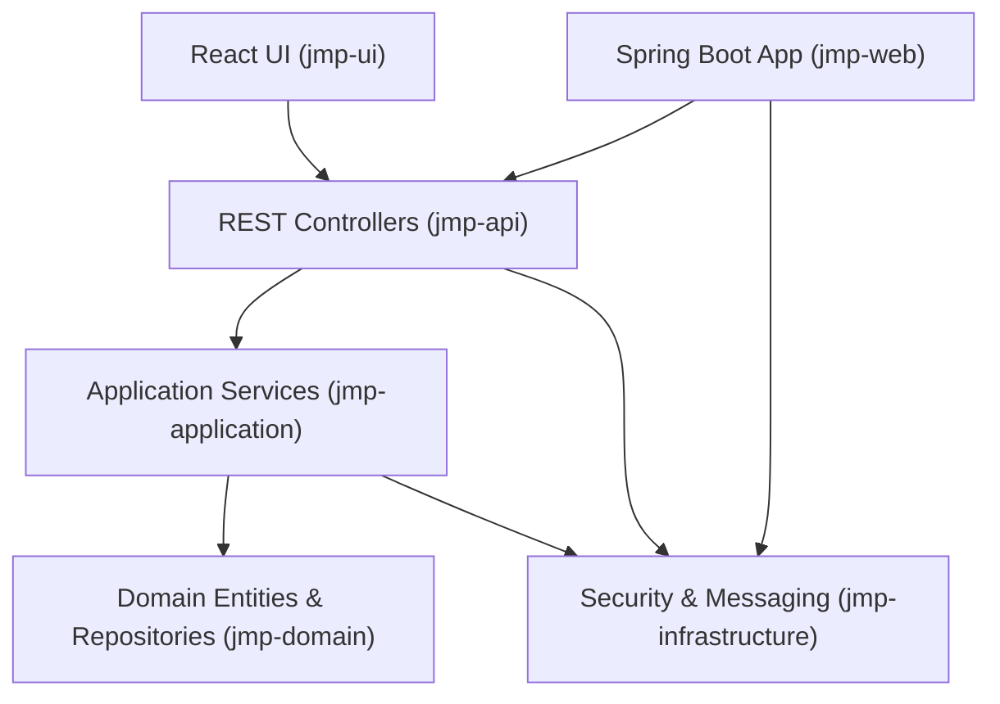
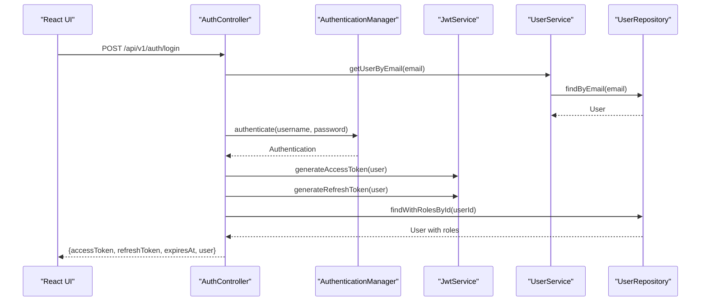
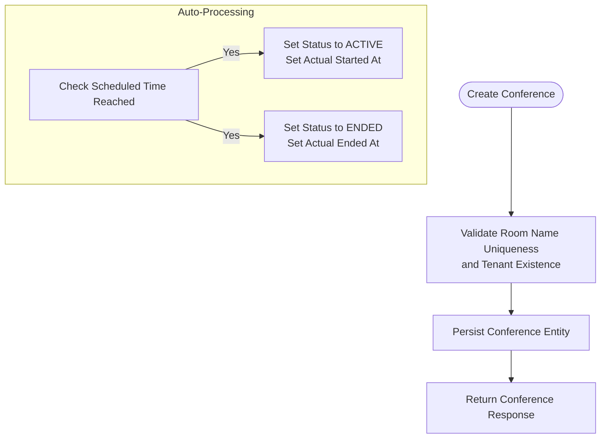
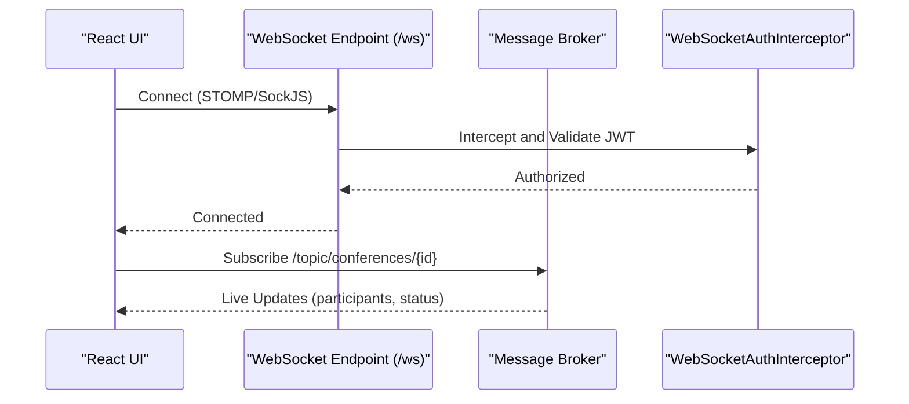
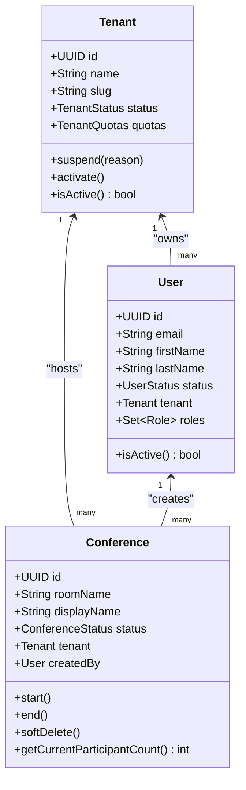
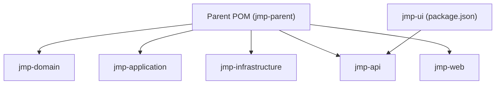

# Project Overview

<cite>
**Referenced Files in This Document**
- [pom.xml](file://pom.xml)
- [application.yml](file://jmp-web/src/main/resources/application.yml)
- [docker-compose.yml](file://docker-compose.yml)
- [Dockerfile](file://Dockerfile)
- [Tenant.java](file://jmp-domain/src/main/java/com/jmp/domain/entity/Tenant.java)
- [User.java](file://jmp-domain/src/main/java/com/jmp/domain/entity/User.java)
- [Conference.java](file://jmp-domain/src/main/java/com/jmp/domain/entity/Conference.java)
- [UserService.java](file://jmp-application/src/main/java/com/jmp/application/service/UserService.java)
- [ConferenceService.java](file://jmp-application/src/main/java/com/jmp/application/service/ConferenceService.java)
- [AuthController.java](file://jmp-api/src/main/java/com/jmp/api/controller/AuthController.java)
- [ConferenceController.java](file://jmp-api/src/main/java/com/jmp/api/controller/ConferenceController.java)
- [SecurityConfig.java](file://jmp-infrastructure/src/main/java/com/jmp/infrastructure/security/SecurityConfig.java)
- [WebSocketConfig.java](file://jmp-infrastructure/src/main/java/com/jmp/infrastructure/websocket/WebSocketConfig.java)
- [App.tsx](file://jmp-ui/src/App.tsx)
- [package.json](file://jmp-ui/package.json)
</cite>

## Table of Contents
1. [Introduction](#introduction)
2. [Project Structure](#project-structure)
3. [Core Components](#core-components)
4. [Architecture Overview](#architecture-overview)
5. [Detailed Component Analysis](#detailed-component-analysis)
6. [Dependency Analysis](#dependency-analysis)
7. [Performance Considerations](#performance-considerations)
8. [Troubleshooting Guide](#troubleshooting-guide)
9. [Conclusion](#conclusion)

## Introduction
The Jitsi Management Platform (JMP) is a centralized, enterprise-grade solution designed to administer, monitor, and manage Jitsi video conferences across multiple tenants. It provides robust multi-tenant isolation, fine-grained role-based access control, real-time communication via WebSockets, and integrated recording capabilities. The platform combines a Spring Boot backend, a modern React frontend, and a containerized infrastructure orchestrated by Docker Compose. It emphasizes security, observability, scalability, and operational simplicity, enabling organizations to scale video conferencing operations while maintaining strong governance and compliance.

## Project Structure
JMP follows a modular Maven monorepo layout with five primary modules:
- jmp-domain: Core domain entities, repositories, and value objects defining tenants, users, conferences, roles, permissions, and audit logs.
- jmp-application: Application services implementing business logic for user and conference management, DTOs, mappers, validators, and use cases.
- jmp-infrastructure: Infrastructure concerns including Spring Security, JWT filters, WebSocket configuration, persistence, caching, and storage integrations.
- jmp-api: REST API controllers exposing endpoints for authentication, user management, conference lifecycle, analytics, audit, and webhook integrations.
- jmp-web: Spring Boot web application bootstrapping the backend services and wiring module dependencies.
- jmp-ui: React-based single-page application providing administrative dashboards, conference management, and user administration.

**Diagram sources**
- [pom.xml:40-46](file://pom.xml#L40-L46)
- [docker-compose.yml:43-87](file://docker-compose.yml#L43-L87)

**Section sources**
- [pom.xml:40-46](file://pom.xml#L40-L46)
- [docker-compose.yml:43-87](file://docker-compose.yml#L43-L87)

## Core Components
- Multi-tenant architecture with tenant quotas and isolation enforced at the database and application layers.
- Role-based access control (RBAC) with predefined roles and permissions for participants, moderators, tenant admins, and super admins.
- JWT-based authentication and authorization with separate access and refresh tokens, secure hashing, and CORS support.
- Real-time communication via STOMP over WebSocket endpoints for live updates and notifications.
- Conference lifecycle management including scheduling, auto-start/end, participant tracking, and room configuration.
- Recording and streaming toggles per conference with tenant-level feature gating.
- Observability with Prometheus metrics and Grafana dashboards included in the Docker Compose stack.

Practical examples:
- Creating a conference for a tenant and generating a Jitsi JWT token for secure entry.
- Managing users within a tenant, assigning roles, and enforcing tenant-scoped permissions.
- Monitoring active conferences and viewing analytics through the API.

**Section sources**
- [Tenant.java:24-174](file://jmp-domain/src/main/java/com/jmp/domain/entity/Tenant.java#L24-L174)
- [User.java:23-164](file://jmp-domain/src/main/java/com/jmp/domain/entity/User.java#L23-L164)
- [Conference.java:25-217](file://jmp-domain/src/main/java/com/jmp/domain/entity/Conference.java#L25-L217)
- [UserService.java:28-190](file://jmp-application/src/main/java/com/jmp/application/service/UserService.java#L28-L190)
- [ConferenceService.java:25-225](file://jmp-application/src/main/java/com/jmp/application/service/ConferenceService.java#L25-L225)
- [AuthController.java:30-124](file://jmp-api/src/main/java/com/jmp/api/controller/AuthController.java#L30-L124)
- [ConferenceController.java:37-189](file://jmp-api/src/main/java/com/jmp/api/controller/ConferenceController.java#L37-L189)
- [SecurityConfig.java:28-90](file://jmp-infrastructure/src/main/java/com/jmp/infrastructure/security/SecurityConfig.java#L28-L90)
- [WebSocketConfig.java:23-70](file://jmp-infrastructure/src/main/java/com/jmp/infrastructure/websocket/WebSocketConfig.java#L23-L70)

## Architecture Overview
JMP employs a layered architecture with clear separation of concerns:
- Domain layer encapsulates business entities and invariants.
- Application layer orchestrates workflows and coordinates between domain and infrastructure.
- Infrastructure layer handles cross-cutting concerns like security, persistence, messaging, and external integrations.
- API layer exposes REST endpoints secured with JWT and method-level authorization.
- Web layer boots the Spring application and wires modules.
- UI layer provides a React SPA with routing, state management, and Material UI components.

**Diagram sources**
- [pom.xml:40-46](file://pom.xml#L40-L46)
- [AuthController.java:30-124](file://jmp-api/src/main/java/com/jmp/api/controller/AuthController.java#L30-L124)
- [ConferenceController.java:37-189](file://jmp-api/src/main/java/com/jmp/api/controller/ConferenceController.java#L37-L189)
- [UserService.java:28-190](file://jmp-application/src/main/java/com/jmp/application/service/UserService.java#L28-L190)
- [ConferenceService.java:25-225](file://jmp-application/src/main/java/com/jmp/application/service/ConferenceService.java#L25-L225)
- [SecurityConfig.java:28-90](file://jmp-infrastructure/src/main/java/com/jmp/infrastructure/security/SecurityConfig.java#L28-L90)
- [WebSocketConfig.java:23-70](file://jmp-infrastructure/src/main/java/com/jmp/infrastructure/websocket/WebSocketConfig.java#L23-L70)

## Detailed Component Analysis

### Authentication and Authorization Flow
The authentication flow integrates Spring Security, JWT generation, and tenant/user extraction from the access token.

**Diagram sources**
- [AuthController.java:42-81](file://jmp-api/src/main/java/com/jmp/api/controller/AuthController.java#L42-L81)
- [UserService.java:74-88](file://jmp-application/src/main/java/com/jmp/application/service/UserService.java#L74-L88)
- [SecurityConfig.java:42-75](file://jmp-infrastructure/src/main/java/com/jmp/infrastructure/security/SecurityConfig.java#L42-L75)

**Section sources**
- [AuthController.java:30-124](file://jmp-api/src/main/java/com/jmp/api/controller/AuthController.java#L30-L124)
- [SecurityConfig.java:28-90](file://jmp-infrastructure/src/main/java/com/jmp/infrastructure/security/SecurityConfig.java#L28-L90)

### Conference Lifecycle Management
Conference lifecycle includes creation, scheduling, auto-start/end, and deletion with tenant scoping and participant tracking.

**Diagram sources**
- [ConferenceService.java:40-65](file://jmp-application/src/main/java/com/jmp/application/service/ConferenceService.java#L40-L65)
- [ConferenceService.java:194-223](file://jmp-application/src/main/java/com/jmp/application/service/ConferenceService.java#L194-L223)
- [Conference.java:140-159](file://jmp-domain/src/main/java/com/jmp/domain/entity/Conference.java#L140-L159)

**Section sources**
- [ConferenceService.java:25-225](file://jmp-application/src/main/java/com/jmp/application/service/ConferenceService.java#L25-L225)
- [Conference.java:25-217](file://jmp-domain/src/main/java/com/jmp/domain/entity/Conference.java#L25-L217)

### Real-Time Communication via WebSockets
Real-time events are supported through STOMP over WebSocket endpoints with authentication interception.

**Diagram sources**
- [WebSocketConfig.java:32-50](file://jmp-infrastructure/src/main/java/com/jmp/infrastructure/websocket/WebSocketConfig.java#L32-L50)
- [App.tsx:10-31](file://jmp-ui/src/App.tsx#L10-L31)

**Section sources**
- [WebSocketConfig.java:23-70](file://jmp-infrastructure/src/main/java/com/jmp/infrastructure/websocket/WebSocketConfig.java#L23-L70)
- [App.tsx:1-34](file://jmp-ui/src/App.tsx#L1-L34)

### Multi-Tenant User and Conference Management
Tenant-scoped management ensures isolation and quota enforcement.

**Diagram sources**
- [Tenant.java:24-174](file://jmp-domain/src/main/java/com/jmp/domain/entity/Tenant.java#L24-L174)
- [User.java:23-164](file://jmp-domain/src/main/java/com/jmp/domain/entity/User.java#L23-L164)
- [Conference.java:25-217](file://jmp-domain/src/main/java/com/jmp/domain/entity/Conference.java#L25-L217)

**Section sources**
- [Tenant.java:24-174](file://jmp-domain/src/main/java/com/jmp/domain/entity/Tenant.java#L24-L174)
- [User.java:23-164](file://jmp-domain/src/main/java/com/jmp/domain/entity/User.java#L23-L164)
- [Conference.java:25-217](file://jmp-domain/src/main/java/com/jmp/domain/entity/Conference.java#L25-L217)

## Dependency Analysis
JMP’s parent POM defines shared dependency versions and plugin management across modules. The backend leverages Spring Boot starters, Spring Security, JPA/Hibernate, Flyway migrations, JWT libraries, resilience patterns, and observability tooling. The UI relies on React, Material UI, Axios, React Router, and Zustand for state management.

**Diagram sources**
- [pom.xml:40-46](file://pom.xml#L40-L46)
- [package.json:12-23](file://jmp-ui/package.json#L12-L23)

**Section sources**
- [pom.xml:79-167](file://pom.xml#L79-L167)
- [package.json:1-39](file://jmp-ui/package.json#L1-L39)

## Performance Considerations
- Database tuning: Connection pooling, batching, and ordered inserts/updates configured for throughput.
- Caching: Redis configured for rate limiting and session caching.
- Metrics and tracing: Micrometer Prometheus exporter enabled; structured logging with trace IDs.
- Containerization: Multi-stage Docker builds reduce attack surface and improve startup times.
- Scalability: Stateless sessions, horizontal scaling of API containers, and in-memory WebSocket broker suitable for development; production-ready message brokers recommended.

[No sources needed since this section provides general guidance]

## Troubleshooting Guide
Common areas to inspect:
- Health checks: Verify backend and UI health endpoints and container readiness.
- Database connectivity: Confirm JDBC URL, credentials, and schema migration status.
- JWT secrets: Ensure access and refresh token secrets are set consistently across environments.
- CORS: Validate allowed origins for local development and production domains.
- WebSocket connections: Confirm interceptor validation and broker configuration.

Operational references:
- Health endpoint exposure and Prometheus metrics configuration.
- Container health checks and restart policies.
- Structured logging with trace IDs for correlation.

**Section sources**
- [application.yml:93-112](file://jmp-web/src/main/resources/application.yml#L93-L112)
- [docker-compose.yml:66-71](file://docker-compose.yml#L66-L71)
- [Dockerfile:47-50](file://Dockerfile#L47-L50)

## Conclusion
JMP delivers a comprehensive, enterprise-grade foundation for managing Jitsi video conferences at scale. Its modular architecture, strong tenant isolation, robust RBAC, real-time capabilities, and containerized deployment streamline operations while maintaining security and observability. By leveraging Spring Boot and React, and integrating Redis, PostgreSQL, and monitoring stacks, JMP supports both rapid development and reliable production operations.