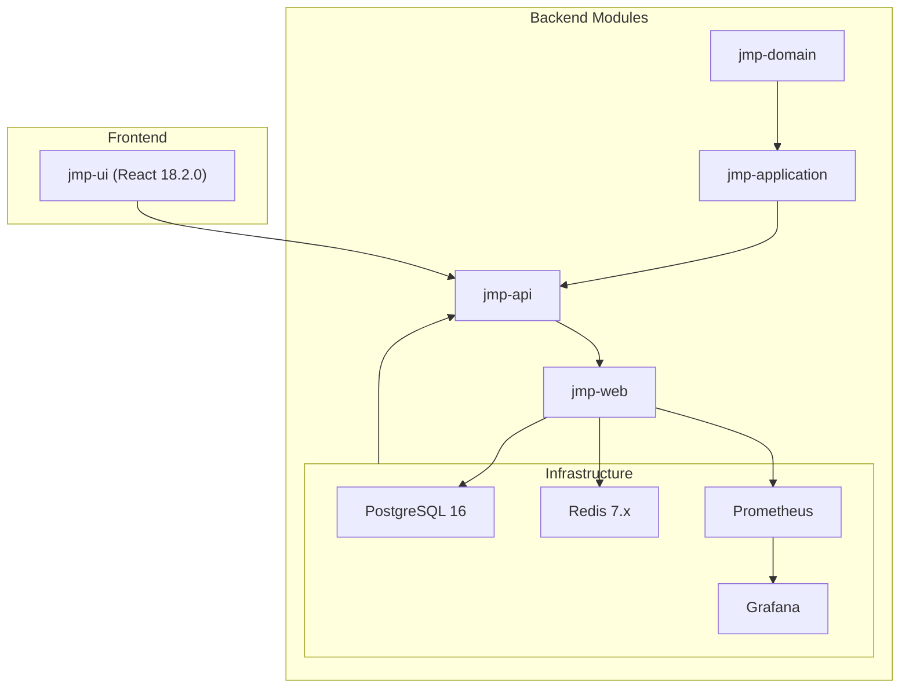
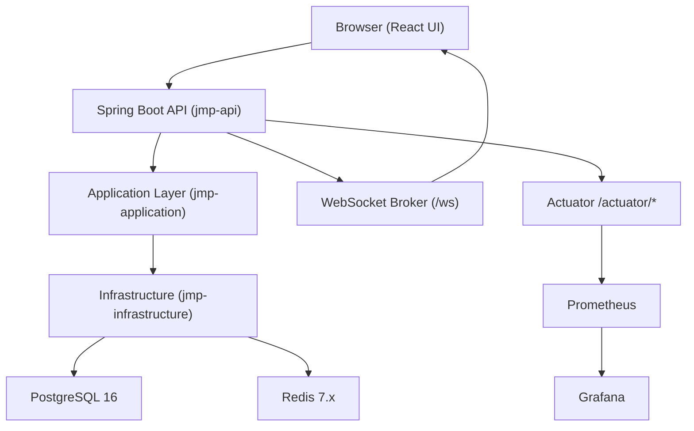
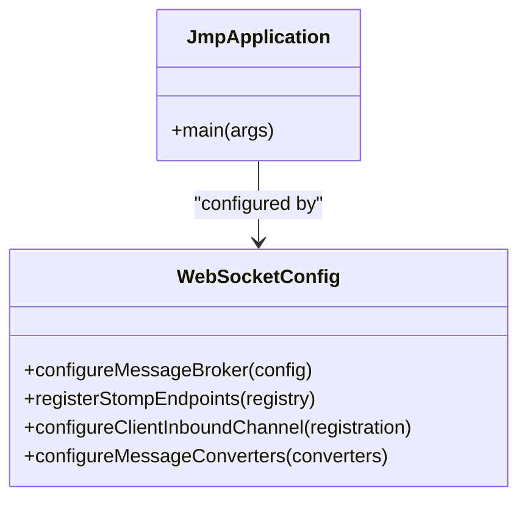
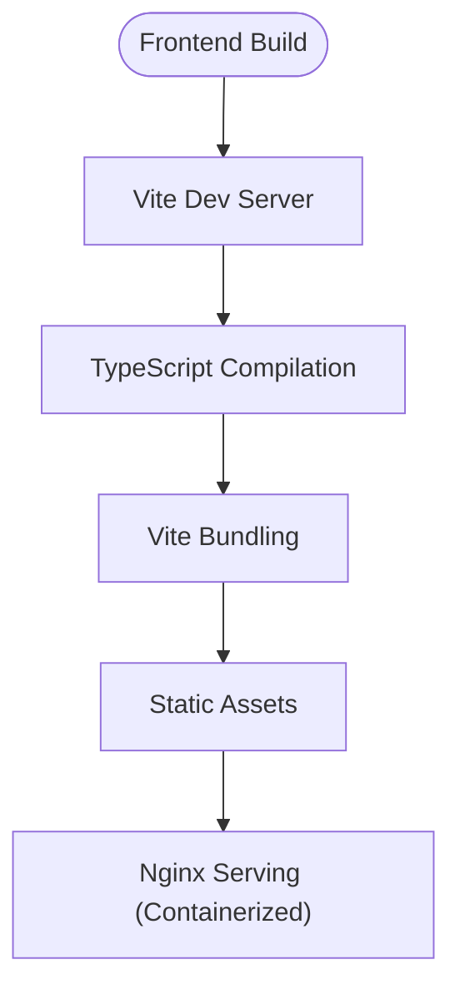
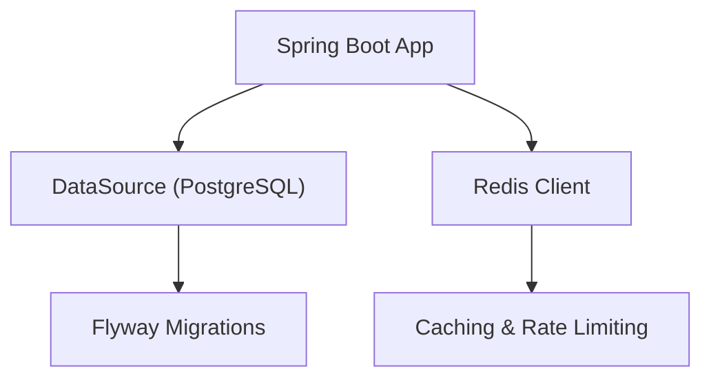
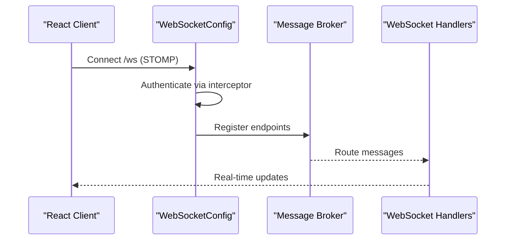
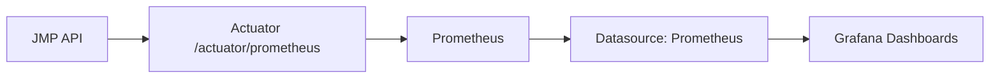
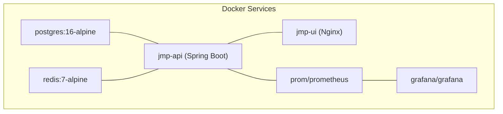
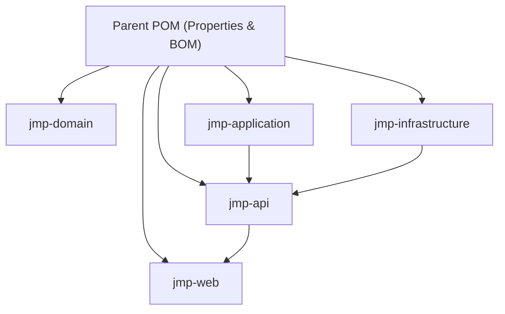

# Technology Stack

<cite>
**Referenced Files in This Document**
- [pom.xml](file://pom.xml)
- [jmp-api/pom.xml](file://jmp-api/pom.xml)
- [jmp-application/pom.xml](file://jmp-application/pom.xml)
- [jmp-domain/pom.xml](file://jmp-domain/pom.xml)
- [jmp-infrastructure/pom.xml](file://jmp-infrastructure/pom.xml)
- [jmp-web/pom.xml](file://jmp-web/pom.xml)
- [docker-compose.yml](file://docker-compose.yml)
- [Dockerfile](file://Dockerfile)
- [application.yml](file://jmp-web/src/main/resources/application.yml)
- [JmpApplication.java](file://jmp-web/src/main/java/com/jmp/web/JmpApplication.java)
- [WebSocketConfig.java](file://jmp-infrastructure/src/main/java/com/jmp/infrastructure/websocket/WebSocketConfig.java)
- [package.json](file://jmp-ui/package.json)
- [vite.config.ts](file://jmp-ui/vite.config.ts)
- [prometheus.yml](file://monitoring/prometheus.yml)
- [datasources.yml](file://monitoring/grafana/datasources/datasources.yml)
</cite>

## Table of Contents
1. [Introduction](#introduction)
2. [Project Structure](#project-structure)
3. [Core Components](#core-components)
4. [Architecture Overview](#architecture-overview)
5. [Detailed Component Analysis](#detailed-component-analysis)
6. [Dependency Analysis](#dependency-analysis)
7. [Performance Considerations](#performance-considerations)
8. [Troubleshooting Guide](#troubleshooting-guide)
9. [Conclusion](#conclusion)

## Introduction
This document provides comprehensive technology stack documentation for the Jitsi Management Platform (JMP). It covers backend services powered by Spring Boot 3.2.5, a React 18.2.0 frontend with TypeScript, PostgreSQL 16 for persistence, Redis 7.x for caching and real-time features, and Docker-based containerization. It also details the monitoring stack using Prometheus and Grafana, along with framework and library choices, version compatibility, and integration patterns. The documentation includes dependency management strategies via Maven BOM and npm package.json configurations.

## Project Structure
The project follows a modular Maven layout with clear separation of concerns:
- Domain module: Entities, repositories, and domain logic
- Application module: Services, use cases, DTOs, and mapping
- Infrastructure module: Persistence, security, external integrations, caching, messaging, and monitoring
- API module: REST controllers, exception handling, and API documentation
- Web module: Spring Boot application entry point and packaging
- UI module: React 18.2.0 frontend with Vite 5.2.11 and TypeScript
- Monitoring: Prometheus and Grafana configurations

**Diagram sources**
- [pom.xml:40-46](file://pom.xml#L40-L46)
- [docker-compose.yml:6-129](file://docker-compose.yml#L6-L129)

**Section sources**
- [pom.xml:40-46](file://pom.xml#L40-L46)
- [docker-compose.yml:6-129](file://docker-compose.yml#L6-L129)

## Core Components
- Backend (Spring Boot 3.2.5): Modular architecture with layered design, JPA/Hibernate for persistence, Spring Security for authentication/authorization, JWT for stateless tokens, Flyway for migrations, Redis for caching and rate limiting, resilience patterns via Resilience4j and Bucket4j, and Micrometer with Prometheus for observability.
- Frontend (React 18.2.0 + TypeScript): Component-driven UI with routing, state management, Material-UI 5.15.14 for UI primitives, Axios for HTTP requests, and Vite 5.2.11 for fast builds and development.
- Database (PostgreSQL 16): Structured relational data with schema validation and migrations.
- Caching/Real-time (Redis 7.x): Session caching, rate limiting, and WebSocket message broker support.
- Containerization (Docker): Multi-stage builds for backend and Nginx-based serving for the UI, orchestrated via docker-compose.
- Monitoring (Prometheus + Grafana): Metrics scraping from Spring Boot Actuator and dashboard provisioning.

**Section sources**
- [pom.xml:48-77](file://pom.xml#L48-L77)
- [jmp-infrastructure/pom.xml:30-147](file://jmp-infrastructure/pom.xml#L30-L147)
- [jmp-api/pom.xml:17-59](file://jmp-api/pom.xml#L17-L59)
- [jmp-application/pom.xml:17-72](file://jmp-application/pom.xml#L17-L72)
- [jmp-domain/pom.xml:17-54](file://jmp-domain/pom.xml#L17-L54)
- [application.yml:12-128](file://jmp-web/src/main/resources/application.yml#L12-L128)
- [docker-compose.yml:6-129](file://docker-compose.yml#L6-L129)
- [prometheus.yml:13-23](file://monitoring/prometheus.yml#L13-L23)
- [datasources.yml:4-11](file://monitoring/grafana/datasources/datasources.yml#L4-L11)

## Architecture Overview
The system integrates a Spring Boot backend with a React frontend, connected through REST and WebSocket channels. Data is persisted in PostgreSQL, cached in Redis, and monitored via Prometheus and Grafana. Docker orchestrates all services.

**Diagram sources**
- [JmpApplication.java:15-26](file://jmp-web/src/main/java/com/jmp/web/JmpApplication.java#L15-L26)
- [WebSocketConfig.java:27-70](file://jmp-infrastructure/src/main/java/com/jmp/infrastructure/websocket/WebSocketConfig.java#L27-L70)
- [application.yml:93-128](file://jmp-web/src/main/resources/application.yml#L93-L128)
- [docker-compose.yml:43-87](file://docker-compose.yml#L43-L87)
- [prometheus.yml:18-22](file://monitoring/prometheus.yml#L18-L22)

## Detailed Component Analysis

### Backend Technologies and Frameworks
- Spring Boot 3.2.5: Application entry point and packaging configuration.
- Spring Security 6.2.4: Authentication, authorization, and JWT integration.
- Spring Data JPA + Hibernate 6.4.4: ORM, entity management, and SQL dialect configuration.
- PostgreSQL 16 + Flyway 10.11.0: Schema migration and validation.
- Redis 7.x: Caching, rate limiting, and WebSocket message broker.
- Resilience4j 2.1.0 + Bucket4j 8.10.1: Circuit breaking and rate limiting.
- Micrometer 1.12.5 + Prometheus 2.5.0: Metrics collection and export.
- OpenAPI/SpringDoc 2.5.0: API documentation.
- WebSocket: STOMP over SockJS for real-time events.

**Diagram sources**
- [JmpApplication.java:15-26](file://jmp-web/src/main/java/com/jmp/web/JmpApplication.java#L15-L26)
- [WebSocketConfig.java:27-70](file://jmp-infrastructure/src/main/java/com/jmp/infrastructure/websocket/WebSocketConfig.java#L27-L70)

**Section sources**
- [pom.xml:54-67](file://pom.xml#L54-L67)
- [jmp-infrastructure/pom.xml:30-147](file://jmp-infrastructure/pom.xml#L30-L147)
- [jmp-api/pom.xml:17-59](file://jmp-api/pom.xml#L17-L59)
- [application.yml:12-128](file://jmp-web/src/main/resources/application.yml#L12-L128)
- [WebSocketConfig.java:27-70](file://jmp-infrastructure/src/main/java/com/jmp/infrastructure/websocket/WebSocketConfig.java#L27-L70)

### Frontend Technologies and Frameworks
- React 18.2.0 + TypeScript: Type-safe UI components and routing.
- Material-UI 5.15.14: UI components and theming.
- Vite 5.2.11: Fast build toolchain and dev server.
- Axios: HTTP client for API communication.
- Zustand: Lightweight state management.
- ESLint + TypeScript ESlint: Code quality and linting.

**Diagram sources**
- [package.json:6-11](file://jmp-ui/package.json#L6-L11)
- [vite.config.ts:1-8](file://jmp-ui/vite.config.ts#L1-L8)

**Section sources**
- [package.json:12-38](file://jmp-ui/package.json#L12-L38)
- [vite.config.ts:1-8](file://jmp-ui/vite.config.ts#L1-L8)

### Database and Caching
- PostgreSQL 16 configured with HikariCP connection pooling and Hibernate dialect.
- Flyway manages schema migrations under the "jmp" schema.
- Redis 7.x provides caching and rate limiting; WebSocket message broker is enabled.

**Diagram sources**
- [application.yml:12-56](file://jmp-web/src/main/resources/application.yml#L12-L56)
- [docker-compose.yml:8-42](file://docker-compose.yml#L8-L42)

**Section sources**
- [application.yml:12-56](file://jmp-web/src/main/resources/application.yml#L12-L56)
- [docker-compose.yml:8-42](file://docker-compose.yml#L8-L42)

### Real-time Features (WebSocket)
- STOMP endpoints with SockJS fallback.
- Authentication interceptor for WebSocket connections.
- In-memory broker configured; production-ready deployments can integrate RabbitMQ or Redis.

**Diagram sources**
- [WebSocketConfig.java:27-70](file://jmp-infrastructure/src/main/java/com/jmp/infrastructure/websocket/WebSocketConfig.java#L27-L70)

**Section sources**
- [WebSocketConfig.java:27-70](file://jmp-infrastructure/src/main/java/com/jmp/infrastructure/websocket/WebSocketConfig.java#L27-L70)

### Monitoring Stack (Prometheus + Grafana)
- Spring Boot Actuator exposes metrics endpoints.
- Prometheus scrapes metrics from the API service.
- Grafana consumes Prometheus data sources for dashboards.

**Diagram sources**
- [application.yml:93-112](file://jmp-web/src/main/resources/application.yml#L93-L112)
- [prometheus.yml:18-22](file://monitoring/prometheus.yml#L18-L22)
- [datasources.yml:4-11](file://monitoring/grafana/datasources/datasources.yml#L4-L11)

**Section sources**
- [application.yml:93-112](file://jmp-web/src/main/resources/application.yml#L93-L112)
- [prometheus.yml:18-22](file://monitoring/prometheus.yml#L18-L22)
- [datasources.yml:4-11](file://monitoring/grafana/datasources/datasources.yml#L4-L11)

### Containerization and Orchestration
- Multi-stage Docker build for Spring Boot application with non-root user and health checks.
- Frontend served via Nginx inside a container.
- docker-compose orchestrates PostgreSQL, Redis, API, UI, Prometheus, and Grafana.

**Diagram sources**
- [Dockerfile:4-54](file://Dockerfile#L4-L54)
- [docker-compose.yml:6-129](file://docker-compose.yml#L6-L129)

**Section sources**
- [Dockerfile:4-54](file://Dockerfile#L4-L54)
- [docker-compose.yml:6-129](file://docker-compose.yml#L6-L129)

## Dependency Analysis
The parent POM defines centralized property and dependency management versions, ensuring consistent versions across modules. Each module declares only required dependencies, reducing coupling and enabling independent builds.

**Diagram sources**
- [pom.xml:48-167](file://pom.xml#L48-L167)
- [pom.xml:40-46](file://pom.xml#L40-L46)

**Section sources**
- [pom.xml:48-167](file://pom.xml#L48-L167)
- [pom.xml:40-46](file://pom.xml#L40-L46)

## Performance Considerations
- Database tuning: HikariCP connection pool settings are configured for throughput and responsiveness.
- JPA batching: Hibernate batch inserts and updates to reduce round trips.
- Compression: Gzip compression for API responses.
- Caching: Redis for hot data and rate limiting to protect downstream systems.
- Observability: Prometheus metrics and Grafana dashboards enable proactive performance monitoring.

[No sources needed since this section provides general guidance]

## Troubleshooting Guide
- Health checks: Verify service readiness via docker-compose health checks and Actuator health endpoint.
- Logs: Structured logging with JSON format and trace correlation IDs.
- Metrics: Confirm Prometheus scraping target and Grafana datasource connectivity.
- WebSocket: Ensure STOMP endpoint accessibility and authentication interceptor behavior.

**Section sources**
- [docker-compose.yml:19-72](file://docker-compose.yml#L19-L72)
- [application.yml:80-91](file://jmp-web/src/main/resources/application.yml#L80-L91)
- [application.yml:93-112](file://jmp-web/src/main/resources/application.yml#L93-L112)
- [WebSocketConfig.java:42-50](file://jmp-infrastructure/src/main/java/com/jmp/infrastructure/websocket/WebSocketConfig.java#L42-L50)

## Conclusion
The Jitsi Management Platform leverages a modern, modular, and container-first architecture. The backend benefits from Spring Boot 3.2.5, Spring Security, JPA/Hibernate, Redis, and comprehensive observability. The frontend is built with React 18.2.0 and TypeScript, supported by Vite and Material-UI. PostgreSQL 16 and Redis 7.x provide robust persistence and real-time capabilities, while Docker and docker-compose streamline deployment. The monitoring stack with Prometheus and Grafana ensures continuous insight into system behavior.