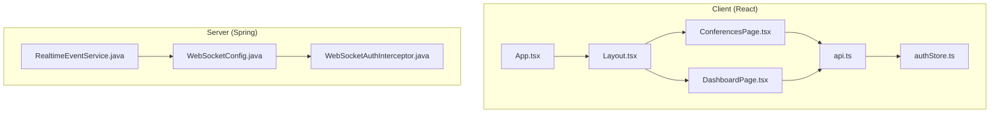
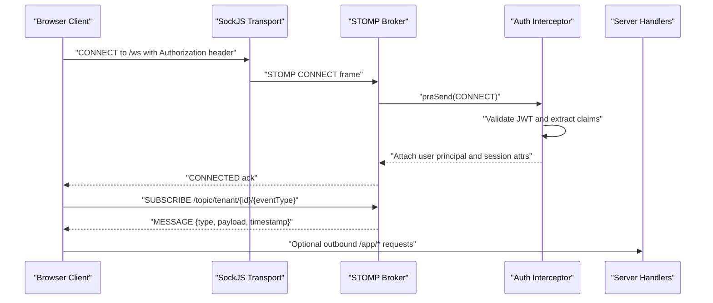
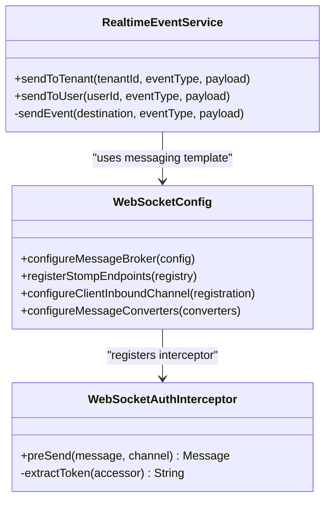
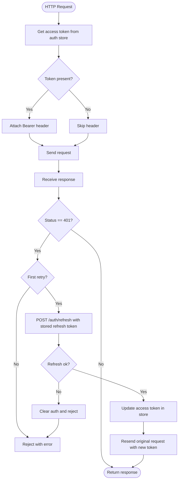
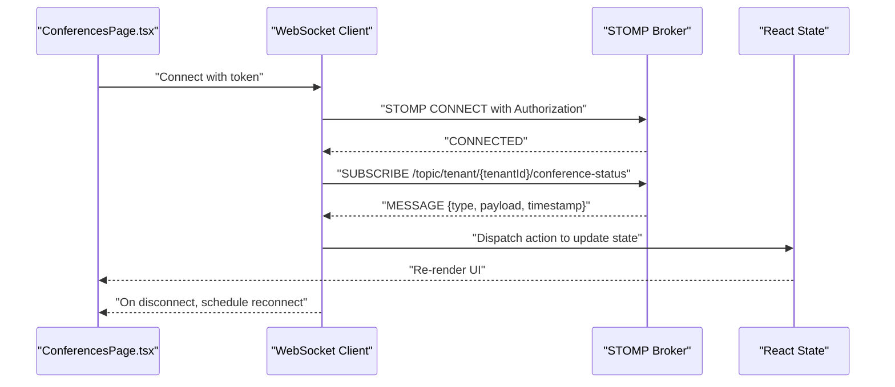
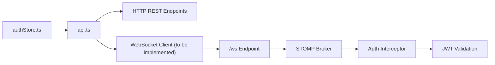

# Client-Side Integration

<cite>
**Referenced Files in This Document**
- [App.tsx](file://jmp-ui/src/App.tsx)
- [Layout.tsx](file://jmp-ui/src/components/Layout.tsx)
- [ConferencesPage.tsx](file://jmp-ui/src/pages/ConferencesPage.tsx)
- [DashboardPage.tsx](file://jmp-ui/src/pages/DashboardPage.tsx)
- [api.ts](file://jmp-ui/src/services/api.ts)
- [authStore.ts](file://jmp-ui/src/store/authStore.ts)
- [WebSocketConfig.java](file://jmp-infrastructure/src/main/java/com/jmp/infrastructure/websocket/WebSocketConfig.java)
- [WebSocketAuthInterceptor.java](file://jmp-infrastructure/src/main/java/com/jmp/infrastructure/websocket/WebSocketAuthInterceptor.java)
- [RealtimeEventService.java](file://jmp-infrastructure/src/main/java/com/jmp/infrastructure/websocket/RealtimeEventService.java)
</cite>

## Table of Contents
1. [Introduction](#introduction)
2. [Project Structure](#project-structure)
3. [Core Components](#core-components)
4. [Architecture Overview](#architecture-overview)
5. [Detailed Component Analysis](#detailed-component-analysis)
6. [Dependency Analysis](#dependency-analysis)
7. [Performance Considerations](#performance-considerations)
8. [Troubleshooting Guide](#troubleshooting-guide)
9. [Conclusion](#conclusion)
10. [Appendices](#appendices)

## Introduction
This document explains how the client-side integrates with the server’s real-time infrastructure to deliver live updates in the React application. It focuses on:
- How the backend exposes WebSocket endpoints and STOMP/SockJS support
- How the backend authenticates WebSocket connections using JWT
- How the frontend currently handles authentication and HTTP APIs
- Practical guidance for adding a JavaScript/TypeScript WebSocket client to subscribe to event channels, handle messages, manage authentication tokens, and update React components reactively
- Browser compatibility, mobile considerations, and performance optimization strategies

Note: As of the current repository snapshot, the React application does not include a WebSocket client. The guidance below provides a recommended implementation pattern that aligns with the backend’s STOMP/SockJS configuration and JWT-based authentication.

## Project Structure
The client-side application is a React + TypeScript app built with Vite. The server-side provides Spring WebSocket + STOMP configuration and JWT-based authentication for WebSocket connections.

**Diagram sources**
- [App.tsx:1-34](file://jmp-ui/src/App.tsx#L1-L34)
- [Layout.tsx:1-167](file://jmp-ui/src/components/Layout.tsx#L1-L167)
- [ConferencesPage.tsx:1-299](file://jmp-ui/src/pages/ConferencesPage.tsx#L1-L299)
- [DashboardPage.tsx:1-142](file://jmp-ui/src/pages/DashboardPage.tsx#L1-L142)
- [api.ts:1-93](file://jmp-ui/src/services/api.ts#L1-L93)
- [authStore.ts:1-47](file://jmp-ui/src/store/authStore.ts#L1-L47)
- [WebSocketConfig.java:1-70](file://jmp-infrastructure/src/main/java/com/jmp/infrastructure/websocket/WebSocketConfig.java#L1-L70)
- [WebSocketAuthInterceptor.java:1-94](file://jmp-infrastructure/src/main/java/com/jmp/infrastructure/websocket/WebSocketAuthInterceptor.java#L1-L94)
- [RealtimeEventService.java:1-141](file://jmp-infrastructure/src/main/java/com/jmp/infrastructure/websocket/RealtimeEventService.java#L1-L141)

**Section sources**
- [App.tsx:1-34](file://jmp-ui/src/App.tsx#L1-L34)
- [Layout.tsx:1-167](file://jmp-ui/src/components/Layout.tsx#L1-L167)
- [ConferencesPage.tsx:1-299](file://jmp-ui/src/pages/ConferencesPage.tsx#L1-L299)
- [DashboardPage.tsx:1-142](file://jmp-ui/src/pages/DashboardPage.tsx#L1-L142)
- [api.ts:1-93](file://jmp-ui/src/services/api.ts#L1-L93)
- [authStore.ts:1-47](file://jmp-ui/src/store/authStore.ts#L1-L47)
- [WebSocketConfig.java:1-70](file://jmp-infrastructure/src/main/java/com/jmp/infrastructure/websocket/WebSocketConfig.java#L1-L70)
- [WebSocketAuthInterceptor.java:1-94](file://jmp-infrastructure/src/main/java/com/jmp/infrastructure/websocket/WebSocketAuthInterceptor.java#L1-L94)
- [RealtimeEventService.java:1-141](file://jmp-infrastructure/src/main/java/com/jmp/infrastructure/websocket/RealtimeEventService.java#L1-L141)

## Core Components
- Backend WebSocket configuration enables STOMP over SockJS and native WebSocket, registers an authentication interceptor, and sets JSON message conversion.
- JWT-based authentication is validated during the STOMP CONNECT phase; successful authentication attaches user identity and session attributes.
- Event publishing service supports broadcasting to tenants and individual users via STOMP destinations.

Key backend elements:
- WebSocket endpoint: /ws with SockJS fallback and a native WebSocket variant
- Message broker destinations: /topic, /queue, and /user
- Authentication interceptor validates Authorization header or login query param for SockJS

Frontend building blocks:
- Authentication store persists user, access token, and refresh token
- Axios API client injects Authorization headers and refreshes tokens on 401
- Pages consume conference and user APIs but do not yet subscribe to WebSocket channels

**Section sources**
- [WebSocketConfig.java:42-50](file://jmp-infrastructure/src/main/java/com/jmp/infrastructure/websocket/WebSocketConfig.java#L42-L50)
- [WebSocketAuthInterceptor.java:33-73](file://jmp-infrastructure/src/main/java/com/jmp/infrastructure/websocket/WebSocketAuthInterceptor.java#L33-L73)
- [RealtimeEventService.java:28-39](file://jmp-infrastructure/src/main/java/com/jmp/infrastructure/websocket/RealtimeEventService.java#L28-L39)
- [authStore.ts:23-46](file://jmp-ui/src/store/authStore.ts#L23-L46)
- [api.ts:14-58](file://jmp-ui/src/services/api.ts#L14-L58)

## Architecture Overview
The system uses Spring WebSocket + STOMP with JWT authentication. Clients connect to /ws (SockJS-enabled) and optionally to the native WebSocket endpoint. After successful authentication, clients subscribe to topic channels scoped by tenant and event type.

**Diagram sources**
- [WebSocketConfig.java:42-50](file://jmp-infrastructure/src/main/java/com/jmp/infrastructure/websocket/WebSocketConfig.java#L42-L50)
- [WebSocketAuthInterceptor.java:33-73](file://jmp-infrastructure/src/main/java/com/jmp/infrastructure/websocket/WebSocketAuthInterceptor.java#L33-L73)
- [RealtimeEventService.java:28-39](file://jmp-infrastructure/src/main/java/com/jmp/infrastructure/websocket/RealtimeEventService.java#L28-L39)

## Detailed Component Analysis

### Backend WebSocket Configuration
- Enables a simple in-memory broker for topics and queues
- Registers /ws endpoint with SockJS and a native WebSocket variant
- Adds a JSON message converter and inbound channel interceptor for authentication

**Diagram sources**
- [WebSocketConfig.java:27-69](file://jmp-infrastructure/src/main/java/com/jmp/infrastructure/websocket/WebSocketConfig.java#L27-L69)
- [WebSocketAuthInterceptor.java:29-93](file://jmp-infrastructure/src/main/java/com/jmp/infrastructure/websocket/WebSocketAuthInterceptor.java#L29-L93)
- [RealtimeEventService.java:20-101](file://jmp-infrastructure/src/main/java/com/jmp/infrastructure/websocket/RealtimeEventService.java#L20-L101)

**Section sources**
- [WebSocketConfig.java:32-69](file://jmp-infrastructure/src/main/java/com/jmp/infrastructure/websocket/WebSocketConfig.java#L32-L69)
- [WebSocketAuthInterceptor.java:33-93](file://jmp-infrastructure/src/main/java/com/jmp/infrastructure/websocket/WebSocketAuthInterceptor.java#L33-L93)
- [RealtimeEventService.java:28-101](file://jmp-infrastructure/src/main/java/com/jmp/infrastructure/websocket/RealtimeEventService.java#L28-L101)

### Frontend Authentication Store and HTTP Client
- Authentication store holds user profile, access token, refresh token, and state
- Axios client adds Authorization headers automatically and refreshes tokens on 401 using stored refresh token

**Diagram sources**
- [api.ts:14-58](file://jmp-ui/src/services/api.ts#L14-L58)
- [authStore.ts:23-46](file://jmp-ui/src/store/authStore.ts#L23-L46)

**Section sources**
- [authStore.ts:13-46](file://jmp-ui/src/store/authStore.ts#L13-L46)
- [api.ts:14-58](file://jmp-ui/src/services/api.ts#L14-L58)

### Adding a WebSocket Client to React
Below is a recommended implementation outline for a JavaScript/TypeScript WebSocket client that:
- Connects to /ws with SockJS fallback
- Authenticates using the stored access token
- Subscribes to tenant-scoped channels
- Handles incoming events and updates React state
- Implements retry logic and graceful degradation

Implementation steps:
- Choose a STOMP client library compatible with SockJS (e.g., @stomp/stompjs)
- On mount, initialize SockJS and connect to /ws
- Inject the Authorization header or login query param for SockJS
- Subscribe to desired channels (e.g., /topic/tenant/{tenantId}/conference-status)
- On MESSAGE, update local state (e.g., conference list, participant counts)
- Implement exponential backoff for reconnection
- Gracefully degrade to polling if WebSocket fails

**Diagram sources**
- [ConferencesPage.tsx:46-75](file://jmp-ui/src/pages/ConferencesPage.tsx#L46-L75)
- [WebSocketConfig.java:42-50](file://jmp-infrastructure/src/main/java/com/jmp/infrastructure/websocket/WebSocketConfig.java#L42-L50)
- [WebSocketAuthInterceptor.java:75-92](file://jmp-infrastructure/src/main/java/com/jmp/infrastructure/websocket/WebSocketAuthInterceptor.java#L75-L92)

### Example Channels and Payloads
- Tenant-scoped conference status updates: /topic/tenant/{tenantId}/conference-status
- Tenant-scoped recording status updates: /topic/tenant/{tenantId}/recording-status
- System notifications: /topic/tenant/{tenantId}/system-notification
- Personal events: /user/{userId}/queue/events

Payload shapes are defined by the backend event records:
- Conference status event: includes conference identifier, status, optional details, and timestamp
- Recording status event: includes recording identifier, status, optional details, and timestamp
- System notification event: includes severity level, message, optional details, and timestamp

**Section sources**
- [RealtimeEventService.java:28-141](file://jmp-infrastructure/src/main/java/com/jmp/infrastructure/websocket/RealtimeEventService.java#L28-L141)

### React Integration Patterns
- Use a dedicated hook to encapsulate connection lifecycle, subscriptions, and cleanup
- Keep subscription keys stable to avoid redundant subscriptions
- Debounce frequent updates to reduce render pressure
- For participant lists and live notifications, maintain normalized state keyed by identifiers

[No sources needed since this section provides general guidance]

### Authentication Token Management
- Retrieve the access token from the auth store before connecting
- For SockJS fallback, pass the token via the login query parameter
- On token expiration, refresh via the HTTP API and reconnect with the new token

**Section sources**
- [api.ts:31-54](file://jmp-ui/src/services/api.ts#L31-L54)
- [WebSocketAuthInterceptor.java:75-92](file://jmp-infrastructure/src/main/java/com/jmp/infrastructure/websocket/WebSocketAuthInterceptor.java#L75-L92)

### Error Recovery and Retries
- Implement exponential backoff with jitter for reconnection attempts
- Detect network errors vs. protocol errors; avoid immediate retries after protocol errors
- Gracefully degrade to periodic polling for critical data if WebSocket remains unavailable

[No sources needed since this section provides general guidance]

### Browser Compatibility and Mobile Considerations
- Prefer SockJS for broad compatibility; native WebSocket can be used as a secondary endpoint
- On mobile devices, account for aggressive battery-saving measures; throttle subscriptions and reconnect intervals
- Use service workers or background sync patterns where appropriate for persistent notifications

[No sources needed since this section provides general guidance]

## Dependency Analysis
The client depends on the backend’s STOMP/SockJS endpoint and JWT authentication. The frontend currently relies on HTTP APIs and stores tokens locally.

**Diagram sources**
- [authStore.ts:23-46](file://jmp-ui/src/store/authStore.ts#L23-L46)
- [api.ts:14-58](file://jmp-ui/src/services/api.ts#L14-L58)
- [WebSocketConfig.java:42-50](file://jmp-infrastructure/src/main/java/com/jmp/infrastructure/websocket/WebSocketConfig.java#L42-L50)
- [WebSocketAuthInterceptor.java:33-73](file://jmp-infrastructure/src/main/java/com/jmp/infrastructure/websocket/WebSocketAuthInterceptor.java#L33-L73)

**Section sources**
- [authStore.ts:23-46](file://jmp-ui/src/store/authStore.ts#L23-L46)
- [api.ts:14-58](file://jmp-ui/src/services/api.ts#L14-L58)
- [WebSocketConfig.java:42-50](file://jmp-infrastructure/src/main/java/com/jmp/infrastructure/websocket/WebSocketConfig.java#L42-L50)
- [WebSocketAuthInterceptor.java:33-73](file://jmp-infrastructure/src/main/java/com/jmp/infrastructure/websocket/WebSocketAuthInterceptor.java#L33-L73)

## Performance Considerations
- Minimize subscription scope; subscribe only to channels needed for the active view
- Batch frequent updates (e.g., participant counts) to reduce re-renders
- Use virtualized lists for large datasets
- Avoid unnecessary deep updates; prefer immutable updates and selective re-renders
- Monitor connection health and proactively reconnect before timeouts

[No sources needed since this section provides general guidance]

## Troubleshooting Guide
Common issues and remedies:
- 401 Unauthorized on WebSocket CONNECT: ensure the Authorization header contains a valid Bearer token; verify token freshness and backend JWT configuration
- SockJS fallback failures: confirm /ws endpoint allows the origin and that the Authorization header or login query param is correctly forwarded
- No messages received: verify the subscription destination matches the published topic and tenant/user scoping
- Frequent reconnect loops: implement exponential backoff and detect transient vs. permanent errors

**Section sources**
- [WebSocketAuthInterceptor.java:33-73](file://jmp-infrastructure/src/main/java/com/jmp/infrastructure/websocket/WebSocketAuthInterceptor.java#L33-L73)
- [WebSocketConfig.java:42-50](file://jmp-infrastructure/src/main/java/com/jmp/infrastructure/websocket/WebSocketConfig.java#L42-L50)
- [api.ts:31-54](file://jmp-ui/src/services/api.ts#L31-L54)

## Conclusion
The backend provides a robust foundation for real-time communication via STOMP/SockJS with JWT authentication. While the current React application consumes HTTP APIs, integrating a WebSocket client aligned with the backend’s configuration will enable live updates for conference status, participant counts, and system notifications. Adopt the recommended patterns for authentication, subscriptions, error recovery, and performance to build a resilient real-time experience.

[No sources needed since this section summarizes without analyzing specific files]

## Appendices

### Appendix A: Backend Event Destinations Reference
- Tenant broadcast: /topic/tenant/{tenantId}/{eventType}
- Personal queue: /user/{userId}/queue/events

**Section sources**
- [RealtimeEventService.java:28-39](file://jmp-infrastructure/src/main/java/com/jmp/infrastructure/websocket/RealtimeEventService.java#L28-L39)
- [WebSocketConfig.java:36-39](file://jmp-infrastructure/src/main/java/com/jmp/infrastructure/websocket/WebSocketConfig.java#L36-L39)