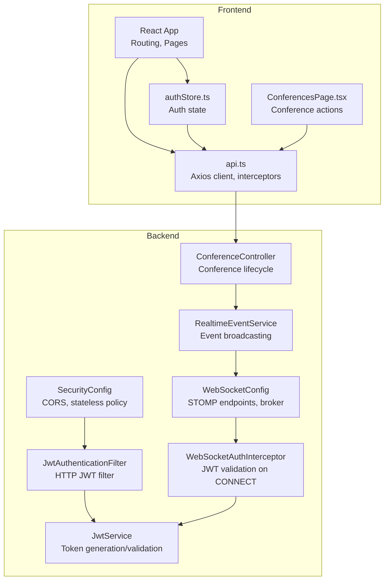
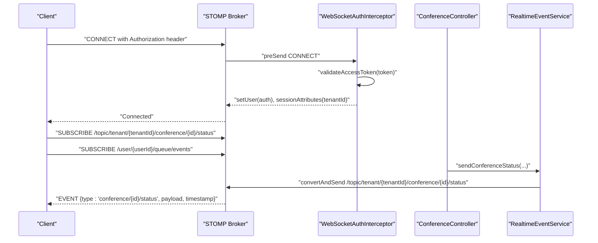
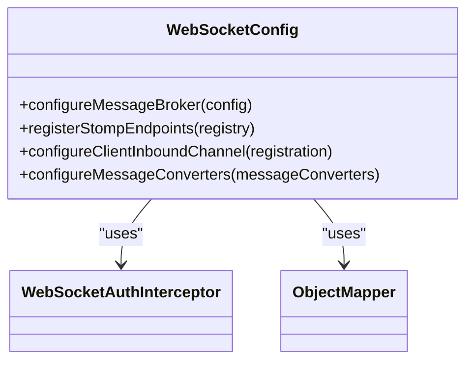
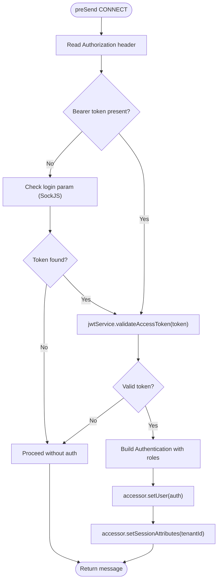
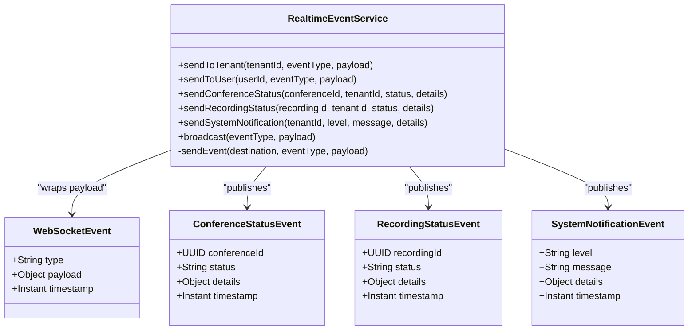
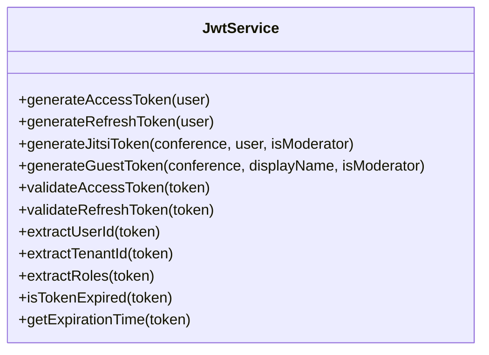
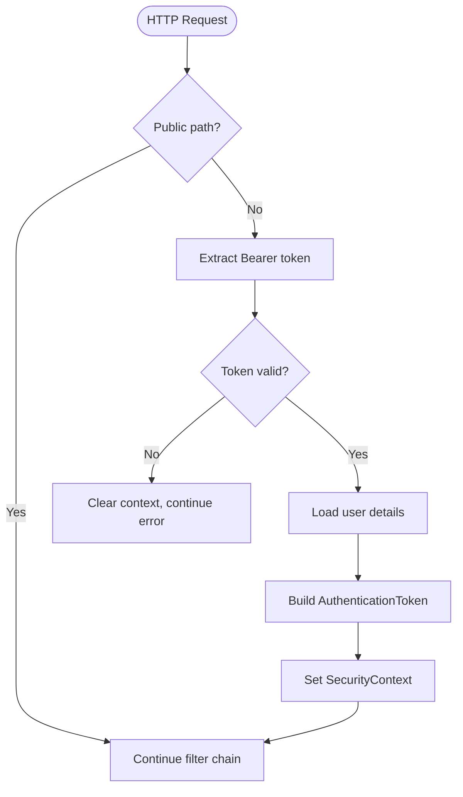
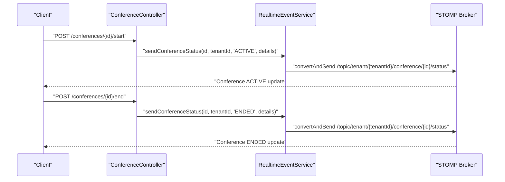
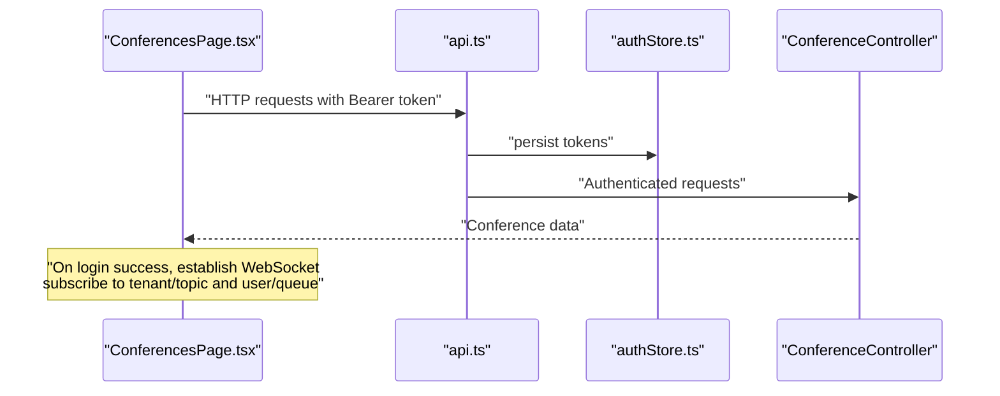
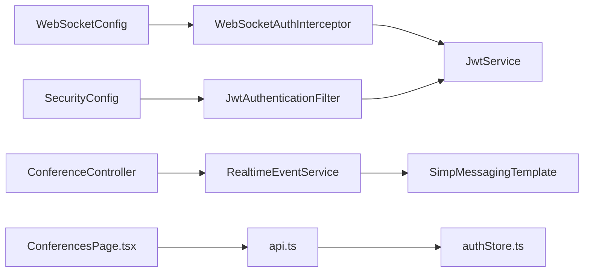

# Real-Time Communication

<cite>
**Referenced Files in This Document**
- [WebSocketConfig.java](file://jmp-infrastructure/src/main/java/com/jmp/infrastructure/websocket/WebSocketConfig.java)
- [RealtimeEventService.java](file://jmp-infrastructure/src/main/java/com/jmp/infrastructure/websocket/RealtimeEventService.java)
- [WebSocketAuthInterceptor.java](file://jmp-infrastructure/src/main/java/com/jmp/infrastructure/websocket/WebSocketAuthInterceptor.java)
- [JwtService.java](file://jmp-application/src/main/java/com/jmp/application/service/JwtService.java)
- [JwtAuthenticationFilter.java](file://jmp-infrastructure/src/main/java/com/jmp/infrastructure/security/JwtAuthenticationFilter.java)
- [SecurityConfig.java](file://jmp-infrastructure/src/main/java/com/jmp/infrastructure/security/SecurityConfig.java)
- [ConferenceController.java](file://jmp-api/src/main/java/com/jmp/api/controller/ConferenceController.java)
- [api.ts](file://jmp-ui/src/services/api.ts)
- [authStore.ts](file://jmp-ui/src/store/authStore.ts)
- [ConferencesPage.tsx](file://jmp-ui/src/pages/ConferencesPage.tsx)
- [App.tsx](file://jmp-ui/src/App.tsx)
</cite>

## Table of Contents
1. [Introduction](#introduction)
2. [Project Structure](#project-structure)
3. [Core Components](#core-components)
4. [Architecture Overview](#architecture-overview)
5. [Detailed Component Analysis](#detailed-component-analysis)
6. [Dependency Analysis](#dependency-analysis)
7. [Performance Considerations](#performance-considerations)
8. [Troubleshooting Guide](#troubleshooting-guide)
9. [Conclusion](#conclusion)
10. [Appendices](#appendices)

## Introduction
This document describes the real-time communication system built on WebSocket technology. It covers WebSocket configuration, connection management, authentication integration, event broadcasting patterns, and event-driven architecture for conference status updates, recording notifications, and system alerts. It also documents client-side integration, connection handling, reconnection strategies, message formats, event types, payload structures, scalability considerations, and monitoring approaches.

## Project Structure
The real-time subsystem spans backend infrastructure and frontend UI:
- Backend WebSocket configuration and event service reside under the infrastructure module.
- Authentication services and filters are located in the application and infrastructure security packages.
- Frontend integrates with the backend via HTTP APIs and stores authentication state.

**Diagram sources**
- [WebSocketConfig.java:27-69](file://jmp-infrastructure/src/main/java/com/jmp/infrastructure/websocket/WebSocketConfig.java#L27-L69)
- [RealtimeEventService.java:20-101](file://jmp-infrastructure/src/main/java/com/jmp/infrastructure/websocket/RealtimeEventService.java#L20-L101)
- [WebSocketAuthInterceptor.java:29-73](file://jmp-infrastructure/src/main/java/com/jmp/infrastructure/websocket/WebSocketAuthInterceptor.java#L29-L73)
- [SecurityConfig.java:31-61](file://jmp-infrastructure/src/main/java/com/jmp/infrastructure/security/SecurityConfig.java#L31-L61)
- [JwtAuthenticationFilter.java:29-76](file://jmp-infrastructure/src/main/java/com/jmp/infrastructure/security/JwtAuthenticationFilter.java#L29-L76)
- [JwtService.java:27-43](file://jmp-application/src/main/java/com/jmp/application/service/JwtService.java#L27-L43)
- [ConferenceController.java:43-138](file://jmp-api/src/main/java/com/jmp/api/controller/ConferenceController.java#L43-L138)
- [api.ts:1-93](file://jmp-ui/src/services/api.ts#L1-L93)
- [authStore.ts:1-47](file://jmp-ui/src/store/authStore.ts#L1-L47)
- [ConferencesPage.tsx:1-299](file://jmp-ui/src/pages/ConferencesPage.tsx#L1-L299)
- [App.tsx:10-31](file://jmp-ui/src/App.tsx#L10-L31)

**Section sources**
- [WebSocketConfig.java:27-69](file://jmp-infrastructure/src/main/java/com/jmp/infrastructure/websocket/WebSocketConfig.java#L27-L69)
- [RealtimeEventService.java:20-101](file://jmp-infrastructure/src/main/java/com/jmp/infrastructure/websocket/RealtimeEventService.java#L20-L101)
- [WebSocketAuthInterceptor.java:29-73](file://jmp-infrastructure/src/main/java/com/jmp/infrastructure/websocket/WebSocketAuthInterceptor.java#L29-L73)
- [SecurityConfig.java:31-61](file://jmp-infrastructure/src/main/java/com/jmp/infrastructure/security/SecurityConfig.java#L31-L61)
- [JwtAuthenticationFilter.java:29-76](file://jmp-infrastructure/src/main/java/com/jmp/infrastructure/security/JwtAuthenticationFilter.java#L29-L76)
- [JwtService.java:27-43](file://jmp-application/src/main/java/com/jmp/application/service/JwtService.java#L27-L43)
- [ConferenceController.java:43-138](file://jmp-api/src/main/java/com/jmp/api/controller/ConferenceController.java#L43-L138)
- [api.ts:1-93](file://jmp-ui/src/services/api.ts#L1-L93)
- [authStore.ts:1-47](file://jmp-ui/src/store/authStore.ts#L1-L47)
- [ConferencesPage.tsx:1-299](file://jmp-ui/src/pages/ConferencesPage.tsx#L1-L299)
- [App.tsx:10-31](file://jmp-ui/src/App.tsx#L10-L31)

## Core Components
- WebSocket configuration enables STOMP over WebSocket and SockJS, registers endpoints, sets message converters, and applies an authentication interceptor.
- Real-time event service encapsulates event broadcasting to tenants, users, and system-wide channels, with typed event records.
- WebSocket authentication interceptor validates JWT tokens from STOMP CONNECT headers and populates the session with tenant context.
- JWT service generates and validates access and refresh tokens, extracting claims such as user ID, tenant ID, and roles.
- HTTP security configuration enforces stateless sessions, CORS, and JWT-based authentication for REST endpoints.
- Conference controller exposes lifecycle operations that trigger real-time events through the event service.

**Section sources**
- [WebSocketConfig.java:27-69](file://jmp-infrastructure/src/main/java/com/jmp/infrastructure/websocket/WebSocketConfig.java#L27-L69)
- [RealtimeEventService.java:20-101](file://jmp-infrastructure/src/main/java/com/jmp/infrastructure/websocket/RealtimeEventService.java#L20-L101)
- [WebSocketAuthInterceptor.java:29-73](file://jmp-infrastructure/src/main/java/com/jmp/infrastructure/websocket/WebSocketAuthInterceptor.java#L29-L73)
- [JwtService.java:49-87](file://jmp-application/src/main/java/com/jmp/application/service/JwtService.java#L49-L87)
- [SecurityConfig.java:42-61](file://jmp-infrastructure/src/main/java/com/jmp/infrastructure/security/SecurityConfig.java#L42-L61)
- [ConferenceController.java:118-130](file://jmp-api/src/main/java/com/jmp/api/controller/ConferenceController.java#L118-L130)

## Architecture Overview
The system uses Spring WebSocket with STOMP over WebSocket and SockJS. Clients connect to a WebSocket endpoint, authenticate via JWT, and subscribe to destinations. The backend publishes events to topics or queues, and clients receive real-time updates.

**Diagram sources**
- [WebSocketConfig.java:42-55](file://jmp-infrastructure/src/main/java/com/jmp/infrastructure/websocket/WebSocketConfig.java#L42-L55)
- [WebSocketAuthInterceptor.java:33-73](file://jmp-infrastructure/src/main/java/com/jmp/infrastructure/websocket/WebSocketAuthInterceptor.java#L33-L73)
- [RealtimeEventService.java:44-52](file://jmp-infrastructure/src/main/java/com/jmp/infrastructure/websocket/RealtimeEventService.java#L44-L52)
- [ConferenceController.java:118-130](file://jmp-api/src/main/java/com/jmp/api/controller/ConferenceController.java#L118-L130)

## Detailed Component Analysis

### WebSocket Configuration
- Enables STOMP message broker with in-memory topics and queues.
- Registers two endpoints: one with SockJS for broad browser compatibility, another native WebSocket endpoint.
- Applies a JSON message converter with Jackson for payload serialization.
- Adds an authentication interceptor to the inbound channel.

**Diagram sources**
- [WebSocketConfig.java:27-69](file://jmp-infrastructure/src/main/java/com/jmp/infrastructure/websocket/WebSocketConfig.java#L27-L69)

**Section sources**
- [WebSocketConfig.java:32-68](file://jmp-infrastructure/src/main/java/com/jmp/infrastructure/websocket/WebSocketConfig.java#L32-L68)

### WebSocket Authentication Interceptor
- Validates JWT tokens present in the STOMP CONNECT frame.
- Extracts tokens from Authorization header or login parameter (SockJS fallback).
- Builds an authentication principal containing user ID, roles, and sets tenant session attributes.
- Populates the STOMP accessor with user identity for downstream handlers.

**Diagram sources**
- [WebSocketAuthInterceptor.java:33-73](file://jmp-infrastructure/src/main/java/com/jmp/infrastructure/websocket/WebSocketAuthInterceptor.java#L33-L73)
- [JwtService.java:164-171](file://jmp-application/src/main/java/com/jmp/application/service/JwtService.java#L164-L171)

**Section sources**
- [WebSocketAuthInterceptor.java:33-92](file://jmp-infrastructure/src/main/java/com/jmp/infrastructure/websocket/WebSocketAuthInterceptor.java#L33-L92)
- [JwtService.java:193-214](file://jmp-application/src/main/java/com/jmp/application/service/JwtService.java#L193-L214)

### Real-Time Event Service
- Provides methods to broadcast to tenants, users, and system-wide channels.
- Emits typed events with a generic wrapper and specialized records for conference status, recording status, and system notifications.
- Uses SimpMessagingTemplate to send JSON payloads to STOMP destinations.

**Diagram sources**
- [RealtimeEventService.java:20-141](file://jmp-infrastructure/src/main/java/com/jmp/infrastructure/websocket/RealtimeEventService.java#L20-L141)

**Section sources**
- [RealtimeEventService.java:28-86](file://jmp-infrastructure/src/main/java/com/jmp/infrastructure/websocket/RealtimeEventService.java#L28-L86)
- [RealtimeEventService.java:106-140](file://jmp-infrastructure/src/main/java/com/jmp/infrastructure/websocket/RealtimeEventService.java#L106-L140)

### JWT Service
- Generates access and refresh tokens with configurable expiration.
- Generates Jitsi tokens with room, user context, and features.
- Validates tokens and extracts user ID, tenant ID, and roles.
- Used by both HTTP and WebSocket layers for authentication.

**Diagram sources**
- [JwtService.java:27-235](file://jmp-application/src/main/java/com/jmp/application/service/JwtService.java#L27-L235)

**Section sources**
- [JwtService.java:49-87](file://jmp-application/src/main/java/com/jmp/application/service/JwtService.java#L49-L87)
- [JwtService.java:164-214](file://jmp-application/src/main/java/com/jmp/application/service/JwtService.java#L164-L214)

### HTTP Security and JWT Filter
- Security configuration enforces stateless sessions, CORS, and permits public endpoints.
- JWT filter validates access tokens from HTTP Authorization headers and injects authentication into the security context.

**Diagram sources**
- [SecurityConfig.java:42-61](file://jmp-infrastructure/src/main/java/com/jmp/infrastructure/security/SecurityConfig.java#L42-L61)
- [JwtAuthenticationFilter.java:39-76](file://jmp-infrastructure/src/main/java/com/jmp/infrastructure/security/JwtAuthenticationFilter.java#L39-L76)

**Section sources**
- [SecurityConfig.java:42-88](file://jmp-infrastructure/src/main/java/com/jmp/infrastructure/security/SecurityConfig.java#L42-L88)
- [JwtAuthenticationFilter.java:39-94](file://jmp-infrastructure/src/main/java/com/jmp/infrastructure/security/JwtAuthenticationFilter.java#L39-L94)

### Conference Lifecycle and Real-Time Events
- Conference start/end endpoints trigger real-time status updates to subscribed clients.
- The event service publishes structured payloads to tenant-scoped topics.

**Diagram sources**
- [ConferenceController.java:118-130](file://jmp-api/src/main/java/com/jmp/api/controller/ConferenceController.java#L118-L130)
- [RealtimeEventService.java:44-52](file://jmp-infrastructure/src/main/java/com/jmp/infrastructure/websocket/RealtimeEventService.java#L44-L52)

**Section sources**
- [ConferenceController.java:118-130](file://jmp-api/src/main/java/com/jmp/api/controller/ConferenceController.java#L118-L130)
- [RealtimeEventService.java:44-52](file://jmp-infrastructure/src/main/java/com/jmp/infrastructure/websocket/RealtimeEventService.java#L44-L52)

### Client-Side Integration and Reconnection Strategies
- Axios client adds Authorization headers automatically and handles token refresh on 401 responses.
- Authentication state persists in a zustand store with selective persistence.
- React pages consume conference APIs; real-time updates are handled by subscribing to STOMP destinations after successful login.

**Diagram sources**
- [api.ts:14-58](file://jmp-ui/src/services/api.ts#L14-L58)
- [authStore.ts:23-46](file://jmp-ui/src/store/authStore.ts#L23-L46)
- [ConferencesPage.tsx:62-71](file://jmp-ui/src/pages/ConferencesPage.tsx#L62-L71)
- [App.tsx:10-31](file://jmp-ui/src/App.tsx#L10-L31)

**Section sources**
- [api.ts:14-58](file://jmp-ui/src/services/api.ts#L14-L58)
- [authStore.ts:23-46](file://jmp-ui/src/store/authStore.ts#L23-L46)
- [ConferencesPage.tsx:62-71](file://jmp-ui/src/pages/ConferencesPage.tsx#L62-L71)
- [App.tsx:10-31](file://jmp-ui/src/App.tsx#L10-L31)

## Dependency Analysis
- WebSocketConfig depends on ObjectMapper and WebSocketAuthInterceptor.
- WebSocketAuthInterceptor depends on JwtService.
- RealtimeEventService depends on SimpMessagingTemplate and ObjectMapper.
- ConferenceController depends on ConferenceService and JwtService.
- SecurityConfig depends on JwtAuthenticationFilter and UserDetailsService.
- Frontend depends on api.ts and authStore.ts for authentication and HTTP interactions.

**Diagram sources**
- [WebSocketConfig.java:27-69](file://jmp-infrastructure/src/main/java/com/jmp/infrastructure/websocket/WebSocketConfig.java#L27-L69)
- [WebSocketAuthInterceptor.java:29-31](file://jmp-infrastructure/src/main/java/com/jmp/infrastructure/websocket/WebSocketAuthInterceptor.java#L29-L31)
- [RealtimeEventService.java:22-23](file://jmp-infrastructure/src/main/java/com/jmp/infrastructure/websocket/RealtimeEventService.java#L22-L23)
- [ConferenceController.java:45-47](file://jmp-api/src/main/java/com/jmp/api/controller/ConferenceController.java#L45-L47)
- [SecurityConfig.java:33-40](file://jmp-infrastructure/src/main/java/com/jmp/infrastructure/security/SecurityConfig.java#L33-L40)
- [JwtAuthenticationFilter.java:32-36](file://jmp-infrastructure/src/main/java/com/jmp/infrastructure/security/JwtAuthenticationFilter.java#L32-L36)
- [JwtService.java:27-43](file://jmp-application/src/main/java/com/jmp/application/service/JwtService.java#L27-L43)
- [api.ts:1-93](file://jmp-ui/src/services/api.ts#L1-L93)
- [authStore.ts:1-47](file://jmp-ui/src/store/authStore.ts#L1-L47)
- [ConferencesPage.tsx:1-299](file://jmp-ui/src/pages/ConferencesPage.tsx#L1-L299)

**Section sources**
- [WebSocketConfig.java:27-69](file://jmp-infrastructure/src/main/java/com/jmp/infrastructure/websocket/WebSocketConfig.java#L27-L69)
- [WebSocketAuthInterceptor.java:29-31](file://jmp-infrastructure/src/main/java/com/jmp/infrastructure/websocket/WebSocketAuthInterceptor.java#L29-L31)
- [RealtimeEventService.java:22-23](file://jmp-infrastructure/src/main/java/com/jmp/infrastructure/websocket/RealtimeEventService.java#L22-L23)
- [ConferenceController.java:45-47](file://jmp-api/src/main/java/com/jmp/api/controller/ConferenceController.java#L45-L47)
- [SecurityConfig.java:33-40](file://jmp-infrastructure/src/main/java/com/jmp/infrastructure/security/SecurityConfig.java#L33-L40)
- [JwtAuthenticationFilter.java:32-36](file://jmp-infrastructure/src/main/java/com/jmp/infrastructure/security/JwtAuthenticationFilter.java#L32-L36)
- [JwtService.java:27-43](file://jmp-application/src/main/java/com/jmp/application/service/JwtService.java#L27-L43)
- [api.ts:1-93](file://jmp-ui/src/services/api.ts#L1-L93)
- [authStore.ts:1-47](file://jmp-ui/src/store/authStore.ts#L1-L47)
- [ConferencesPage.tsx:1-299](file://jmp-ui/src/pages/ConferencesPage.tsx#L1-L299)

## Performance Considerations
- Message broker: The configuration currently uses an in-memory broker suitable for development. For production, replace with a scalable broker such as RabbitMQ or Redis to support clustering and persistence.
- Connection pooling: Configure container-specific pooling (e.g., Tomcat, Jetty) and limit concurrent connections per client to prevent resource exhaustion.
- Payload size: Keep event payloads minimal; avoid embedding large objects. Use identifiers and client-side hydration where appropriate.
- Topic fan-out: Prefer targeted subscriptions to reduce unnecessary broadcasts.
- Compression: Consider enabling compression for large payloads if supported by the broker.
- Monitoring: Track broker metrics (messages/sec, queue depths, memory usage) and WebSocket connection counts.

[No sources needed since this section provides general guidance]

## Troubleshooting Guide
Common issues and resolutions:
- Authentication failures on WebSocket CONNECT:
  - Verify Authorization header contains a valid Bearer token.
  - Confirm token is not expired and matches the intended user and tenant.
  - Check interceptor logs for validation errors.
- Missing or invalid tokens:
  - Ensure clients pass tokens either in the Authorization header or login parameter for SockJS fallback.
- CORS errors:
  - Confirm allowed origins and credentials are configured for both HTTP and WebSocket upgrades.
- Destination subscription errors:
  - Ensure clients subscribe to correct destinations (tenant/topic or user/queue).
- Event delivery failures:
  - Inspect event service logs for exceptions during convertAndSend.
- Frontend reconnection:
  - Implement exponential backoff and automatic re-subscription upon reconnect.
  - Persist subscription metadata to restore subscriptions after reconnection.

**Section sources**
- [WebSocketAuthInterceptor.java:33-73](file://jmp-infrastructure/src/main/java/com/jmp/infrastructure/websocket/WebSocketAuthInterceptor.java#L33-L73)
- [SecurityConfig.java:78-88](file://jmp-infrastructure/src/main/java/com/jmp/infrastructure/security/SecurityConfig.java#L78-L88)
- [RealtimeEventService.java:88-101](file://jmp-infrastructure/src/main/java/com/jmp/infrastructure/websocket/RealtimeEventService.java#L88-L101)

## Conclusion
The real-time communication system leverages Spring WebSocket with STOMP, robust JWT-based authentication, and a clean event service abstraction. It supports tenant-scoped and user-specific messaging, with straightforward extension points for additional event types. Production readiness requires replacing the in-memory broker, implementing connection pooling, and adding comprehensive monitoring and alerting.

[No sources needed since this section summarizes without analyzing specific files]

## Appendices

### Message Formats and Event Types
- Generic event wrapper:
  - type: string identifying the event category
  - payload: object containing event-specific data
  - timestamp: instant indicating when the event was published
- Conference status event:
  - type: "conference/{id}/status"
  - payload: includes conferenceId, status, details, timestamp
- Recording status event:
  - type: "recording/{id}/status"
  - payload: includes recordingId, status, details, timestamp
- System notification event:
  - type: "notifications/system"
  - payload: includes level, message, details, timestamp

**Section sources**
- [RealtimeEventService.java:106-140](file://jmp-infrastructure/src/main/java/com/jmp/infrastructure/websocket/RealtimeEventService.java#L106-L140)

### Client-Side WebSocket Integration Notes
- Establish WebSocket connection after login with Authorization header or SockJS fallback.
- Subscribe to:
  - Tenant-scoped topic: /topic/tenant/{tenantId}/conference/{id}/status
  - User-specific queue: /user/{userId}/queue/events
- Implement reconnection with exponential backoff and resubscribe logic.
- Use Axios interceptors to manage token refresh and attach Authorization headers to HTTP requests.

**Section sources**
- [api.ts:14-58](file://jmp-ui/src/services/api.ts#L14-L58)
- [authStore.ts:23-46](file://jmp-ui/src/store/authStore.ts#L23-L46)
- [WebSocketConfig.java:42-55](file://jmp-infrastructure/src/main/java/com/jmp/infrastructure/websocket/WebSocketConfig.java#L42-L55)