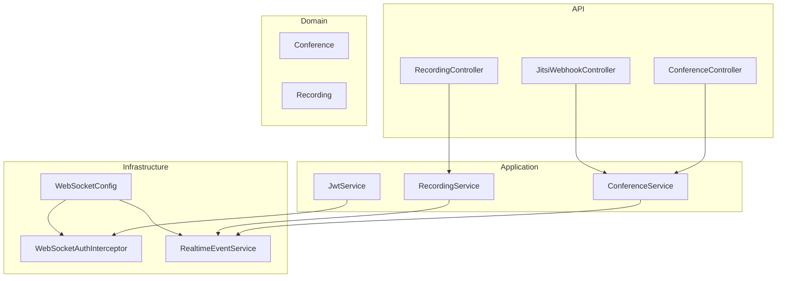
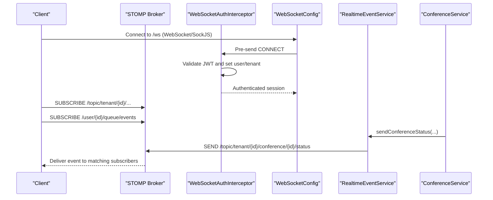
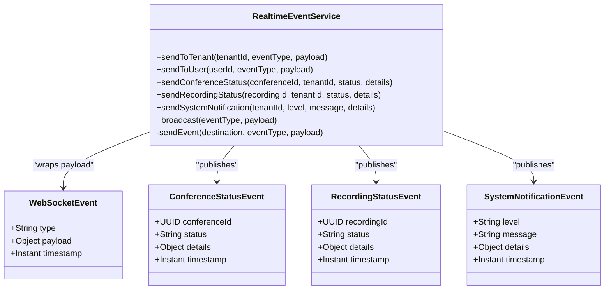
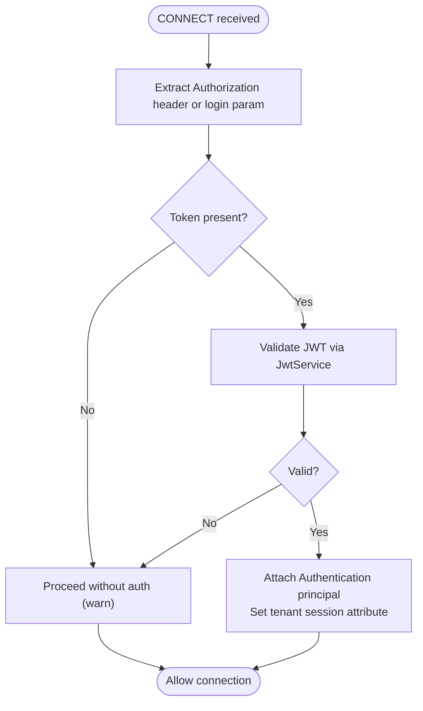
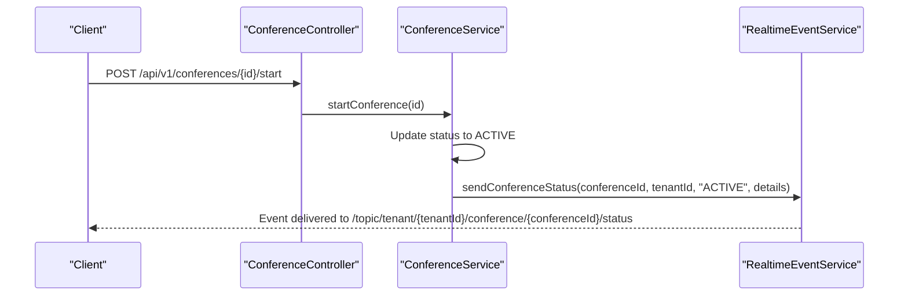
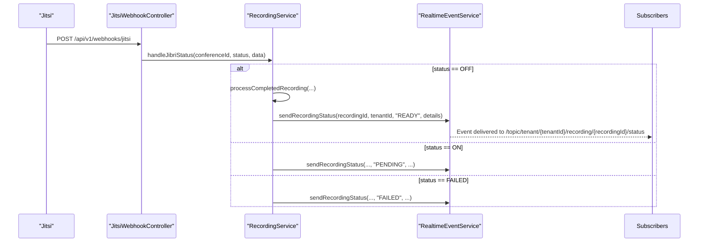
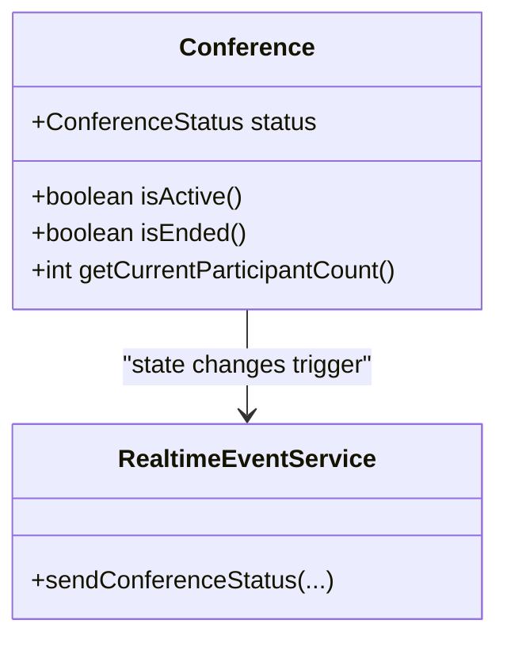
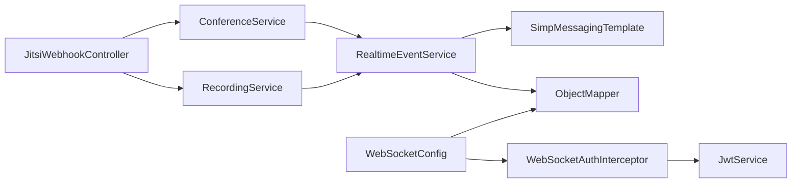

# Real-Time Event System

<cite>
**Referenced Files in This Document**
- [RealtimeEventService.java](file://jmp-infrastructure/src/main/java/com/jmp/infrastructure/websocket/RealtimeEventService.java)
- [WebSocketConfig.java](file://jmp-infrastructure/src/main/java/com/jmp/infrastructure/websocket/WebSocketConfig.java)
- [WebSocketAuthInterceptor.java](file://jmp-infrastructure/src/main/java/com/jmp/infrastructure/websocket/WebSocketAuthInterceptor.java)
- [ConferenceService.java](file://jmp-application/src/main/java/com/jmp/application/service/ConferenceService.java)
- [RecordingService.java](file://jmp-application/src/main/java/com/jmp/application/service/RecordingService.java)
- [ConferenceController.java](file://jmp-api/src/main/java/com/jmp/api/controller/ConferenceController.java)
- [RecordingController.java](file://jmp-api/src/main/java/com/jmp/api/controller/RecordingController.java)
- [JitsiWebhookController.java](file://jmp-api/src/main/java/com/jmp/api/controller/JitsiWebhookController.java)
- [JwtService.java](file://jmp-application/src/main/java/com/jmp/application/service/JwtService.java)
- [Conference.java](file://jmp-domain/src/main/java/com/jmp/domain/entity/Conference.java)
- [Recording.java](file://jmp-domain/src/main/java/com/jmp/domain/entity/Recording.java)
</cite>

## Table of Contents
1. [Introduction](#introduction)
2. [Project Structure](#project-structure)
3. [Core Components](#core-components)
4. [Architecture Overview](#architecture-overview)
5. [Detailed Component Analysis](#detailed-component-analysis)
6. [Dependency Analysis](#dependency-analysis)
7. [Performance Considerations](#performance-considerations)
8. [Troubleshooting Guide](#troubleshooting-guide)
9. [Conclusion](#conclusion)

## Introduction
This document describes the real-time event broadcasting system that powers live updates for conferences, participants, recordings, and system alerts. It explains how events are published, routed, and delivered to subscribed clients via WebSocket, and how the system integrates with the conference lifecycle and recording pipeline. It also covers event types, message formatting, subscription patterns, client handling, filtering, rate limiting, and performance optimization strategies for high-volume scenarios.

## Project Structure
The real-time event system spans three layers:
- Infrastructure: WebSocket configuration, authentication, and event publishing
- Application: Business services that orchestrate lifecycle events
- API: Controllers that expose endpoints and integrate with external systems (e.g., Jitsi webhooks)

**Diagram sources**
- [WebSocketConfig.java:23-69](file://jmp-infrastructure/src/main/java/com/jmp/infrastructure/websocket/WebSocketConfig.java#L23-L69)
- [WebSocketAuthInterceptor.java:29-93](file://jmp-infrastructure/src/main/java/com/jmp/infrastructure/websocket/WebSocketAuthInterceptor.java#L29-L93)
- [RealtimeEventService.java:20-141](file://jmp-infrastructure/src/main/java/com/jmp/infrastructure/websocket/RealtimeEventService.java#L20-L141)
- [ConferenceService.java:29-224](file://jmp-application/src/main/java/com/jmp/application/service/ConferenceService.java#L29-L224)
- [RecordingService.java:31-331](file://jmp-application/src/main/java/com/jmp/application/service/RecordingService.java#L31-L331)
- [JwtService.java:27-235](file://jmp-application/src/main/java/com/jmp/application/service/JwtService.java#L27-L235)
- [ConferenceController.java:43-188](file://jmp-api/src/main/java/com/jmp/api/controller/ConferenceController.java#L43-L188)
- [RecordingController.java:41-137](file://jmp-api/src/main/java/com/jmp/api/controller/RecordingController.java#L41-L137)
- [JitsiWebhookController.java:29-124](file://jmp-api/src/main/java/com/jmp/api/controller/JitsiWebhookController.java#L29-L124)
- [Conference.java:30-216](file://jmp-domain/src/main/java/com/jmp/domain/entity/Conference.java#L30-L216)
- [Recording.java:29-202](file://jmp-domain/src/main/java/com/jmp/domain/entity/Recording.java#L29-L202)

**Section sources**
- [WebSocketConfig.java:23-69](file://jmp-infrastructure/src/main/java/com/jmp/infrastructure/websocket/WebSocketConfig.java#L23-L69)
- [RealtimeEventService.java:20-141](file://jmp-infrastructure/src/main/java/com/jmp/infrastructure/websocket/RealtimeEventService.java#L20-L141)
- [ConferenceService.java:29-224](file://jmp-application/src/main/java/com/jmp/application/service/ConferenceService.java#L29-L224)
- [RecordingService.java:31-331](file://jmp-application/src/main/java/com/jmp/application/service/RecordingService.java#L31-L331)
- [ConferenceController.java:43-188](file://jmp-api/src/main/java/com/jmp/api/controller/ConferenceController.java#L43-L188)
- [RecordingController.java:41-137](file://jmp-api/src/main/java/com/jmp/api/controller/RecordingController.java#L41-L137)
- [JitsiWebhookController.java:29-124](file://jmp-api/src/main/java/com/jmp/api/controller/JitsiWebhookController.java#L29-L124)
- [JwtService.java:27-235](file://jmp-application/src/main/java/com/jmp/application/service/JwtService.java#L27-L235)
- [Conference.java:30-216](file://jmp-domain/src/main/java/com/jmp/domain/entity/Conference.java#L30-L216)
- [Recording.java:29-202](file://jmp-domain/src/main/java/com/jmp/domain/entity/Recording.java#L29-L202)

## Core Components
- RealtimeEventService: Central event publisher that formats and routes WebSocket messages to tenants, users, or broadcasts.
- WebSocketConfig: Enables STOMP over WebSocket/SockJS, configures message converters, and sets broker destinations.
- WebSocketAuthInterceptor: Authenticates WebSocket connections using JWT and attaches user/tenant context.
- ConferenceService and RecordingService: Business services that trigger real-time events during lifecycle transitions.
- JitsiWebhookController: Receives external Jitsi events and coordinates internal state changes and notifications.
- JwtService: Generates and validates JWT tokens used for WebSocket authentication and Jitsi tokens.

Key responsibilities:
- Event publishing: sendToTenant, sendToUser, sendConferenceStatus, sendRecordingStatus, sendSystemNotification, broadcast
- Message format: WebSocketEvent wrapper with type, payload, and timestamp
- Routing: STOMP destinations under /topic, /user, and /queue
- Authentication: JWT validation and user context injection for WebSocket sessions

**Section sources**
- [RealtimeEventService.java:20-141](file://jmp-infrastructure/src/main/java/com/jmp/infrastructure/websocket/RealtimeEventService.java#L20-L141)
- [WebSocketConfig.java:23-69](file://jmp-infrastructure/src/main/java/com/jmp/infrastructure/websocket/WebSocketConfig.java#L23-L69)
- [WebSocketAuthInterceptor.java:29-93](file://jmp-infrastructure/src/main/java/com/jmp/infrastructure/websocket/WebSocketAuthInterceptor.java#L29-L93)
- [JwtService.java:27-235](file://jmp-application/src/main/java/com/jmp/application/service/JwtService.java#L27-L235)

## Architecture Overview
The system uses Spring WebSocket with STOMP over WebSocket/SockJS. Clients connect to /ws, authenticate with a Bearer token, and subscribe to destinations. The application publishes events to STOMP topics or user queues, and Spring’s broker delivers them to subscribers.

**Diagram sources**
- [WebSocketConfig.java:42-50](file://jmp-infrastructure/src/main/java/com/jmp/infrastructure/websocket/WebSocketConfig.java#L42-L50)
- [WebSocketAuthInterceptor.java:33-73](file://jmp-infrastructure/src/main/java/com/jmp/infrastructure/websocket/WebSocketAuthInterceptor.java#L33-L73)
- [RealtimeEventService.java:28-52](file://jmp-infrastructure/src/main/java/com/jmp/infrastructure/websocket/RealtimeEventService.java#L28-L52)
- [ConferenceService.java:136-173](file://jmp-application/src/main/java/com/jmp/application/service/ConferenceService.java#L136-L173)

## Detailed Component Analysis

### RealtimeEventService
Responsibilities:
- Publish to tenant scope: sendToTenant
- Publish to individual user: sendToUser
- Publish conference status: sendConferenceStatus
- Publish recording status: sendRecordingStatus
- Publish system notifications: sendSystemNotification
- Broadcast to all: broadcast
- Message wrapper: WebSocketEvent with type, payload, timestamp
- Event records: ConferenceStatusEvent, RecordingStatusEvent, SystemNotificationEvent

Message format and routing:
- Tenant-scoped: destination pattern "/topic/tenant/{tenantId}/{eventType}"
- User-scoped: destination pattern "/user/{userId}/queue/events"
- Broadcast: destination pattern "/topic/broadcast/{eventType}"
- Payload: WebSocketEvent with nested event-specific record

Error handling:
- Try/catch around send; logs failures but does not rethrow

**Diagram sources**
- [RealtimeEventService.java:20-141](file://jmp-infrastructure/src/main/java/com/jmp/infrastructure/websocket/RealtimeEventService.java#L20-L141)

**Section sources**
- [RealtimeEventService.java:20-141](file://jmp-infrastructure/src/main/java/com/jmp/infrastructure/websocket/RealtimeEventService.java#L20-L141)

### WebSocket Configuration and Authentication
- Broker setup: enableSimpleBroker for "/topic" and "/queue"; application prefix "/app"; user destination prefix "/user"
- Endpoints: "/ws" with and without SockJS
- Message converter: JSON with Jackson; default content type set to application/json
- Authentication: intercept CONNECT frames, extract Bearer token, validate via JwtService, attach user principal and tenant attributes

**Diagram sources**
- [WebSocketConfig.java:52-68](file://jmp-infrastructure/src/main/java/com/jmp/infrastructure/websocket/WebSocketConfig.java#L52-L68)
- [WebSocketAuthInterceptor.java:33-73](file://jmp-infrastructure/src/main/java/com/jmp/infrastructure/websocket/WebSocketAuthInterceptor.java#L33-L73)
- [JwtService.java:164-188](file://jmp-application/src/main/java/com/jmp/application/service/JwtService.java#L164-L188)

**Section sources**
- [WebSocketConfig.java:23-69](file://jmp-infrastructure/src/main/java/com/jmp/infrastructure/websocket/WebSocketConfig.java#L23-L69)
- [WebSocketAuthInterceptor.java:29-93](file://jmp-infrastructure/src/main/java/com/jmp/infrastructure/websocket/WebSocketAuthInterceptor.java#L29-L93)
- [JwtService.java:27-235](file://jmp-application/src/main/java/com/jmp/application/service/JwtService.java#L27-L235)

### Conference Lifecycle Integration
ConferenceService manages conference state transitions and can trigger real-time events. Typical flows:
- Create conference: initial state SCHEDULED
- Start conference: transitions to ACTIVE
- End conference: transitions to ENDED
- Scheduled auto-start/end: background jobs update state and could publish status

Integration points:
- ConferenceController delegates to ConferenceService for lifecycle operations
- ConferenceService persists state changes; RealtimeEventService publishes status updates to tenant

**Diagram sources**
- [ConferenceController.java:118-130](file://jmp-api/src/main/java/com/jmp/api/controller/ConferenceController.java#L118-L130)
- [ConferenceService.java:136-173](file://jmp-application/src/main/java/com/jmp/application/service/ConferenceService.java#L136-L173)
- [RealtimeEventService.java:44-52](file://jmp-infrastructure/src/main/java/com/jmp/infrastructure/websocket/RealtimeEventService.java#L44-L52)

**Section sources**
- [ConferenceController.java:43-188](file://jmp-api/src/main/java/com/jmp/api/controller/ConferenceController.java#L43-L188)
- [ConferenceService.java:29-224](file://jmp-application/src/main/java/com/jmp/application/service/ConferenceService.java#L29-L224)
- [Conference.java:137-159](file://jmp-domain/src/main/java/com/jmp/domain/entity/Conference.java#L137-L159)

### Recording Pipeline Integration
RecordingService handles recording lifecycle and can publish status updates:
- Create recording entry on initiation
- Mark as ready after processing
- Handle Jibri status webhooks (ON/OFF/FAILED)
- Publish recording status to tenant

Integration points:
- JitsiWebhookController receives Jitsi events and coordinates RecordingService actions
- RecordingService publishes status updates via RealtimeEventService

**Diagram sources**
- [JitsiWebhookController.java:33-64](file://jmp-api/src/main/java/com/jmp/api/controller/JitsiWebhookController.java#L33-L64)
- [RecordingService.java:263-290](file://jmp-application/src/main/java/com/jmp/application/service/RecordingService.java#L263-L290)
- [RealtimeEventService.java:57-65](file://jmp-infrastructure/src/main/java/com/jmp/infrastructure/websocket/RealtimeEventService.java#L57-L65)

**Section sources**
- [RecordingService.java:31-331](file://jmp-application/src/main/java/com/jmp/application/service/RecordingService.java#L31-L331)
- [RecordingController.java:41-137](file://jmp-api/src/main/java/com/jmp/api/controller/RecordingController.java#L41-L137)
- [JitsiWebhookController.java:29-124](file://jmp-api/src/main/java/com/jmp/api/controller/JitsiWebhookController.java#L29-L124)
- [Recording.java:186-201](file://jmp-domain/src/main/java/com/jmp/domain/entity/Recording.java#L186-L201)

### Event Types and Payloads
- Conference status update
  - Destination: /topic/tenant/{tenantId}/conference/{conferenceId}/status
  - Payload: ConferenceStatusEvent with conferenceId, status, details, timestamp
- Recording status update
  - Destination: /topic/tenant/{tenantId}/recording/{recordingId}/status
  - Payload: RecordingStatusEvent with recordingId, status, details, timestamp
- System notification
  - Destination: /topic/tenant/{tenantId}/notifications/system
  - Payload: SystemNotificationEvent with level, message, details, timestamp
- Broadcast
  - Destination: /topic/broadcast/{eventType}
  - Payload: WebSocketEvent with type, payload, timestamp

Subscription patterns:
- Tenant-wide: /topic/tenant/{tenantId}/...
- Conference-specific: /topic/tenant/{tenantId}/conference/{conferenceId}/status
- Recording-specific: /topic/tenant/{tenantId}/recording/{recordingId}/status
- User-specific: /user/{userId}/queue/events
- Broadcast: /topic/broadcast/{eventType}

Client notification handling:
- Subscribe to desired destinations
- Receive WebSocketEvent with nested payload
- Render UI updates based on event.type and payload

**Section sources**
- [RealtimeEventService.java:28-78](file://jmp-infrastructure/src/main/java/com/jmp/infrastructure/websocket/RealtimeEventService.java#L28-L78)
- [RealtimeEventService.java:106-140](file://jmp-infrastructure/src/main/java/com/jmp/infrastructure/websocket/RealtimeEventService.java#L106-L140)

### Integration with ConferenceService and Real-Time Tracking
- ConferenceService updates entity state and can trigger RealtimeEventService to publish status updates
- Domain entity Conference exposes helpers like isActive and isEnded for UI decisions
- Real-time tracking can be achieved by subscribing to conference status updates and rendering participant counts from Conference entity data

**Diagram sources**
- [Conference.java:137-184](file://jmp-domain/src/main/java/com/jmp/domain/entity/Conference.java#L137-L184)
- [RealtimeEventService.java:44-52](file://jmp-infrastructure/src/main/java/com/jmp/infrastructure/websocket/RealtimeEventService.java#L44-L52)

**Section sources**
- [Conference.java:137-184](file://jmp-domain/src/main/java/com/jmp/domain/entity/Conference.java#L137-L184)
- [ConferenceService.java:136-173](file://jmp-application/src/main/java/com/jmp/application/service/ConferenceService.java#L136-L173)

## Dependency Analysis
- RealtimeEventService depends on Spring Messaging (SimpMessagingTemplate) and Jackson (ObjectMapper)
- WebSocketConfig registers broker, endpoints, and message converters; depends on ObjectMapper and WebSocketAuthInterceptor
- WebSocketAuthInterceptor depends on JwtService for token validation and attaches user context
- ConferenceService and RecordingService depend on repositories and can trigger RealtimeEventService
- JitsiWebhookController depends on ConferenceService and RecordingService for lifecycle coordination

**Diagram sources**
- [RealtimeEventService.java:22-23](file://jmp-infrastructure/src/main/java/com/jmp/infrastructure/websocket/RealtimeEventService.java#L22-L23)
- [WebSocketConfig.java:29-30](file://jmp-infrastructure/src/main/java/com/jmp/infrastructure/websocket/WebSocketConfig.java#L29-L30)
- [WebSocketAuthInterceptor.java:31](file://jmp-infrastructure/src/main/java/com/jmp/infrastructure/websocket/WebSocketAuthInterceptor.java#L31)
- [JwtService.java:27-235](file://jmp-application/src/main/java/com/jmp/application/service/JwtService.java#L27-L235)
- [ConferenceService.java:29-224](file://jmp-application/src/main/java/com/jmp/application/service/ConferenceService.java#L29-L224)
- [RecordingService.java:31-331](file://jmp-application/src/main/java/com/jmp/application/service/RecordingService.java#L31-L331)
- [JitsiWebhookController.java:31](file://jmp-api/src/main/java/com/jmp/api/controller/JitsiWebhookController.java#L31)

**Section sources**
- [RealtimeEventService.java:20-141](file://jmp-infrastructure/src/main/java/com/jmp/infrastructure/websocket/RealtimeEventService.java#L20-L141)
- [WebSocketConfig.java:23-69](file://jmp-infrastructure/src/main/java/com/jmp/infrastructure/websocket/WebSocketConfig.java#L23-L69)
- [WebSocketAuthInterceptor.java:29-93](file://jmp-infrastructure/src/main/java/com/jmp/infrastructure/websocket/WebSocketAuthInterceptor.java#L29-L93)
- [JwtService.java:27-235](file://jmp-application/src/main/java/com/jmp/application/service/JwtService.java#L27-L235)
- [ConferenceService.java:29-224](file://jmp-application/src/main/java/com/jmp/application/service/ConferenceService.java#L29-L224)
- [RecordingService.java:31-331](file://jmp-application/src/main/java/com/jmp/application/service/RecordingService.java#L31-L331)
- [JitsiWebhookController.java:29-124](file://jmp-api/src/main/java/com/jmp/api/controller/JitsiWebhookController.java#L29-L124)

## Performance Considerations
- Broker choice: enableSimpleBroker is in-memory; for production scale, replace with RabbitMQ or Redis as noted in configuration comments
- Message serialization: Jackson converter ensures efficient JSON payloads
- Destination granularity: prefer narrow subscriptions (conference/tenant-specific) to reduce fan-out
- Event volume control:
  - Implement event de-duplication and batching for frequent participant joins/leaves
  - Use server-side throttling or client-side rate limiting to avoid overload
- Memory and CPU: monitor broker memory usage; consider clustering or offloading to external brokers
- Network: SockJS fallback increases overhead; prefer native WebSocket when possible

[No sources needed since this section provides general guidance]

## Troubleshooting Guide
Common issues and resolutions:
- Authentication failures:
  - Verify Bearer token presence and validity in CONNECT headers
  - Check JwtService.validateAccessToken for exceptions
- Subscription delivery problems:
  - Confirm client subscribes to correct destination patterns
  - Ensure WebSocketConfig registered endpoints and broker prefixes match client expectations
- Event not reaching clients:
  - Check RealtimeEventService.sendEvent try/catch logging for failures
  - Validate tenant/user IDs used in destinations
- High event volume:
  - Reduce unnecessary events (e.g., per-participant events)
  - Batch participant updates or coalesce frequent status changes

**Section sources**
- [WebSocketAuthInterceptor.java:33-73](file://jmp-infrastructure/src/main/java/com/jmp/infrastructure/websocket/WebSocketAuthInterceptor.java#L33-L73)
- [JwtService.java:164-188](file://jmp-application/src/main/java/com/jmp/application/service/JwtService.java#L164-L188)
- [RealtimeEventService.java:88-101](file://jmp-infrastructure/src/main/java/com/jmp/infrastructure/websocket/RealtimeEventService.java#L88-L101)

## Conclusion
The real-time event system provides a robust foundation for live updates across conferences, participants, recordings, and system alerts. By leveraging STOMP over WebSocket, strict authentication, and structured event payloads, it enables scalable, tenant-aware, and user-targeted notifications. For production deployments, externalizing the broker and implementing event filtering/rate limiting will further enhance reliability and performance.