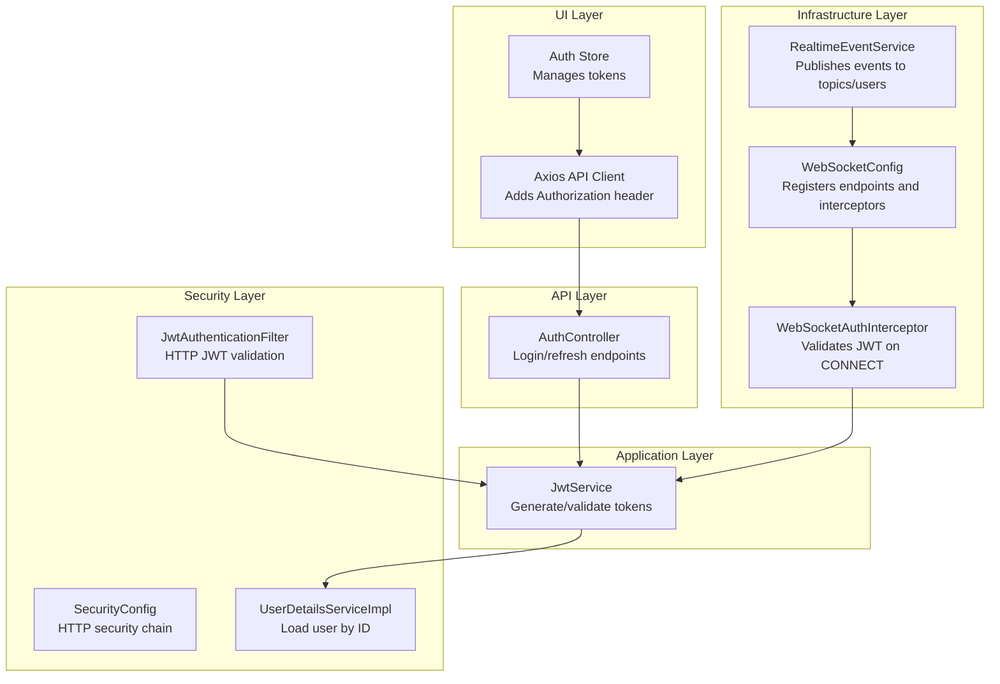
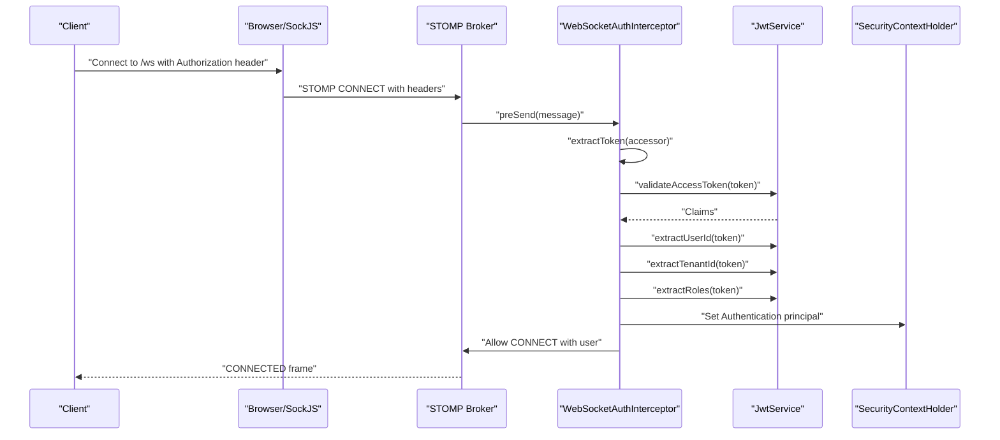
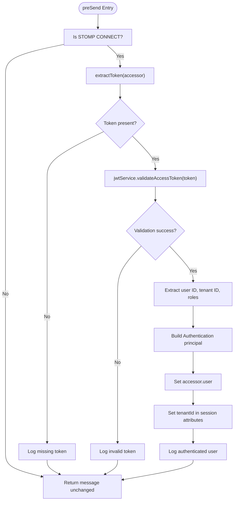
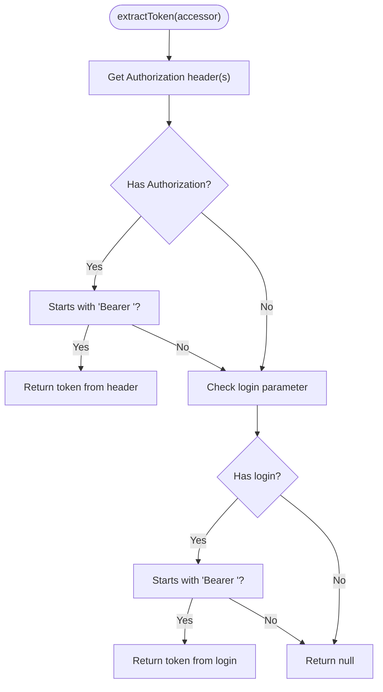
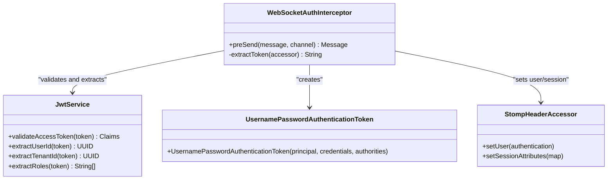
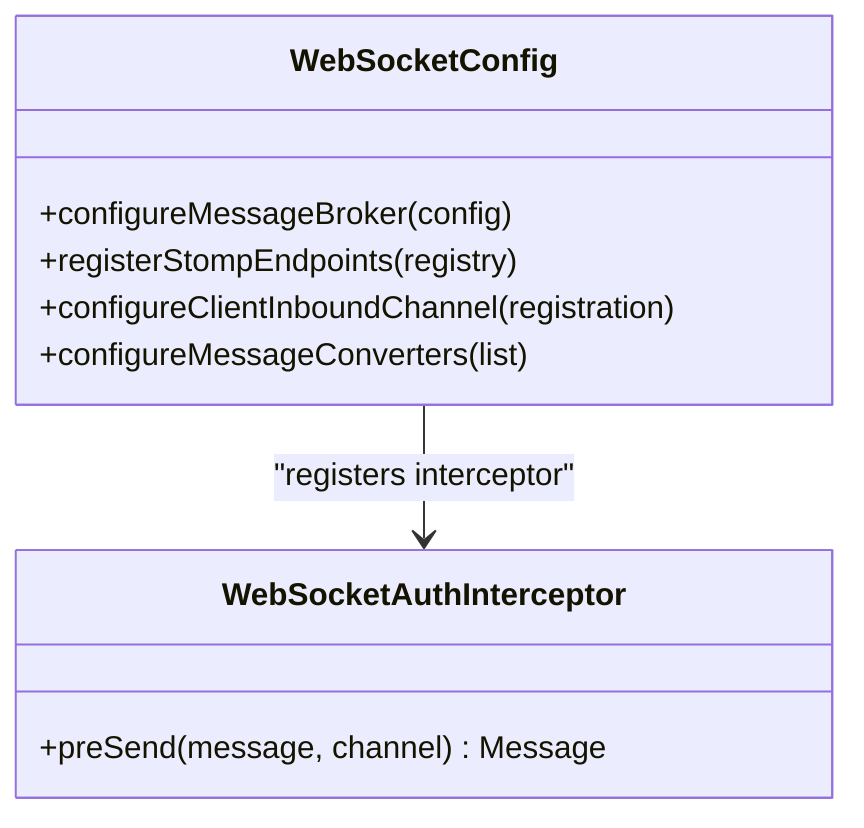
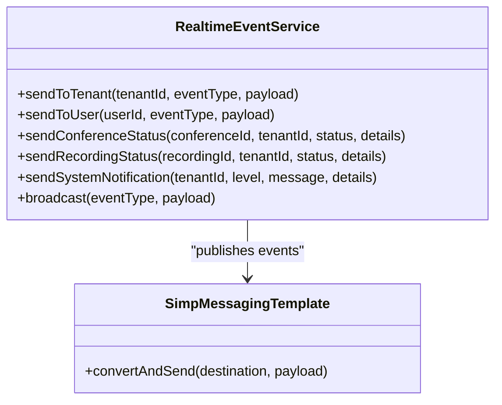
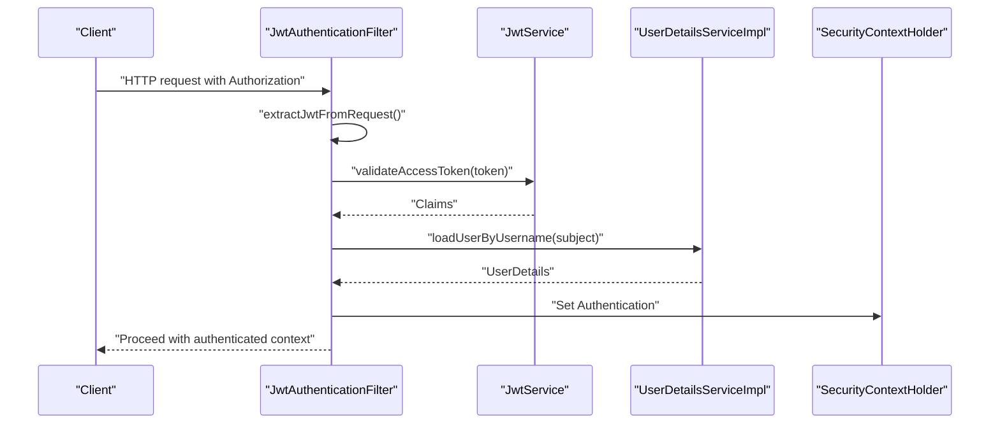
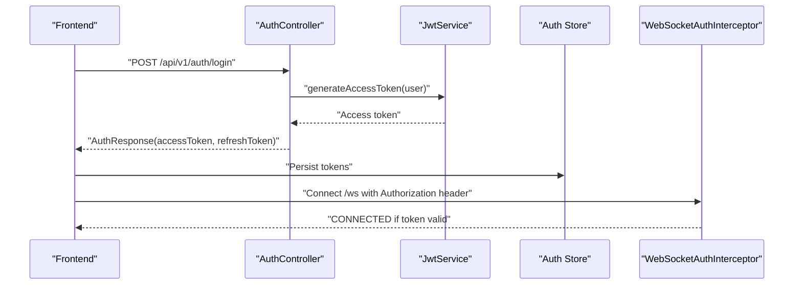
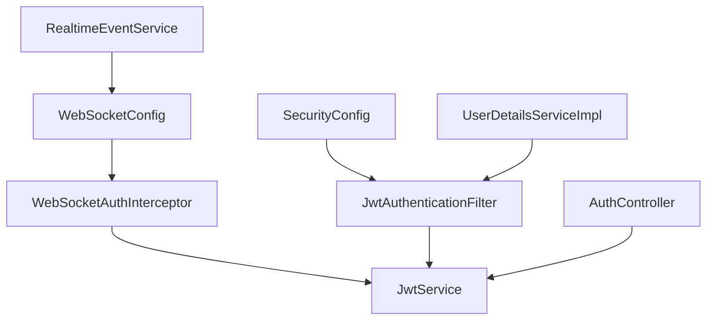

# WebSocket Authentication Interceptor

<cite>
**Referenced Files in This Document**
- [WebSocketAuthInterceptor.java](file://jmp-infrastructure/src/main/java/com/jmp/infrastructure/websocket/WebSocketAuthInterceptor.java)
- [WebSocketConfig.java](file://jmp-infrastructure/src/main/java/com/jmp/infrastructure/websocket/WebSocketConfig.java)
- [RealtimeEventService.java](file://jmp-infrastructure/src/main/java/com/jmp/infrastructure/websocket/RealtimeEventService.java)
- [JwtService.java](file://jmp-application/src/main/java/com/jmp/application/service/JwtService.java)
- [JwtAuthenticationFilter.java](file://jmp-infrastructure/src/main/java/com/jmp/infrastructure/security/JwtAuthenticationFilter.java)
- [SecurityConfig.java](file://jmp-infrastructure/src/main/java/com/jmp/infrastructure/security/SecurityConfig.java)
- [UserDetailsServiceImpl.java](file://jmp-infrastructure/src/main/java/com/jmp/infrastructure/security/UserDetailsServiceImpl.java)
- [AuthController.java](file://jmp-api/src/main/java/com/jmp/api/controller/AuthController.java)
- [api.ts](file://jmp-ui/src/services/api.ts)
- [authStore.ts](file://jmp-ui/src/store/authStore.ts)
- [application.yml](file://jmp-web/src/main/resources/application.yml)
</cite>

## Table of Contents
1. [Introduction](#introduction)
2. [Project Structure](#project-structure)
3. [Core Components](#core-components)
4. [Architecture Overview](#architecture-overview)
5. [Detailed Component Analysis](#detailed-component-analysis)
6. [Dependency Analysis](#dependency-analysis)
7. [Performance Considerations](#performance-considerations)
8. [Troubleshooting Guide](#troubleshooting-guide)
9. [Conclusion](#conclusion)

## Introduction
This document provides comprehensive documentation for the WebSocket authentication and authorization interceptor implementation. It explains how JWT tokens are validated during WebSocket handshake, the authentication flow from HTTP headers to WebSocket session establishment, token extraction and validation mechanisms, user principal creation for authenticated sessions, and error handling strategies for invalid/expired tokens and unauthorized access. It also covers client-side token handling, security considerations, and potential vulnerabilities in WebSocket authentication.

## Project Structure
The WebSocket authentication system spans several modules:
- Infrastructure: WebSocket configuration, interceptor, and real-time event service
- Application: JWT service for token generation and validation
- Security: HTTP JWT filter and Spring Security configuration
- API: Authentication endpoints for obtaining tokens
- UI: Frontend token management and authentication store

**Diagram sources**
- [WebSocketConfig.java:27-69](file://jmp-infrastructure/src/main/java/com/jmp/infrastructure/websocket/WebSocketConfig.java#L27-L69)
- [WebSocketAuthInterceptor.java:29-93](file://jmp-infrastructure/src/main/java/com/jmp/infrastructure/websocket/WebSocketAuthInterceptor.java#L29-L93)
- [RealtimeEventService.java:20-141](file://jmp-infrastructure/src/main/java/com/jmp/infrastructure/websocket/RealtimeEventService.java#L20-L141)
- [JwtService.java:27-235](file://jmp-application/src/main/java/com/jmp/application/service/JwtService.java#L27-L235)
- [JwtAuthenticationFilter.java:29-121](file://jmp-infrastructure/src/main/java/com/jmp/infrastructure/security/JwtAuthenticationFilter.java#L29-L121)
- [SecurityConfig.java:31-89](file://jmp-infrastructure/src/main/java/com/jmp/infrastructure/security/SecurityConfig.java#L31-L89)
- [UserDetailsServiceImpl.java:21-47](file://jmp-infrastructure/src/main/java/com/jmp/infrastructure/security/UserDetailsServiceImpl.java#L21-L47)
- [AuthController.java:35-123](file://jmp-api/src/main/java/com/jmp/api/controller/AuthController.java#L35-L123)
- [api.ts:1-93](file://jmp-ui/src/services/api.ts#L1-L93)
- [authStore.ts:1-47](file://jmp-ui/src/store/authStore.ts#L1-L47)

**Section sources**
- [WebSocketConfig.java:27-69](file://jmp-infrastructure/src/main/java/com/jmp/infrastructure/websocket/WebSocketConfig.java#L27-L69)
- [WebSocketAuthInterceptor.java:29-93](file://jmp-infrastructure/src/main/java/com/jmp/infrastructure/websocket/WebSocketAuthInterceptor.java#L29-L93)
- [RealtimeEventService.java:20-141](file://jmp-infrastructure/src/main/java/com/jmp/infrastructure/websocket/RealtimeEventService.java#L20-L141)
- [JwtService.java:27-235](file://jmp-application/src/main/java/com/jmp/application/service/JwtService.java#L27-L235)
- [JwtAuthenticationFilter.java:29-121](file://jmp-infrastructure/src/main/java/com/jmp/infrastructure/security/JwtAuthenticationFilter.java#L29-L121)
- [SecurityConfig.java:31-89](file://jmp-infrastructure/src/main/java/com/jmp/infrastructure/security/SecurityConfig.java#L31-L89)
- [UserDetailsServiceImpl.java:21-47](file://jmp-infrastructure/src/main/java/com/jmp/infrastructure/security/UserDetailsServiceImpl.java#L21-L47)
- [AuthController.java:35-123](file://jmp-api/src/main/java/com/jmp/api/controller/AuthController.java#L35-L123)
- [api.ts:1-93](file://jmp-ui/src/services/api.ts#L1-L93)
- [authStore.ts:1-47](file://jmp-ui/src/store/authStore.ts#L1-L47)

## Core Components
- WebSocketAuthInterceptor: Validates JWT tokens during STOMP CONNECT messages and sets the user principal and session attributes.
- WebSocketConfig: Registers WebSocket endpoints, enables SockJS fallback, and applies the authentication interceptor to inbound channels.
- JwtService: Provides token generation and validation, including extracting user ID, tenant ID, and roles from JWT claims.
- RealtimeEventService: Publishes real-time events to tenants, users, or broadcast destinations using Spring Messaging.
- JwtAuthenticationFilter and SecurityConfig: Handle HTTP JWT validation for REST endpoints, complementing WebSocket authentication.
- AuthController: Exposes login and refresh endpoints that produce JWT tokens.
- Frontend API client and auth store: Manage token lifecycle and attach Authorization headers for HTTP requests.

**Section sources**
- [WebSocketAuthInterceptor.java:29-93](file://jmp-infrastructure/src/main/java/com/jmp/infrastructure/websocket/WebSocketAuthInterceptor.java#L29-L93)
- [WebSocketConfig.java:27-69](file://jmp-infrastructure/src/main/java/com/jmp/infrastructure/websocket/WebSocketConfig.java#L27-L69)
- [JwtService.java:27-235](file://jmp-application/src/main/java/com/jmp/application/service/JwtService.java#L27-L235)
- [RealtimeEventService.java:20-141](file://jmp-infrastructure/src/main/java/com/jmp/infrastructure/websocket/RealtimeEventService.java#L20-L141)
- [JwtAuthenticationFilter.java:29-121](file://jmp-infrastructure/src/main/java/com/jmp/infrastructure/security/JwtAuthenticationFilter.java#L29-L121)
- [SecurityConfig.java:31-89](file://jmp-infrastructure/src/main/java/com/jmp/infrastructure/security/SecurityConfig.java#L31-L89)
- [AuthController.java:35-123](file://jmp-api/src/main/java/com/jmp/api/controller/AuthController.java#L35-L123)
- [api.ts:1-93](file://jmp-ui/src/services/api.ts#L1-L93)
- [authStore.ts:1-47](file://jmp-ui/src/store/authStore.ts#L1-L47)

## Architecture Overview
The WebSocket authentication architecture integrates with Spring Security and STOMP to validate JWT tokens during the handshake phase. The flow ensures that only authenticated users with valid tokens can establish WebSocket connections, and the interceptor sets the user principal and session attributes for downstream handlers.

**Diagram sources**
- [WebSocketAuthInterceptor.java:34-73](file://jmp-infrastructure/src/main/java/com/jmp/infrastructure/websocket/WebSocketAuthInterceptor.java#L34-L73)
- [JwtService.java:165-214](file://jmp-application/src/main/java/com/jmp/application/service/JwtService.java#L165-L214)
- [WebSocketConfig.java:42-55](file://jmp-infrastructure/src/main/java/com/jmp/infrastructure/websocket/WebSocketConfig.java#L42-L55)

## Detailed Component Analysis

### WebSocketAuthInterceptor Implementation
The interceptor validates JWT tokens present in STOMP CONNECT messages and creates an authenticated principal for the session.

Key responsibilities:
- Extract token from Authorization header or SockJS login parameter
- Validate token using JwtService
- Build authorities from roles extracted from claims
- Set Authentication principal and tenant session attribute
- Log warnings for invalid or missing tokens

Processing logic:
- On CONNECT command, extract token from headers or login parameter
- Validate token; on failure, log warning and allow message to pass (connection remains unauthenticated)
- On success, extract user ID, tenant ID, and roles
- Create UsernamePasswordAuthenticationToken with authorities
- Set user principal and tenant session attribute on StompHeaderAccessor

**Diagram sources**
- [WebSocketAuthInterceptor.java:34-73](file://jmp-infrastructure/src/main/java/com/jmp/infrastructure/websocket/WebSocketAuthInterceptor.java#L34-L73)
- [WebSocketAuthInterceptor.java:75-92](file://jmp-infrastructure/src/main/java/com/jmp/infrastructure/websocket/WebSocketAuthInterceptor.java#L75-L92)

**Section sources**
- [WebSocketAuthInterceptor.java:29-93](file://jmp-infrastructure/src/main/java/com/jmp/infrastructure/websocket/WebSocketAuthInterceptor.java#L29-L93)

### Token Extraction and Validation
Token extraction supports two mechanisms:
- Authorization header: Bearer token extracted from "Authorization" header
- SockJS fallback: Bearer token extracted from "login" parameter when SockJS is used

Validation uses JwtService.validateAccessToken, which parses and verifies the signed token. On success, user ID, tenant ID, and roles are extracted for building the principal and session attributes.

**Diagram sources**
- [WebSocketAuthInterceptor.java:75-92](file://jmp-infrastructure/src/main/java/com/jmp/infrastructure/websocket/WebSocketAuthInterceptor.java#L75-L92)

**Section sources**
- [WebSocketAuthInterceptor.java:75-92](file://jmp-infrastructure/src/main/java/com/jmp/infrastructure/websocket/WebSocketAuthInterceptor.java#L75-L92)
- [JwtService.java:165-214](file://jmp-application/src/main/java/com/jmp/application/service/JwtService.java#L165-L214)

### User Principal Creation and Session Attributes
On successful validation, the interceptor constructs an Authentication object using the user ID as the principal and roles as authorities. It also sets the tenant ID in session attributes for tenant-scoped routing.

**Diagram sources**
- [WebSocketAuthInterceptor.java:49-64](file://jmp-infrastructure/src/main/java/com/jmp/infrastructure/websocket/WebSocketAuthInterceptor.java#L49-L64)
- [JwtService.java:193-214](file://jmp-application/src/main/java/com/jmp/application/service/JwtService.java#L193-L214)

**Section sources**
- [WebSocketAuthInterceptor.java:49-64](file://jmp-infrastructure/src/main/java/com/jmp/infrastructure/websocket/WebSocketAuthInterceptor.java#L49-L64)
- [JwtService.java:193-214](file://jmp-application/src/main/java/com/jmp/application/service/JwtService.java#L193-L214)

### WebSocket Configuration and Endpoint Registration
WebSocketConfig registers both SockJS-enabled and native WebSocket endpoints, applies the authentication interceptor to inbound channels, and configures message brokers and converters.

Key aspects:
- Endpoints: /ws with SockJS fallback and direct WebSocket
- Interceptor: WebSocketAuthInterceptor applied to client inbound channel
- Message broker: Simple in-memory broker for topics and queues
- Converters: JSON message converter with default content type

**Diagram sources**
- [WebSocketConfig.java:32-68](file://jmp-infrastructure/src/main/java/com/jmp/infrastructure/websocket/WebSocketConfig.java#L32-L68)
- [WebSocketAuthInterceptor.java:34-73](file://jmp-infrastructure/src/main/java/com/jmp/infrastructure/websocket/WebSocketAuthInterceptor.java#L34-L73)

**Section sources**
- [WebSocketConfig.java:27-69](file://jmp-infrastructure/src/main/java/com/jmp/infrastructure/websocket/WebSocketConfig.java#L27-L69)

### Real-time Event Publishing
RealtimeEventService publishes events to tenant-scoped topics, user-specific queues, and broadcast destinations. It wraps payloads in a WebSocketEvent envelope and logs failures.

**Diagram sources**
- [RealtimeEventService.java:28-101](file://jmp-infrastructure/src/main/java/com/jmp/infrastructure/websocket/RealtimeEventService.java#L28-L101)

**Section sources**
- [RealtimeEventService.java:20-141](file://jmp-infrastructure/src/main/java/com/jmp/infrastructure/websocket/RealtimeEventService.java#L20-L141)

### HTTP JWT Authentication (Complementary)
While WebSocket authentication occurs during STOMP CONNECT, HTTP endpoints use JwtAuthenticationFilter to validate JWTs in Authorization headers. This complements WebSocket authentication by ensuring consistent security across REST and WebSocket protocols.

**Diagram sources**
- [JwtAuthenticationFilter.java:40-76](file://jmp-infrastructure/src/main/java/com/jmp/infrastructure/security/JwtAuthenticationFilter.java#L40-L76)
- [JwtService.java:165-171](file://jmp-application/src/main/java/com/jmp/application/service/JwtService.java#L165-L171)
- [UserDetailsServiceImpl.java:27-45](file://jmp-infrastructure/src/main/java/com/jmp/infrastructure/security/UserDetailsServiceImpl.java#L27-L45)

**Section sources**
- [JwtAuthenticationFilter.java:29-121](file://jmp-infrastructure/src/main/java/com/jmp/infrastructure/security/JwtAuthenticationFilter.java#L29-L121)
- [SecurityConfig.java:42-61](file://jmp-infrastructure/src/main/java/com/jmp/infrastructure/security/SecurityConfig.java#L42-L61)

### Authentication Flow from HTTP to WebSocket
The authentication flow begins with HTTP login, which produces access and refresh tokens. These tokens are stored in the frontend and attached to HTTP requests. For WebSocket connections, the same JWT is passed via Authorization header or SockJS login parameter.

**Diagram sources**
- [AuthController.java:42-81](file://jmp-api/src/main/java/com/jmp/api/controller/AuthController.java#L42-L81)
- [JwtService.java:49-69](file://jmp-application/src/main/java/com/jmp/application/service/JwtService.java#L49-L69)
- [api.ts:14-23](file://jmp-ui/src/services/api.ts#L14-L23)
- [authStore.ts:30-35](file://jmp-ui/src/store/authStore.ts#L30-L35)
- [WebSocketAuthInterceptor.java:37-70](file://jmp-infrastructure/src/main/java/com/jmp/infrastructure/websocket/WebSocketAuthInterceptor.java#L37-L70)

**Section sources**
- [AuthController.java:35-123](file://jmp-api/src/main/java/com/jmp/api/controller/AuthController.java#L35-L123)
- [JwtService.java:27-87](file://jmp-application/src/main/java/com/jmp/application/service/JwtService.java#L27-L87)
- [api.ts:1-93](file://jmp-ui/src/services/api.ts#L1-L93)
- [authStore.ts:1-47](file://jmp-ui/src/store/authStore.ts#L1-L47)
- [WebSocketAuthInterceptor.java:34-73](file://jmp-infrastructure/src/main/java/com/jmp/infrastructure/websocket/WebSocketAuthInterceptor.java#L34-L73)

## Dependency Analysis
The WebSocket authentication interceptor depends on JwtService for token validation and claims extraction. WebSocketConfig orchestrates endpoint registration and interceptor application. RealtimeEventService consumes the authenticated context to route messages appropriately.

**Diagram sources**
- [WebSocketAuthInterceptor.java:31](file://jmp-infrastructure/src/main/java/com/jmp/infrastructure/websocket/WebSocketAuthInterceptor.java#L31)
- [WebSocketConfig.java:30](file://jmp-infrastructure/src/main/java/com/jmp/infrastructure/websocket/WebSocketConfig.java#L30)
- [RealtimeEventService.java:22](file://jmp-infrastructure/src/main/java/com/jmp/infrastructure/websocket/RealtimeEventService.java#L22)
- [JwtAuthenticationFilter.java:32](file://jmp-infrastructure/src/main/java/com/jmp/infrastructure/security/JwtAuthenticationFilter.java#L32)
- [SecurityConfig.java:36](file://jmp-infrastructure/src/main/java/com/jmp/infrastructure/security/SecurityConfig.java#L36)
- [UserDetailsServiceImpl.java:23](file://jmp-infrastructure/src/main/java/com/jmp/infrastructure/security/UserDetailsServiceImpl.java#L23)
- [AuthController.java:39](file://jmp-api/src/main/java/com/jmp/api/controller/AuthController.java#L39)

**Section sources**
- [WebSocketAuthInterceptor.java:31](file://jmp-infrastructure/src/main/java/com/jmp/infrastructure/websocket/WebSocketAuthInterceptor.java#L31)
- [WebSocketConfig.java:30](file://jmp-infrastructure/src/main/java/com/jmp/infrastructure/websocket/WebSocketConfig.java#L30)
- [RealtimeEventService.java:22](file://jmp-infrastructure/src/main/java/com/jmp/infrastructure/websocket/RealtimeEventService.java#L22)
- [JwtAuthenticationFilter.java:32](file://jmp-infrastructure/src/main/java/com/jmp/infrastructure/security/JwtAuthenticationFilter.java#L32)
- [SecurityConfig.java:36](file://jmp-infrastructure/src/main/java/com/jmp/infrastructure/security/SecurityConfig.java#L36)
- [UserDetailsServiceImpl.java:23](file://jmp-infrastructure/src/main/java/com/jmp/infrastructure/security/UserDetailsServiceImpl.java#L23)
- [AuthController.java:39](file://jmp-api/src/main/java/com/jmp/api/controller/AuthController.java#L39)

## Performance Considerations
- Token validation overhead: Each CONNECT triggers token parsing and verification; keep JWT claims minimal to reduce parsing cost.
- Session attributes: Storing tenant ID in session attributes avoids repeated claim extraction during message handling.
- Message broker scaling: The current configuration uses an in-memory broker suitable for development; production deployments should use external brokers (e.g., RabbitMQ or Redis) for horizontal scaling.
- Converter configuration: JSON message converter ensures efficient serialization/deserialization of event payloads.

[No sources needed since this section provides general guidance]

## Troubleshooting Guide
Common issues and resolutions:
- Invalid or missing JWT token:
  - Symptom: Connection proceeds without authentication context.
  - Cause: Token absent, malformed, or validation fails.
  - Resolution: Ensure Authorization header contains a valid Bearer token; verify token secret configuration and expiration.
- Expired tokens:
  - Symptom: Connection rejected or immediate disconnect.
  - Cause: Access token expiration; refresh token required.
  - Resolution: Use refresh endpoint to obtain a new access token; update frontend store accordingly.
- Unauthorized access:
  - Symptom: Connection established but subsequent message handling fails.
  - Cause: Insufficient roles or tenant mismatch.
  - Resolution: Verify user roles and tenant association; ensure claims include correct tenant ID and roles.
- SockJS fallback:
  - Symptom: Connection issues with older browsers or environments.
  - Cause: Token passed via login parameter instead of Authorization header.
  - Resolution: Ensure login parameter includes "Bearer " prefix when using SockJS.

**Section sources**
- [WebSocketAuthInterceptor.java:44-47](file://jmp-infrastructure/src/main/java/com/jmp/infrastructure/websocket/WebSocketAuthInterceptor.java#L44-L47)
- [WebSocketAuthInterceptor.java:68](file://jmp-infrastructure/src/main/java/com/jmp/infrastructure/websocket/WebSocketAuthInterceptor.java#L68)
- [JwtService.java:219-226](file://jmp-application/src/main/java/com/jmp/application/service/JwtService.java#L219-L226)
- [AuthController.java:83-100](file://jmp-api/src/main/java/com/jmp/api/controller/AuthController.java#L83-L100)

## Conclusion
The WebSocket authentication interceptor provides robust JWT validation during STOMP CONNECT, establishing authenticated principals and session attributes for secure real-time communication. Combined with HTTP JWT authentication and comprehensive frontend token management, the system ensures consistent security across REST and WebSocket protocols. Proper configuration of endpoints, interceptors, and message brokers, along with adherence to security best practices, enables scalable and secure real-time features.