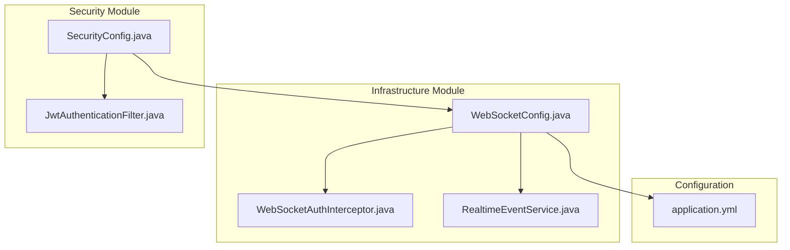
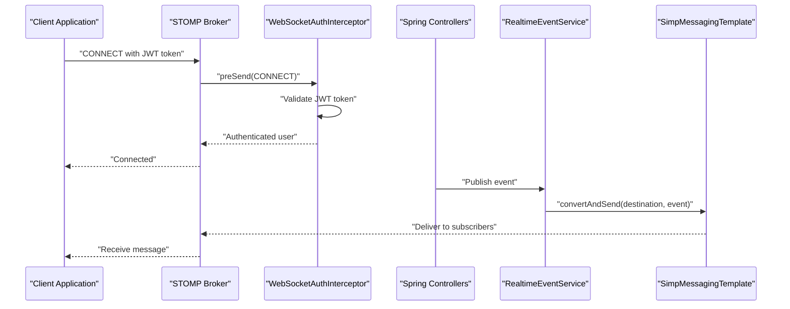
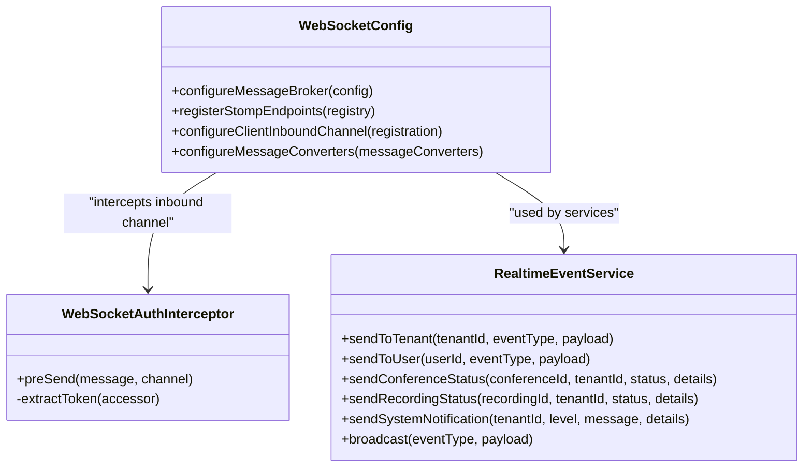
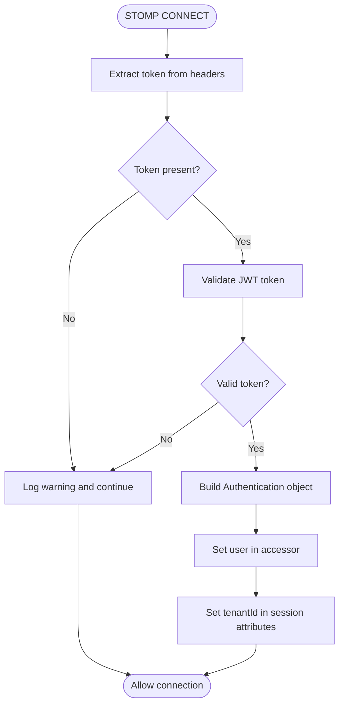
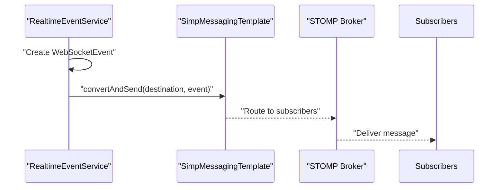
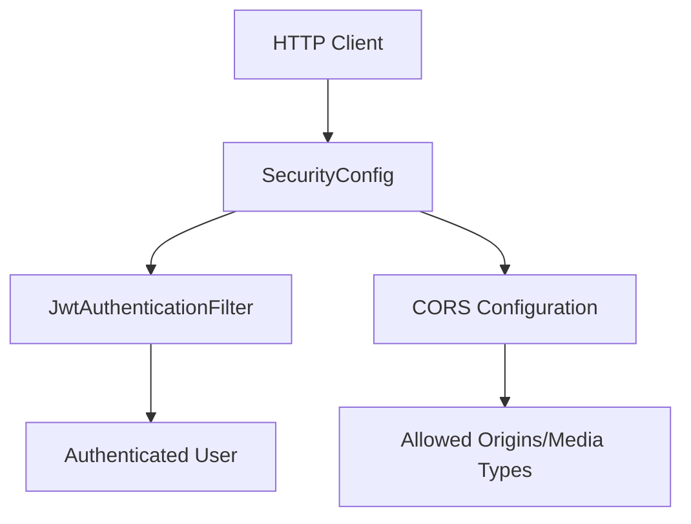
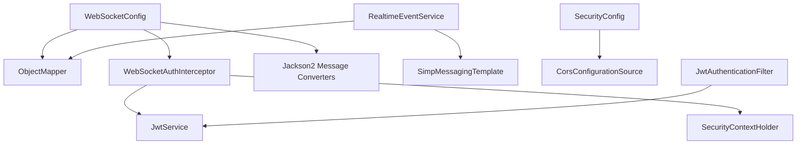

# WebSocket Configuration

<cite>
**Referenced Files in This Document**
- [WebSocketConfig.java](file://jmp-infrastructure/src/main/java/com/jmp/infrastructure/websocket/WebSocketConfig.java)
- [WebSocketAuthInterceptor.java](file://jmp-infrastructure/src/main/java/com/jmp/infrastructure/websocket/WebSocketAuthInterceptor.java)
- [RealtimeEventService.java](file://jmp-infrastructure/src/main/java/com/jmp/infrastructure/websocket/RealtimeEventService.java)
- [SecurityConfig.java](file://jmp-infrastructure/src/main/java/com/jmp/infrastructure/security/SecurityConfig.java)
- [JwtAuthenticationFilter.java](file://jmp-infrastructure/src/main/java/com/jmp/infrastructure/security/JwtAuthenticationFilter.java)
- [application.yml](file://jmp-web/src/main/resources/application.yml)
</cite>

## Table of Contents
1. [Introduction](#introduction)
2. [Project Structure](#project-structure)
3. [Core Components](#core-components)
4. [Architecture Overview](#architecture-overview)
5. [Detailed Component Analysis](#detailed-component-analysis)
6. [Dependency Analysis](#dependency-analysis)
7. [Performance Considerations](#performance-considerations)
8. [Troubleshooting Guide](#troubleshooting-guide)
9. [Conclusion](#conclusion)
10. [Appendices](#appendices)

## Introduction
This document provides comprehensive documentation for WebSocket configuration and setup in the application. It focuses on the WebSocketConfig class implementation, STOMP endpoint registration, message broker configuration, channel interception, and dual endpoint support for both SockJS and native WebSocket connections. It also covers message converter configuration with Jackson2 for JSON serialization, security considerations, CORS configuration, and production deployment recommendations. Practical examples of client connection setup and configuration best practices are included.

## Project Structure
The WebSocket configuration is implemented within the infrastructure module under the websocket package. Supporting components include an authentication interceptor, a real-time event service, and security configuration for CORS and JWT filtering.

**Diagram sources**
- [WebSocketConfig.java:27-69](file://jmp-infrastructure/src/main/java/com/jmp/infrastructure/websocket/WebSocketConfig.java#L27-L69)
- [WebSocketAuthInterceptor.java:29-93](file://jmp-infrastructure/src/main/java/com/jmp/infrastructure/websocket/WebSocketAuthInterceptor.java#L29-L93)
- [RealtimeEventService.java:20-141](file://jmp-infrastructure/src/main/java/com/jmp/infrastructure/websocket/RealtimeEventService.java#L20-L141)
- [SecurityConfig.java:31-89](file://jmp-infrastructure/src/main/java/com/jmp/infrastructure/security/SecurityConfig.java#L31-L89)
- [JwtAuthenticationFilter.java:29-122](file://jmp-infrastructure/src/main/java/com/jmp/infrastructure/security/JwtAuthenticationFilter.java#L29-L122)
- [application.yml:1-128](file://jmp-web/src/main/resources/application.yml#L1-L128)

**Section sources**
- [WebSocketConfig.java:1-70](file://jmp-infrastructure/src/main/java/com/jmp/infrastructure/websocket/WebSocketConfig.java#L1-L70)
- [WebSocketAuthInterceptor.java:1-94](file://jmp-infrastructure/src/main/java/com/jmp/infrastructure/websocket/WebSocketAuthInterceptor.java#L1-L94)
- [RealtimeEventService.java:1-142](file://jmp-infrastructure/src/main/java/com/jmp/infrastructure/websocket/RealtimeEventService.java#L1-L142)
- [SecurityConfig.java:1-90](file://jmp-infrastructure/src/main/java/com/jmp/infrastructure/security/SecurityConfig.java#L1-L90)
- [JwtAuthenticationFilter.java:1-122](file://jmp-infrastructure/src/main/java/com/jmp/infrastructure/security/JwtAuthenticationFilter.java#L1-L122)
- [application.yml:1-128](file://jmp-web/src/main/resources/application.yml#L1-L128)

## Core Components
This section documents the primary WebSocket configuration components and their responsibilities.

- WebSocketConfig: Implements WebSocketMessageBrokerConfigurer to configure STOMP endpoints, message broker routing, channel interception, and message converters.
- WebSocketAuthInterceptor: Intercepts inbound STOMP CONNECT messages to validate JWT tokens and establish authenticated sessions.
- RealtimeEventService: Provides methods to publish real-time events to topics and user-specific queues using Spring's SimpMessagingTemplate.
- SecurityConfig: Configures CORS policy and integrates JWT authentication filters for HTTP requests.
- JwtAuthenticationFilter: Extracts and validates JWT tokens from HTTP Authorization headers for REST endpoints.

Key responsibilities:
- Endpoint Registration: Registers both SockJS-enabled and native WebSocket endpoints.
- Broker Configuration: Enables a simple in-memory broker for topics and queues, sets application and user destination prefixes.
- Authentication: Uses JWT-based authentication for WebSocket connections via an inbound channel interceptor.
- Serialization: Configures Jackson2 for JSON message conversion with explicit content type resolution.

**Section sources**
- [WebSocketConfig.java:27-69](file://jmp-infrastructure/src/main/java/com/jmp/infrastructure/websocket/WebSocketConfig.java#L27-L69)
- [WebSocketAuthInterceptor.java:29-93](file://jmp-infrastructure/src/main/java/com/jmp/infrastructure/websocket/WebSocketAuthInterceptor.java#L29-L93)
- [RealtimeEventService.java:20-141](file://jmp-infrastructure/src/main/java/com/jmp/infrastructure/websocket/RealtimeEventService.java#L20-L141)
- [SecurityConfig.java:31-89](file://jmp-infrastructure/src/main/java/com/jmp/infrastructure/security/SecurityConfig.java#L31-L89)
- [JwtAuthenticationFilter.java:29-122](file://jmp-infrastructure/src/main/java/com/jmp/infrastructure/security/JwtAuthenticationFilter.java#L29-L122)

## Architecture Overview
The WebSocket architecture integrates Spring WebSocket with STOMP over both SockJS and native WebSocket transports. Authentication occurs during the STOMP CONNECT phase via a channel interceptor that validates JWT tokens. Events are published to topics and user-specific queues using Spring’s SimpMessagingTemplate.

**Diagram sources**
- [WebSocketConfig.java:42-50](file://jmp-infrastructure/src/main/java/com/jmp/infrastructure/websocket/WebSocketConfig.java#L42-L50)
- [WebSocketAuthInterceptor.java:34-73](file://jmp-infrastructure/src/main/java/com/jmp/infrastructure/websocket/WebSocketAuthInterceptor.java#L34-L73)
- [RealtimeEventService.java:88-101](file://jmp-infrastructure/src/main/java/com/jmp/infrastructure/websocket/RealtimeEventService.java#L88-L101)

## Detailed Component Analysis

### WebSocketConfig Analysis
The WebSocketConfig class implements WebSocketMessageBrokerConfigurer to define:
- Message Broker Routing: Enables a simple in-memory broker for topic and queue destinations, sets application destination prefixes, and user destination prefixes.
- STOMP Endpoint Registration: Registers two endpoints at /ws: one with SockJS for broad browser compatibility and another native WebSocket endpoint for modern clients.
- Channel Interception: Adds a WebSocketAuthInterceptor to the inbound client channel for authentication.
- Message Converters: Configures Jackson2 for JSON serialization with explicit content type resolution.

**Diagram sources**
- [WebSocketConfig.java:27-69](file://jmp-infrastructure/src/main/java/com/jmp/infrastructure/websocket/WebSocketConfig.java#L27-L69)
- [WebSocketAuthInterceptor.java:29-93](file://jmp-infrastructure/src/main/java/com/jmp/infrastructure/websocket/WebSocketAuthInterceptor.java#L29-L93)
- [RealtimeEventService.java:20-141](file://jmp-infrastructure/src/main/java/com/jmp/infrastructure/websocket/RealtimeEventService.java#L20-L141)

Implementation highlights:
- Message Broker Setup: enableSimpleBroker for "/topic" and "/queue" destinations; application destination prefix "/app"; user destination prefix "/user".
- Dual Endpoint Registration: Both SockJS and native WebSocket endpoints registered at "/ws" with allowed origin patterns "*".
- Channel Interception: Adds WebSocketAuthInterceptor to the inbound client channel.
- Message Converter: Jackson2 converter configured with DefaultContentTypeResolver defaulting to APPLICATION_JSON.

**Section sources**
- [WebSocketConfig.java:32-69](file://jmp-infrastructure/src/main/java/com/jmp/infrastructure/websocket/WebSocketConfig.java#L32-L69)

### WebSocketAuthInterceptor Analysis
The WebSocketAuthInterceptor validates JWT tokens present in STOMP CONNECT frames:
- Token Extraction: Reads Authorization header and login parameter for SockJS fallback.
- Token Validation: Uses JwtService to validate access tokens and extract user identity, tenant ID, and roles.
- Authentication Establishment: Sets the authenticated user in the STOMP header accessor and stores tenant ID in session attributes.

**Diagram sources**
- [WebSocketAuthInterceptor.java:34-73](file://jmp-infrastructure/src/main/java/com/jmp/infrastructure/websocket/WebSocketAuthInterceptor.java#L34-L73)

Security considerations:
- Token validation errors are logged and the message is allowed to pass to prevent blocking legitimate connections.
- Session attributes include tenantId for downstream authorization decisions.

**Section sources**
- [WebSocketAuthInterceptor.java:34-93](file://jmp-infrastructure/src/main/java/com/jmp/infrastructure/websocket/WebSocketAuthInterceptor.java#L34-L93)

### RealtimeEventService Analysis
The RealtimeEventService encapsulates event publishing logic:
- Tenant Broadcasting: sendToTenant publishes to "/topic/tenant/{tenantId}/{eventType}".
- User-Specific Delivery: sendToUser publishes to "/user/{userId}/queue/events".
- Event Types: Dedicated methods for conference status, recording status, and system notifications.
- Broadcast Capability: broadcast publishes to "/topic/broadcast/{eventType}".
- Error Handling: Wraps exceptions during event delivery and logs failures.

**Diagram sources**
- [RealtimeEventService.java:88-101](file://jmp-infrastructure/src/main/java/com/jmp/infrastructure/websocket/RealtimeEventService.java#L88-L101)

**Section sources**
- [RealtimeEventService.java:28-86](file://jmp-infrastructure/src/main/java/com/jmp/infrastructure/websocket/RealtimeEventService.java#L28-L86)

### Security and CORS Configuration
SecurityConfig defines CORS policies and JWT authentication for HTTP requests:
- CORS: Allows specific origins, methods, and headers with credentials enabled.
- JWT Filter: JwtAuthenticationFilter extracts and validates JWT tokens from Authorization headers for REST endpoints.

**Diagram sources**
- [SecurityConfig.java:78-89](file://jmp-infrastructure/src/main/java/com/jmp/infrastructure/security/SecurityConfig.java#L78-L89)
- [JwtAuthenticationFilter.java:39-76](file://jmp-infrastructure/src/main/java/com/jmp/infrastructure/security/JwtAuthenticationFilter.java#L39-L76)

**Section sources**
- [SecurityConfig.java:78-89](file://jmp-infrastructure/src/main/java/com/jmp/infrastructure/security/SecurityConfig.java#L78-L89)
- [JwtAuthenticationFilter.java:39-94](file://jmp-infrastructure/src/main/java/com/jmp/infrastructure/security/JwtAuthenticationFilter.java#L39-L94)

## Dependency Analysis
The WebSocket configuration depends on several components for authentication, serialization, and transport:

**Diagram sources**
- [WebSocketConfig.java:29-68](file://jmp-infrastructure/src/main/java/com/jmp/infrastructure/websocket/WebSocketConfig.java#L29-L68)
- [WebSocketAuthInterceptor.java:31-64](file://jmp-infrastructure/src/main/java/com/jmp/infrastructure/websocket/WebSocketAuthInterceptor.java#L31-L64)
- [RealtimeEventService.java:22-23](file://jmp-infrastructure/src/main/java/com/jmp/infrastructure/websocket/RealtimeEventService.java#L22-L23)
- [SecurityConfig.java:78-89](file://jmp-infrastructure/src/main/java/com/jmp/infrastructure/security/SecurityConfig.java#L78-L89)
- [JwtAuthenticationFilter.java:32-66](file://jmp-infrastructure/src/main/java/com/jmp/infrastructure/security/JwtAuthenticationFilter.java#L32-L66)

**Section sources**
- [WebSocketConfig.java:29-68](file://jmp-infrastructure/src/main/java/com/jmp/infrastructure/websocket/WebSocketConfig.java#L29-L68)
- [WebSocketAuthInterceptor.java:31-64](file://jmp-infrastructure/src/main/java/com/jmp/infrastructure/websocket/WebSocketAuthInterceptor.java#L31-L64)
- [RealtimeEventService.java:22-23](file://jmp-infrastructure/src/main/java/com/jmp/infrastructure/websocket/RealtimeEventService.java#L22-L23)
- [SecurityConfig.java:78-89](file://jmp-infrastructure/src/main/java/com/jmp/infrastructure/security/SecurityConfig.java#L78-L89)
- [JwtAuthenticationFilter.java:32-66](file://jmp-infrastructure/src/main/java/com/jmp/infrastructure/security/JwtAuthenticationFilter.java#L32-L66)

## Performance Considerations
- In-memory Broker Limitation: The current configuration uses a simple in-memory broker suitable for development and small-scale deployments. For production, replace with external brokers such as RabbitMQ or Redis to support horizontal scaling and persistence.
- Message Converter Efficiency: Jackson2 converter with explicit content type resolution ensures efficient JSON serialization. Consider tuning Jackson features for large payloads if needed.
- Channel Interceptor Overhead: Authentication checks occur on every CONNECT frame. Ensure JWT validation is fast and consider caching validated tokens if appropriate.
- Transport Choice: Prefer native WebSocket for modern clients to reduce overhead compared to SockJS. Maintain SockJS support for legacy environments.

[No sources needed since this section provides general guidance]

## Troubleshooting Guide
Common issues and resolutions:
- Authentication Failures: Verify JWT tokens are present in Authorization headers or login parameter for SockJS. Check logs for warnings about invalid or missing tokens.
- CORS Errors: Confirm allowed origins, methods, and headers match client configuration. Ensure credentials are enabled when required.
- Broker Connectivity: Ensure the STOMP endpoint is reachable at /ws and that the broker is configured for "/topic" and "/queue" destinations.
- Serialization Issues: Confirm message converters are configured with Jackson2 and default content type is APPLICATION_JSON.

**Section sources**
- [WebSocketAuthInterceptor.java:44-70](file://jmp-infrastructure/src/main/java/com/jmp/infrastructure/websocket/WebSocketAuthInterceptor.java#L44-L70)
- [SecurityConfig.java:78-89](file://jmp-infrastructure/src/main/java/com/jmp/infrastructure/security/SecurityConfig.java#L78-L89)
- [WebSocketConfig.java:58-68](file://jmp-infrastructure/src/main/java/com/jmp/infrastructure/websocket/WebSocketConfig.java#L58-L68)

## Conclusion
The WebSocket configuration provides a robust foundation for real-time communication with dual transport support, JWT-based authentication, and flexible event routing. For production, migrate to external message brokers, harden CORS policies, and implement comprehensive monitoring and alerting.

[No sources needed since this section summarizes without analyzing specific files]

## Appendices

### Client Connection Setup and Best Practices
- Endpoint Selection: Use "/ws" for both SockJS and native WebSocket clients. Modern clients can connect directly to the native endpoint.
- Authentication: Include a valid JWT token in the Authorization header or as a login parameter for SockJS fallback.
- Destination Patterns:
  - Tenant broadcasts: Subscribe to "/topic/tenant/{tenantId}/{eventType}"
  - User-specific: Subscribe to "/user/{userId}/queue/events"
  - Status updates: Subscribe to "/topic/tenant/{tenantId}/conference/{id}/status" or "/topic/tenant/{tenantId}/recording/{id}/status"
- Message Format: Expect JSON payloads wrapped by the WebSocketEvent envelope containing type, payload, and timestamp.
- Security: Configure allowed origins and headers according to your deployment environment. Disable wildcard origins in production.

**Section sources**
- [WebSocketConfig.java:42-50](file://jmp-infrastructure/src/main/java/com/jmp/infrastructure/websocket/WebSocketConfig.java#L42-L50)
- [WebSocketAuthInterceptor.java:75-92](file://jmp-infrastructure/src/main/java/com/jmp/infrastructure/websocket/WebSocketAuthInterceptor.java#L75-L92)
- [RealtimeEventService.java:28-86](file://jmp-infrastructure/src/main/java/com/jmp/infrastructure/websocket/RealtimeEventService.java#L28-L86)

### Production Deployment Recommendations
- Message Broker: Replace the simple in-memory broker with RabbitMQ or Redis for scalability and reliability.
- CORS Hardening: Restrict allowed origins to specific domains and remove wildcard patterns.
- Security Headers: Add appropriate security headers and consider rate limiting for WebSocket endpoints.
- Monitoring: Instrument WebSocket traffic, authentication failures, and broker connectivity.
- TLS: Enforce secure WebSocket connections (wss) in production environments.

**Section sources**
- [WebSocketConfig.java:34-36](file://jmp-infrastructure/src/main/java/com/jmp/infrastructure/websocket/WebSocketConfig.java#L34-L36)
- [SecurityConfig.java:78-89](file://jmp-infrastructure/src/main/java/com/jmp/infrastructure/security/SecurityConfig.java#L78-L89)
- [application.yml:72-79](file://jmp-web/src/main/resources/application.yml#L72-L79)