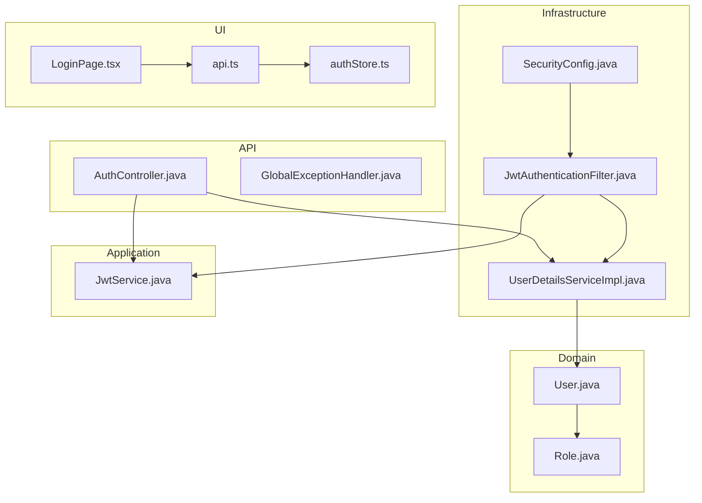
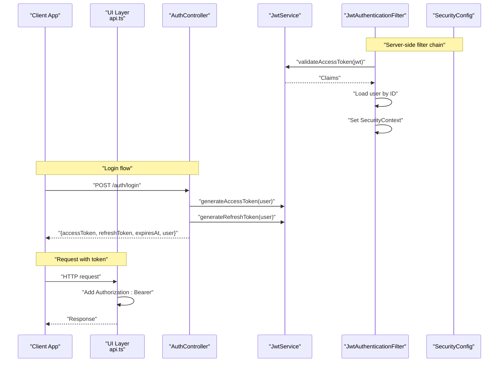
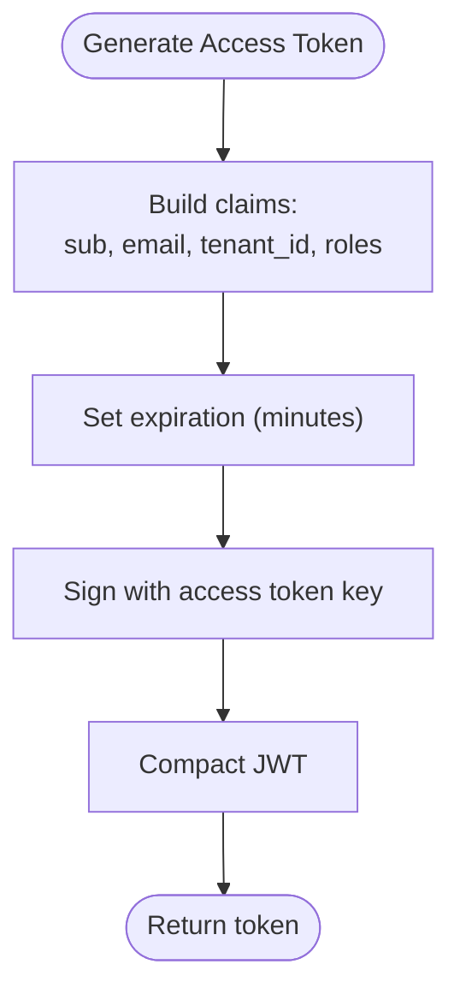
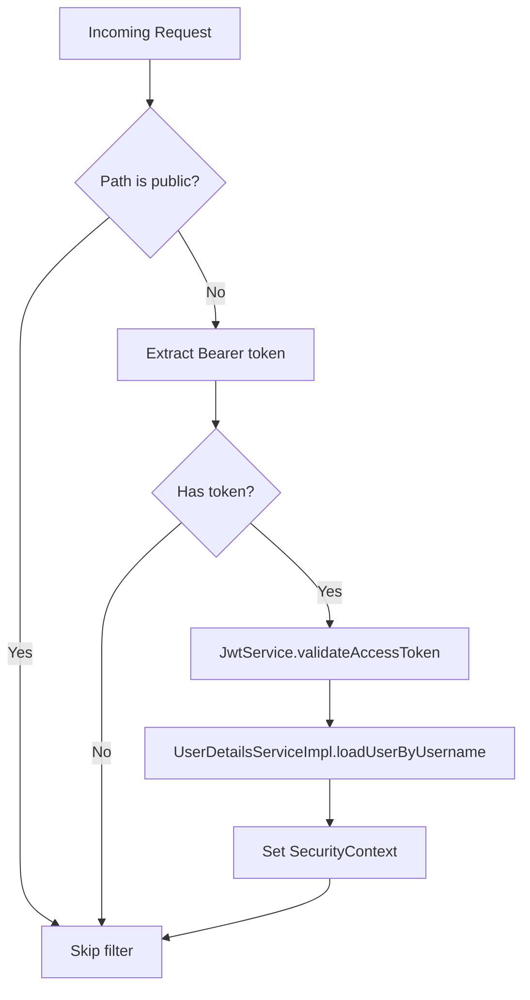
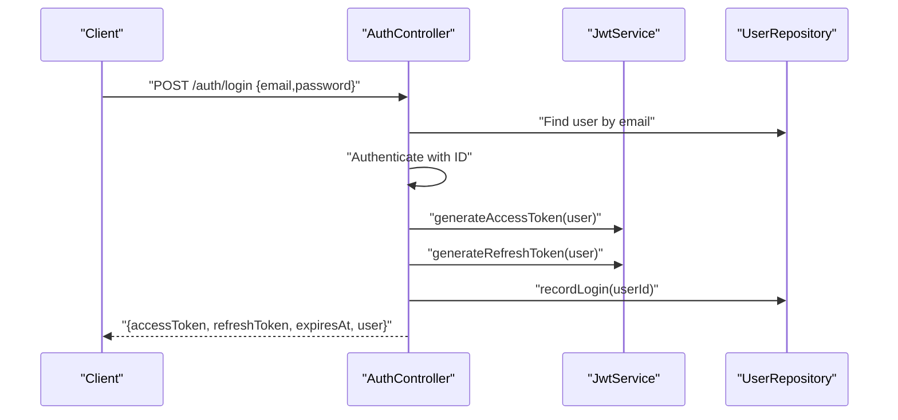
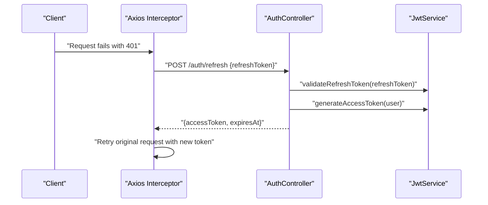
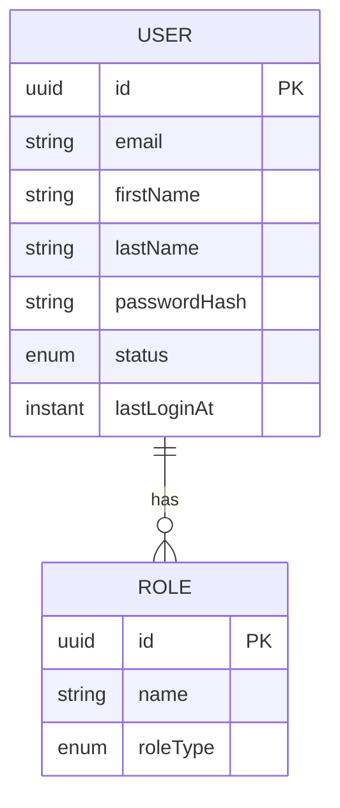
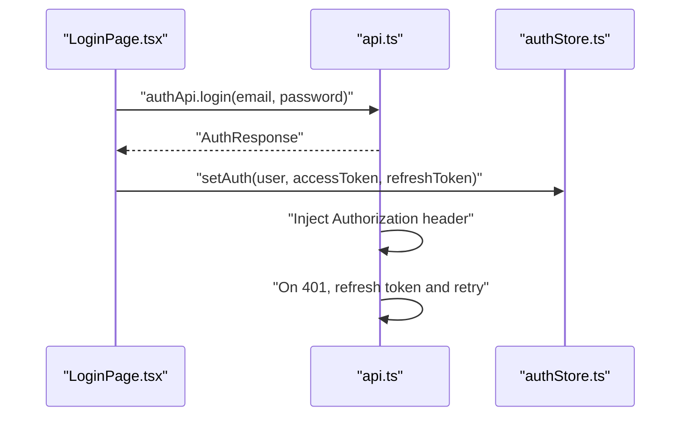
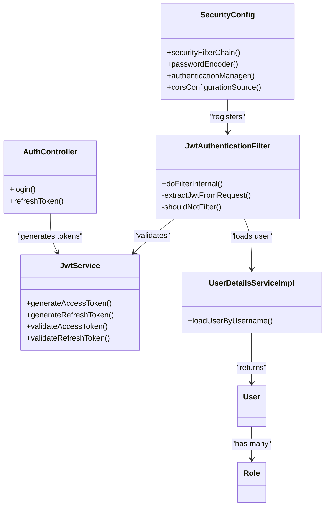

# Authentication System

<cite>
**Referenced Files in This Document**
- [JwtAuthenticationFilter.java](file://jmp-infrastructure/src/main/java/com/jmp/infrastructure/security/JwtAuthenticationFilter.java)
- [SecurityConfig.java](file://jmp-infrastructure/src/main/java/com/jmp/infrastructure/security/SecurityConfig.java)
- [JwtService.java](file://jmp-application/src/main/java/com/jmp/application/service/JwtService.java)
- [AuthController.java](file://jmp-api/src/main/java/com/jmp/api/controller/AuthController.java)
- [UserDetailsServiceImpl.java](file://jmp-infrastructure/src/main/java/com/jmp/infrastructure/security/UserDetailsServiceImpl.java)
- [application.yml](file://jmp-web/src/main/resources/application.yml)
- [GlobalExceptionHandler.java](file://jmp-api/src/main/java/com/jmp/api/advice/GlobalExceptionHandler.java)
- [api.ts](file://jmp-ui/src/services/api.ts)
- [authStore.ts](file://jmp-ui/src/store/authStore.ts)
- [LoginPage.tsx](file://jmp-ui/src/pages/LoginPage.tsx)
- [User.java](file://jmp-domain/src/main/java/com/jmp/domain/entity/User.java)
- [Role.java](file://jmp-domain/src/main/java/com/jmp/domain/entity/Role.java)
</cite>

## Table of Contents
1. [Introduction](#introduction)
2. [Project Structure](#project-structure)
3. [Core Components](#core-components)
4. [Architecture Overview](#architecture-overview)
5. [Detailed Component Analysis](#detailed-component-analysis)
6. [Dependency Analysis](#dependency-analysis)
7. [Performance Considerations](#performance-considerations)
8. [Troubleshooting Guide](#troubleshooting-guide)
9. [Conclusion](#conclusion)
10. [Appendices](#appendices)

## Introduction
This document describes the JWT-based authentication system used by the platform. It covers token generation and validation, refresh workflows, the filter chain, token extraction from requests, login/logout semantics, session management, security configurations (CORS, CSRF, security headers), authentication endpoints and schemas, error handling, and client-side token management practices for both web and mobile clients.

## Project Structure
The authentication system spans three layers:
- Infrastructure: Security configuration, JWT filter, and user details service
- Application: JWT service and business logic
- API: Authentication endpoints and global exception handling
- UI: Client-side token management and login flow

**Diagram sources**
- [SecurityConfig.java:43-61](file://jmp-infrastructure/src/main/java/com/jmp/infrastructure/security/SecurityConfig.java#L43-L61)
- [JwtAuthenticationFilter.java:39-76](file://jmp-infrastructure/src/main/java/com/jmp/infrastructure/security/JwtAuthenticationFilter.java#L39-L76)
- [JwtService.java:49-87](file://jmp-application/src/main/java/com/jmp/application/service/JwtService.java#L49-L87)
- [AuthController.java:42-81](file://jmp-api/src/main/java/com/jmp/api/controller/AuthController.java#L42-L81)
- [UserDetailsServiceImpl.java:25-46](file://jmp-infrastructure/src/main/java/com/jmp/infrastructure/security/UserDetailsServiceImpl.java#L25-L46)
- [api.ts:14-58](file://jmp-ui/src/services/api.ts#L14-L58)
- [authStore.ts:23-46](file://jmp-ui/src/store/authStore.ts#L23-L46)
- [LoginPage.tsx:24-40](file://jmp-ui/src/pages/LoginPage.tsx#L24-L40)
- [User.java:28-122](file://jmp-domain/src/main/java/com/jmp/domain/entity/User.java#L28-L122)
- [Role.java:27-130](file://jmp-domain/src/main/java/com/jmp/domain/entity/Role.java#L27-L130)

**Section sources**
- [SecurityConfig.java:43-61](file://jmp-infrastructure/src/main/java/com/jmp/infrastructure/security/SecurityConfig.java#L43-L61)
- [JwtAuthenticationFilter.java:27-94](file://jmp-infrastructure/src/main/java/com/jmp/infrastructure/security/JwtAuthenticationFilter.java#L27-L94)
- [JwtService.java:27-43](file://jmp-application/src/main/java/com/jmp/application/service/JwtService.java#L27-L43)
- [AuthController.java:30-81](file://jmp-api/src/main/java/com/jmp/api/controller/AuthController.java#L30-L81)
- [UserDetailsServiceImpl.java:19-46](file://jmp-infrastructure/src/main/java/com/jmp/infrastructure/security/UserDetailsServiceImpl.java#L19-L46)
- [api.ts:14-58](file://jmp-ui/src/services/api.ts#L14-L58)
- [authStore.ts:23-46](file://jmp-ui/src/store/authStore.ts#L23-L46)
- [LoginPage.tsx:16-40](file://jmp-ui/src/pages/LoginPage.tsx#L16-L40)
- [User.java:28-122](file://jmp-domain/src/main/java/com/jmp/domain/entity/User.java#L28-L122)
- [Role.java:27-130](file://jmp-domain/src/main/java/com/jmp/domain/entity/Role.java#L27-L130)

## Core Components
- JWT Service: Generates access and refresh tokens, validates tokens, extracts claims, and computes expiration
- Authentication Controller: Handles login and refresh requests, returns tokens and user metadata
- JWT Authentication Filter: Extracts Authorization header, validates access tokens, sets Spring Security context
- Security Configuration: Disables CSRF, configures CORS, sets stateless sessions, registers the JWT filter
- User Details Service: Loads user by ID for authentication and authority mapping
- Client SDK: Axios interceptors for automatic token injection and refresh flow

**Section sources**
- [JwtService.java:49-87](file://jmp-application/src/main/java/com/jmp/application/service/JwtService.java#L49-L87)
- [AuthController.java:42-100](file://jmp-api/src/main/java/com/jmp/api/controller/AuthController.java#L42-L100)
- [JwtAuthenticationFilter.java:39-76](file://jmp-infrastructure/src/main/java/com/jmp/infrastructure/security/JwtAuthenticationFilter.java#L39-L76)
- [SecurityConfig.java:43-88](file://jmp-infrastructure/src/main/java/com/jmp/infrastructure/security/SecurityConfig.java#L43-L88)
- [UserDetailsServiceImpl.java:25-46](file://jmp-infrastructure/src/main/java/com/jmp/infrastructure/security/UserDetailsServiceImpl.java#L25-L46)
- [api.ts:14-58](file://jmp-ui/src/services/api.ts#L14-L58)

## Architecture Overview
The authentication pipeline integrates server-side JWT validation with client-side token storage and automatic refresh.

**Diagram sources**
- [JwtAuthenticationFilter.java:39-76](file://jmp-infrastructure/src/main/java/com/jmp/infrastructure/security/JwtAuthenticationFilter.java#L39-L76)
- [JwtService.java:165-188](file://jmp-application/src/main/java/com/jmp/application/service/JwtService.java#L165-L188)
- [AuthController.java:42-81](file://jmp-api/src/main/java/com/jmp/api/controller/AuthController.java#L42-L81)
- [api.ts:14-23](file://jmp-ui/src/services/api.ts#L14-L23)

## Detailed Component Analysis

### JWT Token Generation and Validation
- Access tokens:
  - Subject: user ID
  - Claims: email, tenant_id, roles
  - Expiration: configured minutes (default 15)
  - Signing: HMAC secret derived from Base64
- Refresh tokens:
  - Purpose: obtain new access tokens
  - Claim type: "refresh"
  - Expiration: configured days (default 7)
  - Signing: separate HMAC secret
- Jitsi and guest tokens:
  - Room-scoped tokens with context and features
  - Short-lived (e.g., conference duration)

**Diagram sources**
- [JwtService.java:49-69](file://jmp-application/src/main/java/com/jmp/application/service/JwtService.java#L49-L69)

**Section sources**
- [JwtService.java:29-43](file://jmp-application/src/main/java/com/jmp/application/service/JwtService.java#L29-L43)
- [JwtService.java:49-87](file://jmp-application/src/main/java/com/jmp/application/service/JwtService.java#L49-L87)
- [JwtService.java:165-188](file://jmp-application/src/main/java/com/jmp/application/service/JwtService.java#L165-L188)
- [application.yml:75-78](file://jmp-web/src/main/resources/application.yml#L75-L78)

### Authentication Filter Chain and Token Extraction
- Filter runs before UsernamePasswordAuthenticationFilter
- Extracts Authorization header, expects "Bearer "
- Validates access token via JwtService
- Loads user details and sets authorities
- Skips filter for public endpoints and docs

**Diagram sources**
- [JwtAuthenticationFilter.java:39-94](file://jmp-infrastructure/src/main/java/com/jmp/infrastructure/security/JwtAuthenticationFilter.java#L39-L94)
- [SecurityConfig.java:58](file://jmp-infrastructure/src/main/java/com/jmp/infrastructure/security/SecurityConfig.java#L58)

**Section sources**
- [JwtAuthenticationFilter.java:39-94](file://jmp-infrastructure/src/main/java/com/jmp/infrastructure/security/JwtAuthenticationFilter.java#L39-L94)
- [SecurityConfig.java:43-61](file://jmp-infrastructure/src/main/java/com/jmp/infrastructure/security/SecurityConfig.java#L43-L61)

### Login and Logout Processes
- Login:
  - Authenticate with user ID and password hash
  - Generate access and refresh tokens
  - Record login timestamp
  - Return tokens and user metadata
- Logout:
  - No server-side state maintained (stateless)
  - Client clears stored tokens
  - Optional: backend blacklist strategy (see Troubleshooting)

**Diagram sources**
- [AuthController.java:42-81](file://jmp-api/src/main/java/com/jmp/api/controller/AuthController.java#L42-L81)
- [JwtService.java:49-87](file://jmp-application/src/main/java/com/jmp/application/service/JwtService.java#L49-L87)
- [UserService.java:150-156](file://jmp-application/src/main/java/com/jmp/application/service/UserService.java#L150-L156)

**Section sources**
- [AuthController.java:42-81](file://jmp-api/src/main/java/com/jmp/api/controller/AuthController.java#L42-L81)
- [UserService.java:150-156](file://jmp-application/src/main/java/com/jmp/application/service/UserService.java#L150-L156)

### Token Refresh Workflow
- Client sends refresh token to /auth/refresh
- Server validates refresh token and ensures type "refresh"
- Generates new access token for the same user
- Returns new access token and expiration

**Diagram sources**
- [api.ts:25-58](file://jmp-ui/src/services/api.ts#L25-L58)
- [AuthController.java:83-100](file://jmp-api/src/main/java/com/jmp/api/controller/AuthController.java#L83-L100)
- [JwtService.java:176-188](file://jmp-application/src/main/java/com/jmp/application/service/JwtService.java#L176-L188)

**Section sources**
- [AuthController.java:83-100](file://jmp-api/src/main/java/com/jmp/api/controller/AuthController.java#L83-L100)
- [api.ts:25-58](file://jmp-ui/src/services/api.ts#L25-L58)
- [JwtService.java:176-188](file://jmp-application/src/main/java/com/jmp/application/service/JwtService.java#L176-L188)

### Session Management Strategies
- Stateless: SessionCreationPolicy is STATELESS
- No server-side session storage
- Access tokens short-lived (default 15 minutes)
- Refresh tokens rotate access tokens

**Section sources**
- [SecurityConfig.java:47-48](file://jmp-infrastructure/src/main/java/com/jmp/infrastructure/security/SecurityConfig.java#L47-L48)
- [JwtService.java:75-87](file://jmp-application/src/main/java/com/jmp/application/service/JwtService.java#L75-L87)

### Security Headers and CORS/CSRF
- CORS: Configured origins, methods, headers, credentials
- CSRF: Disabled (stateless REST)
- Security headers: Not explicitly configured in the shown files

**Section sources**
- [SecurityConfig.java:77-88](file://jmp-infrastructure/src/main/java/com/jmp/infrastructure/security/SecurityConfig.java#L77-L88)
- [SecurityConfig.java:45-46](file://jmp-infrastructure/src/main/java/com/jmp/infrastructure/security/SecurityConfig.java#L45-L46)

### Authentication Endpoints and Schemas
- POST /api/v1/auth/login
  - Request: LoginRequest { email, password }
  - Response: AuthResponse { accessToken, refreshToken, expiresAt, user }
- POST /api/v1/auth/refresh
  - Request: RefreshTokenRequest { refreshToken }
  - Response: TokenRefreshResponse { accessToken, expiresAt }

**Diagram sources**
- [User.java:28-122](file://jmp-domain/src/main/java/com/jmp/domain/entity/User.java#L28-L122)
- [Role.java:27-130](file://jmp-domain/src/main/java/com/jmp/domain/entity/Role.java#L27-L130)

**Section sources**
- [AuthController.java:103-123](file://jmp-api/src/main/java/com/jmp/api/controller/AuthController.java#L103-L123)
- [User.java:28-122](file://jmp-domain/src/main/java/com/jmp/domain/entity/User.java#L28-L122)
- [Role.java:27-130](file://jmp-domain/src/main/java/com/jmp/domain/entity/Role.java#L27-L130)

### Error Handling
- Unauthorized: BadCredentialsException mapped to RFC 7807 Problem Details
- Validation errors: Structured error payload with field-level details
- Other exceptions: Generic internal server error

**Section sources**
- [GlobalExceptionHandler.java:54-66](file://jmp-api/src/main/java/com/jmp/api/advice/GlobalExceptionHandler.java#L54-L66)
- [GlobalExceptionHandler.java:82-114](file://jmp-api/src/main/java/com/jmp/api/advice/GlobalExceptionHandler.java#L82-L114)

### Client-Side Token Management
- Axios request interceptor adds Authorization: Bearer
- Response interceptor handles 401 by refreshing token automatically
- Store persists user, access token, refresh token, and authentication state
- Login page posts credentials and stores returned tokens

**Diagram sources**
- [LoginPage.tsx:24-40](file://jmp-ui/src/pages/LoginPage.tsx#L24-L40)
- [api.ts:14-58](file://jmp-ui/src/services/api.ts#L14-L58)
- [authStore.ts:23-46](file://jmp-ui/src/store/authStore.ts#L23-L46)

**Section sources**
- [api.ts:14-58](file://jmp-ui/src/services/api.ts#L14-L58)
- [authStore.ts:23-46](file://jmp-ui/src/store/authStore.ts#L23-L46)
- [LoginPage.tsx:24-40](file://jmp-ui/src/pages/LoginPage.tsx#L24-L40)

## Dependency Analysis

**Diagram sources**
- [SecurityConfig.java:43-88](file://jmp-infrastructure/src/main/java/com/jmp/infrastructure/security/SecurityConfig.java#L43-L88)
- [JwtAuthenticationFilter.java:39-94](file://jmp-infrastructure/src/main/java/com/jmp/infrastructure/security/JwtAuthenticationFilter.java#L39-L94)
- [JwtService.java:49-87](file://jmp-application/src/main/java/com/jmp/application/service/JwtService.java#L49-L87)
- [AuthController.java:42-100](file://jmp-api/src/main/java/com/jmp/api/controller/AuthController.java#L42-L100)
- [UserDetailsServiceImpl.java:25-46](file://jmp-infrastructure/src/main/java/com/jmp/infrastructure/security/UserDetailsServiceImpl.java#L25-L46)
- [User.java:28-122](file://jmp-domain/src/main/java/com/jmp/domain/entity/User.java#L28-L122)
- [Role.java:27-130](file://jmp-domain/src/main/java/com/jmp/domain/entity/Role.java#L27-L130)

**Section sources**
- [SecurityConfig.java:43-88](file://jmp-infrastructure/src/main/java/com/jmp/infrastructure/security/SecurityConfig.java#L43-L88)
- [JwtAuthenticationFilter.java:39-94](file://jmp-infrastructure/src/main/java/com/jmp/infrastructure/security/JwtAuthenticationFilter.java#L39-L94)
- [JwtService.java:49-87](file://jmp-application/src/main/java/com/jmp/application/service/JwtService.java#L49-L87)
- [AuthController.java:42-100](file://jmp-api/src/main/java/com/jmp/api/controller/AuthController.java#L42-L100)
- [UserDetailsServiceImpl.java:25-46](file://jmp-infrastructure/src/main/java/com/jmp/infrastructure/security/UserDetailsServiceImpl.java#L25-L46)
- [User.java:28-122](file://jmp-domain/src/main/java/com/jmp/domain/entity/User.java#L28-L122)
- [Role.java:27-130](file://jmp-domain/src/main/java/com/jmp/domain/entity/Role.java#L27-L130)

## Performance Considerations
- Stateless design eliminates server-side session overhead
- Short-lived access tokens reduce risk and require frequent refresh
- Token validation is lightweight; avoid unnecessary database lookups by caching user roles during filter if needed
- Use efficient hashing (BCrypt) for password encoding

## Troubleshooting Guide
- 401 Unauthorized:
  - Verify Authorization header format and token freshness
  - Ensure access token is validated against correct signing key
  - Confirm user still active and roles unchanged
- 403 Forbidden:
  - Check role-based authorization and permissions
- Token expiration:
  - Implement automatic refresh on 401 using the provided interceptor
- Logout:
  - Clear client tokens; consider backend token blacklisting for compliance scenarios
- CORS issues:
  - Confirm allowed origins and credentials configuration

**Section sources**
- [GlobalExceptionHandler.java:54-80](file://jmp-api/src/main/java/com/jmp/api/advice/GlobalExceptionHandler.java#L54-L80)
- [api.ts:25-58](file://jmp-ui/src/services/api.ts#L25-L58)
- [SecurityConfig.java:77-88](file://jmp-infrastructure/src/main/java/com/jmp/infrastructure/security/SecurityConfig.java#L77-L88)

## Conclusion
The system implements a robust, stateless JWT authentication mechanism with clear separation of concerns across infrastructure, application, and API layers. It provides secure token generation and validation, automatic refresh handling, and comprehensive client-side integration. Security configurations disable CSRF and configure CORS appropriately, while error handling follows standardized problem details.

## Appendices

### Security Configuration Reference
- Access token secret and expiration: configured via application.yml
- Refresh token secret and expiration: configured via application.yml
- Password encoder cost: BCrypt with configurable strength

**Section sources**
- [application.yml:75-78](file://jmp-web/src/main/resources/application.yml#L75-L78)
- [SecurityConfig.java:64-67](file://jmp-infrastructure/src/main/java/com/jmp/infrastructure/security/SecurityConfig.java#L64-L67)