# Authorization and RBAC

<cite>
**Referenced Files in This Document**
- [SecurityConfig.java](file://jmp-infrastructure/src/main/java/com/jmp/infrastructure/security/SecurityConfig.java)
- [JwtAuthenticationFilter.java](file://jmp-infrastructure/src/main/java/com/jmp/infrastructure/security/JwtAuthenticationFilter.java)
- [UserDetailsServiceImpl.java](file://jmp-infrastructure/src/main/java/com/jmp/infrastructure/security/UserDetailsServiceImpl.java)
- [JwtService.java](file://jmp-application/src/main/java/com/jmp/application/service/JwtService.java)
- [AuthController.java](file://jmp-api/src/main/java/com/jmp/api/controller/AuthController.java)
- [UserController.java](file://jmp-api/src/main/java/com/jmp/api/controller/UserController.java)
- [ConferenceController.java](file://jmp-api/src/main/java/com/jmp/api/controller/ConferenceController.java)
- [AuditController.java](file://jmp-api/src/main/java/com/jmp/api/controller/AuditController.java)
- [User.java](file://jmp-domain/src/main/java/com/jmp/domain/entity/User.java)
- [Role.java](file://jmp-domain/src/main/java/com/jmp/domain/entity/Role.java)
- [Permission.java](file://jmp-domain/src/main/java/com/jmp/domain/entity/Permission.java)
- [Tenant.java](file://jmp-domain/src/main/java/com/jmp/domain/entity/Tenant.java)
- [UserService.java](file://jmp-application/src/main/java/com/jmp/application/service/UserService.java)
</cite>

## Table of Contents
1. [Introduction](#introduction)
2. [Project Structure](#project-structure)
3. [Core Components](#core-components)
4. [Architecture Overview](#architecture-overview)
5. [Detailed Component Analysis](#detailed-component-analysis)
6. [Dependency Analysis](#dependency-analysis)
7. [Performance Considerations](#performance-considerations)
8. [Troubleshooting Guide](#troubleshooting-guide)
9. [Conclusion](#conclusion)
10. [Appendices](#appendices)

## Introduction
This document explains the role-based access control (RBAC) implementation and multi-tenant authorization model. It covers how users are authenticated and authorized, how roles and permissions are modeled, and how method-level security enforces tenant-aware access to resources. It also documents the UserDetails implementation, custom userDetailsService, JWT token handling, and practical guidance for secure coding and authorization bypass prevention.

## Project Structure
Authorization and RBAC span three layers:
- Infrastructure: Security configuration, JWT filter, and user details loading
- Application: JWT service and business services
- API: Controllers with method-level security annotations

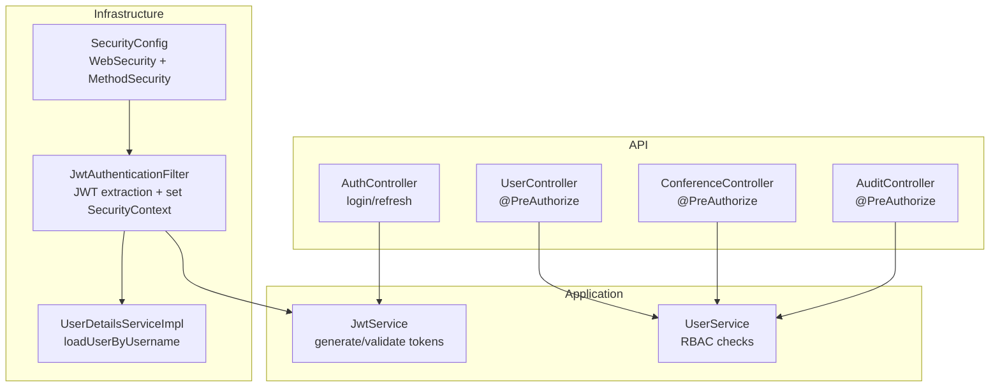

**Diagram sources**
- [SecurityConfig.java:42-61](file://jmp-infrastructure/src/main/java/com/jmp/infrastructure/security/SecurityConfig.java#L42-L61)
- [JwtAuthenticationFilter.java:39-76](file://jmp-infrastructure/src/main/java/com/jmp/infrastructure/security/JwtAuthenticationFilter.java#L39-L76)
- [UserDetailsServiceImpl.java:25-46](file://jmp-infrastructure/src/main/java/com/jmp/infrastructure/security/UserDetailsServiceImpl.java#L25-L46)
- [JwtService.java:49-87](file://jmp-application/src/main/java/com/jmp/application/service/JwtService.java#L49-L87)
- [UserService.java:161-168](file://jmp-application/src/main/java/com/jmp/application/service/UserService.java#L161-L168)
- [AuthController.java:42-81](file://jmp-api/src/main/java/com/jmp/api/controller/AuthController.java#L42-L81)
- [UserController.java:43-100](file://jmp-api/src/main/java/com/jmp/api/controller/UserController.java#L43-L100)
- [ConferenceController.java:49-138](file://jmp-api/src/main/java/com/jmp/api/controller/ConferenceController.java#L49-L138)
- [AuditController.java:40-73](file://jmp-api/src/main/java/com/jmp/api/controller/AuditController.java#L40-L73)

**Section sources**
- [SecurityConfig.java:28-90](file://jmp-infrastructure/src/main/java/com/jmp/infrastructure/security/SecurityConfig.java#L28-L90)
- [JwtAuthenticationFilter.java:27-122](file://jmp-infrastructure/src/main/java/com/jmp/infrastructure/security/JwtAuthenticationFilter.java#L27-L122)
- [UserDetailsServiceImpl.java:15-48](file://jmp-infrastructure/src/main/java/com/jmp/infrastructure/security/UserDetailsServiceImpl.java#L15-L48)
- [JwtService.java:25-236](file://jmp-application/src/main/java/com/jmp/application/service/JwtService.java#L25-L236)
- [AuthController.java:30-124](file://jmp-api/src/main/java/com/jmp/api/controller/AuthController.java#L30-124)
- [UserController.java:29-123](file://jmp-api/src/main/java/com/jmp/api/controller/UserController.java#L29-123)
- [ConferenceController.java:33-189](file://jmp-api/src/main/java/com/jmp/api/controller/ConferenceController.java#L33-189)
- [AuditController.java:26-82](file://jmp-api/src/main/java/com/jmp/api/controller/AuditController.java#L26-82)
- [UserService.java:28-190](file://jmp-application/src/main/java/com/jmp/application/service/UserService.java#L28-190)

## Core Components
- Security configuration enables web security and method-level security, defines stateless sessions, CORS, and registers the JWT filter.
- JWT filter extracts tokens from Authorization headers, validates them, loads user details, and sets authorities in the security context.
- User details service loads users with roles and maps them to granted authorities.
- JWT service generates access and refresh tokens and validates them; tokens carry user identity, tenant, and roles.
- Controllers enforce authorization via @PreAuthorize and extract tenant/user IDs from the security context details.

**Section sources**
- [SecurityConfig.java:42-75](file://jmp-infrastructure/src/main/java/com/jmp/infrastructure/security/SecurityConfig.java#L42-L75)
- [JwtAuthenticationFilter.java:39-76](file://jmp-infrastructure/src/main/java/com/jmp/infrastructure/security/JwtAuthenticationFilter.java#L39-L76)
- [UserDetailsServiceImpl.java:25-46](file://jmp-infrastructure/src/main/java/com/jmp/infrastructure/security/UserDetailsServiceImpl.java#L25-L46)
- [JwtService.java:49-87](file://jmp-application/src/main/java/com/jmp/application/service/JwtService.java#L49-L87)
- [UserController.java:43-100](file://jmp-api/src/main/java/com/jmp/api/controller/UserController.java#L43-L100)
- [ConferenceController.java:49-138](file://jmp-api/src/main/java/com/jmp/api/controller/ConferenceController.java#L49-L138)
- [AuditController.java:40-73](file://jmp-api/src/main/java/com/jmp/api/controller/AuditController.java#L40-L73)

## Architecture Overview
The authorization pipeline authenticates requests via JWT and enforces method-level security per tenant.

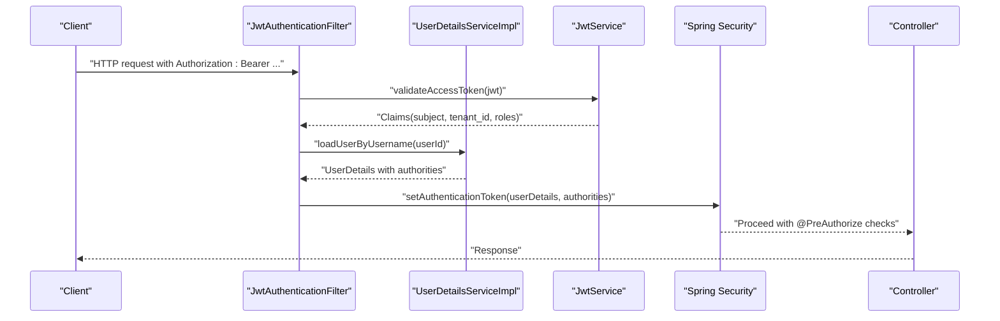

**Diagram sources**
- [JwtAuthenticationFilter.java:39-76](file://jmp-infrastructure/src/main/java/com/jmp/infrastructure/security/JwtAuthenticationFilter.java#L39-L76)
- [UserDetailsServiceImpl.java:25-46](file://jmp-infrastructure/src/main/java/com/jmp/infrastructure/security/UserDetailsServiceImpl.java#L25-L46)
- [JwtService.java:165-171](file://jmp-application/src/main/java/com/jmp/application/service/JwtService.java#L165-L171)
- [SecurityConfig.java:42-61](file://jmp-infrastructure/src/main/java/com/jmp/infrastructure/security/SecurityConfig.java#L42-L61)
- [UserController.java:43-100](file://jmp-api/src/main/java/com/jmp/api/controller/UserController.java#L43-L100)

## Detailed Component Analysis

### RBAC Model: Roles, Permissions, and Tenancy
- Roles are tenant-scoped or global. They are linked to permissions and can form hierarchical relationships.
- Users belong to a tenant and hold a set of roles.
- Permissions define actions on resources and are attached to roles.

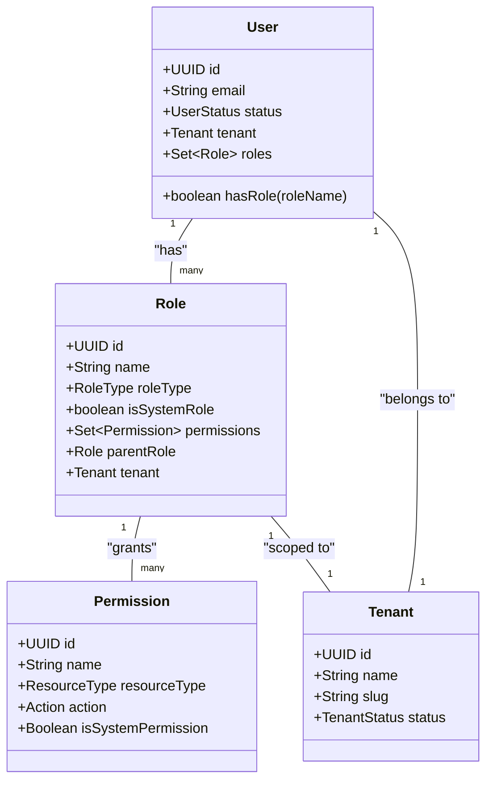

**Diagram sources**
- [User.java:28-130](file://jmp-domain/src/main/java/com/jmp/domain/entity/User.java#L28-L130)
- [Role.java:27-89](file://jmp-domain/src/main/java/com/jmp/domain/entity/Role.java#L27-L89)
- [Permission.java:23-98](file://jmp-domain/src/main/java/com/jmp/domain/entity/Permission.java#L23-L98)
- [Tenant.java:29-112](file://jmp-domain/src/main/java/com/jmp/domain/entity/Tenant.java#L29-L112)

**Section sources**
- [Role.java:17-131](file://jmp-domain/src/main/java/com/jmp/domain/entity/Role.java#L17-L131)
- [Permission.java:14-128](file://jmp-domain/src/main/java/com/jmp/domain/entity/Permission.java#L14-L128)
- [User.java:18-130](file://jmp-domain/src/main/java/com/jmp/domain/entity/User.java#L18-L130)
- [Tenant.java:19-112](file://jmp-domain/src/main/java/com/jmp/domain/entity/Tenant.java#L19-L112)

### UserDetails Implementation and Authority Mapping
- The custom userDetailsService loads a user by ID (from JWT subject), verifies activity, and maps roles to authorities.
- Authorities are simple strings derived from role names.

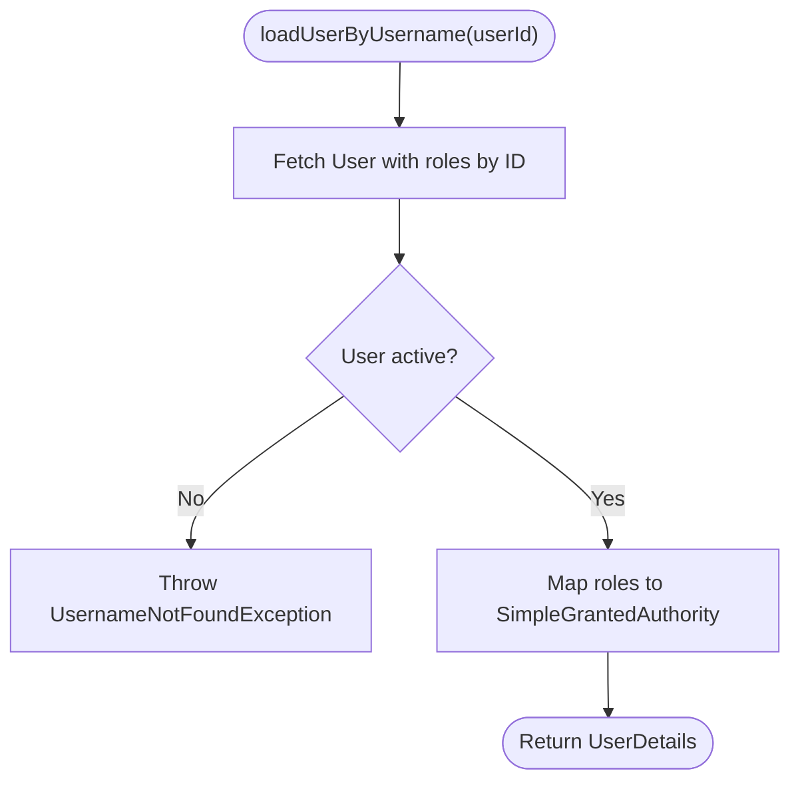

**Diagram sources**
- [UserDetailsServiceImpl.java:25-46](file://jmp-infrastructure/src/main/java/com/jmp/infrastructure/security/UserDetailsServiceImpl.java#L25-L46)

**Section sources**
- [UserDetailsServiceImpl.java:15-48](file://jmp-infrastructure/src/main/java/com/jmp/infrastructure/security/UserDetailsServiceImpl.java#L15-L48)

### JWT Token Handling and Security Context Population
- Access tokens are validated by the JWT service; the filter extracts subject (userId), tenant_id, and roles from claims.
- The filter constructs authorities from the token’s roles and sets an authentication token in the security context.

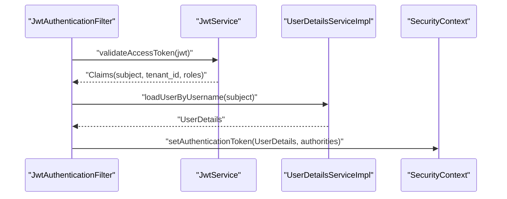

**Diagram sources**
- [JwtAuthenticationFilter.java:39-76](file://jmp-infrastructure/src/main/java/com/jmp/infrastructure/security/JwtAuthenticationFilter.java#L39-L76)
- [JwtService.java:165-171](file://jmp-application/src/main/java/com/jmp/application/service/JwtService.java#L165-L171)
- [UserDetailsServiceImpl.java:25-46](file://jmp-infrastructure/src/main/java/com/jmp/infrastructure/security/UserDetailsServiceImpl.java#L25-L46)

**Section sources**
- [JwtAuthenticationFilter.java:27-122](file://jmp-infrastructure/src/main/java/com/jmp/infrastructure/security/JwtAuthenticationFilter.java#L27-L122)
- [JwtService.java:49-87](file://jmp-application/src/main/java/com/jmp/application/service/JwtService.java#L49-L87)

### Authentication Flow and Token Management
- Login uses the AuthenticationManager with credentials resolved to a user ID; upon success, access and refresh tokens are generated.
- Refresh endpoint revalidates the refresh token and issues a new access token.

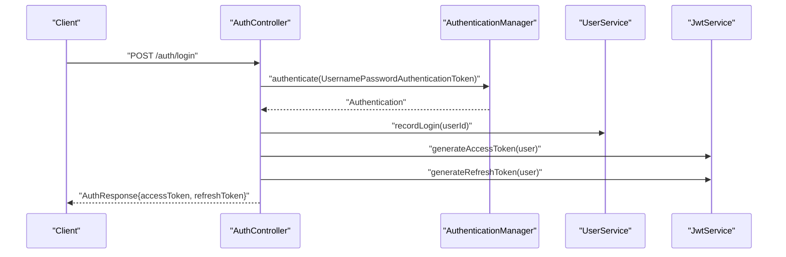

**Diagram sources**
- [AuthController.java:42-81](file://jmp-api/src/main/java/com/jmp/api/controller/AuthController.java#L42-L81)
- [JwtService.java:49-87](file://jmp-application/src/main/java/com/jmp/application/service/JwtService.java#L49-L87)
- [UserService.java:150-156](file://jmp-application/src/main/java/com/jmp/application/service/UserService.java#L150-L156)

**Section sources**
- [AuthController.java:30-124](file://jmp-api/src/main/java/com/jmp/api/controller/AuthController.java#L30-124)
- [JwtService.java:25-236](file://jmp-application/src/main/java/com/jmp/application/service/JwtService.java#L25-L236)

### Method-Level Security and Authorization Annotations
- Controllers use @PreAuthorize to gate endpoints by role or custom expressions.
- Controllers extract tenantId and userId from the security context details to enforce tenant scoping.

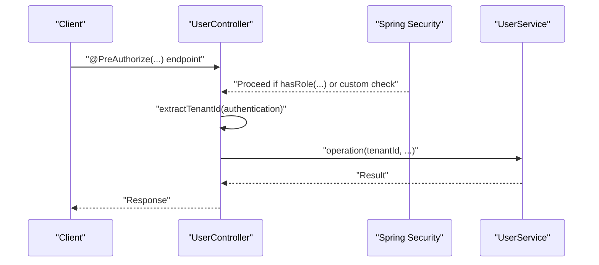

**Diagram sources**
- [UserController.java:43-100](file://jmp-api/src/main/java/com/jmp/api/controller/UserController.java#L43-L100)
- [JwtAuthenticationFilter.java:99-120](file://jmp-infrastructure/src/main/java/com/jmp/infrastructure/security/JwtAuthenticationFilter.java#L99-L120)
- [UserService.java:161-168](file://jmp-application/src/main/java/com/jmp/application/service/UserService.java#L161-L168)

**Section sources**
- [UserController.java:29-123](file://jmp-api/src/main/java/com/jmp/api/controller/UserController.java#L29-123)
- [ConferenceController.java:33-189](file://jmp-api/src/main/java/com/jmp/api/controller/ConferenceController.java#L33-189)
- [AuditController.java:26-82](file://jmp-api/src/main/java/com/jmp/api/controller/AuditController.java#L26-82)

### Tenant-Aware Resource Access Patterns
- Controllers derive tenantId from the security context details and scope queries to the tenant.
- Services operate on tenant-scoped repositories to ensure isolation.

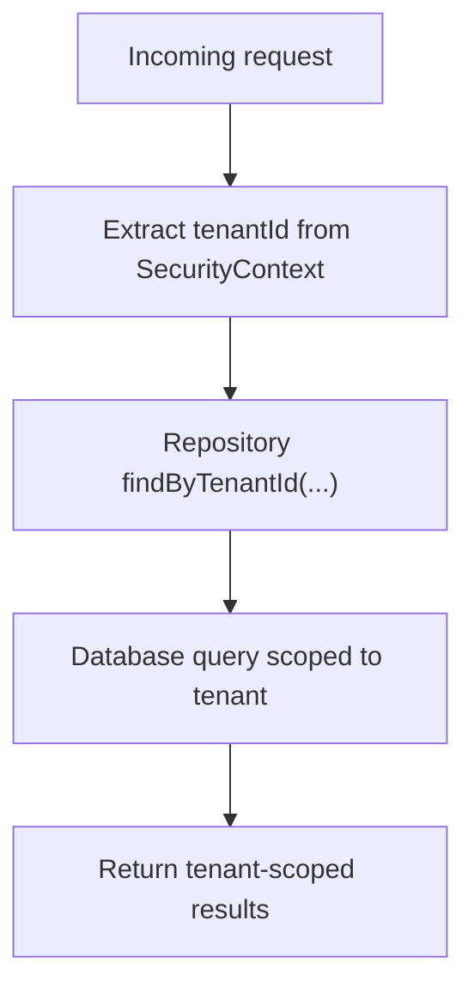

**Diagram sources**
- [JwtAuthenticationFilter.java:108-115](file://jmp-infrastructure/src/main/java/com/jmp/infrastructure/security/JwtAuthenticationFilter.java#L108-L115)
- [UserController.java:70-79](file://jmp-api/src/main/java/com/jmp/api/controller/UserController.java#L70-L79)
- [ConferenceController.java:78-89](file://jmp-api/src/main/java/com/jmp/api/controller/ConferenceController.java#L78-L89)

**Section sources**
- [JwtAuthenticationFilter.java:99-120](file://jmp-infrastructure/src/main/java/com/jmp/infrastructure/security/JwtAuthenticationFilter.java#L99-L120)
- [UserController.java:70-82](file://jmp-api/src/main/java/com/jmp/api/controller/UserController.java#L70-L82)
- [ConferenceController.java:78-98](file://jmp-api/src/main/java/com/jmp/api/controller/ConferenceController.java#L78-L98)

### Dynamic Authorization Checks and Permission Inheritance
- The service exposes a permission-check method that aggregates permissions from all roles assigned to a user.
- Roles can be hierarchical; while the model supports parent roles, the current service checks effective permissions via role-to-permission mapping.

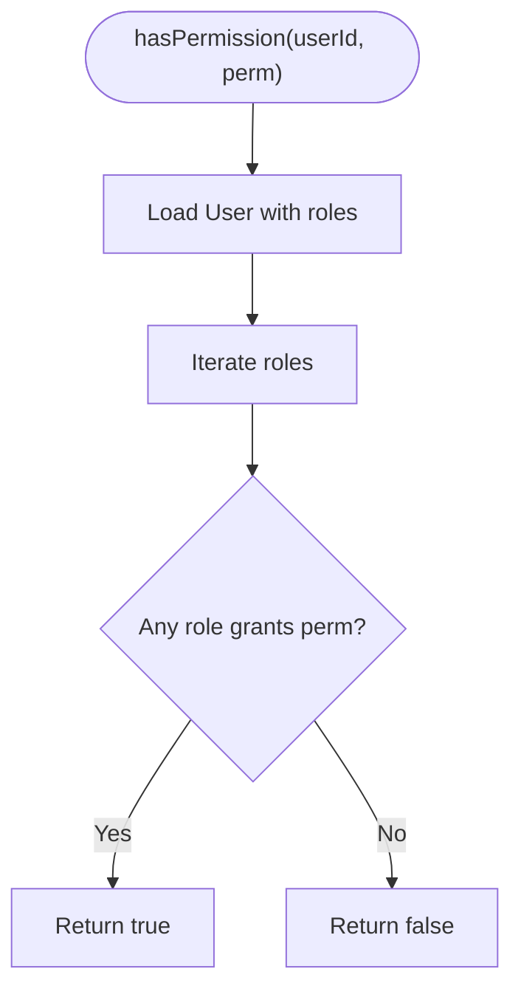

**Diagram sources**
- [UserService.java:161-168](file://jmp-application/src/main/java/com/jmp/application/service/UserService.java#L161-L168)
- [Role.java:76-82](file://jmp-domain/src/main/java/com/jmp/domain/entity/Role.java#L76-L82)

**Section sources**
- [UserService.java:158-168](file://jmp-application/src/main/java/com/jmp/application/service/UserService.java#L158-168)
- [Role.java:17-131](file://jmp-domain/src/main/java/com/jmp/domain/entity/Role.java#L17-L131)

### Security Context, Tokens, and Decision Managers
- The filter populates the SecurityContext with an authentication token containing authorities derived from the JWT.
- Method-level security relies on the presence of authorities and the configured expression evaluator.

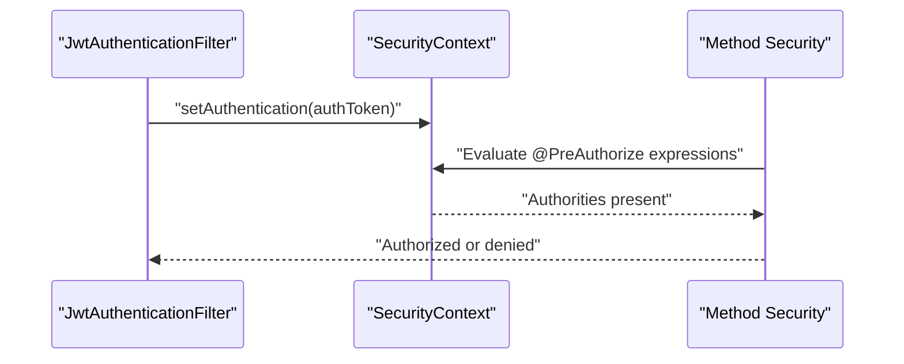

**Diagram sources**
- [JwtAuthenticationFilter.java:58-66](file://jmp-infrastructure/src/main/java/com/jmp/infrastructure/security/JwtAuthenticationFilter.java#L58-L66)
- [SecurityConfig.java:30](file://jmp-infrastructure/src/main/java/com/jmp/infrastructure/security/SecurityConfig.java#L30)

**Section sources**
- [JwtAuthenticationFilter.java:39-76](file://jmp-infrastructure/src/main/java/com/jmp/infrastructure/security/JwtAuthenticationFilter.java#L39-L76)
- [SecurityConfig.java:28-31](file://jmp-infrastructure/src/main/java/com/jmp/infrastructure/security/SecurityConfig.java#L28-L31)

## Dependency Analysis
- Controllers depend on services and the security context for tenant/user scoping.
- Services depend on repositories and the JWT service for token operations.
- The JWT filter depends on the JWT service and user details service.

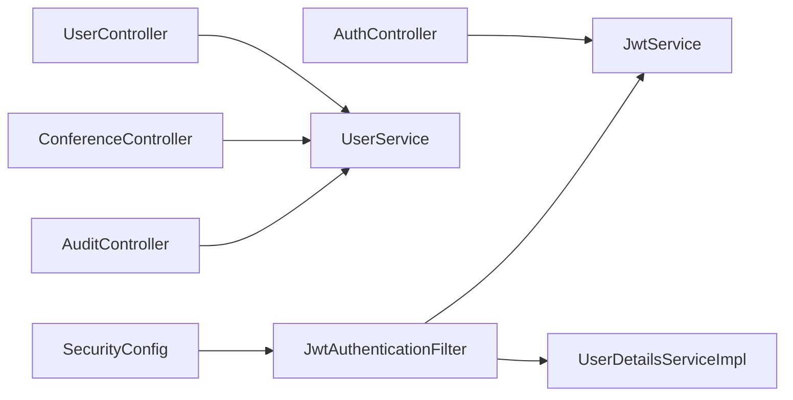

**Diagram sources**
- [AuthController.java:37-40](file://jmp-api/src/main/java/com/jmp/api/controller/AuthController.java#L37-L40)
- [UserController.java:41](file://jmp-api/src/main/java/com/jmp/api/controller/UserController.java#L41)
- [ConferenceController.java:45-47](file://jmp-api/src/main/java/com/jmp/api/controller/ConferenceController.java#L45-L47)
- [AuditController.java:38](file://jmp-api/src/main/java/com/jmp/api/controller/AuditController.java#L38)
- [JwtAuthenticationFilter.java:34-36](file://jmp-infrastructure/src/main/java/com/jmp/infrastructure/security/JwtAuthenticationFilter.java#L34-L36)
- [UserDetailsServiceImpl.java:23](file://jmp-infrastructure/src/main/java/com/jmp/infrastructure/security/UserDetailsServiceImpl.java#L23)
- [SecurityConfig.java:36-40](file://jmp-infrastructure/src/main/java/com/jmp/infrastructure/security/SecurityConfig.java#L36-L40)

**Section sources**
- [AuthController.java:30-124](file://jmp-api/src/main/java/com/jmp/api/controller/AuthController.java#L30-124)
- [UserController.java:29-123](file://jmp-api/src/main/java/com/jmp/api/controller/UserController.java#L29-123)
- [ConferenceController.java:33-189](file://jmp-api/src/main/java/com/jmp/api/controller/ConferenceController.java#L33-189)
- [AuditController.java:26-82](file://jmp-api/src/main/java/com/jmp/api/controller/AuditController.java#L26-82)
- [JwtAuthenticationFilter.java:27-122](file://jmp-infrastructure/src/main/java/com/jmp/infrastructure/security/JwtAuthenticationFilter.java#L27-122)
- [UserDetailsServiceImpl.java:15-48](file://jmp-infrastructure/src/main/java/com/jmp/infrastructure/security/UserDetailsServiceImpl.java#L15-48)
- [SecurityConfig.java:28-90](file://jmp-infrastructure/src/main/java/com/jmp/infrastructure/security/SecurityConfig.java#L28-90)

## Performance Considerations
- Stateless JWT validation avoids server-side session storage and database lookups during authorization.
- Ensure efficient database queries by scoping operations to tenantId and using appropriate indexes.
- Keep role-to-permission mapping minimal and avoid deep role hierarchies to reduce evaluation overhead.

## Troubleshooting Guide
Common issues and resolutions:
- Authentication fails due to invalid or missing token:
  - Verify Authorization header format and token validity.
  - Confirm token claims include subject, tenant_id, and roles.
- User not found during authentication:
  - Ensure the user ID in the token matches an existing, active user.
- Authorization denied despite correct roles:
  - Confirm @PreAuthorize expressions match role names and that authorities are populated from the token.
- Tenant scoping errors:
  - Ensure tenantId is extracted from the security context details and used to constrain repository queries.

**Section sources**
- [JwtAuthenticationFilter.java:39-76](file://jmp-infrastructure/src/main/java/com/jmp/infrastructure/security/JwtAuthenticationFilter.java#L39-L76)
- [UserDetailsServiceImpl.java:25-46](file://jmp-infrastructure/src/main/java/com/jmp/infrastructure/security/UserDetailsServiceImpl.java#L25-L46)
- [JwtService.java:165-171](file://jmp-application/src/main/java/com/jmp/application/service/JwtService.java#L165-L171)
- [UserController.java:70-82](file://jmp-api/src/main/java/com/jmp/api/controller/UserController.java#L70-L82)

## Conclusion
The system implements a robust RBAC model with tenant isolation, JWT-based authentication, and method-level security. Roles and permissions are modeled explicitly, and controllers enforce tenant-aware access using security context details. The design balances security and performance through stateless tokens and efficient scoping.

## Appendices

### Role and Permission Reference
- Predefined roles and permissions are defined as constants in the domain entities for consistent use in annotations and checks.

**Section sources**
- [Role.java:123-130](file://jmp-domain/src/main/java/com/jmp/domain/entity/Role.java#L123-L130)
- [Permission.java:100-127](file://jmp-domain/src/main/java/com/jmp/domain/entity/Permission.java#L100-L127)

### Secure Coding Practices and Authorization Bypass Prevention
- Always use @PreAuthorize on endpoints requiring authorization.
- Extract tenantId from the security context details and scope all repository queries to the tenant.
- Avoid bypassing method-level security by relying solely on request parameters; enforce tenant scoping in services.
- Keep role names and permission constants centralized and consistent across the codebase.
- Log authorization decisions and failures for auditing and incident response.