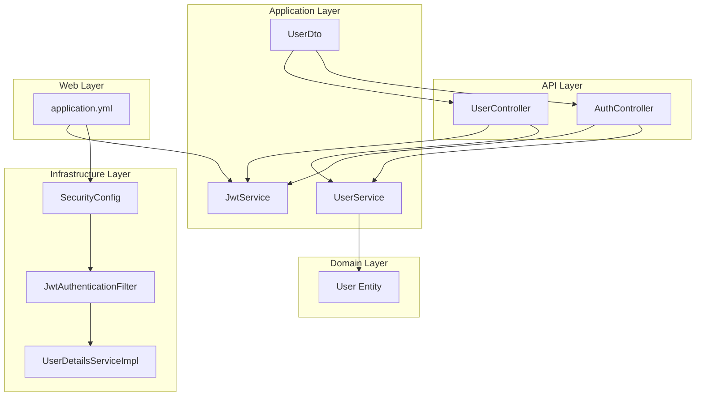
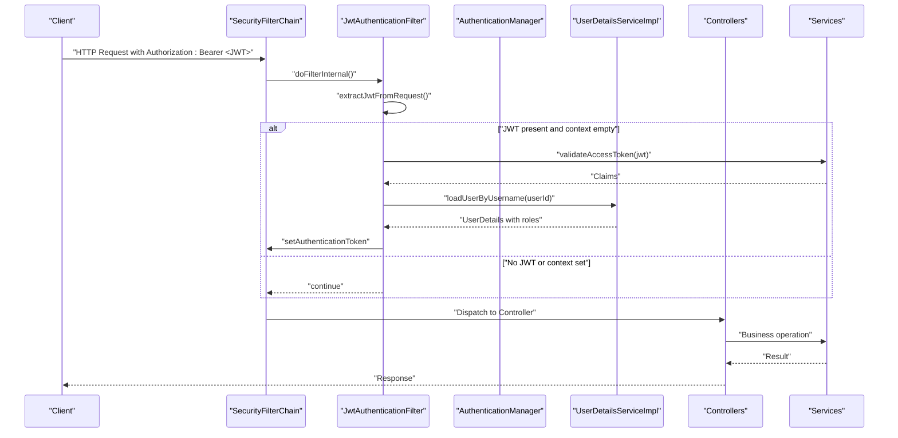
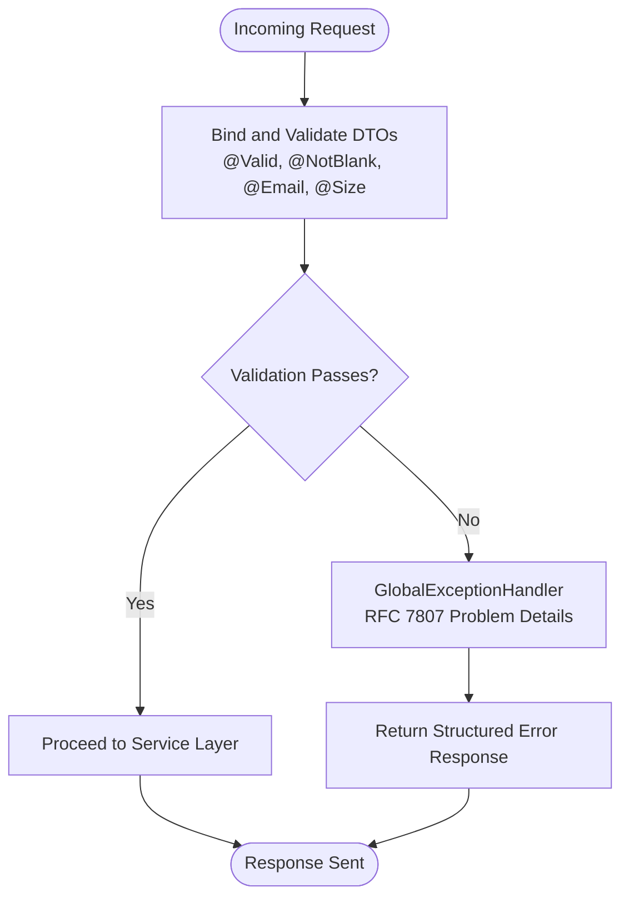
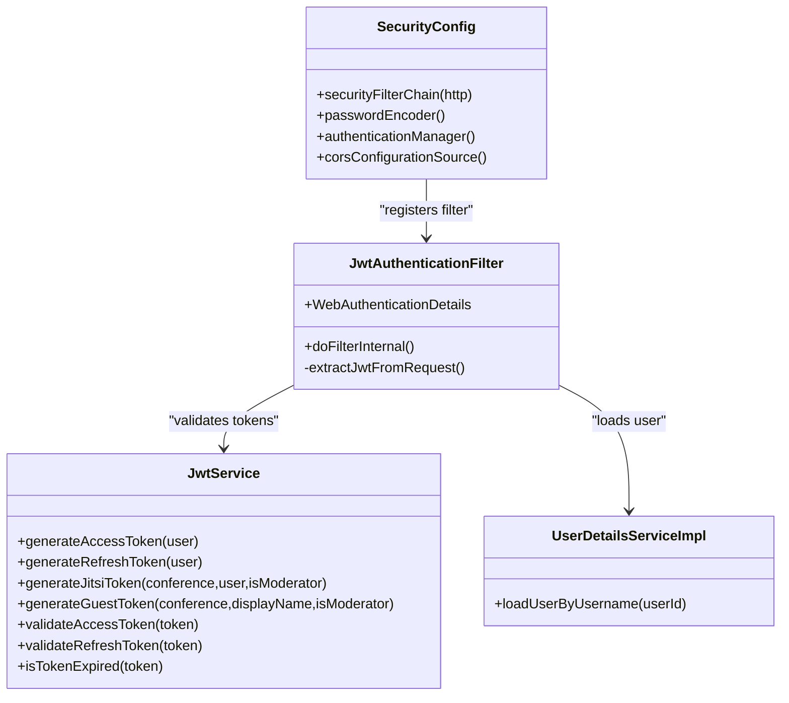
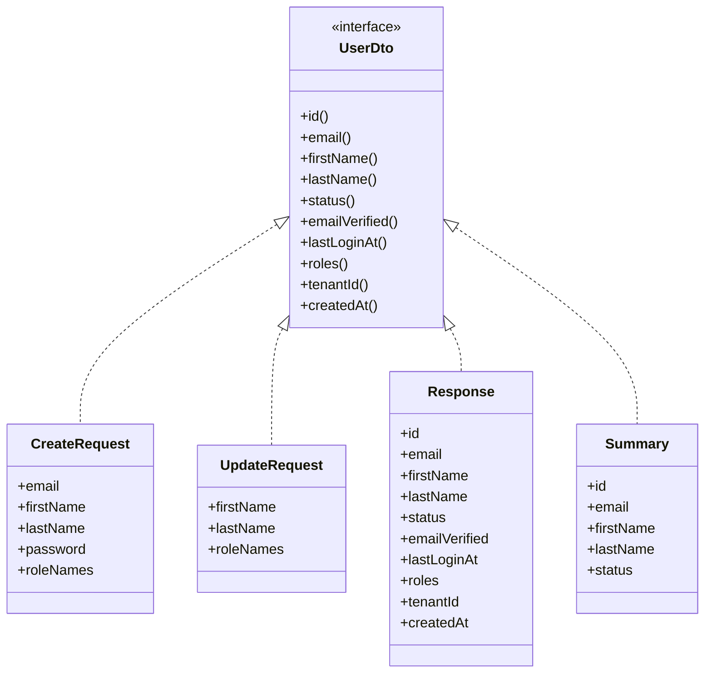
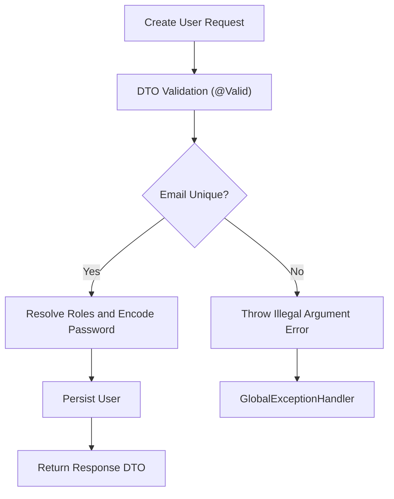
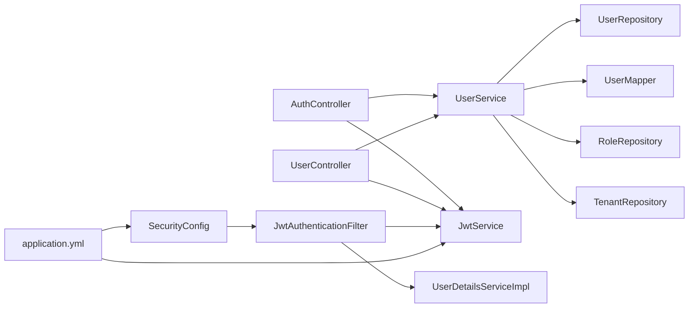

# Input Validation and Security

<cite>
**Referenced Files in This Document**
- [GlobalExceptionHandler.java](file://jmp-api/src/main/java/com/jmp/api/advice/GlobalExceptionHandler.java)
- [SecurityConfig.java](file://jmp-infrastructure/src/main/java/com/jmp/infrastructure/security/SecurityConfig.java)
- [JwtAuthenticationFilter.java](file://jmp-infrastructure/src/main/java/com/jmp/infrastructure/security/JwtAuthenticationFilter.java)
- [JwtService.java](file://jmp-application/src/main/java/com/jmp/application/service/JwtService.java)
- [UserDto.java](file://jmp-application/src/main/java/com/jmp/application/dto/UserDto.java)
- [UserController.java](file://jmp-api/src/main/java/com/jmp/api/controller/UserController.java)
- [AuthController.java](file://jmp-api/src/main/java/com/jmp/api/controller/AuthController.java)
- [UserService.java](file://jmp-application/src/main/java/com/jmp/application/service/UserService.java)
- [User.java](file://jmp-domain/src/main/java/com/jmp/domain/entity/User.java)
- [application.yml](file://jmp-web/src/main/resources/application.yml)
- [UserDetailsServiceImpl.java](file://jmp-infrastructure/src/main/java/com/jmp/infrastructure/security/UserDetailsServiceImpl.java)
</cite>

## Table of Contents
1. [Introduction](#introduction)
2. [Project Structure](#project-structure)
3. [Core Components](#core-components)
4. [Architecture Overview](#architecture-overview)
5. [Detailed Component Analysis](#detailed-component-analysis)
6. [Dependency Analysis](#dependency-analysis)
7. [Performance Considerations](#performance-considerations)
8. [Troubleshooting Guide](#troubleshooting-guide)
9. [Conclusion](#conclusion)
10. [Appendices](#appendices)

## Introduction
This document provides comprehensive input validation and security guidance for the platform. It focuses on:
- Input sanitization and validation via Bean Validation annotations and DTO constraints
- Constraint validation and error handling using Spring MVC and Jakarta Validation
- Protection against common web vulnerabilities: SQL injection, cross-site scripting (XSS), cross-site request forgery (CSRF), and command injection
- Secure parameter handling, query parameter validation, and request body sanitization
- Global exception management aligned with RFC 7807 Problem Details
- Content security policies, header validation, and secure deserialization practices
- Secure coding standards and vulnerability assessment guidelines

## Project Structure
The platform follows a layered architecture with clear separation of concerns:
- API layer: REST controllers exposing endpoints for authentication, user management, analytics, audit, recordings, and SSO
- Application layer: Services orchestrating business logic, DTOs for request/response validation, and mapping between entities and DTOs
- Domain layer: Entities and repositories defining the model and persistence boundaries
- Infrastructure layer: Security configuration, JWT filter, and user details service
- Web layer: Spring Boot application configuration and environment-specific settings

**Diagram sources**
- [AuthController.java:1-124](file://jmp-api/src/main/java/com/jmp/api/controller/AuthController.java#L1-L124)
- [UserController.java:1-123](file://jmp-api/src/main/java/com/jmp/api/controller/UserController.java#L1-L123)
- [UserService.java:1-190](file://jmp-application/src/main/java/com/jmp/application/service/UserService.java#L1-L190)
- [JwtService.java:1-236](file://jmp-application/src/main/java/com/jmp/application/service/JwtService.java#L1-L236)
- [UserDto.java:1-97](file://jmp-application/src/main/java/com/jmp/application/dto/UserDto.java#L1-L97)
- [User.java:1-164](file://jmp-domain/src/main/java/com/jmp/domain/entity/User.java#L1-L164)
- [SecurityConfig.java:1-90](file://jmp-infrastructure/src/main/java/com/jmp/infrastructure/security/SecurityConfig.java#L1-L90)
- [JwtAuthenticationFilter.java:1-122](file://jmp-infrastructure/src/main/java/com/jmp/infrastructure/security/JwtAuthenticationFilter.java#L1-L122)
- [UserDetailsServiceImpl.java:1-48](file://jmp-infrastructure/src/main/java/com/jmp/infrastructure/security/UserDetailsServiceImpl.java#L1-L48)
- [application.yml:1-128](file://jmp-web/src/main/resources/application.yml#L1-L128)

**Section sources**
- [AuthController.java:1-124](file://jmp-api/src/main/java/com/jmp/api/controller/AuthController.java#L1-L124)
- [UserController.java:1-123](file://jmp-api/src/main/java/com/jmp/api/controller/UserController.java#L1-L123)
- [UserService.java:1-190](file://jmp-application/src/main/java/com/jmp/application/service/UserService.java#L1-L190)
- [JwtService.java:1-236](file://jmp-application/src/main/java/com/jmp/application/service/JwtService.java#L1-L236)
- [UserDto.java:1-97](file://jmp-application/src/main/java/com/jmp/application/dto/UserDto.java#L1-L97)
- [User.java:1-164](file://jmp-domain/src/main/java/com/jmp/domain/entity/User.java#L1-L164)
- [SecurityConfig.java:1-90](file://jmp-infrastructure/src/main/java/com/jmp/infrastructure/security/SecurityConfig.java#L1-L90)
- [JwtAuthenticationFilter.java:1-122](file://jmp-infrastructure/src/main/java/com/jmp/infrastructure/security/JwtAuthenticationFilter.java#L1-L122)
- [UserDetailsServiceImpl.java:1-48](file://jmp-infrastructure/src/main/java/com/jmp/infrastructure/security/UserDetailsServiceImpl.java#L1-L48)
- [application.yml:1-128](file://jmp-web/src/main/resources/application.yml#L1-L128)

## Core Components
This section outlines the primary components involved in input validation and security:

- Validation and Error Handling
  - GlobalExceptionHandler implements RFC 7807 Problem Details for consistent error responses across validation failures, authentication errors, access denials, and generic exceptions.
  - Controllers use @Valid on DTOs and method parameters to trigger Bean Validation and Constraint Validation.

- Authentication and Authorization
  - SecurityConfig configures stateless sessions, disables CSRF, enables CORS, and enforces method-level security.
  - JwtAuthenticationFilter extracts and validates JWTs from Authorization headers and populates SecurityContextHolder.
  - JwtService generates and validates access and refresh tokens with bounded lifetimes and strong signing keys.
  - UserDetailsServiceImpl loads active users with roles for authentication.

- DTO Constraints and Transformation
  - UserDto defines strict constraints for creation and update requests using Jakarta Validation annotations.
  - Controllers map incoming requests to DTOs and delegate to services for processing.

- Secure Parameter Handling
  - Controllers validate query parameters and request bodies using @Valid and method-level annotations.
  - Services enforce business rules and uniqueness checks before persisting data.

**Section sources**
- [GlobalExceptionHandler.java:1-130](file://jmp-api/src/main/java/com/jmp/api/advice/GlobalExceptionHandler.java#L1-L130)
- [AuthController.java:1-124](file://jmp-api/src/main/java/com/jmp/api/controller/AuthController.java#L1-L124)
- [UserController.java:1-123](file://jmp-api/src/main/java/com/jmp/api/controller/UserController.java#L1-L123)
- [SecurityConfig.java:1-90](file://jmp-infrastructure/src/main/java/com/jmp/infrastructure/security/SecurityConfig.java#L1-L90)
- [JwtAuthenticationFilter.java:1-122](file://jmp-infrastructure/src/main/java/com/jmp/infrastructure/security/JwtAuthenticationFilter.java#L1-L122)
- [JwtService.java:1-236](file://jmp-application/src/main/java/com/jmp/application/service/JwtService.java#L1-L236)
- [UserDetailsServiceImpl.java:1-48](file://jmp-infrastructure/src/main/java/com/jmp/infrastructure/security/UserDetailsServiceImpl.java#L1-L48)
- [UserDto.java:1-97](file://jmp-application/src/main/java/com/jmp/application/dto/UserDto.java#L1-L97)
- [UserService.java:1-190](file://jmp-application/src/main/java/com/jmp/application/service/UserService.java#L1-L190)

## Architecture Overview
The security architecture integrates Spring Security, JWT-based authentication, and centralized validation:

**Diagram sources**
- [SecurityConfig.java:42-61](file://jmp-infrastructure/src/main/java/com/jmp/infrastructure/security/SecurityConfig.java#L42-L61)
- [JwtAuthenticationFilter.java:39-76](file://jmp-infrastructure/src/main/java/com/jmp/infrastructure/security/JwtAuthenticationFilter.java#L39-L76)
- [JwtService.java:165-171](file://jmp-application/src/main/java/com/jmp/application/service/JwtService.java#L165-L171)
- [UserDetailsServiceImpl.java:25-46](file://jmp-infrastructure/src/main/java/com/jmp/infrastructure/security/UserDetailsServiceImpl.java#L25-L46)
- [AuthController.java:42-81](file://jmp-api/src/main/java/com/jmp/api/controller/AuthController.java#L42-L81)
- [UserController.java:43-100](file://jmp-api/src/main/java/com/jmp/api/controller/UserController.java#L43-L100)

## Detailed Component Analysis

### Validation and Error Handling
- GlobalExceptionHandler centralizes error responses using ProblemDetail for:
  - Illegal argument and state conflicts
  - Bad credentials and access denied
  - MethodArgumentNotValidException and ConstraintViolationException
  - Generic internal server errors
- Controllers rely on @Valid and method-level annotations to trigger validation and produce structured error payloads.

**Diagram sources**
- [GlobalExceptionHandler.java:82-114](file://jmp-api/src/main/java/com/jmp/api/advice/GlobalExceptionHandler.java#L82-L114)
- [UserDto.java:30-62](file://jmp-application/src/main/java/com/jmp/application/dto/UserDto.java#L30-L62)
- [UserController.java:46-91](file://jmp-api/src/main/java/com/jmp/api/controller/UserController.java#L46-L91)
- [AuthController.java:44-80](file://jmp-api/src/main/java/com/jmp/api/controller/AuthController.java#L44-L80)

**Section sources**
- [GlobalExceptionHandler.java:1-130](file://jmp-api/src/main/java/com/jmp/api/advice/GlobalExceptionHandler.java#L1-L130)
- [UserDto.java:1-97](file://jmp-application/src/main/java/com/jmp/application/dto/UserDto.java#L1-L97)
- [UserController.java:1-123](file://jmp-api/src/main/java/com/jmp/api/controller/UserController.java#L1-L123)
- [AuthController.java:1-124](file://jmp-api/src/main/java/com/jmp/api/controller/AuthController.java#L1-L124)

### Authentication and Authorization
- SecurityConfig:
  - Disables CSRF for stateless JWT
  - Enables CORS with allowed origins and methods
  - Sets session policy to stateless
  - Public endpoints include authentication, webhooks, health, and Swagger
- JwtAuthenticationFilter:
  - Extracts Bearer token from Authorization header
  - Validates token via JwtService and loads user roles
  - Populates SecurityContextHolder with authenticated principal
- JwtService:
  - Generates access and refresh tokens with bounded TTLs
  - Validates tokens and extracts claims safely
- UserDetailsServiceImpl:
  - Loads active users with granted authorities

**Diagram sources**
- [SecurityConfig.java:42-88](file://jmp-infrastructure/src/main/java/com/jmp/infrastructure/security/SecurityConfig.java#L42-L88)
- [JwtAuthenticationFilter.java:29-122](file://jmp-infrastructure/src/main/java/com/jmp/infrastructure/security/JwtAuthenticationFilter.java#L29-L122)
- [JwtService.java:25-236](file://jmp-application/src/main/java/com/jmp/application/service/JwtService.java#L25-L236)
- [UserDetailsServiceImpl.java:19-48](file://jmp-infrastructure/src/main/java/com/jmp/infrastructure/security/UserDetailsServiceImpl.java#L19-L48)

**Section sources**
- [SecurityConfig.java:1-90](file://jmp-infrastructure/src/main/java/com/jmp/infrastructure/security/SecurityConfig.java#L1-L90)
- [JwtAuthenticationFilter.java:1-122](file://jmp-infrastructure/src/main/java/com/jmp/infrastructure/security/JwtAuthenticationFilter.java#L1-L122)
- [JwtService.java:1-236](file://jmp-application/src/main/java/com/jmp/application/service/JwtService.java#L1-L236)
- [UserDetailsServiceImpl.java:1-48](file://jmp-infrastructure/src/main/java/com/jmp/infrastructure/security/UserDetailsServiceImpl.java#L1-L48)

### DTO Constraints and Data Transformation
- UserDto.CreateRequest and UpdateRequest define:
  - Email format and size limits
  - Name size limits
  - Password length constraints
  - Optional role assignment
- Controllers accept validated DTOs and pass them to services for persistence and transformation.

**Diagram sources**
- [UserDto.java:14-96](file://jmp-application/src/main/java/com/jmp/application/dto/UserDto.java#L14-L96)

**Section sources**
- [UserDto.java:1-97](file://jmp-application/src/main/java/com/jmp/application/dto/UserDto.java#L1-L97)
- [UserController.java:46-91](file://jmp-api/src/main/java/com/jmp/api/controller/UserController.java#L46-L91)
- [AuthController.java:103-122](file://jmp-api/src/main/java/com/jmp/api/controller/AuthController.java#L103-L122)

### Secure Parameter Handling and Business Validation
- UserService enforces:
  - Email uniqueness for new users
  - Tenant existence and role resolution
  - Password hashing with BCrypt encoder
  - Soft deletion and login timestamp updates
- Controllers extract tenant and user IDs from JWT authentication details for authorization and scoping.

**Diagram sources**
- [UserService.java:44-70](file://jmp-application/src/main/java/com/jmp/application/service/UserService.java#L44-L70)
- [UserDto.java:30-44](file://jmp-application/src/main/java/com/jmp/application/dto/UserDto.java#L30-L44)
- [UserController.java:46-54](file://jmp-api/src/main/java/com/jmp/api/controller/UserController.java#L46-L54)

**Section sources**
- [UserService.java:1-190](file://jmp-application/src/main/java/com/jmp/application/service/UserService.java#L1-L190)
- [UserController.java:1-123](file://jmp-api/src/main/java/com/jmp/api/controller/UserController.java#L1-L123)
- [User.java:1-164](file://jmp-domain/src/main/java/com/jmp/domain/entity/User.java#L1-L164)

### Vulnerability Mitigation Strategies
- SQL Injection
  - Uses JPA/Hibernate with parameterized queries and repository abstractions; no raw SQL string concatenation observed in controllers/services.
  - Uniqueness and search queries leverage repository methods and JPQL/Criteria APIs.
- XSS
  - No HTML rendering in controllers; JSON responses only.
  - Frontend (UI) is separate; backend does not construct HTML from user input.
- CSRF
  - CSRF disabled in SecurityConfig because JWT is stateless and used for API authentication.
  - Stateless session policy prevents session-based CSRF vectors.
- Command Injection
  - No process execution or shell commands invoked by controllers/services.
  - Infrastructure components do not expose command injection points.

**Section sources**
- [SecurityConfig.java:44-48](file://jmp-infrastructure/src/main/java/com/jmp/infrastructure/security/SecurityConfig.java#L44-L48)
- [UserController.java:1-123](file://jmp-api/src/main/java/com/jmp/api/controller/UserController.java#L1-L123)
- [UserService.java:1-190](file://jmp-application/src/main/java/com/jmp/application/service/UserService.java#L1-L190)

## Dependency Analysis
The following diagram highlights key dependencies among validation, security, and business components:

**Diagram sources**
- [AuthController.java:37-40](file://jmp-api/src/main/java/com/jmp/api/controller/AuthController.java#L37-L40)
- [UserController.java:41-42](file://jmp-api/src/main/java/com/jmp/api/controller/UserController.java#L41-L42)
- [UserService.java:34-38](file://jmp-application/src/main/java/com/jmp/application/service/UserService.java#L34-L38)
- [SecurityConfig.java:33-40](file://jmp-infrastructure/src/main/java/com/jmp/infrastructure/security/SecurityConfig.java#L33-L40)
- [JwtAuthenticationFilter.java:32-37](file://jmp-infrastructure/src/main/java/com/jmp/infrastructure/security/JwtAuthenticationFilter.java#L32-L37)
- [JwtService.java:28-43](file://jmp-application/src/main/java/com/jmp/application/service/JwtService.java#L28-L43)
- [application.yml:71-78](file://jmp-web/src/main/resources/application.yml#L71-L78)

**Section sources**
- [AuthController.java:1-124](file://jmp-api/src/main/java/com/jmp/api/controller/AuthController.java#L1-L124)
- [UserController.java:1-123](file://jmp-api/src/main/java/com/jmp/api/controller/UserController.java#L1-L123)
- [UserService.java:1-190](file://jmp-application/src/main/java/com/jmp/application/service/UserService.java#L1-L190)
- [SecurityConfig.java:1-90](file://jmp-infrastructure/src/main/java/com/jmp/infrastructure/security/SecurityConfig.java#L1-L90)
- [JwtAuthenticationFilter.java:1-122](file://jmp-infrastructure/src/main/java/com/jmp/infrastructure/security/JwtAuthenticationFilter.java#L1-L122)
- [JwtService.java:1-236](file://jmp-application/src/main/java/com/jmp/application/service/JwtService.java#L1-L236)
- [application.yml:1-128](file://jmp-web/src/main/resources/application.yml#L1-L128)

## Performance Considerations
- Validation overhead is minimal due to early binding and constraint checks at the controller boundary.
- JWT validation is lightweight and performed per request; consider caching decoded claims if latency-sensitive.
- Database operations leverage pagination and indexing; ensure appropriate indices on search and filter columns.
- Logging includes structured JSON output for observability without compromising performance.

[No sources needed since this section provides general guidance]

## Troubleshooting Guide
Common issues and resolutions:
- Validation Failures
  - Symptom: 400 Validation Failed with field-level messages
  - Resolution: Review DTO constraints and request payload; ensure @Valid is applied on controllers
- Authentication Errors
  - Symptom: 401 Unauthorized or invalid credentials
  - Resolution: Verify Authorization header format and token validity; check token issuer and expiration
- Access Denied
  - Symptom: 403 Forbidden due to insufficient roles
  - Resolution: Confirm user roles and endpoint authorization rules
- Unexpected Errors
  - Symptom: 500 Internal Server Error
  - Resolution: Inspect logs for stack traces; ensure GlobalExceptionHandler is active

**Section sources**
- [GlobalExceptionHandler.java:26-128](file://jmp-api/src/main/java/com/jmp/api/advice/GlobalExceptionHandler.java#L26-L128)
- [JwtAuthenticationFilter.java:68-73](file://jmp-infrastructure/src/main/java/com/jmp/infrastructure/security/JwtAuthenticationFilter.java#L68-L73)
- [UserController.java:57-58](file://jmp-api/src/main/java/com/jmp/api/controller/UserController.java#L57-L58)

## Conclusion
The platform implements a robust, layered approach to input validation and security:
- Centralized validation via DTO constraints and global exception handling
- Stateless JWT authentication with strong cryptographic practices
- Secure configuration disabling CSRF and enforcing CORS
- Business logic validations ensuring data integrity and uniqueness
- Clear separation of concerns enabling maintainability and extensibility

[No sources needed since this section summarizes without analyzing specific files]

## Appendices

### Secure Coding Standards Checklist
- Input Validation
  - Always annotate DTOs and method parameters with appropriate Jakarta Validation constraints
  - Enforce size limits, formats, and non-null checks
- Authentication and Authorization
  - Use JWT for stateless API authentication
  - Store passwords with BCrypt and avoid plain-text
  - Restrict endpoints with method-level security annotations
- Error Handling
  - Return RFC 7807 Problem Details consistently
  - Log errors without exposing sensitive details
- Deserialization and Serialization
  - Configure Jackson to disable unknown property failure for controlled environments
  - Avoid insecure deserialization patterns
- Headers and CSP
  - Set appropriate CORS policies for trusted origins
  - Consider adding Content-Security-Policy headers at the gateway or reverse proxy layer

**Section sources**
- [UserDto.java:30-53](file://jmp-application/src/main/java/com/jmp/application/dto/UserDto.java#L30-L53)
- [UserService.java:56-58](file://jmp-application/src/main/java/com/jmp/application/service/UserService.java#L56-L58)
- [SecurityConfig.java:78-88](file://jmp-infrastructure/src/main/java/com/jmp/infrastructure/security/SecurityConfig.java#L78-L88)
- [application.yml:60-61](file://jmp-web/src/main/resources/application.yml#L60-L61)