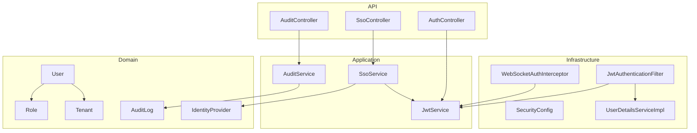
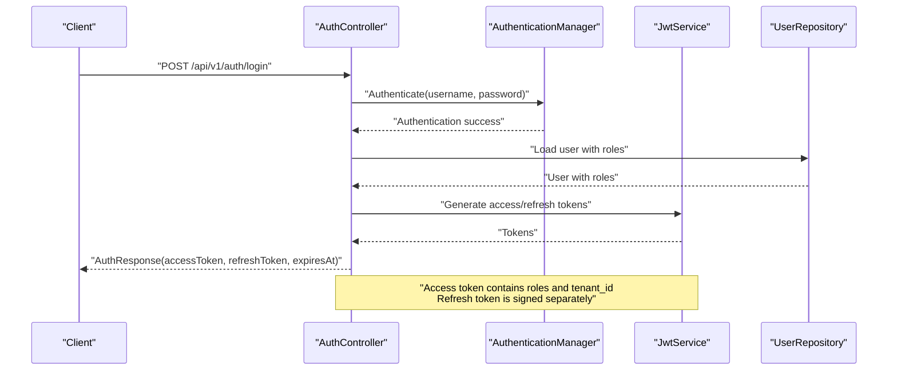
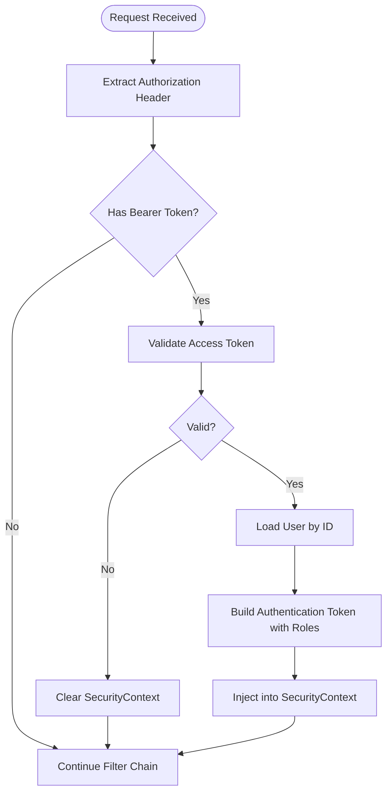
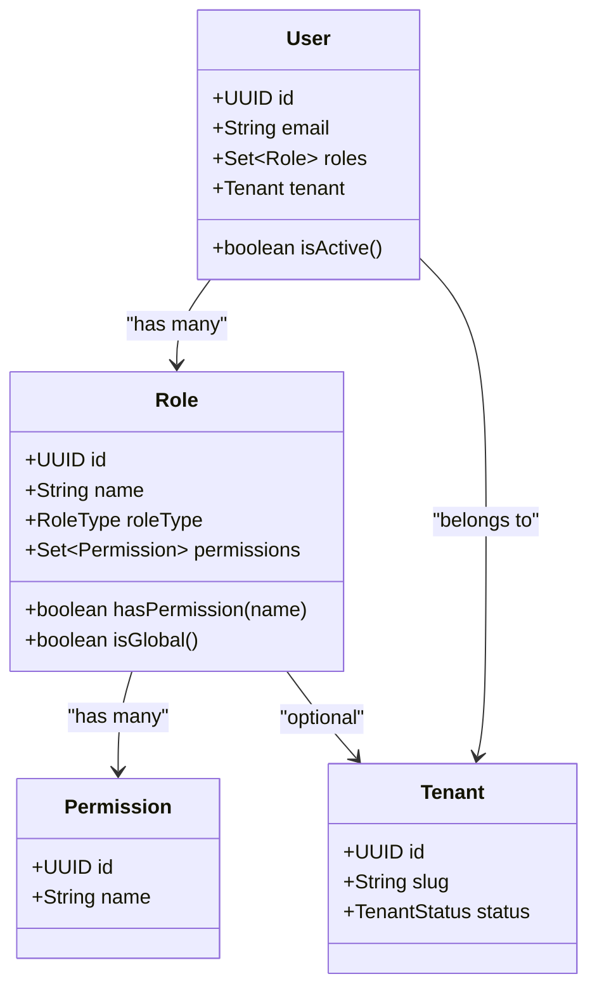
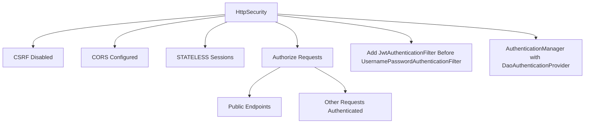
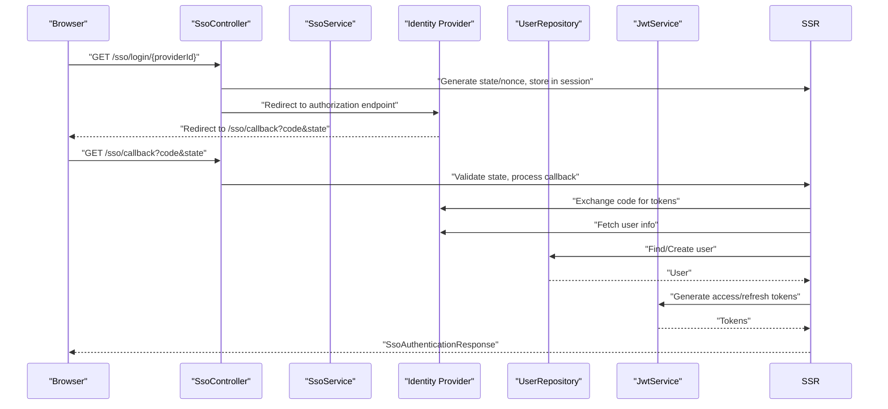
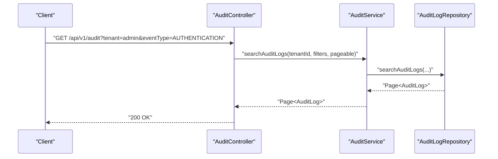
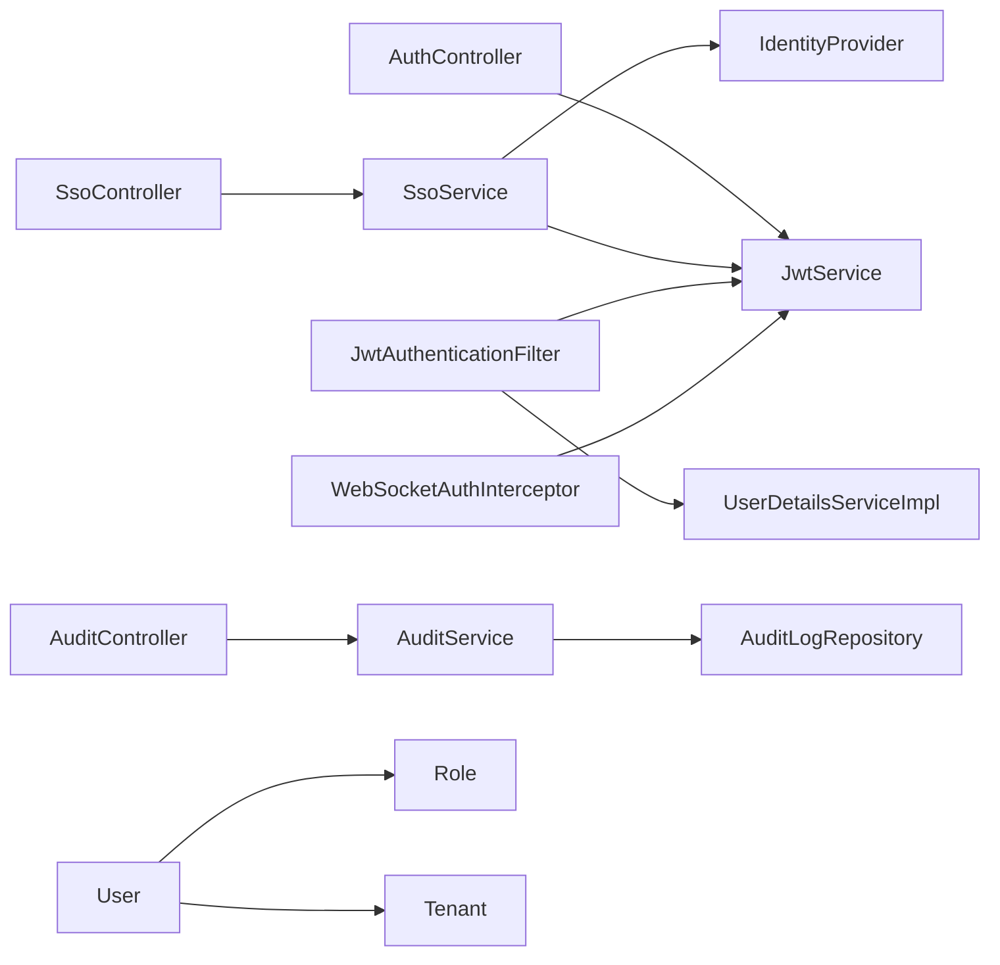

# Security Implementation

<cite>
**Referenced Files in This Document**
- [SecurityConfig.java](file://jmp-infrastructure/src/main/java/com/jmp/infrastructure/security/SecurityConfig.java)
- [JwtAuthenticationFilter.java](file://jmp-infrastructure/src/main/java/com/jmp/infrastructure/security/JwtAuthenticationFilter.java)
- [UserDetailsServiceImpl.java](file://jmp-infrastructure/src/main/java/com/jmp/infrastructure/security/UserDetailsServiceImpl.java)
- [JwtService.java](file://jmp-application/src/main/java/com/jmp/application/service/JwtService.java)
- [AuthController.java](file://jmp-api/src/main/java/com/jmp/api/controller/AuthController.java)
- [SsoController.java](file://jmp-api/src/main/java/com/jmp/api/controller/SsoController.java)
- [SsoService.java](file://jmp-application/src/main/java/com/jmp/application/service/SsoService.java)
- [WebSocketAuthInterceptor.java](file://jmp-infrastructure/src/main/java/com/jmp/infrastructure/websocket/WebSocketAuthInterceptor.java)
- [Role.java](file://jmp-domain/src/main/java/com/jmp/domain/entity/Role.java)
- [Tenant.java](file://jmp-domain/src/main/java/com/jmp/domain/entity/Tenant.java)
- [User.java](file://jmp-domain/src/main/java/com/jmp/domain/entity/User.java)
- [AuditLog.java](file://jmp-domain/src/main/java/com/jmp/domain/entity/AuditLog.java)
- [AuditService.java](file://jmp-application/src/main/java/com/jmp/application/service/AuditService.java)
- [AuditLogRepository.java](file://jmp-domain/src/main/java/com/jmp/domain/repository/AuditLogRepository.java)
- [AuditController.java](file://jmp-api/src/main/java/com/jmp/api/controller/AuditController.java)
- [IdentityProvider.java](file://jmp-domain/src/main/java/com/jmp/domain/entity/IdentityProvider.java)
</cite>

## Table of Contents
1. [Introduction](#introduction)
2. [Project Structure](#project-structure)
3. [Core Components](#core-components)
4. [Architecture Overview](#architecture-overview)
5. [Detailed Component Analysis](#detailed-component-analysis)
6. [Dependency Analysis](#dependency-analysis)
7. [Performance Considerations](#performance-considerations)
8. [Troubleshooting Guide](#troubleshooting-guide)
9. [Conclusion](#conclusion)
10. [Appendices](#appendices)

## Introduction
This document provides comprehensive security documentation for the Jitsi Management Platform. It covers JWT-based authentication, token generation and validation, refresh mechanisms, role-based access control (RBAC) with tenant isolation, Spring Security configuration, custom filters, and authentication providers. It also documents password security practices, session management, CSRF protection, input validation, SQL injection prevention, XSS protection, secure API design, audit logging for security events and compliance reporting, external authentication integration points, and security monitoring approaches. Finally, it outlines secure development practices and vulnerability mitigation strategies.

## Project Structure
Security-related components are distributed across infrastructure, application, domain, and API layers:
- Infrastructure: Spring Security configuration, JWT filter, user details service, and WebSocket authentication interceptor
- Application: JWT service, SSO service, and audit service
- Domain: Entities for RBAC (Role, Permission, User, Tenant), audit log model, and identity provider configuration
- API: Authentication, SSO, and audit controllers

**Diagram sources**
- [SecurityConfig.java:42-61](file://jmp-infrastructure/src/main/java/com/jmp/infrastructure/security/SecurityConfig.java#L42-L61)
- [JwtAuthenticationFilter.java:39-76](file://jmp-infrastructure/src/main/java/com/jmp/infrastructure/security/JwtAuthenticationFilter.java#L39-L76)
- [UserDetailsServiceImpl.java:25-46](file://jmp-infrastructure/src/main/java/com/jmp/infrastructure/security/UserDetailsServiceImpl.java#L25-L46)
- [JwtService.java:49-87](file://jmp-application/src/main/java/com/jmp/application/service/JwtService.java#L49-L87)
- [SsoService.java:69-131](file://jmp-application/src/main/java/com/jmp/application/service/SsoService.java#L69-L131)
- [AuditService.java:32-72](file://jmp-application/src/main/java/com/jmp/application/service/AuditService.java#L32-L72)
- [AuthController.java:42-100](file://jmp-api/src/main/java/com/jmp/api/controller/AuthController.java#L42-L100)
- [SsoController.java:56-110](file://jmp-api/src/main/java/com/jmp/api/controller/SsoController.java#L56-L110)
- [AuditController.java:40-73](file://jmp-api/src/main/java/com/jmp/api/controller/AuditController.java#L40-L73)
- [Role.java:22-131](file://jmp-domain/src/main/java/com/jmp/domain/entity/Role.java#L22-L131)
- [Tenant.java:24-174](file://jmp-domain/src/main/java/com/jmp/domain/entity/Tenant.java#L24-L174)
- [User.java:23-164](file://jmp-domain/src/main/java/com/jmp/domain/entity/User.java#L23-L164)
- [AuditLog.java:20-136](file://jmp-domain/src/main/java/com/jmp/domain/entity/AuditLog.java#L20-L136)
- [IdentityProvider.java:23-158](file://jmp-domain/src/main/java/com/jmp/domain/entity/IdentityProvider.java#L23-L158)

**Section sources**
- [SecurityConfig.java:42-61](file://jmp-infrastructure/src/main/java/com/jmp/infrastructure/security/SecurityConfig.java#L42-L61)
- [JwtService.java:49-87](file://jmp-application/src/main/java/com/jmp/application/service/JwtService.java#L49-L87)
- [AuthController.java:42-100](file://jmp-api/src/main/java/com/jmp/api/controller/AuthController.java#L42-L100)
- [SsoController.java:56-110](file://jmp-api/src/main/java/com/jmp/api/controller/SsoController.java#L56-L110)
- [AuditController.java:40-73](file://jmp-api/src/main/java/com/jmp/api/controller/AuditController.java#L40-L73)

## Core Components
- JWT Service: Generates access and refresh tokens, validates tokens, extracts claims, and computes expiration
- Authentication Controller: Handles login and token refresh
- JWT Authentication Filter: Extracts and validates JWTs, sets authentication in SecurityContext, and injects tenant/user details
- User Details Service: Loads users by ID for authentication and builds authorities from roles
- SSO Controller and Service: Integrates external identity providers via OIDC, manages state/nonce, and provisions users
- WebSocket Authentication Interceptor: Validates JWTs for STOMP WebSocket connections
- RBAC Model: Roles, permissions, and tenant scoping
- Audit Service and Controllers: Logs security and operational events, supports compliance reporting

**Section sources**
- [JwtService.java:49-236](file://jmp-application/src/main/java/com/jmp/application/service/JwtService.java#L49-L236)
- [AuthController.java:42-100](file://jmp-api/src/main/java/com/jmp/api/controller/AuthController.java#L42-L100)
- [JwtAuthenticationFilter.java:39-76](file://jmp-infrastructure/src/main/java/com/jmp/infrastructure/security/JwtAuthenticationFilter.java#L39-L76)
- [UserDetailsServiceImpl.java:25-46](file://jmp-infrastructure/src/main/java/com/jmp/infrastructure/security/UserDetailsServiceImpl.java#L25-L46)
- [SsoController.java:56-110](file://jmp-api/src/main/java/com/jmp/api/controller/SsoController.java#L56-L110)
- [SsoService.java:69-131](file://jmp-application/src/main/java/com/jmp/application/service/SsoService.java#L69-L131)
- [WebSocketAuthInterceptor.java:33-73](file://jmp-infrastructure/src/main/java/com/jmp/infrastructure/websocket/WebSocketAuthInterceptor.java#L33-L73)
- [Role.java:22-131](file://jmp-domain/src/main/java/com/jmp/domain/entity/Role.java#L22-L131)
- [AuditService.java:32-72](file://jmp-application/src/main/java/com/jmp/application/service/AuditService.java#L32-L72)
- [AuditController.java:40-73](file://jmp-api/src/main/java/com/jmp/api/controller/AuditController.java#L40-L73)

## Architecture Overview
The security architecture enforces stateless authentication using JWTs, with method-level authorization and tenant-aware access control. External identity providers are integrated via OIDC with state/nonce validation and optional user provisioning.

**Diagram sources**
- [AuthController.java:42-81](file://jmp-api/src/main/java/com/jmp/api/controller/AuthController.java#L42-L81)
- [JwtService.java:49-87](file://jmp-application/src/main/java/com/jmp/application/service/JwtService.java#L49-L87)

**Section sources**
- [SecurityConfig.java:42-61](file://jmp-infrastructure/src/main/java/com/jmp/infrastructure/security/SecurityConfig.java#L42-L61)
- [JwtAuthenticationFilter.java:39-76](file://jmp-infrastructure/src/main/java/com/jmp/infrastructure/security/JwtAuthenticationFilter.java#L39-L76)
- [UserDetailsServiceImpl.java:25-46](file://jmp-infrastructure/src/main/java/com/jmp/infrastructure/security/UserDetailsServiceImpl.java#L25-L46)
- [JwtService.java:165-188](file://jmp-application/src/main/java/com/jmp/application/service/JwtService.java#L165-L188)

## Detailed Component Analysis

### JWT-Based Authentication System
- Token Types and Lifetimes
  - Access token: short-lived (default 15 minutes), carries user ID, email, tenant_id, roles
  - Refresh token: longer-lived (default 7 days), HTTP-only recommended, carries type=refresh
  - Jitsi tokens: conference-scoped with room, context, and features
  - Guest tokens: anonymous participants with limited features
- Token Generation and Validation
  - HMAC-SHA keys derived from base64-encoded secrets
  - Validation uses dedicated keys per token type
  - Expiration and role extraction exposed via service methods
- Authentication Flow
  - Authorization header "Bearer <token>" parsed by filter
  - Claims validated and mapped to authorities
  - Authentication injected into SecurityContext for method security

**Diagram sources**
- [JwtAuthenticationFilter.java:39-76](file://jmp-infrastructure/src/main/java/com/jmp/infrastructure/security/JwtAuthenticationFilter.java#L39-L76)
- [JwtService.java:165-188](file://jmp-application/src/main/java/com/jmp/application/service/JwtService.java#L165-L188)
- [UserDetailsServiceImpl.java:25-46](file://jmp-infrastructure/src/main/java/com/jmp/infrastructure/security/UserDetailsServiceImpl.java#L25-L46)

**Section sources**
- [JwtService.java:49-236](file://jmp-application/src/main/java/com/jmp/application/service/JwtService.java#L49-L236)
- [JwtAuthenticationFilter.java:39-122](file://jmp-infrastructure/src/main/java/com/jmp/infrastructure/security/JwtAuthenticationFilter.java#L39-L122)
- [UserDetailsServiceImpl.java:25-46](file://jmp-infrastructure/src/main/java/com/jmp/infrastructure/security/UserDetailsServiceImpl.java#L25-L46)

### Role-Based Access Control (RBAC) and Tenant Isolation
- Roles and Permissions
  - Role entity defines permissions via a many-to-many relationship
  - Role types include super admin, tenant admin, moderator, participant, auditor, service account
  - Global vs tenant-specific roles supported via optional tenant association
- User Tenancy
  - User belongs to a Tenant and holds a set of Roles scoped to that Tenant
  - Active/inactive status and soft-deleted users excluded from access
- Method-Level Authorization
  - Controllers use @PreAuthorize with role constants aligned to Role names
  - Audit endpoints restrict access to tenant admin, super admin, and auditor roles
- Tenant-Aware Claims
  - JWT filter exposes tenant_id via WebAuthenticationDetails for downstream use

**Diagram sources**
- [Role.java:22-131](file://jmp-domain/src/main/java/com/jmp/domain/entity/Role.java#L22-L131)
- [User.java:23-164](file://jmp-domain/src/main/java/com/jmp/domain/entity/User.java#L23-L164)
- [Tenant.java:24-174](file://jmp-domain/src/main/java/com/jmp/domain/entity/Tenant.java#L24-L174)

**Section sources**
- [Role.java:22-131](file://jmp-domain/src/main/java/com/jmp/domain/entity/Role.java#L22-L131)
- [User.java:89-130](file://jmp-domain/src/main/java/com/jmp/domain/entity/User.java#L89-L130)
- [AuditController.java:40-53](file://jmp-api/src/main/java/com/jmp/api/controller/AuditController.java#L40-L53)
- [JwtAuthenticationFilter.java:99-120](file://jmp-infrastructure/src/main/java/com/jmp/infrastructure/security/JwtAuthenticationFilter.java#L99-L120)

### Spring Security Configuration, Filters, and Providers
- Stateless Session Policy
  - SessionCreationPolicy.STATELESS disables server-side sessions
- CSRF Protection
  - CSRF disabled for stateless APIs; ensure CORS is configured appropriately
- CORS Configuration
  - Allowed origins, methods, headers, and credentials configured centrally
- Authentication Manager and Provider
  - DAO-based provider with BCrypt encoder and custom UserDetailsService
- Filter Chain
  - Custom JwtAuthenticationFilter added before UsernamePasswordAuthenticationFilter
  - Public endpoints explicitly permitted (auth, webhooks, health, docs)

**Diagram sources**
- [SecurityConfig.java:42-75](file://jmp-infrastructure/src/main/java/com/jmp/infrastructure/security/SecurityConfig.java#L42-L75)

**Section sources**
- [SecurityConfig.java:42-88](file://jmp-infrastructure/src/main/java/com/jmp/infrastructure/security/SecurityConfig.java#L42-L88)
- [JwtAuthenticationFilter.java:86-94](file://jmp-infrastructure/src/main/java/com/jmp/infrastructure/security/JwtAuthenticationFilter.java#L86-L94)

### Password Security Practices
- Password Encoding
  - BCrypt encoder with cost factor 12 used for password hashing
- Account Status Checks
  - UserDetailsService rejects inactive users
- Recommendations
  - Enforce strong password policies at registration
  - Implement rate limiting for login attempts
  - Consider adding 2FA support (field present in User entity)

**Section sources**
- [SecurityConfig.java:63-67](file://jmp-infrastructure/src/main/java/com/jmp/infrastructure/security/SecurityConfig.java#L63-L67)
- [UserDetailsServiceImpl.java:31-33](file://jmp-infrastructure/src/main/java/com/jmp/infrastructure/security/UserDetailsServiceImpl.java#L31-L33)
- [User.java:69-74](file://jmp-domain/src/main/java/com/jmp/domain/entity/User.java#L69-L74)

### Session Management and CSRF Protection
- Session Management
  - Stateless JWT-based authentication; no server-side session storage
- CSRF
  - CSRF disabled for REST endpoints; ensure tokens are rotated and validated
- Recommendations
  - For browser-based clients, consider cookie-based auth with SameSite and Secure flags
  - Implement token binding and rotation strategies

**Section sources**
- [SecurityConfig.java:47-48](file://jmp-infrastructure/src/main/java/com/jmp/infrastructure/security/SecurityConfig.java#L47-L48)
- [SecurityConfig.java](file://jmp-infrastructure/src/main/java/com/jmp/infrastructure/security/SecurityConfig.java#L45)

### External Authentication Integration (SSO/OIDC)
- Provider Configuration
  - IdentityProvider entity stores endpoints, client credentials, scopes, and attribute mapping
- Login Flow
  - Generate authorization URL with state and nonce
  - Store state/nonce in session for validation
  - Redirect to IdP; handle callback and exchange code for tokens
- User Provisioning
  - Auto-provision users if configured; otherwise reject unknown users
  - Map IdP attributes to platform fields
- Token Issuance
  - On successful callback, issue platform access/refresh tokens

**Diagram sources**
- [SsoController.java:56-110](file://jmp-api/src/main/java/com/jmp/api/controller/SsoController.java#L56-L110)
- [SsoService.java:69-131](file://jmp-application/src/main/java/com/jmp/application/service/SsoService.java#L69-L131)
- [IdentityProvider.java:23-158](file://jmp-domain/src/main/java/com/jmp/domain/entity/IdentityProvider.java#L23-L158)

**Section sources**
- [SsoController.java:56-110](file://jmp-api/src/main/java/com/jmp/api/controller/SsoController.java#L56-L110)
- [SsoService.java:69-244](file://jmp-application/src/main/java/com/jmp/application/service/SsoService.java#L69-L244)
- [IdentityProvider.java:23-158](file://jmp-domain/src/main/java/com/jmp/domain/entity/IdentityProvider.java#L23-L158)

### WebSocket Authentication
- STOMP CONNECT Handling
  - Extracts Bearer token from Authorization header or login parameter
  - Validates token and populates Spring Security context with authorities
  - Stores tenantId in session attributes for channel access control

**Section sources**
- [WebSocketAuthInterceptor.java:33-73](file://jmp-infrastructure/src/main/java/com/jmp/infrastructure/websocket/WebSocketAuthInterceptor.java#L33-L73)

### Audit Logging and Compliance Reporting
- Audit Events
  - Asynchronous audit logging with transaction propagation
  - Event categories include authentication, authorization, user/tenant/conference/recording/system/security/API/webhook/configuration
- Controllers
  - Search audit logs by tenant, user, event type, and date range
  - Retrieve entity-specific audit trails
  - Fetch recent security events for monitoring
- Compliance
  - JSON fields capture metadata, old/new values, and error messages
  - Retention and deletion policies can be enforced via repository methods

**Diagram sources**
- [AuditController.java:40-53](file://jmp-api/src/main/java/com/jmp/api/controller/AuditController.java#L40-L53)
- [AuditService.java:181-189](file://jmp-application/src/main/java/com/jmp/application/service/AuditService.java#L181-L189)
- [AuditLogRepository.java:44-58](file://jmp-domain/src/main/java/com/jmp/domain/repository/AuditLogRepository.java#L44-L58)

**Section sources**
- [AuditService.java:32-72](file://jmp-application/src/main/java/com/jmp/application/service/AuditService.java#L32-L72)
- [AuditController.java:40-73](file://jmp-api/src/main/java/com/jmp/api/controller/AuditController.java#L40-L73)
- [AuditLogRepository.java:44-84](file://jmp-domain/src/main/java/com/jmp/domain/repository/AuditLogRepository.java#L44-L84)
- [AuditLog.java:20-136](file://jmp-domain/src/main/java/com/jmp/domain/entity/AuditLog.java#L20-L136)

### Secure API Design and Input Validation
- Validation
  - DTOs use Jakarta Validation annotations (e.g., @NotBlank) at controller boundaries
- SQL Injection Prevention
  - JPA/Hibernate with parameterized queries; avoid dynamic JPQL
- XSS Protection
  - Sanitize and escape outputs; Content-Type and CSP headers recommended at gateway/proxy level
- Rate Limiting and Throttling
  - Apply at API gateway or Spring Actuator endpoints
- Least Privilege
  - RBAC enforced via @PreAuthorize and tenant-scoped data access

**Section sources**
- [AuthController.java:103-112](file://jmp-api/src/main/java/com/jmp/api/controller/AuthController.java#L103-L112)

## Dependency Analysis
The security subsystem exhibits low coupling and clear separation of concerns:
- JwtService depends on domain entities for claims but is isolated from HTTP concerns
- JwtAuthenticationFilter depends on JwtService and UserDetailsService
- SsoService orchestrates external provider interactions and integrates with JwtService
- AuditService encapsulates persistence and asynchronous logging

**Diagram sources**
- [AuthController.java:37-40](file://jmp-api/src/main/java/com/jmp/api/controller/AuthController.java#L37-L40)
- [SsoController.java:37-38](file://jmp-api/src/main/java/com/jmp/api/controller/SsoController.java#L37-L38)
- [SsoService.java:37-42](file://jmp-application/src/main/java/com/jmp/application/service/SsoService.java#L37-L42)
- [JwtAuthenticationFilter.java:31-36](file://jmp-infrastructure/src/main/java/com/jmp/infrastructure/security/JwtAuthenticationFilter.java#L31-L36)
- [UserDetailsServiceImpl.java](file://jmp-infrastructure/src/main/java/com/jmp/infrastructure/security/UserDetailsServiceImpl.java#L23)
- [WebSocketAuthInterceptor.java](file://jmp-infrastructure/src/main/java/com/jmp/infrastructure/websocket/WebSocketAuthInterceptor.java#L31)
- [AuditService.java](file://jmp-application/src/main/java/com/jmp/application/service/AuditService.java#L27)
- [AuditController.java](file://jmp-api/src/main/java/com/jmp/api/controller/AuditController.java#L38)
- [IdentityProvider.java:23-158](file://jmp-domain/src/main/java/com/jmp/domain/entity/IdentityProvider.java#L23-L158)
- [User.java:23-164](file://jmp-domain/src/main/java/com/jmp/domain/entity/User.java#L23-L164)
- [Role.java:22-131](file://jmp-domain/src/main/java/com/jmp/domain/entity/Role.java#L22-L131)
- [Tenant.java:24-174](file://jmp-domain/src/main/java/com/jmp/domain/entity/Tenant.java#L24-L174)

**Section sources**
- [JwtService.java:29-43](file://jmp-application/src/main/java/com/jmp/application/service/JwtService.java#L29-L43)
- [SecurityConfig.java:33-40](file://jmp-infrastructure/src/main/java/com/jmp/infrastructure/security/SecurityConfig.java#L33-L40)

## Performance Considerations
- Token Validation Overhead
  - Keep token validation lightweight; consider caching decoded claims per request if needed
- Asynchronous Auditing
  - AuditService uses async executor to minimize request latency
- Stateless Design
  - Avoid server-side session storage to reduce memory footprint
- Recommendations
  - Monitor token validation latencies and failures
  - Tune BCrypt cost factor and JWT key sizes appropriately

[No sources needed since this section provides general guidance]

## Troubleshooting Guide
- Authentication Failures
  - Verify token validity and expiration; check token type for refresh token validation
  - Confirm user active status and roles loaded by UserDetailsService
- SSO Callback Issues
  - Validate state parameter matches stored value; ensure provider configuration is enabled
  - Check attribute mapping and userinfo endpoint availability
- Audit Logging Problems
  - Ensure async executor bean is configured; verify repository connectivity
- WebSocket Authentication
  - Confirm Authorization header format and token presence; verify tenantId propagation

**Section sources**
- [JwtService.java:165-188](file://jmp-application/src/main/java/com/jmp/application/service/JwtService.java#L165-L188)
- [UserDetailsServiceImpl.java:31-33](file://jmp-infrastructure/src/main/java/com/jmp/infrastructure/security/UserDetailsServiceImpl.java#L31-L33)
- [SsoController.java:88-94](file://jmp-api/src/main/java/com/jmp/api/controller/SsoController.java#L88-L94)
- [SsoService.java:136-166](file://jmp-application/src/main/java/com/jmp/application/service/SsoService.java#L136-L166)
- [AuditService.java:69-71](file://jmp-application/src/main/java/com/jmp/application/service/AuditService.java#L69-L71)
- [WebSocketAuthInterceptor.java:40-47](file://jmp-infrastructure/src/main/java/com/jmp/infrastructure/websocket/WebSocketAuthInterceptor.java#L40-L47)

## Conclusion
The Jitsi Management Platform implements a robust, stateless JWT-based authentication system with strong RBAC and tenant isolation. External identity provider integration is handled securely via OIDC with state/nonce validation and optional user provisioning. Comprehensive audit logging supports compliance reporting and incident investigation. The design emphasizes least privilege, secure defaults, and extensibility for future enhancements such as session cookies, advanced rate limiting, and enhanced monitoring.

[No sources needed since this section summarizes without analyzing specific files]

## Appendices

### Security Best Practices Checklist
- Enforce HTTPS everywhere
- Rotate secrets regularly; store in secure secret managers
- Implement rate limiting and circuit breakers
- Use signed JWTs with strong algorithms and secure random keys
- Sanitize and validate all inputs; prefer allowlists
- Apply principle of least privilege and just-in-time access
- Monitor and alert on anomalies (failed authentications, unusual access patterns)
- Regularly review and update RBAC policies

[No sources needed since this section provides general guidance]