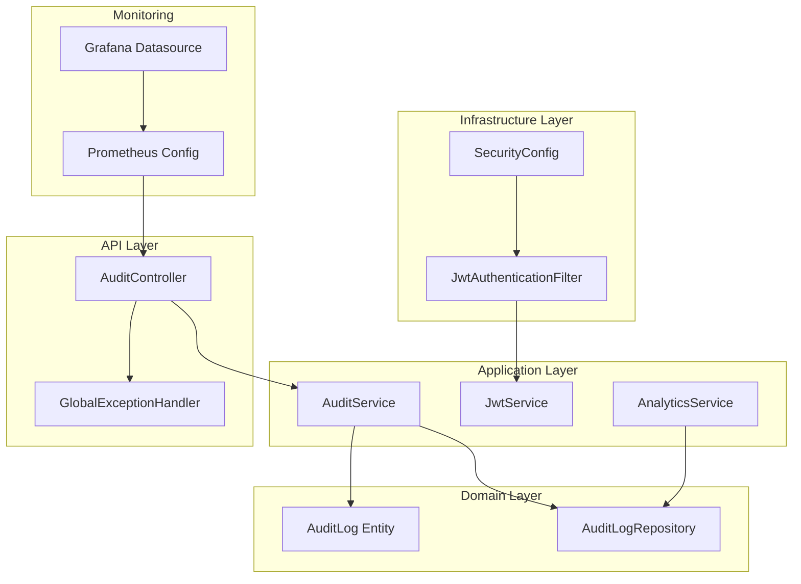
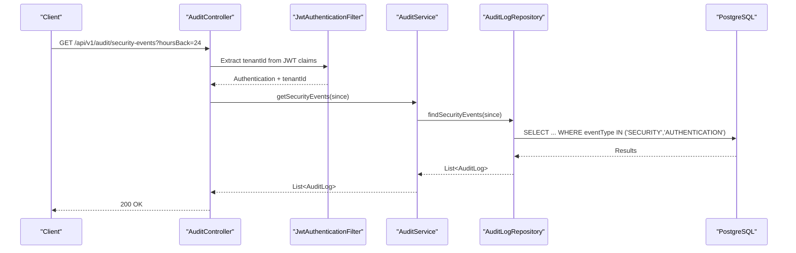
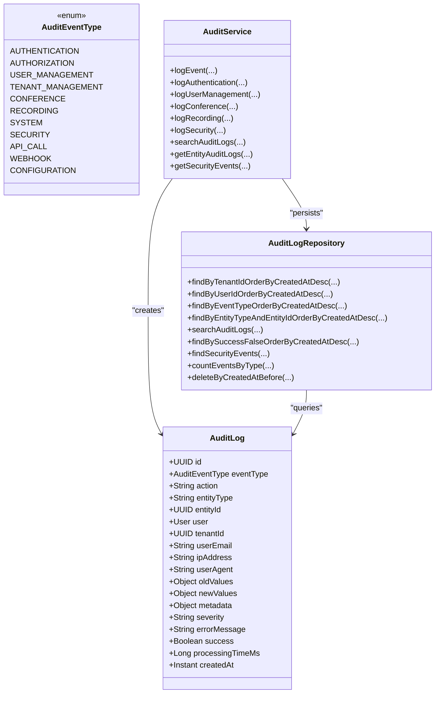
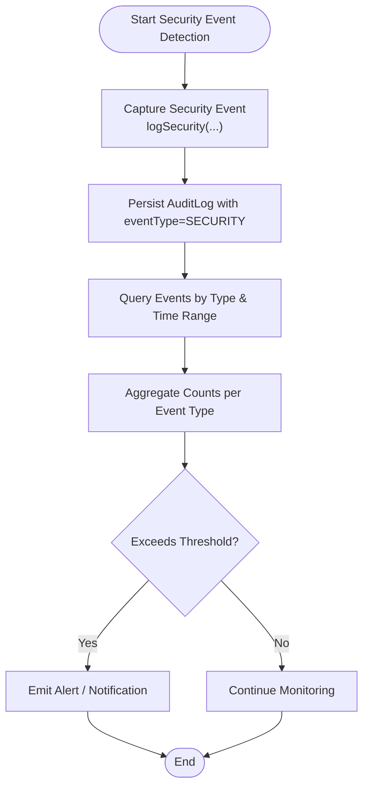
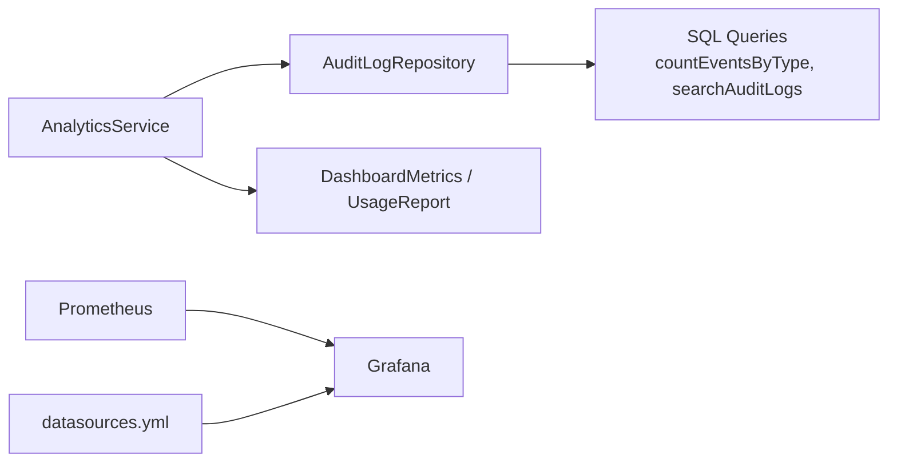
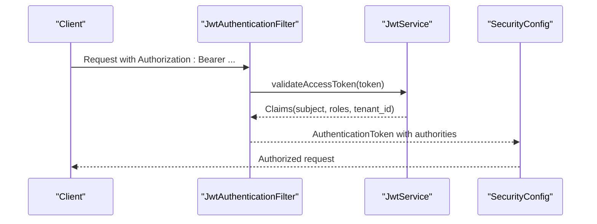
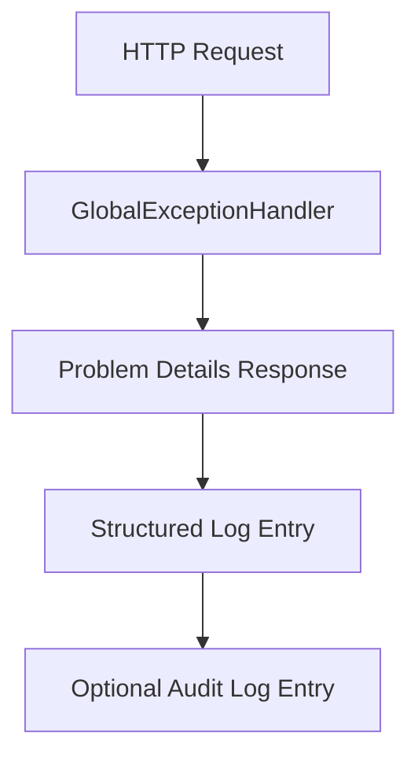
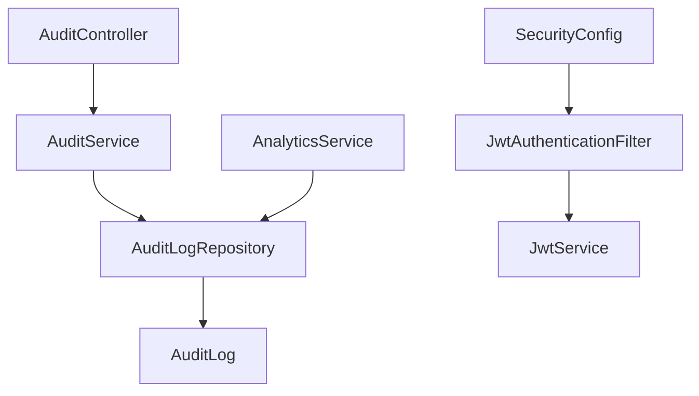

# Security Monitoring and Compliance

<cite>
**Referenced Files in This Document**
- [AuditController.java](file://jmp-api/src/main/java/com/jmp/api/controller/AuditController.java)
- [AuditService.java](file://jmp-application/src/main/java/com/jmp/application/service/AuditService.java)
- [AuditLog.java](file://jmp-domain/src/main/java/com/jmp/domain/entity/AuditLog.java)
- [AuditLogRepository.java](file://jmp-domain/src/main/java/com/jmp/domain/repository/AuditLogRepository.java)
- [SecurityConfig.java](file://jmp-infrastructure/src/main/java/com/jmp/infrastructure/security/SecurityConfig.java)
- [JwtAuthenticationFilter.java](file://jmp-infrastructure/src/main/java/com/jmp/infrastructure/security/JwtAuthenticationFilter.java)
- [JwtService.java](file://jmp-application/src/main/java/com/jmp/application/service/JwtService.java)
- [AnalyticsService.java](file://jmp-application/src/main/java/com/jmp/application/service/AnalyticsService.java)
- [GlobalExceptionHandler.java](file://jmp-api/src/main/java/com/jmp/api/advice/GlobalExceptionHandler.java)
- [application.yml](file://jmp-web/src/main/resources/application.yml)
- [prometheus.yml](file://monitoring/prometheus.yml)
- [datasources.yml](file://monitoring/grafana/datasources/datasources.yml)
- [V4__create_audit_logs_table.sql](file://jmp-web/src/main/resources/db/migration/V4__create_audit_logs_table.sql)
</cite>

## Table of Contents
1. [Introduction](#introduction)
2. [Project Structure](#project-structure)
3. [Core Components](#core-components)
4. [Architecture Overview](#architecture-overview)
5. [Detailed Component Analysis](#detailed-component-analysis)
6. [Dependency Analysis](#dependency-analysis)
7. [Performance Considerations](#performance-considerations)
8. [Troubleshooting Guide](#troubleshooting-guide)
9. [Conclusion](#conclusion)
10. [Appendices](#appendices)

## Introduction
This document provides comprehensive security monitoring and compliance guidance for the platform. It covers audit logging, security event tracking, compliance reporting, and observability. It documents how audit logs are generated, filtered, and retained; how security events are categorized and surfaced; and how compliance dashboards and analytics can be built. It also outlines alerting and anomaly detection patterns, regulatory considerations (including GDPR and SOX), and incident response and forensic analysis practices.

## Project Structure
The security and compliance capabilities span the API, application, domain, infrastructure, and monitoring layers:
- API layer exposes audit and analytics endpoints and enforces role-based access.
- Application layer encapsulates audit logging, JWT handling, and analytics/reporting.
- Domain layer defines the audit log entity and repositories for querying and retention.
- Infrastructure layer configures security filters, JWT validation, and CORS.
- Monitoring layer integrates Prometheus and Grafana for metrics and dashboards.

**Diagram sources**
- [AuditController.java:1-82](file://jmp-api/src/main/java/com/jmp/api/controller/AuditController.java#L1-L82)
- [AuditService.java:1-207](file://jmp-application/src/main/java/com/jmp/application/service/AuditService.java#L1-L207)
- [AuditLog.java:1-136](file://jmp-domain/src/main/java/com/jmp/domain/entity/AuditLog.java#L1-L136)
- [AuditLogRepository.java:1-85](file://jmp-domain/src/main/java/com/jmp/domain/repository/AuditLogRepository.java#L1-L85)
- [SecurityConfig.java:1-90](file://jmp-infrastructure/src/main/java/com/jmp/infrastructure/security/SecurityConfig.java#L1-L90)
- [JwtAuthenticationFilter.java:1-122](file://jmp-infrastructure/src/main/java/com/jmp/infrastructure/security/JwtAuthenticationFilter.java#L1-L122)
- [JwtService.java:1-236](file://jmp-application/src/main/java/com/jmp/application/service/JwtService.java#L1-L236)
- [AnalyticsService.java:1-235](file://jmp-application/src/main/java/com/jmp/application/service/AnalyticsService.java#L1-L235)
- [prometheus.yml:1-23](file://monitoring/prometheus.yml#L1-L23)
- [datasources.yml:1-11](file://monitoring/grafana/datasources/datasources.yml#L1-L11)

**Section sources**
- [AuditController.java:1-82](file://jmp-api/src/main/java/com/jmp/api/controller/AuditController.java#L1-L82)
- [AuditService.java:1-207](file://jmp-application/src/main/java/com/jmp/application/service/AuditService.java#L1-L207)
- [AuditLog.java:1-136](file://jmp-domain/src/main/java/com/jmp/domain/entity/AuditLog.java#L1-L136)
- [AuditLogRepository.java:1-85](file://jmp-domain/src/main/java/com/jmp/domain/repository/AuditLogRepository.java#L1-L85)
- [SecurityConfig.java:1-90](file://jmp-infrastructure/src/main/java/com/jmp/infrastructure/security/SecurityConfig.java#L1-L90)
- [JwtAuthenticationFilter.java:1-122](file://jmp-infrastructure/src/main/java/com/jmp/infrastructure/security/JwtAuthenticationFilter.java#L1-L122)
- [JwtService.java:1-236](file://jmp-application/src/main/java/com/jmp/application/service/JwtService.java#L1-L236)
- [AnalyticsService.java:1-235](file://jmp-application/src/main/java/com/jmp/application/service/AnalyticsService.java#L1-L235)
- [prometheus.yml:1-23](file://monitoring/prometheus.yml#L1-L23)
- [datasources.yml:1-11](file://monitoring/grafana/datasources/datasources.yml#L1-L11)

## Core Components
- Audit logging: Asynchronous, transactional audit logging with structured fields for user, tenant, IP, agent, and JSON metadata.
- Security event tracking: Dedicated security event type and endpoint for recent security events.
- Compliance reporting: Repository-level analytics and aggregation support for dashboards and reports.
- Observability: Prometheus metrics exposure and Grafana datasource configuration.
- Access control: JWT-based authentication with role-based authorization for sensitive endpoints.

Key implementation references:
- Audit log entity and event types: [AuditLog.java:122-134](file://jmp-domain/src/main/java/com/jmp/domain/entity/AuditLog.java#L122-L134)
- Audit service methods for logging and querying: [AuditService.java:29-176](file://jmp-application/src/main/java/com/jmp/application/service/AuditService.java#L29-L176)
- Audit repository queries and retention: [AuditLogRepository.java:44-83](file://jmp-domain/src/main/java/com/jmp/domain/repository/AuditLogRepository.java#L44-L83)
- Audit API endpoints: [AuditController.java:40-73](file://jmp-api/src/main/java/com/jmp/api/controller/AuditController.java#L40-L73)
- Security configuration and JWT filter: [SecurityConfig.java:42-75](file://jmp-infrastructure/src/main/java/com/jmp/infrastructure/security/SecurityConfig.java#L42-L75), [JwtAuthenticationFilter.java:39-94](file://jmp-infrastructure/src/main/java/com/jmp/infrastructure/security/JwtAuthenticationFilter.java#L39-L94)
- Metrics and monitoring: [application.yml:92-112](file://jmp-web/src/main/resources/application.yml#L92-L112), [prometheus.yml:18-22](file://monitoring/prometheus.yml#L18-L22), [datasources.yml:4-10](file://monitoring/grafana/datasources/datasources.yml#L4-L10)

**Section sources**
- [AuditLog.java:122-134](file://jmp-domain/src/main/java/com/jmp/domain/entity/AuditLog.java#L122-L134)
- [AuditService.java:29-176](file://jmp-application/src/main/java/com/jmp/application/service/AuditService.java#L29-L176)
- [AuditLogRepository.java:44-83](file://jmp-domain/src/main/java/com/jmp/domain/repository/AuditLogRepository.java#L44-L83)
- [AuditController.java:40-73](file://jmp-api/src/main/java/com/jmp/api/controller/AuditController.java#L40-L73)
- [SecurityConfig.java:42-75](file://jmp-infrastructure/src/main/java/com/jmp/infrastructure/security/SecurityConfig.java#L42-L75)
- [JwtAuthenticationFilter.java:39-94](file://jmp-infrastructure/src/main/java/com/jmp/infrastructure/security/JwtAuthenticationFilter.java#L39-L94)
- [application.yml:92-112](file://jmp-web/src/main/resources/application.yml#L92-L112)
- [prometheus.yml:18-22](file://monitoring/prometheus.yml#L18-L22)
- [datasources.yml:4-10](file://monitoring/grafana/datasources/datasources.yml#L4-L10)

## Architecture Overview
The security monitoring and compliance architecture integrates authentication, audit logging, and observability:

**Diagram sources**
- [AuditController.java:65-73](file://jmp-api/src/main/java/com/jmp/api/controller/AuditController.java#L65-L73)
- [JwtAuthenticationFilter.java:99-120](file://jmp-infrastructure/src/main/java/com/jmp/infrastructure/security/JwtAuthenticationFilter.java#L99-L120)
- [AuditService.java:200-205](file://jmp-application/src/main/java/com/jmp/application/service/AuditService.java#L200-L205)
- [AuditLogRepository.java:68-70](file://jmp-domain/src/main/java/com/jmp/domain/repository/AuditLogRepository.java#L68-L70)

**Section sources**
- [AuditController.java:65-73](file://jmp-api/src/main/java/com/jmp/api/controller/AuditController.java#L65-L73)
- [JwtAuthenticationFilter.java:99-120](file://jmp-infrastructure/src/main/java/com/jmp/infrastructure/security/JwtAuthenticationFilter.java#L99-L120)
- [AuditService.java:200-205](file://jmp-application/src/main/java/com/jmp/application/service/AuditService.java#L200-L205)
- [AuditLogRepository.java:68-70](file://jmp-domain/src/main/java/com/jmp/domain/repository/AuditLogRepository.java#L68-L70)

## Detailed Component Analysis

### Audit Logging and Retention
- Event generation: The application logs structured audit events asynchronously with transaction boundaries to ensure durability and isolation.
- Fields captured: event type, action, entity type/id, user, tenant, user email, IP address, user agent, JSON old/new values, severity, error message, success flag, and timestamps.
- Querying: Repository supports filtering by tenant, user, event type, date range, and security events. Indexes optimize common queries.
- Retention: Repository exposes deletion by creation date cutoff for lifecycle management.

**Diagram sources**
- [AuditLog.java:25-96](file://jmp-domain/src/main/java/com/jmp/domain/entity/AuditLog.java#L25-L96)
- [AuditLog.java:122-134](file://jmp-domain/src/main/java/com/jmp/domain/entity/AuditLog.java#L122-L134)
- [AuditService.java:29-176](file://jmp-application/src/main/java/com/jmp/application/service/AuditService.java#L29-L176)
- [AuditLogRepository.java:24-83](file://jmp-domain/src/main/java/com/jmp/domain/repository/AuditLogRepository.java#L24-L83)

**Section sources**
- [AuditLog.java:25-96](file://jmp-domain/src/main/java/com/jmp/domain/entity/AuditLog.java#L25-L96)
- [AuditLog.java:122-134](file://jmp-domain/src/main/java/com/jmp/domain/entity/AuditLog.java#L122-L134)
- [AuditService.java:29-176](file://jmp-application/src/main/java/com/jmp/application/service/AuditService.java#L29-L176)
- [AuditLogRepository.java:24-83](file://jmp-domain/src/main/java/com/jmp/domain/repository/AuditLogRepository.java#L24-L83)
- [V4__create_audit_logs_table.sql:4-35](file://jmp-web/src/main/resources/db/migration/V4__create_audit_logs_table.sql#L4-L35)

### Security Event Tracking and Alerting
- Categorization: Security events are logged with dedicated event type and stored alongside authentication events for correlation.
- Threshold detection: Repository supports counting events by type over a window, enabling rate-based thresholds for alerts.
- Alerting: Combine repository counts and Prometheus metrics to trigger alerts via configured alerting stack.

**Diagram sources**
- [AuditService.java:158-176](file://jmp-application/src/main/java/com/jmp/application/service/AuditService.java#L158-L176)
- [AuditLogRepository.java:75-78](file://jmp-domain/src/main/java/com/jmp/domain/repository/AuditLogRepository.java#L75-L78)

**Section sources**
- [AuditService.java:158-176](file://jmp-application/src/main/java/com/jmp/application/service/AuditService.java#L158-L176)
- [AuditLogRepository.java:75-78](file://jmp-domain/src/main/java/com/jmp/domain/repository/AuditLogRepository.java#L75-L78)

### Compliance Reporting and Dashboards
- Dashboard metrics: Analytics service aggregates usage, storage, and trends for dashboards.
- Usage reports: Service generates usage reports over date ranges.
- Event analytics: Repository supports counting events by type for trend analysis.
- Grafana integration: Prometheus datasource configured for Grafana.

**Diagram sources**
- [AnalyticsService.java:38-92](file://jmp-application/src/main/java/com/jmp/application/service/AnalyticsService.java#L38-L92)
- [AuditLogRepository.java:75-78](file://jmp-domain/src/main/java/com/jmp/domain/repository/AuditLogRepository.java#L75-L78)
- [prometheus.yml:18-22](file://monitoring/prometheus.yml#L18-L22)
- [datasources.yml:4-10](file://monitoring/grafana/datasources/datasources.yml#L4-L10)

**Section sources**
- [AnalyticsService.java:38-92](file://jmp-application/src/main/java/com/jmp/application/service/AnalyticsService.java#L38-L92)
- [AuditLogRepository.java:75-78](file://jmp-domain/src/main/java/com/jmp/domain/repository/AuditLogRepository.java#L75-L78)
- [prometheus.yml:18-22](file://monitoring/prometheus.yml#L18-L22)
- [datasources.yml:4-10](file://monitoring/grafana/datasources/datasources.yml#L4-L10)

### Access Control and Authentication
- JWT configuration: Stateless sessions, strong password encoder, and explicit CORS configuration.
- Token validation: JWT filter extracts claims and sets authentication details including tenant ID.
- Roles and permissions: Controllers enforce role-based access for audit and security endpoints.

**Diagram sources**
- [JwtAuthenticationFilter.java:39-76](file://jmp-infrastructure/src/main/java/com/jmp/infrastructure/security/JwtAuthenticationFilter.java#L39-L76)
- [JwtService.java:165-188](file://jmp-application/src/main/java/com/jmp/application/service/JwtService.java#L165-L188)
- [SecurityConfig.java:42-75](file://jmp-infrastructure/src/main/java/com/jmp/infrastructure/security/SecurityConfig.java#L42-L75)

**Section sources**
- [SecurityConfig.java:42-75](file://jmp-infrastructure/src/main/java/com/jmp/infrastructure/security/SecurityConfig.java#L42-L75)
- [JwtAuthenticationFilter.java:39-76](file://jmp-infrastructure/src/main/java/com/jmp/infrastructure/security/JwtAuthenticationFilter.java#L39-L76)
- [JwtService.java:165-188](file://jmp-application/src/main/java/com/jmp/application/service/JwtService.java#L165-L188)

### Exception Handling and Forensic Signals
- Global exception handler: Standardized Problem Details responses with error codes and timestamps for forensics.
- Audit integration: Authentication failures and access denials are logged as audit events for traceability.

**Diagram sources**
- [GlobalExceptionHandler.java:26-128](file://jmp-api/src/main/java/com/jmp/api/advice/GlobalExceptionHandler.java#L26-L128)

**Section sources**
- [GlobalExceptionHandler.java:26-128](file://jmp-api/src/main/java/com/jmp/api/advice/GlobalExceptionHandler.java#L26-L128)

## Dependency Analysis
The audit subsystem exhibits low coupling and high cohesion:
- API depends on application service for audit operations.
- Application service depends on repository and entity.
- Repository encapsulates database queries and indexes.
- Security configuration and JWT filter form the authentication backbone.

**Diagram sources**
- [AuditController.java:38-52](file://jmp-api/src/main/java/com/jmp/api/controller/AuditController.java#L38-L52)
- [AuditService.java:27-64](file://jmp-application/src/main/java/com/jmp/application/service/AuditService.java#L27-L64)
- [AuditLogRepository.java:19-24](file://jmp-domain/src/main/java/com/jmp/domain/repository/AuditLogRepository.java#L19-L24)
- [AuditLog.java:25-50](file://jmp-domain/src/main/java/com/jmp/domain/entity/AuditLog.java#L25-L50)
- [SecurityConfig.java:33-40](file://jmp-infrastructure/src/main/java/com/jmp/infrastructure/security/SecurityConfig.java#L33-L40)
- [JwtAuthenticationFilter.java:32-37](file://jmp-infrastructure/src/main/java/com/jmp/infrastructure/security/JwtAuthenticationFilter.java#L32-L37)
- [JwtService.java:29-43](file://jmp-application/src/main/java/com/jmp/application/service/JwtService.java#L29-L43)
- [AnalyticsService.java:31-33](file://jmp-application/src/main/java/com/jmp/application/service/AnalyticsService.java#L31-L33)

**Section sources**
- [AuditController.java:38-52](file://jmp-api/src/main/java/com/jmp/api/controller/AuditController.java#L38-L52)
- [AuditService.java:27-64](file://jmp-application/src/main/java/com/jmp/application/service/AuditService.java#L27-L64)
- [AuditLogRepository.java:19-24](file://jmp-domain/src/main/java/com/jmp/domain/repository/AuditLogRepository.java#L19-L24)
- [AuditLog.java:25-50](file://jmp-domain/src/main/java/com/jmp/domain/entity/AuditLog.java#L25-L50)
- [SecurityConfig.java:33-40](file://jmp-infrastructure/src/main/java/com/jmp/infrastructure/security/SecurityConfig.java#L33-L40)
- [JwtAuthenticationFilter.java:32-37](file://jmp-infrastructure/src/main/java/com/jmp/infrastructure/security/JwtAuthenticationFilter.java#L32-L37)
- [JwtService.java:29-43](file://jmp-application/src/main/java/com/jmp/application/service/JwtService.java#L29-L43)
- [AnalyticsService.java:31-33](file://jmp-application/src/main/java/com/jmp/application/service/AnalyticsService.java#L31-L33)

## Performance Considerations
- Asynchronous audit logging: Uses a dedicated executor to avoid blocking request threads.
- Transaction boundaries: REQUIRES_NEW propagation ensures audit writes occur independently of business transactions.
- Indexes: Database schema includes indexes on tenant, user, event type, entity, and created_at to optimize queries.
- Metrics scraping: Prometheus scrapes application metrics endpoint at a tight interval for real-time dashboards.

Recommendations:
- Tune executor pool size for audit logging throughput.
- Monitor slow queries on audit search endpoints and consider partitioning historical data.
- Use retention policies to cap table growth and maintain query performance.

**Section sources**
- [AuditService.java:32-34](file://jmp-application/src/main/java/com/jmp/application/service/AuditService.java#L32-L34)
- [AuditService.java:181-189](file://jmp-application/src/main/java/com/jmp/application/service/AuditService.java#L181-L189)
- [V4__create_audit_logs_table.sql:25-32](file://jmp-web/src/main/resources/db/migration/V4__create_audit_logs_table.sql#L25-L32)
- [prometheus.yml:18-22](file://monitoring/prometheus.yml#L18-L22)

## Troubleshooting Guide
Common scenarios and resolutions:
- Authentication failures: Inspect standardized Problem Details responses and corresponding audit entries for failed authentication events.
- Access denied errors: Verify JWT roles and tenant ID extraction; confirm role-based authorization on endpoints.
- Missing audit data: Confirm asynchronous logging executor is configured and repository indexes are present.
- Excessive audit volume: Implement retention policies and review filtering criteria for audit searches.

Operational checks:
- Verify Prometheus metrics endpoint is reachable and exporting data.
- Confirm Grafana datasource points to Prometheus and dashboards render data.

**Section sources**
- [GlobalExceptionHandler.java:54-80](file://jmp-api/src/main/java/com/jmp/api/advice/GlobalExceptionHandler.java#L54-L80)
- [JwtAuthenticationFilter.java:99-120](file://jmp-infrastructure/src/main/java/com/jmp/infrastructure/security/JwtAuthenticationFilter.java#L99-L120)
- [AuditLogRepository.java:24-29](file://jmp-domain/src/main/java/com/jmp/domain/repository/AuditLogRepository.java#L24-L29)
- [prometheus.yml:18-22](file://monitoring/prometheus.yml#L18-L22)
- [datasources.yml:4-10](file://monitoring/grafana/datasources/datasources.yml#L4-L10)

## Conclusion
The platform implements robust audit logging, security event tracking, and observability foundations. By leveraging structured audit logs, role-based access control, and Prometheus/Grafana dashboards, teams can build effective compliance reporting and incident response workflows. Applying retention policies and indexing strategies ensures long-term sustainability and performance.

## Appendices

### Audit Log Generation and Filtering
- Generate audit events for authentication, user management, conferences, recordings, and security incidents.
- Filter by tenant, user, event type, and date range; retrieve entity-specific audit trails.
- Retrieve recent security events for monitoring and alerting.

References:
- [AuditService.java:77-176](file://jmp-application/src/main/java/com/jmp/application/service/AuditService.java#L77-L176)
- [AuditController.java:40-73](file://jmp-api/src/main/java/com/jmp/api/controller/AuditController.java#L40-L73)
- [AuditLogRepository.java:44-70](file://jmp-domain/src/main/java/com/jmp/domain/repository/AuditLogRepository.java#L44-L70)

### Security Event Categorization and Threshold Detection
- Categorize events as SECURITY or AUTHENTICATION for focused monitoring.
- Use event type counts over time windows to detect anomalies and trigger alerts.

References:
- [AuditLog.java:122-134](file://jmp-domain/src/main/java/com/jmp/domain/entity/AuditLog.java#L122-L134)
- [AuditLogRepository.java:75-78](file://jmp-domain/src/main/java/com/jmp/domain/repository/AuditLogRepository.java#L75-L78)

### Compliance Reporting and Dashboards
- Build dashboards using Prometheus metrics and Grafana.
- Generate usage reports and aggregate analytics for compliance needs.

References:
- [AnalyticsService.java:38-92](file://jmp-application/src/main/java/com/jmp/application/service/AnalyticsService.java#L38-L92)
- [prometheus.yml:18-22](file://monitoring/prometheus.yml#L18-L22)
- [datasources.yml:4-10](file://monitoring/grafana/datasources/datasources.yml#L4-L10)

### Regulatory Considerations
- GDPR: Maintain data minimization, provide user access controls, and implement retention policies aligned with legal obligations.
- SOX: Enforce segregation of duties, maintain auditable trails, and ensure access logging and authorization controls.
- General: Apply least privilege, encrypt at rest and in transit, and establish clear audit retention and deletion policies.

[No sources needed since this section provides general guidance]

### Security Incident Response and Forensics
- Preserve evidence by retaining audit logs and structured error responses.
- Correlate authentication failures, authorization denials, and security events.
- Use dashboards to triage incidents and alerting to escalate.

References:
- [GlobalExceptionHandler.java:26-128](file://jmp-api/src/main/java/com/jmp/api/advice/GlobalExceptionHandler.java#L26-L128)
- [AuditLogRepository.java:68-70](file://jmp-domain/src/main/java/com/jmp/domain/repository/AuditLogRepository.java#L68-L70)