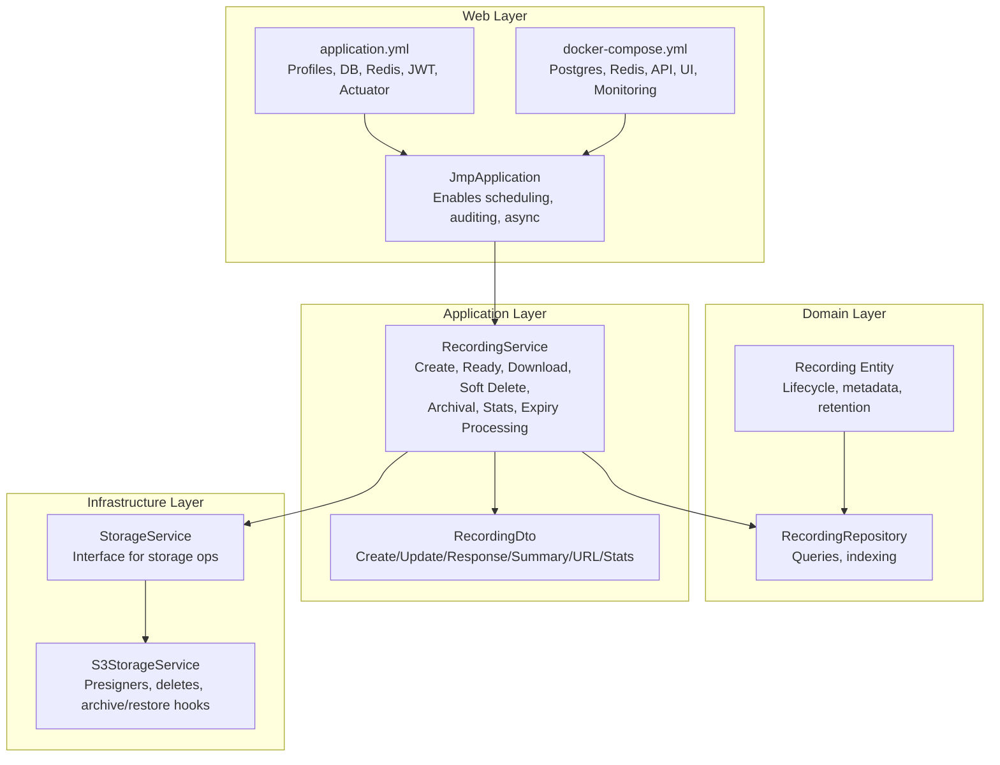
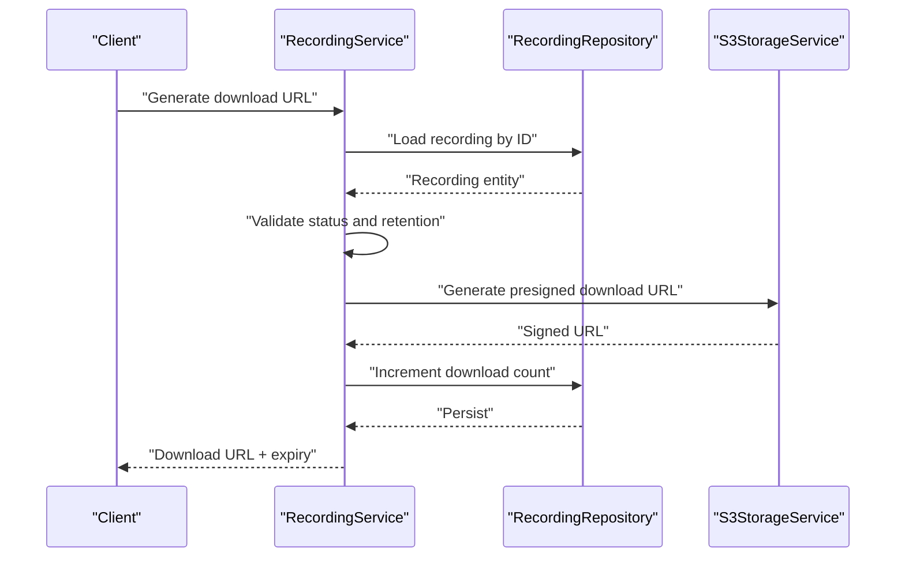
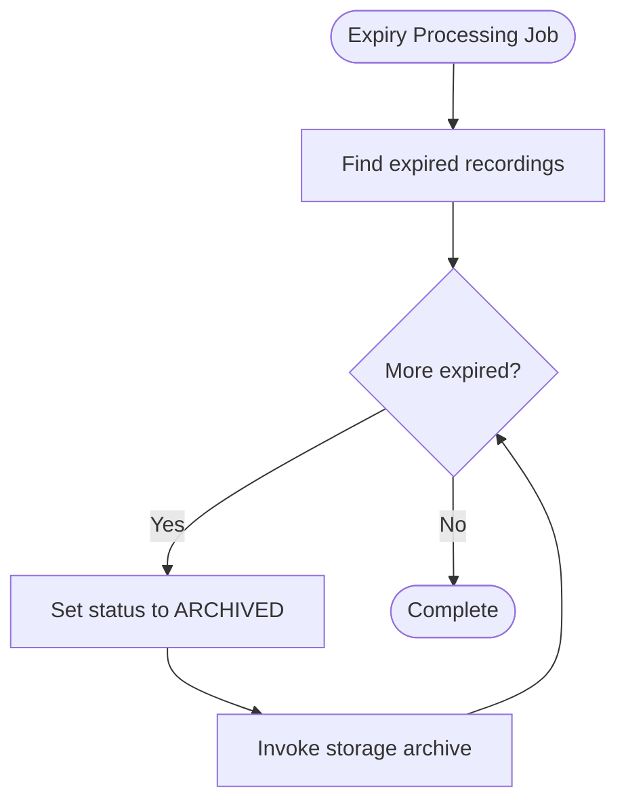
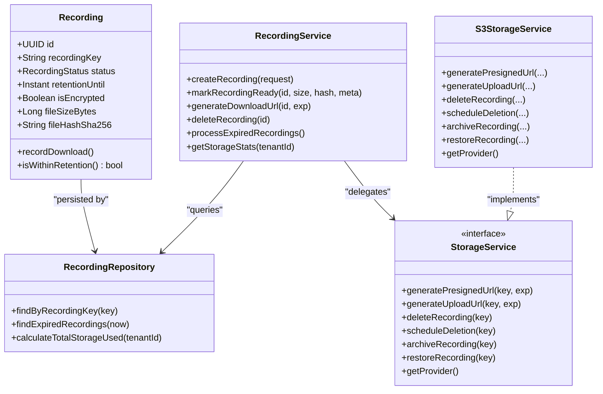
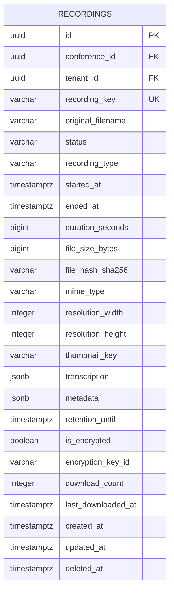

# File Management and Policies

<cite>
**Referenced Files in This Document**
- [JmpApplication.java](file://jmp-web/src/main/java/com/jmp/web/JmpApplication.java)
- [application.yml](file://jmp-web/src/main/resources/application.yml)
- [docker-compose.yml](file://docker-compose.yml)
- [Recording.java](file://jmp-domain/src/main/java/com/jmp/domain/entity/Recording.java)
- [RecordingRepository.java](file://jmp-domain/src/main/java/com/jmp/domain/repository/RecordingRepository.java)
- [RecordingService.java](file://jmp-application/src/main/java/com/jmp/application/service/RecordingService.java)
- [StorageService.java](file://jmp-application/src/main/java/com/jmp/application/service/StorageService.java)
- [S3StorageService.java](file://jmp-infrastructure/src/main/java/com/jmp/infrastructure/storage/S3StorageService.java)
- [RecordingDto.java](file://jmp-application/src/main/java/com/jmp/application/dto/RecordingDto.java)
- [V3__create_recordings_table.sql](file://jmp-web/src/main/resources/db/migration/V3__create_recordings_table.sql)
- [V4__create_audit_logs_table.sql](file://jmp-web/src/main/resources/db/migration/V4__create_audit_logs_table.sql)
</cite>

## Table of Contents
1. [Introduction](#introduction)
2. [Project Structure](#project-structure)
3. [Core Components](#core-components)
4. [Architecture Overview](#architecture-overview)
5. [Detailed Component Analysis](#detailed-component-analysis)
6. [Dependency Analysis](#dependency-analysis)
7. [Performance Considerations](#performance-considerations)
8. [Troubleshooting Guide](#troubleshooting-guide)
9. [Conclusion](#conclusion)
10. [Appendices](#appendices)

## Introduction
This document defines comprehensive file management policies and operational procedures for storing, organizing, accessing, retaining, and disposing of conference recordings. It consolidates naming conventions, directory structure patterns, retention and cleanup schedules, backup and disaster recovery strategies, access control and permissions, integrity verification, storage quotas and billing tracking, and compliance and audit trail requirements. The content is grounded in the repository’s domain model, application services, infrastructure storage implementation, and deployment configuration.

## Project Structure
The platform is a Spring Boot application with layered architecture:
- Domain: Entities and repositories define the recording lifecycle, metadata, and retention.
- Application: Services orchestrate recording creation, readiness, downloads, soft deletion, and scheduled archival.
- Infrastructure: Storage abstraction and S3 implementation manage presigned URLs, uploads, deletions, and archival hooks.
- Web: Bootstraps the application, enables scheduling, and exposes configuration via environment variables.
- Deployment: Docker Compose provisions Postgres, Redis, API, UI, Prometheus, and Grafana.

**Diagram sources**
- [JmpApplication.java:15-26](file://jmp-web/src/main/java/com/jmp/web/JmpApplication.java#L15-L26)
- [application.yml:9-128](file://jmp-web/src/main/resources/application.yml#L9-L128)
- [docker-compose.yml:4-129](file://docker-compose.yml#L4-L129)
- [Recording.java:24-124](file://jmp-domain/src/main/java/com/jmp/domain/entity/Recording.java#L24-L124)
- [RecordingRepository.java:20-99](file://jmp-domain/src/main/java/com/jmp/domain/repository/RecordingRepository.java#L20-L99)
- [RecordingService.java:31-332](file://jmp-application/src/main/java/com/jmp/application/service/RecordingService.java#L31-L332)
- [RecordingDto.java:13-170](file://jmp-application/src/main/java/com/jmp/application/dto/RecordingDto.java#L13-L170)
- [StorageService.java:9-55](file://jmp-application/src/main/java/com/jmp/application/service/StorageService.java#L9-L55)
- [S3StorageService.java:26-128](file://jmp-infrastructure/src/main/java/com/jmp/infrastructure/storage/S3StorageService.java#L26-L128)

**Section sources**
- [JmpApplication.java:15-26](file://jmp-web/src/main/java/com/jmp/web/JmpApplication.java#L15-L26)
- [application.yml:9-128](file://jmp-web/src/main/resources/application.yml#L9-L128)
- [docker-compose.yml:4-129](file://docker-compose.yml#L4-L129)

## Core Components
- Recording entity encapsulates lifecycle, metadata, retention, encryption, and usage counters.
- Recording repository provides queries for listing, searching, counting, calculating storage usage, and finding expired items.
- Recording service orchestrates creation, readiness, download URL generation, soft deletion, archival, expiry processing, and statistics.
- Storage service interface defines presigned URL generation, upload URLs, deletion, scheduling, archive/restore, and provider identification.
- S3 storage implementation integrates AWS SDK S3 client and presigner, supports MinIO-compatible endpoints, and logs operations.

**Section sources**
- [Recording.java:24-124](file://jmp-domain/src/main/java/com/jmp/domain/entity/Recording.java#L24-L124)
- [RecordingRepository.java:20-99](file://jmp-domain/src/main/java/com/jmp/domain/repository/RecordingRepository.java#L20-L99)
- [RecordingService.java:31-332](file://jmp-application/src/main/java/com/jmp/application/service/RecordingService.java#L31-L332)
- [StorageService.java:9-55](file://jmp-application/src/main/java/com/jmp/application/service/StorageService.java#L9-L55)
- [S3StorageService.java:26-128](file://jmp-infrastructure/src/main/java/com/jmp/infrastructure/storage/S3StorageService.java#L26-L128)

## Architecture Overview
The file management pipeline spans domain modeling, application orchestration, and infrastructure storage integration. Presigned URLs enable secure, time-limited access to recordings. Retention enforcement prevents access beyond policy. Scheduled jobs archive expired recordings. Soft deletion preserves auditability while freeing storage asynchronously.

**Diagram sources**
- [RecordingService.java:141-170](file://jmp-application/src/main/java/com/jmp/application/service/RecordingService.java#L141-L170)
- [RecordingRepository.java:20-25](file://jmp-domain/src/main/java/com/jmp/domain/repository/RecordingRepository.java#L20-L25)
- [S3StorageService.java:62-85](file://jmp-infrastructure/src/main/java/com/jmp/infrastructure/storage/S3StorageService.java#L62-L85)

## Detailed Component Analysis

### File Naming Conventions and Directory Structure
- Storage key: The entity field recordingKey uniquely identifies the stored object in the provider. The SQL schema enforces uniqueness and length constraints.
- Provider-specific paths: The S3 implementation uses bucket and key to address objects. MinIO-compatible endpoints are supported via configuration.
- Directory structure: The current implementation treats keys as flat S3 object keys. No hierarchical directory structure is enforced in code; practical organization can be achieved by prefixing keys with tenant/conference identifiers at ingestion time.

Operational guidance:
- Use stable, deterministic keys derived from conference and tenant identifiers to simplify discovery and automation.
- Consider hierarchical prefixes (e.g., tenant/conference/YYYY/MM/DD/) to align with provider lifecycle policies and manual inspection.

**Section sources**
- [Recording.java:46-48](file://jmp-domain/src/main/java/com/jmp/domain/entity/Recording.java#L46-L48)
- [V3__create_recordings_table.sql:8](file://jmp-web/src/main/resources/db/migration/V3__create_recordings_table.sql#L8)
- [S3StorageService.java:32-59](file://jmp-infrastructure/src/main/java/com/jmp/infrastructure/storage/S3StorageService.java#L32-L59)

### Retention Policies and Automatic Cleanup
- Default retention: On creation, the service sets a default retention period (e.g., 90 days).
- Enforcement: Before generating download URLs, the service checks that the recording is within retention.
- Expiration processing: A scheduled job finds expired recordings and archives them (status updated and storage archive hook invoked).
- Soft deletion: Deleting a recording marks it deleted and schedules asynchronous removal from storage.

**Diagram sources**
- [RecordingService.java:239-258](file://jmp-application/src/main/java/com/jmp/application/service/RecordingService.java#L239-L258)
- [RecordingRepository.java:64-69](file://jmp-domain/src/main/java/com/jmp/domain/repository/RecordingRepository.java#L64-L69)

**Section sources**
- [RecordingService.java:61-62](file://jmp-application/src/main/java/com/jmp/application/service/RecordingService.java#L61-L62)
- [RecordingService.java:150-152](file://jmp-application/src/main/java/com/jmp/application/service/RecordingService.java#L150-L152)
- [RecordingService.java:240-258](file://jmp-application/src/main/java/com/jmp/application/service/RecordingService.java#L240-L258)
- [Recording.java:155-161](file://jmp-domain/src/main/java/com/jmp/domain/entity/Recording.java#L155-L161)

### Manual Deletion Procedures
- Soft delete: The service marks the recording as deleted and persists the deletion timestamp. It then schedules asynchronous deletion in storage.
- Hard delete: The storage service provides a direct deletion method; in practice, soft deletion is recommended to preserve audit trails.

**Section sources**
- [RecordingService.java:197-212](file://jmp-application/src/main/java/com/jmp/application/service/RecordingService.java#L197-L212)
- [S3StorageService.java:88-97](file://jmp-infrastructure/src/main/java/com/jmp/infrastructure/storage/S3StorageService.java#L88-L97)

### Backup Strategies and Disaster Recovery
- Database backups: The deployment uses a persistent volume for Postgres data. Back up the volume or use logical backups (e.g., pg_dump) regularly.
- Object storage backups: For S3-compatible providers, enable versioning and cross-region replication. For on-prem setups, implement periodic sync to another bucket or snapshot the backing filesystem.
- DR testing: Periodically restore from backups to a staging environment and validate recording retrieval and playback.

[No sources needed since this section provides general guidance]

### Access Control, Permissions, and Security
- Authentication and authorization: JWT secrets are configured in application.yml; the application enables security filters and auditing.
- Presigned URLs: Generated by the storage service with configurable expiration, limiting exposure windows.
- Encryption: The entity indicates encryption is enabled by default and tracks encryption key identifiers.

**Section sources**
- [application.yml:72-79](file://jmp-web/src/main/resources/application.yml#L72-L79)
- [S3StorageService.java:62-85](file://jmp-infrastructure/src/main/java/com/jmp/infrastructure/storage/S3StorageService.java#L62-L85)
- [Recording.java:104-109](file://jmp-domain/src/main/java/com/jmp/domain/entity/Recording.java#L104-L109)

### File Integrity Verification and Corruption Detection
- Integrity tracking: The entity stores a SHA-256 hash of the file. On readiness, the service updates this field with the computed hash.
- Verification: Clients can compare downloaded hashes against the stored value to detect corruption or tampering.

**Section sources**
- [Recording.java:76-77](file://jmp-domain/src/main/java/com/jmp/domain/entity/Recording.java#L76-L77)
- [RecordingService.java:80-95](file://jmp-application/src/main/java/com/jmp/application/service/RecordingService.java#L80-L95)

### Storage Quotas, Billing Tracking, and Cost Optimization
- Quota visibility: The service computes total storage used per tenant and provides counts of ready recordings. Monthly counts are planned for future implementation.
- Billing tracking: Use provider-side metrics and tagging to allocate costs per tenant/conference. Combine with database metrics for reporting.
- Cost optimization:
  - Use lifecycle policies to transition older recordings to cheaper storage tiers.
  - Archive expired recordings to cold storage.
  - Limit presigned URL expiration to reduce concurrent access windows.
  - Monitor and prune unused thumbnails and auxiliary artifacts.

**Section sources**
- [RecordingService.java:217-234](file://jmp-application/src/main/java/com/jmp/application/service/RecordingService.java#L217-L234)
- [RecordingRepository.java:74-78](file://jmp-domain/src/main/java/com/jmp/domain/repository/RecordingRepository.java#L74-L78)

### Compliance and Audit Trail Maintenance
- Audit logging: The audit logs table captures events, actions, affected entities, user identity, IP, user agent, and outcomes. Indexes support efficient querying.
- Retention-aligned audits: Enforce retention on recordings and maintain audit records for deletion and archival actions.
- Regulatory reporting: Use audit logs to demonstrate access controls, deletions, and archival decisions.

**Section sources**
- [V4__create_audit_logs_table.sql:4-36](file://jmp-web/src/main/resources/db/migration/V4__create_audit_logs_table.sql#L4-L36)

## Dependency Analysis
The following diagram highlights key dependencies among components involved in file management.

**Diagram sources**
- [Recording.java:29-124](file://jmp-domain/src/main/java/com/jmp/domain/entity/Recording.java#L29-L124)
- [RecordingRepository.java:20-99](file://jmp-domain/src/main/java/com/jmp/domain/repository/RecordingRepository.java#L20-L99)
- [RecordingService.java:33-332](file://jmp-application/src/main/java/com/jmp/application/service/RecordingService.java#L33-L332)
- [StorageService.java:9-55](file://jmp-application/src/main/java/com/jmp/application/service/StorageService.java#L9-L55)
- [S3StorageService.java:26-128](file://jmp-infrastructure/src/main/java/com/jmp/infrastructure/storage/S3StorageService.java#L26-L128)

**Section sources**
- [RecordingRepository.java:64-69](file://jmp-domain/src/main/java/com/jmp/domain/repository/RecordingRepository.java#L64-L69)
- [RecordingService.java:239-258](file://jmp-application/src/main/java/com/jmp/application/service/RecordingService.java#L239-L258)

## Performance Considerations
- Database efficiency: Indexes on tenant, status, retention, and created_at improve listing, searching, and expiry queries.
- Batch operations: JPA batching and ordered inserts/updates reduce contention.
- Caching: Redis is provisioned for caching; consider caching frequently accessed metadata and download counts.
- Asynchronous processing: Use scheduled tasks and message queues for archival and deletion to avoid blocking requests.

**Section sources**
- [V3__create_recordings_table.sql:33-40](file://jmp-web/src/main/resources/db/migration/V3__create_recordings_table.sql#L33-L40)
- [application.yml:24-38](file://jmp-web/src/main/resources/application.yml#L24-L38)
- [docker-compose.yml:28-41](file://docker-compose.yml#L28-L41)

## Troubleshooting Guide
- Download URL errors: Verify recording status is READY and within retention; confirm presigned URL generation succeeds.
- Expiry issues: Ensure scheduled job runs and finds expired recordings; check retentionUntil values.
- Deletion anomalies: Confirm soft delete persisted and storage deletion was scheduled; inspect storage provider logs.
- Audit gaps: Validate audit logging configuration and indexes; ensure failed operations are captured.

**Section sources**
- [RecordingService.java:141-170](file://jmp-application/src/main/java/com/jmp/application/service/RecordingService.java#L141-L170)
- [RecordingService.java:239-258](file://jmp-application/src/main/java/com/jmp/application/service/RecordingService.java#L239-L258)
- [RecordingRepository.java:64-69](file://jmp-domain/src/main/java/com/jmp/domain/repository/RecordingRepository.java#L64-L69)

## Conclusion
The platform implements a robust, extensible file management framework centered on strong domain modeling, clear separation of concerns, and provider-agnostic storage abstractions. By enforcing retention, automating archival, leveraging presigned URLs, and maintaining comprehensive audit logs, it supports secure, compliant, and cost-efficient handling of conference recordings.

## Appendices

### Appendix A: Configuration Reference
- Profiles and runtime: application.yml defines active profile, DB, Redis, JWT, logging, Actuator, and Prometheus metrics.
- Environment overrides: docker-compose injects DB and JWT secrets and exposes API/UI ports.

**Section sources**
- [application.yml:9-128](file://jmp-web/src/main/resources/application.yml#L9-L128)
- [docker-compose.yml:49-56](file://docker-compose.yml#L49-L56)

### Appendix B: Data Model Snapshot

**Diagram sources**
- [V3__create_recordings_table.sql:4-31](file://jmp-web/src/main/resources/db/migration/V3__create_recordings_table.sql#L4-L31)