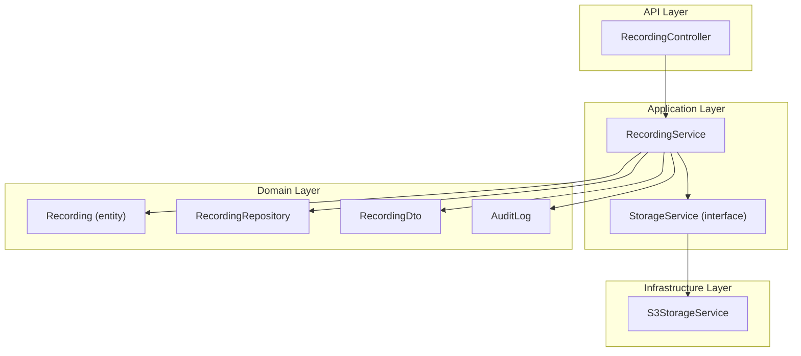
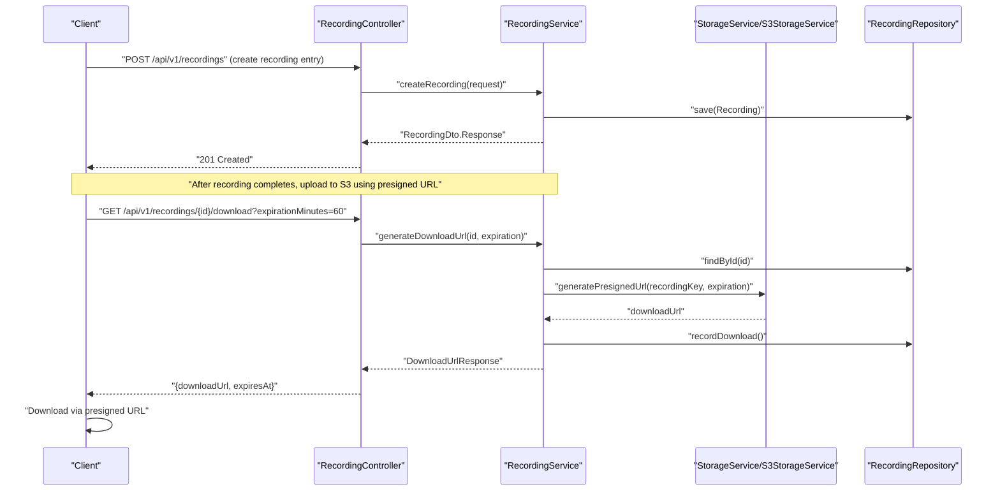
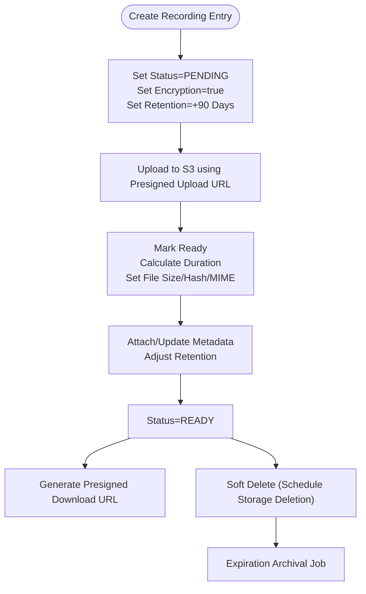
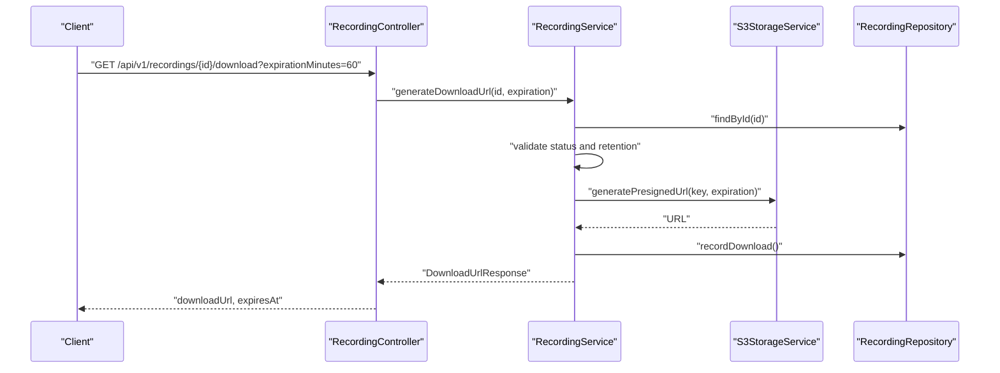
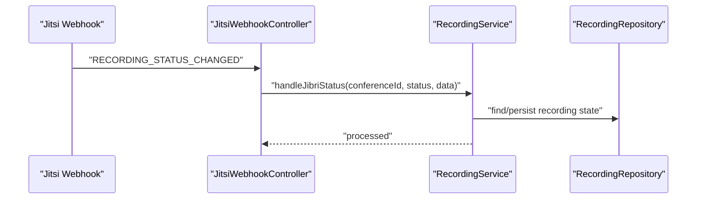
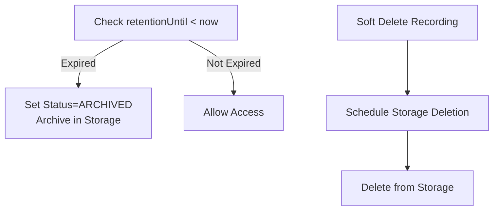
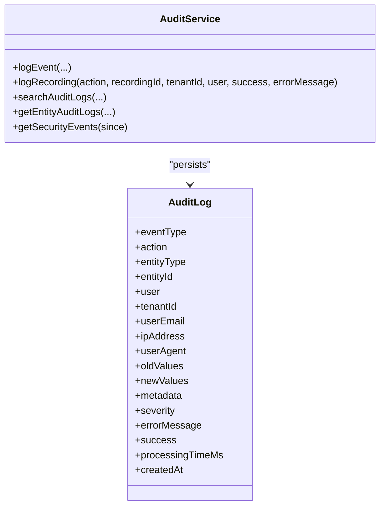
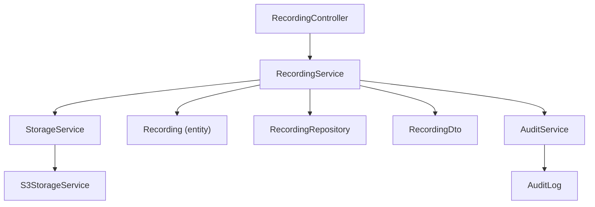

# Recording Storage Workflows

<cite>
**Referenced Files in This Document**
- [RecordingService.java](file://jmp-application/src/main/java/com/jmp/application/service/RecordingService.java)
- [StorageService.java](file://jmp-application/src/main/java/com/jmp/application/service/StorageService.java)
- [S3StorageService.java](file://jmp-infrastructure/src/main/java/com/jmp/infrastructure/storage/S3StorageService.java)
- [Recording.java](file://jmp-domain/src/main/java/com/jmp/domain/entity/Recording.java)
- [RecordingDto.java](file://jmp-application/src/main/java/com/jmp/application/dto/RecordingDto.java)
- [RecordingController.java](file://jmp-api/src/main/java/com/jmp/api/controller/RecordingController.java)
- [RecordingRepository.java](file://jmp-domain/src/main/java/com/jmp/domain/repository/RecordingRepository.java)
- [application.yml](file://jmp-web/src/main/resources/application.yml)
- [V3__create_recordings_table.sql](file://jmp-web/src/main/resources/db/migration/V3__create_recordings_table.sql)
- [AuditService.java](file://jmp-application/src/main/java/com/jmp/application/service/AuditService.java)
- [AuditLog.java](file://jmp-domain/src/main/java/com/jmp/domain/entity/AuditLog.java)
- [JitsiWebhookController.java](file://jmp-api/src/main/java/com/jmp/api/controller/JitsiWebhookController.java)
</cite>

## Table of Contents
1. [Introduction](#introduction)
2. [Project Structure](#project-structure)
3. [Core Components](#core-components)
4. [Architecture Overview](#architecture-overview)
5. [Detailed Component Analysis](#detailed-component-analysis)
6. [Dependency Analysis](#dependency-analysis)
7. [Performance Considerations](#performance-considerations)
8. [Troubleshooting Guide](#troubleshooting-guide)
9. [Conclusion](#conclusion)
10. [Appendices](#appendices)

## Introduction
This document describes the recording storage workflows and processes across the platform. It covers the complete lifecycle from conference end detection through storage upload completion, including file naming conventions, directory structure organization, metadata attachment, integration with RecordingService for triggering storage operations during conference termination, presigned URL workflows for secure file transfers, upload validation, error handling, storage quota management, file size limits, cleanup policies, monitoring approaches, failure recovery mechanisms, and audit logging for compliance.

## Project Structure
The recording storage workflow spans four layers:
- API layer: HTTP endpoints for recording management and download URL generation
- Application layer: Business logic encapsulated in RecordingService and StorageService interface
- Infrastructure layer: S3 implementation of StorageService
- Domain layer: Entities, repositories, and DTOs for recording data and audit trails

**Diagram sources**
- [RecordingController.java:1-138](file://jmp-api/src/main/java/com/jmp/api/controller/RecordingController.java#L1-138)
- [RecordingService.java:1-332](file://jmp-application/src/main/java/com/jmp/application/service/RecordingService.java#L1-332)
- [StorageService.java:1-56](file://jmp-application/src/main/java/com/jmp/application/service/StorageService.java#L1-56)
- [S3StorageService.java:1-129](file://jmp-infrastructure/src/main/java/com/jmp/infrastructure/storage/S3StorageService.java#L1-129)
- [Recording.java:1-203](file://jmp-domain/src/main/java/com/jmp/domain/entity/Recording.java#L1-203)
- [RecordingRepository.java:1-100](file://jmp-domain/src/main/java/com/jmp/domain/repository/RecordingRepository.java#L1-100)
- [RecordingDto.java:1-170](file://jmp-application/src/main/java/com/jmp/application/dto/RecordingDto.java#L1-170)
- [AuditLog.java:1-136](file://jmp-domain/src/main/java/com/jmp/domain/entity/AuditLog.java#L1-136)

**Section sources**
- [RecordingController.java:1-138](file://jmp-api/src/main/java/com/jmp/api/controller/RecordingController.java#L1-138)
- [RecordingService.java:1-332](file://jmp-application/src/main/java/com/jmp/application/service/RecordingService.java#L1-332)
- [StorageService.java:1-56](file://jmp-application/src/main/java/com/jmp/application/service/StorageService.java#L1-56)
- [S3StorageService.java:1-129](file://jmp-infrastructure/src/main/java/com/jmp/infrastructure/storage/S3StorageService.java#L1-129)
- [Recording.java:1-203](file://jmp-domain/src/main/java/com/jmp/domain/entity/Recording.java#L1-203)
- [RecordingRepository.java:1-100](file://jmp-domain/src/main/java/com/jmp/domain/repository/RecordingRepository.java#L1-100)
- [RecordingDto.java:1-170](file://jmp-application/src/main/java/com/jmp/application/dto/RecordingDto.java#L1-170)
- [AuditLog.java:1-136](file://jmp-domain/src/main/java/com/jmp/domain/entity/AuditLog.java#L1-136)

## Core Components
- RecordingService: Orchestrates recording lifecycle, presigned URL generation, download tracking, soft deletion, storage statistics, and expiration/archival handling.
- StorageService: Defines storage operations contract (presigned URLs, uploads, deletes, archival).
- S3StorageService: Implements StorageService for AWS S3-compatible storage with presigners and client.
- Recording entity and repository: Persist recording metadata, status, retention, and statistics queries.
- Recording DTOs: Define request/response shapes for recording operations.
- AuditService and AuditLog: Capture compliance-relevant events for storage operations.

**Section sources**
- [RecordingService.java:32-332](file://jmp-application/src/main/java/com/jmp/application/service/RecordingService.java#L32-332)
- [StorageService.java:9-56](file://jmp-application/src/main/java/com/jmp/application/service/StorageService.java#L9-56)
- [S3StorageService.java:26-129](file://jmp-infrastructure/src/main/java/com/jmp/infrastructure/storage/S3StorageService.java#L26-129)
- [Recording.java:24-203](file://jmp-domain/src/main/java/com/jmp/domain/entity/Recording.java#L24-203)
- [RecordingRepository.java:19-100](file://jmp-domain/src/main/java/com/jmp/domain/repository/RecordingRepository.java#L19-100)
- [RecordingDto.java:13-170](file://jmp-application/src/main/java/com/jmp/application/dto/RecordingDto.java#L13-170)
- [AuditService.java:22-207](file://jmp-application/src/main/java/com/jmp/application/service/AuditService.java#L22-207)
- [AuditLog.java:20-136](file://jmp-domain/src/main/java/com/jmp/domain/entity/AuditLog.java#L20-136)

## Architecture Overview
The recording storage workflow integrates HTTP endpoints, domain services, and infrastructure storage. The sequence below illustrates the end-to-end flow from conference end detection to storage upload completion and subsequent download via presigned URLs.

**Diagram sources**
- [RecordingController.java:45-103](file://jmp-api/src/main/java/com/jmp/api/controller/RecordingController.java#L45-103)
- [RecordingService.java:42-170](file://jmp-application/src/main/java/com/jmp/application/service/RecordingService.java#L42-170)
- [S3StorageService.java:62-85](file://jmp-infrastructure/src/main/java/com/jmp/infrastructure/storage/S3StorageService.java#L62-85)
- [RecordingRepository.java:20-100](file://jmp-domain/src/main/java/com/jmp/domain/repository/RecordingRepository.java#L20-100)

## Detailed Component Analysis

### Recording Lifecycle and Metadata Management
- Creation: Recording entries are created with status PENDING, encrypted flag set, retention period defaults, and optional metadata.
- Completion: Recording is marked READY with duration calculation, file size, hash, and MIME type.
- Metadata updates: Merge or replace metadata and adjust retention.
- Deletion: Soft delete sets status DELETED and schedules asynchronous storage deletion.
- Statistics: Aggregates total storage used and counts of READY recordings per tenant.

**Diagram sources**
- [RecordingService.java:42-258](file://jmp-application/src/main/java/com/jmp/application/service/RecordingService.java#L42-258)
- [Recording.java:131-161](file://jmp-domain/src/main/java/com/jmp/domain/entity/Recording.java#L131-161)

**Section sources**
- [RecordingService.java:42-258](file://jmp-application/src/main/java/com/jmp/application/service/RecordingService.java#L42-258)
- [Recording.java:24-203](file://jmp-domain/src/main/java/com/jmp/domain/entity/Recording.java#L24-203)

### Presigned URL Workflows
- Download URL generation validates READY status and retention, then requests a presigned URL from the storage service and records the download.
- Upload URL generation is supported by the StorageService interface and implemented by S3StorageService.

**Diagram sources**
- [RecordingController.java:91-103](file://jmp-api/src/main/java/com/jmp/api/controller/RecordingController.java#L91-103)
- [RecordingService.java:141-170](file://jmp-application/src/main/java/com/jmp/application/service/RecordingService.java#L141-170)
- [S3StorageService.java:62-85](file://jmp-infrastructure/src/main/java/com/jmp/infrastructure/storage/S3StorageService.java#L62-85)

**Section sources**
- [RecordingService.java:141-170](file://jmp-application/src/main/java/com/jmp/application/service/RecordingService.java#L141-170)
- [StorageService.java:11-20](file://jmp-application/src/main/java/com/jmp/application/service/StorageService.java#L11-20)
- [S3StorageService.java:62-85](file://jmp-infrastructure/src/main/java/com/jmp/infrastructure/storage/S3StorageService.java#L62-85)

### Conference End Detection and Storage Triggering
- Jitsi webhook events are received and processed. The recording status change handler routes to RecordingService for lifecycle transitions.
- RecordingService’s Jibri status handler processes ON, OFF, and FAILED states, enabling downstream processing upon completion.

**Diagram sources**
- [JitsiWebhookController.java:33-102](file://jmp-api/src/main/java/com/jmp/api/controller/JitsiWebhookController.java#L33-102)
- [RecordingService.java:263-284](file://jmp-application/src/main/java/com/jmp/application/service/RecordingService.java#L263-284)

**Section sources**
- [JitsiWebhookController.java:33-102](file://jmp-api/src/main/java/com/jmp/api/controller/JitsiWebhookController.java#L33-102)
- [RecordingService.java:263-284](file://jmp-application/src/main/java/com/jmp/application/service/RecordingService.java#L263-284)

### File Naming Conventions and Directory Organization
- Storage key: The recordingKey field serves as the S3 object key. It is unique and persisted in the recordings table.
- Directory structure: The implementation does not enforce a hierarchical directory layout; keys are stored as flat object keys in the configured bucket.
- Naming convention: Keys are opaque identifiers managed by the application; clients construct meaningful filenames via originalFilename when uploading.

**Section sources**
- [Recording.java:46-52](file://jmp-domain/src/main/java/com/jmp/domain/entity/Recording.java#L46-52)
- [RecordingRepository.java:24-25](file://jmp-domain/src/main/java/com/jmp/domain/repository/RecordingRepository.java#L24-25)
- [V3__create_recordings_table.sql:4-31](file://jmp-web/src/main/resources/db/migration/V3__create_recordings_table.sql#L4-31)

### Metadata Attachment and Persistence
- Recording metadata is stored as JSONB in the metadata column and supports merging updates.
- Transcripts are stored separately in the transcription JSONB column.
- Additional attributes include MIME type, resolution, thumbnail key, encryption flags, and retention timestamps.

**Section sources**
- [Recording.java:93-99](file://jmp-domain/src/main/java/com/jmp/domain/entity/Recording.java#L93-99)
- [RecordingRepository.java:74-78](file://jmp-domain/src/main/java/com/jmp/domain/repository/RecordingRepository.java#L74-78)

### Storage Quota Management and Limits
- Storage statistics: Total bytes used and count of READY recordings are computed per tenant.
- Retention enforcement: Expiration checks prevent downloads beyond retention periods.
- Cleanup policy: Soft-deleted recordings trigger scheduled storage deletion; archival moves expired recordings to cold storage.

**Diagram sources**
- [Recording.java:155-161](file://jmp-domain/src/main/java/com/jmp/domain/entity/Recording.java#L155-161)
- [RecordingService.java:239-258](file://jmp-application/src/main/java/com/jmp/application/service/RecordingService.java#L239-258)
- [S3StorageService.java:99-105](file://jmp-infrastructure/src/main/java/com/jmp/infrastructure/storage/S3StorageService.java#L99-105)

**Section sources**
- [RecordingService.java:217-258](file://jmp-application/src/main/java/com/jmp/application/service/RecordingService.java#L217-258)
- [Recording.java:101-102](file://jmp-domain/src/main/java/com/jmp/domain/entity/Recording.java#L101-102)

### Monitoring and Audit Logging
- Audit logging: Dedicated AuditService captures events such as recording operations, security events, and API calls with structured metadata.
- Compliance: AuditLog stores event type, actor, entity, IP address, user agent, success flag, and error messages.
- Metrics: Application exposes Prometheus metrics via Spring Boot Actuator for monitoring.

**Diagram sources**
- [AuditService.java:22-207](file://jmp-application/src/main/java/com/jmp/application/service/AuditService.java#L22-207)
- [AuditLog.java:20-136](file://jmp-domain/src/main/java/com/jmp/domain/entity/AuditLog.java#L20-136)

**Section sources**
- [AuditService.java:22-207](file://jmp-application/src/main/java/com/jmp/application/service/AuditService.java#L22-207)
- [AuditLog.java:20-136](file://jmp-domain/src/main/java/com/jmp/domain/entity/AuditLog.java#L20-136)
- [application.yml:93-112](file://jmp-web/src/main/resources/application.yml#L93-112)

## Dependency Analysis
The following diagram highlights key dependencies among components involved in recording storage workflows.

**Diagram sources**
- [RecordingController.java:1-138](file://jmp-api/src/main/java/com/jmp/api/controller/RecordingController.java#L1-138)
- [RecordingService.java:1-332](file://jmp-application/src/main/java/com/jmp/application/service/RecordingService.java#L1-332)
- [StorageService.java:1-56](file://jmp-application/src/main/java/com/jmp/application/service/StorageService.java#L1-56)
- [S3StorageService.java:1-129](file://jmp-infrastructure/src/main/java/com/jmp/infrastructure/storage/S3StorageService.java#L1-129)
- [Recording.java:1-203](file://jmp-domain/src/main/java/com/jmp/domain/entity/Recording.java#L1-203)
- [RecordingRepository.java:1-100](file://jmp-domain/src/main/java/com/jmp/domain/repository/RecordingRepository.java#L1-100)
- [RecordingDto.java:1-170](file://jmp-application/src/main/java/com/jmp/application/dto/RecordingDto.java#L1-170)
- [AuditService.java:1-207](file://jmp-application/src/main/java/com/jmp/application/service/AuditService.java#L1-207)
- [AuditLog.java:1-136](file://jmp-domain/src/main/java/com/jmp/domain/entity/AuditLog.java#L1-136)

**Section sources**
- [RecordingController.java:1-138](file://jmp-api/src/main/java/com/jmp/api/controller/RecordingController.java#L1-138)
- [RecordingService.java:1-332](file://jmp-application/src/main/java/com/jmp/application/service/RecordingService.java#L1-332)
- [StorageService.java:1-56](file://jmp-application/src/main/java/com/jmp/application/service/StorageService.java#L1-56)
- [S3StorageService.java:1-129](file://jmp-infrastructure/src/main/java/com/jmp/infrastructure/storage/S3StorageService.java#L1-129)
- [Recording.java:1-203](file://jmp-domain/src/main/java/com/jmp/domain/entity/Recording.java#L1-203)
- [RecordingRepository.java:1-100](file://jmp-domain/src/main/java/com/jmp/domain/repository/RecordingRepository.java#L1-100)
- [RecordingDto.java:1-170](file://jmp-application/src/main/java/com/jmp/application/dto/RecordingDto.java#L1-170)
- [AuditService.java:1-207](file://jmp-application/src/main/java/com/jmp/application/service/AuditService.java#L1-207)
- [AuditLog.java:1-136](file://jmp-domain/src/main/java/com/jmp/domain/entity/AuditLog.java#L1-136)

## Performance Considerations
- Asynchronous audit logging: AuditService writes logs asynchronously to avoid blocking primary transaction paths.
- Batched queries: Repository methods compute totals and counts efficiently using SQL aggregation.
- Presigned URL caching: Clients can reuse short-lived presigned URLs to reduce server-side overhead.
- Indexing: Database indexes on status, retention, and tenant improve query performance for stats and expiration jobs.

[No sources needed since this section provides general guidance]

## Troubleshooting Guide
- Download URL errors: Ensure the recording status is READY and within retention; otherwise, an exception is thrown.
- Storage connectivity: Verify S3 bucket configuration, region, and credentials; endpoint override supports MinIO-compatible deployments.
- Expiration handling: Confirm scheduled jobs run to archive expired recordings and enforce retention.
- Audit visibility: Use audit endpoints to investigate failures and track user actions.

**Section sources**
- [RecordingService.java:141-170](file://jmp-application/src/main/java/com/jmp/application/service/RecordingService.java#L141-170)
- [S3StorageService.java:32-59](file://jmp-infrastructure/src/main/java/com/jmp/infrastructure/storage/S3StorageService.java#L32-59)
- [AuditService.java:181-206](file://jmp-application/src/main/java/com/jmp/application/service/AuditService.java#L181-206)

## Conclusion
The recording storage workflow integrates HTTP APIs, domain services, and S3-compatible storage to provide secure, auditable, and scalable recording management. Presigned URLs enable secure transfers, while retention and archival policies ensure compliance and cost control. Audit logging and metrics support monitoring and troubleshooting.

[No sources needed since this section summarizes without analyzing specific files]

## Appendices

### Configuration References
- Storage configuration keys for S3-compatible storage are provided via application properties.
- Actuator and Prometheus metrics are enabled for operational monitoring.

**Section sources**
- [application.yml:71-112](file://jmp-web/src/main/resources/application.yml#L71-112)
- [S3StorageService.java:32-59](file://jmp-infrastructure/src/main/java/com/jmp/infrastructure/storage/S3StorageService.java#L32-59)