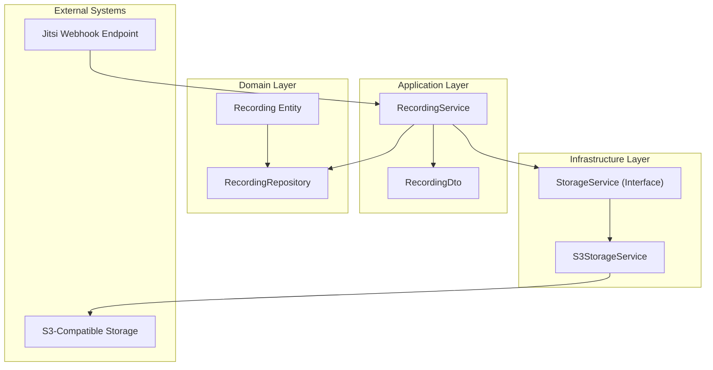
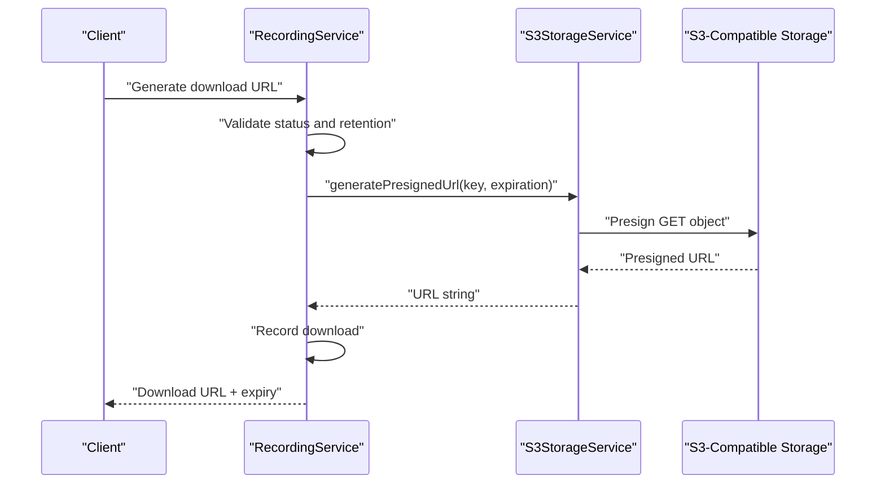
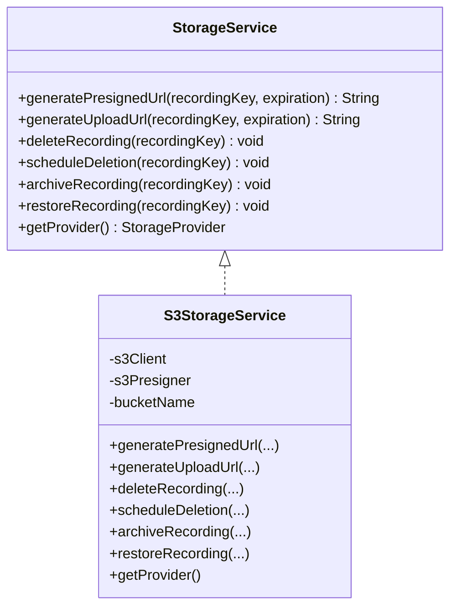
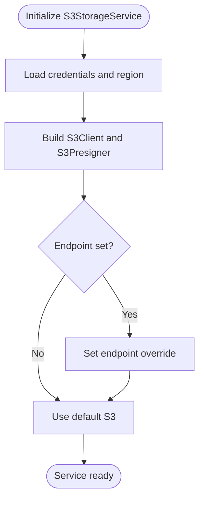
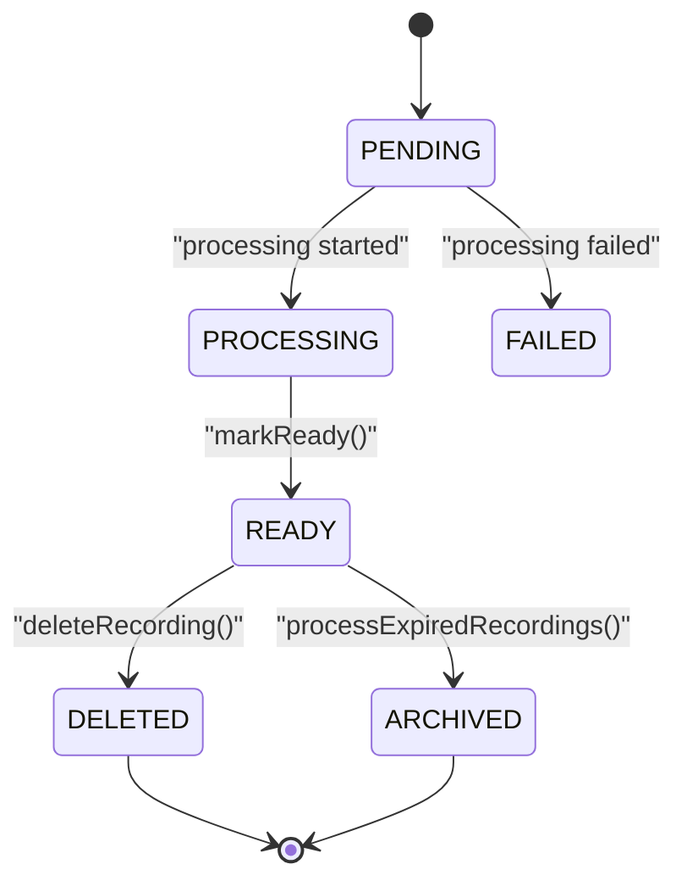
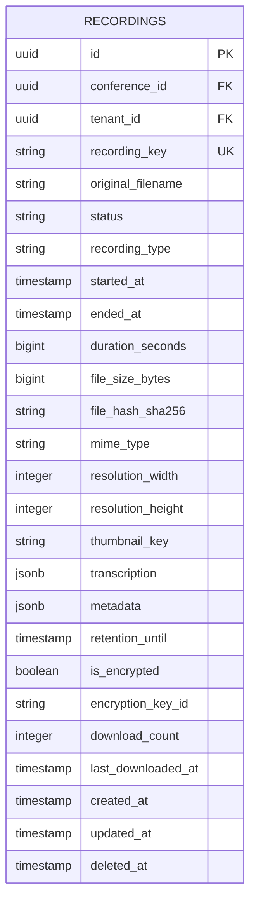
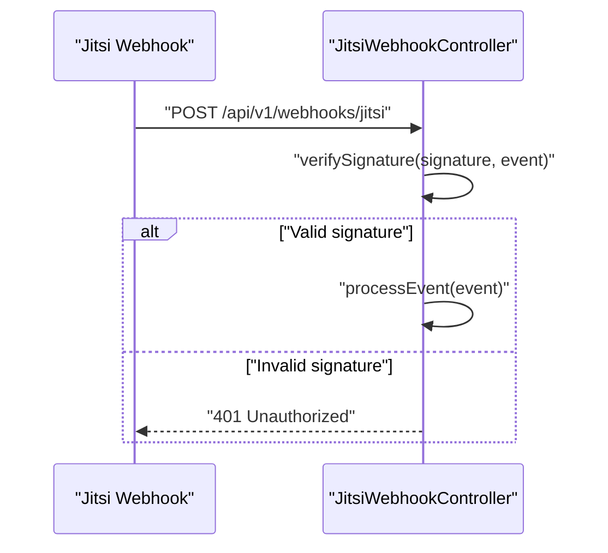
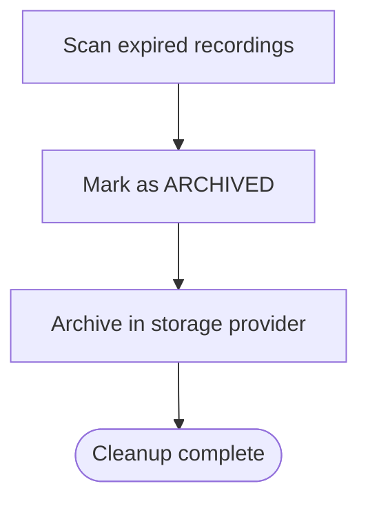
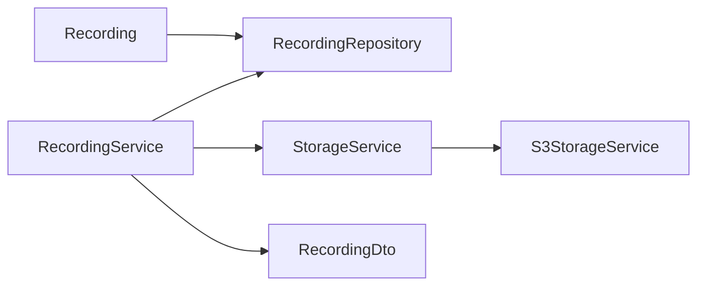

# Storage Management

<cite>
**Referenced Files in This Document**
- [S3StorageService.java](file://jmp-infrastructure/src/main/java/com/jmp/infrastructure/storage/S3StorageService.java)
- [StorageService.java](file://jmp-application/src/main/java/com/jmp/application/service/StorageService.java)
- [RecordingService.java](file://jmp-application/src/main/java/com/jmp/application/service/RecordingService.java)
- [Recording.java](file://jmp-domain/src/main/java/com/jmp/domain/entity/Recording.java)
- [RecordingRepository.java](file://jmp-domain/src/main/java/com/jmp/domain/repository/RecordingRepository.java)
- [RecordingDto.java](file://jmp-application/src/main/java/com/jmp/application/dto/RecordingDto.java)
- [JitsiWebhookController.java](file://jmp-api/src/main/java/com/jmp/api/controller/JitsiWebhookController.java)
- [application.yml](file://jmp-web/src/main/resources/application.yml)
- [docker-compose.yml](file://docker-compose.yml)
- [V3__create_recordings_table.sql](file://jmp-web/src/main/resources/db/migration/V3__create_recordings_table.sql)
- [AnalyticsService.java](file://jmp-application/src/main/java/com/jmp/application/service/AnalyticsService.java)
</cite>

## Table of Contents
1. [Introduction](#introduction)
2. [Project Structure](#project-structure)
3. [Core Components](#core-components)
4. [Architecture Overview](#architecture-overview)
5. [Detailed Component Analysis](#detailed-component-analysis)
6. [Dependency Analysis](#dependency-analysis)
7. [Performance Considerations](#performance-considerations)
8. [Troubleshooting Guide](#troubleshooting-guide)
9. [Conclusion](#conclusion)
10. [Appendices](#appendices)

## Introduction
This document describes the storage management system for the platform, focusing on AWS S3 integration, recording storage workflows, file organization, metadata management, provider pluggability, and operational practices. It explains how recordings are persisted, accessed via pre-signed URLs, cleaned up according to retention policies, and monitored for costs and usage. It also outlines security considerations, naming conventions, and integration points with conference lifecycle events.

## Project Structure
The storage management spans three layers:
- Application layer defines the storage abstraction and recording orchestration.
- Infrastructure layer implements the S3 provider using AWS SDK v2.
- Domain layer persists recording metadata and supports queries for lifecycle and analytics.

**Diagram sources**
- [RecordingService.java:31-332](file://jmp-application/src/main/java/com/jmp/application/service/RecordingService.java#L31-L332)
- [RecordingRepository.java:19-100](file://jmp-domain/src/main/java/com/jmp/domain/repository/RecordingRepository.java#L19-L100)
- [Recording.java:24-203](file://jmp-domain/src/main/java/com/jmp/domain/entity/Recording.java#L24-L203)
- [StorageService.java:9-55](file://jmp-application/src/main/java/com/jmp/application/service/StorageService.java#L9-L55)
- [S3StorageService.java:26-128](file://jmp-infrastructure/src/main/java/com/jmp/infrastructure/storage/S3StorageService.java#L26-L128)
- [JitsiWebhookController.java:24-124](file://jmp-api/src/main/java/com/jmp/api/controller/JitsiWebhookController.java#L24-L124)

**Section sources**
- [RecordingService.java:31-332](file://jmp-application/src/main/java/com/jmp/application/service/RecordingService.java#L31-L332)
- [RecordingRepository.java:19-100](file://jmp-domain/src/main/java/com/jmp/domain/repository/RecordingRepository.java#L19-L100)
- [Recording.java:24-203](file://jmp-domain/src/main/java/com/jmp/domain/entity/Recording.java#L24-L203)
- [StorageService.java:9-55](file://jmp-application/src/main/java/com/jmp/application/service/StorageService.java#L9-L55)
- [S3StorageService.java:26-128](file://jmp-infrastructure/src/main/java/com/jmp/infrastructure/storage/S3StorageService.java#L26-L128)
- [JitsiWebhookController.java:24-124](file://jmp-api/src/main/java/com/jmp/api/controller/JitsiWebhookController.java#L24-L124)

## Core Components
- StorageService interface defines provider-agnostic operations: pre-signed download and upload URL generation, deletion, scheduled deletion, archiving, restoration, and provider identification.
- S3StorageService implements the interface using AWS SDK v2 S3Client and S3Presigner, supporting MinIO and S3-compatible endpoints via endpoint override.
- RecordingService orchestrates recording lifecycle, enforces readiness and retention checks, generates pre-signed URLs, updates metadata, and coordinates storage operations.
- Recording entity stores file identifiers, metadata, encryption flags, retention timestamps, and usage counters.
- RecordingRepository provides queries for listing, searching, calculating storage usage, and finding expired recordings.
- DTOs define request/response shapes for recording operations and storage statistics.

**Section sources**
- [StorageService.java:9-55](file://jmp-application/src/main/java/com/jmp/application/service/StorageService.java#L9-L55)
- [S3StorageService.java:26-128](file://jmp-infrastructure/src/main/java/com/jmp/infrastructure/storage/S3StorageService.java#L26-L128)
- [RecordingService.java:31-332](file://jmp-application/src/main/java/com/jmp/application/service/RecordingService.java#L31-L332)
- [Recording.java:24-203](file://jmp-domain/src/main/java/com/jmp/domain/entity/Recording.java#L24-L203)
- [RecordingRepository.java:19-100](file://jmp-domain/src/main/java/com/jmp/domain/repository/RecordingRepository.java#L19-L100)
- [RecordingDto.java:13-170](file://jmp-application/src/main/java/com/jmp/application/dto/RecordingDto.java#L13-L170)

## Architecture Overview
The storage architecture separates concerns:
- Pre-signed URLs decouple file serving from the backend, reducing latency and bandwidth.
- RecordingService validates state and retention before generating URLs and records downloads.
- S3StorageService encapsulates provider-specific logic and supports MinIO compatibility.
- Scheduled operations move expired recordings to cold storage and trigger provider-side archival.

**Diagram sources**
- [RecordingService.java:141-170](file://jmp-application/src/main/java/com/jmp/application/service/RecordingService.java#L141-L170)
- [S3StorageService.java:62-85](file://jmp-infrastructure/src/main/java/com/jmp/infrastructure/storage/S3StorageService.java#L62-L85)

**Section sources**
- [RecordingService.java:141-170](file://jmp-application/src/main/java/com/jmp/application/service/RecordingService.java#L141-L170)
- [S3StorageService.java:62-85](file://jmp-infrastructure/src/main/java/com/jmp/infrastructure/storage/S3StorageService.java#L62-L85)

## Detailed Component Analysis

### Storage Abstraction and Provider Pluggability
- StorageService defines a stable contract for storage operations and enumerates supported providers, including S3, Azure Blob, GCP Storage, MinIO, and Local.
- S3StorageService implements the interface using AWS SDK v2, enabling endpoint overrides for MinIO or compatible services.

**Diagram sources**
- [StorageService.java:9-55](file://jmp-application/src/main/java/com/jmp/application/service/StorageService.java#L9-L55)
- [S3StorageService.java:26-128](file://jmp-infrastructure/src/main/java/com/jmp/infrastructure/storage/S3StorageService.java#L26-L128)

**Section sources**
- [StorageService.java:9-55](file://jmp-application/src/main/java/com/jmp/application/service/StorageService.java#L9-L55)
- [S3StorageService.java:26-128](file://jmp-infrastructure/src/main/java/com/jmp/infrastructure/storage/S3StorageService.java#L26-L128)

### AWS S3 Integration Details
- Bucket configuration is driven by application properties: bucket name, region, access key, secret key, and optional endpoint for MinIO compatibility.
- Pre-signed URLs are generated for uploads and downloads with configurable expiration durations.
- Deletion and scheduled deletion are delegated to the provider; immediate deletion is implemented, with placeholders for lifecycle-based scheduling.
- Archival and restore operations are placeholders intended for integration with S3 storage classes or Glacier-compatible systems.

**Diagram sources**
- [S3StorageService.java:32-59](file://jmp-infrastructure/src/main/java/com/jmp/infrastructure/storage/S3StorageService.java#L32-L59)

**Section sources**
- [S3StorageService.java:32-59](file://jmp-infrastructure/src/main/java/com/jmp/infrastructure/storage/S3StorageService.java#L32-L59)
- [application.yml:72-128](file://jmp-web/src/main/resources/application.yml#L72-L128)

### Recording Storage Workflows
- Creation: RecordingService creates entries with initial status PENDING, sets retention, and associates tenant/conference.
- Completion: After processing, RecordingService marks the recording READY, computes duration, and updates metadata.
- Access: Pre-signed download URLs are generated only for READY recordings within retention; download counts are recorded.
- Cleanup: Soft-deleted recordings are marked DELETED and scheduled for provider-side deletion; expired recordings are archived.

**Diagram sources**
- [Recording.java:186-193](file://jmp-domain/src/main/java/com/jmp/domain/entity/Recording.java#L186-L193)
- [RecordingService.java:77-101](file://jmp-application/src/main/java/com/jmp/application/service/RecordingService.java#L77-L101)
- [RecordingService.java:197-212](file://jmp-application/src/main/java/com/jmp/application/service/RecordingService.java#L197-L212)
- [RecordingService.java:239-258](file://jmp-application/src/main/java/com/jmp/application/service/RecordingService.java#L239-L258)

**Section sources**
- [RecordingService.java:42-101](file://jmp-application/src/main/java/com/jmp/application/service/RecordingService.java#L42-L101)
- [RecordingService.java:197-212](file://jmp-application/src/main/java/com/jmp/application/service/RecordingService.java#L197-L212)
- [RecordingService.java:239-258](file://jmp-application/src/main/java/com/jmp/application/service/RecordingService.java#L239-L258)
- [Recording.java:186-193](file://jmp-domain/src/main/java/com/jmp/domain/entity/Recording.java#L186-L193)

### File Organization and Metadata Management
- File identifier: recordingKey serves as the S3 object key or equivalent storage path.
- Metadata: Both transcription (JSONB) and general metadata (JSONB) are stored per recording.
- Encryption: Flags and key identifiers support encryption tracking.
- Retention: retentionUntil governs access windows and automated archival.
- Usage tracking: downloadCount and lastDownloadedAt maintain access metrics.

**Diagram sources**
- [V3__create_recordings_table.sql:4-43](file://jmp-web/src/main/resources/db/migration/V3__create_recordings_table.sql#L4-L43)
- [Recording.java:24-203](file://jmp-domain/src/main/java/com/jmp/domain/entity/Recording.java#L24-L203)

**Section sources**
- [Recording.java:46-116](file://jmp-domain/src/main/java/com/jmp/domain/entity/Recording.java#L46-L116)
- [RecordingRepository.java:72-78](file://jmp-domain/src/main/java/com/jmp/domain/repository/RecordingRepository.java#L72-L78)
- [V3__create_recordings_table.sql:4-43](file://jmp-web/src/main/resources/db/migration/V3__create_recordings_table.sql#L4-L43)

### Access Control and Security Considerations
- Pre-signed URLs: Access is time-bound and scoped to the recordingKey, minimizing exposure.
- Retention enforcement: Downloads are blocked outside retention windows.
- Signature verification: Webhook endpoints support signature verification for integrity and authenticity.
- Credentials: S3 credentials are injected via environment variables; endpoint override enables MinIO compatibility.

**Diagram sources**
- [JitsiWebhookController.java:33-52](file://jmp-api/src/main/java/com/jmp/api/controller/JitsiWebhookController.java#L33-L52)
- [JitsiWebhookController.java:104-109](file://jmp-api/src/main/java/com/jmp/api/controller/JitsiWebhookController.java#L104-L109)

**Section sources**
- [RecordingService.java:146-152](file://jmp-application/src/main/java/com/jmp/application/service/RecordingService.java#L146-L152)
- [JitsiWebhookController.java:33-52](file://jmp-api/src/main/java/com/jmp/api/controller/JitsiWebhookController.java#L33-L52)
- [JitsiWebhookController.java:104-109](file://jmp-api/src/main/java/com/jmp/api/controller/JitsiWebhookController.java#L104-L109)
- [S3StorageService.java:32-59](file://jmp-infrastructure/src/main/java/com/jmp/infrastructure/storage/S3StorageService.java#L32-L59)

### Backup Strategies and Automated Cleanup
- Scheduled archival: Expired recordings are moved to ARCHIVED status and provider-side archival is triggered.
- Soft deletion: Deleted recordings are marked and scheduled for provider deletion.
- Lifecycle policies: The implementation includes placeholders for lifecycle-based deletion and restore operations.

**Diagram sources**
- [RecordingService.java:239-258](file://jmp-application/src/main/java/com/jmp/application/service/RecordingService.java#L239-L258)
- [Recording.java:186-193](file://jmp-domain/src/main/java/com/jmp/domain/entity/Recording.java#L186-L193)

**Section sources**
- [RecordingService.java:239-258](file://jmp-application/src/main/java/com/jmp/application/service/RecordingService.java#L239-L258)
- [Recording.java:186-193](file://jmp-domain/src/main/java/com/jmp/domain/entity/Recording.java#L186-L193)

### Configuration Options
- S3 configuration keys:
  - jmp.storage.s3.bucket
  - jmp.storage.s3.region
  - jmp.storage.s3.access-key
  - jmp.storage.s3.secret-key
  - jmp.storage.s3.endpoint
- Spring Boot configuration includes profile activation, datasource, JPA/Hibernate settings, Redis, logging, and Actuator/Prometheus metrics.

**Section sources**
- [S3StorageService.java:32-59](file://jmp-infrastructure/src/main/java/com/jmp/infrastructure/storage/S3StorageService.java#L32-L59)
- [application.yml:72-128](file://jmp-web/src/main/resources/application.yml#L72-L128)

### Monitoring and Analytics
- Storage statistics: RecordingService exposes total storage used and counts for tenants.
- Metrics: Actuator endpoints expose Prometheus metrics; Grafana and Prometheus are provisioned via Docker Compose.

**Section sources**
- [RecordingService.java:217-234](file://jmp-application/src/main/java/com/jmp/application/service/RecordingService.java#L217-L234)
- [AnalyticsService.java:43-92](file://jmp-application/src/main/java/com/jmp/application/service/AnalyticsService.java#L43-L92)
- [docker-compose.yml:88-118](file://docker-compose.yml#L88-L118)

## Dependency Analysis
- RecordingService depends on RecordingRepository, StorageService, and DTOs.
- S3StorageService depends on AWS SDK v2 clients and the StorageService interface.
- Recording entity and repository define the persistence model and queries used by RecordingService.

**Diagram sources**
- [RecordingService.java:33-36](file://jmp-application/src/main/java/com/jmp/application/service/RecordingService.java#L33-L36)
- [RecordingRepository.java:19-100](file://jmp-domain/src/main/java/com/jmp/domain/repository/RecordingRepository.java#L19-L100)
- [Recording.java:24-203](file://jmp-domain/src/main/java/com/jmp/domain/entity/Recording.java#L24-L203)
- [StorageService.java:9-55](file://jmp-application/src/main/java/com/jmp/application/service/StorageService.java#L9-L55)
- [S3StorageService.java:26-128](file://jmp-infrastructure/src/main/java/com/jmp/infrastructure/storage/S3StorageService.java#L26-L128)

**Section sources**
- [RecordingService.java:33-36](file://jmp-application/src/main/java/com/jmp/application/service/RecordingService.java#L33-L36)
- [RecordingRepository.java:19-100](file://jmp-domain/src/main/java/com/jmp/domain/repository/RecordingRepository.java#L19-L100)
- [Recording.java:24-203](file://jmp-domain/src/main/java/com/jmp/domain/entity/Recording.java#L24-L203)
- [StorageService.java:9-55](file://jmp-application/src/main/java/com/jmp/application/service/StorageService.java#L9-L55)
- [S3StorageService.java:26-128](file://jmp-infrastructure/src/main/java/com/jmp/infrastructure/storage/S3StorageService.java#L26-L128)

## Performance Considerations
- Pre-signed URLs reduce server bandwidth and latency by delegating file delivery to S3.
- Batch operations: Use bulk queries for listing/searching and consider pagination to avoid large result sets.
- Indexing: The recordings table includes indexes on tenant, status, retention, and created time to optimize queries.
- Metrics: Enable Prometheus metrics and monitor storage usage trends to anticipate scaling needs.

[No sources needed since this section provides general guidance]

## Troubleshooting Guide
Common storage-related issues and resolutions:
- Invalid pre-signed URL or access denied:
  - Verify recordingKey correctness and READY status.
  - Confirm retention window has not expired.
  - Check S3 credentials and endpoint configuration.
- Download fails after retention:
  - Ensure retentionUntil is set appropriately; expired recordings should be archived.
- Deletion not occurring:
  - Confirm scheduled deletion is invoked after soft deletion.
  - Review provider-side lifecycle policies if implemented.
- Webhook signature verification failures:
  - Validate X-Jitsi-Signature header and signature verification logic.

**Section sources**
- [RecordingService.java:146-152](file://jmp-application/src/main/java/com/jmp/application/service/RecordingService.java#L146-L152)
- [RecordingService.java:197-212](file://jmp-application/src/main/java/com/jmp/application/service/RecordingService.java#L197-L212)
- [JitsiWebhookController.java:42-46](file://jmp-api/src/main/java/com/jmp/api/controller/JitsiWebhookController.java#L42-L46)
- [S3StorageService.java:32-59](file://jmp-infrastructure/src/main/java/com/jmp/infrastructure/storage/S3StorageService.java#L32-L59)

## Conclusion
The storage management system provides a clean separation between domain logic and provider implementation. AWS S3 integration is encapsulated behind a stable interface, enabling future provider swaps and MinIO compatibility. Recording workflows enforce state and retention controls, while pre-signed URLs improve performance and scalability. Scheduled archival and soft deletion support automated lifecycle management, and monitoring capabilities enable observability and cost insights.

[No sources needed since this section summarizes without analyzing specific files]

## Appendices

### File Naming Conventions
- recordingKey: Unique identifier used as the storage object key; recommended to encode conference and session identifiers for clarity and uniqueness.

**Section sources**
- [Recording.java:46-48](file://jmp-domain/src/main/java/com/jmp/domain/entity/Recording.java#L46-L48)

### Security Best Practices
- Use short-lived pre-signed URLs and enforce retention checks.
- Store S3 credentials securely via environment variables or secrets management.
- Prefer TLS-enabled endpoints and restrict network access to trusted subnets.
- Implement signature verification for webhook integrations.

**Section sources**
- [RecordingService.java:146-152](file://jmp-application/src/main/java/com/jmp/application/service/RecordingService.java#L146-L152)
- [JitsiWebhookController.java:42-46](file://jmp-api/src/main/java/com/jmp/api/controller/JitsiWebhookController.java#L42-L46)
- [S3StorageService.java:32-59](file://jmp-infrastructure/src/main/java/com/jmp/infrastructure/storage/S3StorageService.java#L32-L59)

### Cost Optimization Strategies
- Enable S3 lifecycle policies for transition to cheaper storage classes and eventual deletion.
- Monitor storage usage via analytics and adjust retention windows.
- Use pre-signed uploads to offload ingress traffic and leverage provider-side compression/transcoding where available.

**Section sources**
- [RecordingService.java:239-258](file://jmp-application/src/main/java/com/jmp/application/service/RecordingService.java#L239-L258)
- [AnalyticsService.java:43-92](file://jmp-application/src/main/java/com/jmp/application/service/AnalyticsService.java#L43-L92)

### Integration with Recording Management and Conference Lifecycle
- Webhook processing: JitsiWebhookController routes events; RecordingService handles recording status transitions and completion processing.
- Upload pre-signed URLs: Generated by StorageService for Jibri to upload completed recordings.

**Section sources**
- [JitsiWebhookController.java:54-97](file://jmp-api/src/main/java/com/jmp/api/controller/JitsiWebhookController.java#L54-L97)
- [RecordingService.java:263-290](file://jmp-application/src/main/java/com/jmp/application/service/RecordingService.java#L263-L290)
- [S3StorageService.java:75-85](file://jmp-infrastructure/src/main/java/com/jmp/infrastructure/storage/S3StorageService.java#L75-L85)