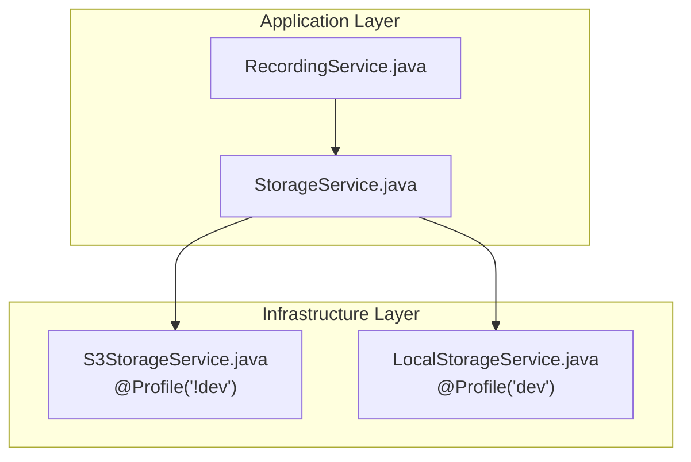
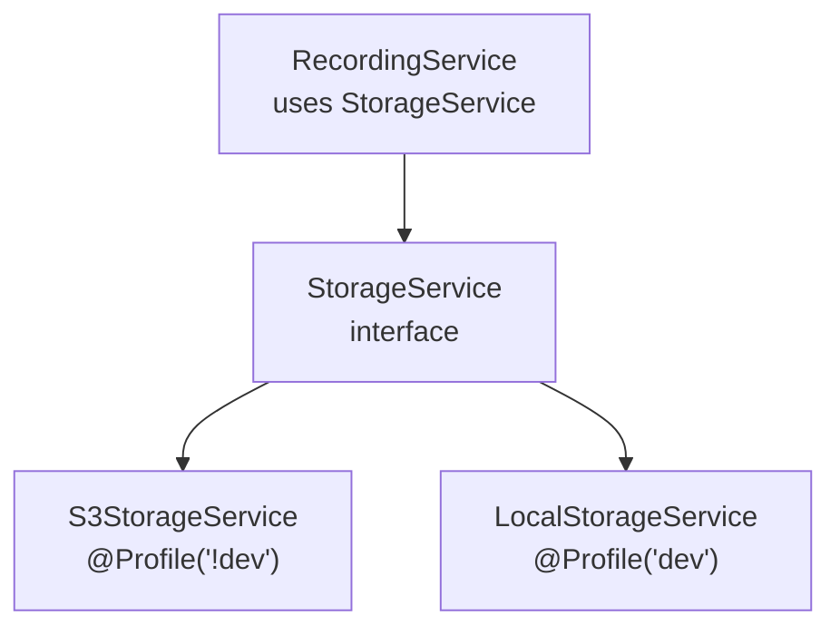
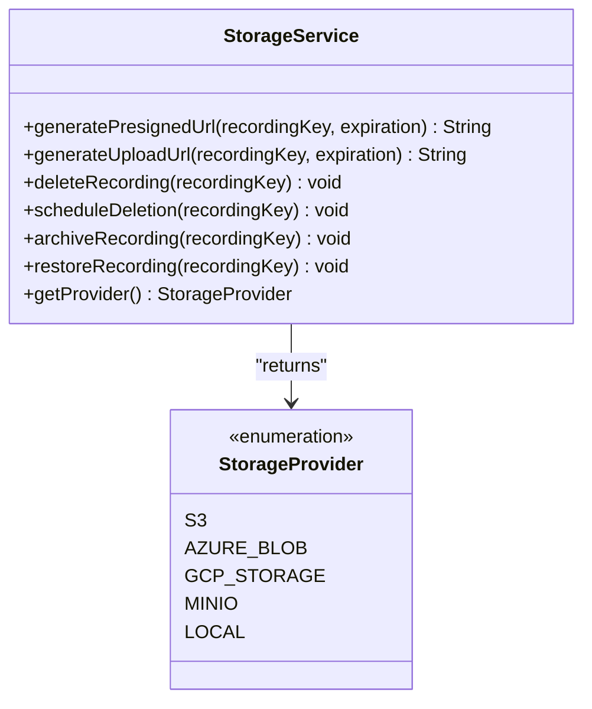
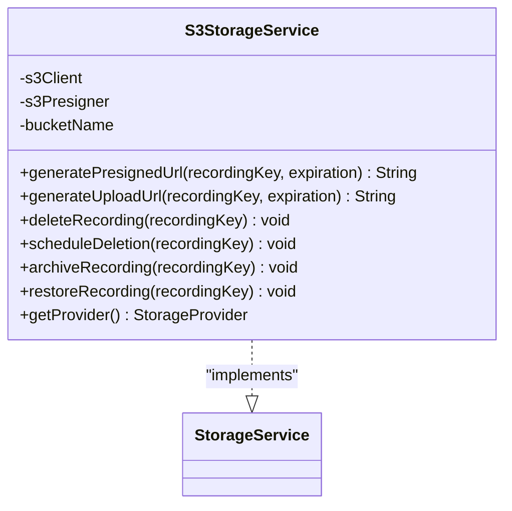
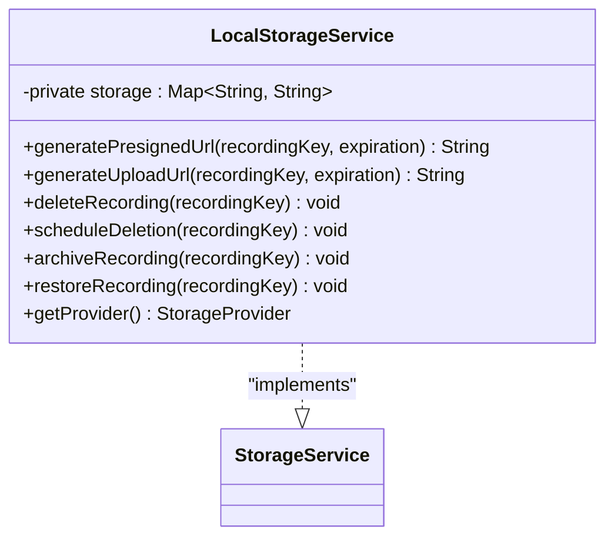
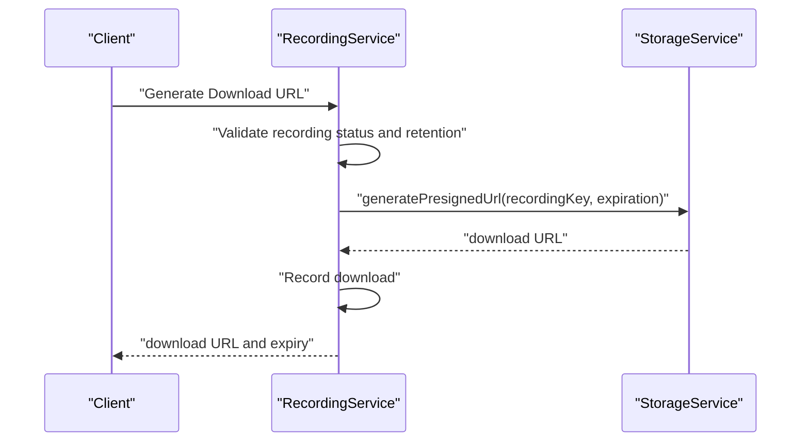
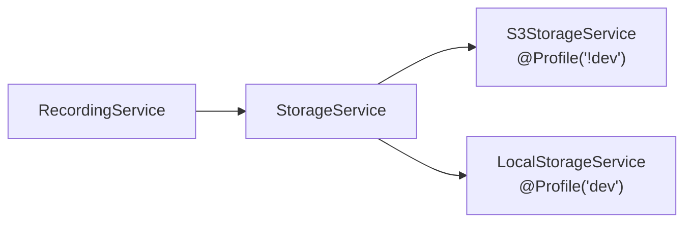
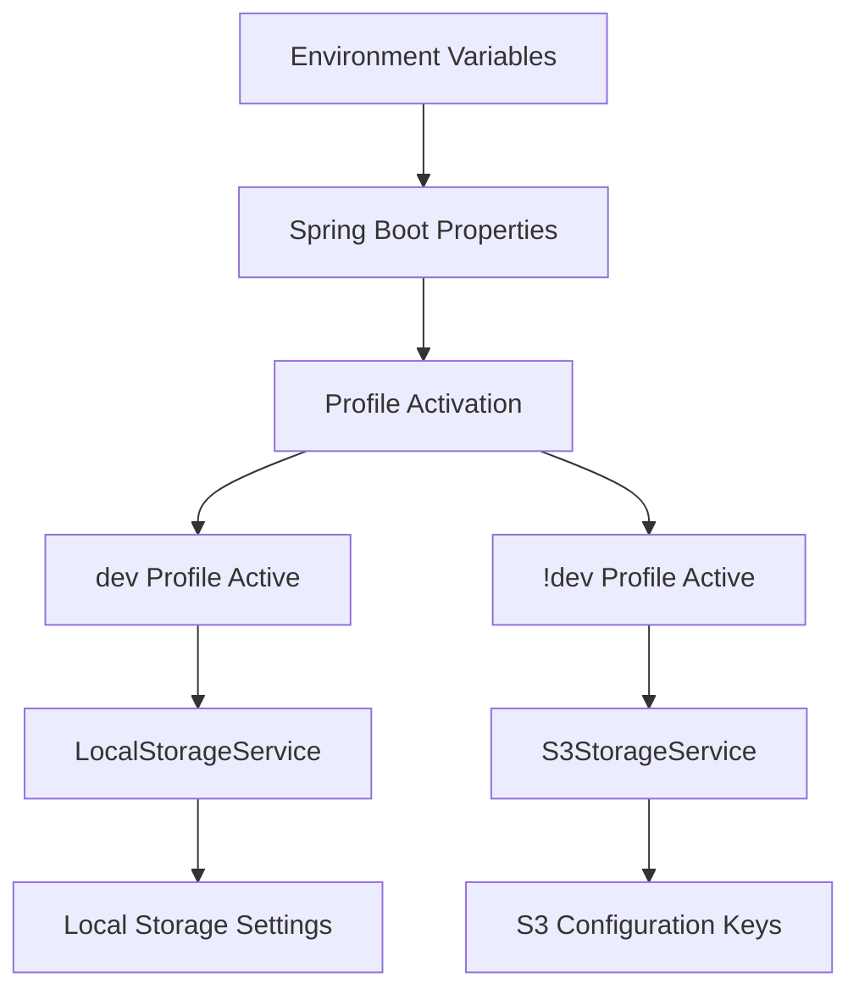

# Storage Service Abstraction

<cite>
**Referenced Files in This Document**
- [StorageService.java](file://jmp-application/src/main/java/com/jmp/application/service/StorageService.java)
- [S3StorageService.java](file://jmp-infrastructure/src/main/java/com/jmp/infrastructure/storage/S3StorageService.java)
- [LocalStorageService.java](file://jmp-infrastructure/src/main/java/com/jmp/infrastructure/storage/LocalStorageService.java)
- [RecordingService.java](file://jmp-application/src/main/java/com/jmp/application/service/RecordingService.java)
- [application.yml](file://jmp-web/src/main/resources/application.yml)
- [docker-compose.yml](file://docker-compose.yml)
</cite>

## Update Summary
**Changes Made**
- Added documentation for new LocalStorageService implementation for development environments
- Updated S3StorageService documentation to reflect Spring Profile annotations (@Profile("!dev"))
- Enhanced StorageProvider enumeration documentation to include LOCAL provider
- Updated configuration patterns to reflect profile-based storage backend selection
- Added development vs production storage backend separation guidance

## Table of Contents
1. [Introduction](#introduction)
2. [Project Structure](#project-structure)
3. [Core Components](#core-components)
4. [Architecture Overview](#architecture-overview)
5. [Detailed Component Analysis](#detailed-component-analysis)
6. [Dependency Analysis](#dependency-analysis)
7. [Performance Considerations](#performance-considerations)
8. [Configuration Patterns](#configuration-patterns)
9. [Implementing Custom Storage Providers](#implementing-custom-storage-providers)
10. [Migration Strategies](#migration-strategies)
11. [Development Environment Setup](#development-environment-setup)
12. [Production Deployment Considerations](#production-deployment-considerations)
13. [Troubleshooting Guide](#troubleshooting-guide)
14. [Conclusion](#conclusion)

## Introduction
This document explains the storage service abstraction layer and provider pluggability in the platform. It focuses on the StorageService interface design, method contracts, and implementation patterns. The system now supports multiple storage backends through Spring Profiles, with S3 as the production backend and local storage for development environments. It documents the StorageProvider enumeration, configuration patterns for switching between providers, and guidelines for integrating new storage backends while maintaining compatibility with existing recording workflows.

## Project Structure
The storage abstraction spans two modules with profile-based implementation selection:
- Application module: Defines the StorageService interface and the StorageProvider enumeration.
- Infrastructure module: Provides both S3-backed and local storage implementations with Spring Profile separation.

**Diagram sources**
- [RecordingService.java:36](file://jmp-application/src/main/java/com/jmp/application/service/RecordingService.java#L36)
- [StorageService.java:9-56](file://jmp-application/src/main/java/com/jmp/application/service/StorageService.java#L9-L56)
- [S3StorageService.java:25-28](file://jmp-infrastructure/src/main/java/com/jmp/infrastructure/storage/S3StorageService.java#L25-L28)
- [LocalStorageService.java:17-20](file://jmp-infrastructure/src/main/java/com/jmp/infrastructure/storage/LocalStorageService.java#L17-L20)

**Section sources**
- [StorageService.java:1-56](file://jmp-application/src/main/java/com/jmp/application/service/StorageService.java#L1-L56)
- [S3StorageService.java:1-131](file://jmp-infrastructure/src/main/java/com/jmp/infrastructure/storage/S3StorageService.java#L1-L131)
- [LocalStorageService.java:1-63](file://jmp-infrastructure/src/main/java/com/jmp/infrastructure/storage/LocalStorageService.java#L1-L63)
- [RecordingService.java:31-36](file://jmp-application/src/main/java/com/jmp/application/service/RecordingService.java#L31-L36)

## Core Components
- **StorageService interface**: Defines the contract for storage operations and exposes a StorageProvider enumeration with five backend types.
- **S3StorageService implementation**: Production-ready implementation using AWS SDK v2 for S3-compatible storage with Spring Profile "!dev".
- **LocalStorageService implementation**: Development-only implementation using in-memory storage with Spring Profile "dev".
- **RecordingService**: Consumes StorageService to generate presigned URLs, schedule deletions, and manage archival/restoration.

Key responsibilities:
- Presigned URL generation for downloads and uploads.
- Deletion and scheduled deletion of recordings.
- Archival and restoration operations (placeholder for cold storage).
- Provider identification via getProvider().

**Updated** Added LocalStorageService for development environments and enhanced S3StorageService with Spring Profile separation.

**Section sources**
- [StorageService.java:9-56](file://jmp-application/src/main/java/com/jmp/application/service/StorageService.java#L9-L56)
- [S3StorageService.java:25-131](file://jmp-infrastructure/src/main/java/com/jmp/infrastructure/storage/S3StorageService.java#L25-L131)
- [LocalStorageService.java:17-63](file://jmp-infrastructure/src/main/java/com/jmp/infrastructure/storage/LocalStorageService.java#L17-L63)
- [RecordingService.java:142-170](file://jmp-application/src/main/java/com/jmp/application/service/RecordingService.java#L142-L170)

## Architecture Overview
The application layer depends on the StorageService interface, enabling runtime substitution of storage implementations based on Spring Profiles. The infrastructure layer provides both S3 and local implementations, with automatic selection based on the active profile.

**Diagram sources**
- [RecordingService.java:36](file://jmp-application/src/main/java/com/jmp/application/service/RecordingService.java#L36)
- [StorageService.java:9-56](file://jmp-application/src/main/java/com/jmp/application/service/StorageService.java#L9-L56)
- [S3StorageService.java:25-28](file://jmp-infrastructure/src/main/java/com/jmp/infrastructure/storage/S3StorageService.java#L25-L28)
- [LocalStorageService.java:17-20](file://jmp-infrastructure/src/main/java/com/jmp/infrastructure/storage/LocalStorageService.java#L17-L20)

## Detailed Component Analysis

### StorageService Interface
The interface defines the following method contracts:
- generatePresignedUrl(recordingKey, expiration): Returns a pre-signed URL for downloads.
- generateUploadUrl(recordingKey, expiration): Returns a pre-signed URL for uploads.
- deleteRecording(recordingKey): Immediately deletes a recording.
- scheduleDeletion(recordingKey): Schedules deletion (placeholder indicates immediate deletion in current implementation).
- archiveRecording(recordingKey): Archives a recording to cold storage (placeholder).
- restoreRecording(recordingKey): Restores a recording from archive (placeholder).
- getProvider(): Returns the provider type (S3, AZURE_BLOB, GCP_STORAGE, MINIO, LOCAL).

Provider enumeration supports multiple backends, enabling future extension to Azure Blob, Google Cloud Storage, MinIO, and local storage.

**Diagram sources**
- [StorageService.java:9-56](file://jmp-application/src/main/java/com/jmp/application/service/StorageService.java#L9-L56)

**Section sources**
- [StorageService.java:9-56](file://jmp-application/src/main/java/com/jmp/application/service/StorageService.java#L9-L56)

### S3StorageService Implementation
The S3 implementation serves as the production backend:
- Accepts configuration via Spring @Value bindings for bucket, region, credentials, and optional endpoint override for MinIO or S3-compatible services.
- Built with Spring Profile "!dev" to exclude it from development environments.
- Uses AWS SDK v2 for S3Client and S3Presigner construction.
- Generates pre-signed URLs for downloads and uploads.
- Performs immediate deletion and logs placeholders for scheduled deletion, archival, and restoration.

**Updated** Enhanced with @Profile("!dev") annotation for production-only deployment.

**Diagram sources**
- [S3StorageService.java:25-131](file://jmp-infrastructure/src/main/java/com/jmp/infrastructure/storage/S3StorageService.java#L25-L131)
- [StorageService.java:9-56](file://jmp-application/src/main/java/com/jmp/application/service/StorageService.java#L9-L56)

**Section sources**
- [S3StorageService.java:34-61](file://jmp-infrastructure/src/main/java/com/jmp/infrastructure/storage/S3StorageService.java#L34-L61)
- [S3StorageService.java:63-87](file://jmp-infrastructure/src/main/java/com/jmp/infrastructure/storage/S3StorageService.java#L63-L87)
- [S3StorageService.java:89-107](file://jmp-infrastructure/src/main/java/com/jmp/infrastructure/storage/S3StorageService.java#L89-L107)
- [S3StorageService.java:109-129](file://jmp-infrastructure/src/main/java/com/jmp/infrastructure/storage/S3StorageService.java#L109-L129)

### LocalStorageService Implementation
The local implementation serves development environments:
- Uses Spring Profile "dev" to activate only in development mode.
- Implements in-memory storage using HashMap for demonstration purposes.
- Generates temporary URLs with random tokens for development workflows.
- Performs immediate deletion and logging for scheduled deletion operations.
- Provides basic archival and restoration operations as placeholders.

**New** Added comprehensive local storage implementation for development environments.

**Diagram sources**
- [LocalStorageService.java:17-63](file://jmp-infrastructure/src/main/java/com/jmp/infrastructure/storage/LocalStorageService.java#L17-L63)
- [StorageService.java:9-56](file://jmp-application/src/main/java/com/jmp/application/service/StorageService.java#L9-L56)

**Section sources**
- [LocalStorageService.java:20-63](file://jmp-infrastructure/src/main/java/com/jmp/infrastructure/storage/LocalStorageService.java#L20-L63)

### RecordingService Integration
RecordingService consumes StorageService for:
- Generating download URLs after a recording reaches READY status and is within retention.
- Scheduling asynchronous deletion upon soft-deleting a recording.
- Archiving expired recordings and delegating cold storage operations to the storage provider.

**Diagram sources**
- [RecordingService.java:142-170](file://jmp-application/src/main/java/com/jmp/application/service/RecordingService.java#L142-L170)
- [StorageService.java:15](file://jmp-application/src/main/java/com/jmp/application/service/StorageService.java#L15)

**Section sources**
- [RecordingService.java:142-170](file://jmp-application/src/main/java/com/jmp/application/service/RecordingService.java#L142-L170)
- [RecordingService.java:198-212](file://jmp-application/src/main/java/com/jmp/application/service/RecordingService.java#L198-L212)
- [RecordingService.java:240-258](file://jmp-application/src/main/java/com/jmp/application/service/RecordingService.java#L240-L258)

### Algorithm Flow: Generate Download URL

**Diagram sources**
- [RecordingService.java:142-170](file://jmp-application/src/main/java/com/jmp/application/service/RecordingService.java#L142-L170)

## Dependency Analysis
- RecordingService depends on StorageService (inversion of control).
- Both S3StorageService and LocalStorageService implement StorageService.
- S3 implementation uses AWS SDK v2 and Spring @Value for configuration.
- Local implementation uses Spring @Profile("dev") for development-only activation.

**Updated** Enhanced dependency analysis to reflect Spring Profile-based implementation selection.

**Diagram sources**
- [RecordingService.java:36](file://jmp-application/src/main/java/com/jmp/application/service/RecordingService.java#L36)
- [StorageService.java:9-56](file://jmp-application/src/main/java/com/jmp/application/service/StorageService.java#L9-L56)
- [S3StorageService.java:25-28](file://jmp-infrastructure/src/main/java/com/jmp/infrastructure/storage/S3StorageService.java#L25-L28)
- [LocalStorageService.java:17-20](file://jmp-infrastructure/src/main/java/com/jmp/infrastructure/storage/LocalStorageService.java#L17-L20)

**Section sources**
- [RecordingService.java:36](file://jmp-application/src/main/java/com/jmp/application/service/RecordingService.java#L36)
- [S3StorageService.java:25-28](file://jmp-infrastructure/src/main/java/com/jmp/infrastructure/storage/S3StorageService.java#L25-L28)
- [LocalStorageService.java:17-20](file://jmp-infrastructure/src/main/java/com/jmp/infrastructure/storage/LocalStorageService.java#L17-L20)

## Performance Considerations
- Pre-signed URLs eliminate server bandwidth for large file transfers and reduce latency for clients.
- Immediate deletion and placeholder implementations for archival/restore indicate room for optimization via lifecycle policies, queues, and tiered storage.
- Endpoint override enables MinIO compatibility, allowing self-hosted deployments with reduced latency and cost compared to managed cloud storage in some scenarios.
- Local storage implementation provides fast development iteration without network overhead.

**Updated** Added performance considerations for local storage development environment.

## Configuration Patterns
Current configuration keys (Spring @Value):
- **S3 Configuration**:
  - jmp.storage.s3.bucket
  - jmp.storage.s3.region (default: us-east-1)
  - jmp.storage.s3.access-key
  - jmp.storage.s3.secret-key
  - jmp.storage.s3.endpoint (optional; enables MinIO or S3-compatible services)

- **Profile Configuration**:
  - SPRING_PROFILES_ACTIVE: Controls which storage implementation is activated
  - Default profile: dev (development)
  - Production profile: !dev (excludes dev profile)

Environment-specific settings:
- Profile activation via SPRING_PROFILES_ACTIVE.
- Database and Redis connectivity via environment variables.
- Container orchestration via docker-compose with profile set to docker,dev for development.

**Updated** Enhanced configuration patterns to reflect Spring Profile-based storage backend selection.

**Diagram sources**
- [S3StorageService.java:34-61](file://jmp-infrastructure/src/main/java/com/jmp/infrastructure/storage/S3StorageService.java#L34-L61)
- [LocalStorageService.java:17-20](file://jmp-infrastructure/src/main/java/com/jmp/infrastructure/storage/LocalStorageService.java#L17-L20)
- [application.yml:9-10](file://jmp-web/src/main/resources/application.yml#L9-L10)
- [docker-compose.yml:50](file://docker-compose.yml#L50)

**Section sources**
- [S3StorageService.java:34-61](file://jmp-infrastructure/src/main/java/com/jmp/infrastructure/storage/S3StorageService.java#L34-L61)
- [LocalStorageService.java:17-20](file://jmp-infrastructure/src/main/java/com/jmp/infrastructure/storage/LocalStorageService.java#L17-L20)
- [application.yml:9-10](file://jmp-web/src/main/resources/application.yml#L9-L10)
- [docker-compose.yml:50](file://docker-compose.yml#L50)

## Implementing Custom Storage Providers
Guidelines to add a new provider (e.g., Azure Blob, Google Cloud Storage, MinIO):
- Implement StorageService in the infrastructure module.
- Define provider in StorageProvider enumeration.
- Honor method contracts:
  - generatePresignedUrl and generateUploadUrl must return valid pre-signed URLs.
  - deleteRecording must remove the object.
  - scheduleDeletion should delegate to provider-native scheduling mechanisms.
  - archiveRecording and restoreRecording should integrate with provider's cold storage capabilities.
- Use Spring @Value or configuration classes to externalize provider-specific settings.
- Ensure getProvider returns the appropriate StorageProvider value.
- Apply appropriate Spring Profile annotations (@Profile("dev") or @Profile("!dev")) to control environment-specific activation.

**Updated** Added guidelines for Spring Profile-based implementation selection.

Compatibility with existing workflows:
- RecordingService relies on StorageService methods; new implementations must preserve semantics and error conditions.
- Pre-signed URL generation remains consistent across providers, simplifying client-side integration.
- Profile annotations ensure proper environment-specific behavior without code changes.

## Migration Strategies
- **Gradual rollout**: Introduce a new provider implementation alongside existing implementations without changing RecordingService.
- **Feature flagging**: Gate migration behind a configuration toggle to route specific tenants or conferences to the new provider.
- **Data locality**: Prefer migrating near the source of the workload (e.g., same region) to minimize transfer costs and latency.
- **Cost modeling**: Compare per-request costs, storage tiers, and transfer fees across providers.
- **Validation**: Verify pre-signed URL behavior, deletion, archival, and restoration across providers before full migration.
- **Profile-based migration**: Use Spring Profiles to gradually shift from development to production storage backends.

**Updated** Added profile-based migration strategy guidance.

## Development Environment Setup
The system provides separate storage backends for development and production:

### Development Environment (Profile: dev)
- LocalStorageService automatically activates with @Profile("dev")
- In-memory storage eliminates external dependencies
- Fast development iteration without network overhead
- Simplified debugging and testing workflows
- No external S3 configuration required

### Production Environment (Profile: !dev)
- S3StorageService automatically activates with @Profile("!dev")
- AWS SDK v2 integration for S3-compatible storage
- Supports MinIO and other S3-compatible services
- Production-grade reliability and scalability
- Requires proper S3 configuration and credentials

**New** Comprehensive development environment setup documentation.

**Section sources**
- [LocalStorageService.java:17-20](file://jmp-infrastructure/src/main/java/com/jmp/infrastructure/storage/LocalStorageService.java#L17-L20)
- [S3StorageService.java:25-28](file://jmp-infrastructure/src/main/java/com/jmp/infrastructure/storage/S3StorageService.java#L25-L28)
- [docker-compose.yml:50](file://docker-compose.yml#L50)

## Production Deployment Considerations
Production deployments should use S3StorageService with the following considerations:

### S3 Configuration Requirements
- Proper AWS credentials and permissions
- Bucket creation and lifecycle policies
- Regional compliance and data residency requirements
- Network security and encryption settings

### Performance Optimization
- Pre-signed URL caching for frequently accessed recordings
- Connection pooling and retry strategies
- Monitoring and alerting for storage operations
- Cost optimization through lifecycle policies

### Security Considerations
- IAM role-based access control
- VPC endpoints for internal traffic
- Encryption at rest and in transit
- Audit logging for all storage operations

**Updated** Enhanced production deployment considerations.

## Troubleshooting Guide
Common issues and resolutions:
- **Invalid credentials or missing endpoint**: Ensure access-key, secret-key, and optional endpoint are correctly set for S3-compatible services.
- **Region mismatch**: Confirm region aligns with bucket location to avoid signature errors.
- **Expirations handling**: Validate that expiration durations are reasonable and aligned with client expectations.
- **Scheduled deletion not deferred**: Current implementation performs immediate deletion; adjust to use provider-native delayed operations for production.
- **Profile activation issues**: Verify SPRING_PROFILES_ACTIVE environment variable contains correct profile names.
- **Development vs production confusion**: Check that dev profile is active for development and !dev for production environments.
- **Local storage limitations**: Remember LocalStorageService is for development only and loses data on application restart.

**Updated** Added troubleshooting guidance for profile-related issues and local storage limitations.

**Section sources**
- [S3StorageService.java:34-61](file://jmp-infrastructure/src/main/java/com/jmp/infrastructure/storage/S3StorageService.java#L34-L61)
- [S3StorageService.java:101-107](file://jmp-infrastructure/src/main/java/com/jmp/infrastructure/storage/S3StorageService.java#L101-L107)
- [LocalStorageService.java:17-20](file://jmp-infrastructure/src/main/java/com/jmp/infrastructure/storage/LocalStorageService.java#L17-L20)

## Conclusion
The storage abstraction cleanly separates domain logic from infrastructure concerns with enhanced Spring Profile-based implementation selection. The StorageService interface and StorageProvider enumeration enable pluggable backends, while S3StorageService and LocalStorageService demonstrate robust implementations with pre-signed URL generation and environment-appropriate behavior. The @Profile annotations ensure proper separation between development and production storage backends, with LocalStorageService providing fast development iteration and S3StorageService offering production-grade reliability. By following the implementation guidelines and leveraging environment-specific configuration, teams can integrate additional providers and migrate between backends with minimal disruption to recording workflows.