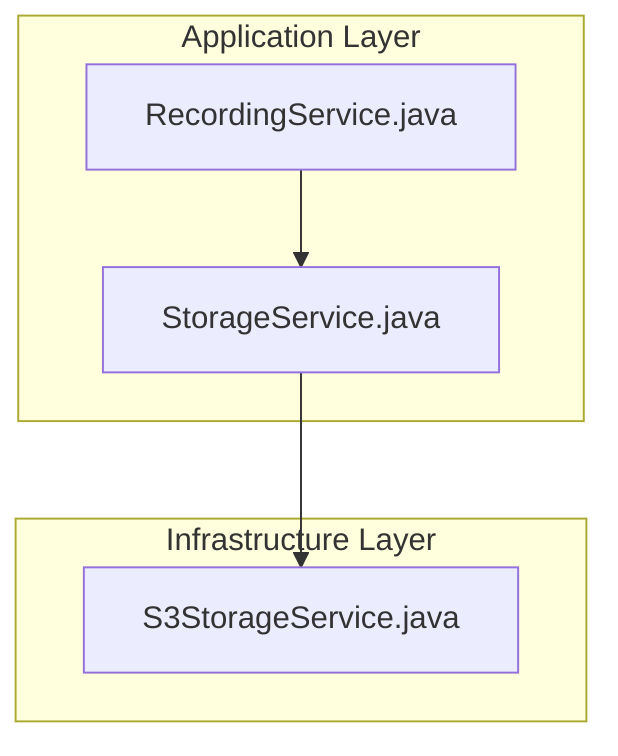
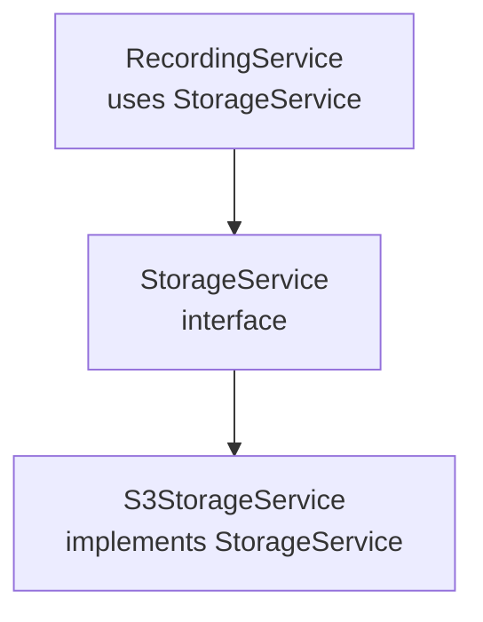
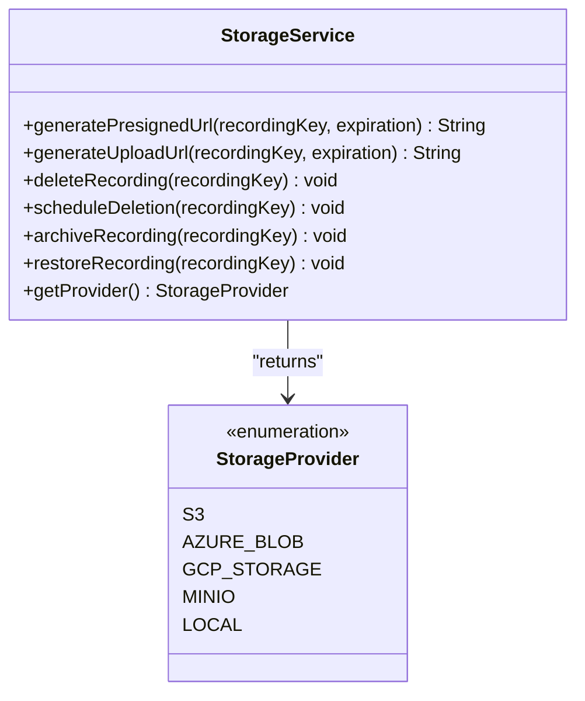
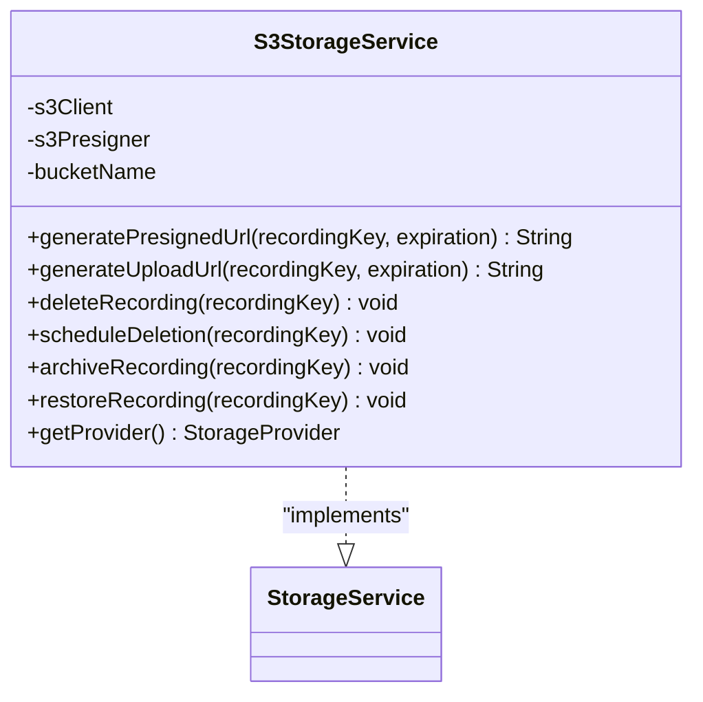
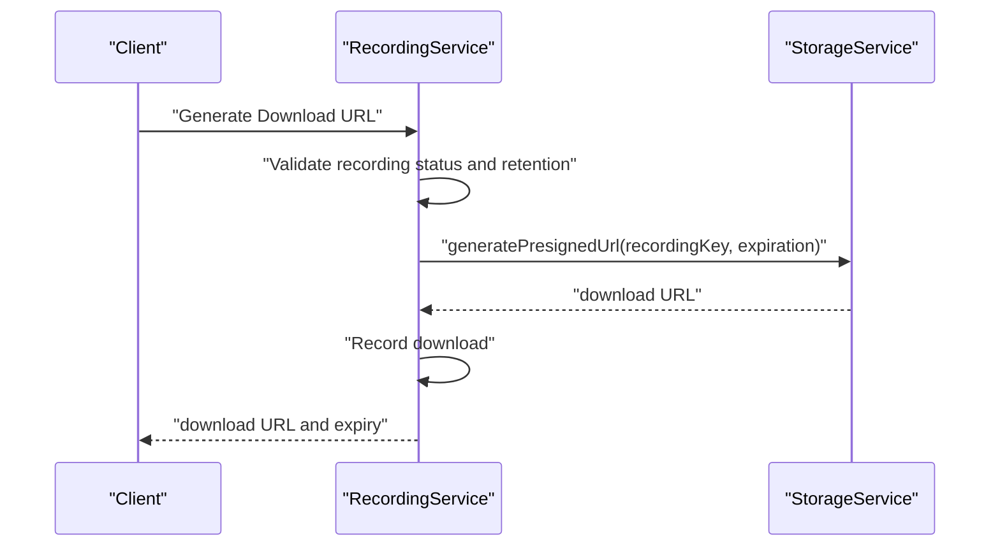
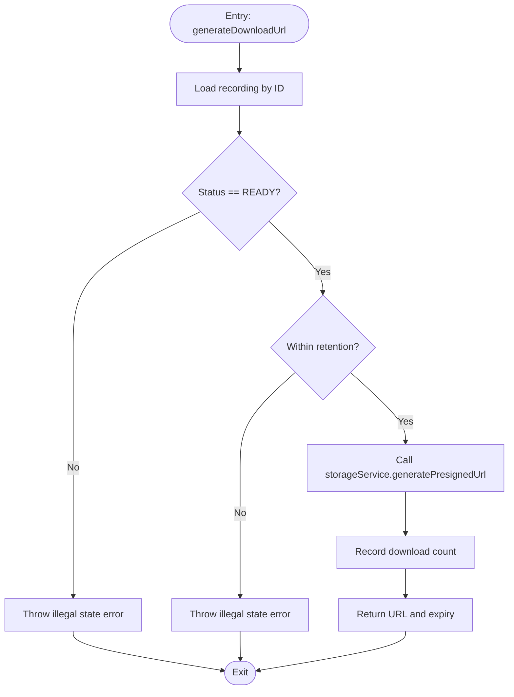
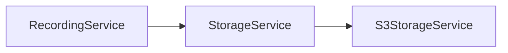
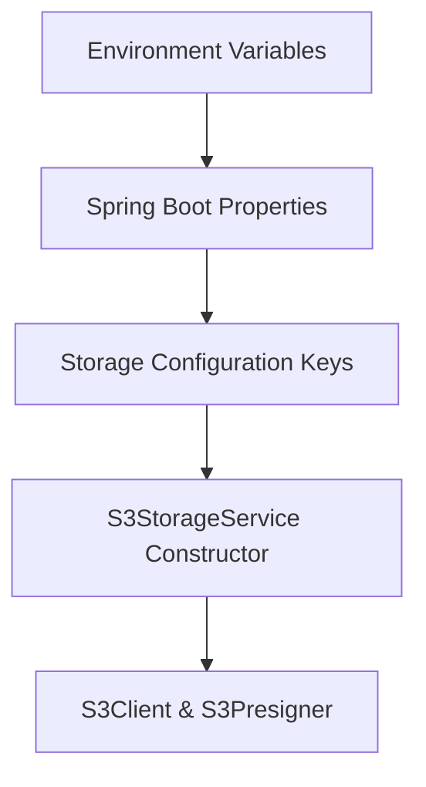

# Storage Service Abstraction

<cite>
**Referenced Files in This Document**
- [StorageService.java](file://jmp-application/src/main/java/com/jmp/application/service/StorageService.java)
- [S3StorageService.java](file://jmp-infrastructure/src/main/java/com/jmp/infrastructure/storage/S3StorageService.java)
- [RecordingService.java](file://jmp-application/src/main/java/com/jmp/application/service/RecordingService.java)
- [application.yml](file://jmp-web/src/main/resources/application.yml)
- [docker-compose.yml](file://docker-compose.yml)
</cite>

## Table of Contents
1. [Introduction](#introduction)
2. [Project Structure](#project-structure)
3. [Core Components](#core-components)
4. [Architecture Overview](#architecture-overview)
5. [Detailed Component Analysis](#detailed-component-analysis)
6. [Dependency Analysis](#dependency-analysis)
7. [Performance Considerations](#performance-considerations)
8. [Configuration Patterns](#configuration-patterns)
9. [Implementing Custom Storage Providers](#implementing-custom-storage-providers)
10. [Migration Strategies](#migration-strategies)
11. [Troubleshooting Guide](#troubleshooting-guide)
12. [Conclusion](#conclusion)

## Introduction
This document explains the storage service abstraction layer and provider pluggability in the platform. It focuses on the StorageService interface design, method contracts, and implementation patterns. It also documents the StorageProvider enumeration, configuration patterns for switching between providers, and guidelines for integrating new storage backends while maintaining compatibility with existing recording workflows.

## Project Structure
The storage abstraction spans two modules:
- Application module: Defines the StorageService interface and the StorageProvider enumeration.
- Infrastructure module: Provides an S3-backed implementation of the storage service.

**Diagram sources**
- [RecordingService.java:36](file://jmp-application/src/main/java/com/jmp/application/service/RecordingService.java#L36)
- [StorageService.java:9-46](file://jmp-application/src/main/java/com/jmp/application/service/StorageService.java#L9-L46)
- [S3StorageService.java:26](file://jmp-infrastructure/src/main/java/com/jmp/infrastructure/storage/S3StorageService.java#L26)

**Section sources**
- [StorageService.java:1-55](file://jmp-application/src/main/java/com/jmp/application/service/StorageService.java#L1-L55)
- [S3StorageService.java:1-129](file://jmp-infrastructure/src/main/java/com/jmp/infrastructure/storage/S3StorageService.java#L1-L129)
- [RecordingService.java:31-36](file://jmp-application/src/main/java/com/jmp/application/service/RecordingService.java#L31-L36)

## Core Components
- StorageService interface: Defines the contract for storage operations and exposes a StorageProvider enumeration.
- S3StorageService implementation: Implements the interface using AWS SDK v2 for S3-compatible storage.
- RecordingService: Consumes StorageService to generate presigned URLs, schedule deletions, and manage archival/restoration.

Key responsibilities:
- Presigned URL generation for downloads and uploads.
- Deletion and scheduled deletion of recordings.
- Archival and restoration operations (placeholder for cold storage).
- Provider identification via getProvider().

**Section sources**
- [StorageService.java:9-46](file://jmp-application/src/main/java/com/jmp/application/service/StorageService.java#L9-L46)
- [S3StorageService.java:26-128](file://jmp-infrastructure/src/main/java/com/jmp/infrastructure/storage/S3StorageService.java#L26-L128)
- [RecordingService.java:142-170](file://jmp-application/src/main/java/com/jmp/application/service/RecordingService.java#L142-L170)

## Architecture Overview
The application layer depends on the StorageService interface, enabling runtime substitution of storage implementations. The infrastructure layer provides an S3 implementation configured via Spring Boot properties.

**Diagram sources**
- [RecordingService.java:36](file://jmp-application/src/main/java/com/jmp/application/service/RecordingService.java#L36)
- [StorageService.java:9-46](file://jmp-application/src/main/java/com/jmp/application/service/StorageService.java#L9-L46)
- [S3StorageService.java:26](file://jmp-infrastructure/src/main/java/com/jmp/infrastructure/storage/S3StorageService.java#L26)

## Detailed Component Analysis

### StorageService Interface
The interface defines the following method contracts:
- generatePresignedUrl(recordingKey, expiration): Returns a pre-signed URL for downloads.
- generateUploadUrl(recordingKey, expiration): Returns a pre-signed URL for uploads.
- deleteRecording(recordingKey): Immediately deletes a recording.
- scheduleDeletion(recordingKey): Schedules deletion (placeholder indicates immediate deletion in current implementation).
- archiveRecording(recordingKey): Archives a recording to cold storage (placeholder).
- restoreRecording(recordingKey): Restores a recording from archive (placeholder).
- getProvider(): Returns the provider type (S3, AZURE_BLOB, GCP_STORAGE, MINIO, LOCAL).

Provider enumeration supports multiple backends, enabling future extension to Azure Blob, Google Cloud Storage, MinIO, and local storage.

**Diagram sources**
- [StorageService.java:9-54](file://jmp-application/src/main/java/com/jmp/application/service/StorageService.java#L9-L54)

**Section sources**
- [StorageService.java:9-54](file://jmp-application/src/main/java/com/jmp/application/service/StorageService.java#L9-L54)

### S3StorageService Implementation
The S3 implementation:
- Accepts configuration via Spring @Value bindings for bucket, region, credentials, and optional endpoint override for MinIO or S3-compatible services.
- Builds S3Client and S3Presigner with static credentials and optional endpoint override.
- Generates pre-signed URLs for downloads and uploads.
- Performs immediate deletion and logs placeholders for scheduled deletion, archival, and restoration.

**Diagram sources**
- [S3StorageService.java:26-128](file://jmp-infrastructure/src/main/java/com/jmp/infrastructure/storage/S3StorageService.java#L26-L128)
- [StorageService.java:9-46](file://jmp-application/src/main/java/com/jmp/application/service/StorageService.java#L9-L46)

**Section sources**
- [S3StorageService.java:32-59](file://jmp-infrastructure/src/main/java/com/jmp/infrastructure/storage/S3StorageService.java#L32-L59)
- [S3StorageService.java:62-85](file://jmp-infrastructure/src/main/java/com/jmp/infrastructure/storage/S3StorageService.java#L62-L85)
- [S3StorageService.java:87-97](file://jmp-infrastructure/src/main/java/com/jmp/infrastructure/storage/S3StorageService.java#L87-L97)
- [S3StorageService.java:99-127](file://jmp-infrastructure/src/main/java/com/jmp/infrastructure/storage/S3StorageService.java#L99-L127)

### RecordingService Integration
RecordingService consumes StorageService for:
- Generating download URLs after a recording reaches READY status and is within retention.
- Scheduling asynchronous deletion upon soft-deleting a recording.
- Archiving expired recordings and delegating cold storage operations to the storage provider.

**Diagram sources**
- [RecordingService.java:142-170](file://jmp-application/src/main/java/com/jmp/application/service/RecordingService.java#L142-L170)
- [StorageService.java:15](file://jmp-application/src/main/java/com/jmp/application/service/StorageService.java#L15)

**Section sources**
- [RecordingService.java:142-170](file://jmp-application/src/main/java/com/jmp/application/service/RecordingService.java#L142-L170)
- [RecordingService.java:198-212](file://jmp-application/src/main/java/com/jmp/application/service/RecordingService.java#L198-L212)
- [RecordingService.java:240-258](file://jmp-application/src/main/java/com/jmp/application/service/RecordingService.java#L240-L258)

### Algorithm Flow: Generate Download URL

**Diagram sources**
- [RecordingService.java:142-170](file://jmp-application/src/main/java/com/jmp/application/service/RecordingService.java#L142-L170)

## Dependency Analysis
- RecordingService depends on StorageService (inversion of control).
- S3StorageService implements StorageService.
- S3 implementation uses AWS SDK v2 and Spring @Value for configuration.

**Diagram sources**
- [RecordingService.java:36](file://jmp-application/src/main/java/com/jmp/application/service/RecordingService.java#L36)
- [StorageService.java:9-46](file://jmp-application/src/main/java/com/jmp/application/service/StorageService.java#L9-L46)
- [S3StorageService.java:26](file://jmp-infrastructure/src/main/java/com/jmp/infrastructure/storage/S3StorageService.java#L26)

**Section sources**
- [RecordingService.java:36](file://jmp-application/src/main/java/com/jmp/application/service/RecordingService.java#L36)
- [S3StorageService.java:26](file://jmp-infrastructure/src/main/java/com/jmp/infrastructure/storage/S3StorageService.java#L26)

## Performance Considerations
- Pre-signed URLs eliminate server bandwidth for large file transfers and reduce latency for clients.
- Immediate deletion and placeholder implementations for archival/restore indicate room for optimization via lifecycle policies, queues, and tiered storage.
- Endpoint override enables MinIO compatibility, allowing self-hosted deployments with reduced latency and cost compared to managed cloud storage in some scenarios.

[No sources needed since this section provides general guidance]

## Configuration Patterns
Current S3 configuration keys (Spring @Value):
- jmp.storage.s3.bucket
- jmp.storage.s3.region (default: us-east-1)
- jmp.storage.s3.access-key
- jmp.storage.s3.secret-key
- jmp.storage.s3.endpoint (optional; enables MinIO or S3-compatible services)

Environment-specific settings:
- Profile activation via SPRING_PROFILES_ACTIVE.
- Database and Redis connectivity via environment variables.
- Container orchestration via docker-compose with profile set to docker.

**Diagram sources**
- [S3StorageService.java:32-59](file://jmp-infrastructure/src/main/java/com/jmp/infrastructure/storage/S3StorageService.java#L32-L59)
- [application.yml:9-10](file://jmp-web/src/main/resources/application.yml#L9-L10)
- [docker-compose.yml:50](file://docker-compose.yml#L50)

**Section sources**
- [S3StorageService.java:32-59](file://jmp-infrastructure/src/main/java/com/jmp/infrastructure/storage/S3StorageService.java#L32-L59)
- [application.yml:9-10](file://jmp-web/src/main/resources/application.yml#L9-L10)
- [docker-compose.yml:50](file://docker-compose.yml#L50)

## Implementing Custom Storage Providers
Guidelines to add a new provider (e.g., Azure Blob, Google Cloud Storage, MinIO, Local):
- Implement StorageService in the infrastructure module.
- Define provider in StorageProvider enumeration.
- Honor method contracts:
  - generatePresignedUrl and generateUploadUrl must return valid pre-signed URLs.
  - deleteRecording must remove the object.
  - scheduleDeletion should delegate to provider-native scheduling mechanisms.
  - archiveRecording and restoreRecording should integrate with provider’s cold storage capabilities.
- Use Spring @Value or configuration classes to externalize provider-specific settings.
- Ensure getProvider returns the appropriate StorageProvider value.

Compatibility with existing workflows:
- RecordingService relies on StorageService methods; new implementations must preserve semantics and error conditions.
- Pre-signed URL generation remains consistent across providers, simplifying client-side integration.

[No sources needed since this section provides general guidance]

## Migration Strategies
- Gradual rollout: Introduce a new provider implementation alongside S3 without changing RecordingService.
- Feature flagging: Gate migration behind a configuration toggle to route specific tenants or conferences to the new provider.
- Data locality: Prefer migrating near the source of the workload (e.g., same region) to minimize transfer costs and latency.
- Cost modeling: Compare per-request costs, storage tiers, and transfer fees across providers.
- Validation: Verify pre-signed URL behavior, deletion, archival, and restoration across providers before full migration.

[No sources needed since this section provides general guidance]

## Troubleshooting Guide
Common issues and resolutions:
- Invalid credentials or missing endpoint: Ensure access-key, secret-key, and optional endpoint are correctly set for S3-compatible services.
- Region mismatch: Confirm region aligns with bucket location to avoid signature errors.
- Expiration handling: Validate that expiration durations are reasonable and aligned with client expectations.
- Scheduled deletion not deferred: Current implementation performs immediate deletion; adjust to use provider-native delayed operations for production.

**Section sources**
- [S3StorageService.java:32-59](file://jmp-infrastructure/src/main/java/com/jmp/infrastructure/storage/S3StorageService.java#L32-L59)
- [S3StorageService.java:99-105](file://jmp-infrastructure/src/main/java/com/jmp/infrastructure/storage/S3StorageService.java#L99-L105)

## Conclusion
The storage abstraction cleanly separates domain logic from infrastructure concerns. The StorageService interface and StorageProvider enumeration enable pluggable backends, while S3StorageService demonstrates a robust implementation with pre-signed URL generation and extensibility for archival and scheduled deletion. By following the implementation guidelines and leveraging environment-specific configuration, teams can integrate additional providers and migrate between backends with minimal disruption to recording workflows.