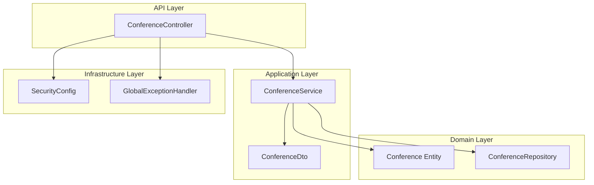
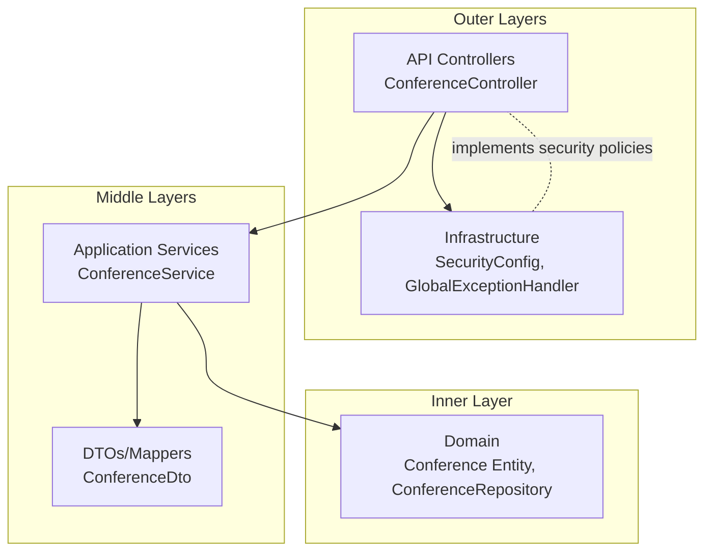
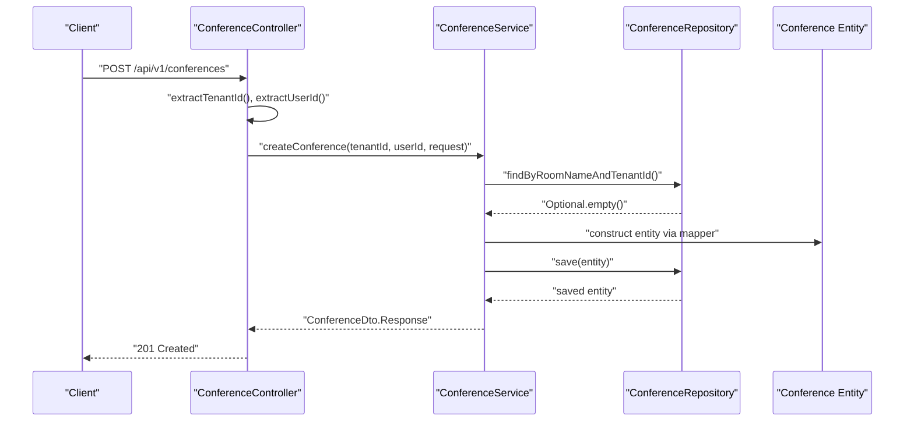
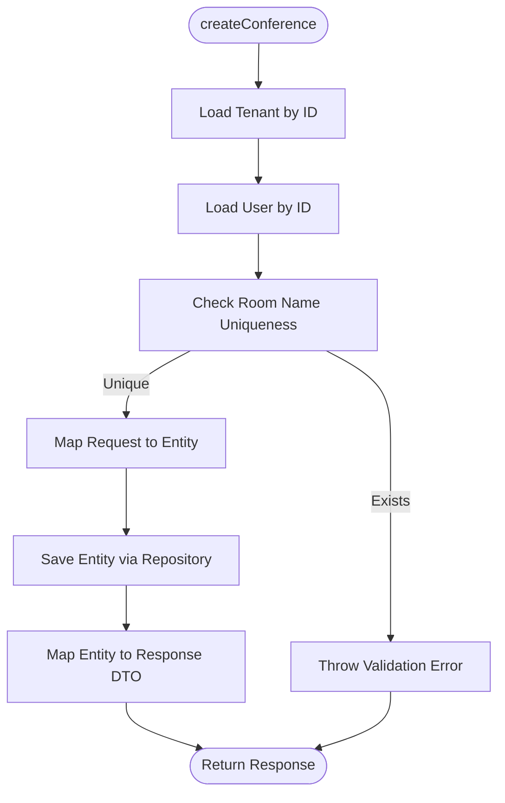
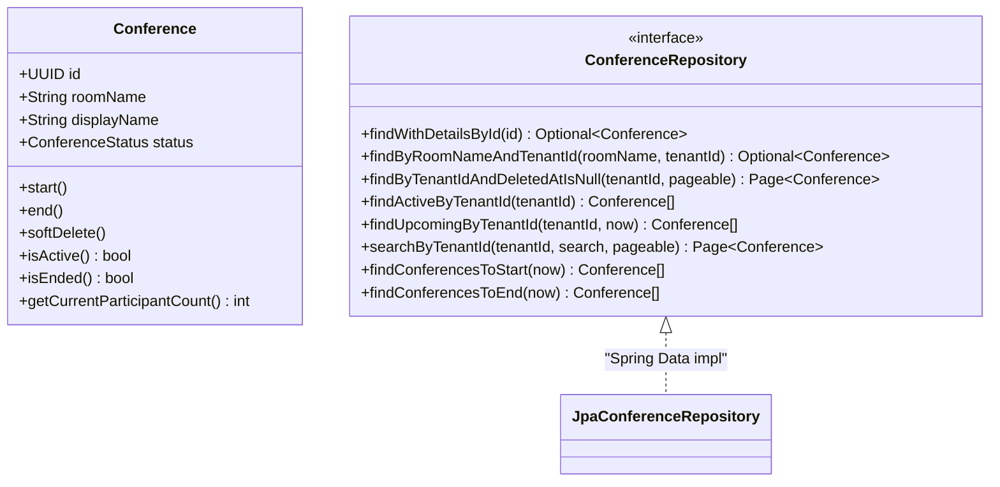
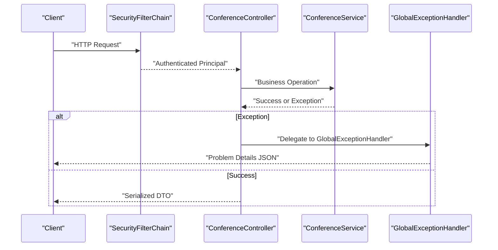
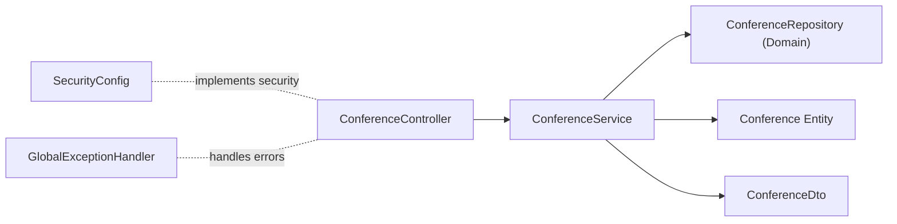

# Clean Architecture Principles

<cite>
**Referenced Files in This Document**
- [ConferenceController.java](file://jmp-api/src/main/java/com/jmp/api/controller/ConferenceController.java)
- [ConferenceService.java](file://jmp-application/src/main/java/com/jmp/application/service/ConferenceService.java)
- [Conference.java](file://jmp-domain/src/main/java/com/jmp/domain/entity/Conference.java)
- [ConferenceRepository.java](file://jmp-domain/src/main/java/com/jmp/domain/repository/ConferenceRepository.java)
- [SecurityConfig.java](file://jmp-infrastructure/src/main/java/com/jmp/infrastructure/security/SecurityConfig.java)
- [GlobalExceptionHandler.java](file://jmp-api/src/main/java/com/jmp/api/advice/GlobalExceptionHandler.java)
- [ConferenceDto.java](file://jmp-application/src/main/java/com/jmp/application/dto/ConferenceDto.java)
</cite>

## Table of Contents
1. [Introduction](#introduction)
2. [Project Structure](#project-structure)
3. [Core Components](#core-components)
4. [Architecture Overview](#architecture-overview)
5. [Detailed Component Analysis](#detailed-component-analysis)
6. [Dependency Analysis](#dependency-analysis)
7. [Performance Considerations](#performance-considerations)
8. [Troubleshooting Guide](#troubleshooting-guide)
9. [Conclusion](#conclusion)

## Introduction
This document explains how the Jitsi Management Platform implements clean architecture principles. The system follows a four-layer structure:
- Domain layer: Entities and business logic
- Application layer: Use cases and orchestration
- Infrastructure layer: External integrations and technical concerns
- API boundary: Controllers and HTTP entry points

Clean architecture enforces dependency inversion so that higher-level modules (controllers and application services) depend only on abstractions defined in the domain layer. This ensures that business logic remains independent of frameworks, databases, and external systems, enabling testability, maintainability, and flexibility when replacing or upgrading infrastructure.

## Project Structure
The platform is organized into four Maven modules, each corresponding to a clean architecture layer:
- jmp-api: HTTP boundary with controllers and global exception handling
- jmp-application: Application services and DTOs/mappers
- jmp-domain: Entities, repositories, and domain events
- jmp-infrastructure: Security, persistence, messaging, and external integrations

**Diagram sources**
- [ConferenceController.java:43-188](file://jmp-api/src/main/java/com/jmp/api/controller/ConferenceController.java#L43-L188)
- [ConferenceService.java:29-224](file://jmp-application/src/main/java/com/jmp/application/service/ConferenceService.java#L29-L224)
- [Conference.java:30-216](file://jmp-domain/src/main/java/com/jmp/domain/entity/Conference.java#L30-L216)
- [ConferenceRepository.java:21-109](file://jmp-domain/src/main/java/com/jmp/domain/repository/ConferenceRepository.java#L21-L109)
- [SecurityConfig.java:31-89](file://jmp-infrastructure/src/main/java/com/jmp/infrastructure/security/SecurityConfig.java#L31-L89)
- [GlobalExceptionHandler.java:24-129](file://jmp-api/src/main/java/com/jmp/api/advice/GlobalExceptionHandler.java#L24-L129)

**Section sources**
- [ConferenceController.java:37-43](file://jmp-api/src/main/java/com/jmp/api/controller/ConferenceController.java#L37-L43)
- [ConferenceService.java:25-29](file://jmp-application/src/main/java/com/jmp/application/service/ConferenceService.java#L25-L29)
- [ConferenceRepository.java:20-21](file://jmp-domain/src/main/java/com/jmp/domain/repository/ConferenceRepository.java#L20-L21)
- [SecurityConfig.java:28-31](file://jmp-infrastructure/src/main/java/com/jmp/infrastructure/security/SecurityConfig.java#L28-L31)

## Core Components
- Domain layer
  - Entity: Conference encapsulates business state and behavior (start, end, soft delete, participant counting)
  - Repository: ConferenceRepository defines database operations via Spring Data JPA
- Application layer
  - Service: ConferenceService orchestrates domain operations, applies business rules, and coordinates repositories
  - DTO: ConferenceDto defines request/response contracts for the API
- API layer
  - Controller: ConferenceController exposes HTTP endpoints and delegates to application services
  - Exception handling: GlobalExceptionHandler centralizes error responses
- Infrastructure layer
  - Security: SecurityConfig configures authentication, authorization, and CORS
  - Persistence: Spring Data JPA repositories implement domain repository interfaces

Key clean architecture characteristics:
- Domain entities are framework-free and encapsulate business logic
- Application services depend on domain abstractions (entities, repositories)
- API controllers depend on application services, not domain internals
- Infrastructure concerns (security, persistence) are injected and configurable

**Section sources**
- [Conference.java:137-175](file://jmp-domain/src/main/java/com/jmp/domain/entity/Conference.java#L137-L175)
- [ConferenceRepository.java:21-109](file://jmp-domain/src/main/java/com/jmp/domain/repository/ConferenceRepository.java#L21-L109)
- [ConferenceService.java:40-65](file://jmp-application/src/main/java/com/jmp/application/service/ConferenceService.java#L40-L65)
- [ConferenceController.java:49-63](file://jmp-api/src/main/java/com/jmp/api/controller/ConferenceController.java#L49-L63)
- [GlobalExceptionHandler.java:26-52](file://jmp-api/src/main/java/com/jmp/api/advice/GlobalExceptionHandler.java#L26-L52)
- [SecurityConfig.java:42-61](file://jmp-infrastructure/src/main/java/com/jmp/infrastructure/security/SecurityConfig.java#L42-L61)

## Architecture Overview
Clean architecture separates concerns by enforcing dependency direction:
- API controllers depend on application services
- Application services depend on domain repositories and entities
- Domain layer depends on nothing external (no framework imports)
- Infrastructure implements domain abstractions and integrates external systems

**Diagram sources**
- [ConferenceController.java:43-188](file://jmp-api/src/main/java/com/jmp/api/controller/ConferenceController.java#L43-L188)
- [ConferenceService.java:31-34](file://jmp-application/src/main/java/com/jmp/application/service/ConferenceService.java#L31-L34)
- [Conference.java:30-216](file://jmp-domain/src/main/java/com/jmp/domain/entity/Conference.java#L30-L216)
- [ConferenceRepository.java:21-109](file://jmp-domain/src/main/java/com/jmp/domain/repository/ConferenceRepository.java#L21-L109)
- [SecurityConfig.java:31-40](file://jmp-infrastructure/src/main/java/com/jmp/infrastructure/security/SecurityConfig.java#L31-L40)
- [GlobalExceptionHandler.java:24-24](file://jmp-api/src/main/java/com/jmp/api/advice/GlobalExceptionHandler.java#L24-L24)

## Detailed Component Analysis

### API Boundary: ConferenceController
- Purpose: Expose HTTP endpoints for conference management
- Responsibilities:
  - Authorization checks via method security
  - Extract tenant and user identity from authentication
  - Delegate business operations to application services
  - Return standardized responses and status codes
- Clean architecture alignment:
  - Depends on application services (not domain internals)
  - Uses DTOs for request/response contracts
  - Integrates with infrastructure (security filter chain)

**Diagram sources**
- [ConferenceController.java:52-62](file://jmp-api/src/main/java/com/jmp/api/controller/ConferenceController.java#L52-L62)
- [ConferenceService.java:40-65](file://jmp-application/src/main/java/com/jmp/application/service/ConferenceService.java#L40-L65)
- [ConferenceRepository.java:31-32](file://jmp-domain/src/main/java/com/jmp/domain/repository/ConferenceRepository.java#L31-L32)
- [Conference.java:30-136](file://jmp-domain/src/main/java/com/jmp/domain/entity/Conference.java#L30-L136)

**Section sources**
- [ConferenceController.java:49-63](file://jmp-api/src/main/java/com/jmp/api/controller/ConferenceController.java#L49-L63)
- [SecurityConfig.java:49-58](file://jmp-infrastructure/src/main/java/com/jmp/infrastructure/security/SecurityConfig.java#L49-L58)

### Application Orchestration: ConferenceService
- Purpose: Implement use cases and enforce business rules
- Responsibilities:
  - Validate inputs and business constraints
  - Coordinate repository operations
  - Transform between domain entities and application DTOs
  - Manage transaction boundaries
- Clean architecture alignment:
  - Depends on domain repository abstractions
  - Encapsulates business logic independent of frameworks
  - Produces DTOs consumed by API controllers

**Diagram sources**
- [ConferenceService.java:40-65](file://jmp-application/src/main/java/com/jmp/application/service/ConferenceService.java#L40-L65)
- [ConferenceRepository.java:31-32](file://jmp-domain/src/main/java/com/jmp/domain/repository/ConferenceRepository.java#L31-L32)
- [ConferenceDto.java:101-125](file://jmp-application/src/main/java/com/jmp/application/dto/ConferenceDto.java#L101-L125)

**Section sources**
- [ConferenceService.java:40-65](file://jmp-application/src/main/java/com/jmp/application/service/ConferenceService.java#L40-L65)
- [ConferenceDto.java:43-67](file://jmp-application/src/main/java/com/jmp/application/dto/ConferenceDto.java#L43-L67)

### Domain Entities and Repositories
- Conference entity encapsulates state and behavior:
  - Status transitions (start, end, soft delete)
  - Participant counting
  - Equality and auditing fields
- ConferenceRepository defines domain-specific queries:
  - Find by room name and tenant
  - Paginated tenant listings
  - Active/upcoming/scheduled queries
  - Auto-start/end scheduling helpers

**Diagram sources**
- [Conference.java:30-216](file://jmp-domain/src/main/java/com/jmp/domain/entity/Conference.java#L30-L216)
- [ConferenceRepository.java:21-109](file://jmp-domain/src/main/java/com/jmp/domain/repository/ConferenceRepository.java#L21-L109)

**Section sources**
- [Conference.java:137-175](file://jmp-domain/src/main/java/com/jmp/domain/entity/Conference.java#L137-L175)
- [ConferenceRepository.java:26-108](file://jmp-domain/src/main/java/com/jmp/domain/repository/ConferenceRepository.java#L26-L108)

### Infrastructure: Security and Exception Handling
- SecurityConfig:
  - Stateless sessions
  - Method-level authorization
  - Public endpoints for auth and webhooks
  - CORS configuration
- GlobalExceptionHandler:
  - Centralized RFC 7807 Problem Details responses
  - Typed error categories (validation, unauthorized, forbidden, conflict)

**Diagram sources**
- [SecurityConfig.java:42-61](file://jmp-infrastructure/src/main/java/com/jmp/infrastructure/security/SecurityConfig.java#L42-L61)
- [ConferenceController.java:49-63](file://jmp-api/src/main/java/com/jmp/api/controller/ConferenceController.java#L49-L63)
- [GlobalExceptionHandler.java:26-52](file://jmp-api/src/main/java/com/jmp/api/advice/GlobalExceptionHandler.java#L26-L52)

**Section sources**
- [SecurityConfig.java:42-88](file://jmp-infrastructure/src/main/java/com/jmp/infrastructure/security/SecurityConfig.java#L42-L88)
- [GlobalExceptionHandler.java:26-128](file://jmp-api/src/main/java/com/jmp/api/advice/GlobalExceptionHandler.java#L26-L128)

## Dependency Analysis
Clean architecture enforces dependency inversion:
- API controllers depend on application services (abstractions)
- Application services depend on domain repositories (abstractions)
- Domain layer is self-contained and framework-independent
- Infrastructure implements domain abstractions and integrates external systems

**Diagram sources**
- [ConferenceController.java:45-47](file://jmp-api/src/main/java/com/jmp/api/controller/ConferenceController.java#L45-L47)
- [ConferenceService.java:31-34](file://jmp-application/src/main/java/com/jmp/application/service/ConferenceService.java#L31-L34)
- [ConferenceRepository.java:21-21](file://jmp-domain/src/main/java/com/jmp/domain/repository/ConferenceRepository.java#L21-L21)
- [Conference.java:30-30](file://jmp-domain/src/main/java/com/jmp/domain/entity/Conference.java#L30-L30)
- [SecurityConfig.java:31-40](file://jmp-infrastructure/src/main/java/com/jmp/infrastructure/security/SecurityConfig.java#L31-L40)
- [GlobalExceptionHandler.java:24-24](file://jmp-api/src/main/java/com/jmp/api/advice/GlobalExceptionHandler.java#L24-L24)

**Section sources**
- [ConferenceController.java:45-47](file://jmp-api/src/main/java/com/jmp/api/controller/ConferenceController.java#L45-L47)
- [ConferenceService.java:31-34](file://jmp-application/src/main/java/com/jmp/application/service/ConferenceService.java#L31-L34)
- [ConferenceRepository.java:21-21](file://jmp-domain/src/main/java/com/jmp/domain/repository/ConferenceRepository.java#L21-L21)

## Performance Considerations
- Transaction boundaries: Application services define transaction scopes for write operations, minimizing lock contention and ensuring consistency
- Repository queries: Domain repository methods encapsulate complex JPQL and EntityGraph usage, keeping controllers thin and efficient
- DTO mapping: Separation of domain entities from API responses reduces payload sizes and avoids lazy-loading pitfalls
- Security overhead: Stateless JWT-based authentication eliminates server-side session storage and reduces latency

## Troubleshooting Guide
Common issues and resolutions:
- Validation failures: GlobalExceptionHandler returns structured Problem Details with field-level errors for invalid requests
- Access control: Method security on controllers combined with SecurityConfig ensures proper authorization enforcement
- Authentication problems: Centralized exception handling maps BadCredentialsException to appropriate HTTP status codes
- Business rule violations: Application services throw explicit exceptions for invalid state transitions or constraints

**Section sources**
- [GlobalExceptionHandler.java:82-114](file://jmp-api/src/main/java/com/jmp/api/advice/GlobalExceptionHandler.java#L82-L114)
- [ConferenceController.java:49-63](file://jmp-api/src/main/java/com/jmp/api/controller/ConferenceController.java#L49-L63)
- [SecurityConfig.java:49-58](file://jmp-infrastructure/src/main/java/com/jmp/infrastructure/security/SecurityConfig.java#L49-L58)

## Conclusion
The Jitsi Management Platform demonstrates clean architecture by placing domain entities at the center, with application services orchestrating business logic, API controllers at the boundary, and infrastructure handling technical concerns. Dependency inversion ensures that higher-level modules do not depend on lower-level modules, preserving independence of business logic from frameworks and external systems. This design yields improved testability, maintainability, and flexibility for evolving infrastructure without disrupting core business operations.