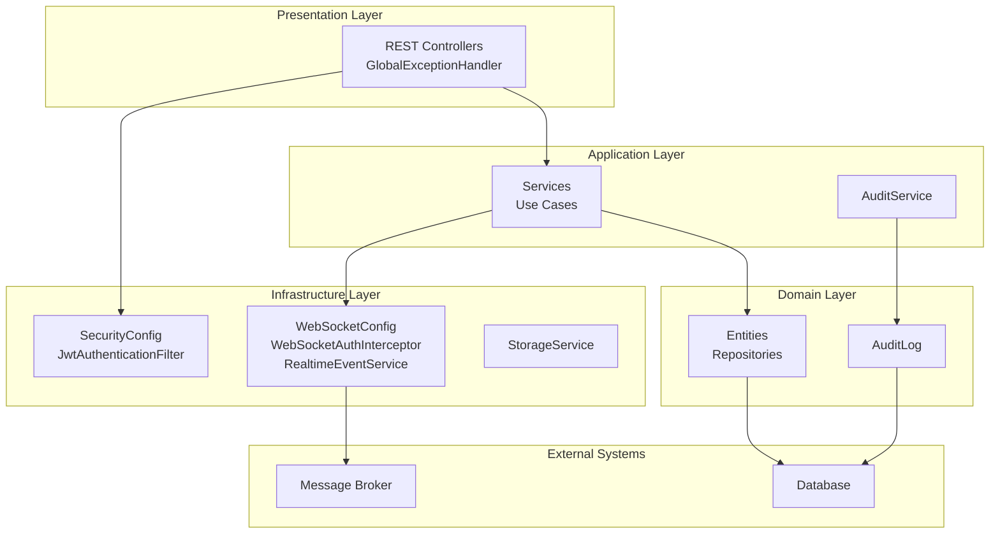
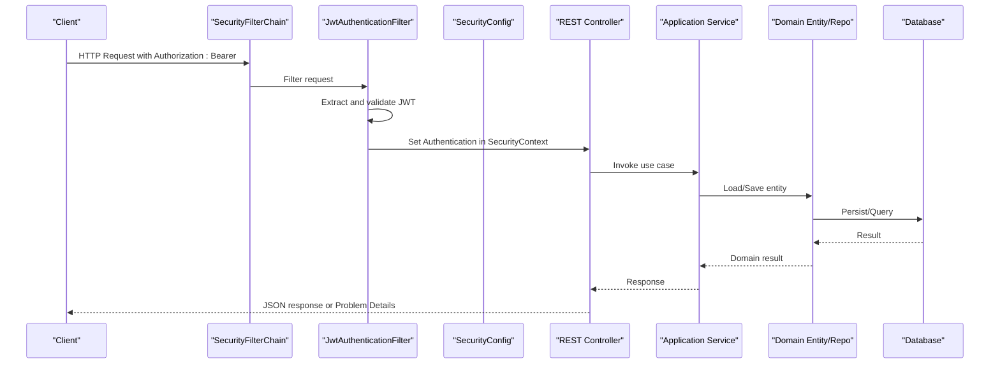
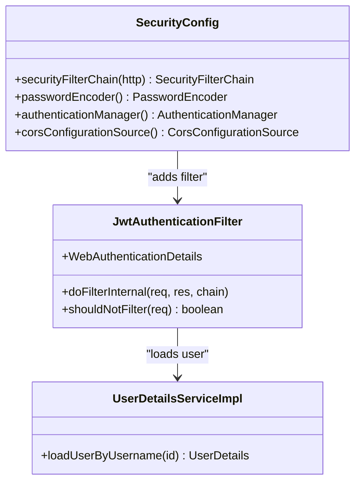
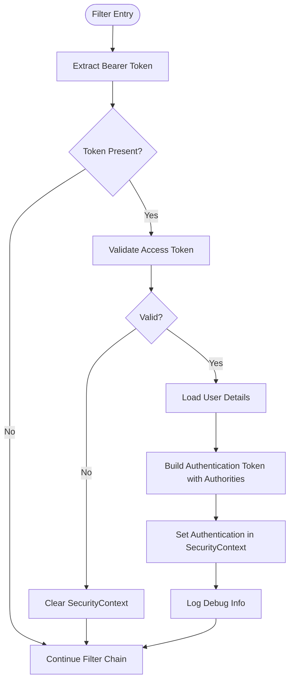
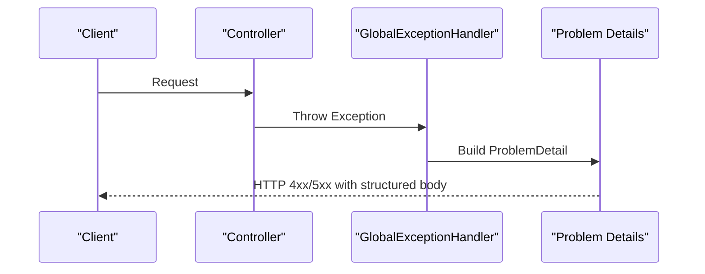
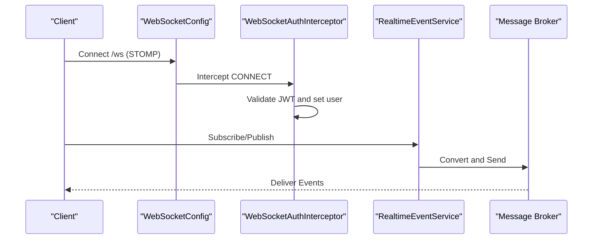
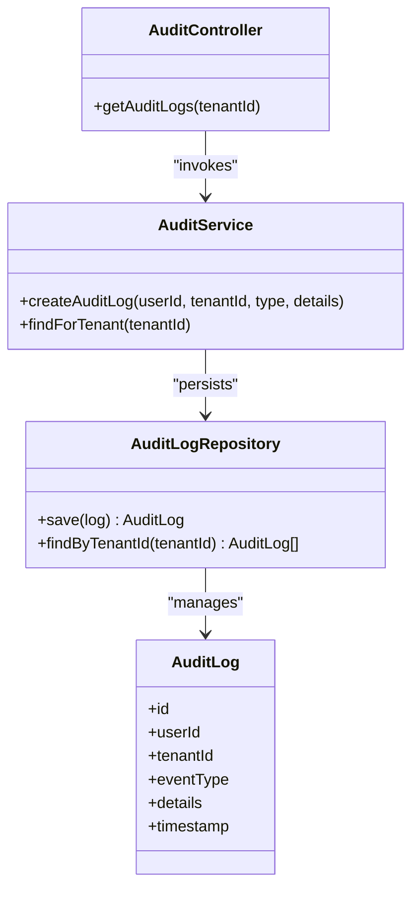
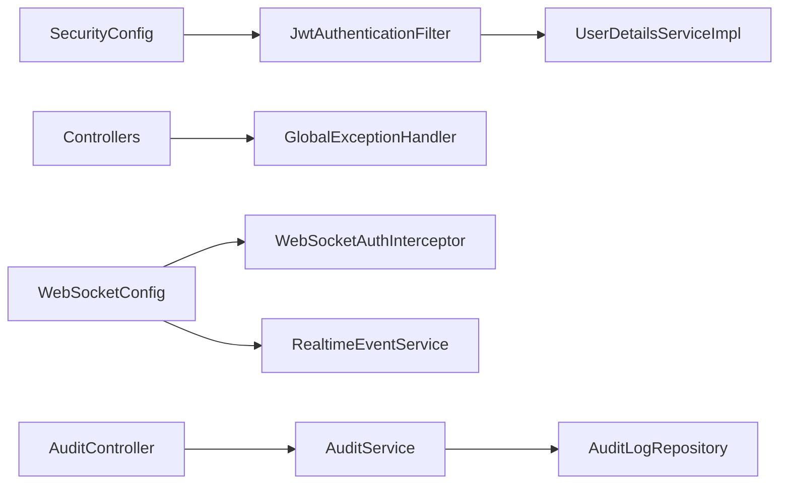

# Cross-Cutting Concerns

<cite>
**Referenced Files in This Document**
- [SecurityConfig.java](file://jmp-infrastructure/src/main/java/com/jmp/infrastructure/security/SecurityConfig.java)
- [JwtAuthenticationFilter.java](file://jmp-infrastructure/src/main/java/com/jmp/infrastructure/security/JwtAuthenticationFilter.java)
- [UserDetailsServiceImpl.java](file://jmp-infrastructure/src/main/java/com/jmp/infrastructure/security/UserDetailsServiceImpl.java)
- [GlobalExceptionHandler.java](file://jmp-api/src/main/java/com/jmp/api/advice/GlobalExceptionHandler.java)
- [WebSocketConfig.java](file://jmp-infrastructure/src/main/java/com/jmp/infrastructure/websocket/WebSocketConfig.java)
- [WebSocketAuthInterceptor.java](file://jmp-infrastructure/src/main/java/com/jmp/infrastructure/websocket/WebSocketAuthInterceptor.java)
- [RealtimeEventService.java](file://jmp-infrastructure/src/main/java/com/jmp/infrastructure/websocket/RealtimeEventService.java)
- [AuditLog.java](file://jmp-domain/src/main/java/com/jmp/domain/entity/AuditLog.java)
- [AuditLogRepository.java](file://jmp-domain/src/main/java/com/jmp/domain/repository/AuditLogRepository.java)
- [AuditService.java](file://jmp-application/src/main/java/com/jmp/application/service/AuditService.java)
- [AuditController.java](file://jmp-api/src/main/java/com/jmp/api/controller/AuditController.java)
- [application.yml](file://jmp-web/src/main/resources/application.yml)
</cite>

## Table of Contents
1. [Introduction](#introduction)
2. [Project Structure](#project-structure)
3. [Core Components](#core-components)
4. [Architecture Overview](#architecture-overview)
5. [Detailed Component Analysis](#detailed-component-analysis)
6. [Dependency Analysis](#dependency-analysis)
7. [Performance Considerations](#performance-considerations)
8. [Troubleshooting Guide](#troubleshooting-guide)
9. [Conclusion](#conclusion)

## Introduction
This document details the cross-cutting concerns implemented in the Jitsi Management Platform (JMP). It covers security (Spring Security, JWT filters, method-level authorization), exception handling (global handlers with RFC 7807 Problem Details), logging and monitoring, caching strategies, real-time communication (WebSocket), audit logging and compliance, and transaction/retry/error handling patterns. The goal is to explain how these concerns are consistently applied across layers while preserving separation of concerns and minimizing duplication.

## Project Structure
The platform follows a layered architecture:
- jmp-web: Bootstraps the application and provides environment-specific configuration.
- jmp-api: Exposes REST endpoints and global exception handling.
- jmp-application: Implements use cases, services, and application-level logic.
- jmp-domain: Defines entities, repositories, domain events, and exceptions.
- jmp-infrastructure: Provides infrastructure integrations (security, WebSocket, storage).
- jmp-ui: Frontend client (not covered in depth here).

**Diagram sources**
- [SecurityConfig.java:28-90](file://jmp-infrastructure/src/main/java/com/jmp/infrastructure/security/SecurityConfig.java#L28-L90)
- [JwtAuthenticationFilter.java:27-122](file://jmp-infrastructure/src/main/java/com/jmp/infrastructure/security/JwtAuthenticationFilter.java#L27-L122)
- [GlobalExceptionHandler.java:22-130](file://jmp-api/src/main/java/com/jmp/api/advice/GlobalExceptionHandler.java#L22-L130)
- [WebSocketConfig.java:23-70](file://jmp-infrastructure/src/main/java/com/jmp/infrastructure/websocket/WebSocketConfig.java#L23-L70)
- [WebSocketAuthInterceptor.java:26-94](file://jmp-infrastructure/src/main/java/com/jmp/infrastructure/websocket/WebSocketAuthInterceptor.java#L26-L94)
- [RealtimeEventService.java:17-142](file://jmp-infrastructure/src/main/java/com/jmp/infrastructure/websocket/RealtimeEventService.java#L17-L142)
- [AuditLog.java](file://jmp-domain/src/main/java/com/jmp/domain/entity/AuditLog.java)
- [AuditLogRepository.java](file://jmp-domain/src/main/java/com/jmp/domain/repository/AuditLogRepository.java)
- [AuditService.java](file://jmp-application/src/main/java/com/jmp/application/service/AuditService.java)
- [AuditController.java](file://jmp-api/src/main/java/com/jmp/api/controller/AuditController.java)

**Section sources**
- [SecurityConfig.java:28-90](file://jmp-infrastructure/src/main/java/com/jmp/infrastructure/security/SecurityConfig.java#L28-L90)
- [GlobalExceptionHandler.java:22-130](file://jmp-api/src/main/java/com/jmp/api/advice/GlobalExceptionHandler.java#L22-L130)
- [WebSocketConfig.java:23-70](file://jmp-infrastructure/src/main/java/com/jmp/infrastructure/websocket/WebSocketConfig.java#L23-L70)

## Core Components
- Security: Stateless JWT-based authentication with Spring Security filter chain and method-level authorization enabled.
- Exception Handling: Global exception handler returning standardized Problem Details responses.
- Logging and Monitoring: Structured logging via SLF4J/MDC-like patterns and actuator health endpoint exposure.
- Caching: Not present in the current codebase; recommended strategies outlined below.
- Real-time Communication: WebSocket STOMP endpoints with JWT-based authentication and tenant-scoped destinations.
- Audit Logging: Domain entity and repository for audit logs, with service/controller integration points.
- Transactions and Retries: No explicit retry policy observed; transaction boundaries are implicit around repository operations.

**Section sources**
- [SecurityConfig.java:42-75](file://jmp-infrastructure/src/main/java/com/jmp/infrastructure/security/SecurityConfig.java#L42-L75)
- [JwtAuthenticationFilter.java:39-94](file://jmp-infrastructure/src/main/java/com/jmp/infrastructure/security/JwtAuthenticationFilter.java#L39-L94)
- [GlobalExceptionHandler.java:22-130](file://jmp-api/src/main/java/com/jmp/api/advice/GlobalExceptionHandler.java#L22-L130)
- [WebSocketConfig.java:23-70](file://jmp-infrastructure/src/main/java/com/jmp/infrastructure/websocket/WebSocketConfig.java#L23-L70)
- [WebSocketAuthInterceptor.java:26-94](file://jmp-infrastructure/src/main/java/com/jmp/infrastructure/websocket/WebSocketAuthInterceptor.java#L26-L94)
- [RealtimeEventService.java:17-142](file://jmp-infrastructure/src/main/java/com/jmp/infrastructure/websocket/RealtimeEventService.java#L17-L142)
- [AuditLog.java](file://jmp-domain/src/main/java/com/jmp/domain/entity/AuditLog.java)
- [AuditLogRepository.java](file://jmp-domain/src/main/java/com/jmp/domain/repository/AuditLogRepository.java)
- [AuditService.java](file://jmp-application/src/main/java/com/jmp/application/service/AuditService.java)
- [AuditController.java](file://jmp-api/src/main/java/com/jmp/api/controller/AuditController.java)

## Architecture Overview
The cross-cutting concerns span all layers but are centralized in infrastructure and API layers to avoid duplication.

**Diagram sources**
- [SecurityConfig.java:42-61](file://jmp-infrastructure/src/main/java/com/jmp/infrastructure/security/SecurityConfig.java#L42-L61)
- [JwtAuthenticationFilter.java:39-76](file://jmp-infrastructure/src/main/java/com/jmp/infrastructure/security/JwtAuthenticationFilter.java#L39-L76)
- [GlobalExceptionHandler.java:22-130](file://jmp-api/src/main/java/com/jmp/api/advice/GlobalExceptionHandler.java#L22-L130)

## Detailed Component Analysis

### Security Implementation
- Filter Chain: CSRF disabled, CORS configured, session stateless, public endpoints exposed, all other requests require authentication, JWT filter injected before UsernamePassword filter.
- Password Encoding: BCrypt with cost factor 12.
- Authentication Manager: DAO provider backed by UserDetailsService.
- Method Security: Pre-post annotations enabled for fine-grained authorization checks.

**Diagram sources**
- [SecurityConfig.java:32-75](file://jmp-infrastructure/src/main/java/com/jmp/infrastructure/security/SecurityConfig.java#L32-L75)
- [JwtAuthenticationFilter.java:27-37](file://jmp-infrastructure/src/main/java/com/jmp/infrastructure/security/JwtAuthenticationFilter.java#L27-L37)
- [UserDetailsServiceImpl.java](file://jmp-infrastructure/src/main/java/com/jmp/infrastructure/security/UserDetailsServiceImpl.java)

**Section sources**
- [SecurityConfig.java:42-75](file://jmp-infrastructure/src/main/java/com/jmp/infrastructure/security/SecurityConfig.java#L42-L75)
- [JwtAuthenticationFilter.java:39-94](file://jmp-infrastructure/src/main/java/com/jmp/infrastructure/security/JwtAuthenticationFilter.java#L39-L94)

### JWT Authentication Filter
- Extracts Bearer token from Authorization header.
- Validates JWT via application service and loads user details.
- Populates SecurityContext with authorities derived from JWT roles.
- Adds custom WebAuthenticationDetails with tenant/user ID and remote address.
- Short-circuits for public endpoints.

**Diagram sources**
- [JwtAuthenticationFilter.java:39-76](file://jmp-infrastructure/src/main/java/com/jmp/infrastructure/security/JwtAuthenticationFilter.java#L39-L76)

**Section sources**
- [JwtAuthenticationFilter.java:39-122](file://jmp-infrastructure/src/main/java/com/jmp/infrastructure/security/JwtAuthenticationFilter.java#L39-L122)

### Authorization Mechanisms
- Public endpoints: authentication, webhooks, health, Swagger UI.
- All other endpoints require authentication.
- Method-level security enabled; use @PreAuthorize/@PostAuthorize in services/controllers as needed.

**Section sources**
- [SecurityConfig.java:49-58](file://jmp-infrastructure/src/main/java/com/jmp/infrastructure/security/SecurityConfig.java#L49-L58)

### Exception Handling Strategy
- Global exception handler returns Problem Details (RFC 7807) with structured fields: title, detail, status, instance, timestamp, errorCode, and additional properties (e.g., nested errors for validation).
- Handles illegal arguments, conflicts, bad credentials, access denied, validation errors, constraint violations, and generic server errors.

**Diagram sources**
- [GlobalExceptionHandler.java:22-130](file://jmp-api/src/main/java/com/jmp/api/advice/GlobalExceptionHandler.java#L22-L130)

**Section sources**
- [GlobalExceptionHandler.java:22-130](file://jmp-api/src/main/java/com/jmp/api/advice/GlobalExceptionHandler.java#L22-L130)

### Logging and Monitoring Integration
- Structured logging via SLF4J with contextual info (user ID, URI, tenant ID).
- Actuator health endpoint exposed publicly for monitoring.
- Centralized logging configuration in application.yml.

**Section sources**
- [JwtAuthenticationFilter.java:68-72](file://jmp-infrastructure/src/main/java/com/jmp/infrastructure/security/JwtAuthenticationFilter.java#L68-L72)
- [WebSocketAuthInterceptor.java:63-66](file://jmp-infrastructure/src/main/java/com/jmp/infrastructure/websocket/WebSocketAuthInterceptor.java#L63-L66)
- [RealtimeEventService.java:96-100](file://jmp-infrastructure/src/main/java/com/jmp/infrastructure/websocket/RealtimeEventService.java#L96-L100)
- [application.yml](file://jmp-web/src/main/resources/application.yml)

### Caching Strategies and Performance Optimization
- Current codebase does not implement caching.
- Recommended approaches:
  - Application-level caching for read-heavy domain entities (users, tenants) using Spring Cache with TTL and invalidation on write.
  - Query result caching for analytics endpoints with cache keys derived from parameters and tenant ID.
  - Rate limiting at API gateway or Spring Cloud Gateway to protect downstream services.
  - Asynchronous processing for long-running tasks (e.g., recordings) with retry and dead-letter exchanges.

[No sources needed since this section provides general guidance]

### Real-Time Communication Setup
- WebSocket endpoints registered with SockJS fallback and native WebSocket support.
- Message broker configured for in-memory topics/queues; user destinations supported.
- Authentication interceptor validates JWT in STOMP CONNECT frames and sets user principal and session attributes.
- Event broadcasting service supports tenant-scoped, user-scoped, and broadcast events with typed wrappers.

**Diagram sources**
- [WebSocketConfig.java:42-55](file://jmp-infrastructure/src/main/java/com/jmp/infrastructure/websocket/WebSocketConfig.java#L42-L55)
- [WebSocketAuthInterceptor.java:33-73](file://jmp-infrastructure/src/main/java/com/jmp/infrastructure/websocket/WebSocketAuthInterceptor.java#L33-L73)
- [RealtimeEventService.java:88-101](file://jmp-infrastructure/src/main/java/com/jmp/infrastructure/websocket/RealtimeEventService.java#L88-L101)

**Section sources**
- [WebSocketConfig.java:23-70](file://jmp-infrastructure/src/main/java/com/jmp/infrastructure/websocket/WebSocketConfig.java#L23-L70)
- [WebSocketAuthInterceptor.java:26-94](file://jmp-infrastructure/src/main/java/com/jmp/infrastructure/websocket/WebSocketAuthInterceptor.java#L26-L94)
- [RealtimeEventService.java:17-142](file://jmp-infrastructure/src/main/java/com/jmp/infrastructure/websocket/RealtimeEventService.java#L17-L142)

### Audit Logging Implementation and Compliance
- Domain entity and repository define audit logging capabilities.
- Application service coordinates audit records creation.
- Controller exposes audit endpoints for querying and management.
- Compliance considerations:
  - Timestamp precision and immutability of audit entries.
  - Tenant scoping via JWT claims and repository queries.
  - Secure retention and deletion policies aligned with data governance.

**Diagram sources**
- [AuditLog.java](file://jmp-domain/src/main/java/com/jmp/domain/entity/AuditLog.java)
- [AuditLogRepository.java](file://jmp-domain/src/main/java/com/jmp/domain/repository/AuditLogRepository.java)
- [AuditService.java](file://jmp-application/src/main/java/com/jmp/application/service/AuditService.java)
- [AuditController.java](file://jmp-api/src/main/java/com/jmp/api/controller/AuditController.java)

**Section sources**
- [AuditLog.java](file://jmp-domain/src/main/java/com/jmp/domain/entity/AuditLog.java)
- [AuditLogRepository.java](file://jmp-domain/src/main/java/com/jmp/domain/repository/AuditLogRepository.java)
- [AuditService.java](file://jmp-application/src/main/java/com/jmp/application/service/AuditService.java)
- [AuditController.java](file://jmp-api/src/main/java/com/jmp/api/controller/AuditController.java)

### Transaction Management, Retry Policies, and Error Handling Patterns
- Transactions: Repository operations are implicitly transactional; explicit @Transactional boundaries can be added at service layer for multi-repository consistency.
- Retries: No explicit retry policy found; consider Spring Retry with exponential backoff for idempotent operations and external integrations.
- Idempotency: Generate client-provided request IDs and store them to prevent duplicate processing.
- Circuit Breaker: Integrate resilience4j for external service protection.
- Error Propagation: Prefer throwing domain/application exceptions to maintain separation of concerns; let global exception handler convert to Problem Details.

[No sources needed since this section provides general guidance]

## Dependency Analysis
The cross-cutting concerns exhibit low coupling and high cohesion:
- Security depends on JwtService and UserDetailsService.
- WebSocket depends on JwtService and SimpMessagingTemplate.
- Exception handling is centralized in the API layer.
- Audit spans domain and application layers with clear controller exposure.

**Diagram sources**
- [SecurityConfig.java:32-40](file://jmp-infrastructure/src/main/java/com/jmp/infrastructure/security/SecurityConfig.java#L32-L40)
- [JwtAuthenticationFilter.java:31-37](file://jmp-infrastructure/src/main/java/com/jmp/infrastructure/security/JwtAuthenticationFilter.java#L31-L37)
- [WebSocketConfig.java:23-31](file://jmp-infrastructure/src/main/java/com/jmp/infrastructure/websocket/WebSocketConfig.java#L23-L31)
- [WebSocketAuthInterceptor.java:26-32](file://jmp-infrastructure/src/main/java/com/jmp/infrastructure/websocket/WebSocketAuthInterceptor.java#L26-L32)
- [RealtimeEventService.java:17-24](file://jmp-infrastructure/src/main/java/com/jmp/infrastructure/websocket/RealtimeEventService.java#L17-L24)
- [AuditService.java](file://jmp-application/src/main/java/com/jmp/application/service/AuditService.java)
- [AuditLogRepository.java](file://jmp-domain/src/main/java/com/jmp/domain/repository/AuditLogRepository.java)
- [AuditController.java](file://jmp-api/src/main/java/com/jmp/api/controller/AuditController.java)

**Section sources**
- [SecurityConfig.java:32-40](file://jmp-infrastructure/src/main/java/com/jmp/infrastructure/security/SecurityConfig.java#L32-L40)
- [JwtAuthenticationFilter.java:31-37](file://jmp-infrastructure/src/main/java/com/jmp/infrastructure/security/JwtAuthenticationFilter.java#L31-L37)
- [WebSocketConfig.java:23-31](file://jmp-infrastructure/src/main/java/com/jmp/infrastructure/websocket/WebSocketConfig.java#L23-L31)
- [WebSocketAuthInterceptor.java:26-32](file://jmp-infrastructure/src/main/java/com/jmp/infrastructure/websocket/WebSocketAuthInterceptor.java#L26-L32)
- [RealtimeEventService.java:17-24](file://jmp-infrastructure/src/main/java/com/jmp/infrastructure/websocket/RealtimeEventService.java#L17-L24)
- [AuditService.java](file://jmp-application/src/main/java/com/jmp/application/service/AuditService.java)
- [AuditLogRepository.java](file://jmp-domain/src/main/java/com/jmp/domain/repository/AuditLogRepository.java)
- [AuditController.java](file://jmp-api/src/main/java/com/jmp/api/controller/AuditController.java)

## Performance Considerations
- Stateless JWT eliminates server-side session overhead.
- Use lazy loading and pagination for large datasets; apply DTO projections where appropriate.
- Minimize N+1 queries in controllers/services; leverage batch operations for bulk updates.
- Cache frequently accessed immutable data (e.g., roles, permissions) with cache invalidation on change.
- Monitor slow endpoints via actuator metrics and distributed tracing.

[No sources needed since this section provides general guidance]

## Troubleshooting Guide
- Authentication failures: Verify Authorization header format, token validity, and user existence.
- Access denied errors: Confirm role claims in JWT and method-level annotations.
- Validation errors: Inspect field-level error maps returned in Problem Details.
- WebSocket connection issues: Ensure Bearer token presence in Authorization header or login parameter for SockJS.
- Audit logs not appearing: Check tenant scoping and repository permissions.

**Section sources**
- [JwtAuthenticationFilter.java:70-76](file://jmp-infrastructure/src/main/java/com/jmp/infrastructure/security/JwtAuthenticationFilter.java#L70-L76)
- [WebSocketAuthInterceptor.java:44-70](file://jmp-infrastructure/src/main/java/com/jmp/infrastructure/websocket/WebSocketAuthInterceptor.java#L44-L70)
- [GlobalExceptionHandler.java:82-114](file://jmp-api/src/main/java/com/jmp/api/advice/GlobalExceptionHandler.java#L82-L114)

## Conclusion
The Jitsi Management Platform implements robust cross-cutting concerns through centralized infrastructure and API components. Security is enforced at the filter and method levels, exceptions are standardized with Problem Details, and real-time communication is secured and scalable. Audit logging is modeled at the domain level with clear application and presentation integration points. While caching, retries, and advanced resilience are not yet implemented, the architecture is prepared to adopt these patterns without violating separation of concerns.