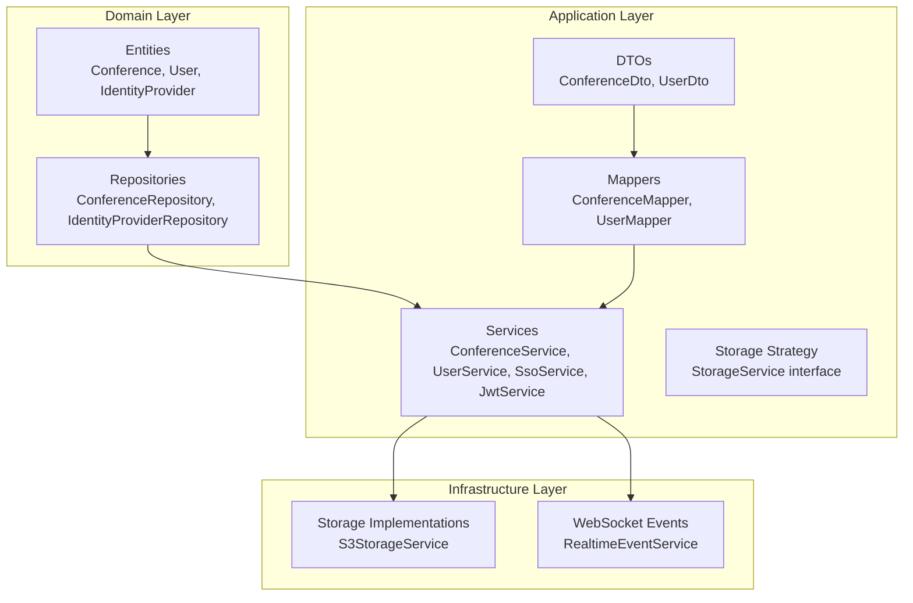
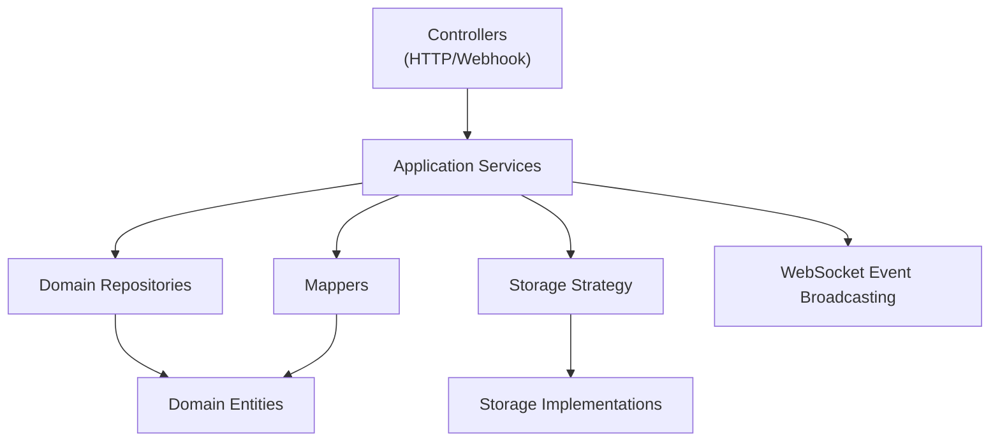
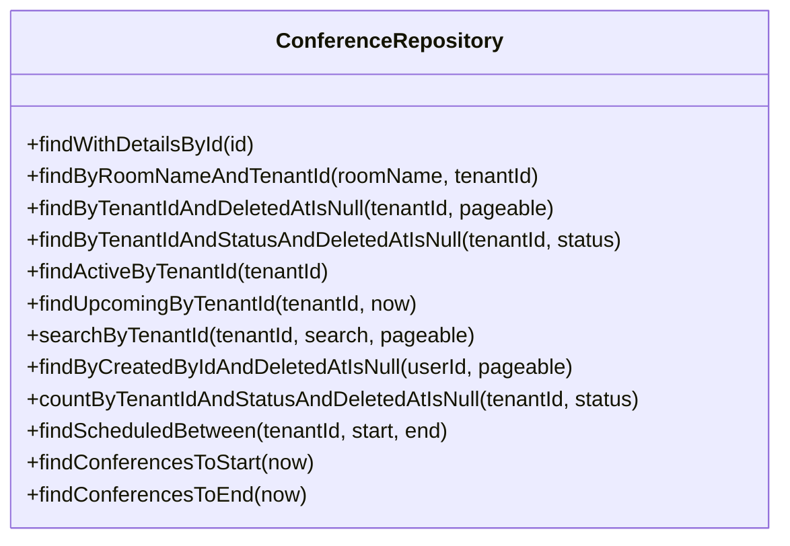
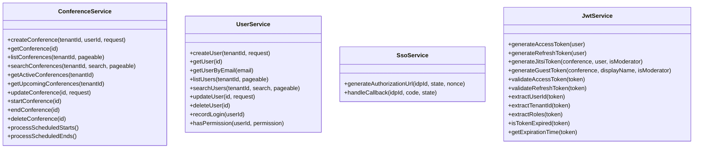
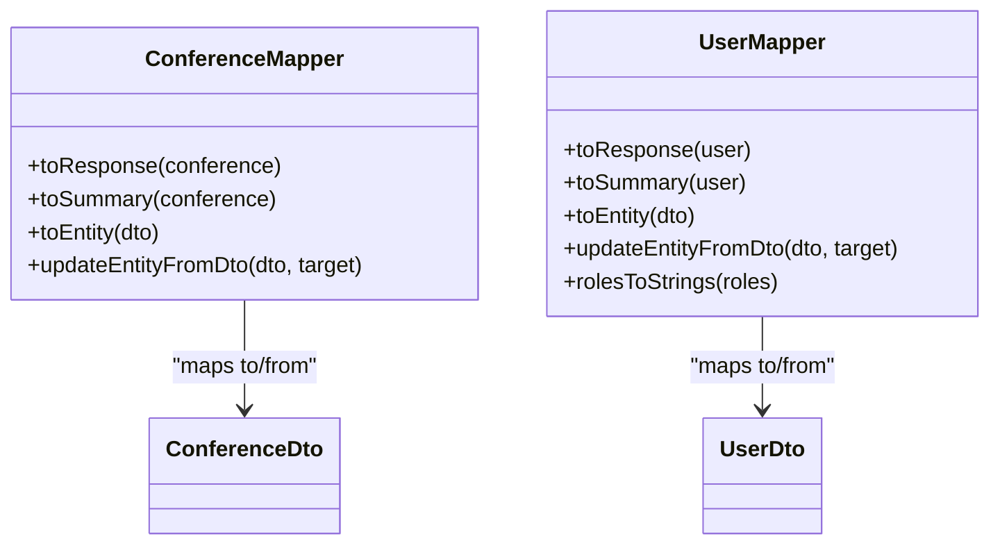
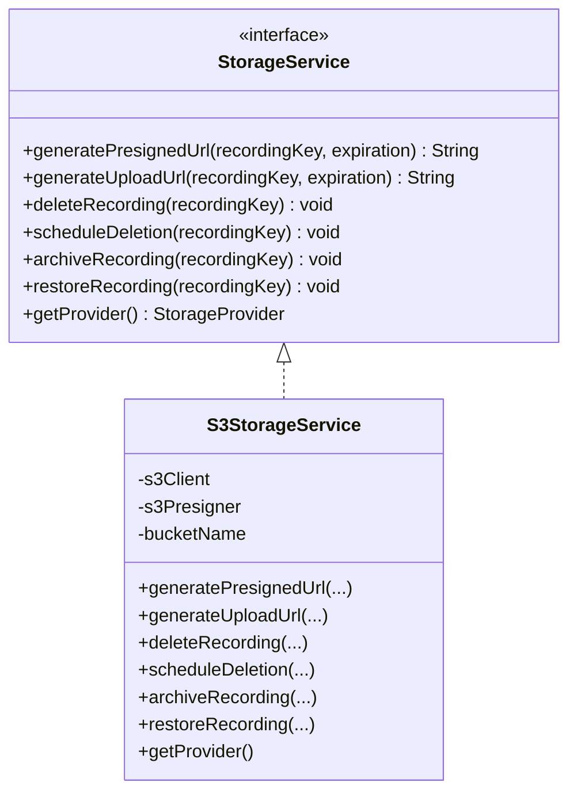
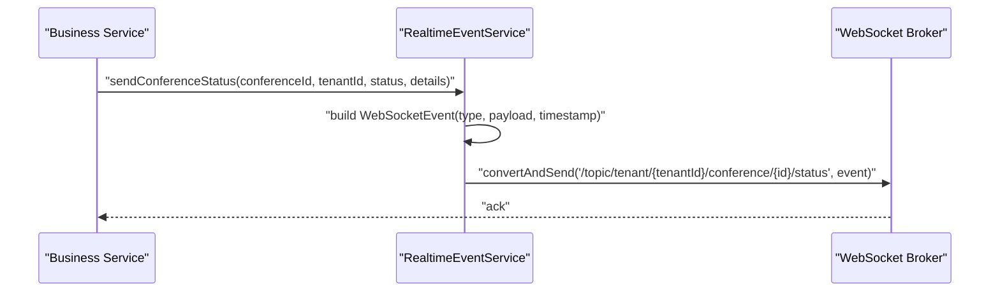
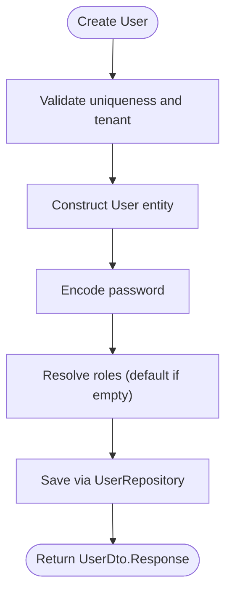
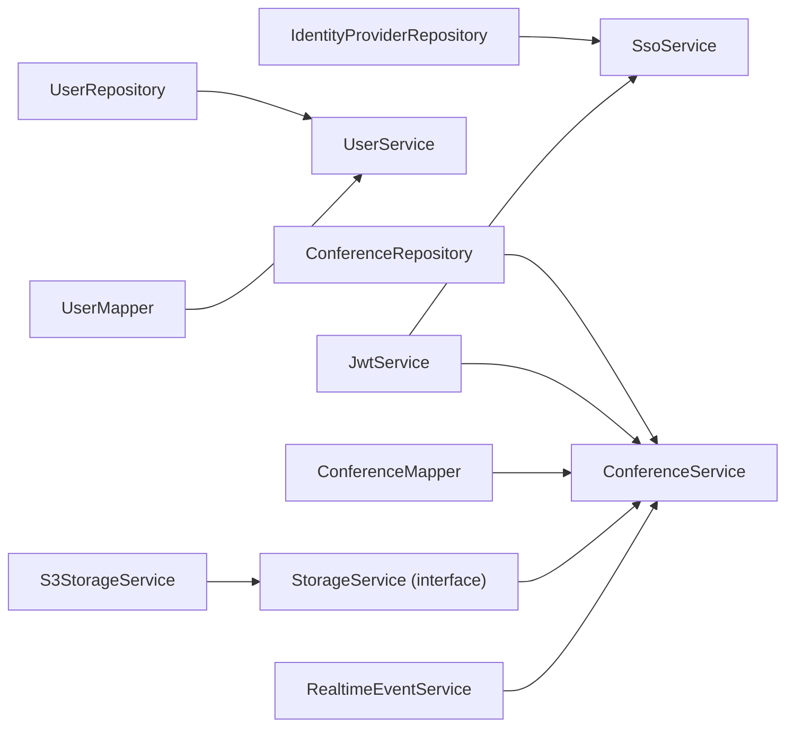

# Design Patterns Implementation

<cite>
**Referenced Files in This Document**
- [ConferenceRepository.java](file://jmp-domain/src/main/java/com/jmp/domain/repository/ConferenceRepository.java)
- [ConferenceService.java](file://jmp-application/src/main/java/com/jmp/application/service/ConferenceService.java)
- [ConferenceMapper.java](file://jmp-application/src/main/java/com/jmp/application/mapper/ConferenceMapper.java)
- [ConferenceDto.java](file://jmp-application/src/main/java/com/jmp/application/dto/ConferenceDto.java)
- [StorageService.java](file://jmp-application/src/main/java/com/jmp/application/service/StorageService.java)
- [S3StorageService.java](file://jmp-infrastructure/src/main/java/com/jmp/infrastructure/storage/S3StorageService.java)
- [RealtimeEventService.java](file://jmp-infrastructure/src/main/java/com/jmp/infrastructure/websocket/RealtimeEventService.java)
- [IdentityProvider.java](file://jmp-domain/src/main/java/com/jmp/domain/entity/IdentityProvider.java)
- [IdentityProviderRepository.java](file://jmp-domain/src/main/java/com/jmp/domain/repository/IdentityProviderRepository.java)
- [SsoService.java](file://jmp-application/src/main/java/com/jmp/application/service/SsoService.java)
- [JwtService.java](file://jmp-application/src/main/java/com/jmp/application/service/JwtService.java)
- [UserService.java](file://jmp-application/src/main/java/com/jmp/application/service/UserService.java)
- [UserMapper.java](file://jmp-application/src/main/java/com/jmp/application/mapper/UserMapper.java)
- [UserDto.java](file://jmp-application/src/main/java/com/jmp/application/dto/UserDto.java)
</cite>

## Table of Contents
1. [Introduction](#introduction)
2. [Project Structure](#project-structure)
3. [Core Components](#core-components)
4. [Architecture Overview](#architecture-overview)
5. [Detailed Component Analysis](#detailed-component-analysis)
6. [Dependency Analysis](#dependency-analysis)
7. [Performance Considerations](#performance-considerations)
8. [Troubleshooting Guide](#troubleshooting-guide)
9. [Conclusion](#conclusion)

## Introduction
This document analyzes the design patterns implemented in the Jitsi Management Platform (JMP). It focuses on four primary patterns:
- Repository pattern for data access abstraction
- Service Layer pattern for encapsulating business logic
- Mapper pattern for converting between DTOs and domain entities
- Strategy pattern for pluggable storage providers

Additionally, it documents:
- Observer pattern implementation in the real-time event broadcasting system
- Factory-like usage in entity creation and validation logic

The goal is to explain how each pattern addresses specific architectural challenges and improves code organization, with concrete references to actual implementation files.

## Project Structure
The project follows a layered architecture:
- Domain layer defines entities and repositories
- Application layer implements services and mappers
- Infrastructure layer provides storage and WebSocket event broadcasting
- Web/API layer exposes controllers and configuration

**Diagram sources**
- [ConferenceRepository.java:21-109](file://jmp-domain/src/main/java/com/jmp/domain/repository/ConferenceRepository.java#L21-L109)
- [IdentityProviderRepository.java:15-36](file://jmp-domain/src/main/java/com/jmp/domain/repository/IdentityProviderRepository.java#L15-L36)
- [ConferenceService.java:29-34](file://jmp-application/src/main/java/com/jmp/application/service/ConferenceService.java#L29-L34)
- [UserService.java:32-38](file://jmp-application/src/main/java/com/jmp/application/service/UserService.java#L32-L38)
- [SsoService.java:35-42](file://jmp-application/src/main/java/com/jmp/application/service/SsoService.java#L35-L42)
- [JwtService.java:27-43](file://jmp-application/src/main/java/com/jmp/application/service/JwtService.java#L27-L43)
- [ConferenceMapper.java:19-74](file://jmp-application/src/main/java/com/jmp/application/mapper/ConferenceMapper.java#L19-L74)
- [UserMapper.java:22-75](file://jmp-application/src/main/java/com/jmp/application/mapper/UserMapper.java#L22-L75)
- [ConferenceDto.java:15-176](file://jmp-application/src/main/java/com/jmp/application/dto/ConferenceDto.java#L15-L176)
- [UserDto.java:14-97](file://jmp-application/src/main/java/com/jmp/application/dto/UserDto.java#L14-L97)
- [StorageService.java:9-55](file://jmp-application/src/main/java/com/jmp/application/service/StorageService.java#L9-L55)
- [S3StorageService.java:26-128](file://jmp-infrastructure/src/main/java/com/jmp/infrastructure/storage/S3StorageService.java#L26-L128)
- [RealtimeEventService.java:20-141](file://jmp-infrastructure/src/main/java/com/jmp/infrastructure/websocket/RealtimeEventService.java#L20-L141)

**Section sources**
- [ConferenceRepository.java:16-109](file://jmp-domain/src/main/java/com/jmp/domain/repository/ConferenceRepository.java#L16-L109)
- [ConferenceService.java:21-225](file://jmp-application/src/main/java/com/jmp/application/service/ConferenceService.java#L21-L225)
- [ConferenceMapper.java:11-75](file://jmp-application/src/main/java/com/jmp/application/mapper/ConferenceMapper.java#L11-L75)
- [ConferenceDto.java:11-176](file://jmp-application/src/main/java/com/jmp/application/dto/ConferenceDto.java#L11-L176)
- [StorageService.java:5-55](file://jmp-application/src/main/java/com/jmp/application/service/StorageService.java#L5-L55)
- [S3StorageService.java:20-129](file://jmp-infrastructure/src/main/java/com/jmp/infrastructure/storage/S3StorageService.java#L20-L129)
- [RealtimeEventService.java:13-142](file://jmp-infrastructure/src/main/java/com/jmp/infrastructure/websocket/RealtimeEventService.java#L13-L142)
- [IdentityProvider.java:19-158](file://jmp-domain/src/main/java/com/jmp/domain/entity/IdentityProvider.java#L19-L158)
- [IdentityProviderRepository.java:10-36](file://jmp-domain/src/main/java/com/jmp/domain/repository/IdentityProviderRepository.java#L10-L36)
- [SsoService.java:28-244](file://jmp-application/src/main/java/com/jmp/application/service/SsoService.java#L28-L244)
- [JwtService.java:21-236](file://jmp-application/src/main/java/com/jmp/application/service/JwtService.java#L21-L236)
- [UserService.java:24-190](file://jmp-application/src/main/java/com/jmp/application/service/UserService.java#L24-L190)
- [UserMapper.java:14-76](file://jmp-application/src/main/java/com/jmp/application/mapper/UserMapper.java#L14-L76)
- [UserDto.java:10-97](file://jmp-application/src/main/java/com/jmp/application/dto/UserDto.java#L10-L97)

## Core Components
This section outlines the core components and how they implement the design patterns.

- Repository pattern
  - Domain repositories define typed contracts for data access and queries.
  - Example: [ConferenceRepository:21-109](file://jmp-domain/src/main/java/com/jmp/domain/repository/ConferenceRepository.java#L21-L109) and [IdentityProviderRepository:15-36](file://jmp-domain/src/main/java/com/jmp/domain/repository/IdentityProviderRepository.java#L15-L36).
  - Benefits: Encapsulates persistence logic, supports pagination and complex queries, and decouples services from persistence frameworks.

- Service Layer pattern
  - Services orchestrate business logic, coordinate repositories, and enforce invariants.
  - Examples: [ConferenceService:29-225](file://jmp-application/src/main/java/com/jmp/application/service/ConferenceService.java#L29-L225), [UserService:32-190](file://jmp-application/src/main/java/com/jmp/application/service/UserService.java#L32-L190), [SsoService:35-244](file://jmp-application/src/main/java/com/jmp/application/service/SsoService.java#L35-L244), [JwtService:27-236](file://jmp-application/src/main/java/com/jmp/application/service/JwtService.java#L27-L236).
  - Benefits: Centralizes business rules, transaction boundaries, and cross-cutting concerns.

- Mapper pattern
  - Mappers convert between domain entities and application DTOs using MapStruct.
  - Examples: [ConferenceMapper:19-74](file://jmp-application/src/main/java/com/jmp/application/mapper/ConferenceMapper.java#L19-L74), [UserMapper:22-75](file://jmp-application/src/main/java/com/jmp/application/mapper/UserMapper.java#L22-L75).
  - Benefits: Keeps DTOs and entities decoupled, reduces boilerplate, and enforces projection mapping.

- Strategy pattern (Storage)
  - The [StorageService:9-55](file://jmp-application/src/main/java/com/jmp/application/service/StorageService.java#L9-L55) interface defines a contract for storage operations, with [S3StorageService:26-128](file://jmp-infrastructure/src/main/java/com/jmp/infrastructure/storage/S3StorageService.java#L26-L128) as an implementation.
  - Benefits: Enables pluggable storage providers and easy extension to Azure Blob, Google Cloud Storage, etc.

- Observer pattern (Real-time events)
  - The [RealtimeEventService:20-141](file://jmp-infrastructure/src/main/java/com/jmp/infrastructure/websocket/RealtimeEventService.java#L20-L141) broadcasts events to tenants and users via WebSocket destinations.
  - Benefits: Decouples event producers from consumers and supports scalable real-time updates.

- Factory-like usage (entity creation and validation)
  - Services construct domain entities and validate inputs before persisting.
  - Examples: [UserService.createUser:44-70](file://jmp-application/src/main/java/com/jmp/application/service/UserService.java#L44-L70), [SsoService.provisionUser:195-215](file://jmp-application/src/main/java/com/jmp/application/service/SsoService.java#L195-L215).
  - Benefits: Centralizes creation logic and ensures consistent initialization.

**Section sources**
- [ConferenceRepository.java:16-109](file://jmp-domain/src/main/java/com/jmp/domain/repository/ConferenceRepository.java#L16-L109)
- [IdentityProviderRepository.java:10-36](file://jmp-domain/src/main/java/com/jmp/domain/repository/IdentityProviderRepository.java#L10-L36)
- [ConferenceService.java:21-225](file://jmp-application/src/main/java/com/jmp/application/service/ConferenceService.java#L21-L225)
- [UserService.java:24-190](file://jmp-application/src/main/java/com/jmp/application/service/UserService.java#L24-L190)
- [SsoService.java:28-244](file://jmp-application/src/main/java/com/jmp/application/service/SsoService.java#L28-L244)
- [JwtService.java:21-236](file://jmp-application/src/main/java/com/jmp/application/service/JwtService.java#L21-L236)
- [ConferenceMapper.java:11-75](file://jmp-application/src/main/java/com/jmp/application/mapper/ConferenceMapper.java#L11-L75)
- [UserMapper.java:14-76](file://jmp-application/src/main/java/com/jmp/application/mapper/UserMapper.java#L14-L76)
- [StorageService.java:5-55](file://jmp-application/src/main/java/com/jmp/application/service/StorageService.java#L5-L55)
- [S3StorageService.java:20-129](file://jmp-infrastructure/src/main/java/com/jmp/infrastructure/storage/S3StorageService.java#L20-L129)
- [RealtimeEventService.java:13-142](file://jmp-infrastructure/src/main/java/com/jmp/infrastructure/websocket/RealtimeEventService.java#L13-L142)

## Architecture Overview
The system architecture separates concerns across layers and uses well-defined interfaces to enable extensibility and maintainability.

**Diagram sources**
- [ConferenceService.java:29-34](file://jmp-application/src/main/java/com/jmp/application/service/ConferenceService.java#L29-L34)
- [UserService.java:32-38](file://jmp-application/src/main/java/com/jmp/application/service/UserService.java#L32-L38)
- [SsoService.java:35-42](file://jmp-application/src/main/java/com/jmp/application/service/SsoService.java#L35-L42)
- [JwtService.java:27-43](file://jmp-application/src/main/java/com/jmp/application/service/JwtService.java#L27-L43)
- [ConferenceRepository.java:21-109](file://jmp-domain/src/main/java/com/jmp/domain/repository/ConferenceRepository.java#L21-L109)
- [IdentityProviderRepository.java:15-36](file://jmp-domain/src/main/java/com/jmp/domain/repository/IdentityProviderRepository.java#L15-L36)
- [ConferenceMapper.java:19-74](file://jmp-application/src/main/java/com/jmp/application/mapper/ConferenceMapper.java#L19-L74)
- [UserMapper.java:22-75](file://jmp-application/src/main/java/com/jmp/application/mapper/UserMapper.java#L22-L75)
- [StorageService.java:9-55](file://jmp-application/src/main/java/com/jmp/application/service/StorageService.java#L9-L55)
- [S3StorageService.java:26-128](file://jmp-infrastructure/src/main/java/com/jmp/infrastructure/storage/S3StorageService.java#L26-L128)
- [RealtimeEventService.java:20-141](file://jmp-infrastructure/src/main/java/com/jmp/infrastructure/websocket/RealtimeEventService.java#L20-L141)

## Detailed Component Analysis

### Repository Pattern: Data Access Abstraction
- Purpose: Define typed contracts for domain operations and encapsulate persistence logic.
- Evidence:
  - [ConferenceRepository:21-109](file://jmp-domain/src/main/java/com/jmp/domain/repository/ConferenceRepository.java#L21-L109) provides methods for finding conferences with details, paginated lists, status filters, and scheduled operations.
  - [IdentityProviderRepository:15-36](file://jmp-domain/src/main/java/com/jmp/domain/repository/IdentityProviderRepository.java#L15-L36) supports lookup by tenant and enabled state.
- Benefits:
  - Centralizes query logic and pagination.
  - Enforces strong typing and discoverability of supported operations.

**Diagram sources**
- [ConferenceRepository.java:21-109](file://jmp-domain/src/main/java/com/jmp/domain/repository/ConferenceRepository.java#L21-L109)

**Section sources**
- [ConferenceRepository.java:16-109](file://jmp-domain/src/main/java/com/jmp/domain/repository/ConferenceRepository.java#L16-L109)
- [IdentityProviderRepository.java:10-36](file://jmp-domain/src/main/java/com/jmp/domain/repository/IdentityProviderRepository.java#L10-L36)

### Service Layer Pattern: Business Logic Orchestration
- Purpose: Encapsulate business rules, coordinate repositories, and manage transactions.
- Evidence:
  - [ConferenceService:29-225](file://jmp-application/src/main/java/com/jmp/application/service/ConferenceService.java#L29-L225) manages conference lifecycle, validations, and scheduled operations.
  - [UserService:32-190](file://jmp-application/src/main/java/com/jmp/application/service/UserService.java#L32-L190) handles user creation, role assignment, and permissions.
  - [SsoService:35-244](file://jmp-application/src/main/java/com/jmp/application/service/SsoService.java#L35-L244) orchestrates OIDC/OAuth flows and user provisioning.
  - [JwtService:27-236](file://jmp-application/src/main/java/com/jmp/application/service/JwtService.java#L27-L236) generates and validates tokens for platform and Jitsi integrations.
- Benefits:
  - Single responsibility per service.
  - Clear transaction boundaries and error handling.

**Diagram sources**
- [ConferenceService.java:29-225](file://jmp-application/src/main/java/com/jmp/application/service/ConferenceService.java#L29-L225)
- [UserService.java:32-190](file://jmp-application/src/main/java/com/jmp/application/service/UserService.java#L32-L190)
- [SsoService.java:35-244](file://jmp-application/src/main/java/com/jmp/application/service/SsoService.java#L35-L244)
- [JwtService.java:27-236](file://jmp-application/src/main/java/com/jmp/application/service/JwtService.java#L27-L236)

**Section sources**
- [ConferenceService.java:21-225](file://jmp-application/src/main/java/com/jmp/application/service/ConferenceService.java#L21-L225)
- [UserService.java:24-190](file://jmp-application/src/main/java/com/jmp/application/service/UserService.java#L24-L190)
- [SsoService.java:28-244](file://jmp-application/src/main/java/com/jmp/application/service/SsoService.java#L28-L244)
- [JwtService.java:21-236](file://jmp-application/src/main/java/com/jmp/application/service/JwtService.java#L21-L236)

### Mapper Pattern: DTO-to-Entity Conversion
- Purpose: Convert between domain entities and application DTOs with minimal boilerplate.
- Evidence:
  - [ConferenceMapper:19-74](file://jmp-application/src/main/java/com/jmp/application/mapper/ConferenceMapper.java#L19-L74) maps to response, summary, and entity types with custom mappings.
  - [UserMapper:22-75](file://jmp-application/src/main/java/com/jmp/application/mapper/UserMapper.java#L22-L75) handles user projections and role name mapping.
  - DTOs defined in [ConferenceDto:15-176](file://jmp-application/src/main/java/com/jmp/application/dto/ConferenceDto.java#L15-L176) and [UserDto:14-97](file://jmp-application/src/main/java/com/jmp/application/dto/UserDto.java#L14-L97).
- Benefits:
  - Decouples API contracts from domain models.
  - Reduces manual mapping and improves maintainability.

**Diagram sources**
- [ConferenceMapper.java:19-74](file://jmp-application/src/main/java/com/jmp/application/mapper/ConferenceMapper.java#L19-L74)
- [UserMapper.java:22-75](file://jmp-application/src/main/java/com/jmp/application/mapper/UserMapper.java#L22-L75)
- [ConferenceDto.java:15-176](file://jmp-application/src/main/java/com/jmp/application/dto/ConferenceDto.java#L15-L176)
- [UserDto.java:14-97](file://jmp-application/src/main/java/com/jmp/application/dto/UserDto.java#L14-L97)

**Section sources**
- [ConferenceMapper.java:11-75](file://jmp-application/src/main/java/com/jmp/application/mapper/ConferenceMapper.java#L11-L75)
- [UserMapper.java:14-76](file://jmp-application/src/main/java/com/jmp/application/mapper/UserMapper.java#L14-L76)
- [ConferenceDto.java:11-176](file://jmp-application/src/main/java/com/jmp/application/dto/ConferenceDto.java#L11-L176)
- [UserDto.java:10-97](file://jmp-application/src/main/java/com/jmp/application/dto/UserDto.java#L10-L97)

### Strategy Pattern: Pluggable Storage Providers
- Purpose: Allow switching storage implementations without changing application logic.
- Evidence:
  - Interface: [StorageService:9-55](file://jmp-application/src/main/java/com/jmp/application/service/StorageService.java#L9-L55) defines operations for presigned URLs, uploads, deletes, archiving, and restoration.
  - Implementation: [S3StorageService:26-128](file://jmp-infrastructure/src/main/java/com/jmp/infrastructure/storage/S3StorageService.java#L26-L128) implements the interface and supports MinIO compatibility.
- Benefits:
  - Enables multi-cloud and local development flexibility.
  - Simplifies testing with mock providers.

**Diagram sources**
- [StorageService.java:9-55](file://jmp-application/src/main/java/com/jmp/application/service/StorageService.java#L9-L55)
- [S3StorageService.java:26-128](file://jmp-infrastructure/src/main/java/com/jmp/infrastructure/storage/S3StorageService.java#L26-L128)

**Section sources**
- [StorageService.java:5-55](file://jmp-application/src/main/java/com/jmp/application/service/StorageService.java#L5-L55)
- [S3StorageService.java:20-129](file://jmp-infrastructure/src/main/java/com/jmp/infrastructure/storage/S3StorageService.java#L20-L129)

### Observer Pattern: Real-Time Event Broadcasting
- Purpose: Broadcast events to tenants and users via WebSocket without tightly coupling producers and consumers.
- Evidence:
  - [RealtimeEventService:20-141](file://jmp-infrastructure/src/main/java/com/jmp/infrastructure/websocket/RealtimeEventService.java#L20-L141) sends events to tenant-specific topics, user queues, and broadcasts.
  - Events are wrapped in [WebSocketEvent:106-110](file://jmp-infrastructure/src/main/java/com/jmp/infrastructure/websocket/RealtimeEventService.java#L106-L110) and specialized records for status and notifications.
- Benefits:
  - Scalable, low-latency communication.
  - Clean separation between business logic and real-time delivery.

**Diagram sources**
- [RealtimeEventService.java:44-52](file://jmp-infrastructure/src/main/java/com/jmp/infrastructure/websocket/RealtimeEventService.java#L44-L52)

**Section sources**
- [RealtimeEventService.java:13-142](file://jmp-infrastructure/src/main/java/com/jmp/infrastructure/websocket/RealtimeEventService.java#L13-L142)

### Factory Pattern: Entity Creation and Validation
- Purpose: Centralize entity construction and validation logic to ensure consistent initialization.
- Evidence:
  - [UserService.createUser:44-70](file://jmp-application/src/main/java/com/jmp/application/service/UserService.java#L44-L70) constructs users, encodes passwords, assigns roles, and sets defaults.
  - [SsoService.provisionUser:195-215](file://jmp-application/src/main/java/com/jmp/application/service/SsoService.java#L195-L215) creates users from SSO attributes and assigns default roles.
  - [JwtService.generateJitsiToken:94-126](file://jmp-application/src/main/java/com/jmp/application/service/JwtService.java#L94-L126) builds claims for Jitsi tokens with contextual features.
- Benefits:
  - Ensures invariants and defaults are applied consistently.
  - Reduces duplication across services.

**Diagram sources**
- [UserService.java:44-70](file://jmp-application/src/main/java/com/jmp/application/service/UserService.java#L44-L70)

**Section sources**
- [UserService.java:24-190](file://jmp-application/src/main/java/com/jmp/application/service/UserService.java#L24-L190)
- [SsoService.java:28-244](file://jmp-application/src/main/java/com/jmp/application/service/SsoService.java#L28-L244)
- [JwtService.java:21-236](file://jmp-application/src/main/java/com/jmp/application/service/JwtService.java#L21-L236)

## Dependency Analysis
This section analyzes dependencies among components and highlights how patterns reduce coupling.

**Diagram sources**
- [ConferenceRepository.java:21-109](file://jmp-domain/src/main/java/com/jmp/domain/repository/ConferenceRepository.java#L21-L109)
- [ConferenceService.java:29-34](file://jmp-application/src/main/java/com/jmp/application/service/ConferenceService.java#L29-L34)
- [UserService.java:32-38](file://jmp-application/src/main/java/com/jmp/application/service/UserService.java#L32-L38)
- [IdentityProviderRepository.java:15-36](file://jmp-domain/src/main/java/com/jmp/domain/repository/IdentityProviderRepository.java#L15-L36)
- [SsoService.java:35-42](file://jmp-application/src/main/java/com/jmp/application/service/SsoService.java#L35-L42)
- [JwtService.java:27-43](file://jmp-application/src/main/java/com/jmp/application/service/JwtService.java#L27-L43)
- [ConferenceMapper.java:19-25](file://jmp-application/src/main/java/com/jmp/application/mapper/ConferenceMapper.java#L19-L25)
- [UserMapper.java:22-29](file://jmp-application/src/main/java/com/jmp/application/mapper/UserMapper.java#L22-L29)
- [StorageService.java:9-55](file://jmp-application/src/main/java/com/jmp/application/service/StorageService.java#L9-L55)
- [S3StorageService.java:26-128](file://jmp-infrastructure/src/main/java/com/jmp/infrastructure/storage/S3StorageService.java#L26-L128)
- [RealtimeEventService.java:20-141](file://jmp-infrastructure/src/main/java/com/jmp/infrastructure/websocket/RealtimeEventService.java#L20-L141)

**Section sources**
- [ConferenceService.java:21-225](file://jmp-application/src/main/java/com/jmp/application/service/ConferenceService.java#L21-L225)
- [UserService.java:24-190](file://jmp-application/src/main/java/com/jmp/application/service/UserService.java#L24-L190)
- [SsoService.java:28-244](file://jmp-application/src/main/java/com/jmp/application/service/SsoService.java#L28-L244)
- [JwtService.java:21-236](file://jmp-application/src/main/java/com/jmp/application/service/JwtService.java#L21-L236)
- [ConferenceMapper.java:11-75](file://jmp-application/src/main/java/com/jmp/application/mapper/ConferenceMapper.java#L11-L75)
- [UserMapper.java:14-76](file://jmp-application/src/main/java/com/jmp/application/mapper/UserMapper.java#L14-L76)
- [StorageService.java:5-55](file://jmp-application/src/main/java/com/jmp/application/service/StorageService.java#L5-L55)
- [S3StorageService.java:20-129](file://jmp-infrastructure/src/main/java/com/jmp/infrastructure/storage/S3StorageService.java#L20-L129)
- [RealtimeEventService.java:13-142](file://jmp-infrastructure/src/main/java/com/jmp/infrastructure/websocket/RealtimeEventService.java#L13-L142)

## Performance Considerations
- Repository queries:
  - Use pagination-aware methods to avoid loading large datasets.
  - Prefer entity graphs for eager loading related associations only when necessary.
- Mapper efficiency:
  - Map only required fields to DTOs to minimize serialization overhead.
- Storage strategy:
  - Choose appropriate pre-signed URL lifetimes to balance security and usability.
- Real-time events:
  - Keep payloads small and avoid unnecessary broadcasts to reduce bandwidth.

## Troubleshooting Guide
- Repository errors:
  - Missing tenant or user: thrown when entities are not found by ID.
  - Uniqueness violations: thrown when room name or email already exists.
- Service validation:
  - Conference state transitions: ensure status checks before start/end/delete.
  - SSO callback failures: verify authorization endpoints and attribute mappings.
- Mapper mapping issues:
  - Ensure all required fields are mapped and optional fields ignored appropriately.
- Storage provider configuration:
  - Verify bucket name, region, and credentials; check endpoint override for MinIO.

**Section sources**
- [ConferenceService.java:40-65](file://jmp-application/src/main/java/com/jmp/application/service/ConferenceService.java#L40-L65)
- [UserService.java:44-70](file://jmp-application/src/main/java/com/jmp/application/service/UserService.java#L44-L70)
- [SsoService.java:69-131](file://jmp-application/src/main/java/com/jmp/application/service/SsoService.java#L69-L131)
- [ConferenceMapper.java:19-74](file://jmp-application/src/main/java/com/jmp/application/mapper/ConferenceMapper.java#L19-L74)
- [UserMapper.java:22-75](file://jmp-application/src/main/java/com/jmp/application/mapper/UserMapper.java#L22-L75)
- [S3StorageService.java:32-59](file://jmp-infrastructure/src/main/java/com/jmp/infrastructure/storage/S3StorageService.java#L32-L59)

## Conclusion
The Jitsi Management Platform demonstrates robust application of design patterns:
- Repository and Service Layer patterns provide clean separation of concerns and encapsulation of business logic.
- Mapper pattern ensures DTOs remain decoupled from domain entities.
- Strategy pattern enables pluggable storage providers for flexibility.
- Observer pattern powers real-time event broadcasting.
- Factory-like usage centralizes entity creation and validation.

These patterns collectively improve maintainability, testability, and scalability while keeping the codebase organized and aligned with domain-driven design principles.