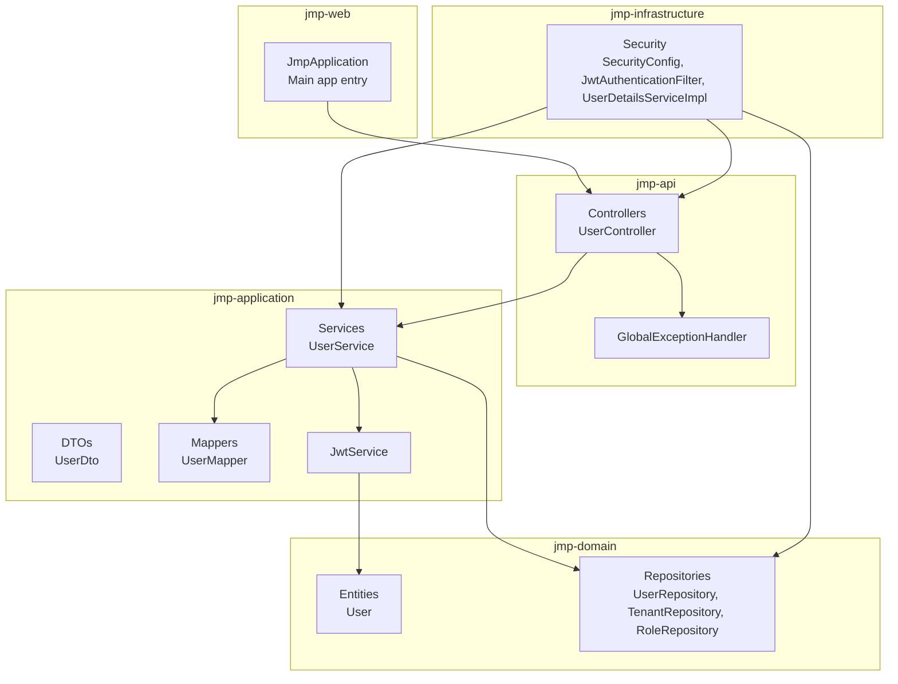
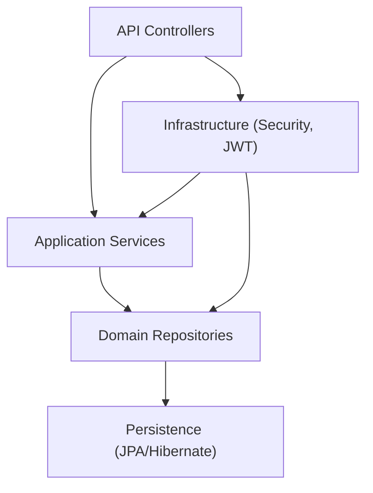
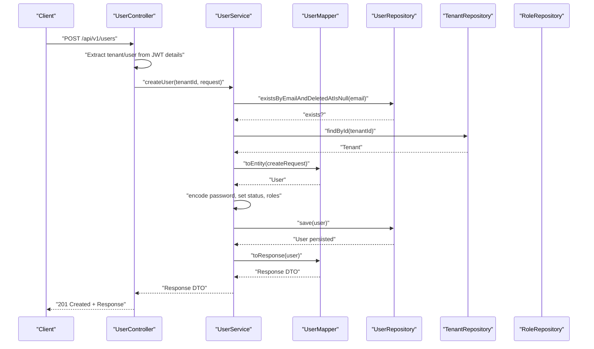
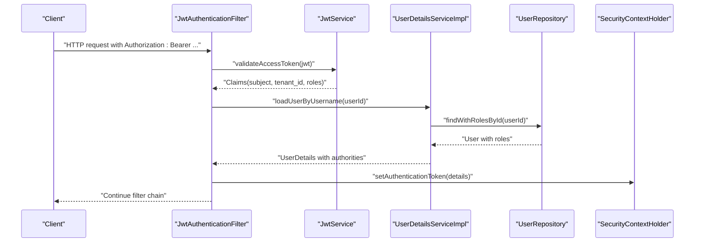
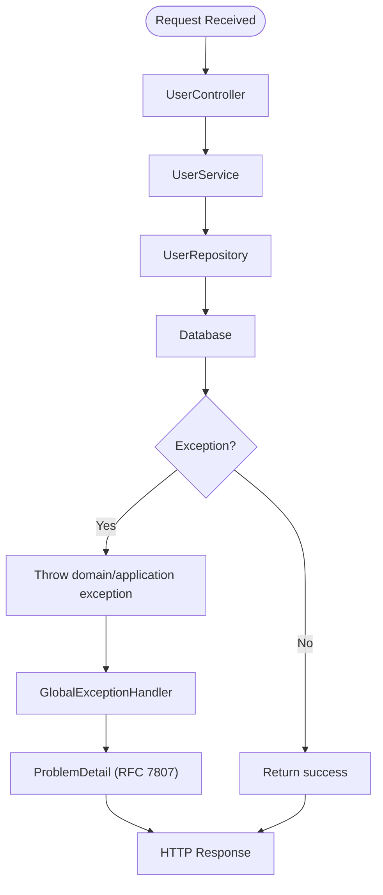
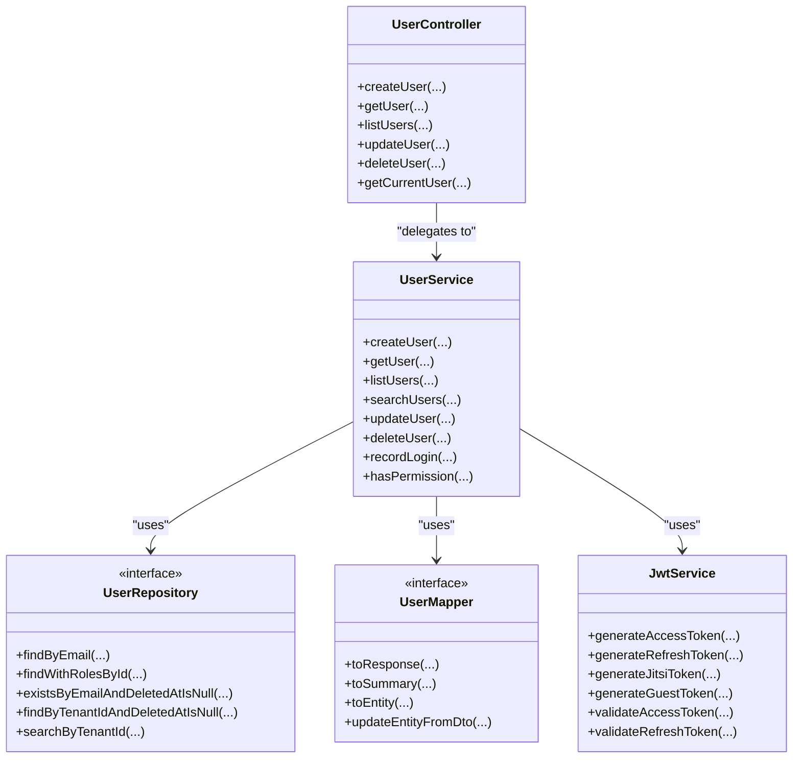
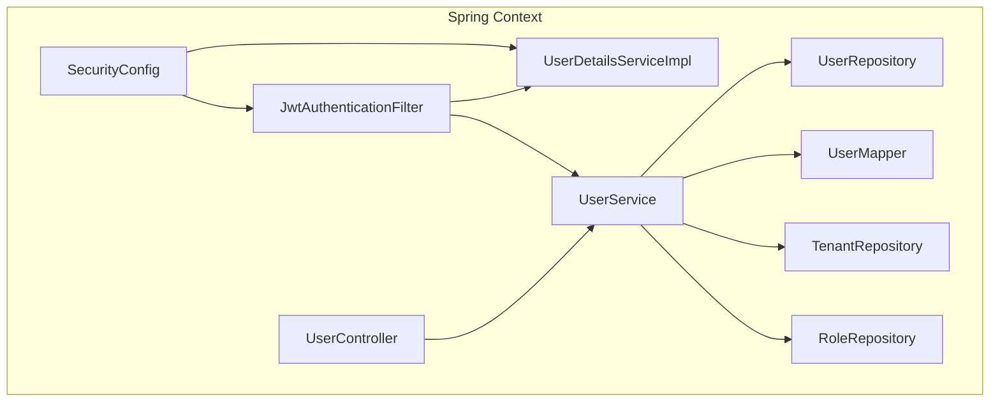
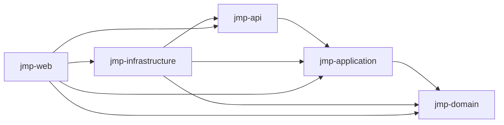

# Module Interaction Patterns

<cite>
**Referenced Files in This Document**
- [pom.xml](file://pom.xml)
- [JmpApplication.java](file://jmp-web/src/main/java/com/jmp/web/JmpApplication.java)
- [UserController.java](file://jmp-api/src/main/java/com/jmp/api/controller/UserController.java)
- [UserService.java](file://jmp-application/src/main/java/com/jmp/application/service/UserService.java)
- [UserRepository.java](file://jmp-domain/src/main/java/com/jmp/domain/repository/UserRepository.java)
- [UserDetailsServiceImpl.java](file://jmp-infrastructure/src/main/java/com/jmp/infrastructure/security/UserDetailsServiceImpl.java)
- [SecurityConfig.java](file://jmp-infrastructure/src/main/java/com/jmp/infrastructure/security/SecurityConfig.java)
- [JwtAuthenticationFilter.java](file://jmp-infrastructure/src/main/java/com/jmp/infrastructure/security/JwtAuthenticationFilter.java)
- [JwtService.java](file://jmp-application/src/main/java/com/jmp/application/service/JwtService.java)
- [UserDto.java](file://jmp-application/src/main/java/com/jmp/application/dto/UserDto.java)
- [UserMapper.java](file://jmp-application/src/main/java/com/jmp/application/mapper/UserMapper.java)
- [User.java](file://jmp-domain/src/main/java/com/jmp/domain/entity/User.java)
- [TenantRepository.java](file://jmp-domain/src/main/java/com/jmp/domain/repository/TenantRepository.java)
- [RoleRepository.java](file://jmp-domain/src/main/java/com/jmp/domain/repository/RoleRepository.java)
- [GlobalExceptionHandler.java](file://jmp-api/src/main/java/com/jmp/api/advice/GlobalExceptionHandler.java)
</cite>

## Table of Contents
1. [Introduction](#introduction)
2. [Project Structure](#project-structure)
3. [Core Components](#core-components)
4. [Architecture Overview](#architecture-overview)
5. [Detailed Component Analysis](#detailed-component-analysis)
6. [Dependency Analysis](#dependency-analysis)
7. [Performance Considerations](#performance-considerations)
8. [Troubleshooting Guide](#troubleshooting-guide)
9. [Conclusion](#conclusion)

## Introduction
This document explains the module interaction patterns within the Jitsi Management Platform (JMP). It focuses on how requests flow from API controllers through application services to domain repositories and infrastructure implementations, how interfaces and contracts define interactions, how dependency injection is configured, and how errors propagate across module boundaries. It also highlights the role of interfaces in enabling test doubles and maintaining clear module boundaries.

## Project Structure
JMP is organized as a multi-module Maven project with five primary modules:
- jmp-domain: Domain entities, value objects, and repositories
- jmp-application: Application services, use cases, DTOs, and mappers
- jmp-infrastructure: Security, persistence, messaging, and infrastructure integrations
- jmp-api: REST controllers and global exception handling
- jmp-web: Spring Boot application entry point and configuration

**Diagram sources**
- [pom.xml:40-46](file://pom.xml#L40-L46)
- [JmpApplication.java:15-26](file://jmp-web/src/main/java/com/jmp/web/JmpApplication.java#L15-L26)
- [UserController.java:39-122](file://jmp-api/src/main/java/com/jmp/api/controller/UserController.java#L39-L122)
- [UserService.java:32-189](file://jmp-application/src/main/java/com/jmp/application/service/UserService.java#L32-L189)
- [UserRepository.java:18-81](file://jmp-domain/src/main/java/com/jmp/domain/repository/UserRepository.java#L18-L81)
- [UserDetailsServiceImpl.java:19-47](file://jmp-infrastructure/src/main/java/com/jmp/infrastructure/security/UserDetailsServiceImpl.java#L19-L47)
- [SecurityConfig.java:28-89](file://jmp-infrastructure/src/main/java/com/jmp/infrastructure/security/SecurityConfig.java#L28-L89)
- [JwtAuthenticationFilter.java:27-121](file://jmp-infrastructure/src/main/java/com/jmp/infrastructure/security/JwtAuthenticationFilter.java#L27-L121)
- [JwtService.java:25-235](file://jmp-application/src/main/java/com/jmp/application/service/JwtService.java#L25-L235)
- [UserDto.java:14-96](file://jmp-application/src/main/java/com/jmp/application/dto/UserDto.java#L14-L96)
- [UserMapper.java:18-75](file://jmp-application/src/main/java/com/jmp/application/mapper/UserMapper.java#L18-L75)
- [User.java:23-163](file://jmp-domain/src/main/java/com/jmp/domain/entity/User.java#L23-L163)
- [TenantRepository.java:17-63](file://jmp-domain/src/main/java/com/jmp/domain/repository/TenantRepository.java#L17-L63)
- [RoleRepository.java:13-19](file://jmp-domain/src/main/java/com/jmp/domain/repository/RoleRepository.java#L13-L19)
- [GlobalExceptionHandler.java:22-129](file://jmp-api/src/main/java/com/jmp/api/advice/GlobalExceptionHandler.java#L22-L129)

**Section sources**
- [pom.xml:40-46](file://pom.xml#L40-L46)
- [JmpApplication.java:15-26](file://jmp-web/src/main/java/com/jmp/web/JmpApplication.java#L15-L26)

## Core Components
- API Layer: REST controllers expose endpoints and delegate to application services. Controllers enforce authorization and extract tenant/user IDs from authenticated contexts.
- Application Layer: Services encapsulate business logic, orchestrate repository operations, and coordinate DTOs and mappers. They are transactional where needed and depend on repositories and mappers.
- Domain Layer: Entities and repositories define the persistent model and query abstractions. Repositories extend Spring Data JPA interfaces and declare queries.
- Infrastructure Layer: Security configuration, filters, and user details service integrate with Spring Security and JWT processing. JWT service generates and validates tokens with claims for tenant, roles, and user context.
- Exception Handling: A global exception handler converts exceptions into structured Problem Details responses.

**Section sources**
- [UserController.java:39-122](file://jmp-api/src/main/java/com/jmp/api/controller/UserController.java#L39-L122)
- [UserService.java:32-189](file://jmp-application/src/main/java/com/jmp/application/service/UserService.java#L32-L189)
- [UserRepository.java:18-81](file://jmp-domain/src/main/java/com/jmp/domain/repository/UserRepository.java#L18-L81)
- [UserDetailsServiceImpl.java:19-47](file://jmp-infrastructure/src/main/java/com/jmp/infrastructure/security/UserDetailsServiceImpl.java#L19-L47)
- [JwtAuthenticationFilter.java:27-121](file://jmp-infrastructure/src/main/java/com/jmp/infrastructure/security/JwtAuthenticationFilter.java#L27-L121)
- [JwtService.java:25-235](file://jmp-application/src/main/java/com/jmp/application/service/JwtService.java#L25-L235)
- [GlobalExceptionHandler.java:22-129](file://jmp-api/src/main/java/com/jmp/api/advice/GlobalExceptionHandler.java#L22-L129)

## Architecture Overview
The system follows clean architecture principles:
- API controllers depend on application services via interfaces (abstractions)
- Application services depend on domain repositories via interfaces
- Domain entities and repositories are framework-agnostic
- Infrastructure provides cross-cutting concerns (security, persistence, messaging)

**Diagram sources**
- [UserController.java:39-122](file://jmp-api/src/main/java/com/jmp/api/controller/UserController.java#L39-L122)
- [UserService.java:32-189](file://jmp-application/src/main/java/com/jmp/application/service/UserService.java#L32-L189)
- [UserRepository.java:18-81](file://jmp-domain/src/main/java/com/jmp/domain/repository/UserRepository.java#L18-L81)
- [SecurityConfig.java:28-89](file://jmp-infrastructure/src/main/java/com/jmp/infrastructure/security/SecurityConfig.java#L28-L89)

## Detailed Component Analysis

### User Management Request Flow
This sequence illustrates a typical user creation request from controller to persistence and back.

**Diagram sources**
- [UserController.java:43-55](file://jmp-api/src/main/java/com/jmp/api/controller/UserController.java#L43-L55)
- [UserService.java:44-70](file://jmp-application/src/main/java/com/jmp/application/service/UserService.java#L44-L70)
- [UserMapper.java:46-64](file://jmp-application/src/main/java/com/jmp/application/mapper/UserMapper.java#L46-L64)
- [UserRepository.java:42](file://jmp-domain/src/main/java/com/jmp/domain/repository/UserRepository.java#L42)
- [TenantRepository.java:18](file://jmp-domain/src/main/java/com/jmp/domain/repository/TenantRepository.java#L18)
- [RoleRepository.java:14](file://jmp-domain/src/main/java/com/jmp/domain/repository/RoleRepository.java#L14)

**Section sources**
- [UserController.java:43-55](file://jmp-api/src/main/java/com/jmp/api/controller/UserController.java#L43-L55)
- [UserService.java:44-70](file://jmp-application/src/main/java/com/jmp/application/service/UserService.java#L44-L70)
- [UserMapper.java:46-64](file://jmp-application/src/main/java/com/jmp/application/mapper/UserMapper.java#L46-L64)
- [UserRepository.java:42](file://jmp-domain/src/main/java/com/jmp/domain/repository/UserRepository.java#L42)
- [TenantRepository.java:18](file://jmp-domain/src/main/java/com/jmp/domain/repository/TenantRepository.java#L18)
- [RoleRepository.java:14](file://jmp-domain/src/main/java/com/jmp/domain/repository/RoleRepository.java#L14)

### Authorization and Authentication Flow
This sequence shows how JWTs are validated and how tenant/user context is attached to the authentication details.

**Diagram sources**
- [JwtAuthenticationFilter.java:39-76](file://jmp-infrastructure/src/main/java/com/jmp/infrastructure/security/JwtAuthenticationFilter.java#L39-L76)
- [JwtService.java:165-171](file://jmp-application/src/main/java/com/jmp/application/service/JwtService.java#L165-L171)
- [UserDetailsServiceImpl.java:25-46](file://jmp-infrastructure/src/main/java/com/jmp/infrastructure/security/UserDetailsServiceImpl.java#L25-L46)
- [UserRepository.java:36](file://jmp-domain/src/main/java/com/jmp/domain/repository/UserRepository.java#L36)

**Section sources**
- [JwtAuthenticationFilter.java:39-76](file://jmp-infrastructure/src/main/java/com/jmp/infrastructure/security/JwtAuthenticationFilter.java#L39-L76)
- [JwtService.java:165-171](file://jmp-application/src/main/java/com/jmp/application/service/JwtService.java#L165-L171)
- [UserDetailsServiceImpl.java:25-46](file://jmp-infrastructure/src/main/java/com/jmp/infrastructure/security/UserDetailsServiceImpl.java#L25-L46)
- [UserRepository.java:36](file://jmp-domain/src/main/java/com/jmp/domain/repository/UserRepository.java#L36)

### Error Propagation Across Boundaries
Exceptions thrown in lower layers are translated into standardized Problem Details responses at the API boundary.

**Diagram sources**
- [GlobalExceptionHandler.java:22-129](file://jmp-api/src/main/java/com/jmp/api/advice/GlobalExceptionHandler.java#L22-L129)
- [UserService.java:49-51](file://jmp-application/src/main/java/com/jmp/application/service/UserService.java#L49-L51)
- [UserRepository.java:42](file://jmp-domain/src/main/java/com/jmp/domain/repository/UserRepository.java#L42)

**Section sources**
- [GlobalExceptionHandler.java:22-129](file://jmp-api/src/main/java/com/jmp/api/advice/GlobalExceptionHandler.java#L22-L129)
- [UserService.java:49-51](file://jmp-application/src/main/java/com/jmp/application/service/UserService.java#L49-L51)
- [UserRepository.java:42](file://jmp-domain/src/main/java/com/jmp/domain/repository/UserRepository.java#L42)

### Interfaces and Contracts
- Repository Abstractions: Domain repositories define method contracts for data access. Controllers and services depend on these interfaces, not concrete implementations.
- DTOs: Sealed interfaces and records define strict request/response shapes, ensuring contracts between API and application layers.
- Mappers: MapStruct interfaces decouple entity-to-DTO transformations from business logic.
- Security Contracts: SecurityConfig wires filters and providers; JwtAuthenticationFilter consumes JwtService and UserDetailsService.

**Diagram sources**
- [UserController.java:39-122](file://jmp-api/src/main/java/com/jmp/api/controller/UserController.java#L39-L122)
- [UserService.java:32-189](file://jmp-application/src/main/java/com/jmp/application/service/UserService.java#L32-L189)
- [UserRepository.java:18-81](file://jmp-domain/src/main/java/com/jmp/domain/repository/UserRepository.java#L18-L81)
- [UserMapper.java:18-75](file://jmp-application/src/main/java/com/jmp/application/mapper/UserMapper.java#L18-L75)
- [JwtService.java:25-235](file://jmp-application/src/main/java/com/jmp/application/service/JwtService.java#L25-L235)

**Section sources**
- [UserRepository.java:18-81](file://jmp-domain/src/main/java/com/jmp/domain/repository/UserRepository.java#L18-L81)
- [UserDto.java:14-96](file://jmp-application/src/main/java/com/jmp/application/dto/UserDto.java#L14-L96)
- [UserMapper.java:18-75](file://jmp-application/src/main/java/com/jmp/application/mapper/UserMapper.java#L18-L75)
- [JwtService.java:25-235](file://jmp-application/src/main/java/com/jmp/application/service/JwtService.java#L25-L235)

### Dependency Injection and Module Wiring
- Spring Boot auto-configuration scans base packages for components and repositories.
- Security beans are configured in SecurityConfig, injecting JwtAuthenticationFilter and UserDetailsService.
- JwtAuthenticationFilter depends on JwtService and UserDetailsService to authenticate requests.
- Application services are annotated as @Service and receive constructor-injected dependencies (repositories, mappers, encoders).
- Controllers are constructor-injected with application services.

**Diagram sources**
- [JmpApplication.java:15-26](file://jmp-web/src/main/java/com/jmp/web/JmpApplication.java#L15-L26)
- [SecurityConfig.java:36-40](file://jmp-infrastructure/src/main/java/com/jmp/infrastructure/security/SecurityConfig.java#L36-L40)
- [JwtAuthenticationFilter.java:34-37](file://jmp-infrastructure/src/main/java/com/jmp/infrastructure/security/JwtAuthenticationFilter.java#L34-L37)
- [UserDetailsServiceImpl.java:23](file://jmp-infrastructure/src/main/java/com/jmp/infrastructure/security/UserDetailsServiceImpl.java#L23)
- [UserService.java:34-38](file://jmp-application/src/main/java/com/jmp/application/service/UserService.java#L34-L38)
- [UserController.java:41](file://jmp-api/src/main/java/com/jmp/api/controller/UserController.java#L41)

**Section sources**
- [JmpApplication.java:15-26](file://jmp-web/src/main/java/com/jmp/web/JmpApplication.java#L15-L26)
- [SecurityConfig.java:36-40](file://jmp-infrastructure/src/main/java/com/jmp/infrastructure/security/SecurityConfig.java#L36-L40)
- [JwtAuthenticationFilter.java:34-37](file://jmp-infrastructure/src/main/java/com/jmp/infrastructure/security/JwtAuthenticationFilter.java#L34-L37)
- [UserDetailsServiceImpl.java:23](file://jmp-infrastructure/src/main/java/com/jmp/infrastructure/security/UserDetailsServiceImpl.java#L23)
- [UserService.java:34-38](file://jmp-application/src/main/java/com/jmp/application/service/UserService.java#L34-L38)
- [UserController.java:41](file://jmp-api/src/main/java/com/jmp/api/controller/UserController.java#L41)

## Dependency Analysis
- Module dependencies are defined at the parent POM level, grouping modules and managing versions centrally.
- No circular dependencies are evident among modules in the provided structure.
- Controllers depend on application services; services depend on repositories and mappers; repositories depend on the persistence layer; security integrates across layers.

**Diagram sources**
- [pom.xml:40-46](file://pom.xml#L40-L46)

**Section sources**
- [pom.xml:40-46](file://pom.xml#L40-L46)

## Performance Considerations
- Entity graph loading: UserRepository uses @EntityGraph to eagerly fetch roles and tenant relationships, reducing N+1 issues for user listings and profile retrieval.
- Pagination: Services return Page<UserDto.Summary>, enabling efficient large dataset traversal with database-side paging.
- Password hashing: BCrypt encoder is configured with a cost factor suitable for production-grade security.
- Token TTL: Access tokens have short TTLs to minimize risk exposure; refresh tokens are HTTP-only and have longer TTLs.

[No sources needed since this section provides general guidance]

## Troubleshooting Guide
Common issues and their handling:
- Validation failures: MethodArgumentNotValidException and ConstraintViolationException are mapped to Problem Details with field-level error details.
- Access denied: AccessDeniedException returns a structured 403 response.
- Bad credentials: BadCredentialsException returns a 401 Unauthorized response.
- Illegal arguments and state conflicts: IllegalArgumentException and IllegalStateException return 400 and 409 respectively.
- Generic server errors: Unhandled exceptions return 500 with a generic message.

Operational checks:
- Ensure JWT claims include tenant_id and roles for tenant-scoped operations.
- Verify that UserDetailsService loads users with roles for authorization evaluation.
- Confirm repository queries match entity graph expectations to avoid lazy-loading exceptions.

**Section sources**
- [GlobalExceptionHandler.java:26-128](file://jmp-api/src/main/java/com/jmp/api/advice/GlobalExceptionHandler.java#L26-L128)
- [JwtAuthenticationFilter.java:99-120](file://jmp-infrastructure/src/main/java/com/jmp/infrastructure/security/JwtAuthenticationFilter.java#L99-L120)
- [UserDetailsServiceImpl.java:25-46](file://jmp-infrastructure/src/main/java/com/jmp/infrastructure/security/UserDetailsServiceImpl.java#L25-L46)
- [UserRepository.java:24-80](file://jmp-domain/src/main/java/com/jmp/domain/repository/UserRepository.java#L24-L80)

## Conclusion
The Jitsi Management Platform enforces clear boundaries between API, application, domain, and infrastructure layers. Requests flow predictably from controllers to services and repositories, with interfaces and DTOs ensuring loose coupling. Dependency injection is configured centrally, and Spring Security integrates JWT-based authentication and authorization. Error handling is standardized via a global exception handler. These patterns collectively prevent circular dependencies, enable test doubles, and support maintainability and scalability.