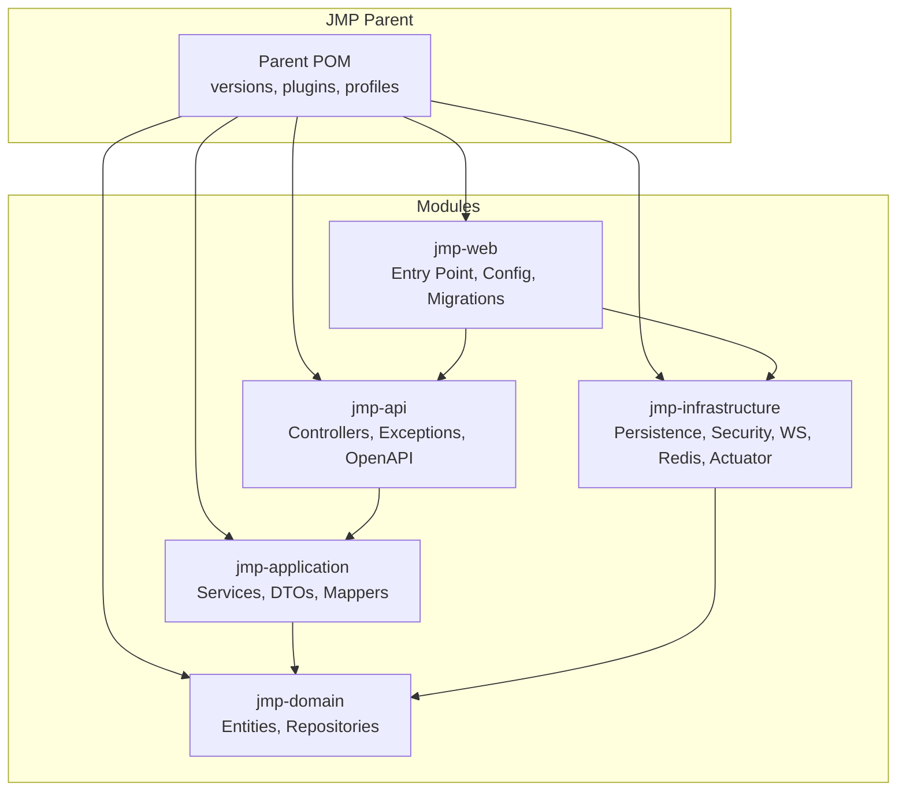
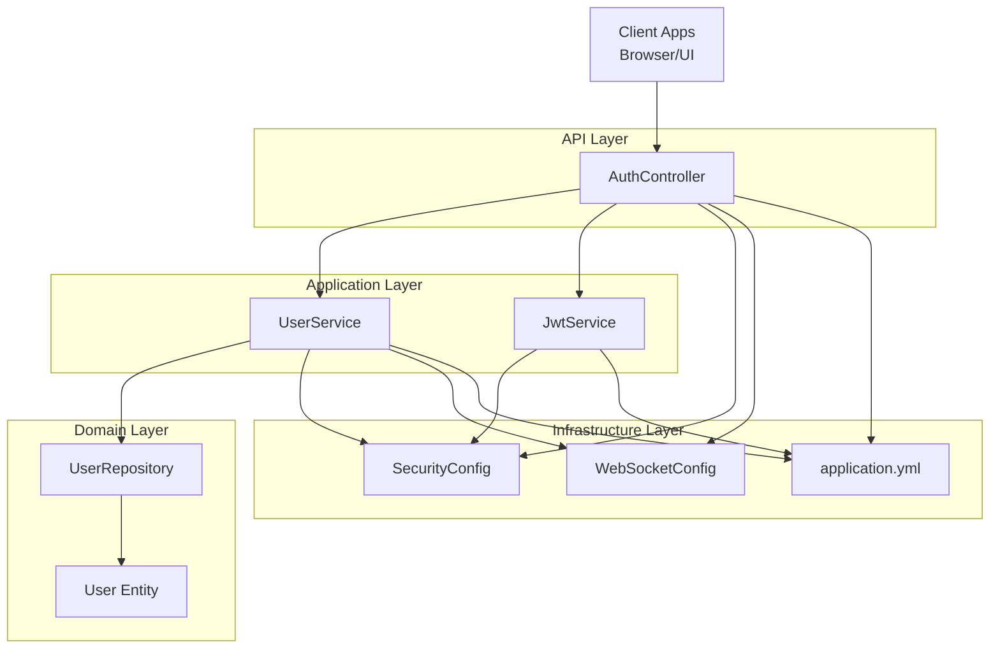
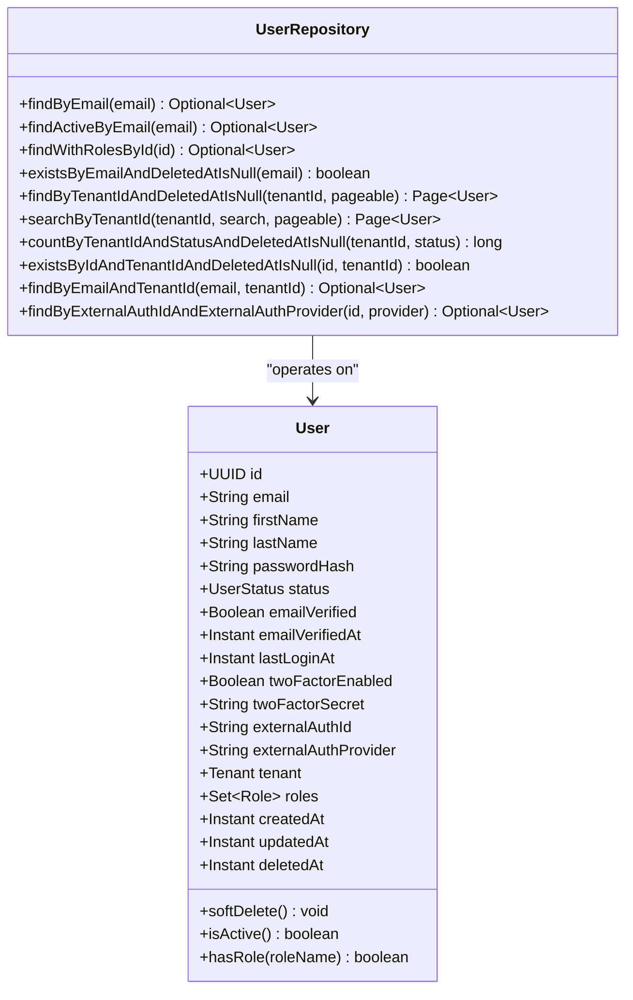
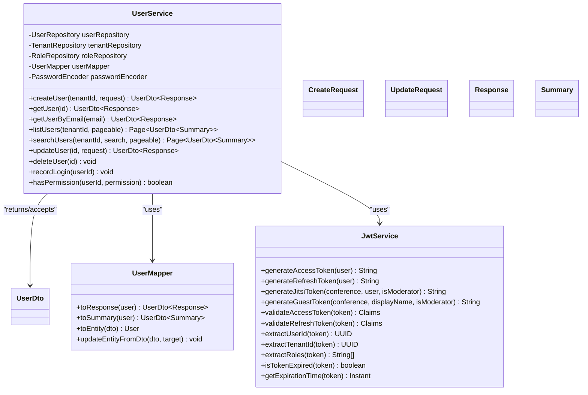
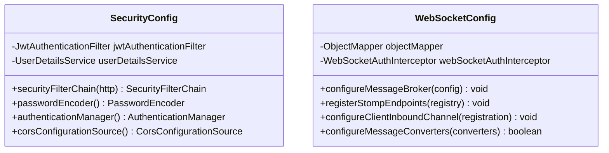
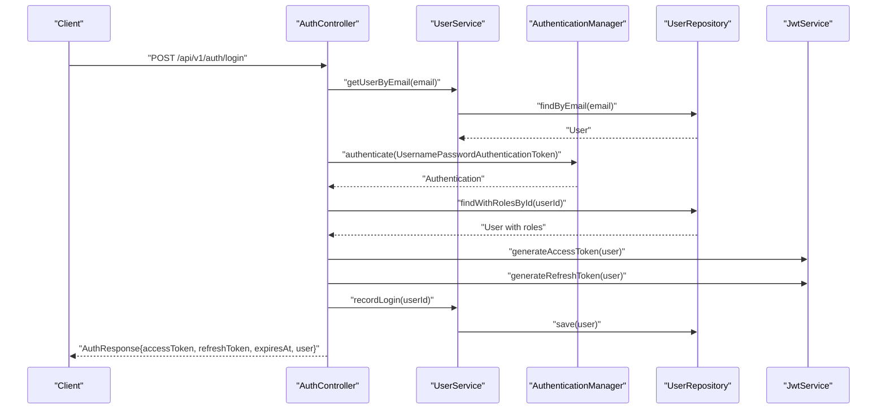
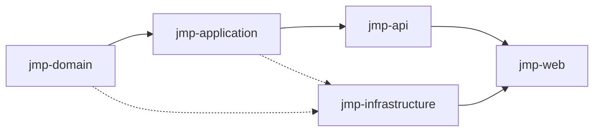
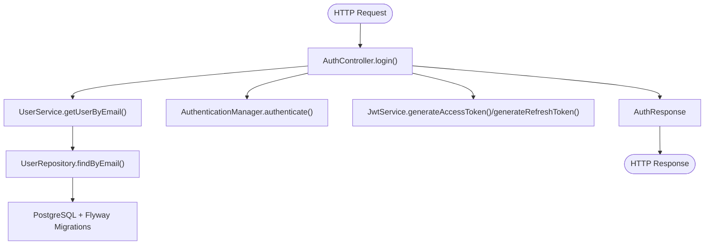

# System Architecture

<cite>
**Referenced Files in This Document**
- [pom.xml](file://pom.xml)
- [JmpApplication.java](file://jmp-web/src/main/java/com/jmp/web/JmpApplication.java)
- [application.yml](file://jmp-web/src/main/resources/application.yml)
- [V1__init_schema.sql](file://jmp-web/src/main/resources/db/migration/V1__init_schema.sql)
- [User.java](file://jmp-domain/src/main/java/com/jmp/domain/entity/User.java)
- [UserRepository.java](file://jmp-domain/src/main/java/com/jmp/domain/repository/UserRepository.java)
- [UserDto.java](file://jmp-application/src/main/java/com/jmp/application/dto/UserDto.java)
- [UserMapper.java](file://jmp-application/src/main/java/com/jmp/application/mapper/UserMapper.java)
- [UserService.java](file://jmp-application/src/main/java/com/jmp/application/service/UserService.java)
- [JwtService.java](file://jmp-application/src/main/java/com/jmp/application/service/JwtService.java)
- [AuthController.java](file://jmp-api/src/main/java/com/jmp/api/controller/AuthController.java)
- [SecurityConfig.java](file://jmp-infrastructure/src/main/java/com/jmp/infrastructure/security/SecurityConfig.java)
- [WebSocketConfig.java](file://jmp-infrastructure/src/main/java/com/jmp/infrastructure/websocket/WebSocketConfig.java)
</cite>

## Table of Contents
1. [Introduction](#introduction)
2. [Project Structure](#project-structure)
3. [Core Components](#core-components)
4. [Architecture Overview](#architecture-overview)
5. [Detailed Component Analysis](#detailed-component-analysis)
6. [Dependency Analysis](#dependency-analysis)
7. [Performance Considerations](#performance-considerations)
8. [Troubleshooting Guide](#troubleshooting-guide)
9. [Conclusion](#conclusion)
10. [Appendices](#appendices)

## Introduction
This document describes the system architecture of the Jitsi Management Platform (JMP) as a clean architecture implementation with four layers: domain, application, infrastructure, and API. It explains how Spring Boot auto-configuration and dependency injection enforce layer boundaries, how requests flow from API controllers through application services to domain entities, and how cross-cutting concerns such as security, persistence, and real-time communication are integrated. It also documents technology stack choices, third-party dependencies, version compatibility, and how the architecture supports scalability, maintainability, and testability.

## Project Structure
The project is organized as a multi-module Maven build with five modules:
- jmp-domain: Entities, repositories, value objects, and domain events
- jmp-application: Services, use cases, DTOs, mappers, validators
- jmp-infrastructure: Persistence, security, external integrations, caching, messaging
- jmp-api: REST controllers, exception handling, OpenAPI documentation
- jmp-web: Spring Boot application entry point, configuration, Flyway migrations

**Diagram sources**
- [pom.xml:40-46](file://pom.xml#L40-L46)
- [JmpApplication.java:15-21](file://jmp-web/src/main/java/com/jmp/web/JmpApplication.java#L15-L21)

**Section sources**
- [pom.xml:40-46](file://pom.xml#L40-L46)
- [JmpApplication.java:15-21](file://jmp-web/src/main/java/com/jmp/web/JmpApplication.java#L15-L21)

## Core Components
- Domain layer encapsulates business rules and entities. Example: User entity with tenant scoping, roles, and status lifecycle.
- Application layer orchestrates use cases via services, DTOs, and mappers. Example: UserService coordinates user creation, retrieval, updates, and permission checks.
- Infrastructure layer handles persistence, security, external integrations, and cross-cutting concerns. Example: SecurityConfig, WebSocketConfig, JWT service.
- API layer exposes REST endpoints and integrates with Spring MVC/Spring Security. Example: AuthController for login and token refresh.

Key architectural decisions:
- Spring Boot auto-configuration scans packages and enables JPA repositories and auditing.
- Dependency injection wires services and repositories across layers.
- Layered architecture enforces unidirectional dependencies: API → Application → Domain; Infrastructure supports both Application and Domain.

Benefits:
- Separation of concerns, testability via DI and repository abstractions
- Scalability through modularization and clear contracts (DTOs, mappers)
- Maintainability through explicit layer boundaries and shared domain models

**Section sources**
- [User.java:23-163](file://jmp-domain/src/main/java/com/jmp/domain/entity/User.java#L23-L163)
- [UserService.java:28-189](file://jmp-application/src/main/java/com/jmp/application/service/UserService.java#L28-L189)
- [JwtService.java:25-235](file://jmp-application/src/main/java/com/jmp/application/service/JwtService.java#L25-L235)
- [AuthController.java:30-123](file://jmp-api/src/main/java/com/jmp/api/controller/AuthController.java#L30-L123)
- [SecurityConfig.java:28-89](file://jmp-infrastructure/src/main/java/com/jmp/infrastructure/security/SecurityConfig.java#L28-L89)
- [WebSocketConfig.java:23-69](file://jmp-infrastructure/src/main/java/com/jmp/infrastructure/websocket/WebSocketConfig.java#L23-L69)

## Architecture Overview
Clean architecture with four layers and explicit module dependencies:
- Domain: Entities and repositories define business invariants
- Application: Services and DTOs orchestrate use cases
- Infrastructure: Persistence, security, messaging, and monitoring
- API: Controllers and OpenAPI documentation

**Diagram sources**
- [AuthController.java:30-123](file://jmp-api/src/main/java/com/jmp/api/controller/AuthController.java#L30-L123)
- [UserService.java:28-189](file://jmp-application/src/main/java/com/jmp/application/service/UserService.java#L28-L189)
- [JwtService.java:25-235](file://jmp-application/src/main/java/com/jmp/application/service/JwtService.java#L25-L235)
- [User.java:23-163](file://jmp-domain/src/main/java/com/jmp/domain/entity/User.java#L23-L163)
- [UserRepository.java:18-81](file://jmp-domain/src/main/java/com/jmp/domain/repository/UserRepository.java#L18-L81)
- [SecurityConfig.java:28-89](file://jmp-infrastructure/src/main/java/com/jmp/infrastructure/security/SecurityConfig.java#L28-L89)
- [WebSocketConfig.java:23-69](file://jmp-infrastructure/src/main/java/com/jmp/infrastructure/websocket/WebSocketConfig.java#L23-L69)
- [application.yml:4-128](file://jmp-web/src/main/resources/application.yml#L4-L128)

## Detailed Component Analysis

### Domain Layer: User Entity and Repository
- User entity models tenant-scoped identity with roles, status, and soft-delete semantics.
- UserRepository defines queries for email lookup, paginated tenant users, search, and existence checks.

**Diagram sources**
- [User.java:23-163](file://jmp-domain/src/main/java/com/jmp/domain/entity/User.java#L23-L163)
- [UserRepository.java:18-81](file://jmp-domain/src/main/java/com/jmp/domain/repository/UserRepository.java#L18-L81)

**Section sources**
- [User.java:23-163](file://jmp-domain/src/main/java/com/jmp/domain/entity/User.java#L23-L163)
- [UserRepository.java:18-81](file://jmp-domain/src/main/java/com/jmp/domain/repository/UserRepository.java#L18-L81)

### Application Layer: Services, DTOs, and Mappers
- UserService coordinates user operations, delegates to repositories, and uses mappers and password encoder.
- UserDto defines sealed interface with CreateRequest, UpdateRequest, Response, and Summary DTOs.
- UserMapper maps between DTOs and entities with MapStruct.
- JwtService generates and validates access/refresh/Jitsi tokens with configurable secrets and expiration.

**Diagram sources**
- [UserService.java:28-189](file://jmp-application/src/main/java/com/jmp/application/service/UserService.java#L28-L189)
- [UserDto.java:14-96](file://jmp-application/src/main/java/com/jmp/application/dto/UserDto.java#L14-L96)
- [UserMapper.java:18-75](file://jmp-application/src/main/java/com/jmp/application/mapper/UserMapper.java#L18-L75)
- [JwtService.java:25-235](file://jmp-application/src/main/java/com/jmp/application/service/JwtService.java#L25-L235)

**Section sources**
- [UserService.java:28-189](file://jmp-application/src/main/java/com/jmp/application/service/UserService.java#L28-L189)
- [UserDto.java:14-96](file://jmp-application/src/main/java/com/jmp/application/dto/UserDto.java#L14-L96)
- [UserMapper.java:18-75](file://jmp-application/src/main/java/com/jmp/application/mapper/UserMapper.java#L18-L75)
- [JwtService.java:25-235](file://jmp-application/src/main/java/com/jmp/application/service/JwtService.java#L25-L235)

### Infrastructure Layer: Security and Real-Time Communication
- SecurityConfig configures stateless sessions, CORS, and method-level security; wires AuthenticationManager and PasswordEncoder.
- WebSocketConfig registers STOMP endpoints and message broker for real-time events.

**Diagram sources**
- [SecurityConfig.java:28-89](file://jmp-infrastructure/src/main/java/com/jmp/infrastructure/security/SecurityConfig.java#L28-L89)
- [WebSocketConfig.java:23-69](file://jmp-infrastructure/src/main/java/com/jmp/infrastructure/websocket/WebSocketConfig.java#L23-L69)

**Section sources**
- [SecurityConfig.java:28-89](file://jmp-infrastructure/src/main/java/com/jmp/infrastructure/security/SecurityConfig.java#L28-L89)
- [WebSocketConfig.java:23-69](file://jmp-infrastructure/src/main/java/com/jmp/infrastructure/websocket/WebSocketConfig.java#L23-L69)

### API Layer: Authentication Controller Flow
The authentication flow demonstrates the layered architecture: API controller invokes application services, which operate on domain entities via repositories.

**Diagram sources**
- [AuthController.java:42-81](file://jmp-api/src/main/java/com/jmp/api/controller/AuthController.java#L42-L81)
- [UserService.java:74-78](file://jmp-application/src/main/java/com/jmp/application/service/UserService.java#L74-L78)
- [UserRepository.java:24-25](file://jmp-domain/src/main/java/com/jmp/domain/repository/UserRepository.java#L24-L25)
- [JwtService.java:49-87](file://jmp-application/src/main/java/com/jmp/application/service/JwtService.java#L49-L87)

**Section sources**
- [AuthController.java:42-81](file://jmp-api/src/main/java/com/jmp/api/controller/AuthController.java#L42-L81)
- [UserService.java:74-78](file://jmp-application/src/main/java/com/jmp/application/service/UserService.java#L74-L78)
- [UserRepository.java:24-25](file://jmp-domain/src/main/java/com/jmp/domain/repository/UserRepository.java#L24-L25)
- [JwtService.java:49-87](file://jmp-application/src/main/java/com/jmp/application/service/JwtService.java#L49-L87)

### Cross-Cutting Concerns
- Security: Stateless JWT-based authentication with refresh tokens; BCrypt password encoding; method-level security; CORS configuration.
- Persistence: JPA/Hibernate with PostgreSQL; Flyway migrations; auditing listeners; batch size tuning.
- Real-time communication: WebSocket STOMP endpoints with SockJS fallback; JSON message converters; per-tenant channels.
- Observability: Prometheus metrics via Micrometer; Actuator endpoints; structured logging with trace IDs.

**Section sources**
- [SecurityConfig.java:42-75](file://jmp-infrastructure/src/main/java/com/jmp/infrastructure/security/SecurityConfig.java#L42-L75)
- [application.yml:12-56](file://jmp-web/src/main/resources/application.yml#L12-L56)
- [WebSocketConfig.java:32-68](file://jmp-infrastructure/src/main/java/com/jmp/infrastructure/websocket/WebSocketConfig.java#L32-L68)
- [application.yml:93-112](file://jmp-web/src/main/resources/application.yml#L93-L112)

## Dependency Analysis
Module dependencies are declared in the parent POM and enforced by layering:
- jmp-api depends on jmp-application and jmp-infrastructure
- jmp-application depends on jmp-domain
- jmp-infrastructure depends on jmp-domain and jmp-application
- jmp-web depends on jmp-api and jmp-infrastructure

**Diagram sources**
- [pom.xml:18-28](file://pom.xml#L18-L28)
- [pom.xml:49-101](file://pom.xml#L49-L101)

**Section sources**
- [pom.xml:18-28](file://pom.xml#L18-L28)
- [pom.xml:49-101](file://pom.xml#L49-L101)

## Performance Considerations
- Database tuning: batch inserts/updates, ordered writes, connection pooling, and Flyway migrations ensure schema consistency.
- Query optimization: UserRepository leverages @EntityGraph and custom JPQL to minimize N+1 selects and optimize joins.
- Caching and rate limiting: Redis-backed bucket4j can be integrated for rate limiting; caching strategies can be introduced at the application layer.
- Asynchronous processing: @EnableAsync and scheduling annotations support background tasks.
- Monitoring: Micrometer with Prometheus exposes metrics for capacity planning and alerting.

[No sources needed since this section provides general guidance]

## Troubleshooting Guide
Common areas to inspect:
- Authentication failures: Verify JWT secrets, token expiration, and password encoder configuration.
- Database connectivity: Check datasource URL, credentials, and Flyway migration status.
- WebSocket handshake: Confirm STOMP endpoint registration and interceptor wiring.
- CORS errors: Validate allowed origins and credentials settings in SecurityConfig.

**Section sources**
- [application.yml:12-56](file://jmp-web/src/main/resources/application.yml#L12-L56)
- [SecurityConfig.java:77-88](file://jmp-infrastructure/src/main/java/com/jmp/infrastructure/security/SecurityConfig.java#L77-L88)
- [WebSocketConfig.java:42-50](file://jmp-infrastructure/src/main/java/com/jmp/infrastructure/websocket/WebSocketConfig.java#L42-L50)

## Conclusion
The Jitsi Management Platform employs a clean architecture with well-defined layers and explicit module boundaries. Spring Boot’s auto-configuration and dependency injection simplify wiring while preserving separation of concerns. The architecture supports scalability through modularization, maintainability via stable contracts (DTOs, mappers), and testability by enabling DI and repository abstractions. Cross-cutting concerns are cleanly isolated in the infrastructure layer, and the technology stack aligns with modern enterprise-grade practices.

[No sources needed since this section summarizes without analyzing specific files]

## Appendices

### Technology Stack and Version Compatibility
- Java 21, Spring Boot 3.2.5, Spring Security 6.2.4, Hibernate ORM 6.4.4, PostgreSQL 42.7.3, Flyway 10.11.0, MapStruct 1.5.5, Lombok 1.18.32, jjwt 0.12.5, bucket4j 8.10.1, resilience4j 2.1.0, springdoc-openapi 2.5.0, micrometer 1.12.5, testcontainers 1.19.7.

**Section sources**
- [pom.xml:48-77](file://pom.xml#L48-L77)
- [pom.xml:103-166](file://pom.xml#L103-L166)

### System Context: Data Flow from API to Domain

**Diagram sources**
- [AuthController.java:42-81](file://jmp-api/src/main/java/com/jmp/api/controller/AuthController.java#L42-L81)
- [UserService.java:84-87](file://jmp-application/src/main/java/com/jmp/application/service/UserService.java#L84-L87)
- [UserRepository.java:24-25](file://jmp-domain/src/main/java/com/jmp/domain/repository/UserRepository.java#L24-L25)
- [application.yml:39-43](file://jmp-web/src/main/resources/application.yml#L39-L43)
- [V1__init_schema.sql:10-172](file://jmp-web/src/main/resources/db/migration/V1__init_schema.sql#L10-L172)