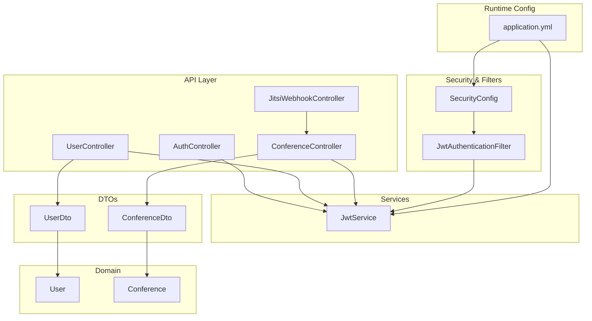
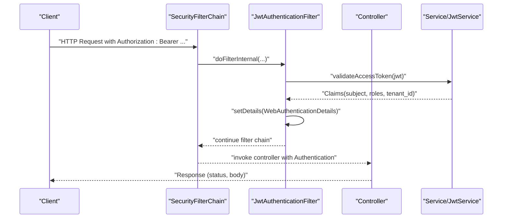
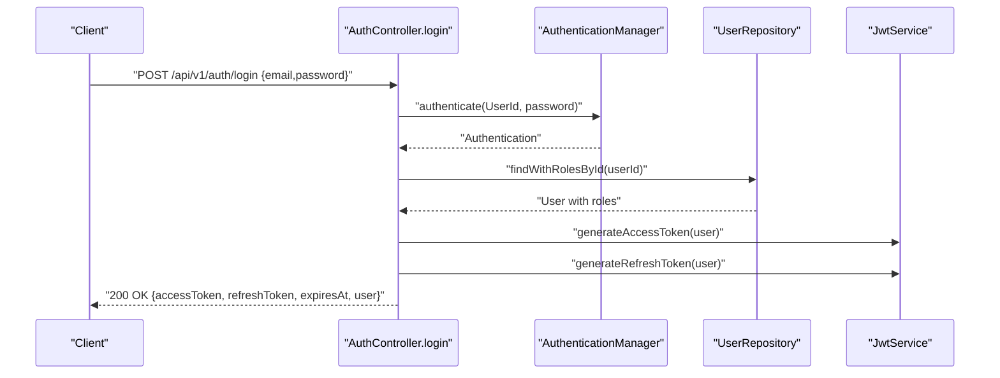
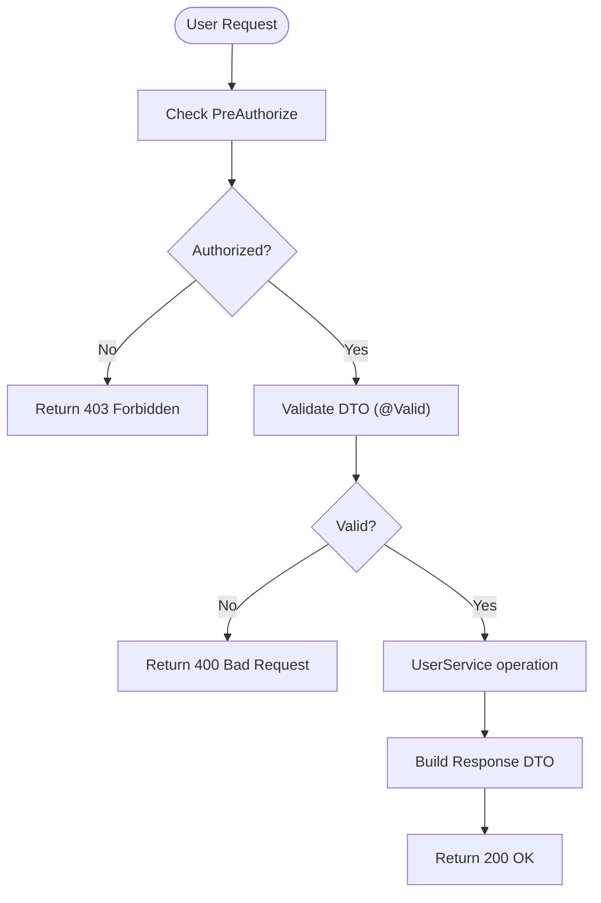
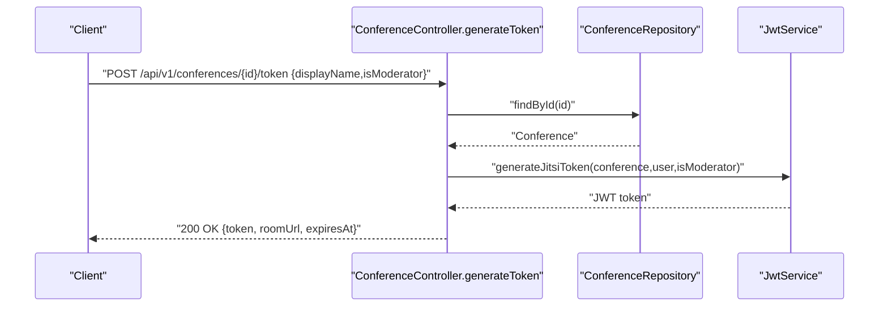
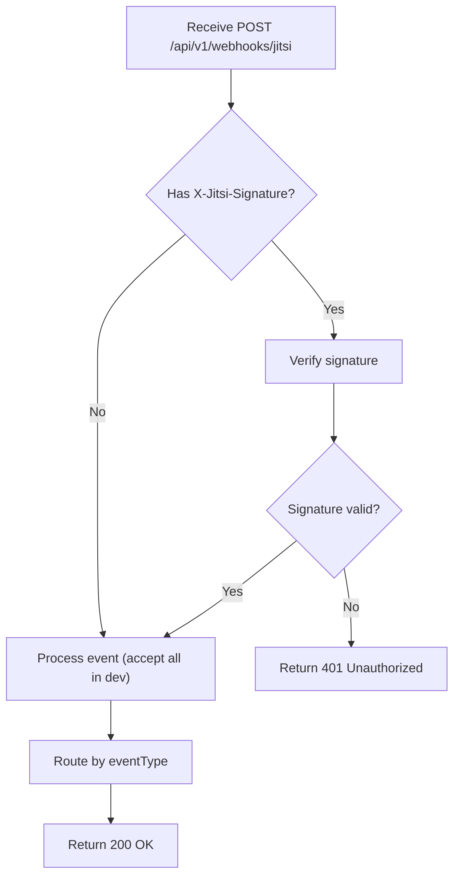
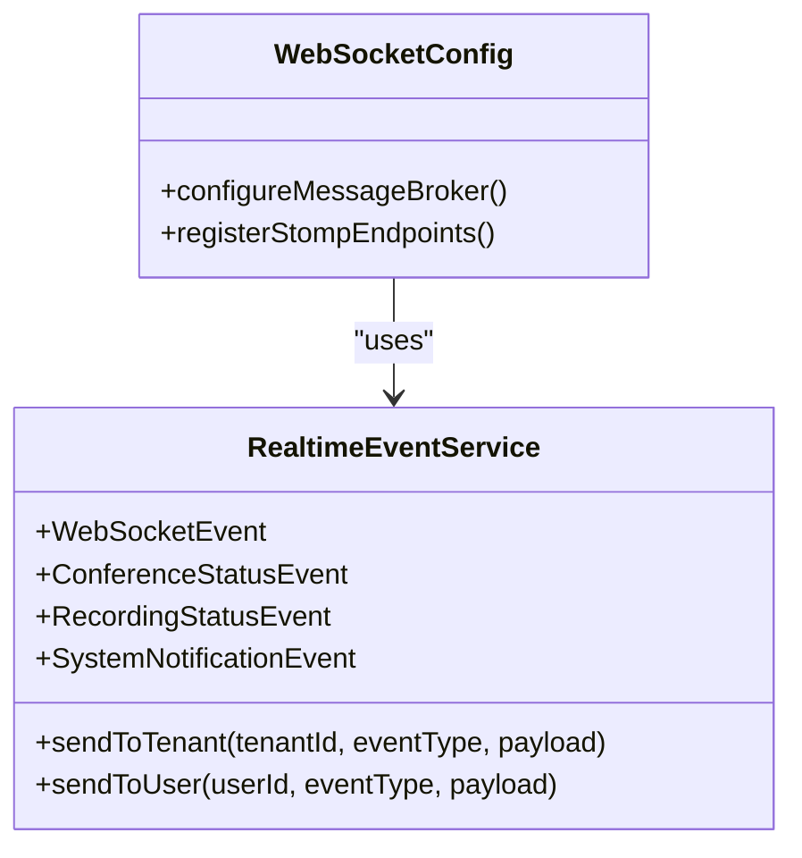
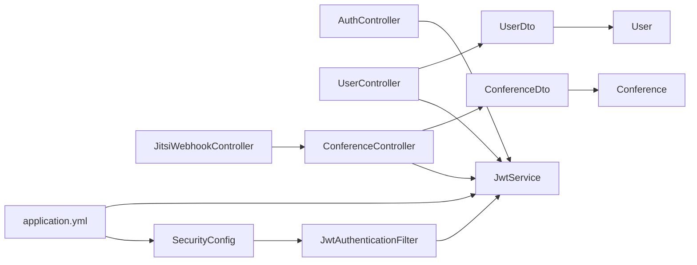

# API Testing

<cite>
**Referenced Files in This Document**
- [AuthController.java](file://jmp-api/src/main/java/com/jmp/api/controller/AuthController.java)
- [UserController.java](file://jmp-api/src/main/java/com/jmp/api/controller/UserController.java)
- [ConferenceController.java](file://jmp-api/src/main/java/com/jmp/api/controller/ConferenceController.java)
- [JitsiWebhookController.java](file://jmp-api/src/main/java/com/jmp/api/controller/JitsiWebhookController.java)
- [SecurityConfig.java](file://jmp-infrastructure/src/main/java/com/jmp/infrastructure/security/SecurityConfig.java)
- [JwtAuthenticationFilter.java](file://jmp-infrastructure/src/main/java/com/jmp/infrastructure/security/JwtAuthenticationFilter.java)
- [JwtService.java](file://jmp-application/src/main/java/com/jmp/application/service/JwtService.java)
- [UserDto.java](file://jmp-application/src/main/java/com/jmp/application/dto/UserDto.java)
- [ConferenceDto.java](file://jmp-application/src/main/java/com/jmp/application/dto/ConferenceDto.java)
- [User.java](file://jmp-domain/src/main/java/com/jmp/domain/entity/User.java)
- [Conference.java](file://jmp-domain/src/main/java/com/jmp/domain/entity/Conference.java)
- [WebSocketConfig.java](file://jmp-infrastructure/src/main/java/com/jmp/infrastructure/websocket/WebSocketConfig.java)
- [RealtimeEventService.java](file://jmp-infrastructure/src/main/java/com/jmp/infrastructure/websocket/RealtimeEventService.java)
- [application.yml](file://jmp-web/src/main/resources/application.yml)
- [pom.xml (jmp-api)](file://jmp-api/pom.xml)
- [pom.xml (root)](file://pom.xml)
</cite>

## Table of Contents
1. [Introduction](#introduction)
2. [Project Structure](#project-structure)
3. [Core Components](#core-components)
4. [Architecture Overview](#architecture-overview)
5. [Detailed Component Analysis](#detailed-component-analysis)
6. [Dependency Analysis](#dependency-analysis)
7. [Performance Considerations](#performance-considerations)
8. [Troubleshooting Guide](#troubleshooting-guide)
9. [Conclusion](#conclusion)
10. [Appendices](#appendices)

## Introduction
This document provides comprehensive API testing methodologies for the Jitsi Management Platform (JMP). It focuses on REST API testing strategies using Spring Boot Test and MockMvc for controller-level tests, covering authentication endpoints, user management APIs, and conference management endpoints. It also documents request/response validation, status code verification, JSON schema testing, JWT authentication flows, authorization scenarios, error response handling, and testing approaches for real-time WebSocket endpoints, webhook processing, CORS configuration, security headers, and rate limiting. Finally, it outlines guidelines for API contract testing, load testing preparation, and automated API test execution in CI/CD pipelines.

## Project Structure
The API surface is implemented in the jmp-api module with controllers under com.jmp.api.controller. Security is configured in jmp-infrastructure, JWT utilities in jmp-application, domain entities in jmp-domain, and runtime configuration in jmp-web. The root pom.xml includes testing dependencies for Spring Boot Test, Spring Security Test, Testcontainers, and AssertJ.

**Diagram sources**
- [AuthController.java:1-124](file://jmp-api/src/main/java/com/jmp/api/controller/AuthController.java#L1-L124)
- [UserController.java:1-123](file://jmp-api/src/main/java/com/jmp/api/controller/UserController.java#L1-L123)
- [ConferenceController.java:1-189](file://jmp-api/src/main/java/com/jmp/api/controller/ConferenceController.java#L1-L189)
- [JitsiWebhookController.java:1-125](file://jmp-api/src/main/java/com/jmp/api/controller/JitsiWebhookController.java#L1-L125)
- [SecurityConfig.java:1-90](file://jmp-infrastructure/src/main/java/com/jmp/infrastructure/security/SecurityConfig.java#L1-L90)
- [JwtAuthenticationFilter.java:1-122](file://jmp-infrastructure/src/main/java/com/jmp/infrastructure/security/JwtAuthenticationFilter.java#L1-L122)
- [JwtService.java:1-236](file://jmp-application/src/main/java/com/jmp/application/service/JwtService.java#L1-L236)
- [UserDto.java:1-97](file://jmp-application/src/main/java/com/jmp/application/dto/UserDto.java#L1-L97)
- [ConferenceDto.java:1-176](file://jmp-application/src/main/java/com/jmp/application/dto/ConferenceDto.java#L1-L176)
- [User.java:1-164](file://jmp-domain/src/main/java/com/jmp/domain/entity/User.java#L1-L164)
- [Conference.java:1-217](file://jmp-domain/src/main/java/com/jmp/domain/entity/Conference.java#L1-L217)
- [application.yml:1-128](file://jmp-web/src/main/resources/application.yml#L1-L128)

**Section sources**
- [pom.xml (jmp-api):1-61](file://jmp-api/pom.xml#L1-L61)
- [pom.xml (root):169-199](file://pom.xml#L169-L199)

## Core Components
- Authentication endpoints: login and token refresh with JWT issuance and validation.
- User management endpoints: CRUD operations with tenant scoping and role-based authorization.
- Conference management endpoints: lifecycle operations, search, and Jitsi JWT token generation.
- Webhook endpoint: Jitsi event ingestion with optional signature verification.
- Security configuration: stateless JWT filter, CORS policy, and method-level authorization.
- DTOs and domain entities define request/response shapes and business constraints.

**Section sources**
- [AuthController.java:42-100](file://jmp-api/src/main/java/com/jmp/api/controller/AuthController.java#L42-L100)
- [UserController.java:43-107](file://jmp-api/src/main/java/com/jmp/api/controller/UserController.java#L43-L107)
- [ConferenceController.java:49-173](file://jmp-api/src/main/java/com/jmp/api/controller/ConferenceController.java#L49-L173)
- [JitsiWebhookController.java:33-52](file://jmp-api/src/main/java/com/jmp/api/controller/JitsiWebhookController.java#L33-L52)
- [SecurityConfig.java:42-88](file://jmp-infrastructure/src/main/java/com/jmp/infrastructure/security/SecurityConfig.java#L42-L88)
- [JwtAuthenticationFilter.java:39-94](file://jmp-infrastructure/src/main/java/com/jmp/infrastructure/security/JwtAuthenticationFilter.java#L39-L94)
- [JwtService.java:49-126](file://jmp-application/src/main/java/com/jmp/application/service/JwtService.java#L49-L126)
- [UserDto.java:14-96](file://jmp-application/src/main/java/com/jmp/application/dto/UserDto.java#L14-L96)
- [ConferenceDto.java:15-175](file://jmp-application/src/main/java/com/jmp/application/dto/ConferenceDto.java#L15-L175)
- [User.java:28-163](file://jmp-domain/src/main/java/com/jmp/domain/entity/User.java#L28-L163)
- [Conference.java:30-216](file://jmp-domain/src/main/java/com/jmp/domain/entity/Conference.java#L30-L216)

## Architecture Overview
The API layer exposes REST endpoints secured by JWT. The JwtAuthenticationFilter validates Authorization headers and populates Authentication with claims and tenant/user IDs extracted from JWT. Controllers enforce method-level authorization and delegate to services. DTOs encapsulate request/response shapes validated by Bean Validation. Webhooks integrate with Jitsi events, and WebSocket endpoints support real-time notifications.

**Diagram sources**
- [SecurityConfig.java:42-61](file://jmp-infrastructure/src/main/java/com/jmp/infrastructure/security/SecurityConfig.java#L42-L61)
- [JwtAuthenticationFilter.java:39-76](file://jmp-infrastructure/src/main/java/com/jmp/infrastructure/security/JwtAuthenticationFilter.java#L39-L76)
- [JwtService.java:165-171](file://jmp-application/src/main/java/com/jmp/application/service/JwtService.java#L165-L171)
- [UserController.java:109-121](file://jmp-api/src/main/java/com/jmp/api/controller/UserController.java#L109-L121)

## Detailed Component Analysis

### Authentication Endpoints Testing
Focus areas:
- Validate login with valid/invalid credentials and ensure proper status codes.
- Verify token refresh flow with valid/invalid refresh tokens.
- Confirm response shape matches AuthResponse and TokenRefreshResponse DTOs.
- Test JWT claims extraction and tenant/user ID availability in Authentication details.

Recommended tests:
- Successful login returns 200 with accessToken, refreshToken, expiresAt, and user payload.
- Invalid credentials return 401 with BadCredentialsException.
- Refresh token validation failure returns 401.
- Access token parsing and claims extraction verified via JwtService.

**Diagram sources**
- [AuthController.java:44-81](file://jmp-api/src/main/java/com/jmp/api/controller/AuthController.java#L44-L81)
- [JwtService.java:49-87](file://jmp-application/src/main/java/com/jmp/application/service/JwtService.java#L49-L87)

**Section sources**
- [AuthController.java:42-100](file://jmp-api/src/main/java/com/jmp/api/controller/AuthController.java#L42-L100)
- [JwtService.java:49-87](file://jmp-application/src/main/java/com/jmp/application/service/JwtService.java#L49-L87)
- [UserDto.java:67-78](file://jmp-application/src/main/java/com/jmp/application/dto/UserDto.java#L67-L78)

### User Management Endpoints Testing
Focus areas:
- Endpoint-level authorization: PreAuthorize checks for TENANT_ADMIN/SUPER_ADMIN and self-access.
- Tenant scoping via Authentication details (tenant_id).
- Request validation using UserDto.CreateRequest and UserDto.UpdateRequest.
- Response validation using UserDto.Response and UserDto.Summary.

Recommended tests:
- Create user returns 201 with Response DTO.
- Get user returns 200 with Response DTO; unauthorized access returns 403.
- List users returns Page
; search query param supported.
- Update user returns 200 with Response DTO.
- Delete user returns 204 No Content.
- GET /me returns current user profile.

**Diagram sources**
- [UserController.java:43-107](file://jmp-api/src/main/java/com/jmp/api/controller/UserController.java#L43-L107)
- [UserDto.java:30-95](file://jmp-application/src/main/java/com/jmp/application/dto/UserDto.java#L30-L95)

**Section sources**
- [UserController.java:43-107](file://jmp-api/src/main/java/com/jmp/api/controller/UserController.java#L43-L107)
- [UserDto.java:14-96](file://jmp-application/src/main/java/com/jmp/application/dto/UserDto.java#L14-L96)
- [User.java:28-163](file://jmp-domain/src/main/java/com/jmp/domain/entity/User.java#L28-L163)

### Conference Management Endpoints Testing
Focus areas:
- Lifecycle operations: start/end/delete with appropriate authorization.
- Jitsi JWT token generation with moderator flag and context claims.
- Search and pagination via Pageable and optional search term.
- Tenant scoping enforced via Authentication details.

Recommended tests:
- Create conference returns 201 with Response DTO.
- Retrieve conference returns 200; unauthorized returns 403.
- List conferences returns Page
; search supported.
- Start/End conference returns 200 with updated Response DTO.
- Delete conference returns 204.
- Generate Jitsi token returns 200 with token, roomUrl, expiresAt.

**Diagram sources**
- [ConferenceController.java:140-173](file://jmp-api/src/main/java/com/jmp/api/controller/ConferenceController.java#L140-L173)
- [JwtService.java:94-126](file://jmp-application/src/main/java/com/jmp/application/service/JwtService.java#L94-L126)

**Section sources**
- [ConferenceController.java:49-173](file://jmp-api/src/main/java/com/jmp/api/controller/ConferenceController.java#L49-L173)
- [ConferenceDto.java:15-175](file://jmp-application/src/main/java/com/jmp/application/dto/ConferenceDto.java#L15-L175)
- [Conference.java:30-216](file://jmp-domain/src/main/java/com/jmp/domain/entity/Conference.java#L30-L216)

### Webhook Processing Endpoints Testing
Focus areas:
- Signature verification header X-Jitsi-Signature handling.
- Event routing based on eventType (CONFERENCE_CREATED, CONFERENCE_ENDED, PARTICIPANT_JOINED, PARTICIPANT_LEFT, RECORDING_STATUS_CHANGED, STREAMING_STATUS_CHANGED).
- Unauthorized signature returns 401; otherwise 200 OK.

Recommended tests:
- POST webhook with missing/invalid signature returns 401.
- POST webhook with valid signature returns 200 OK.
- Validate event payload structure via JitsiWebhookEvent record.

**Diagram sources**
- [JitsiWebhookController.java:33-52](file://jmp-api/src/main/java/com/jmp/api/controller/JitsiWebhookController.java#L33-L52)
- [JitsiWebhookController.java:104-109](file://jmp-api/src/main/java/com/jmp/api/controller/JitsiWebhookController.java#L104-L109)

**Section sources**
- [JitsiWebhookController.java:33-123](file://jmp-api/src/main/java/com/jmp/api/controller/JitsiWebhookController.java#L33-L123)

### WebSocket Endpoints Testing
Focus areas:
- STOMP/WebSocket configuration and authentication interceptor.
- Publishing real-time events to tenant/user destinations.
- Event envelopes and payload structures.

Recommended tests:
- Configure WebSocket endpoints and interceptors.
- Publish events via RealtimeEventService and assert delivery to subscribed clients.
- Validate event types: ConferenceStatusEvent, RecordingStatusEvent, SystemNotificationEvent.

**Diagram sources**
- [WebSocketConfig.java:1-30](file://jmp-infrastructure/src/main/java/com/jmp/infrastructure/websocket/WebSocketConfig.java#L1-L30)
- [RealtimeEventService.java:1-141](file://jmp-infrastructure/src/main/java/com/jmp/infrastructure/websocket/RealtimeEventService.java#L1-L141)

**Section sources**
- [WebSocketConfig.java:1-30](file://jmp-infrastructure/src/main/java/com/jmp/infrastructure/websocket/WebSocketConfig.java#L1-L30)
- [RealtimeEventService.java:25-141](file://jmp-infrastructure/src/main/java/com/jmp/infrastructure/websocket/RealtimeEventService.java#L25-L141)

## Dependency Analysis
Controllers depend on JwtService for token operations and on services for business logic. SecurityConfig defines global security policies and CORS. DTOs and domain entities define the data contracts. The runtime configuration sets JWT secrets and expiration.

**Diagram sources**
- [AuthController.java:37-40](file://jmp-api/src/main/java/com/jmp/api/controller/AuthController.java#L37-L40)
- [UserController.java:41-42](file://jmp-api/src/main/java/com/jmp/api/controller/UserController.java#L41-L42)
- [ConferenceController.java:46-47](file://jmp-api/src/main/java/com/jmp/api/controller/ConferenceController.java#L46-L47)
- [JitsiWebhookController.java](file://jmp-api/src/main/java/com/jmp/api/controller/JitsiWebhookController.java#L31)
- [SecurityConfig.java:42-61](file://jmp-infrastructure/src/main/java/com/jmp/infrastructure/security/SecurityConfig.java#L42-L61)
- [JwtAuthenticationFilter.java:34-36](file://jmp-infrastructure/src/main/java/com/jmp/infrastructure/security/JwtAuthenticationFilter.java#L34-L36)
- [JwtService.java:28-43](file://jmp-application/src/main/java/com/jmp/application/service/JwtService.java#L28-L43)
- [UserDto.java:14-96](file://jmp-application/src/main/java/com/jmp/application/dto/UserDto.java#L14-L96)
- [ConferenceDto.java:15-175](file://jmp-application/src/main/java/com/jmp/application/dto/ConferenceDto.java#L15-L175)
- [User.java:28-163](file://jmp-domain/src/main/java/com/jmp/domain/entity/User.java#L28-L163)
- [Conference.java:30-216](file://jmp-domain/src/main/java/com/jmp/domain/entity/Conference.java#L30-L216)
- [application.yml:71-78](file://jmp-web/src/main/resources/application.yml#L71-L78)

**Section sources**
- [pom.xml (jmp-api):17-58](file://jmp-api/pom.xml#L17-L58)
- [pom.xml (root):169-199](file://pom.xml#L169-L199)

## Performance Considerations
- Stateless JWT reduces server-side session overhead; ensure token signing keys are strong and rotated periodically.
- Pagination on list endpoints prevents large payloads; tune Pageable defaults and limit page sizes in tests.
- CORS configuration allows specific origins/methods/headers; avoid wildcard origins in production.
- Rate limiting should be implemented at gateway/proxy level; Spring Security does not include built-in rate limiting.
- Use database connection pooling and Flyway migrations to keep test databases fast and consistent.

[No sources needed since this section provides general guidance]

## Troubleshooting Guide
Common issues and resolutions:
- 401 Unauthorized on protected endpoints: verify Authorization header format and token validity.
- 403 Forbidden on user/conference endpoints: confirm roles and tenant scoping via Authentication details.
- Validation errors (400): ensure DTO fields meet constraints defined in UserDto and ConferenceDto.
- CORS failures: confirm allowed origins/methods/headers in SecurityConfig and client requests include credentials when required.
- Webhook signature verification: implement HMAC verification per Jitsi spec and test with signed/un-signed payloads.

**Section sources**
- [SecurityConfig.java:78-88](file://jmp-infrastructure/src/main/java/com/jmp/infrastructure/security/SecurityConfig.java#L78-L88)
- [JwtAuthenticationFilter.java:78-84](file://jmp-infrastructure/src/main/java/com/jmp/infrastructure/security/JwtAuthenticationFilter.java#L78-L84)
- [UserDto.java:30-53](file://jmp-application/src/main/java/com/jmp/application/dto/UserDto.java#L30-L53)
- [ConferenceDto.java:43-84](file://jmp-application/src/main/java/com/jmp/application/dto/ConferenceDto.java#L43-L84)

## Conclusion
This guide outlines a comprehensive approach to testing the JMP REST API surface, JWT authentication flows, authorization enforcement, DTO validation, webhook processing, and real-time WebSocket events. By leveraging Spring Boot Test and MockMvc, teams can validate correctness, resilience, and performance while maintaining alignment with security and CORS configurations.

[No sources needed since this section summarizes without analyzing specific files]

## Appendices

### API Contract Testing Guidelines
- Use OpenAPI/Swagger UI to validate endpoint coverage and response schemas.
- Define JSON Schema tests for request/response bodies using libraries like JsonSchema or AssertJ JSONPath.
- Parameterize tests for DTO constraints (size, email format, not blank) to ensure validation triggers appropriately.

**Section sources**
- [application.yml:114-127](file://jmp-web/src/main/resources/application.yml#L114-L127)

### Load Testing Preparation
- Identify hotspots: authentication, user/conference creation, webhook ingestion.
- Use tools like Gatling/JMeter to simulate concurrent users and measure latency/throughput.
- Apply database connection pooling and Redis caching as configured in application.yml.

**Section sources**
- [application.yml:12-22](file://jmp-web/src/main/resources/application.yml#L12-L22)
- [application.yml:45-56](file://jmp-web/src/main/resources/application.yml#L45-L56)

### Automated API Test Execution in CI/CD
- Run unit/integration tests with Testcontainers for Postgres/Redis.
- Include security headers and CORS checks in pipeline stages.
- Publish test reports and OpenAPI docs artifacts for traceability.

**Section sources**
- [pom.xml (root):189-193](file://pom.xml#L189-L193)