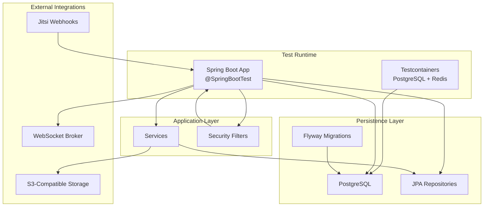
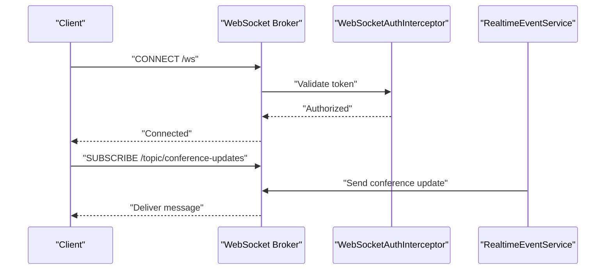
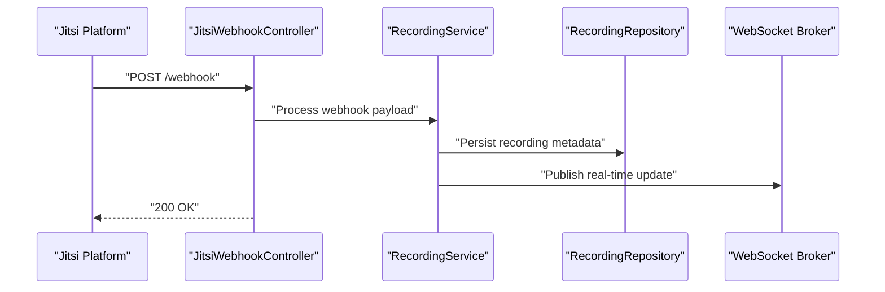
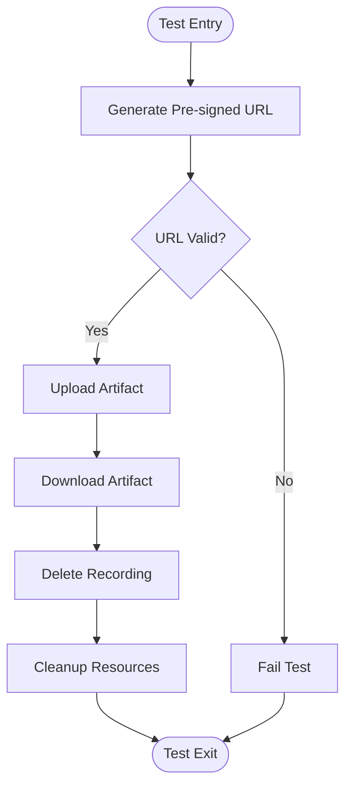
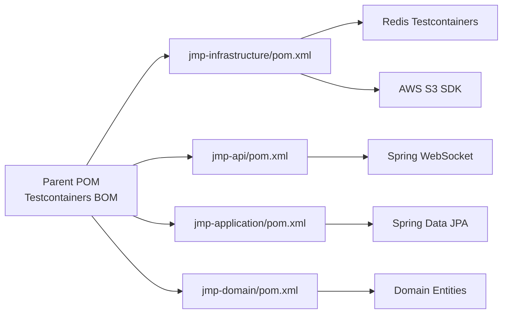

# Integration Testing

<cite>
**Referenced Files in This Document**
- [pom.xml](file://pom.xml)
- [docker-compose.yml](file://docker-compose.yml)
- [application.yml](file://jmp-web/src/main/resources/application.yml)
- [JmpApplication.java](file://jmp-web/src/main/java/com/jmp/web/JmpApplication.java)
- [WebSocketConfig.java](file://jmp-infrastructure/src/main/java/com/jmp/infrastructure/websocket/WebSocketConfig.java)
- [S3StorageService.java](file://jmp-infrastructure/src/main/java/com/jmp/infrastructure/storage/S3StorageService.java)
- [JitsiWebhookController.java](file://jmp-api/src/main/java/com/jmp/api/controller/JitsiWebhookController.java)
- [ConferenceController.java](file://jmp-api/src/main/java/com/jmp/api/controller/ConferenceController.java)
- [RecordingController.java](file://jmp-api/src/main/java/com/jmp/api/controller/RecordingController.java)
- [ConferenceRepository.java](file://jmp-domain/src/main/java/com/jmp/domain/repository/ConferenceRepository.java)
- [RecordingRepository.java](file://jmp-domain/src/main/java/com/jmp/domain/repository/RecordingRepository.java)
- [AuditLogRepository.java](file://jmp-domain/src/main/java/com/jmp/domain/repository/AuditLogRepository.java)
- [ConferenceService.java](file://jmp-application/src/main/java/com/jmp/application/service/ConferenceService.java)
- [RecordingService.java](file://jmp-application/src/main/java/com/jmp/application/service/RecordingService.java)
- [AnalyticsService.java](file://jmp-application/src/main/java/com/jmp/application/service/AnalyticsService.java)
- [RealtimeEventService.java](file://jmp-infrastructure/src/main/java/com/jmp/infrastructure/websocket/RealtimeEventService.java)
- [SecurityConfig.java](file://jmp-infrastructure/src/main/java/com/jmp/infrastructure/security/SecurityConfig.java)
- [JwtAuthenticationFilter.java](file://jmp-infrastructure/src/main/java/com/jmp/infrastructure/security/JwtAuthenticationFilter.java)
- [UserDetailsServiceImpl.java](file://jmp-infrastructure/src/main/java/com/jmp/infrastructure/security/UserDetailsServiceImpl.java)
- [V1__init_schema.sql](file://jmp-web/src/main/resources/db/migration/V1__init_schema.sql)
- [V2__seed_data.sql](file://jmp-web/src/main/resources/db/migration/V2__seed_data.sql)
- [V3__create_recordings_table.sql](file://jmp-web/src/main/resources/db/migration/V3__create_recordings_table.sql)
- [V4__create_audit_logs_table.sql](file://jmp-web/src/main/resources/db/migration/V4__create_audit_logs_table.sql)
- [V5__create_identity_providers_table.sql](file://jmp-web/src/main/resources/db/migration/V5__create_identity_providers_table.sql)
</cite>

## Table of Contents
1. [Introduction](#introduction)
2. [Project Structure](#project-structure)
3. [Core Components](#core-components)
4. [Architecture Overview](#architecture-overview)
5. [Detailed Component Analysis](#detailed-component-analysis)
6. [Dependency Analysis](#dependency-analysis)
7. [Performance Considerations](#performance-considerations)
8. [Troubleshooting Guide](#troubleshooting-guide)
9. [Conclusion](#conclusion)
10. [Appendices](#appendices)

## Introduction
This document provides a comprehensive guide to integration testing strategies for the Jitsi Management Platform (JMP). It focuses on leveraging Testcontainers for database and external service testing, validating Flyway migrations, configuring Spring Boot integration tests, and testing cross-cutting concerns such as WebSocket real-time updates, webhook processing, and storage service integration. The guidance covers environment setup, data seeding, cleanup, and best practices for reliable multi-module integration tests.

## Project Structure
JMP is a multi-module Maven project with clear separation of concerns:
- jmp-domain: Entities and repositories
- jmp-application: Services and use cases
- jmp-infrastructure: Persistence, security, messaging, storage, and WebSocket
- jmp-api: REST controllers and API wiring
- jmp-web: Spring Boot application entrypoint and Flyway migrations
- Root pom: Shared dependencies, plugins, and Testcontainers BOM

```mermaid
graph TB
subgraph "Root"
POM["pom.xml"]
DC["docker-compose.yml"]
end
subgraph "Domain"
DRepo["ConferenceRepository.java"]
RRepo["RecordingRepository.java"]
ARepo["AuditLogRepository.java"]
end
subgraph "Application"
CSvc["ConferenceService.java"]
RSvc["RecordingService.java"]
ASvc["AnalyticsService.java"]
end
subgraph "Infrastructure"
WSConf["WebSocketConfig.java"]
S3Svc["S3StorageService.java"]
SecCfg["SecurityConfig.java"]
JwtF["JwtAuthenticationFilter.java"]
UDS["UserDetailsServiceImpl.java"]
end
subgraph "API"
Wc["JitsiWebhookController.java"]
Cc["ConferenceController.java"]
Rc["RecordingController.java"]
end
subgraph "Web"
App["JmpApplication.java"]
Conf["application.yml"]
Mig1["V1__init_schema.sql"]
Mig2["V2__seed_data.sql"]
Mig3["V3__create_recordings_table.sql"]
Mig4["V4__create_audit_logs_table.sql"]
Mig5["V5__create_identity_providers_table.sql"]
end
POM --> App
App --> DRepo
App --> CSvc
App --> RSvc
App --> ASvc
App --> WSConf
App --> S3Svc
App --> Wc
App --> Cc
App --> Rc
App --> SecCfg
SecCfg --> JwtF
SecCfg --> UDS
App --> Conf
App --> Mig1
App --> Mig2
App --> Mig3
App --> Mig4
App --> Mig5
```

**Diagram sources**
- [pom.xml](file://pom.xml)
- [JmpApplication.java](file://jmp-web/src/main/java/com/jmp/web/JmpApplication.java)
- [application.yml](file://jmp-web/src/main/resources/application.yml)
- [WebSocketConfig.java](file://jmp-infrastructure/src/main/java/com/jmp/infrastructure/websocket/WebSocketConfig.java)
- [S3StorageService.java](file://jmp-infrastructure/src/main/java/com/jmp/infrastructure/storage/S3StorageService.java)
- [ConferenceRepository.java](file://jmp-domain/src/main/java/com/jmp/domain/repository/ConferenceRepository.java)
- [RecordingRepository.java](file://jmp-domain/src/main/java/com/jmp/domain/repository/RecordingRepository.java)
- [AuditLogRepository.java](file://jmp-domain/src/main/java/com/jmp/domain/repository/AuditLogRepository.java)
- [ConferenceService.java](file://jmp-application/src/main/java/com/jmp/application/service/ConferenceService.java)
- [RecordingService.java](file://jmp-application/src/main/java/com/jmp/application/service/RecordingService.java)
- [AnalyticsService.java](file://jmp-application/src/main/java/com/jmp/application/service/AnalyticsService.java)
- [JitsiWebhookController.java](file://jmp-api/src/main/java/com/jmp/api/controller/JitsiWebhookController.java)
- [ConferenceController.java](file://jmp-api/src/main/java/com/jmp/api/controller/ConferenceController.java)
- [RecordingController.java](file://jmp-api/src/main/java/com/jmp/api/controller/RecordingController.java)
- [V1__init_schema.sql](file://jmp-web/src/main/resources/db/migration/V1__init_schema.sql)
- [V2__seed_data.sql](file://jmp-web/src/main/resources/db/migration/V2__seed_data.sql)
- [V3__create_recordings_table.sql](file://jmp-web/src/main/resources/db/migration/V3__create_recordings_table.sql)
- [V4__create_audit_logs_table.sql](file://jmp-web/src/main/resources/db/migration/V4__create_audit_logs_table.sql)
- [V5__create_identity_providers_table.sql](file://jmp-web/src/main/resources/db/migration/V5__create_identity_providers_table.sql)

**Section sources**
- [pom.xml](file://pom.xml)
- [docker-compose.yml](file://docker-compose.yml)
- [JmpApplication.java](file://jmp-web/src/main/java/com/jmp/web/JmpApplication.java)
- [application.yml](file://jmp-web/src/main/resources/application.yml)

## Core Components
This section outlines the primary building blocks relevant to integration testing:
- Spring Boot application entrypoint and JPA/Hibernate configuration
- Testcontainers dependencies and BOM management
- Flyway migration configuration and SQL scripts
- WebSocket configuration for real-time event delivery
- Storage service abstraction backed by S3-compatible storage
- Security configuration and JWT filter chain
- Controllers for webhook and resource endpoints

Key integration test targets:
- Database connectivity and schema validation via Flyway
- Repository persistence and transaction boundaries
- Service layer orchestration and cross-component collaboration
- Real-time WebSocket endpoint behavior
- Jitsi webhook processing pipeline
- Storage service pre-signed URL generation and deletion

**Section sources**
- [pom.xml](file://pom.xml)
- [application.yml](file://jmp-web/src/main/resources/application.yml)
- [JmpApplication.java](file://jmp-web/src/main/java/com/jmp/web/JmpApplication.java)
- [WebSocketConfig.java](file://jmp-infrastructure/src/main/java/com/jmp/infrastructure/websocket/WebSocketConfig.java)
- [S3StorageService.java](file://jmp-infrastructure/src/main/java/com/jmp/infrastructure/storage/S3StorageService.java)
- [SecurityConfig.java](file://jmp-infrastructure/src/main/java/com/jmp/infrastructure/security/SecurityConfig.java)
- [JwtAuthenticationFilter.java](file://jmp-infrastructure/src/main/java/com/jmp/infrastructure/security/JwtAuthenticationFilter.java)
- [UserDetailsServiceImpl.java](file://jmp-infrastructure/src/main/java/com/jmp/infrastructure/security/UserDetailsServiceImpl.java)
- [JitsiWebhookController.java](file://jmp-api/src/main/java/com/jmp/api/controller/JitsiWebhookController.java)
- [ConferenceController.java](file://jmp-api/src/main/java/com/jmp/api/controller/ConferenceController.java)
- [RecordingController.java](file://jmp-api/src/main/java/com/jmp/api/controller/RecordingController.java)
- [ConferenceRepository.java](file://jmp-domain/src/main/java/com/jmp/domain/repository/ConferenceRepository.java)
- [RecordingRepository.java](file://jmp-domain/src/main/java/com/jmp/domain/repository/RecordingRepository.java)
- [AuditLogRepository.java](file://jmp-domain/src/main/java/com/jmp/domain/repository/AuditLogRepository.java)

## Architecture Overview
The integration testing architecture leverages Testcontainers to spin up real PostgreSQL and Redis instances alongside the Spring Boot application. Flyway migrations are executed automatically during application startup to ensure schema alignment. Controllers expose endpoints for functional testing, while services encapsulate business logic and repository interactions. WebSocket endpoints enable real-time event delivery, and the storage service integrates with S3-compatible storage for recording artifacts.

**Diagram sources**
- [pom.xml](file://pom.xml)
- [application.yml](file://jmp-web/src/main/resources/application.yml)
- [JmpApplication.java](file://jmp-web/src/main/java/com/jmp/web/JmpApplication.java)
- [WebSocketConfig.java](file://jmp-infrastructure/src/main/java/com/jmp/infrastructure/websocket/WebSocketConfig.java)
- [S3StorageService.java](file://jmp-infrastructure/src/main/java/com/jmp/infrastructure/storage/S3StorageService.java)
- [JitsiWebhookController.java](file://jmp-api/src/main/java/com/jmp/api/controller/JitsiWebhookController.java)

## Detailed Component Analysis

### Testcontainers Setup and Database Testing
- PostgreSQL container: Managed via Testcontainers with JDBC URL override and schema validation through Flyway.
- Redis container: Used for caching and rate-limiting tests.
- Environment isolation: Tests run against ephemeral containers; cleanup occurs after test execution.

Recommended practices:
- Use @ServiceConnection for automatic container discovery and property injection.
- Configure datasource.url to point to the Testcontainers-managed PostgreSQL instance.
- Keep migrations deterministic and idempotent; rely on Flyway baseline-on-migrate for controlled schema initialization.

**Section sources**
- [pom.xml](file://pom.xml)
- [docker-compose.yml](file://docker-compose.yml)
- [application.yml](file://jmp-web/src/main/resources/application.yml)

### Spring Boot Integration Test Configuration
- Annotation usage: @SpringBootTest activates the full application context for integration tests.
- Profile activation: Use test-specific profiles to isolate environment settings.
- Test database configuration: Override datasource properties to target Testcontainers-managed PostgreSQL.
- Security context: Initialize Spring Security filters and JWT components for authenticated endpoint testing.

Best practices:
- Prefer @SpringBootTest over @WebMvcTest for end-to-end coverage.
- Use @AutoConfigureTestDatabase(replace = AutoConfigureTestDatabase.Replace.NONE) to retain Testcontainers-managed database.
- Leverage @Import for test-specific configuration beans.

**Section sources**
- [JmpApplication.java](file://jmp-web/src/main/java/com/jmp/web/JmpApplication.java)
- [application.yml](file://jmp-web/src/main/resources/application.yml)
- [SecurityConfig.java](file://jmp-infrastructure/src/main/java/com/jmp/infrastructure/security/SecurityConfig.java)
- [JwtAuthenticationFilter.java](file://jmp-infrastructure/src/main/java/com/jmp/infrastructure/security/JwtAuthenticationFilter.java)

### Flyway Migration Testing
- Migration locations: classpath:db/migration configured in application.yml.
- Schema baseline: baseline-on-migrate ensures predictable schema state.
- Multi-module migrations: Place migration scripts under jmp-web module resources.

Testing approach:
- Verify successful migration execution in @BeforeEach hooks.
- Assert presence of expected tables and seed data using repository queries.
- Validate schema version via Flyway metadata tables.

**Section sources**
- [application.yml](file://jmp-web/src/main/resources/application.yml)
- [V1__init_schema.sql](file://jmp-web/src/main/resources/db/migration/V1__init_schema.sql)
- [V2__seed_data.sql](file://jmp-web/src/main/resources/db/migration/V2__seed_data.sql)
- [V3__create_recordings_table.sql](file://jmp-web/src/main/resources/db/migration/V3__create_recordings_table.sql)
- [V4__create_audit_logs_table.sql](file://jmp-web/src/main/resources/db/migration/V4__create_audit_logs_table.sql)
- [V5__create_identity_providers_table.sql](file://jmp-web/src/main/resources/db/migration/V5__create_identity_providers_table.sql)

### Repository Persistence Testing
- Target repositories: ConferenceRepository, RecordingRepository, AuditLogRepository.
- Transaction boundaries: Use @Commit/@Rollback semantics to validate persistence behavior.
- Cross-repository interactions: Test cascading operations and referential integrity.

Testing scenarios:
- Save and load entities with proper relationships.
- Query by criteria and pagination.
- Concurrency and optimistic locking validations.

**Section sources**
- [ConferenceRepository.java](file://jmp-domain/src/main/java/com/jmp/domain/repository/ConferenceRepository.java)
- [RecordingRepository.java](file://jmp-domain/src/main/java/com/jmp/domain/repository/RecordingRepository.java)
- [AuditLogRepository.java](file://jmp-domain/src/main/java/com/jmp/domain/repository/AuditLogRepository.java)

### Service Layer Integration Testing
- ConferenceService: Orchestrate conference creation, participant management, and audit logging.
- RecordingService: Coordinate recording lifecycle, pre-signed URL generation, and storage operations.
- AnalyticsService: Aggregate metrics and validate data consistency.

Testing approach:
- Mock external collaborators (e.g., S3 client) when testing service logic in isolation.
- For end-to-end tests, wire real components and validate cross-service workflows.

**Section sources**
- [ConferenceService.java](file://jmp-application/src/main/java/com/jmp/application/service/ConferenceService.java)
- [RecordingService.java](file://jmp-application/src/main/java/com/jmp/application/service/RecordingService.java)
- [AnalyticsService.java](file://jmp-application/src/main/java/com/jmp/application/service/AnalyticsService.java)

### WebSocket Real-Time Testing
- Endpoint configuration: WebSocketConfig exposes STOMP endpoints with SockJS fallback.
- Authentication interceptor: WebSocketAuthInterceptor validates tokens for secure channels.
- Event publishing: RealtimeEventService publishes messages to topics/queues.

Testing approach:
- Use Spring’s WebSocket test support to establish sessions and subscribe to destinations.
- Validate message routing, authentication, and payload correctness.
- Simulate concurrent clients and message bursts to assess broker performance.

**Diagram sources**
- [WebSocketConfig.java](file://jmp-infrastructure/src/main/java/com/jmp/infrastructure/websocket/WebSocketConfig.java)
- [RealtimeEventService.java](file://jmp-infrastructure/src/main/java/com/jmp/infrastructure/websocket/RealtimeEventService.java)

**Section sources**
- [WebSocketConfig.java](file://jmp-infrastructure/src/main/java/com/jmp/infrastructure/websocket/WebSocketConfig.java)
- [RealtimeEventService.java](file://jmp-infrastructure/src/main/java/com/jmp/infrastructure/websocket/RealtimeEventService.java)

### Jitsi Webhook Processing Testing
- Endpoint: JitsiWebhookController handles incoming webhook events.
- Payload validation: Ensure signature verification and event parsing.
- Side effects: Trigger recording processing, conference updates, and audit logs.

Testing approach:
- Send synthetic webhook payloads and assert downstream service invocations.
- Validate error handling for malformed or unauthorized requests.
- Use Testcontainers to simulate external dependencies if needed.

**Diagram sources**
- [JitsiWebhookController.java](file://jmp-api/src/main/java/com/jmp/api/controller/JitsiWebhookController.java)
- [RecordingService.java](file://jmp-application/src/main/java/com/jmp/application/service/RecordingService.java)
- [RecordingRepository.java](file://jmp-domain/src/main/java/com/jmp/domain/repository/RecordingRepository.java)
- [WebSocketConfig.java](file://jmp-infrastructure/src/main/java/com/jmp/infrastructure/websocket/WebSocketConfig.java)

**Section sources**
- [JitsiWebhookController.java](file://jmp-api/src/main/java/com/jmp/api/controller/JitsiWebhookController.java)
- [RecordingService.java](file://jmp-application/src/main/java/com/jmp/application/service/RecordingService.java)
- [RecordingRepository.java](file://jmp-domain/src/main/java/com/jmp/domain/repository/RecordingRepository.java)

### Storage Service Integration Testing
- S3StorageService: Generates pre-signed URLs for uploads/downloads and deletes recordings.
- S3-compatible configuration: Supports MinIO or AWS S3 via endpoint override and credentials.
- Testing strategy: Use localstack or mock S3-compatible service in CI; for real-world tests, leverage Testcontainers.

Testing approach:
- Generate pre-signed URLs and validate expiry and permissions.
- Upload/download artifacts and assert integrity.
- Delete operations and scheduled deletion behavior.

**Diagram sources**
- [S3StorageService.java](file://jmp-infrastructure/src/main/java/com/jmp/infrastructure/storage/S3StorageService.java)

**Section sources**
- [S3StorageService.java](file://jmp-infrastructure/src/main/java/com/jmp/infrastructure/storage/S3StorageService.java)

### Cross-Component Communication Validation
- Controllers to Services: Validate request/response mapping and error propagation.
- Services to Repositories: Confirm transaction boundaries and data consistency.
- Services to External Systems: Mock or containerize external systems for deterministic tests.

Testing approach:
- Use @MockBean/@SpyBean to isolate external dependencies.
- Employ @Sql for controlled data setup and teardown.
- Assert side effects across components (e.g., audit logs, WebSocket messages).

**Section sources**
- [ConferenceController.java](file://jmp-api/src/main/java/com/jmp/api/controller/ConferenceController.java)
- [RecordingController.java](file://jmp-api/src/main/java/com/jmp/api/controller/RecordingController.java)
- [ConferenceService.java](file://jmp-application/src/main/java/com/jmp/application/service/ConferenceService.java)
- [RecordingService.java](file://jmp-application/src/main/java/com/jmp/application/service/RecordingService.java)

## Dependency Analysis
This section maps the dependencies relevant to integration testing across modules.

**Diagram sources**
- [pom.xml](file://pom.xml)
- [jmp-infrastructure/pom.xml](file://jmp-infrastructure/pom.xml)
- [jmp-api/pom.xml](file://jmp-api/pom.xml)
- [jmp-application/pom.xml](file://jmp-application/pom.xml)
- [jmp-domain/pom.xml](file://jmp-domain/pom.xml)

**Section sources**
- [pom.xml](file://pom.xml)
- [jmp-infrastructure/pom.xml](file://jmp-infrastructure/pom.xml)
- [jmp-api/pom.xml](file://jmp-api/pom.xml)
- [jmp-application/pom.xml](file://jmp-application/pom.xml)
- [jmp-domain/pom.xml](file://jmp-domain/pom.xml)

## Performance Considerations
- Container reuse: Reuse Testcontainers instances across suites to reduce startup overhead.
- Parallelization: Run independent test suites in parallel; avoid shared mutable state.
- Connection pooling: Tune HikariCP settings for test databases to minimize contention.
- Flyway migrations: Keep migrations lightweight; avoid heavy data loads in migrations.
- WebSocket throughput: Measure message rates and latency under load; adjust broker configuration accordingly.

## Troubleshooting Guide
Common integration testing issues and resolutions:
- Database schema mismatch: Ensure Flyway baseline-on-migrate and migration scripts are applied before tests.
- Container readiness: Add health checks and wait strategies for PostgreSQL and Redis containers.
- Security filter conflicts: Initialize JWT filter chain in test contexts; validate token generation and validation.
- WebSocket handshake failures: Confirm allowed origins and SockJS compatibility.
- Storage service connectivity: Use localstack or mock endpoints; verify endpoint overrides and credentials.

**Section sources**
- [application.yml](file://jmp-web/src/main/resources/application.yml)
- [WebSocketConfig.java](file://jmp-infrastructure/src/main/java/com/jmp/infrastructure/websocket/WebSocketConfig.java)
- [S3StorageService.java](file://jmp-infrastructure/src/main/java/com/jmp/infrastructure/storage/S3StorageService.java)
- [SecurityConfig.java](file://jmp-infrastructure/src/main/java/com/jmp/infrastructure/security/SecurityConfig.java)

## Conclusion
Effective integration testing in JMP requires a robust Testcontainers-based environment, deterministic Flyway migrations, and comprehensive coverage of service, repository, and cross-component interactions. By focusing on real-time WebSocket behavior, webhook processing, and storage integrations, teams can ensure reliable multi-module functionality. Adopt the recommended practices for environment setup, data seeding, and cleanup to maintain test reliability and performance.

## Appendices

### Test Environment Setup Checklist
- Enable Testcontainers BOM in parent POM
- Configure datasource.url to point to Testcontainers-managed PostgreSQL
- Activate test profile and disable unnecessary starters
- Define Redis URL for caching-related tests
- Seed initial data via Flyway V2__seed_data.sql
- Use @SpringBootTest with minimal auto-configuration for targeted tests

**Section sources**
- [pom.xml](file://pom.xml)
- [application.yml](file://jmp-web/src/main/resources/application.yml)
- [V2__seed_data.sql](file://jmp-web/src/main/resources/db/migration/V2__seed_data.sql)

### Data Seeding and Cleanup Strategies
- Seeding: Use Flyway V2__seed_data.sql for baseline data; keep seeds small and deterministic.
- Cleanup: Use @Sql(deleteAll = true) or repository.deleteAll() in @AfterEach; reset sequences if needed.
- Transactions: Wrap tests in transactions and rollback to avoid side effects.

**Section sources**
- [V2__seed_data.sql](file://jmp-web/src/main/resources/db/migration/V2__seed_data.sql)
- [application.yml](file://jmp-web/src/main/resources/application.yml)

### Guidelines for Writing Effective Integration Tests
- Scope: Focus on end-to-end flows rather than unit-level mocks.
- Isolation: Use separate test databases per suite; avoid shared state.
- Determinism: Fix timestamps and identifiers; avoid randomness.
- Observability: Capture logs and metrics during test runs.
- Maintenance: Keep test fixtures minimal; refactor frequently.