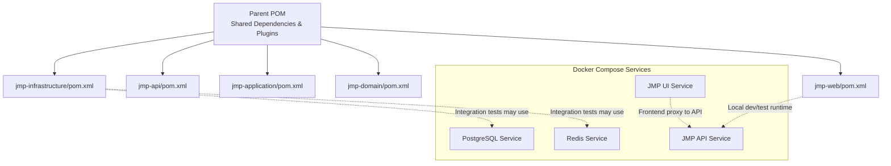
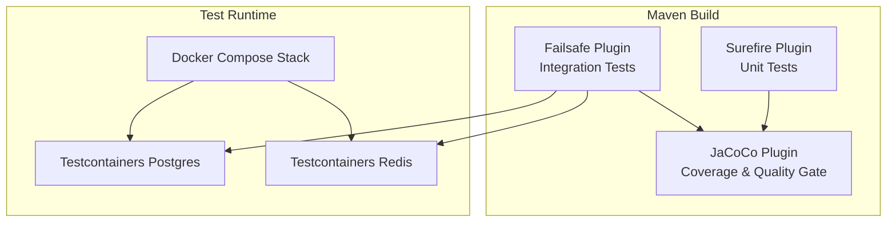
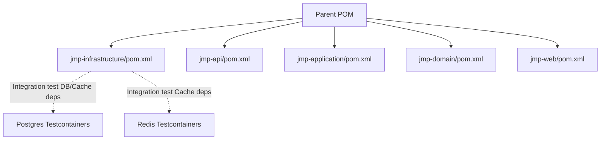

# Test Configuration and Setup

<cite>
**Referenced Files in This Document**
- [pom.xml](file://pom.xml)
- [docker-compose.yml](file://docker-compose.yml)
- [jmp-api/pom.xml](file://jmp-api/pom.xml)
- [jmp-application/pom.xml](file://jmp-application/pom.xml)
- [jmp-domain/pom.xml](file://jmp-domain/pom.xml)
- [jmp-infrastructure/pom.xml](file://jmp-infrastructure/pom.xml)
- [jmp-web/pom.xml](file://jmp-web/pom.xml)
- [VksQoderApplicationTests.java](file://src/test/java/com/example/vksqoder/VksQoderApplicationTests.java)
</cite>

## Table of Contents
1. [Introduction](#introduction)
2. [Project Structure](#project-structure)
3. [Core Components](#core-components)
4. [Architecture Overview](#architecture-overview)
5. [Detailed Component Analysis](#detailed-component-analysis)
6. [Dependency Analysis](#dependency-analysis)
7. [Performance Considerations](#performance-considerations)
8. [Troubleshooting Guide](#troubleshooting-guide)
9. [Conclusion](#conclusion)
10. [Appendices](#appendices)

## Introduction
This document describes the test configuration and setup for the Jitsi Management Platform (JMP). It covers Maven test dependencies and plugins, test execution settings, Testcontainers configuration for database and cache testing, Docker Compose-based test environments, environment-specific test properties, code coverage with JaCoCo, test reporting, quality gates, test profiles, parallel execution, selective filtering, test data management, fixtures, database cleanup strategies, environment isolation, shared test resources, performance optimization, and CI/CD integration guidelines.

## Project Structure
The project is a multi-module Maven build with a parent POM orchestrating shared test dependencies, plugins, and profiles. Each module defines its own dependencies and test scope. A Docker Compose stack provisions Postgres and Redis for integration-style tests and local development.

**Diagram sources**
- [pom.xml:40-46](file://pom.xml#L40-L46)
- [docker-compose.yml:6-71](file://docker-compose.yml#L6-L71)

**Section sources**
- [pom.xml:40-46](file://pom.xml#L40-L46)
- [docker-compose.yml:6-71](file://docker-compose.yml#L6-L71)

## Core Components
- Shared test dependencies and BOMs are declared in the parent POM for consistent versions across modules.
- Surefire and Failsafe plugins are configured at the parent level for unit and integration tests respectively.
- JaCoCo is configured globally with prepare-agent, report generation, and quality gate thresholds.
- Profiles define environment activation for tests and local runs.

Key capabilities:
- Centralized test dependency management via dependencyManagement and dependency declarations.
- Standardized plugin configuration for consistent test execution across modules.
- Quality gates enforced via JaCoCo check rules.
- Environment profiles for dev/prod activation.

**Section sources**
- [pom.xml:79-167](file://pom.xml#L79-L167)
- [pom.xml:202-265](file://pom.xml#L202-L265)
- [pom.xml:267-311](file://pom.xml#L267-L311)
- [pom.xml:314-330](file://pom.xml#L314-L330)

## Architecture Overview
The test architecture leverages:
- Maven lifecycle with Surefire/Failsafe for unit/integration tests.
- JaCoCo for coverage and quality gates.
- Testcontainers for ephemeral Postgres and Redis during integration tests.
- Docker Compose for reproducible test environments.

**Diagram sources**
- [pom.xml:235-245](file://pom.xml#L235-L245)
- [pom.xml:247-251](file://pom.xml#L247-L251)
- [pom.xml:267-311](file://pom.xml#L267-L311)
- [docker-compose.yml:8-41](file://docker-compose.yml#L8-L41)

## Detailed Component Analysis

### Maven Test Dependencies and Plugin Configuration
- Parent POM centralizes:
  - Test starter, Spring Security test, JUnit Jupiter, AssertJ, and Testcontainers JUnit Jupiter.
  - Testcontainers BOM import for coordinated versions.
  - Surefire, Failsafe, JaCoCo, SpotBugs, and Checkstyle plugin versions.
- Module POMs declare module-specific dependencies but inherit shared test configuration from the parent.

Best practices:
- Keep versions centralized in the parent for consistency.
- Use dependencyManagement for shared dependency versions.
- Prefer Testcontainers for deterministic, isolated integration tests.

**Section sources**
- [pom.xml:169-199](file://pom.xml#L169-L199)
- [pom.xml:151-158](file://pom.xml#L151-L158)
- [pom.xml:202-265](file://pom.xml#L202-L265)

### Testcontainers Configuration for Database and Cache Testing
- Postgres and Redis Testcontainers dependencies are declared in the infrastructure module for integration tests.
- Docker Compose provides a ready-to-use environment for local development and CI jobs requiring database and cache services.

Guidelines:
- Use Testcontainers for ephemeral databases and caches in integration tests.
- For local runs, rely on Docker Compose services to avoid manual setup.
- Configure JDBC URLs and Redis connections in test properties to target Testcontainers or Compose services.

**Section sources**
- [jmp-infrastructure/pom.xml:134-146](file://jmp-infrastructure/pom.xml#L134-L146)
- [docker-compose.yml:8-41](file://docker-compose.yml#L8-L41)

### Docker Compose Setup for Test Environments
Compose defines:
- Postgres with health checks and persistent volumes.
- Redis with health checks and persistence.
- JMP API service with environment variables for database and Redis connectivity.
- Optional frontend and monitoring services for end-to-end scenarios.

Usage tips:
- Start the stack before running integration tests.
- Use service names and exposed ports consistently in test configuration.
- Health checks ensure services are ready before tests execute.

**Section sources**
- [docker-compose.yml:6-71](file://docker-compose.yml#L6-L71)

### Environment-Specific Test Properties
- Profiles activate dev/prod environments via spring.profiles.active.
- Docker Compose sets SPRING_PROFILES_ACTIVE and database/Redis connection properties for the API service.
- Integration tests should align with these environment variables and connection settings.

Recommendations:
- Define separate property files per profile for test environments.
- Externalize secrets and credentials for CI/CD using secure variable injection.
- Keep test-specific overrides minimal and explicit.

**Section sources**
- [pom.xml:314-330](file://pom.xml#L314-L330)
- [docker-compose.yml:49-56](file://docker-compose.yml#L49-L56)

### Code Coverage Configuration Using JaCoCo
- JaCoCo is configured with:
  - prepare-agent goal attached to the test phase.
  - report goal executed after tests.
  - check goals enforcing minimum coverage thresholds for lines and branches.
- These settings are inherited by modules unless overridden.

Operational notes:
- Reports are generated post-test execution.
- Quality gate failures block builds if thresholds are not met.
- Adjust thresholds per module if necessary, but maintain consistency across the project.

**Section sources**
- [pom.xml:267-311](file://pom.xml#L267-L311)

### Test Reporting Setup
- Surefire and Failsafe manage unit and integration test reports respectively.
- JaCoCo generates coverage reports after tests complete.
- Combine these outputs to produce consolidated artifacts for CI/CD.

Recommendations:
- Archive Surefire/Failsafe XML reports and JaCoCo HTML/XML reports.
- Integrate with CI systems to publish reports and enforce quality gates.

**Section sources**
- [pom.xml:235-245](file://pom.xml#L235-L245)
- [pom.xml:247-251](file://pom.xml#L247-L251)

### Quality Gate Integration
- JaCoCo check enforces minimum coverage thresholds for line and branch coverage.
- Failures halt the build, ensuring quality standards are met.

Guidance:
- Monitor coverage trends and adjust thresholds gradually.
- Focus on critical paths and integration boundaries for coverage improvements.

**Section sources**
- [pom.xml:284-309](file://pom.xml#L284-L309)

### Test Profiles, Parallel Execution, and Selective Filtering
- Profiles:
  - dev (default) activates dev profile.
  - prod activates prod profile.
- Parallel execution:
  - Configure threadCount and parallel modes in Surefire/Failsafe plugin configurations.
  - Ensure tests are stateless and isolated to prevent flakiness.
- Selective filtering:
  - Use includes/excludes patterns in Surefire/Failsafe.
  - Leverage tags or naming conventions to group tests (e.g., @Tag("integration")).

Note: The current parent POM does not specify parallel or filtering settings; configure them per module or via Maven settings as needed.

**Section sources**
- [pom.xml:314-330](file://pom.xml#L314-L330)

### Test Data Management, Fixtures, and Database Cleanup
- Test data strategies:
  - Use Testcontainers Postgres for clean, isolated schemas per test run.
  - Employ Flyway within containers to apply migrations for consistent schemas.
  - Load fixtures via SQL scripts or programmatic initialization in @BeforeEach hooks.
- Cleanup:
  - Truncate or drop tables after tests.
  - Use @Commit/@Rollback semantics where appropriate.
  - For long-running integration suites, consider per-test databases or schemas.

Recommendations:
- Keep test data small and deterministic.
- Use factories or builders for generating test entities.
- Avoid cross-test dependencies and shared mutable state.

[No sources needed since this section provides general guidance]

### Testing Environment Isolation and Shared Resources
- Isolation:
  - Use Testcontainers to spin up isolated Postgres/Redis instances per suite or per test.
  - Assign random free ports and unique database/schema names to avoid conflicts.
- Shared resources:
  - Reuse a single Testcontainers instance across tests within a suite if acceptable latency is ensured.
  - Prefer ephemeral resources for stronger isolation guarantees.

[No sources needed since this section provides general guidance]

### Test Performance Optimization
- Run unit tests in parallel with controlled concurrency.
- Use lightweight embedded alternatives for fast unit tests.
- Minimize network calls and external dependencies in unit tests.
- For integration tests, reuse containers across tests and optimize schema initialization.

[No sources needed since this section provides general guidance]

### CI/CD Integration Guidelines
- Build pipeline stages:
  - Compile and test (unit).
  - Integration tests against Testcontainers or Docker Compose services.
  - Publish coverage reports and test results.
  - Enforce JaCoCo quality gates.
- Secrets and configuration:
  - Inject database credentials and JWT secrets via CI variables.
  - Use Docker Compose override files for CI-specific service configuration.
- Artifact retention:
  - Archive Surefire/Failsafe reports and JaCoCo reports for traceability.

[No sources needed since this section provides general guidance]

## Dependency Analysis
This section maps test-related dependencies across modules and highlights coupling.

**Diagram sources**
- [pom.xml:40-46](file://pom.xml#L40-L46)
- [jmp-infrastructure/pom.xml:134-146](file://jmp-infrastructure/pom.xml#L134-L146)

**Section sources**
- [pom.xml:40-46](file://pom.xml#L40-L46)
- [jmp-infrastructure/pom.xml:134-146](file://jmp-infrastructure/pom.xml#L134-L146)

## Performance Considerations
- Favor Testcontainers for deterministic, reproducible environments.
- Use Docker Compose for multi-service integration tests to reduce cold-start overhead.
- Optimize test data volume and schema initialization time.
- Parallelize unit tests while ensuring thread safety and resource isolation.

[No sources needed since this section provides general guidance]

## Troubleshooting Guide
Common issues and resolutions:
- Tests fail due to missing database or cache:
  - Ensure Docker Compose is running or Testcontainers are started before tests.
  - Verify JDBC and Redis URLs match container hostnames and ports.
- JaCoCo quality gate fails:
  - Increase coverage in under-tested modules or adjust thresholds cautiously.
  - Confirm JaCoCo agent is attached and report is generated.
- Flaky integration tests:
  - Add retry logic or backoff strategies for external services.
  - Use @DirtiesContext or per-test containers to eliminate cross-test interference.

[No sources needed since this section provides general guidance]

## Conclusion
The JMP project employs a centralized Maven configuration for consistent test dependencies, plugins, and quality gates. Testcontainers and Docker Compose enable robust, isolated integration testing. JaCoCo ensures coverage quality, while profiles and environment variables support flexible test execution across environments. Adopting the recommended practices around data management, isolation, and CI/CD integration will improve reliability and maintainability of the test suite.

[No sources needed since this section summarizes without analyzing specific files]

## Appendices

### Example Test Execution Commands
- Unit tests: mvn test
- Integration tests: mvn verify
- Coverage report: mvn test jacoco:report
- Quality gate enforcement: mvn test jacoco:check

[No sources needed since this section provides general guidance]

### Minimal Test Class Example Reference
- A basic Spring Boot test class exists in the root module for context loading verification.

**Section sources**
- [VksQoderApplicationTests.java:1-14](file://src/test/java/com/example/vksqoder/VksQoderApplicationTests.java#L1-L14)