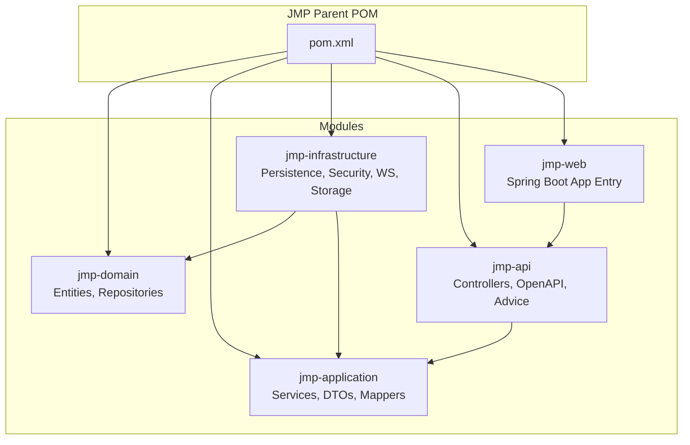
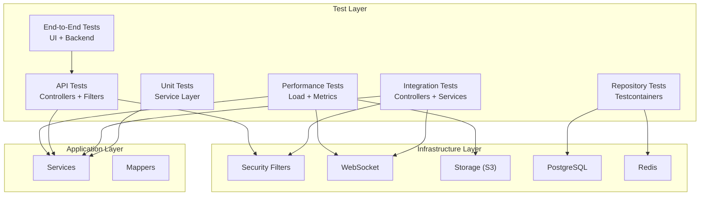
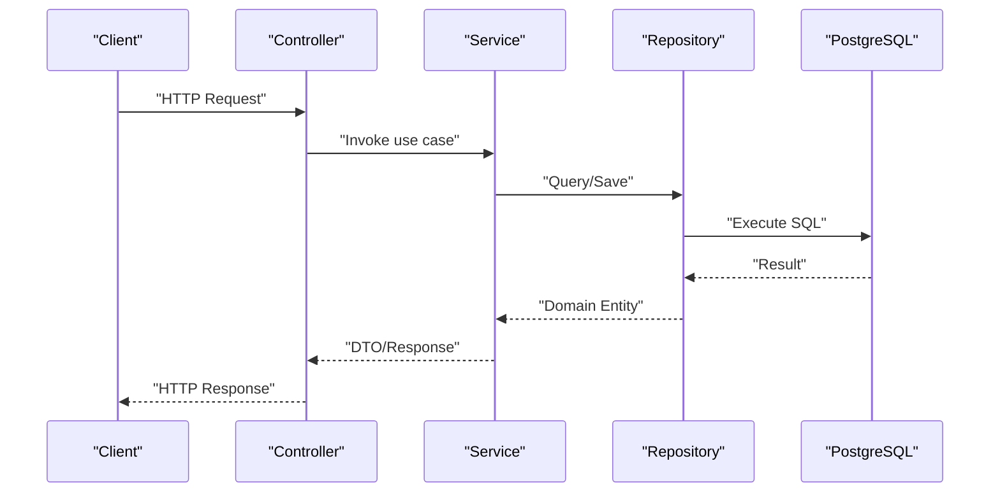
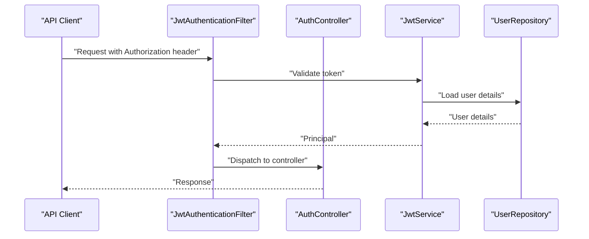
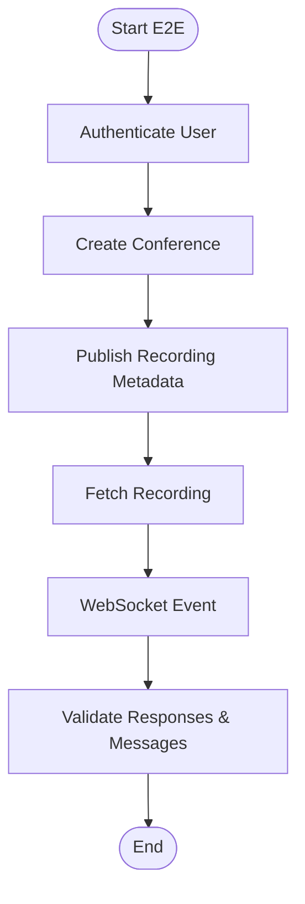
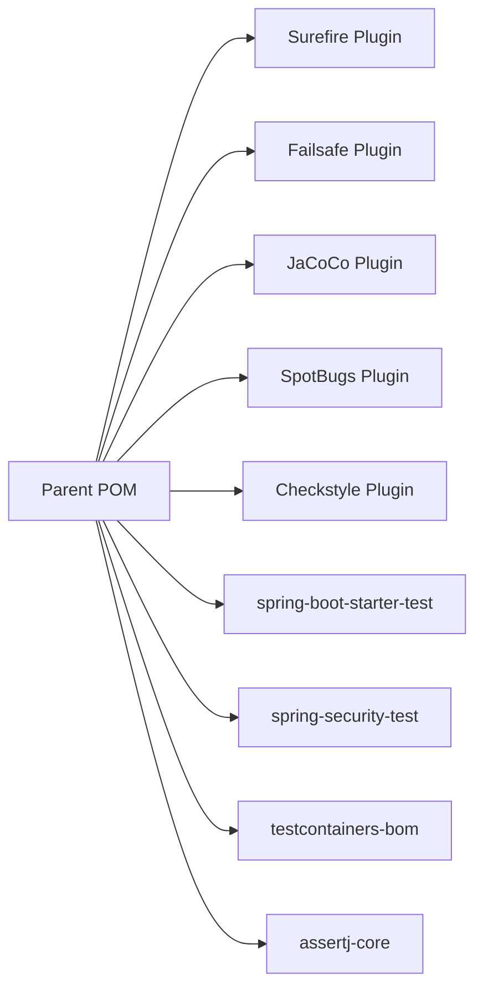

# Testing Strategy

<cite>
**Referenced Files in This Document**
- [pom.xml](file://pom.xml)
- [docker-compose.yml](file://docker-compose.yml)
- [application.yml](file://jmp-web/src/main/resources/application.yml)
- [VksQoderApplicationTests.java](file://src/test/java/com/example/vksqoder/VksQoderApplicationTests.java)
- [JmpApplication.java](file://jmp-web/src/main/java/com/jmp/web/JmpApplication.java)
- [SecurityConfig.java](file://jmp-infrastructure/src/main/java/com/jmp/infrastructure/security/SecurityConfig.java)
- [JwtAuthenticationFilter.java](file://jmp-infrastructure/src/main/java/com/jmp/infrastructure/security/JwtAuthenticationFilter.java)
- [WebSocketConfig.java](file://jmp-infrastructure/src/main/java/com/jmp/infrastructure/websocket/WebSocketConfig.java)
- [RealtimeEventService.java](file://jmp-infrastructure/src/main/java/com/jmp/infrastructure/websocket/RealtimeEventService.java)
- [ConferenceRepository.java](file://jmp-domain/src/main/java/com/jmp/domain/repository/ConferenceRepository.java)
- [RecordingRepository.java](file://jmp-domain/src/main/java/com/jmp/domain/repository/RecordingRepository.java)
- [AuditLogRepository.java](file://jmp-domain/src/main/java/com/jmp/domain/repository/AuditLogRepository.java)
- [ConferenceService.java](file://jmp-application/src/main/java/com/jmp/application/service/ConferenceService.java)
- [RecordingService.java](file://jmp-application/src/main/java/com/jmp/application/service/RecordingService.java)
- [AnalyticsService.java](file://jmp-application/src/main/java/com/jmp/application/service/AnalyticsService.java)
- [AuditService.java](file://jmp-application/src/main/java/com/jmp/application/service/AuditService.java)
- [UserService.java](file://jmp-application/src/main/java/com/jmp/application/service/UserService.java)
- [SsoService.java](file://jmp-application/src/main/java/com/jmp/application/service/SsoService.java)
- [StorageService.java](file://jmp-application/src/main/java/com/jmp/application/service/StorageService.java)
- [JwtService.java](file://jmp-application/src/main/java/com/jmp/application/service/JwtService.java)
- [ConferenceController.java](file://jmp-api/src/main/java/com/jmp/api/controller/ConferenceController.java)
- [RecordingController.java](file://jmp-api/src/main/java/com/jmp/api/controller/RecordingController.java)
- [AnalyticsController.java](file://jmp-api/src/main/java/com/jmp/api/controller/AnalyticsController.java)
- [AuditController.java](file://jmp-api/src/main/java/com/jmp/api/controller/AuditController.java)
- [UserController.java](file://jmp-api/src/main/java/com/jmp/api/controller/UserController.java)
- [SsoController.java](file://jmp-api/src/main/java/com/jmp/api/controller/SsoController.java)
- [AuthController.java](file://jmp-api/src/main/java/com/jmp/api/controller/AuthController.java)
- [JitsiWebhookController.java](file://jmp-api/src/main/java/com/jmp/api/controller/JitsiWebhookController.java)
- [OpenApiConfig.java](file://jmp-api/src/main/java/com/jmp/api/config/OpenApiConfig.java)
- [GlobalExceptionHandler.java](file://jmp-api/src/main/java/com/jmp/api/advice/GlobalExceptionHandler.java)
- [S3StorageService.java](file://jmp-infrastructure/src/main/java/com/jmp/infrastructure/storage/S3StorageService.java)
- [persistence/pom.xml](file://jmp-infrastructure/src/main/java/com/jmp/infrastructure/persistence/pom.xml)
- [S3StorageService.java (infrastructure)](file://jmp-infrastructure/src/main/java/com/jmp/infrastructure/storage/S3StorageService.java)
</cite>

## Table of Contents
1. [Introduction](#introduction)
2. [Project Structure](#project-structure)
3. [Core Components](#core-components)
4. [Architecture Overview](#architecture-overview)
5. [Detailed Component Analysis](#detailed-component-analysis)
6. [Dependency Analysis](#dependency-analysis)
7. [Performance Considerations](#performance-considerations)
8. [Troubleshooting Guide](#troubleshooting-guide)
9. [Conclusion](#conclusion)
10. [Appendices](#appendices)

## Introduction
This document defines a comprehensive testing strategy for the Jitsi Management Platform (JMP). It covers unit testing for service layers, repository testing with Testcontainers, integration testing, API testing, end-to-end scenarios, performance testing, security testing, and database testing strategies. It also outlines best practices for Spring Boot applications, continuous integration pipelines, quality gates, and specialized testing for real-time communication and external service integrations.

## Project Structure
The project is a multi-module Maven application organized into domain, application, infrastructure, API, and web layers. Each module encapsulates responsibilities aligned with clean architecture principles, enabling focused testing per layer.

**Diagram sources**
- [pom.xml:40-46](file://pom.xml#L40-L46)

**Section sources**
- [pom.xml:40-46](file://pom.xml#L40-L46)

## Core Components
Key testing components and their roles:
- Unit tests for services: Validate business logic, exception handling, and interactions with repositories and external services.
- Repository tests with Testcontainers: Use PostgreSQL and Redis containers for integration-like tests without full orchestration.
- Integration tests: Validate end-to-end flows across controllers, services, persistence, and infrastructure.
- API tests: Validate REST endpoints, request/response contracts, and security filters.
- Real-time and WebSocket tests: Validate event publishing and client subscriptions.
- External service tests: Validate S3 storage and JWT signing/verification flows.

**Section sources**
- [pom.xml:178-198](file://pom.xml#L178-L198)
- [docker-compose.yml:1-129](file://docker-compose.yml#L1-L129)

## Architecture Overview
The testing architecture aligns with the layered design, ensuring isolation and determinism via mocks, Testcontainers, and controlled environments.

**Diagram sources**
- [pom.xml:134-146](file://pom.xml#L134-L146)
- [application.yml:12-56](file://jmp-web/src/main/resources/application.yml#L12-L56)
- [docker-compose.yml:7-71](file://docker-compose.yml#L7-L71)

## Detailed Component Analysis

### Unit Testing Strategies for Service Layers
- Service classes under application module encapsulate business logic and depend on repositories and external services. Tests should:
  - Mock repositories and external services to isolate business logic.
  - Verify method invocations, argument matchers, and return values.
  - Assert thrown exceptions and guard conditions.
  - Validate DTO mapping correctness via mappers.

Recommended patterns:
- Use @MockBean for repository and external service dependencies.
- Use @InjectMocks for the service under test.
- Prefer AssertJ assertions for readable and expressive checks.
- Parameterized tests for boundary conditions and invalid inputs.

Coverage targets:
- Line coverage ≥ 80%, Branch coverage ≥ 70% (enforced by JaCoCo in parent POM).

**Section sources**
- [pom.xml:286-308](file://pom.xml#L286-L308)
- [ConferenceService.java](file://jmp-application/src/main/java/com/jmp/application/service/ConferenceService.java)
- [RecordingService.java](file://jmp-application/src/main/java/com/jmp/application/service/RecordingService.java)
- [AnalyticsService.java](file://jmp-application/src/main/java/com/jmp/application/service/AnalyticsService.java)
- [AuditService.java](file://jmp-application/src/main/java/com/jmp/application/service/AuditService.java)
- [UserService.java](file://jmp-application/src/main/java/com/jmp/application/service/UserService.java)
- [SsoService.java](file://jmp-application/src/main/java/com/jmp/application/service/SsoService.java)
- [StorageService.java](file://jmp-application/src/main/java/com/jmp/application/service/StorageService.java)
- [JwtService.java](file://jmp-application/src/main/java/com/jmp/application/service/JwtService.java)

### Repository Testing with Testcontainers
- Use Testcontainers for PostgreSQL and Redis to validate repository queries and transactions.
- Configure container lifecycle in @BeforeEach/@AfterEach or @Container-scoped lifecycle.
- Seed minimal test data via Flyway migrations or SQL scripts.
- Validate CRUD operations, JPQL/HQL correctness, and transaction boundaries.

Best practices:
- Use @ServiceContext with @DirtiesContext sparingly; prefer lightweight containers and deterministic seeds.
- Keep tests fast; avoid heavy fixtures.
- Isolate schema usage per test suite or container.

**Section sources**
- [pom.xml:151-158](file://pom.xml#L151-L158)
- [pom.xml:134-146](file://pom.xml#L134-L146)
- [application.yml:39-43](file://jmp-web/src/main/resources/application.yml#L39-L43)
- [docker-compose.yml:7-42](file://docker-compose.yml#L7-L42)

### Integration Testing Approaches
- Validate end-to-end flows across controllers, services, persistence, and infrastructure.
- Use @SpringBootTest with test-specific profiles and property overrides.
- Employ @AutoConfigureTestDatabase and replaceDataSource to use Testcontainers-backed databases.
- Test security filters, WebSocket handshake, and real-time event delivery.

**Diagram sources**
- [ConferenceController.java](file://jmp-api/src/main/java/com/jmp/api/controller/ConferenceController.java)
- [ConferenceService.java](file://jmp-application/src/main/java/com/jmp/application/service/ConferenceService.java)
- [ConferenceRepository.java](file://jmp-domain/src/main/java/com/jmp/domain/repository/ConferenceRepository.java)

**Section sources**
- [pom.xml:178-198](file://pom.xml#L178-L198)
- [application.yml:9-11](file://jmp-web/src/main/resources/application.yml#L9-L11)

### API Testing Methodologies
- Controllers expose REST endpoints for conferences, recordings, analytics, audit logs, users, SSO, authentication, and Jitsi webhooks.
- API tests should validate:
  - HTTP status codes and response bodies.
  - OpenAPI documentation availability and correctness.
  - Global exception handling behavior.
  - Security filter enforcement (authentication and authorization).

**Diagram sources**
- [AuthController.java](file://jmp-api/src/main/java/com/jmp/api/controller/AuthController.java)
- [JwtAuthenticationFilter.java](file://jmp-infrastructure/src/main/java/com/jmp/infrastructure/security/JwtAuthenticationFilter.java)
- [JwtService.java](file://jmp-application/src/main/java/com/jmp/application/service/JwtService.java)
- [UserService.java](file://jmp-application/src/main/java/com/jmp/application/service/UserService.java)

**Section sources**
- [OpenApiConfig.java](file://jmp-api/src/main/java/com/jmp/api/config/OpenApiConfig.java)
- [GlobalExceptionHandler.java](file://jmp-api/src/main/java/com/jmp/api/advice/GlobalExceptionHandler.java)
- [SecurityConfig.java](file://jmp-infrastructure/src/main/java/com/jmp/infrastructure/security/SecurityConfig.java)

### End-to-End Testing Scenarios
- Scenario: Conference creation and recording retrieval.
  - Steps: Authenticate, create conference, publish recording metadata, fetch recording.
  - Assertions: Status codes, payload fields, JWT validity, audit log entries.
- Scenario: Real-time notifications via WebSocket.
  - Steps: Establish WebSocket session, trigger event, receive message.
  - Assertions: Message content, subscription routing, authentication interception.

**Diagram sources**
- [ConferenceController.java](file://jmp-api/src/main/java/com/jmp/api/controller/ConferenceController.java)
- [RecordingController.java](file://jmp-api/src/main/java/com/jmp/api/controller/RecordingController.java)
- [WebSocketConfig.java](file://jmp-infrastructure/src/main/java/com/jmp/infrastructure/websocket/WebSocketConfig.java)
- [RealtimeEventService.java](file://jmp-infrastructure/src/main/java/com/jmp/infrastructure/websocket/RealtimeEventService.java)

**Section sources**
- [docker-compose.yml:43-87](file://docker-compose.yml#L43-L87)

### Performance Testing Approaches
- Load testing: Use tools to simulate concurrent users performing CRUD operations, JWT issuance, and WebSocket subscriptions.
- Metrics: Leverage Actuator and Prometheus for throughput, latency, error rates, and resource utilization.
- Database tuning: Validate batch sizes, connection pooling, and Flyway migrations impact under load.
- External services: Measure S3 upload/download latencies and resilience under failure modes.

**Section sources**
- [application.yml:92-112](file://jmp-web/src/main/resources/application.yml#L92-L112)
- [docker-compose.yml:88-119](file://docker-compose.yml#L88-L119)

### Security Testing
- Authentication and authorization:
  - Validate JWT token generation, expiration, and verification.
  - Ensure JwtAuthenticationFilter enforces protected routes.
  - Test unauthorized and malformed token scenarios.
- Authorization:
  - Validate role-based access controls for sensitive endpoints.
- Penetration testing:
  - Validate CSRF protection, CORS policies, and secure headers.
  - Test brute-force resistance and rate-limiting integration.

**Section sources**
- [SecurityConfig.java](file://jmp-infrastructure/src/main/java/com/jmp/infrastructure/security/SecurityConfig.java)
- [JwtAuthenticationFilter.java](file://jmp-infrastructure/src/main/java/com/jmp/infrastructure/security/JwtAuthenticationFilter.java)
- [JwtService.java](file://jmp-application/src/main/java/com/jmp/application/service/JwtService.java)

### Database Testing Strategies
- Schema validation and migrations:
  - Use Flyway to manage schema evolution; validate migrations in CI.
  - Test DDL auto settings and schema alignment.
- Transaction and concurrency:
  - Validate optimistic locking, retry policies, and deadlock handling.
- Data seeding:
  - Use test-specific seed data for deterministic scenarios.
- Containerized Postgres:
  - Use Testcontainers for reliable, isolated database tests.

**Section sources**
- [application.yml:39-43](file://jmp-web/src/main/resources/application.yml#L39-L43)
- [pom.xml:134-139](file://pom.xml#L134-L139)

### WebSocket Testing
- Validate handshake, authentication interception, and message routing.
- Simulate multiple clients and broadcast scenarios.
- Test reconnection and message ordering guarantees.

**Section sources**
- [WebSocketConfig.java](file://jmp-infrastructure/src/main/java/com/jmp/infrastructure/websocket/WebSocketConfig.java)
- [RealtimeEventService.java](file://jmp-infrastructure/src/main/java/com/jmp/infrastructure/websocket/RealtimeEventService.java)

### External Service Integration Testing
- S3 storage:
  - Validate upload, download, and delete operations.
  - Test error handling for network failures and permission issues.
- JWT and identity providers:
  - Validate token signing and verification.
  - Test SSO flows and provider integration.

**Section sources**
- [S3StorageService.java](file://jmp-infrastructure/src/main/java/com/jmp/infrastructure/storage/S3StorageService.java)
- [JwtService.java](file://jmp-application/src/main/java/com/jmp/application/service/JwtService.java)
- [SsoService.java](file://jmp-application/src/main/java/com/jmp/application/service/SsoService.java)

## Dependency Analysis
Testing dependencies and plugins are centralized in the parent POM, ensuring consistent tooling across modules.

**Diagram sources**
- [pom.xml:201-265](file://pom.xml#L201-L265)
- [pom.xml:178-198](file://pom.xml#L178-L198)
- [pom.xml:151-158](file://pom.xml#L151-L158)

**Section sources**
- [pom.xml:201-265](file://pom.xml#L201-L265)
- [pom.xml:178-198](file://pom.xml#L178-L198)

## Performance Considerations
- Favor lightweight containers for tests; reuse containers when feasible.
- Use deterministic seeds and controlled datasets to reduce flakiness.
- Monitor memory and CPU during tests; adjust pool sizes accordingly.
- Integrate metrics collection for long-running tests.

[No sources needed since this section provides general guidance]

## Troubleshooting Guide
Common issues and resolutions:
- Test flakiness due to timing:
  - Use bounded retries and deterministic waits.
  - Prefer container-based services with health checks.
- Database schema mismatch:
  - Run migrations before tests; validate schema with DDL auto set to validate.
- Missing coverage:
  - Enforce JaCoCo thresholds; review uncovered branches and lines.
- Security misconfiguration:
  - Verify security filters and JWT configuration in test profiles.

**Section sources**
- [pom.xml:286-308](file://pom.xml#L286-L308)
- [application.yml:24-27](file://jmp-web/src/main/resources/application.yml#L24-L27)

## Conclusion
A robust testing strategy for JMP combines unit, repository, integration, API, real-time, and performance testing. Centralized tooling via Maven plugins ensures consistency, while Testcontainers and container orchestration provide reliable integration environments. Security and external service testing are integrated throughout the pipeline to maintain quality and reliability.

[No sources needed since this section summarizes without analyzing specific files]

## Appendices

### Test Coverage Requirements
- Enforce minimum coverage via JaCoCo:
  - Line coverage ≥ 80%
  - Branch coverage ≥ 70%

**Section sources**
- [pom.xml:286-308](file://pom.xml#L286-L308)

### Continuous Integration Testing Pipelines
- Build and test matrix:
  - Unit tests: Surefire
  - Integration tests: Failsafe
  - Coverage: JaCoCo report + check
  - Static analysis: SpotBugs, Checkstyle
- Orchestration:
  - Use docker-compose for local development and CI jobs requiring external services.

**Section sources**
- [pom.xml:235-265](file://pom.xml#L235-L265)
- [docker-compose.yml:1-129](file://docker-compose.yml#L1-L129)

### Quality Gates
- Gate checks:
  - JaCoCo coverage thresholds
  - Static analysis violations
  - Test execution success
- Remediation:
  - Fail builds on threshold breaches; require fixes before merge.

**Section sources**
- [pom.xml:286-308](file://pom.xml#L286-L308)
- [pom.xml:253-263](file://pom.xml#L253-L263)

### Guidelines for Writing Effective Tests
- Keep tests small, focused, and deterministic.
- Use descriptive names and arrange steps clearly.
- Prefer AssertJ for expressive assertions.
- Mock external systems; use Testcontainers for integration.
- Maintain test data hygiene and cleanup.

[No sources needed since this section provides general guidance]

### Debugging Test Failures
- Enable debug logging for failing modules.
- Capture request/response traces and metrics.
- Validate environment variables and profile activation.
- Inspect container health and logs in CI.

**Section sources**
- [application.yml:80-88](file://jmp-web/src/main/resources/application.yml#L80-L88)
- [docker-compose.yml:19-23](file://docker-compose.yml#L19-L23)

### Maintaining Test Suites
- Regular refactoring of slow or brittle tests.
- Keep container images updated; pin versions in CI.
- Document test assumptions and environment prerequisites.

[No sources needed since this section provides general guidance]