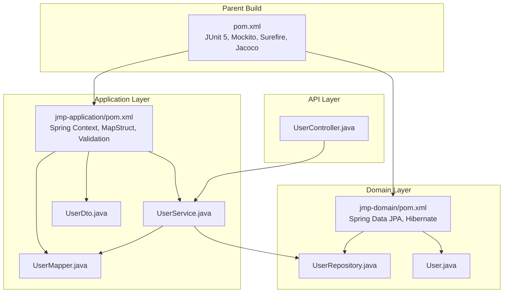
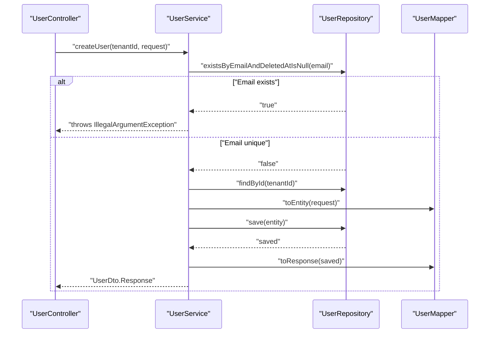
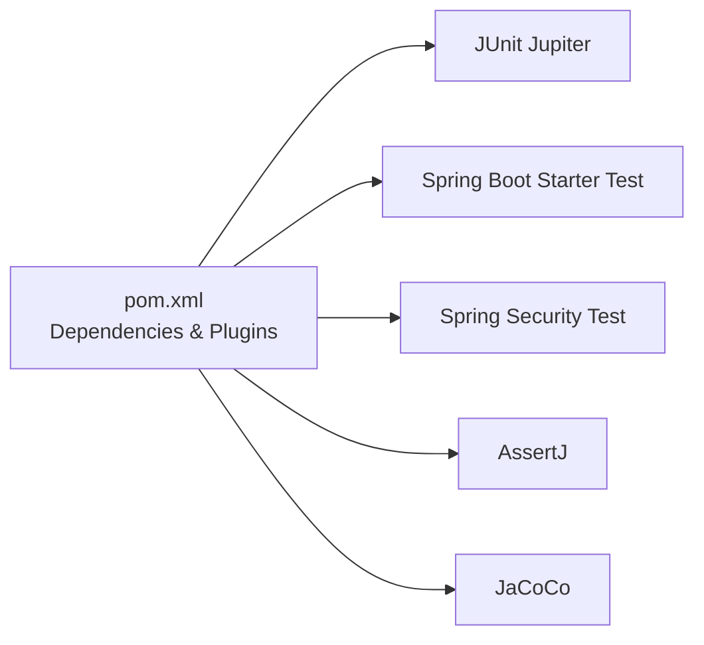

# Unit Testing

<cite>
**Referenced Files in This Document**
- [pom.xml](file://pom.xml)
- [jmp-application/pom.xml](file://jmp-application/pom.xml)
- [UserService.java](file://jmp-application/src/main/java/com/jmp/application/service/UserService.java)
- [UserDto.java](file://jmp-application/src/main/java/com/jmp/application/dto/UserDto.java)
- [UserMapper.java](file://jmp-application/src/main/java/com/jmp/application/mapper/UserMapper.java)
- [UserRepository.java](file://jmp-domain/src/main/java/com/jmp/domain/repository/UserRepository.java)
- [User.java](file://jmp-domain/src/main/java/com/jmp/domain/entity/User.java)
- [UserController.java](file://jmp-api/src/main/java/com/jmp/api/controller/UserController.java)
</cite>

## Table of Contents
1. [Introduction](#introduction)
2. [Project Structure](#project-structure)
3. [Core Components](#core-components)
4. [Architecture Overview](#architecture-overview)
5. [Detailed Component Analysis](#detailed-component-analysis)
6. [Dependency Analysis](#dependency-analysis)
7. [Performance Considerations](#performance-considerations)
8. [Troubleshooting Guide](#troubleshooting-guide)
9. [Conclusion](#conclusion)
10. [Appendices](#appendices)

## Introduction
This document provides a comprehensive guide to implementing unit tests for the Jitsi Management Platform (JMP). It focuses on the service layer, DTO validation, and mapper functionality, and outlines testing strategies for business logic, input validation, and exception handling. It also covers mock configurations for repositories and external integrations, test data management, assertion strategies, and guidelines for maintaining high-quality unit tests in a Spring Boot environment.

## Project Structure
The project is a multi-module Maven build with clear separation of concerns:
- jmp-domain: Entities, repositories, and domain events
- jmp-application: Services, DTOs, mappers, and validators
- jmp-infrastructure: Security, persistence, messaging, and storage
- jmp-api: REST controllers
- jmp-web: Spring Boot application entrypoint and resources

Testing dependencies and plugins are configured at the parent level, enabling consistent unit and integration testing across modules.

**Diagram sources**
- [pom.xml:169-199](file://pom.xml#L169-L199)
- [jmp-application/pom.xml:17-71](file://jmp-application/pom.xml#L17-L71)
- [UserService.java:1-190](file://jmp-application/src/main/java/com/jmp/application/service/UserService.java#L1-L190)
- [UserDto.java:1-97](file://jmp-application/src/main/java/com/jmp/application/dto/UserDto.java#L1-L97)
- [UserMapper.java:1-76](file://jmp-application/src/main/java/com/jmp/application/mapper/UserMapper.java#L1-L76)
- [UserRepository.java:1-82](file://jmp-domain/src/main/java/com/jmp/domain/repository/UserRepository.java#L1-L82)
- [User.java:1-164](file://jmp-domain/src/main/java/com/jmp/domain/entity/User.java#L1-L164)
- [UserController.java:1-123](file://jmp-api/src/main/java/com/jmp/api/controller/UserController.java#L1-L123)

**Section sources**
- [pom.xml:40-46](file://pom.xml#L40-L46)
- [pom.xml:169-199](file://pom.xml#L169-L199)
- [jmp-application/pom.xml:17-71](file://jmp-application/pom.xml#L17-L71)

## Core Components
This section identifies the primary units under test and their responsibilities:
- Service layer: Business orchestration, transaction boundaries, and cross-repository logic
- DTOs: Validation constraints and shape of request/response payloads
- Mappers: Mapping between domain entities and DTOs
- Repositories: Persistence contracts for domain entities
- Controllers: Orchestrate service calls and handle HTTP concerns

Key testing targets:
- Service method behavior under normal and exceptional conditions
- DTO validation constraints enforced by Jakarta Bean Validation
- Mapper correctness for bidirectional transformations
- Repository interactions via mocks to isolate business logic

**Section sources**
- [UserService.java:24-190](file://jmp-application/src/main/java/com/jmp/application/service/UserService.java#L24-L190)
- [UserDto.java:10-97](file://jmp-application/src/main/java/com/jmp/application/dto/UserDto.java#L10-L97)
- [UserMapper.java:14-76](file://jmp-application/src/main/java/com/jmp/application/mapper/UserMapper.java#L14-L76)
- [UserRepository.java:14-82](file://jmp-domain/src/main/java/com/jmp/domain/repository/UserRepository.java#L14-L82)
- [UserController.java:29-123](file://jmp-api/src/main/java/com/jmp/api/controller/UserController.java#L29-L123)

## Architecture Overview
The service layer coordinates between repositories and mappers while enforcing business rules. Controllers delegate to services and handle HTTP-specific concerns. Tests should focus on service-layer logic, validating:
- Transaction boundaries and rollback scenarios
- Cross-repository validations and cascading effects
- DTO-to-entity conversions and vice versa
- Exception propagation and error handling

**Diagram sources**
- [UserController.java:43-55](file://jmp-api/src/main/java/com/jmp/api/controller/UserController.java#L43-L55)
- [UserService.java:44-70](file://jmp-application/src/main/java/com/jmp/application/service/UserService.java#L44-L70)
- [UserRepository.java:42-42](file://jmp-domain/src/main/java/com/jmp/domain/repository/UserRepository.java#L42-L42)
- [UserMapper.java:31-46](file://jmp-application/src/main/java/com/jmp/application/mapper/UserMapper.java#L31-L46)

## Detailed Component Analysis

### Service Layer Testing: UserService
Focus areas:
- Transaction boundaries: Creation, updates, deletions, and login recording
- Cross-service validations: Email uniqueness, tenant existence, role resolution
- Exception handling: Throws meaningful exceptions for missing entities or invalid states
- Mapper integration: Ensures DTO-to-entity and response mapping correctness

Recommended test categories:
- Happy path: Successful creation, retrieval, update, listing, and deletion
- Validation failures: Duplicate email, missing tenant, invalid role names
- Boundary conditions: Empty role sets, null updates, soft-delete transitions
- Permission checks: Role-to-permission resolution and access control

Mock configuration tips:
- Mock UserRepository for existence checks, findById, save, and paginated queries
- Mock TenantRepository and RoleRepository for tenant and role resolution
- Mock UserMapper to isolate mapping behavior
- Use ArgumentMatchers for parameter verification and capture actual arguments for assertions

Assertion strategies:
- Verify repository interactions (save, findById, existsByEmail)
- Assert returned DTO fields match expectations
- Validate thrown exceptions and messages
- Confirm logging behavior using argument captors

**Section sources**
- [UserService.java:44-190](file://jmp-application/src/main/java/com/jmp/application/service/UserService.java#L44-L190)
- [UserRepository.java:18-82](file://jmp-domain/src/main/java/com/jmp/domain/repository/UserRepository.java#L18-L82)
- [UserMapper.java:18-76](file://jmp-application/src/main/java/com/jmp/application/mapper/UserMapper.java#L18-L76)

### DTO Validation Testing
Validation constraints:
- CreateRequest: Non-blank email, max-length name fields, minimum password length, optional role names
- UpdateRequest: Optional name fields and role names
- Response and Summary DTOs: Immutable records used for transport

Testing patterns:
- Positive cases: Valid DTO instances that satisfy all constraints
- Negative cases: Violate single constraint per test (e.g., blank email, too-short password)
- Group validation: Combine multiple violations in one payload
- Integration with service: Trigger service methods and assert validation errors propagate appropriately

**Section sources**
- [UserDto.java:27-95](file://jmp-application/src/main/java/com/jmp/application/dto/UserDto.java#L27-L95)

### Mapper Functionality Testing
Mapper responsibilities:
- Convert CreateRequest to User entity (ignoring derived fields)
- Update existing User from UpdateRequest (ignoring immutable fields)
- Map User to Response and Summary DTOs, including role name extraction
- Handle null-safe role mapping

Testing patterns:
- Entity-to-DTO: Verify all mapped fields and role name conversion
- DTO-to-Entity: Verify ignored fields remain unset, tenant association, and status defaults
- Partial updates: Ensure only provided fields are updated
- Edge cases: Null roles, empty role sets, missing tenant

**Section sources**
- [UserMapper.java:18-76](file://jmp-application/src/main/java/com/jmp/application/mapper/UserMapper.java#L18-L76)
- [User.java:23-164](file://jmp-domain/src/main/java/com/jmp/domain/entity/User.java#L23-L164)

### Repository Interaction Testing
Repository testing approach:
- Use @DataJpaTest or @ExtendWith(SpringExtension.class) with @MockBean for repositories
- Isolate service logic by mocking repositories and asserting interactions
- Validate JPQL queries and EntityGraph usage through controlled test data

Key interactions to verify:
- Existence checks for email uniqueness
- Tenant and role resolution via findById/findByName
- Paginated queries for listing and search
- Soft delete and status transitions

**Section sources**
- [UserRepository.java:18-82](file://jmp-domain/src/main/java/com/jmp/domain/repository/UserRepository.java#L18-L82)
- [User.java:110-122](file://jmp-domain/src/main/java/com/jmp/domain/entity/User.java#L110-L122)

### Controller Integration Patterns
While this document emphasizes unit testing, controller tests often complement service tests:
- Validate preconditions (security annotations, parameter extraction)
- Assert HTTP status codes and response bodies
- Use @WebMvcTest or @Import for focused controller testing

**Section sources**
- [UserController.java:29-123](file://jmp-api/src/main/java/com/jmp/api/controller/UserController.java#L29-L123)

## Dependency Analysis
Testing dependencies and plugins configured at the parent POM enable robust unit testing:
- JUnit Jupiter and Spring Boot Test for test framework and Spring context support
- Spring Security Test for security-aware tests
- AssertJ for fluent assertions
- JaCoCo for coverage reporting and enforcement

**Diagram sources**
- [pom.xml:169-199](file://pom.xml#L169-L199)
- [pom.xml:247-311](file://pom.xml#L247-L311)

**Section sources**
- [pom.xml:169-199](file://pom.xml#L169-L199)
- [pom.xml:247-311](file://pom.xml#L247-L311)

## Performance Considerations
- Keep tests fast: Use in-memory databases or lightweight test containers sparingly
- Minimize repository round-trips: Mock repositories to assert interactions precisely
- Favor deterministic inputs: Use fixed timestamps and UUIDs for reproducibility
- Avoid heavy initialization: Use @DirtiesContext only when necessary

## Troubleshooting Guide
Common issues and resolutions:
- Transaction boundary confusion: Ensure @Transactional tests are isolated; verify rollback behavior using @Commit/@Rollback or separate test slices
- Missing mocks: Always mock repositories and mappers injected into services
- DTO validation not triggered: Ensure tests exercise service methods that trigger validation (e.g., controller-to-service calls)
- Coverage gaps: Use JaCoCo reports to identify untested branches and paths

Measurement and enforcement:
- Configure JaCoCo in the parent POM to enforce coverage thresholds during CI builds
- Focus on branch coverage for decision points in service logic

**Section sources**
- [pom.xml:247-311](file://pom.xml#L247-L311)

## Conclusion
Effective unit testing in the Jitsi Management Platform centers on isolating service logic, validating DTO constraints, and ensuring mapper correctness. By leveraging mocks for repositories and external integrations, applying targeted assertion strategies, and enforcing coverage policies, teams can maintain reliable, readable, and maintainable tests that scale with the application.

## Appendices

### Test Organization Patterns
- One class, one responsibility: Separate tests for creation, retrieval, update, deletion, and permission checks
- Naming conventions: Use descriptive names indicating scenario, action, and expected outcome
- Fixture management: Create reusable builders or factories for DTOs and entities
- Shared setup: Use @BeforeEach to initialize mocks and shared test data

### Example Test Scenarios (Guidelines)
- Create user with valid input: Assert repository save invoked once, mapping successful, and response fields populated
- Create user with duplicate email: Assert IllegalArgumentException thrown and repository save not called
- Update user with partial fields: Assert only provided fields updated, roles resolved when supplied
- Delete user: Assert soft delete applied and persisted
- Search users: Assert repository query executed with correct parameters and paginated results mapped

### Assertion Strategies
- Verify interactions: Use verify() to confirm repository calls and argument matchers
- Assert DTO equality: Compare DTO fields against expected values
- Assert exceptions: Capture and validate exception types and messages
- Coverage: Enforce minimum line and branch coverage thresholds via JaCoCo