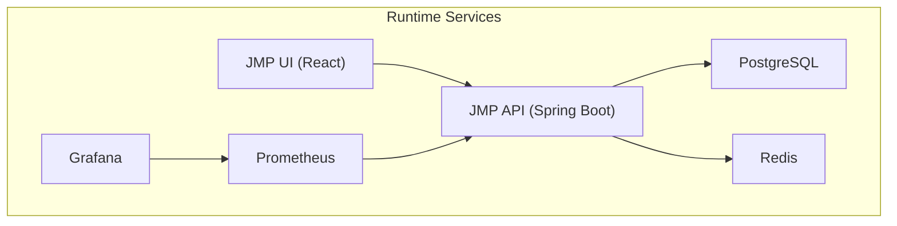
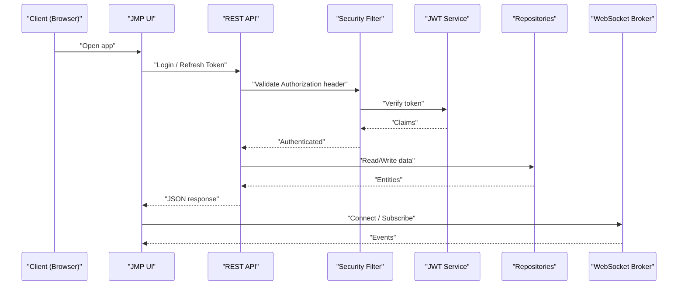
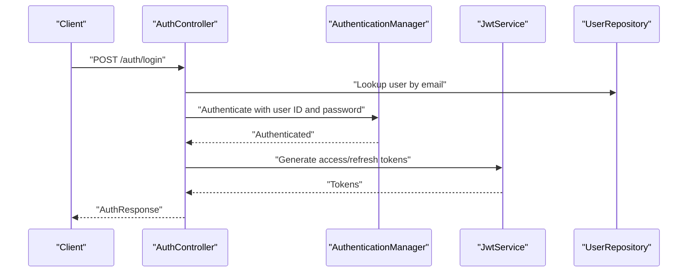
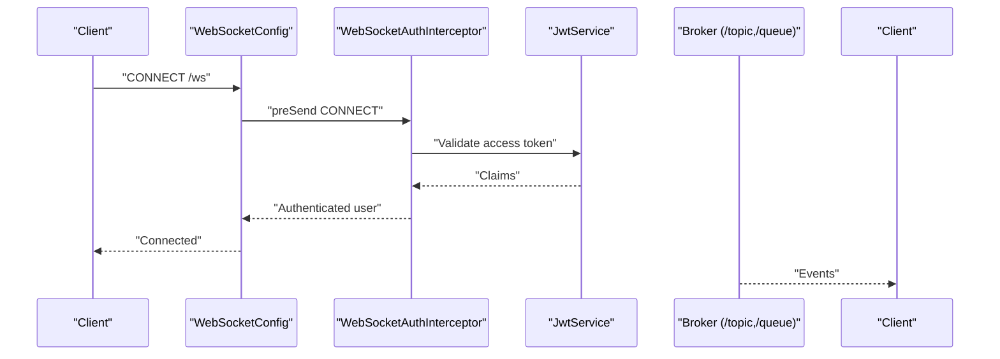
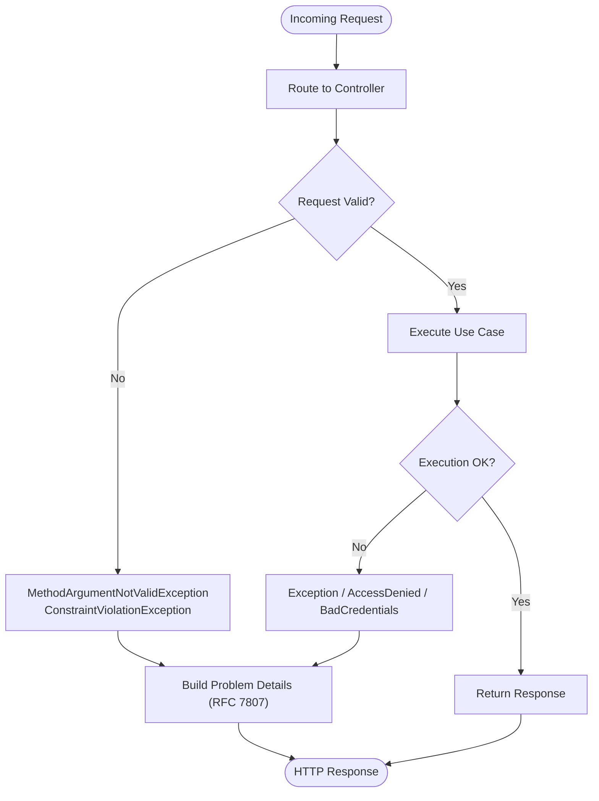
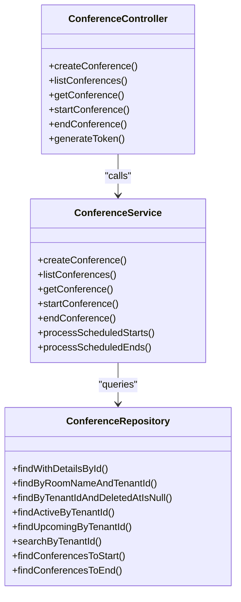
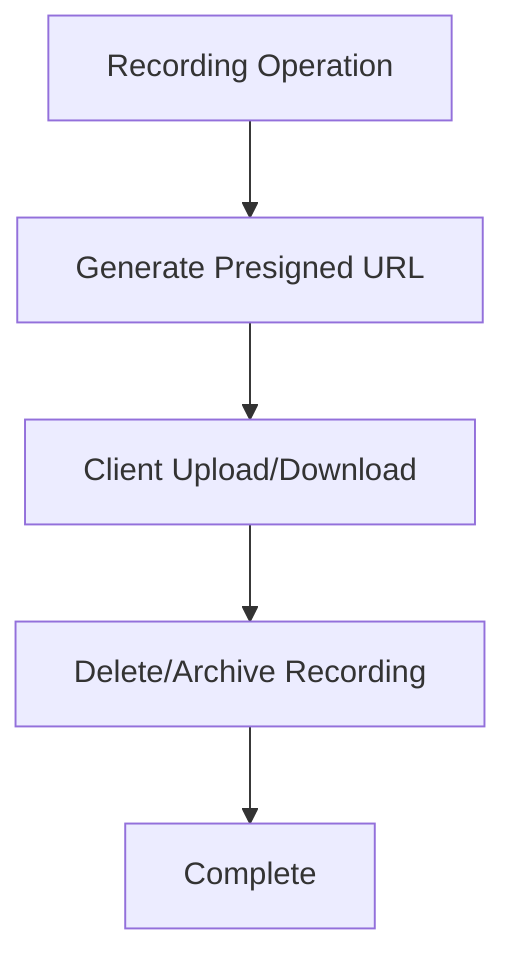
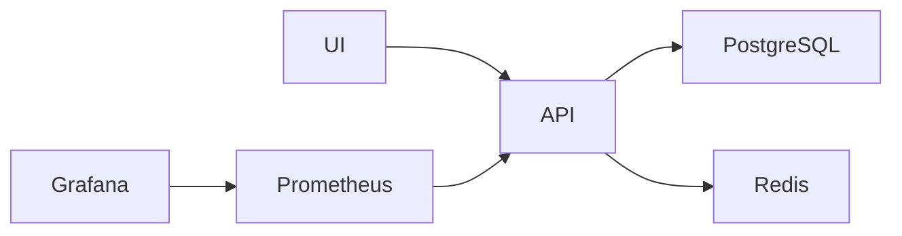

# Troubleshooting and FAQ

<cite>
**Referenced Files in This Document**
- [application.yml](file://jmp-web/src/main/resources/application.yml)
- [docker-compose.yml](file://docker-compose.yml)
- [Dockerfile](file://Dockerfile)
- [GlobalExceptionHandler.java](file://jmp-api/src/main/java/com/jmp/api/advice/GlobalExceptionHandler.java)
- [SecurityConfig.java](file://jmp-infrastructure/src/main/java/com/jmp/infrastructure/security/SecurityConfig.java)
- [WebSocketConfig.java](file://jmp-infrastructure/src/main/java/com/jmp/infrastructure/websocket/WebSocketConfig.java)
- [WebSocketAuthInterceptor.java](file://jmp-infrastructure/src/main/java/com/jmp/infrastructure/websocket/WebSocketAuthInterceptor.java)
- [RealtimeEventService.java](file://jmp-infrastructure/src/main/java/com/jmp/infrastructure/websocket/RealtimeEventService.java)
- [S3StorageService.java](file://jmp-infrastructure/src/main/java/com/jmp/infrastructure/storage/S3StorageService.java)
- [AuthController.java](file://jmp-api/src/main/java/com/jmp/api/controller/AuthController.java)
- [ConferenceController.java](file://jmp-api/src/main/java/com/jmp/api/controller/ConferenceController.java)
- [ConferenceService.java](file://jmp-application/src/main/java/com/jmp/application/service/ConferenceService.java)
- [ConferenceRepository.java](file://jmp-domain/src/main/java/com/jmp/domain/repository/ConferenceRepository.java)
- [prometheus.yml](file://monitoring/prometheus.yml)
- [datasources.yml](file://monitoring/grafana/datasources/datasources.yml)
</cite>

## Table of Contents
1. [Introduction](#introduction)
2. [Project Structure](#project-structure)
3. [Core Components](#core-components)
4. [Architecture Overview](#architecture-overview)
5. [Detailed Component Analysis](#detailed-component-analysis)
6. [Dependency Analysis](#dependency-analysis)
7. [Performance Considerations](#performance-considerations)
8. [Troubleshooting Guide](#troubleshooting-guide)
9. [FAQ](#faq)
10. [Conclusion](#conclusion)

## Introduction
This document provides comprehensive troubleshooting and FAQ guidance for the Jitsi Management Platform (JMP). It covers operational diagnostics for database connectivity, authentication, WebSocket real-time channels, API errors, performance, deployments, integrations, and debugging. It also includes escalation procedures and support resources for complex issues.

## Project Structure
The platform is a Spring Boot microservice with:
- Web/API layer exposing REST endpoints and Swagger/OpenAPI docs
- Application services orchestrating domain logic
- Domain entities and repositories for persistence
- Infrastructure for security, WebSocket messaging, and storage
- Monitoring stack (Prometheus and Grafana)
- Docker-based deployment with docker-compose

**Diagram sources**
- [docker-compose.yml:1-129](file://docker-compose.yml#L1-L129)
- [Dockerfile:1-54](file://Dockerfile#L1-L54)
- [application.yml:1-128](file://jmp-web/src/main/resources/application.yml#L1-L128)
- [prometheus.yml:1-23](file://monitoring/prometheus.yml#L1-L23)
- [datasources.yml:1-11](file://monitoring/grafana/datasources/datasources.yml#L1-L11)

**Section sources**
- [docker-compose.yml:1-129](file://docker-compose.yml#L1-L129)
- [Dockerfile:1-54](file://Dockerfile#L1-L54)
- [application.yml:1-128](file://jmp-web/src/main/resources/application.yml#L1-L128)

## Core Components
- REST API with centralized exception handling returning standardized Problem Details
- Spring Security with stateless JWT authentication and CORS configuration
- WebSocket real-time messaging with STOMP over SockJS and JWT-based authentication
- S3-compatible storage integration for recordings with pre-signed URLs
- Conference management service with transactional operations and repository queries
- Monitoring via Actuator Prometheus exports and Grafana dashboards

**Section sources**
- [GlobalExceptionHandler.java:1-130](file://jmp-api/src/main/java/com/jmp/api/advice/GlobalExceptionHandler.java#L1-L130)
- [SecurityConfig.java:1-90](file://jmp-infrastructure/src/main/java/com/jmp/infrastructure/security/SecurityConfig.java#L1-L90)
- [WebSocketConfig.java:1-70](file://jmp-infrastructure/src/main/java/com/jmp/infrastructure/websocket/WebSocketConfig.java#L1-L70)
- [WebSocketAuthInterceptor.java:1-94](file://jmp-infrastructure/src/main/java/com/jmp/infrastructure/websocket/WebSocketAuthInterceptor.java#L1-L94)
- [RealtimeEventService.java:1-142](file://jmp-infrastructure/src/main/java/com/jmp/infrastructure/websocket/RealtimeEventService.java#L1-L142)
- [S3StorageService.java:1-129](file://jmp-infrastructure/src/main/java/com/jmp/infrastructure/storage/S3StorageService.java#L1-L129)
- [ConferenceService.java:1-225](file://jmp-application/src/main/java/com/jmp/application/service/ConferenceService.java#L1-L225)
- [ConferenceRepository.java:1-110](file://jmp-domain/src/main/java/com/jmp/domain/repository/ConferenceRepository.java#L1-L110)

## Architecture Overview
High-level runtime architecture and data/control flows:

**Diagram sources**
- [AuthController.java:1-124](file://jmp-api/src/main/java/com/jmp/api/controller/AuthController.java#L1-L124)
- [SecurityConfig.java:1-90](file://jmp-infrastructure/src/main/java/com/jmp/infrastructure/security/SecurityConfig.java#L1-L90)
- [WebSocketConfig.java:1-70](file://jmp-infrastructure/src/main/java/com/jmp/infrastructure/websocket/WebSocketConfig.java#L1-L70)
- [WebSocketAuthInterceptor.java:1-94](file://jmp-infrastructure/src/main/java/com/jmp/infrastructure/websocket/WebSocketAuthInterceptor.java#L1-L94)
- [ConferenceRepository.java:1-110](file://jmp-domain/src/main/java/com/jmp/domain/repository/ConferenceRepository.java#L1-L110)

## Detailed Component Analysis

### Authentication and Authorization
Common symptoms:
- Login fails with invalid credentials
- Access denied after successful login
- Token refresh errors

Diagnostic steps:
- Verify JWT secrets and expiration settings
- Confirm authentication manager and password encoder configuration
- Check CORS origins and credentials policy
- Review logs for BadCredentialsException and AccessDeniedException

**Diagram sources**
- [AuthController.java:1-124](file://jmp-api/src/main/java/com/jmp/api/controller/AuthController.java#L1-L124)
- [SecurityConfig.java:1-90](file://jmp-infrastructure/src/main/java/com/jmp/infrastructure/security/SecurityConfig.java#L1-L90)

**Section sources**
- [AuthController.java:1-124](file://jmp-api/src/main/java/com/jmp/api/controller/AuthController.java#L1-L124)
- [SecurityConfig.java:1-90](file://jmp-infrastructure/src/main/java/com/jmp/infrastructure/security/SecurityConfig.java#L1-L90)
- [GlobalExceptionHandler.java:1-130](file://jmp-api/src/main/java/com/jmp/api/advice/GlobalExceptionHandler.java#L1-L130)

### WebSocket Real-Time Events
Common symptoms:
- Clients cannot connect to WebSocket endpoint
- Subscriptions receive no events
- Authentication failures in WebSocket CONNECT

Diagnostic steps:
- Verify STOMP endpoint registration and allowed origins
- Confirm JWT extraction from Authorization header or SockJS login
- Check broker destinations and message converters
- Inspect RealtimeEventService error logging for send failures

**Diagram sources**
- [WebSocketConfig.java:1-70](file://jmp-infrastructure/src/main/java/com/jmp/infrastructure/websocket/WebSocketConfig.java#L1-L70)
- [WebSocketAuthInterceptor.java:1-94](file://jmp-infrastructure/src/main/java/com/jmp/infrastructure/websocket/WebSocketAuthInterceptor.java#L1-L94)
- [RealtimeEventService.java:1-142](file://jmp-infrastructure/src/main/java/com/jmp/infrastructure/websocket/RealtimeEventService.java#L1-L142)

**Section sources**
- [WebSocketConfig.java:1-70](file://jmp-infrastructure/src/main/java/com/jmp/infrastructure/websocket/WebSocketConfig.java#L1-L70)
- [WebSocketAuthInterceptor.java:1-94](file://jmp-infrastructure/src/main/java/com/jmp/infrastructure/websocket/WebSocketAuthInterceptor.java#L1-L94)
- [RealtimeEventService.java:1-142](file://jmp-infrastructure/src/main/java/com/jmp/infrastructure/websocket/RealtimeEventService.java#L1-L142)

### API Error Handling and Logging
- GlobalExceptionHandler returns RFC 7807 Problem Details with structured error metadata
- Logs include trace IDs and timestamps for correlation
- Validation errors return field-specific details

**Diagram sources**
- [GlobalExceptionHandler.java:1-130](file://jmp-api/src/main/java/com/jmp/api/advice/GlobalExceptionHandler.java#L1-L130)
- [application.yml:80-128](file://jmp-web/src/main/resources/application.yml#L80-L128)

**Section sources**
- [GlobalExceptionHandler.java:1-130](file://jmp-api/src/main/java/com/jmp/api/advice/GlobalExceptionHandler.java#L1-L130)
- [application.yml:80-128](file://jmp-web/src/main/resources/application.yml#L80-L128)

### Conference Management and Data Layer
- Conference operations are transactional with strict state transitions
- Repository queries leverage EntityGraphs and JPQL for performance
- Auto-start/end scheduling runs in service layer

**Diagram sources**
- [ConferenceController.java:1-189](file://jmp-api/src/main/java/com/jmp/api/controller/ConferenceController.java#L1-L189)
- [ConferenceService.java:1-225](file://jmp-application/src/main/java/com/jmp/application/service/ConferenceService.java#L1-L225)
- [ConferenceRepository.java:1-110](file://jmp-domain/src/main/java/com/jmp/domain/repository/ConferenceRepository.java#L1-L110)

**Section sources**
- [ConferenceController.java:1-189](file://jmp-api/src/main/java/com/jmp/api/controller/ConferenceController.java#L1-L189)
- [ConferenceService.java:1-225](file://jmp-application/src/main/java/com/jmp/application/service/ConferenceService.java#L1-L225)
- [ConferenceRepository.java:1-110](file://jmp-domain/src/main/java/com/jmp/domain/repository/ConferenceRepository.java#L1-L110)

### Storage Integration (S3-Compatible)
- Pre-signed URLs for uploads/downloads
- Optional endpoint override for MinIO or compatible services
- Deletion and archival placeholders

**Diagram sources**
- [S3StorageService.java:1-129](file://jmp-infrastructure/src/main/java/com/jmp/infrastructure/storage/S3StorageService.java#L1-L129)

**Section sources**
- [S3StorageService.java:1-129](file://jmp-infrastructure/src/main/java/com/jmp/infrastructure/storage/S3StorageService.java#L1-L129)

## Dependency Analysis
Runtime dependencies and health checks:
- API depends on PostgreSQL and Redis
- UI depends on API
- Prometheus scrapes API metrics
- Grafana consumes Prometheus data

**Diagram sources**
- [docker-compose.yml:1-129](file://docker-compose.yml#L1-L129)
- [prometheus.yml:1-23](file://monitoring/prometheus.yml#L1-L23)
- [datasources.yml:1-11](file://monitoring/grafana/datasources/datasources.yml#L1-L11)

**Section sources**
- [docker-compose.yml:1-129](file://docker-compose.yml#L1-L129)
- [prometheus.yml:1-23](file://monitoring/prometheus.yml#L1-L23)
- [datasources.yml:1-11](file://monitoring/grafana/datasources/datasources.yml#L1-L11)

## Performance Considerations
- Database pooling and timeouts: tune maximum pool size and connection timeouts
- SQL batching and ordering: Hibernate batch settings reduce overhead
- Open session in view disabled: avoid long transactions
- Metrics and tracing: enable structured logging and Prometheus exports
- Caching: Redis configured for session/state caching
- Compression: Gzip enabled for JSON responses

Recommendations:
- Monitor slow SQL via database logs and JDBC statistics
- Scale Redis and PostgreSQL independently based on workload
- Use pagination and indexed queries for large datasets
- Profile heap and GC with JVM metrics exposed to Prometheus/Grafana

**Section sources**
- [application.yml:12-56](file://jmp-web/src/main/resources/application.yml#L12-L56)
- [application.yml:24-38](file://jmp-web/src/main/resources/application.yml#L24-L38)
- [application.yml:63-70](file://jmp-web/src/main/resources/application.yml#L63-L70)
- [application.yml:92-112](file://jmp-web/src/main/resources/application.yml#L92-L112)

## Troubleshooting Guide

### Database Connectivity Problems
Symptoms:
- Application startup fails with connection refused
- Queries time out or fail intermittently
- Flyway migration errors

Checklist:
- Confirm PostgreSQL container health and credentials
- Verify DB URL, user, and password environment variables
- Ensure migrations are applied (Flyway enabled)
- Review HikariCP pool settings and timeouts

Actions:
- Use docker-compose healthchecks to confirm DB readiness
- Increase connection timeout and pool size if needed
- Validate network connectivity inside containers

**Section sources**
- [docker-compose.yml:8-25](file://docker-compose.yml#L8-L25)
- [application.yml:12-23](file://jmp-web/src/main/resources/application.yml#L12-L23)
- [application.yml:39-44](file://jmp-web/src/main/resources/application.yml#L39-L44)

### Authentication Failures
Symptoms:
- 401 Unauthorized on protected endpoints
- 403 Forbidden due to insufficient roles
- Token refresh errors

Checklist:
- Verify JWT access/refresh secrets match across services
- Confirm password encoder cost factor and algorithm
- Check allowed CORS origins and credentials flag
- Review logs for BadCredentialsException and AccessDeniedException

Actions:
- Reissue tokens with correct secrets
- Align client-side token storage and headers
- Validate role claims in JWT

**Section sources**
- [application.yml:72-79](file://jmp-web/src/main/resources/application.yml#L72-L79)
- [SecurityConfig.java:64-88](file://jmp-infrastructure/src/main/java/com/jmp/infrastructure/security/SecurityConfig.java#L64-L88)
- [GlobalExceptionHandler.java:54-80](file://jmp-api/src/main/java/com/jmp/api/advice/GlobalExceptionHandler.java#L54-L80)

### WebSocket Connection Issues
Symptoms:
- Connection fails immediately
- Subscriptions do not receive events
- Authentication errors during CONNECT

Checklist:
- Confirm STOMP endpoint registration and allowed origin patterns
- Validate JWT presence in Authorization header or SockJS login param
- Ensure broker destinations and message converters are configured
- Inspect RealtimeEventService error logs for send failures

Actions:
- Test with native WebSocket and SockJS fallback
- Verify tenant/session attributes are set post-auth
- Check broker capacity and in-memory limits

**Section sources**
- [WebSocketConfig.java:42-50](file://jmp-infrastructure/src/main/java/com/jmp/infrastructure/websocket/WebSocketConfig.java#L42-L50)
- [WebSocketAuthInterceptor.java:33-73](file://jmp-infrastructure/src/main/java/com/jmp/infrastructure/websocket/WebSocketAuthInterceptor.java#L33-L73)
- [RealtimeEventService.java:88-101](file://jmp-infrastructure/src/main/java/com/jmp/infrastructure/websocket/RealtimeEventService.java#L88-L101)

### API Errors and Exceptions
Symptoms:
- Unexpected 500 Internal Server Error
- Validation errors with field details
- Access denied or unauthorized responses

Checklist:
- Review structured logs with trace IDs
- Inspect Problem Details responses for error codes
- Validate request payloads against DTO constraints

Actions:
- Correlate logs using trace_id
- Fix validation constraints or request shape
- Adjust permissions or roles

**Section sources**
- [GlobalExceptionHandler.java:26-128](file://jmp-api/src/main/java/com/jmp/api/advice/GlobalExceptionHandler.java#L26-L128)
- [application.yml:80-91](file://jmp-web/src/main/resources/application.yml#L80-L91)

### Performance Troubleshooting
Symptoms:
- Slow queries on conference listing/search
- Memory pressure or GC spikes
- Scalability bottlenecks under load

Checklist:
- Examine Prometheus metrics for latency and throughput
- Review database query plans and indexes
- Monitor Redis and PostgreSQL resource utilization
- Validate batching and ordering settings

Actions:
- Add missing indexes for frequent filters
- Tune HikariCP and Hibernate settings
- Scale horizontally with multiple API instances
- Use read replicas for reporting queries

**Section sources**
- [prometheus.yml:18-22](file://monitoring/prometheus.yml#L18-L22)
- [ConferenceRepository.java:48-72](file://jmp-domain/src/main/java/com/jmp/domain/repository/ConferenceRepository.java#L48-L72)
- [application.yml:24-38](file://jmp-web/src/main/resources/application.yml#L24-L38)

### Deployment Troubleshooting
Symptoms:
- Container fails health checks
- Port conflicts or misconfiguration
- Service dependencies not ready

Checklist:
- Verify docker-compose healthchecks for DB and Redis
- Confirm environment variables for DB and Redis URLs
- Ensure API waits for dependencies before starting
- Check network isolation and volume mounts

Actions:
- Run docker-compose up with verbose logs
- Adjust healthcheck thresholds and start periods
- Validate ENTRYPOINT and EXPOSE in Dockerfile

**Section sources**
- [docker-compose.yml:59-71](file://docker-compose.yml#L59-L71)
- [Dockerfile:47-51](file://Dockerfile#L47-L51)
- [application.yml:45-50](file://jmp-web/src/main/resources/application.yml#L45-L50)

### Integration Troubleshooting
Symptoms:
- S3 pre-signed URL generation fails
- Recording deletion or archival not working
- Jitsi server connectivity issues

Checklist:
- Validate S3 bucket, region, and credentials
- Confirm endpoint override for MinIO-compatible services
- Test pre-signed URL expiry and permissions
- Verify Jitsi domain and JWT token generation

Actions:
- Generate short-lived pre-signed URLs for testing
- Use AWS CLI or S3 browser to validate bucket access
- Validate Jitsi domain resolution and TLS

**Section sources**
- [S3StorageService.java:32-59](file://jmp-infrastructure/src/main/java/com/jmp/infrastructure/storage/S3StorageService.java#L32-L59)
- [ConferenceController.java:140-173](file://jmp-api/src/main/java/com/jmp/api/controller/ConferenceController.java#L140-L173)

### Debugging Guides
Frontend:
- Inspect browser network tab for failed requests
- Verify API base URL and CORS headers
- Check local storage for tokens

Backend:
- Enable debug logging for com.jmp and Spring Security
- Use curl or Postman to reproduce issues
- Inspect Actuator endpoints for health and metrics

Real-time:
- Connect with a WebSocket client (wscat or browser devtools)
- Verify STOMP frames and subscriptions
- Confirm JWT propagation in CONNECT headers

**Section sources**
- [application.yml:80-91](file://jmp-web/src/main/resources/application.yml#L80-L91)
- [WebSocketConfig.java:42-50](file://jmp-infrastructure/src/main/java/com/jmp/infrastructure/websocket/WebSocketConfig.java#L42-L50)

## FAQ

Q1: What are the system requirements?
- Java 21 runtime
- Docker and docker-compose for containerized deployment
- PostgreSQL 16 and Redis 7 for dependencies
- Minimum RAM/CPU scales with expected concurrency

Q2: How do I configure JWT secrets?
- Set access and refresh token secrets via environment variables
- Keep secrets consistent across services

Q3: How do I enable structured logging?
- Console logging format is JSON; adjust levels as needed

Q4: How do I expose metrics to Prometheus?
- Actuator Prometheus endpoint is enabled; Prometheus scrapes /actuator/prometheus

Q5: How do I scale the system?
- Scale API horizontally; separate DB and Redis scaling per workload
- Use multiple API replicas behind a reverse proxy

Q6: How do I integrate with S3-compatible storage?
- Provide bucket, region, and credentials; optionally set endpoint for MinIO

Q7: How do I troubleshoot slow conference queries?
- Use paginated endpoints and search filters
- Ensure proper indexing on tenant and status fields

Q8: How do I fix CORS issues?
- Allowlist origins for UI ports and enable credentials

Q9: How do I validate WebSocket connections?
- Test both native WebSocket and SockJS fallback
- Ensure Authorization header contains a valid Bearer token

Q10: How do I escalate complex issues?
- Collect logs with trace IDs, request/response payloads, and metrics snapshots
- Open a ticket with environment details and reproduction steps

**Section sources**
- [application.yml:72-128](file://jmp-web/src/main/resources/application.yml#L72-L128)
- [docker-compose.yml:1-129](file://docker-compose.yml#L1-L129)
- [prometheus.yml:18-22](file://monitoring/prometheus.yml#L18-L22)

## Conclusion
This guide consolidates actionable troubleshooting steps, diagnostic techniques, and FAQs for the Jitsi Management Platform. By leveraging structured logging, standardized error responses, health checks, and the monitoring stack, most issues can be quickly identified and resolved. For persistent or complex problems, collect comprehensive logs and metrics, and follow the escalation procedures outlined above.