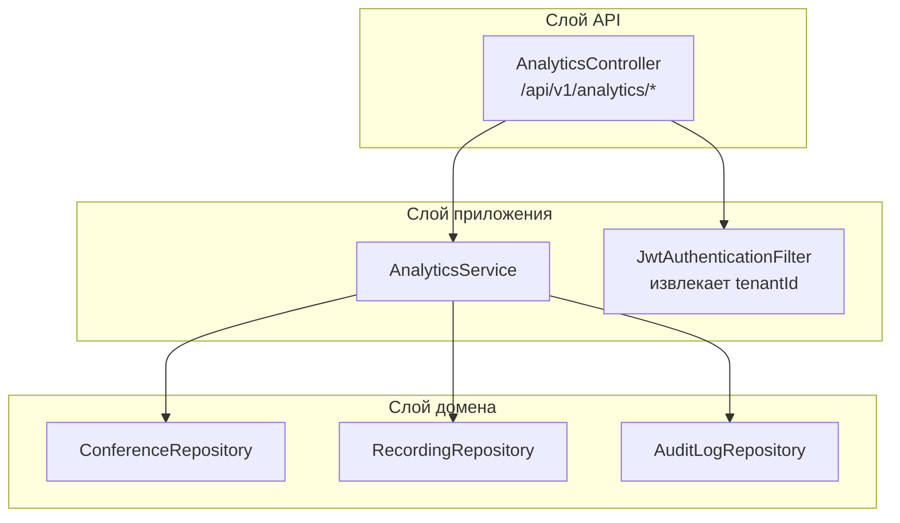
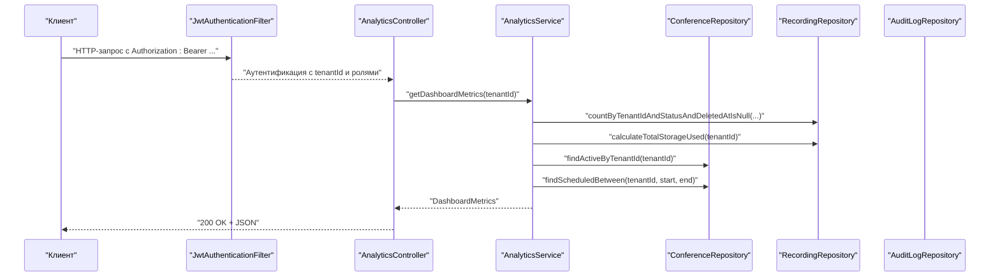
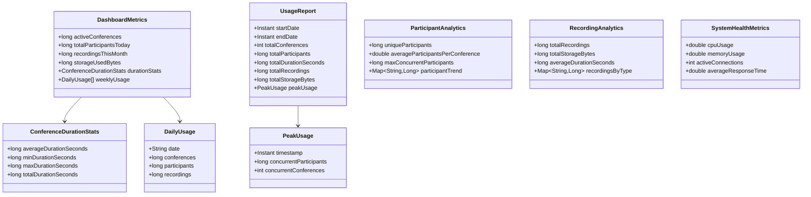
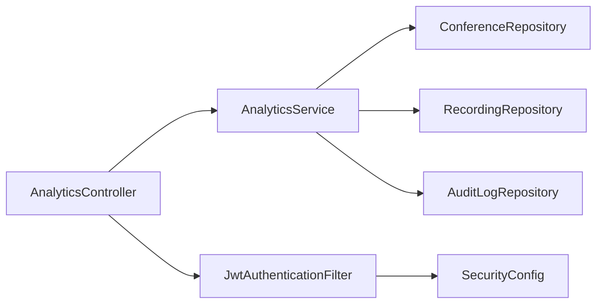

# API аналитики и отчетности

<cite>
**Файлы, упоминаемые в данном документе**
- [AnalyticsController.java](file://jmp-api/src/main/java/com/jmp/api/controller/AnalyticsController.java)
- [AnalyticsService.java](file://jmp-application/src/main/java/com/jmp/application/service/AnalyticsService.java)
- [JwtAuthenticationFilter.java](file://jmp-infrastructure/src/main/java/com/jmp/infrastructure/security/JwtAuthenticationFilter.java)
- [SecurityConfig.java](file://jmp-infrastructure/src/main/java/com/jmp/infrastructure/security/SecurityConfig.java)
- [OpenApiConfig.java](file://jmp-api/src/main/java/com/jmp/api/config/OpenApiConfig.java)
- [application.yml](file://jmp-web/src/main/resources/application.yml)
- [ConferenceRepository.java](file://jmp-domain/src/main/java/com/jmp/domain/repository/ConferenceRepository.java)
- [RecordingRepository.java](file://jmp-domain/src/main/java/com/jmp/domain/repository/RecordingRepository.java)
- [AuditLogRepository.java](file://jmp-domain/src/main/java/com/jmp/domain/repository/AuditLogRepository.java)
- [GlobalExceptionHandler.java](file://jmp-api/src/main/java/com/jmp/api/advice/GlobalExceptionHandler.java)
</cite>

## Содержание
1. [Введение](#введение)
2. [Структура проекта](#структура-проекта)
3. [Основные компоненты](#основные-компоненты)
4. [Обзор архитектуры](#обзор-архитектуры)
5. [Детальный анализ компонентов](#детальный-анализ-компонентов)
6. [Анализ зависимостей](#анализ-зависимостей)
7. [Рекомендации по производительности](#рекомендации-по-производительности)
8. [Руководство по устранению неполадок](#руководство-по-устранению-неполадок)
9. [Заключение](#заключение)
10. [Приложения](#приложения)

## Введение
Данный документ содержит подробную документацию API для эндпоинтов аналитики и отчетности. Он охватывает метрики дашборда, аналитику использования, аналитику участников, аналитику записей и метрики здоровья системы. Также документированы схемы запросов/ответов, временные ряды данных, фильтрация по тенанту и заглушки для пагинации и экспорта. Включены рекомендации по кэшированию и оптимизации производительности.

## Структура проекта
Модуль аналитики охватывает три слоя:
- Слой API: REST-эндпоинты, предоставляемые AnalyticsController
- Слой приложения: бизнес-логика, инкапсулированная в AnalyticsService
- Слой домена: репозитории для сущностей Conference, Recording и AuditLog

**Источники диаграмм**
- [AnalyticsController.java:36-87](file://jmp-api/src/main/java/com/jmp/api/controller/AnalyticsController.java#L36-L87)
- [AnalyticsService.java:31-33](file://jmp-application/src/main/java/com/jmp/application/service/AnalyticsService.java#L31-L33)
- [JwtAuthenticationFilter.java:99-120](file://jmp-infrastructure/src/main/java/com/jmp/infrastructure/security/JwtAuthenticationFilter.java#L99-L120)
- [ConferenceRepository.java:21-109](file://jmp-domain/src/main/java/com/jmp/domain/repository/ConferenceRepository.java#L21-L109)
- [RecordingRepository.java:20-99](file://jmp-domain/src/main/java/com/jmp/domain/repository/RecordingRepository.java#L20-L99)
- [AuditLogRepository.java:19-84](file://jmp-domain/src/main/java/com/jmp/domain/repository/AuditLogRepository.java#L19-L84)

**Источники раздела**
- [AnalyticsController.java:26-31](file://jmp-api/src/main/java/com/jmp/api/controller/AnalyticsController.java#L26-L31)
- [AnalyticsService.java:25-28](file://jmp-application/src/main/java/com/jmp/application/service/AnalyticsService.java#L25-L28)
- [JwtAuthenticationFilter.java:27-37](file://jmp-infrastructure/src/main/java/com/jmp/infrastructure/security/JwtAuthenticationFilter.java#L27-L37)

## Основные компоненты
- AnalyticsController: предоставляет GET-эндпоинты для метрик дашборда, отчетов об использовании, аналитики участников, аналитики записей и метрик здоровья системы. Использует авторизацию на основе ролей и извлекает tenantId из JWT claims.
- AnalyticsService: агрегирует метрики с использованием репозиториев. Предоставляет record-классы для схем ответов.
- Репозитории: ConferenceRepository, RecordingRepository и AuditLogRepository определяют методы запросов, используемые AnalyticsService.
- Безопасность: JwtAuthenticationFilter внедряет tenantId и роли в детали Authentication; SecurityConfig обеспечивает stateless JWT-аутентификацию.

**Источники раздела**
- [AnalyticsController.java:36-87](file://jmp-api/src/main/java/com/jmp/api/controller/AnalyticsController.java#L36-L87)
- [AnalyticsService.java:38-145](file://jmp-application/src/main/java/com/jmp/application/service/AnalyticsService.java#L38-L145)
- [ConferenceRepository.java:40-108](file://jmp-domain/src/main/java/com/jmp/domain/repository/ConferenceRepository.java#L40-L108)
- [RecordingRepository.java:45-98](file://jmp-domain/src/main/java/com/jmp/domain/repository/RecordingRepository.java#L45-L98)
- [AuditLogRepository.java:44-78](file://jmp-domain/src/main/java/com/jmp/domain/repository/AuditLogRepository.java#L44-L78)
- [JwtAuthenticationFilter.java:99-120](file://jmp-infrastructure/src/main/java/com/jmp/infrastructure/security/JwtAuthenticationFilter.java#L99-L120)
- [SecurityConfig.java:42-61](file://jmp-infrastructure/src/main/java/com/jmp/infrastructure/security/SecurityConfig.java#L42-L61)

## Обзор архитектуры
Эндпоинты аналитики следуют многоуровневой архитектуре:
- Контроллеры обеспечивают авторизацию и делегируют задачи Сервисам
- Сервисы оркестрируют запросы к репозиториям и вычисляют агрегаты
- Репозитории инкапсулируют SQL/JPA-запросы
- Фильтр безопасности извлекает контекст тенанта из JWT

**Источники диаграмм**
- [AnalyticsController.java:36-44](file://jmp-api/src/main/java/com/jmp/api/controller/AnalyticsController.java#L36-L44)
- [AnalyticsService.java:38-64](file://jmp-application/src/main/java/com/jmp/application/service/AnalyticsService.java#L38-L64)
- [RecordingRepository.java:45-78](file://jmp-domain/src/main/java/com/jmp/domain/repository/RecordingRepository.java#L45-L78)
- [ConferenceRepository.java:48-92](file://jmp-domain/src/main/java/com/jmp/domain/repository/ConferenceRepository.java#L48-L92)
- [JwtAuthenticationFilter.java:99-120](file://jmp-infrastructure/src/main/java/com/jmp/infrastructure/security/JwtAuthenticationFilter.java#L99-L120)

## Детальный анализ компонентов

### Эндпоинты и схемы

#### GET /api/v1/analytics/dashboard
- Роли: TENANT_ADMIN, SUPER_ADMIN, AUDITOR
- Описание: Возвращает метрики дашборда для текущего тенанта
- Параметры пути: отсутствуют
- Параметры запроса: отсутствуют
- Ответ: DashboardMetrics
- Пример запроса:
  - curl -H "Authorization: Bearer <JWT>" https://api.jmp.example.com/api/v1/analytics/dashboard
- Ключи примера ответа:
  - activeConferences
  - totalParticipantsToday
  - recordingsThisMonth
  - storageUsedBytes
  - durationStats (averageDurationSeconds, minDurationSeconds, maxDurationSeconds, totalDurationSeconds)
  - weeklyUsage (список записей DailyUsage с date, conferences, participants, recordings)

Примечания:
- activeConferences и totalParticipantsToday в настоящее время являются заглушками
- weeklyUsage в настоящее время пуст в реализации

**Источники раздела**
- [AnalyticsController.java:36-44](file://jmp-api/src/main/java/com/jmp/api/controller/AnalyticsController.java#L36-L44)
- [AnalyticsService.java:38-64](file://jmp-application/src/main/java/com/jmp/application/service/AnalyticsService.java#L38-L64)
- [AnalyticsService.java:174-181](file://jmp-application/src/main/java/com/jmp/application/service/AnalyticsService.java#L174-L181)

#### GET /api/v1/analytics/usage-report
- Роли: TENANT_ADMIN, SUPER_ADMIN, AUDITOR
- Описание: Возвращает отчет об использовании для заданного диапазона дат
- Параметры пути: отсутствуют
- Параметры запроса:
  - startDate (обязательный, ISO date-time)
  - endDate (обязательный, ISO date-time)
- Ответ: UsageReport
- Пример запроса:
  - curl -H "Authorization: Bearer <JWT>" "https://api.jmp.example.com/api/v1/analytics/usage-report?startDate=2024-01-01T00:00:00Z&endDate=2024-01-31T23:59:59Z"
- Ключи примера ответа:
  - startDate
  - endDate
  - totalConferences (заглушка)
  - totalParticipants (заглушка)
  - totalDurationSeconds (заглушка)
  - totalRecordings
  - totalStorageBytes
  - peakUsage (timestamp, concurrentParticipants, concurrentConferences)

**Источники раздела**
- [AnalyticsController.java:46-56](file://jmp-api/src/main/java/com/jmp/api/controller/AnalyticsController.java#L46-L56)
- [AnalyticsService.java:70-92](file://jmp-application/src/main/java/com/jmp/application/service/AnalyticsService.java#L70-L92)
- [AnalyticsService.java:197-206](file://jmp-application/src/main/java/com/jmp/application/service/AnalyticsService.java#L197-L206)

#### GET /api/v1/analytics/participants
- Роли: TENANT_ADMIN, SUPER_ADMIN, AUDITOR
- Описание: Возвращает аналитику участников для заданного диапазона дат
- Параметры пути: отсутствуют
- Параметры запроса:
  - startDate (обязательный, ISO date-time)
  - endDate (обязательный, ISO date-time)
- Ответ: ParticipantAnalytics
- Ключи примера ответа:
  - uniqueParticipants
  - averageParticipantsPerConference
  - maxConcurrentParticipants
  - participantTrend (Map<String, Long>)

Примечания:
- participantTrend в настоящее время пуст в реализации

**Источники раздела**
- [AnalyticsController.java:58-68](file://jmp-api/src/main/java/com/jmp/api/controller/AnalyticsController.java#L58-L68)
- [AnalyticsService.java:97-106](file://jmp-application/src/main/java/com/jmp/application/service/AnalyticsService.java#L97-L106)
- [AnalyticsService.java:214-219](file://jmp-application/src/main/java/com/jmp/application/service/AnalyticsService.java#L214-L219)

#### GET /api/v1/analytics/recordings
- Роли: TENANT_ADMIN, SUPER_ADMIN, AUDITOR
- Описание: Возвращает аналитику записей для заданного диапазона дат
- Параметры пути: отсутствуют
- Параметры запроса:
  - startDate (обязательный, ISO date-time)
  - endDate (обязательный, ISO date-time)
- Ответ: RecordingAnalytics
- Ключи примера ответа:
  - totalRecordings
  - totalStorageBytes
  - averageDurationSeconds
  - recordingsByType (Map<String, Long>)

Примечания:
- recordingsByType в настоящее время пуст в реализации

**Источники раздела**
- [AnalyticsController.java:70-80](file://jmp-api/src/main/java/com/jmp/api/controller/AnalyticsController.java#L70-L80)
- [AnalyticsService.java:111-131](file://jmp-application/src/main/java/com/jmp/application/service/AnalyticsService.java#L111-L131)
- [AnalyticsService.java:221-226](file://jmp-application/src/main/java/com/jmp/application/service/AnalyticsService.java#L221-L226)

#### GET /api/v1/analytics/system-health
- Роли: SUPER_ADMIN
- Описание: Возвращает метрики здоровья системы
- Параметры пути: отсутствуют
- Параметры запроса: отсутствуют
- Ответ: SystemHealthMetrics
- Ключи примера ответа:
  - cpuUsage
  - memoryUsage
  - activeConnections
  - averageResponseTime

Примечания:
- Метрики в настоящее время являются заглушками; планируется интеграция с actuator

**Источники раздела**
- [AnalyticsController.java:82-87](file://jmp-api/src/main/java/com/jmp/api/controller/AnalyticsController.java#L82-L87)
- [AnalyticsService.java:136-145](file://jmp-application/src/main/java/com/jmp/application/service/AnalyticsService.java#L136-L145)
- [AnalyticsService.java:228-233](file://jmp-application/src/main/java/com/jmp/application/service/AnalyticsService.java#L228-L233)

### Схемы запросов/ответов

**Источники диаграмм**
- [AnalyticsService.java:174-233](file://jmp-application/src/main/java/com/jmp/application/service/AnalyticsService.java#L174-L233)

**Источники раздела**
- [AnalyticsService.java:174-233](file://jmp-application/src/main/java/com/jmp/application/service/AnalyticsService.java#L174-L233)

### Фильтрация и контекст тенанта
- Фильтрация по тенанту: Все эндпоинты аналитики извлекают tenantId из JWT claims, внедренных JwtAuthenticationFilter, и ограничивают запросы этим тенантом.
- Роли: Эндпоинты обеспечивают доступ на основе ролей с использованием аннотаций @PreAuthorize.
- Фильтрация по диапазону дат: Эндпоинты использования и участников принимают параметры запроса startDate и endDate.

**Источники раздела**
- [AnalyticsController.java:89-94](file://jmp-api/src/main/java/com/jmp/api/controller/AnalyticsController.java#L89-L94)
- [JwtAuthenticationFilter.java:99-120](file://jmp-infrastructure/src/main/java/com/jmp/infrastructure/security/JwtAuthenticationFilter.java#L99-L120)
- [SecurityConfig.java:49-58](file://jmp-infrastructure/src/main/java/com/jmp/infrastructure/security/SecurityConfig.java#L49-L58)

### Пагинация и экспорт
- Пагинация: Не реализована для эндпоинтов аналитики. Репозитории предоставляют методы с поддержкой Pageable, но слой сервиса не передает Pageable контроллеру.
- Экспорт: Не реализован. Явные эндпоинты экспорта отсутствуют.

Рекомендации:
- Добавить поддержку Pageable к эндпоинтам аналитики и передавать параметры запроса page и size.
- Добавить эндпоинты экспорта CSV/JSON для usage-report и аналитики участников.

**Источники раздела**
- [ConferenceRepository.java:38-38](file://jmp-domain/src/main/java/com/jmp/domain/repository/ConferenceRepository.java#L38-L38)
- [RecordingRepository.java:35-35](file://jmp-domain/src/main/java/com/jmp/domain/repository/RecordingRepository.java#L35-L35)
- [AuditLogRepository.java:24-24](file://jmp-domain/src/main/java/com/jmp/domain/repository/AuditLogRepository.java#L24-L24)

### Исторические тренды и отчетность по соответствию
- Исторические тренды: weeklyUsage является заглушкой; durationStats и peakUsage являются заглушками. Реализация агрегации временных рядов требует запросов с группировкой по датам в репозиториях.
- Отчетность по соответствию: AuditLogRepository поддерживает фильтрованный поиск по тенанту, пользователю, типу события и диапазону дат. Это может служить основой для отчетов по соответствию.

**Источники раздела**
- [AnalyticsService.java:149-170](file://jmp-application/src/main/java/com/jmp/application/service/AnalyticsService.java#L149-L170)
- [AuditLogRepository.java:44-58](file://jmp-domain/src/main/java/com/jmp/domain/repository/AuditLogRepository.java#L44-L58)

## Анализ зависимостей

**Источники диаграмм**
- [AnalyticsController.java:34-34](file://jmp-api/src/main/java/com/jmp/api/controller/AnalyticsController.java#L34-L34)
- [AnalyticsService.java:31-33](file://jmp-application/src/main/java/com/jmp/application/service/AnalyticsService.java#L31-L33)
- [JwtAuthenticationFilter.java:29-37](file://jmp-infrastructure/src/main/java/com/jmp/infrastructure/security/JwtAuthenticationFilter.java#L29-L37)
- [SecurityConfig.java:42-61](file://jmp-infrastructure/src/main/java/com/jmp/infrastructure/security/SecurityConfig.java#L42-L61)

**Источники раздела**
- [AnalyticsController.java:34-34](file://jmp-api/src/main/java/com/jmp/api/controller/AnalyticsController.java#L34-L34)
- [AnalyticsService.java:31-33](file://jmp-application/src/main/java/com/jmp/application/service/AnalyticsService.java#L31-L33)
- [JwtAuthenticationFilter.java:29-37](file://jmp-infrastructure/src/main/java/com/jmp/infrastructure/security/JwtAuthenticationFilter.java#L29-L37)
- [SecurityConfig.java:42-61](file://jmp-infrastructure/src/main/java/com/jmp/infrastructure/security/SecurityConfig.java#L42-L61)

## Рекомендации по производительности
- Текущая реализация:
  - Методы AnalyticsService аннотированы @Transactional(readOnly = true).
  - Некоторые метрики являются заглушками; фактическое вычисление требует агрегаций на уровне репозитория.
- Рекомендации:
  - Добавить индексы базы данных для tenantId, status, createdAt и scheduledStartAt для оптимизации аналитических запросов.
  - Внедрить кэширование для часто запрашиваемых метрик дашборда с использованием Redis, настроенного в spring.data.redis.
  - Использовать проекционные запросы для ограничения результирующих наборов для эндпоинтов временных рядов.
  - Применять пагинацию для больших наборов данных (см. раздел Пагинация).
  - Мониторить медленные запросы и рассмотреть материализованные сводки для метрик с высокой кардинальностью.

[Источники не требуются, так как этот раздел содержит общие рекомендации]

## Руководство по устранению неполадок
Распространенные проблемы и решения:
- Unauthorized/Forbidden:
  - Убедитесь, что заголовок Authorization содержит действительный Bearer-токен с соответствующими ролями.
  - Проверьте, что JWT содержит claim tenant_id и массив roles.
- Bad Request:
  - Проверьте, что startDate и endDate являются действительными значениями ISO date-time.
  - Убедитесь, что тело запроса соответствует ожидаемому JSON для любых POST-эндпоинтов (отсутствуют для аналитики).
- Internal Server Error:
  - Проверьте логи сервера на наличие stack traces.
  - Проверьте подключение к базе данных и запросы репозитория.

Обработка ошибок следует RFC 7807 Problem Details со стандартизированными полями.

**Источники раздела**
- [GlobalExceptionHandler.java:26-38](file://jmp-api/src/main/java/com/jmp/api/advice/GlobalExceptionHandler.java#L26-L38)
- [GlobalExceptionHandler.java:68-80](file://jmp-api/src/main/java/com/jmp/api/advice/GlobalExceptionHandler.java#L68-L80)
- [GlobalExceptionHandler.java:116-128](file://jmp-api/src/main/java/com/jmp/api/advice/GlobalExceptionHandler.java#L116-L128)

## Заключение
API аналитики и отчетности предоставляет базовые эндпоинты для метрик дашборда, отчетов об использовании, аналитики участников, аналитики записей и здоровья системы. Хотя некоторые метрики являются заглушками, лежащий в основе слой репозитория и модель безопасности с учетом тенанта обеспечивают надежное расширение. Реализация пагинации, экспорта, агрегации исторических трендов и кэширования значительно улучшит удобство использования и производительность.

## Приложения

### Метаданные API и безопасность
- Базовый URL: См. серверы в конфигурации OpenAPI
- Аутентификация: Bearer JWT
- Авторизация: Доступ на основе ролей для каждого эндпоинта
- CORS: Настроен для development-источников

**Источники раздела**
- [OpenApiConfig.java:42-53](file://jmp-api/src/main/java/com/jmp/api/config/OpenApiConfig.java#L42-L53)
- [SecurityConfig.java:49-58](file://jmp-infrastructure/src/main/java/com/jmp/infrastructure/security/SecurityConfig.java#L49-L58)
- [application.yml:71-128](file://jmp-web/src/main/resources/application.yml#L71-L128)
